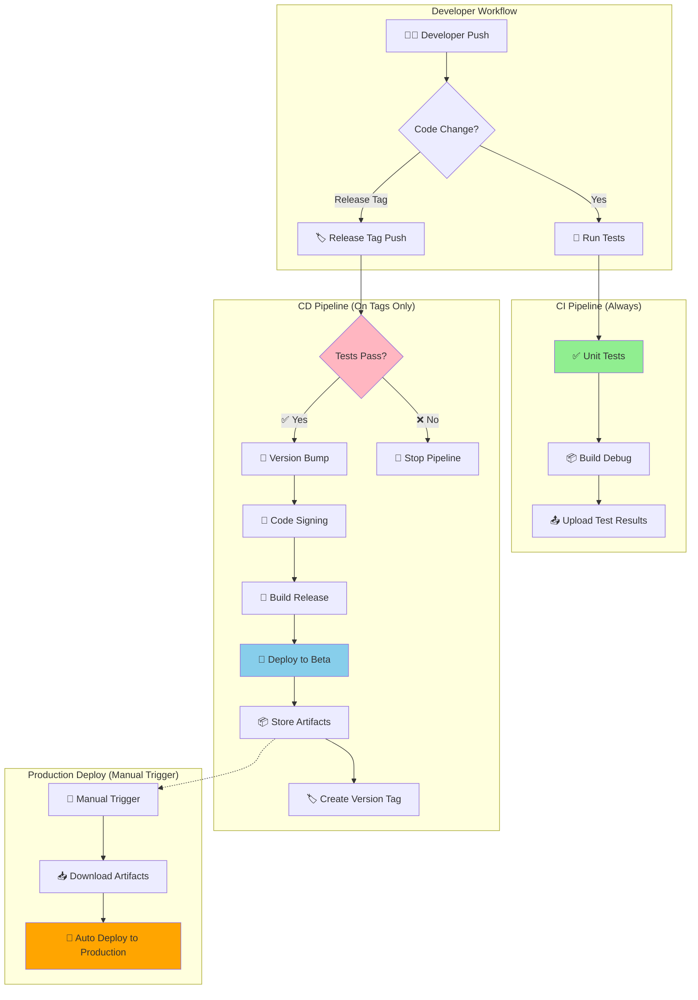
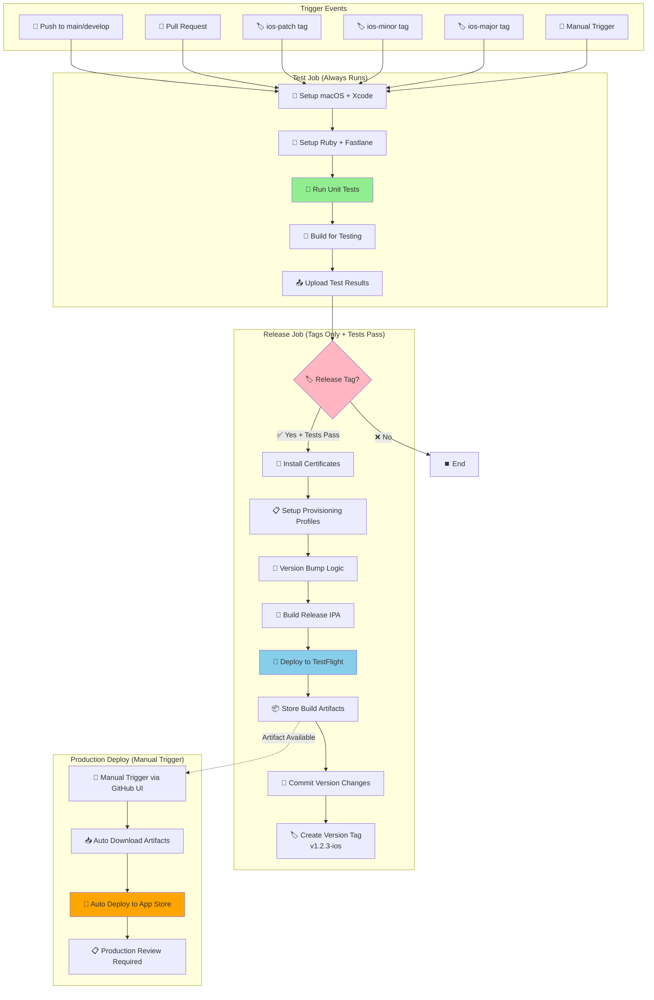
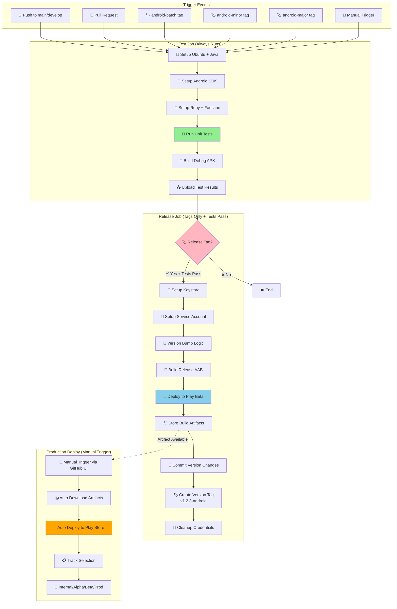
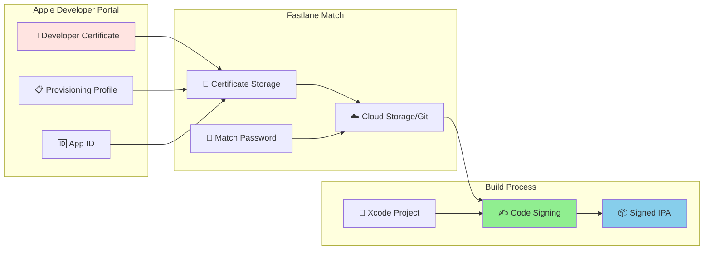
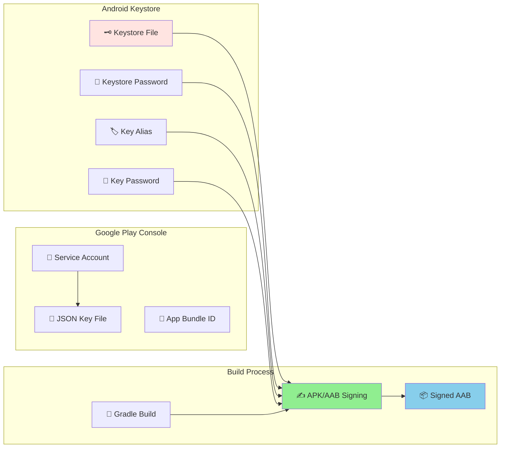
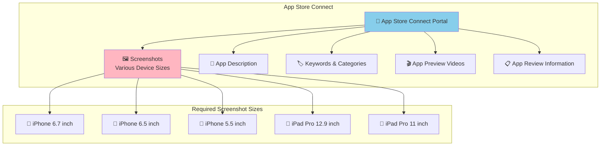
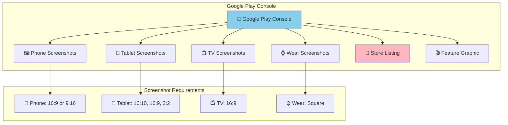

# Mobile App CI/CD Pipeline

This repository demonstrates a professional mobile CI/CD pipeline for iOS and Android applications using GitHub Actions and Fastlane. The pipeline follows DevOps best practices with separated build and deployment stages, quality gates, and artifact promotion.

## 📱 Apps Overview

- **iOS Hello World App**: Located in `ios-hello-world/`
- **Android Hello World App**: Located in `android-hello-world/`
- **Automated Deployment**: Using Fastlane and GitHub Actions
- **Store Deployment**: TestFlight/App Store (iOS) and Google Play Store (Android)

## 🏗️ CI/CD Architecture Overview



## 📊 iOS Pipeline Detailed Flow



## 🤖 Android Pipeline Detailed Flow



## 🔐 Binary Signing & Security

### iOS Code Signing



**iOS Signing Files Location:**
- **Certificates**: Managed by Fastlane Match (stored in cloud/git)
- **Provisioning Profiles**: Downloaded automatically during build
- **Configuration**: `ios-hello-world/fastlane/Matchfile` (if using Match)

**Platform Requirements:**
- **Building iOS Apps**: Requires macOS + Xcode (cannot be done on Linux)
- **Deploying Pre-built IPAs**: Can be done from Linux using:
  - Fastlane's `upload_to_app_store` action
  - App Store Connect API
  - Apple's Transporter tool (now available on Linux)

### Android Code Signing



**Android Signing Files Location:**
- **Keystore**: `android-keystore.jks` (created during build from base64 secret)
- **Service Account**: `google-play-service-account.json` (created during build)
- **Configuration**: `android-hello-world/app/build.gradle` (signing config)

## 📸 Screenshots & App Store Assets

### iOS App Store Connect

Screenshots and metadata are managed in App Store Connect:



**iOS Assets Location:**
- **Portal**: [App Store Connect](https://appstoreconnect.apple.com)
- **Screenshots**: Upload manually through web interface
- **Metadata**: Managed through App Store Connect or Fastlane's `deliver`

### Android Google Play Console



**Android Assets Location:**
- **Portal**: [Google Play Console](https://play.google.com/console)
- **Screenshots**: Upload through web interface
- **Metadata**: Managed through Play Console or Fastlane's `supply`

## 🚀 Developer Workflow Examples

### Quick Development Test

```bash
# Regular development - tests always run
git add .
git commit -m "Fix login bug"
git push origin develop

# ✅ Tests run automatically
# ✅ Build verification
# ❌ No deployment (no release tag)
```

### iOS Release Deployment

```bash
# Create iOS release
git checkout main
git pull origin main
git tag ios-patch          # or ios-minor, ios-major
git push origin ios-patch

# ✅ Tests run first
# ✅ Version bump: 1.0.0 → 1.0.1
# ✅ Build signed IPA
# ✅ Deploy to TestFlight
# ✅ Create version tag: v1.0.1-ios
# ✅ Store artifacts for production
```

### Android Release Deployment

```bash
# Create Android release  
git checkout main
git pull origin main
git tag android-minor       # or android-patch, android-major
git push origin android-minor

# ✅ Tests run first
# ✅ Version bump: 1.0.0 → 1.1.0
# ✅ Build signed AAB
# ✅ Deploy to Play Store Beta
# ✅ Create version tag: v1.1.0-android
# ✅ Store artifacts for production
```

### Production Deployment (Manual Trigger, Automated Execution)

**Manual Steps (Developer Action):**
1. **Go to GitHub Actions**
2. **Select deployment workflow:**
   - `iOS Deploy to App Store`
   - `Android Deploy to Play Store`
3. **Click "Run workflow"**
4. **Enter build number** (from previous build)
5. **Select environment:**
   - iOS: `testflight` or `production`
   - Android: `internal`, `alpha`, `beta`, or `production`
6. **Click "Run workflow"**

**Automated Steps (Pipeline Execution):**
- ✅ Downloads artifacts automatically
- ✅ Sets up signing certificates automatically
- ✅ Deploys to selected store/track automatically
- ✅ Handles all deployment steps without intervention

## 📁 Project Structure

```
📦 Mobile-App-CI-CD/
├── 📱 ios-hello-world/
│   ├── 🎯 HelloWorld.xcodeproj/        # Xcode project
│   ├── 📁 HelloWorld/                  # iOS source code
│   ├── 🚀 fastlane/                   # iOS deployment scripts
│   │   ├── Fastfile                   # Fastlane actions
│   │   └── Appfile                    # App configuration
│   └── 💎 Gemfile                     # Ruby dependencies
├── 🤖 android-hello-world/
│   ├── 📁 app/                        # Android source code
│   │   ├── build.gradle               # App build configuration
│   │   └── src/main/                  # Source files
│   ├── 🚀 fastlane/                   # Android deployment scripts
│   │   ├── Fastfile                   # Fastlane actions
│   │   └── Appfile                    # App configuration
│   ├── 🔧 build.gradle                # Project build configuration
│   └── 💎 Gemfile                     # Ruby dependencies
├── ⚙️ .github/workflows/              # CI/CD pipelines
│   ├── ios-build.yml                 # iOS build & test
│   ├── ios-deploy.yml                # iOS production deploy
│   ├── android-build.yml             # Android build & test
│   └── android-deploy.yml            # Android production deploy
├── 🔐 .envrc                         # Environment variables
├── 📖 README.md                      # This file
└── 📋 DEPLOYMENT.md                  # Detailed deployment guide
```

## 🎯 Key Benefits for DevOps

- **✅ Quality Gates**: Tests must pass before any deployment
- **🔄 Artifact Promotion**: Build once, deploy multiple times
- **🎯 Environment Separation**: Clear staging → production flow  
- **🔐 Security**: Credential management with auto-cleanup
- **📊 Audit Trail**: Version tags track every release
- **⚡ Fast Feedback**: Quick test results on every push
- **🛡️ Safe Deployments**: Manual approval for production
- **📈 Scalable**: Easy to add new environments or features

## 🖥️ Platform Considerations

### iOS Deployment Options

**Current Pipeline (macOS-based):**
- ✅ **Build + Deploy**: Complete pipeline on macOS runners
- ✅ **Full Integration**: Xcode, signing, TestFlight in one workflow

**Alternative: Linux-based Deployment** (for pre-built IPAs):
```yaml
# Example: Deploy pre-built iOS app from Linux
- name: Deploy to App Store (Linux)
  uses: apple-actions/upload-to-app-store@v1
  with:
    ipa-path: ./artifacts/app.ipa
    api-key: ${{ secrets.APP_STORE_CONNECT_API_KEY }}
```

**Trade-offs:**
- **macOS Runners**: More expensive but complete iOS toolchain
- **Linux Runners**: Cheaper but requires pre-built artifacts
- **Hybrid Approach**: Build on macOS, deploy from Linux (advanced setup)

### Android Deployment
- ✅ **Full Linux Support**: Complete build and deployment pipeline
- ✅ **Cost Effective**: Standard GitHub runners
- ✅ **Fast Execution**: No platform limitations

## 📚 Documentation

- **[DEPLOYMENT.md](DEPLOYMENT.md)**: Complete deployment setup guide
- **[GitHub Secrets Setup](DEPLOYMENT.md#github-secrets-configuration)**: Required secrets configuration
- **[Local Development](DEPLOYMENT.md#local-development)**: Local testing instructions
- **[Fastlane Documentation](https://docs.fastlane.tools/)**: Official Fastlane documentation and guides

---

**Perfect for DevOps interviews!** This pipeline demonstrates enterprise-level CI/CD practices with proper gates, security, and auditability.