# Automation Decision Matrix

Visual framework showing when to automate based on task duration (minutes) and frequency (times per year) with financial impact.

## 📊 Automation Decision Matrix


## 💰 Financial Impact Matrix

| Duration (min) | Daily (365x) | Weekly (52x) | Monthly (12x) | Quarterly (4x) | Yearly (1x) |
|----------------|--------------|---------------|---------------|----------------|-------------|
| **5 min** | $2,280 | $325 | $75 | $25 | $6 |
| **15 min** | $6,840 | $975 | $225 | $75 | $19 |
| **30 min** | $13,680 | $1,950 | $450 | $150 | $38 |
| **60 min** | $27,360 | $3,900 | $900 | $300 | $75 |
| **90 min** | $41,040 | $5,850 | $1,350 | $450 | $113 |
| **120 min** | $54,720 | $7,800 | $1,800 | $600 | $150 |
| **240 min** | $109,440 | $15,600 | $3,600 | $1,200 | $300 |

*Based on $75/hour developer rate*

## 🎯 Decision Zones

```mermaid
graph TB
    subgraph "AUTOMATE NOW - Annual Loss >$15K"
        A["📦 Daily Deploy 90min<br/>$41K/year lost"]
        B["🔄 Daily Backup 60min<br/>$27K/year lost"]
        C["📊 Weekly Report 60min<br/>$3.9K/year lost"]
    end

    subgraph "QUICK WINS - High Freq, Short Duration"
        D["📧 Daily Alerts 5min<br/>$2.3K/year lost"]
        E["📝 Weekly Updates 15min<br/>$975/year lost"]
        F["🔔 Daily Notifications 10min<br/>$1.8K/year lost"]
    end

    subgraph "CONSIDER - Medium Loss $1K-15K"
        G["📋 Monthly Reports 120min<br/>$1.8K/year lost"]
        H["🔍 Weekly Reviews 30min<br/>$1.95K/year lost"]
        I["📊 Monthly Analysis 90min<br/>$1.35K/year lost"]
    end

    subgraph "DON'T AUTOMATE - Low Loss <$1K"
        J["📝 Quarterly Review 240min<br/>$1.2K/year lost"]
        K["🔍 Annual Audit 480min<br/>$300/year lost"]
        L["📊 Monthly Check 30min<br/>$450/year lost"]
    end

    style A fill:#FF6B6B
    style B fill:#FF6B6B
    style D fill:#87CEEB
    style E fill:#87CEEB
    style G fill:#FFD700
    style H fill:#FFD700
    style J fill:#90EE90
    style K fill:#90EE90
```



## 📈 ROI Calculation

### Automation Costs vs Annual Savings

| Complexity | Setup Cost | Good For | Break-even Point |
|------------|------------|----------|------------------|
| **Simple Script** | $500-2K | <30min tasks | $2K+ annual loss |
| **Basic Tool** | $1K-5K | 30-60min tasks | $5K+ annual loss |
| **Integration** | $5K-15K | 60-120min tasks | $15K+ annual loss |
| **Custom Solution** | $15K+ | 120min+ tasks | $30K+ annual loss |

### Quick ROI Formula
```
Annual Loss = (Duration in hours) × (Frequency per year) × $75
ROI = (Annual Loss - Automation Cost) / Automation Cost × 100%
```

## 🚀 Real Examples with Numbers

### High Priority (AUTOMATE NOW)
```
📦 Daily App Deployment
- Duration: 90 minutes
- Frequency: 365 times/year
- Annual Loss: 90 × 365 × $1.25 = $41,040
- Automation Cost: $3,000
- ROI: 1,268% ✅

🔄 Daily Database Backup
- Duration: 60 minutes
- Frequency: 365 times/year
- Annual Loss: 60 × 365 × $1.25 = $27,360
- Automation Cost: $2,000
- ROI: 1,268% ✅
```


**Simple Rule**: If you're losing more than $5K per year doing it manually, automate it.
