# Fastlane Actions & Tools Reference

Complete reference guide for Fastlane actions and tools for iOS and Android platforms, including syntax, purpose, and authentication methods.

## 📋 Table of Contents

1. [Overview](#overview)
2. [iOS Fastlane Actions](#ios-fastlane-actions)
3. [Android Fastlane Actions](#android-fastlane-actions)
4. [Cross-Platform Actions](#cross-platform-actions)
5. [Authentication Methods](#authentication-methods)
6. [Common Usage Patterns](#common-usage-patterns)
7. [Best Practices](#best-practices)

## Overview

Fastlane provides platform-specific actions for iOS and Android deployment automation. Each platform has its own set of tools optimized for the respective app stores and development workflows.

### Platform Differences

```mermaid
graph TB
    subgraph "iOS Fastlane Actions"
        A[🍎 Apple Ecosystem]
        B[📱 App Store Connect]
        C[🔐 Apple Developer Portal]
        D[✈️ TestFlight]
        E[📜 Code Signing]
    end

    subgraph "Android Fastlane Actions"
        F[🤖 Google Ecosystem]
        G[🏪 Google Play Console]
        H[🔧 Gradle Integration]
        I[📦 AAB/APK Management]
        J[🔑 Service Account Auth]
    end

    subgraph "Authentication"
        K[🍎 Apple ID + App-Specific Password]
        L[🗝️ App Store Connect API Key]
        M[📄 Google Service Account JSON]
        N[🔐 Google Play API]
    end

    A --> K
    B --> L
    F --> M
    G --> N

    style A fill:#87CEEB
    style F fill:#90EE90
    style K fill:#FFB6C1
    style M fill:#FFD700
```



## iOS Fastlane Actions

### Core iOS Actions

| Action | Purpose | Apple ID | API Key | Example Usage |
|--------|---------|----------|---------|---------------|
| **pilot** | TestFlight upload & management | ✅ Yes | ✅ Yes | `pilot(skip_waiting_for_build_processing: true)` |
| **deliver** | App Store submission & metadata | ✅ Yes | ✅ Yes | `deliver(submit_for_review: false)` |
| **match** | Certificate & profile management | ✅ Yes | ✅ Yes | `match(type: "appstore")` |
| **cert** | Certificate management | ✅ Yes | ✅ Yes | `cert(development: true)` |
| **sigh** | Provisioning profile management | ✅ Yes | ✅ Yes | `sigh(force: true)` |

### iOS Build & Archive Actions

```ruby
# Build and archive iOS app
gym(
  scheme: "YourApp",
  configuration: "Release",
  clean: true,
  export_method: "app-store",
  output_directory: "./build"
)

# Version management
increment_build_number(xcodeproj: "YourApp.xcodeproj")
increment_version_number(bump_type: "patch")

# Get version information
version = get_version_number(xcodeproj: "YourApp.xcodeproj")
build = get_build_number(xcodeproj: "YourApp.xcodeproj")
```

### iOS Testing Actions

```ruby
# Run tests
scan(
  workspace: "YourApp.xcworkspace",
  scheme: "YourApp",
  clean: true,
  code_coverage: true
)

# Generate screenshots
snapshot(
  clear_previous_screenshots: true,
  override_status_bar: true
)
```

### iOS Certificate & Signing Actions

```ruby
# Match - Unified certificate management
match(
  type: "development",           # or "appstore", "adhoc"
  app_identifier: "com.app.id",
  git_url: "https://github.com/user/certificates"
)

# Manual certificate management
cert(
  development: false,            # false for distribution cert
  username: "developer@app.com"
)

# Provisioning profiles
sigh(
  app_identifier: "com.app.id",
  force: true,                   # recreate if exists
  filename: "MyApp_AppStore.mobileprovision"
)
```

### iOS Deployment Actions

```ruby
# TestFlight deployment
pilot(
  username: "developer@app.com",
  app_identifier: "com.app.id",
  skip_waiting_for_build_processing: true,
  distribute_external: false,
  groups: ["Internal Testers"],
  changelog: "Bug fixes and improvements"
)

# App Store deployment
deliver(
  username: "developer@app.com",
  app_identifier: "com.app.id",
  submit_for_review: false,
  automatic_release: false,
  force: true,
  metadata_path: "./fastlane/metadata",
  screenshots_path: "./fastlane/screenshots"
)
```

### iOS Utility Actions

```ruby
# App Store Connect utilities
produce(
  username: "developer@app.com",
  app_identifier: "com.app.id",
  app_name: "My App",
  language: "English",
  app_version: "1.0",
  sku: "MyApp001"
)

# Push notification certificates
pem(
  username: "developer@app.com",
  app_identifier: "com.app.id",
  development: false
)

# Download debug symbols
download_dsyms(
  username: "developer@app.com",
  app_identifier: "com.app.id",
  version: "latest"
)

# Get build number from App Store
app_store_build_number(
  username: "developer@app.com",
  app_identifier: "com.app.id"
)

# Precheck app before submission
precheck(
  username: "developer@app.com",
  app_identifier: "com.app.id"
)
```

## Android Fastlane Actions

### Core Android Actions

| Action | Purpose | Authentication | Example Usage |
|--------|---------|----------------|---------------|
| **supply** | Google Play upload & management | Service Account JSON | `supply(track: 'beta')` |
| **gradle** | Build Android app | Local Gradle | `gradle(task: "bundleRelease")` |
| **screengrab** | Generate screenshots | Device/Emulator | `screengrab(locales: ['en-US'])` |

### Android Build Actions

```ruby
# Gradle build
gradle(
  task: "clean bundleRelease",
  project_dir: "./android/",
  properties: {
    "android.injected.signing.store.file" => "keystore.jks",
    "android.injected.signing.store.password" => "password",
    "android.injected.signing.key.alias" => "key-alias",
    "android.injected.signing.key.password" => "key-password"
  }
)

# APK build
gradle(
  task: "assembleRelease",
  build_type: "Release"
)

# Debug build
gradle(
  task: "assembleDebug",
  build_type: "Debug"
)
```

### Android Version Management

```ruby
# Increment version code
increment_version_code(
  gradle_file_path: "app/build.gradle"
)

# Set version name
increment_version_name(
  gradle_file_path: "app/build.gradle",
  bump_type: "patch"  # or "minor", "major"
)

# Get version information
version_name = get_version_name(gradle_file_path: "app/build.gradle")
version_code = get_version_code(gradle_file_path: "app/build.gradle")
```

### Android Deployment Actions

```ruby
# Google Play deployment
supply(
  json_key: "path/to/service-account.json",
  package_name: "com.app.id",
  track: "beta",                          # or "alpha", "production"
  aab: "app/build/outputs/bundle/release/app-release.aab",
  skip_upload_apk: true,
  skip_upload_metadata: false,
  skip_upload_changelogs: false,
  skip_upload_images: false,
  skip_upload_screenshots: false
)

# Upload to specific track
supply(
  track: "internal",                      # internal testing
  release_status: "completed",            # or "draft", "inProgress"
  rollout: "0.1"                         # 10% rollout
)

# Promote build between tracks
supply(
  track: "beta",
  track_promote_to: "production",
  skip_upload_changelogs: true,
  skip_upload_metadata: true
)
```

### Android Screenshots

```ruby
# Generate screenshots
screengrab(
  locales: ["en-US", "es-ES", "fr-FR"],
  clear_previous_screenshots: true,
  use_tests_in_packages: ["com.app.screenshots"],
  app_package_name: "com.app.id",
  tests_package_name: "com.app.id.test"
)
```

### Android Testing

```ruby
# Run unit tests
gradle(task: "test")

# Run instrumentation tests
gradle(task: "connectedAndroidTest")

# Run specific test flavor
gradle(
  task: "testReleaseUnitTest",
  build_type: "Release"
)
```

## Cross-Platform Actions

### Common Actions Available for Both Platforms

```ruby
# Git operations
ensure_git_status_clean
ensure_git_branch(branch: 'main')
git_commit(path: ".", message: "Version bump")
add_git_tag(tag: "v1.0.0")
push_to_git_remote

# Notifications
slack(
  message: "Build completed successfully!",
  channel: "#releases",
  success: true
)

# Version control
last_git_commit_message
git_branch

# File operations
copy_artifacts(
  target_path: "artifacts/",
  artifacts: ["*.ipa", "*.aab"]
)

# Environment
is_ci
```

## Authentication Methods

### iOS Authentication Options

```mermaid
graph TB
    subgraph "Apple ID Authentication"
        A[🔐 Apple ID + Password]
        B[🔑 App-Specific Password]
        C[👤 Two-Factor Authentication]
    end

    subgraph "API Key Authentication"
        D[🗝️ App Store Connect API Key]
        E[📄 Private Key File p8]
        F[🆔 Key ID + Issuer ID]
    end

    subgraph "Environment Variables"
        G[FASTLANE_USER]
        H[FASTLANE_PASSWORD]
        I[FASTLANE_APPLE_APPLICATION_SPECIFIC_PASSWORD]
        J[APP_STORE_CONNECT_API_KEY_PATH]
        K[APP_STORE_CONNECT_API_KEY_ID]
        L[APP_STORE_CONNECT_ISSUER_ID]
    end

    A --> G
    B --> H
    B --> I
    D --> J
    E --> J
    F --> K
    F --> L

    style D fill:#90EE90
    style A fill:#FFD700
```



### iOS Authentication Setup

```ruby
# Method 1: Apple ID with App-Specific Password
ENV["FASTLANE_USER"] = "developer@app.com"
ENV["FASTLANE_PASSWORD"] = "app-specific-password"

# Method 2: App Store Connect API Key (Recommended)
ENV["APP_STORE_CONNECT_API_KEY_PATH"] = "AuthKey_ABC123DEF4.p8"
ENV["APP_STORE_CONNECT_API_KEY_ID"] = "ABC123DEF4"
ENV["APP_STORE_CONNECT_ISSUER_ID"] = "12345678-1234-1234-1234-123456789012"

# In Fastfile
pilot(
  api_key_path: "AuthKey_ABC123DEF4.p8",
  api_key_id: "ABC123DEF4",
  issuer_id: "12345678-1234-1234-1234-123456789012"
)
```

### Android Authentication Setup

```ruby
# Google Play Service Account
ENV["GOOGLE_PLAY_JSON_KEY"] = "path/to/service-account.json"

# In Fastfile
supply(
  json_key: "service-account.json",
  package_name: "com.app.id"
)

# Alternative: JSON content directly
supply(
  json_key_data: ENV["GOOGLE_PLAY_JSON_KEY_DATA"]
)
```

## Common Usage Patterns

### iOS Complete Deployment Lane

```ruby
lane :ios_release do
  ensure_git_status_clean
  ensure_git_branch(branch: 'main')
  
  # Certificate management
  match(type: "appstore")
  
  # Version bump
  increment_build_number(xcodeproj: "App.xcodeproj")
  
  # Build
  gym(
    scheme: "App",
    configuration: "Release",
    export_method: "app-store"
  )
  
  # Upload to TestFlight
  pilot(
    skip_waiting_for_build_processing: true,
    distribute_external: false
  )
  
  # Commit version bump
  version = get_version_number(xcodeproj: "App.xcodeproj")
  build = get_build_number(xcodeproj: "App.xcodeproj")
  git_commit(
    path: "App.xcodeproj",
    message: "Bump version to #{version} (#{build})"
  )
  push_to_git_remote
  
  # Create tag
  add_git_tag(tag: "v#{version}-#{build}")
  push_git_tags
end
```

### Android Complete Deployment Lane

```ruby
lane :android_release do
  ensure_git_status_clean
  ensure_git_branch(branch: 'main')
  
  # Version bump
  increment_version_code(gradle_file_path: "app/build.gradle")
  
  # Build
  gradle(
    task: "clean bundleRelease",
    properties: {
      "android.injected.signing.store.file" => ENV["KEYSTORE_PATH"],
      "android.injected.signing.store.password" => ENV["KEYSTORE_PASSWORD"],
      "android.injected.signing.key.alias" => ENV["KEY_ALIAS"],
      "android.injected.signing.key.password" => ENV["KEY_PASSWORD"]
    }
  )
  
  # Upload to Google Play beta
  supply(
    track: "beta",
    aab: lane_context[SharedValues::GRADLE_AAB_OUTPUT_PATH]
  )
  
  # Commit version bump
  version_name = get_version_name(gradle_file_path: "app/build.gradle")
  version_code = get_version_code(gradle_file_path: "app/build.gradle")
  git_commit(
    path: "app/build.gradle",
    message: "Bump version to #{version_name} (#{version_code})"
  )
  push_to_git_remote
  
  # Create tag
  add_git_tag(tag: "v#{version_name}-#{version_code}")
  push_git_tags
end
```

## Best Practices

### Error Handling

```ruby
error do |lane, exception|
  slack(
    message: "#{lane} failed: #{exception.message}",
    success: false
  )
  
  # Clean up
  reset_git_repo(force: true) if is_ci
end
```

### Conditional Actions

```ruby
# Platform-specific actions
if is_ci
  setup_ci
end

# iOS-specific in cross-platform Fastfile
if platform == :ios
  match(type: "appstore")
elsif platform == :android
  supply(track: "beta")
end
```

### Environment-Specific Configuration

```ruby
# Different behavior per environment
case ENV["ENVIRONMENT"]
when "staging"
  supply(track: "internal")
when "production"
  supply(track: "production")
else
  UI.user_error!("Unknown environment")
end
```

---

## Summary

### Key Differences

| Aspect | iOS | Android |
|--------|-----|---------|
| **Main Upload Tool** | `pilot` (TestFlight), `deliver` (App Store) | `supply` (Google Play) |
| **Build Tool** | `gym` (Xcode) | `gradle` (Android Gradle) |
| **Certificate Management** | `match`, `cert`, `sigh` | Keystore files |
| **Authentication** | Apple ID or API Key | Service Account JSON |
| **Screenshots** | `snapshot` | `screengrab` |
| **Version Management** | Xcode project files | `build.gradle` |

### Authentication Recommendations

- **iOS**: Use App Store Connect API Key for CI/CD (more reliable than Apple ID)
- **Android**: Use Google Service Account JSON (required for automation)

Both platforms support comprehensive automation but require platform-specific knowledge and setup procedures.