# Fastlane Android Google Play Store Deployment Guide

This guide covers Android Google Play Store deployment using Fastlane automation tools. Fastlane streamlines the entire Android deployment process, making it faster, more reliable, and accessible to teams while maintaining the security and quality standards required for Android app distribution.

## 📋 Table of Contents

1. [Overview](#overview)
2. [Prerequisites](#prerequisites)
3. [Fastlane Installation & Setup](#fastlane-installation--setup)
4. [Core Fastlane Components](#core-fastlane-components)
5. [Complete Automated Deployment Flow](#complete-automated-deployment-flow)
6. [Detailed Configuration](#detailed-configuration)
7. [Real-World Example](#real-world-example)
8. [CI/CD Integration](#cicd-integration)
9. [Advanced Features](#advanced-features)
10. [Troubleshooting](#troubleshooting)
11. [Best Practices](#best-practices)
12. [Comparison with Traditional Deployment](#comparison-with-traditional-deployment)

## Overview

Fastlane for Android automates the complex process of building, signing, and distributing Android applications to Google Play Store. It integrates seamlessly with Gradle, Android SDK, and Google Play Console to provide a complete automation solution.

### Key Benefits of Fastlane for Android

```mermaid
graph TB
    subgraph "Fastlane Advantages"
        A[⚡ Speed<br/>5-10 minutes vs 30-60 minutes]
        B[🔄 Consistency<br/>100% reproducible builds]
        C[👥 Team Collaboration<br/>Shared deployment process]
        D[🤖 Automation<br/>Single command deployment]
        E[🔗 CI/CD Integration<br/>Seamless pipeline support]
        F[📊 Comprehensive Logging<br/>Detailed audit trails]
    end

    subgraph "Core Capabilities"
        G[🔨 Build Automation<br/>gradle tool]
        H[📤 Upload & Distribution<br/>supply tool]
        I[📱 Google Play Console<br/>API integration]
        J[📸 Screenshot Generation<br/>screengrab tool]
        K[📊 Metadata Management<br/>supply tool]
        L[🔐 Signing Management<br/>automated keystore]
    end

    A --> G
    B --> H
    C --> I
    D --> J
    E --> K
    F --> L

    style A fill:#90EE90
    style G fill:#87CEEB
    style D fill:#FFB6C1
```



### Fastlane vs Traditional Deployment

| Aspect | Traditional | Fastlane | Improvement |
|--------|-------------|----------|-------------|
| Time per deployment | 30-60 minutes | 5-10 minutes | **5x faster** |
| Error rate | ~15% human errors | <2% automation errors | **8x more reliable** |
| Team accessibility | Android expert required | Any team member | **Universal access** |
| Reproducibility | Manual variations | 100% consistent | **Perfect consistency** |
| CI/CD integration | Complex setup | Native support | **Seamless integration** |

## Prerequisites

### Required Accounts & Registrations
- **Google Account**: Personal Google account
- **Google Play Console Account**: $25 one-time registration fee
- **Google Cloud Console Access**: For API management
- **GitHub/Git Repository**: For configuration storage

### Required Software
- **Android Studio**: Latest version
- **Android SDK**: API levels for target devices
- **Java Development Kit**: Version 8 or 11+
- **Ruby**: Version 2.6+ for Fastlane
- **Bundler**: For Ruby dependency management

### Project Requirements
- **Android Project**: Gradle-based Android project
- **Application ID**: Unique identifier configured
- **Signing Configuration**: Release keystore setup
- **Google Play Console**: App created and configured

## Fastlane Installation & Setup

### System Installation


**Installation Commands:**
```bash
# Check system requirements
java --version  # Should be 8 or 11+
ruby --version  # Should be 2.6+
android --version

# Install bundler
gem install bundler

# Install fastlane
gem install fastlane

# Alternative: Install via Homebrew
brew install fastlane

# Verify installation
fastlane --version
```

### Project Initialization

```bash
# Navigate to your Android project directory
cd /path/to/your/android/project

# Initialize Fastlane in the project
fastlane init

# Follow the interactive setup:
# 1. What would you like to use Fastlane for?
#    3. Automate Android beta deployments to Google Play
# 2. Package name: com.yourcompany.yourapp
# 3. Path to json secret file: /path/to/service-account.json
```

**Project Structure After Initialization:**
```
YourApp/
├── app/
├── fastlane/
│   ├── Appfile
│   ├── Fastfile
│   └── metadata/
│       └── android/
├── Gemfile
└── Gemfile.lock
```

## Core Fastlane Components

### Fastlane Architecture

```mermaid
graph TB
    subgraph "Core Tools"
        A[🔨 gradle<br/>Build & Assembly]
        B[📤 supply<br/>Play Store Upload]
        C[📸 screengrab<br/>Screenshot Automation]
        D[🔍 scan<br/>Testing Support]
        E[🏷️ increment_version_code<br/>Version Management]
        F[🔐 sign<br/>APK/AAB Signing]
    end

    subgraph "Configuration Files"
        G[📝 Fastfile<br/>Lanes & Actions]
        H[🔧 Appfile<br/>App Configuration]
        I[📊 Supplyfile<br/>Play Store Settings]
        J[📱 Screengrabfile<br/>Screenshot Config]
    end

    subgraph "External Integrations"
        K[🤖 Google Play Console]
        L[☁️ Google Cloud API]
        M[📦 Git Repository<br/>Configuration Storage]
        N[🔗 CI/CD Systems]
    end

    A --> K
    B --> K
    C --> K
    E --> K

    G --> A
    G --> B
    G --> C
    H --> A
    I --> B
    J --> C

    style A fill:#87CEEB
    style B fill:#FFB6C1
    style G fill:#90EE90
```



### Key Configuration Files

#### Appfile Configuration
```ruby
# fastlane/Appfile
json_key_file("path/to/service-account.json")
package_name("com.yourcompany.yourapp")

# For multiple flavors
for_lane :beta do
  package_name("com.yourcompany.yourapp.beta")
end

for_lane :release do
  package_name("com.yourcompany.yourapp")
end
```

#### Fastfile Structure
```ruby
# fastlane/Fastfile
default_platform(:android)

platform :android do
  before_all do
    ensure_git_status_clean
  end

  desc "Build and upload to Play Store beta track"
  lane :beta do
    increment_version_code
    gradle(task: "clean bundleRelease")
    supply(track: 'beta')
  end

  desc "Deploy to Play Store production"
  lane :release do
    gradle(task: "clean bundleRelease")
    supply(track: 'production')
  end
end
```

## Complete Automated Deployment Flow

This diagram shows the entire Fastlane-automated Android deployment process:

```mermaid
graph TD
    subgraph "Pre-deployment Setup"
        A1[⚙️ Initialize Fastlane<br/>in Project]
        A2[🔧 Configure Appfile<br/>& Fastfile]
        A3[🔑 Setup Google Play<br/>Service Account]
        A4[📋 Configure lanes<br/>for different tracks]
    end

    subgraph "Development Workflow"
        B1[💻 Code Development<br/>& Testing]
        B2[✅ Run Local Tests<br/>./gradlew test]
        B3[🔍 Code Quality<br/>Checks]
        B4[📝 Commit Changes<br/>to Git]
    end

    subgraph "Version Management"
        C1[📊 Version Code<br/>Increment]
        C2[📝 Version Name<br/>Update]
        C3[📋 Build Number<br/>Management]
        C4[🏷️ Git Tag<br/>Creation]
    end

    subgraph "Build Process"
        D1[🧹 Clean Build<br/>Environment]
        D2[🔨 Gradle Build<br/>bundleRelease]
        D3[✅ AAB/APK Signing<br/>& Validation]
        D4[📦 Build Artifact<br/>Generation]
        D5[🔍 Build Verification<br/>& Testing]
    end

    subgraph "Play Store Upload"
        E1[📤 Upload AAB/APK<br/>to Play Console]
        E2[⏳ Processing<br/>& Validation]
        E3[🎯 Track Assignment<br/>beta/production]
        E4[📝 Release Notes<br/>& Metadata]
        E5[📊 Play Console<br/>Configuration]
    end

    subgraph "Release Management"
        F1[🧪 Internal Testing<br/>Track]
        F2[🔬 Closed Testing<br/>Alpha/Beta]
        F3[🌐 Open Testing<br/>Public Beta]
        F4[🚀 Production<br/>Release]
        F5[📈 Staged Rollout<br/>Management]
    end

    subgraph "Post-deployment"
        G1[📊 Monitor App<br/>Performance]
        G2[⭐ Track User<br/>Reviews]
        G3[🔄 Plan Next<br/>Release]
        G4[📈 Analytics<br/>Review]
    end

    %% Flow connections
    A1 --> A2 --> A3 --> A4
    A4 --> B1

    B1 --> B2 --> B3 --> B4
    B4 --> C1

    C1 --> C2 --> C3 --> C4
    C4 --> D1

    D1 --> D2 --> D3 --> D4 --> D5
    D5 --> E1

    E1 --> E2 --> E3 --> E4 --> E5
    E5 --> F1

    F1 --> F2 --> F3 --> F4 --> F5
    F5 --> G1

    G1 --> G2 --> G3 --> G4

    %% Styling
    style A1 fill:#FFE4E1
    style C1 fill:#E6E6FA
    style D1 fill:#F0FFF0
    style E1 fill:#F5F5DC
    style F1 fill:#FFF8DC
    style G1 fill:#E0FFFF
```



### Command Overview

```bash
# Single command deployments:

# Run tests
fastlane android test

# Beta deployment to Play Store
fastlane android beta

# Production deployment to Play Store
fastlane android release

# Build only without upload
fastlane android build

# Screenshot generation
fastlane android screenshots
```

## Detailed Configuration

### Advanced Fastfile Configuration

```ruby
# fastlane/Fastfile
default_platform(:android)

platform :android do
  before_all do |lane|
    ensure_git_status_clean unless lane == :test
    ensure_git_branch(branch: 'main') if lane == :release
  end

  desc "Runs all tests"
  lane :test do
    gradle(task: "clean test")
    gradle(task: "connectedAndroidTest") if ENV["DEVICE_CONNECTED"]
  end

  desc "Build debug APK"
  lane :build_debug do
    gradle(
      task: "clean assembleDebug",
      print_command: false
    )
  end

  desc "Build release AAB/APK"
  lane :build do
    gradle(
      task: "clean bundleRelease",
      print_command: false,
      properties: {
        "android.injected.signing.store.file" => ENV["KEYSTORE_PATH"],
        "android.injected.signing.store.password" => ENV["KEYSTORE_PASSWORD"],
        "android.injected.signing.key.alias" => ENV["KEY_ALIAS"],
        "android.injected.signing.key.password" => ENV["KEY_PASSWORD"]
      }
    )
  end

  desc "Deploy to Play Store beta track"
  lane :beta do
    ensure_git_branch(branch: 'develop')
    
    # Version management
    increment_version_code(
      gradle_file_path: "app/build.gradle"
    )
    
    # Build
    gradle(
      task: "clean bundleRelease",
      print_command: false
    )
    
    # Upload to Play Store beta track
    supply(
      track: 'beta',
      aab: lane_context[SharedValues::GRADLE_AAB_OUTPUT_PATH],
      skip_upload_apk: true,
      skip_upload_metadata: false,
      skip_upload_changelogs: false,
      skip_upload_images: true,
      skip_upload_screenshots: true
    )
    
    # Commit version bump
    git_commit(
      path: "app/build.gradle",
      message: "Bump version code for beta release [skip ci]"
    )
    push_to_git_remote
    
    # Notifications
    slack(
      message: "🚀 New beta build uploaded to Play Store!",
      channel: "#android-releases"
    ) if ENV["SLACK_URL"]
  end

  desc "Deploy to Play Store production"
  lane :release do
    ensure_git_branch(branch: 'main')
    
    # Build
    gradle(
      task: "clean bundleRelease",
      print_command: false
    )
    
    # Upload to Play Store production
    supply(
      track: 'production',
      aab: lane_context[SharedValues::GRADLE_AAB_OUTPUT_PATH],
      skip_upload_apk: true,
      skip_upload_metadata: false,
      skip_upload_changelogs: false,
      skip_upload_images: false,
      skip_upload_screenshots: false,
      release_status: 'draft'
    )
    
    # Create release tag
    version_name = get_version_name(
      gradle_file_path: "app/build.gradle"
    )
    version_code = get_version_code(
      gradle_file_path: "app/build.gradle"
    )
    
    add_git_tag(
      tag: "v#{version_name}-#{version_code}",
      message: "Release v#{version_name} build #{version_code}"
    )
    push_git_tags
    
    # Notifications
    slack(
      message: "📱 New production build uploaded to Play Store!",
      channel: "#android-releases"
    ) if ENV["SLACK_URL"]
  end

  desc "Generate screenshots"
  lane :screenshots do
    gradle(task: "clean assembleDebug assembleAndroidTest")
    screengrab
  end

  desc "Update metadata only"
  lane :metadata do
    supply(
      skip_upload_aab: true,
      skip_upload_apk: true,
      skip_upload_metadata: false,
      skip_upload_changelogs: false,
      skip_upload_images: false,
      skip_upload_screenshots: false
    )
  end

  after_all do |lane|
    gradle(task: "clean") unless lane == :test
  end

  error do |lane, exception|
    slack(
      message: "❌ Android deployment failed in lane #{lane}: #{exception.message}",
      success: false,
      channel: "#android-releases"
    ) if ENV["SLACK_URL"]
  end
end
```

### Google Play Service Account Setup


**Service Account Setup Steps:**
```bash
# 1. Create Google Cloud Project (if not exists)
gcloud projects create your-project-id

# 2. Enable Google Play Developer API
gcloud services enable androidpublisher.googleapis.com --project=your-project-id

# 3. Create Service Account
gcloud iam service-accounts create fastlane-deploy \
    --display-name="Fastlane Deploy" \
    --project=your-project-id

# 4. Generate JSON Key
gcloud iam service-accounts keys create service-account.json \
    --iam-account=fastlane-deploy@your-project-id.iam.gserviceaccount.com

# 5. Grant Play Console access via web interface
# Go to Play Console > Settings > API access
# Link the service account and grant permissions
```

## Real-World Example

Let's walk through setting up Fastlane for a real Android app called "TaskMaster":

### Project Setup

```kotlin
// TaskMaster Android App Structure
TaskMaster/
├── app/
│   ├── build.gradle
│   ├── src/
│   │   ├── main/
│   │   │   ├── java/com/taskmaster/android/
│   │   │   │   ├── MainActivity.kt
│   │   │   │   ├── TaskRepository.kt
│   │   │   │   └── ui/
│   │   │   ├── res/
│   │   │   └── AndroidManifest.xml
│   │   ├── test/
│   │   └── androidTest/
├── fastlane/
│   ├── Appfile
│   ├── Fastfile
│   └── metadata/android/
├── build.gradle
├── Gemfile
└── service-account.json
```

### Step-by-Step Setup

#### 1. Install Fastlane Dependencies

```bash
# Create Gemfile for dependency management
echo "source 'https://rubygems.org'" > Gemfile
echo "gem 'fastlane'" >> Gemfile

# Install dependencies
bundle install

# Initialize fastlane
bundle exec fastlane init
```

#### 2. Configure Appfile

```ruby
# fastlane/Appfile
json_key_file("service-account.json")
package_name("com.taskmaster.android")

# For different build variants
for_lane :beta do
  package_name("com.taskmaster.android.beta")
end

for_lane :release do
  package_name("com.taskmaster.android")
end
```

#### 3. Setup Google Play Service Account

```bash
# Create Google Cloud project
gcloud projects create taskmaster-mobile

# Enable Android Publisher API
gcloud services enable androidpublisher.googleapis.com --project=taskmaster-mobile

# Create service account
gcloud iam service-accounts create taskmaster-fastlane \
    --display-name="TaskMaster Fastlane" \
    --project=taskmaster-mobile

# Generate JSON key
gcloud iam service-accounts keys create service-account.json \
    --iam-account=taskmaster-fastlane@taskmaster-mobile.iam.gserviceaccount.com
```

#### 4. Configure Comprehensive Fastfile

```ruby
# fastlane/Fastfile
require 'json'

default_platform(:android)

# Constants
APP_NAME = "TaskMaster"
PACKAGE_NAME = "com.taskmaster.android"
GRADLE_FILE = "app/build.gradle"

platform :android do
  before_all do |lane|
    ensure_git_status_clean unless lane == :test
    
    # Verify environment
    sh("./gradlew --version")
  end

  # Testing lane
  desc "Run all unit and instrumentation tests"
  lane :test do
    gradle(
      task: "clean test",
      print_command: false
    )
    
    # Run instrumentation tests if device available
    if ENV['DEVICE_CONNECTED'] == 'true'
      gradle(
        task: "connectedAndroidTest",
        print_command: false
      )
    end
    
    # Generate test report
    gradle(
      task: "jacocoTestReport",
      print_command: false
    ) if File.exist?("app/jacoco.gradle")
  end

  # Debug build
  desc "Build debug APK"
  lane :build_debug do
    gradle(
      task: "clean assembleDebug",
      print_command: false
    )
    
    UI.success("Debug APK generated: #{lane_context[SharedValues::GRADLE_APK_OUTPUT_PATH]}")
  end

  # Release build without upload
  desc "Build release AAB/APK"
  lane :build do
    gradle(
      task: "clean bundleRelease assembleRelease",
      print_command: false
    )
    
    UI.success("Release AAB: #{lane_context[SharedValues::GRADLE_AAB_OUTPUT_PATH]}")
    UI.success("Release APK: #{lane_context[SharedValues::GRADLE_APK_OUTPUT_PATH]}")
  end

  # Beta deployment
  desc "Deploy to Play Store beta track"
  lane :beta do
    ensure_git_branch(branch: 'develop')
    
    # Increment version code
    new_version_code = increment_version_code(
      gradle_file_path: GRADLE_FILE
    )
    
    version_name = get_version_name(gradle_file_path: GRADLE_FILE)
    
    UI.message("Building #{APP_NAME} v#{version_name} (#{new_version_code}) for beta")
    
    # Build release AAB
    gradle(
      task: "clean bundleRelease",
      print_command: false
    )
    
    # Upload to Play Store beta track
    supply(
      track: 'beta',
      aab: lane_context[SharedValues::GRADLE_AAB_OUTPUT_PATH],
      skip_upload_apk: true,
      skip_upload_metadata: false,
      skip_upload_changelogs: false,
      skip_upload_images: true,
      skip_upload_screenshots: true,
      release_status: 'completed',
      rollout: '1.0'
    )
    
    # Commit version bump
    git_commit(
      path: [GRADLE_FILE],
      message: "Bump version to #{version_name} (#{new_version_code}) [skip ci]"
    )
    push_to_git_remote
    
    # Notifications
    post_to_slack(
      message: "🚀 TaskMaster v#{version_name} (#{new_version_code}) uploaded to Play Store beta!",
      success: true
    )
  end

  # Production deployment
  desc "Deploy to Play Store production"
  lane :release do
    ensure_git_branch(branch: 'main')
    
    version_name = get_version_name(gradle_file_path: GRADLE_FILE)
    version_code = get_version_code(gradle_file_path: GRADLE_FILE)
    
    UI.message("Building #{APP_NAME} v#{version_name} (#{version_code}) for production")
    
    # Build release AAB
    gradle(
      task: "clean bundleRelease",
      print_command: false
    )
    
    # Upload to Play Store production as draft
    supply(
      track: 'production',
      aab: lane_context[SharedValues::GRADLE_AAB_OUTPUT_PATH],
      skip_upload_apk: true,
      skip_upload_metadata: false,
      skip_upload_changelogs: false,
      skip_upload_images: false,
      skip_upload_screenshots: false,
      release_status: 'draft'
    )
    
    # Create release tag
    add_git_tag(
      tag: "v#{version_name}-#{version_code}",
      message: "Release TaskMaster v#{version_name} build #{version_code}"
    )
    push_git_tags
    
    # Create GitHub release
    if ENV["GITHUB_TOKEN"]
      github_release = set_github_release(
        repository_name: "taskmaster/android-app",
        api_token: ENV["GITHUB_TOKEN"],
        name: "TaskMaster v#{version_name}",
        tag_name: "v#{version_name}-#{version_code}",
        description: File.read("CHANGELOG.md"),
        upload_assets: [lane_context[SharedValues::GRADLE_AAB_OUTPUT_PATH]]
      )
    end
    
    # Notifications
    post_to_slack(
      message: "📱 TaskMaster v#{version_name} (#{version_code}) uploaded to Play Store production as draft!",
      success: true
    )
  end

  # Screenshot generation
  desc "Generate Play Store screenshots"
  lane :screenshots do
    gradle(
      task: "clean assembleDebug assembleAndroidTest",
      print_command: false
    )
    
    screengrab(
      locales: ['en-US', 'es-ES', 'fr-FR'],
      clear_previous_screenshots: true,
      use_tests_in_packages: ['com.taskmaster.android.screenshots'],
      app_package_name: PACKAGE_NAME,
      tests_package_name: "#{PACKAGE_NAME}.test"
    )
    
    UI.success("Screenshots generated in fastlane/metadata/android/")
  end

  # Metadata update
  desc "Update Play Store metadata only"
  lane :metadata do
    supply(
      skip_upload_aab: true,
      skip_upload_apk: true,
      skip_upload_metadata: false,
      skip_upload_changelogs: false,
      skip_upload_images: false,
      skip_upload_screenshots: false
    )
  end

  # Utility functions
  def post_to_slack(message:, success: true)
    if ENV["SLACK_URL"]
      slack(
        message: message,
        success: success,
        channel: "#android-releases",
        username: "Fastlane Bot",
        icon_url: "https://fastlane.tools/assets/img/fastlane_icon.png"
      )
    end
  end

  # Clean up after builds
  after_all do |lane|
    gradle(task: "clean") unless lane == :test
  end

  # Error handling
  error do |lane, exception|
    post_to_slack(
      message: "❌ TaskMaster deployment failed in lane '#{lane}': #{exception.message}",
      success: false
    )
  end
end
```

#### 5. Environment Configuration

```bash
# .env file for local development
ANDROID_HOME=/Users/username/Android/sdk
JAVA_HOME=/usr/lib/jvm/java-11-openjdk
KEYSTORE_PATH=./keystores/taskmaster-release.jks
KEYSTORE_PASSWORD=secure-password
KEY_ALIAS=taskmaster-key
KEY_PASSWORD=secure-password
SLACK_URL=https://hooks.slack.com/services/...

# For CI/CD (GitHub Actions secrets)
KEYSTORE_PATH
KEYSTORE_PASSWORD
KEY_ALIAS
KEY_PASSWORD
SERVICE_ACCOUNT_JSON
SLACK_URL
GITHUB_TOKEN
```

### Deployment Commands

```bash
# Development workflow
bundle exec fastlane android test          # Run tests
bundle exec fastlane android build_debug   # Build debug APK
bundle exec fastlane android build         # Build release AAB/APK

# Beta deployment
bundle exec fastlane android beta          # Deploy to beta track

# Production deployment
bundle exec fastlane android release       # Deploy to production

# Utility commands
bundle exec fastlane android screenshots   # Generate screenshots
bundle exec fastlane android metadata      # Update metadata only
```

## CI/CD Integration

### GitHub Actions Integration

```mermaid
graph TD
    subgraph "GitHub Repository"
        A[📝 Code Push<br/>to develop]
        B[🔄 GitHub Actions<br/>Workflow Trigger]
        C[🏗️ Ubuntu Runner<br/>Setup]
    end

    subgraph "CI/CD Pipeline"
        D[🔧 Environment<br/>Setup]
        E[📦 Dependencies<br/>Installation]
        F[🔑 Keystore<br/>Setup]
        G[🧪 Test<br/>Execution]
        H[🔨 Build<br/>Process]
        I[📤 Play Store<br/>Upload]
    end

    subgraph "Notifications & Artifacts"
        J[📧 Email<br/>Notifications]
        K[💬 Slack<br/>Notifications]
        L[📊 Build<br/>Artifacts]
        M[📈 Test<br/>Reports]
    end

    A --> B --> C --> D
    D --> E --> F --> G --> H --> I
    I --> J
    I --> K
    H --> L
    G --> M

    style A fill:#FFE4E1
    style I fill:#90EE90
    style J fill:#87CEEB
```



**.github/workflows/android-ci.yml:**
```yaml
name: Android CI/CD Pipeline

on:
  push:
    branches: [develop, main]
    tags: ['v*']
  pull_request:
    branches: [develop, main]

env:
  JAVA_VERSION: '11'
  ANDROID_COMPILE_SDK: '33'
  ANDROID_BUILD_TOOLS: '33.0.0'

jobs:
  test:
    runs-on: ubuntu-latest
    steps:
      - name: Checkout code
        uses: actions/checkout@v4

      - name: Setup JDK
        uses: actions/setup-java@v3
        with:
          java-version: ${{ env.JAVA_VERSION }}
          distribution: 'temurin'

      - name: Setup Android SDK
        uses: android-actions/setup-android@v2

      - name: Setup Ruby
        uses: ruby/setup-ruby@v1
        with:
          ruby-version: '3.1'
          bundler-cache: true

      - name: Cache Gradle packages
        uses: actions/cache@v3
        with:
          path: |
            ~/.gradle/caches
            ~/.gradle/wrapper
          key: gradle-${{ runner.os }}-${{ hashFiles('**/*.gradle*', '**/gradle-wrapper.properties') }}

      - name: Run tests
        run: bundle exec fastlane android test

      - name: Upload test results
        if: always()
        uses: actions/upload-artifact@v4
        with:
          name: test-results
          path: |
            app/build/reports/tests/
            app/build/reports/androidTests/

  beta_deployment:
    needs: test
    runs-on: ubuntu-latest
    if: github.ref == 'refs/heads/develop'
    
    steps:
      - name: Checkout code
        uses: actions/checkout@v4
        with:
          token: ${{ secrets.GITHUB_TOKEN }}
          fetch-depth: 0

      - name: Setup JDK
        uses: actions/setup-java@v3
        with:
          java-version: ${{ env.JAVA_VERSION }}
          distribution: 'temurin'

      - name: Setup Android SDK
        uses: android-actions/setup-android@v2

      - name: Setup Ruby
        uses: ruby/setup-ruby@v1
        with:
          ruby-version: '3.1'
          bundler-cache: true

      - name: Cache Gradle packages
        uses: actions/cache@v3
        with:
          path: |
            ~/.gradle/caches
            ~/.gradle/wrapper
          key: gradle-${{ runner.os }}-${{ hashFiles('**/*.gradle*', '**/gradle-wrapper.properties') }}

      - name: Setup keystore
        env:
          KEYSTORE_BASE64: ${{ secrets.KEYSTORE_BASE64 }}
        run: |
          echo "$KEYSTORE_BASE64" | base64 --decode > keystore.jks

      - name: Setup service account
        env:
          SERVICE_ACCOUNT_JSON: ${{ secrets.SERVICE_ACCOUNT_JSON }}
        run: echo "$SERVICE_ACCOUNT_JSON" > service-account.json

      - name: Deploy to beta
        env:
          KEYSTORE_PATH: ./keystore.jks
          KEYSTORE_PASSWORD: ${{ secrets.KEYSTORE_PASSWORD }}
          KEY_ALIAS: ${{ secrets.KEY_ALIAS }}
          KEY_PASSWORD: ${{ secrets.KEY_PASSWORD }}
          SLACK_URL: ${{ secrets.SLACK_URL }}
        run: bundle exec fastlane android beta

      - name: Upload build artifacts
        uses: actions/upload-artifact@v4
        with:
          name: android-beta-build
          path: |
            app/build/outputs/bundle/release/*.aab
            app/build/outputs/apk/release/*.apk

  production_deployment:
    needs: test
    runs-on: ubuntu-latest
    if: startsWith(github.ref, 'refs/tags/v')
    
    steps:
      - name: Checkout code
        uses: actions/checkout@v4

      - name: Setup JDK
        uses: actions/setup-java@v3
        with:
          java-version: ${{ env.JAVA_VERSION }}
          distribution: 'temurin'

      - name: Setup Android SDK
        uses: android-actions/setup-android@v2

      - name: Setup Ruby
        uses: ruby/setup-ruby@v1
        with:
          ruby-version: '3.1'
          bundler-cache: true

      - name: Setup keystore
        env:
          KEYSTORE_BASE64: ${{ secrets.KEYSTORE_BASE64 }}
        run: echo "$KEYSTORE_BASE64" | base64 --decode > keystore.jks

      - name: Setup service account
        env:
          SERVICE_ACCOUNT_JSON: ${{ secrets.SERVICE_ACCOUNT_JSON }}
        run: echo "$SERVICE_ACCOUNT_JSON" > service-account.json

      - name: Deploy to production
        env:
          KEYSTORE_PATH: ./keystore.jks
          KEYSTORE_PASSWORD: ${{ secrets.KEYSTORE_PASSWORD }}
          KEY_ALIAS: ${{ secrets.KEY_ALIAS }}
          KEY_PASSWORD: ${{ secrets.KEY_PASSWORD }}
          GITHUB_TOKEN: ${{ secrets.GITHUB_TOKEN }}
          SLACK_URL: ${{ secrets.SLACK_URL }}
        run: bundle exec fastlane android release
```

## Advanced Features

### Screenshot Automation

```mermaid
graph TB
    subgraph "Screenshot Generation Process"
        A[📱 UI Test<br/>Configuration]
        B[📸 Screengrab<br/>Automation]
        C[📱 Multi-device<br/>Capture]
        D[🌍 Localization<br/>Support]
        E[🎨 Frame & Style<br/>Processing]
    end

    subgraph "Device Coverage"
        F[📱 Phone<br/>1080x1920]
        G[📱 Phone Large<br/>1440x2560]
        H[📱 Tablet 7<br/>1200x1920]
        I[📱 Tablet 10<br/>1920x1200]
    end

    subgraph "Localization"
        J[🇺🇸 English]
        K[🇪🇸 Spanish]
        L[🇫🇷 French]
        M[🇩🇪 German]
        N[🇯🇵 Japanese]
    end

    A --> B --> C --> D --> E
    C --> F
    C --> G  
    C --> H
    C --> I
    
    D --> J
    D --> K
    D --> L
    D --> M
    D --> N

    style A fill:#FFB6C1
    style C fill:#87CEEB
    style D fill:#90EE90
```



**Screengrabfile Configuration:**
```ruby
# fastlane/Screengrabfile
app_package_name('com.taskmaster.android')
use_tests_in_packages(['com.taskmaster.android.screenshots'])

locales(['en-US', 'es-ES', 'fr-FR', 'de-DE', 'ja-JP'])

clear_previous_screenshots(true)

skip_open_summary(false)
skip_open_screenshots_summary(false)

# Specific device types
specific_device('Nexus 5')
specific_device('Nexus 9')

# Custom test runner arguments
test_instrumentation_runner('androidx.test.runner.AndroidJUnitRunner')
ending_locale('en-US')
```

### Metadata Management

```ruby
# fastlane/metadata/android/en-US/title.txt
TaskMaster - Task Management

# fastlane/metadata/android/en-US/short_description.txt
Organize your tasks and boost productivity

# fastlane/metadata/android/en-US/full_description.txt
TaskMaster is the ultimate task management app designed to help you organize your life and boost productivity.

KEY FEATURES:
• Create and organize tasks with due dates
• Set priority levels and categories  
• Track completion progress
• Beautiful, intuitive interface
• Offline synchronization
• Smart notifications

PERFECT FOR:
- Students managing assignments
- Professionals organizing projects
- Anyone who wants to stay productive

Download TaskMaster today and take control of your tasks!
```

## Troubleshooting

### Common Issues and Solutions

```mermaid
graph TD
    subgraph "Authentication Issues"
        A[🚫 Service Account<br/>Authentication Failed]
        B[🔐 API Access<br/>Denied]
        C[⚠️ Permissions<br/>Insufficient]
    end

    subgraph "Build Issues"
        D[❌ Gradle Build<br/>Failed]
        E[🔑 Signing<br/>Configuration Error]
        F[📦 AAB Generation<br/>Failed]
    end

    subgraph "Upload Issues"
        G[🚫 Upload<br/>Failed]
        H[📋 Version Code<br/>Conflict]
        I[🔧 Track<br/>Configuration Error]
    end

    subgraph "Solutions"
        J[🔑 Check Service Account<br/>JSON & Permissions]
        K[🔧 Fix Build<br/>Configuration]
        L[📤 Retry Upload<br/>with Correct Settings]
    end

    A --> J
    B --> J
    C --> J
    D --> K
    E --> K
    F --> K
    G --> L
    H --> L
    I --> L

    style A fill:#FFA07A
    style J fill:#90EE90
```



### Troubleshooting Commands

```bash
# Debug Fastlane issues
bundle exec fastlane android beta --verbose

# Test Google Play API connection
bundle exec fastlane run validate_play_store_json_key \
  json_key:service-account.json \
  package_name:com.taskmaster.android

# Check build configuration
./gradlew assembleRelease --info

# Validate AAB
bundletool validate --bundle=app/build/outputs/bundle/release/app-release.aab

# Check signing configuration
jarsigner -verify -verbose app/build/outputs/bundle/release/app-release.aab
```

### Common Error Solutions

| Error | Cause | Solution |
|-------|-------|----------|
| `The service account credentials are invalid` | Wrong JSON key or expired | Re-download service account JSON |
| `Insufficient permissions for this resource` | Service account lacks permissions | Grant permissions in Play Console |
| `Version code X has already been used` | Version code not incremented | Use increment_version_code action |
| `The Android App Bundle was not signed` | Missing signing configuration | Configure signingConfigs in build.gradle |
| `Track 'production' does not exist` | Invalid track name | Use valid track: alpha, beta, production |

## Best Practices

### Security Best Practices

```mermaid
graph TB
    subgraph "Credential Management"
        A[🔐 Service Account<br/>JSON Security]
        B[🗝️ Keystore<br/>Protection]
        C[📋 Environment<br/>Variables]
        D[🔒 Encrypted<br/>Storage]
    end

    subgraph "Access Control"
        E[👥 Team Role<br/>Management]
        F[🔄 Key<br/>Rotation]
        G[📊 Audit<br/>Logs]
        H[🚨 Security<br/>Monitoring]
    end

    subgraph "CI/CD Security"
        I[🔐 Secrets<br/>Management]
        J[🏗️ Ephemeral<br/>Runners]
        K[🧹 Cleanup<br/>After Build]
        L[📝 Minimal<br/>Permissions]
    end

    A --> E
    B --> F
    C --> G
    D --> H

    E --> I
    F --> J
    G --> K
    H --> L

    style A fill:#FFB6C1
    style E fill:#87CEEB
    style I fill:#90EE90
```



### Performance Optimization

```bash
# Speed up builds
export GRADLE_OPTS="-Dorg.gradle.daemon=true -Dorg.gradle.parallel=true"
export ANDROID_COMPILE_SDK=33

# Use build cache
gradle.properties:
org.gradle.caching=true
org.gradle.parallel=true
android.useAndroidX=true
android.enableJetifier=true

# Optimize dependencies
gradle(
  task: "bundleRelease",
  print_command: false,
  build_type: "Release",
  print_command_output: false
)
```

## Comparison with Traditional Deployment

### Efficiency Comparison

```mermaid
graph TB
    subgraph "Time Savings Analysis"
        A[⏱️ Traditional Process<br/>30-60 minutes]
        B[⚡ Fastlane Process<br/>5-10 minutes]
        C[📈 Time Savings<br/>80-85%]
    end

    subgraph "Error Reduction"
        D[🎯 Manual Error Rate<br/>~15%]
        E[🤖 Automation Error Rate<br/><2%]
        F[✅ Reliability Improvement<br/>85%+]
    end

    subgraph "Team Productivity" 
        G[👤 Expert Required<br/>Traditional]
        H[👥 Any Team Member<br/>Fastlane]
        I[🚀 Productivity Boost<br/>250%+]
    end

    A --> C
    B --> C
    D --> F
    E --> F
    G --> I
    H --> I

    style B fill:#90EE90
    style E fill:#90EE90
    style H fill:#90EE90
    style C fill:#87CEEB
    style F fill:#87CEEB
    style I fill:#87CEEB
```



### Feature Matrix

| Feature | Traditional | Fastlane | Advantage |
|---------|-------------|----------|-----------|
| **Setup Time** | 1-2 days | 2-4 hours | 🤖 Fastlane |
| **Deployment Speed** | 30-60 min | 5-10 min | 🤖 Fastlane |
| **Consistency** | Manual variations | 100% repeatable | 🤖 Fastlane |
| **Team Access** | Android expert needed | Any developer | 🤖 Fastlane |
| **Error Rate** | ~15% | <2% | 🤖 Fastlane |
| **CI/CD Integration** | Complex | Native | 🤖 Fastlane |
| **Screenshot Generation** | Manual creation | Automated capture | 🤖 Fastlane |
| **Metadata Management** | Manual updates | Version controlled | 🤖 Fastlane |
| **Understanding Depth** | Very deep | Abstracted | 👤 Traditional |
| **Platform Coverage** | Android only | Multi-platform | 🤖 Fastlane |

---

## Conclusion

Fastlane revolutionizes Android app deployment by automating complex, time-consuming manual processes into reliable, repeatable workflows. This guide has covered:

### Key Benefits Achieved
- **80-85% time savings** per deployment
- **85%+ error reduction** through automation
- **Universal team access** to deployment capabilities
- **Perfect consistency** across all deployments
- **Seamless CI/CD integration** for modern development workflows

### Critical Success Factors
1. **Service Account Setup**: Proper Google Play API configuration is essential
2. **Build Configuration**: Correct Gradle and signing setup
3. **Team Training**: Ensuring all team members can use the automation
4. **Security Focus**: Protecting credentials and signing keys
5. **Continuous Improvement**: Regular optimization of workflows

### When to Use Fastlane
Fastlane is ideal for:
- **Regular deployments** (weekly/monthly releases)
- **Team environments** with multiple developers
- **CI/CD pipelines** requiring automation
- **Multiple apps** or build variants
- **Quality-focused** development processes

Fastlane transforms Android deployment from a manual, error-prone process into a fast, reliable, automated workflow that empowers development teams and ensures consistent, high-quality app releases to Google Play Store.