# Fastlane iOS App Store Deployment Guide

This guide covers iOS App Store deployment using Fastlane automation tools. Fastlane streamlines the entire deployment process, making it faster, more reliable, and accessible to teams while maintaining the security and quality standards required for iOS app distribution.

## 📋 Table of Contents

1. [Overview](#overview)
2. [Prerequisites](#prerequisites)
3. [Fastlane Installation & Setup](#fastlane-installation--setup)
4. [Core Fastlane Components](#core-fastlane-components)
5. [Complete Automated Deployment Flow](#complete-automated-deployment-flow)
6. [Detailed Configuration](#detailed-configuration)
7. [Real-World Example](#real-world-example)
8. [CI/CD Integration](#cicd-integration)
9. [Advanced Features](#advanced-features)
10. [Troubleshooting](#troubleshooting)
11. [Best Practices](#best-practices)
12. [Comparison with Traditional Deployment](#comparison-with-traditional-deployment)

## Overview

Fastlane is an open-source platform that automates iOS and Android deployment processes. For iOS, it integrates seamlessly with Xcode, Apple Developer Portal, and App Store Connect to provide a complete automation solution.

### Key Benefits of Fastlane for iOS

```mermaid
graph TB
    subgraph "Fastlane Advantages"
        A[⚡ Speed<br/>5-10 minutes vs 60-90 minutes]
        B[🔄 Consistency<br/>100% reproducible builds]
        C[👥 Team Collaboration<br/>Shared deployment process]
        D[🤖 Automation<br/>Single command deployment]
        E[🔗 CI/CD Integration<br/>Seamless pipeline support]
        F[📊 Comprehensive Logging<br/>Detailed audit trails]
    end

    subgraph "Core Capabilities"
        G[🔐 Certificate Management<br/>match tool]
        H[📦 Build Automation<br/>gym tool]
        I[📤 Upload & Distribution<br/>pilot/deliver tools]
        J[📱 App Store Connect<br/>API integration]
        K[📸 Screenshot Generation<br/>snapshot tool]
        L[📊 Metadata Management<br/>deliver tool]
    end

    A --> G
    B --> H
    C --> I
    D --> J
    E --> K
    F --> L

    style A fill:#90EE90
    style G fill:#87CEEB
    style D fill:#FFB6C1
```



### Fastlane vs Traditional Deployment

| Aspect | Traditional | Fastlane | Improvement |
|--------|-------------|----------|-------------|
| Time per deployment | 60-90 minutes | 5-10 minutes | **6x faster** |
| Error rate | ~20% human errors | <2% automation errors | **10x more reliable** |
| Team accessibility | iOS expert required | Any team member | **Universal access** |
| Reproducibility | Manual variations | 100% consistent | **Perfect consistency** |
| CI/CD integration | Complex setup | Native support | **Seamless integration** |

## Prerequisites

### Required Accounts & Memberships
- **Apple ID**: Personal Apple account
- **Apple Developer Program**: $99/year membership
- **App Store Connect Access**: Automatically included
- **GitHub/Git Repository**: For match certificate storage

### Required Software
- **macOS**: Xcode and Fastlane require macOS
- **Xcode**: Latest version from Mac App Store
- **Command Line Tools**: `xcode-select --install`
- **Ruby**: Version 2.6+ (pre-installed on macOS)
- **Bundler**: For Ruby dependency management

### Project Requirements
- **iOS Project**: Xcode project or workspace
- **Bundle Identifier**: Unique identifier configured
- **Project Structure**: Standard iOS project layout
- **Git Repository**: Version control for match

## Fastlane Installation & Setup

### System Installation


**Installation Commands:**
```bash
# Check system requirements
ruby --version  # Should be 2.6+
xcode-select --version

# Install bundler (Ruby dependency manager)
sudo gem install bundler

# Install fastlane
sudo gem install fastlane

# Alternative: Install via Homebrew
brew install fastlane

# Verify installation
fastlane --version
```

### Project Initialization

```bash
# Navigate to your iOS project directory
cd /path/to/your/ios/project

# Initialize Fastlane in the project
fastlane init

# Follow the interactive setup:
# 1. What would you like to use Fastlane for?
#    4. Manual setup - you'll configure everything yourself
# 2. Choose package detection (automatic)
# 3. Apple ID: your-apple-id@example.com
# 4. App Apple ID: (will be detected or you can enter manually)
```

**Project Structure After Initialization:**
```
YourApp/
├── YourApp.xcodeproj
├── YourApp/
├── fastlane/
│   ├── Appfile
│   ├── Fastfile
│   ├── Deliverfile
│   ├── Matchfile
│   └── Pluginfile
├── Gemfile
└── Gemfile.lock
```

## Core Fastlane Components

### Fastlane Architecture


### Key Configuration Files

#### Appfile Configuration
```ruby
# fastlane/Appfile
app_identifier("com.yourcompany.yourapp")
apple_id("your-apple-id@example.com")
itc_team_id("123456789")  # App Store Connect team ID
team_id("ABCD123456")     # Developer Portal team ID

# For multiple teams
# for_platform :ios do
#   app_identifier("com.yourcompany.yourapp")
#   apple_id("your-apple-id@example.com")
# end
```

#### Fastfile Structure
```ruby
# fastlane/Fastfile
default_platform(:ios)

platform :ios do
  before_all do
    ensure_git_status_clean
    ensure_git_branch(branch: 'main')
  end

  desc "Build and upload to TestFlight"
  lane :beta do
    increment_build_number
    match(type: "appstore")
    gym
    pilot
  end

  desc "Deploy to App Store"
  lane :release do
    match(type: "appstore")
    gym
    deliver
  end
end
```

#### Matchfile Configuration
```ruby
# fastlane/Matchfile
git_url("https://github.com/yourcompany/certificates")
storage_mode("git")
type("development")
app_identifier(["com.yourcompany.yourapp"])
username("your-apple-id@example.com")
team_id("ABCD123456")
```

## Complete Automated Deployment Flow

This diagram shows the entire Fastlane-automated iOS deployment process:

```mermaid
graph TD
    subgraph "Pre-deployment Setup"
        A1[⚙️ Initialize Fastlane<br/>in Project]
        A2[🔧 Configure Appfile<br/>& Fastfile]
        A3[🗝️ Setup match for<br/>Certificate Management]
        A4[📋 Configure lanes<br/>for different environments]
    end

    subgraph "Development Workflow"
        B1[💻 Code Development<br/>& Testing]
        B2[✅ Run Local Tests<br/>fastlane scan]
        B3[🔍 Code Quality<br/>Checks]
        B4[📝 Commit Changes<br/>to Git]
    end

    subgraph "Certificate Management (match)"
        C1[🔐 Certificate Sync<br/>match development]
        C2[📋 Provisioning Profile<br/>Download]
        C3[🔑 Keychain Installation<br/>Automatic]
        C4[✅ Signing Identity<br/>Verification]
    end

    subgraph "Build Process (gym)"
        D1[🧹 Clean Build<br/>Environment]
        D2[📊 Version Management<br/>increment_build_number]
        D3[🔨 Xcode Build<br/>& Archive]
        D4[✅ Archive Validation<br/>& Signing]
        D5[📦 IPA Generation<br/>Ready for Distribution]
    end

    subgraph "TestFlight Distribution (pilot)"
        E1[⬆️ Upload to<br/>App Store Connect]
        E2[⏳ Processing<br/>& Validation]
        E3[👥 Tester Group<br/>Assignment]
        E4[📧 Notification<br/>to Testers]
        E5[📊 TestFlight<br/>Analytics]
    end

    subgraph "App Store Submission (deliver)"
        F1[📱 Metadata<br/>Synchronization]
        F2[🖼️ Screenshots<br/>Upload]
        F3[📝 Release Notes<br/>& Descriptions]
        F4[🚀 Submit for<br/>Review]
        F5[📧 Review Status<br/>Notifications]
    end

    subgraph "Post-deployment"
        G1[📊 Monitor App<br/>Performance]
        G2[⭐ Track User<br/>Reviews]
        G3[🔄 Plan Next<br/>Release]
        G4[📈 Analytics<br/>Review]
    end

    %% Flow connections
    A1 --> A2 --> A3 --> A4
    A4 --> B1

    B1 --> B2 --> B3 --> B4
    B4 --> C1

    C1 --> C2 --> C3 --> C4
    C4 --> D1

    D1 --> D2 --> D3 --> D4 --> D5
    D5 --> E1

    E1 --> E2 --> E3 --> E4 --> E5
    E5 --> F1

    F1 --> F2 --> F3 --> F4 --> F5
    F5 --> G1

    G1 --> G2 --> G3 --> G4

    %% Styling
    style A1 fill:#FFE4E1
    style C1 fill:#E6E6FA
    style D1 fill:#F0FFF0
    style E1 fill:#F5F5DC
    style F1 fill:#FFF8DC
    style G1 fill:#E0FFFF
```



### Command Overview

```bash
# Single command deployments:

# Development testing
fastlane ios test

# Beta deployment to TestFlight
fastlane ios beta

# Production deployment to App Store
fastlane ios release

# Certificate management
fastlane ios certificates

# Screenshot generation
fastlane ios screenshots
```

## Detailed Configuration

### Advanced Fastfile Configuration

```ruby
# fastlane/Fastfile
default_platform(:ios)

platform :ios do
  before_all do |lane|
    ensure_git_status_clean unless lane == :test
    cocoapods if File.exist?("Podfile")
  end

  desc "Runs all tests"
  lane :test do
    scan(
      project: "YourApp.xcodeproj",
      scheme: "YourApp",
      clean: true,
      code_coverage: true,
      output_directory: "fastlane/test_output"
    )
  end

  desc "Build app for testing"
  lane :build do
    match(type: "development")
    gym(
      scheme: "YourApp",
      configuration: "Debug",
      clean: true,
      export_method: "development"
    )
  end

  desc "Upload to TestFlight"
  lane :beta do
    ensure_git_branch(branch: 'develop')

    # Version management
    increment_build_number(xcodeproj: "YourApp.xcodeproj")

    # Certificate and provisioning
    match(type: "appstore")

    # Build
    gym(
      scheme: "YourApp",
      configuration: "Release",
      clean: true,
      export_method: "app-store",
      export_options: {
        provisioningProfiles: {
          "com.yourcompany.yourapp" => "match AppStore com.yourcompany.yourapp"
        }
      }
    )

    # Upload to TestFlight
    pilot(
      skip_waiting_for_build_processing: false,
      distribute_external: false,
      groups: ["Internal Testers"],
      changelog: "Bug fixes and improvements"
    )

    # Notifications
    slack(
      message: "New beta build uploaded to TestFlight! 🚀",
      channel: "#ios-releases"
    ) if ENV["SLACK_URL"]
  end

  desc "Deploy to App Store"
  lane :release do
    ensure_git_branch(branch: 'main')

    # Certificate and provisioning
    match(type: "appstore")

    # Build
    gym(
      scheme: "YourApp",
      configuration: "Release",
      clean: true,
      export_method: "app-store"
    )

    # Upload to App Store
    deliver(
      submit_for_review: false,
      automatic_release: false,
      force: true,
      metadata_path: "fastlane/metadata",
      screenshots_path: "fastlane/screenshots"
    )

    # Create git tag
    version = get_version_number(xcodeproj: "YourApp.xcodeproj")
    build = get_build_number(xcodeproj: "YourApp.xcodeproj")
    add_git_tag(
      tag: "v#{version}-#{build}",
      message: "Release version #{version} build #{build}"
    )
    push_git_tags
  end

  desc "Sync certificates and provisioning profiles"
  lane :certificates do
    match(type: "development", readonly: false)
    match(type: "appstore", readonly: false)
  end

  desc "Generate screenshots"
  lane :screenshots do
    snapshot
  end

  desc "Update metadata"
  lane :metadata do
    deliver(
      skip_binary_upload: true,
      skip_screenshots: true
    )
  end

  after_all do |lane|
    clean_build_artifacts if lane != :test
  end

  error do |lane, exception|
    slack(
      message: "iOS deployment failed in lane #{lane}: #{exception.message}",
      success: false,
      channel: "#ios-releases"
    ) if ENV["SLACK_URL"]
  end
end
```

### Match Certificate Management

```mermaid
graph LR
    subgraph "Certificate Repository"
        A[🔐 Private Git<br/>Repository]
        B[📜 Certificates<br/>p12 files]
        C[📋 Provisioning<br/>Profiles]
        D[🔒 Encrypted<br/>Storage]
    end

    subgraph "Developer Machine 1"
        E[👤 Developer A]
        F[🔑 Local<br/>Keychain]
        G[📱 Xcode<br/>Project]
    end

    subgraph "Developer Machine 2"
        H[👤 Developer B]
        I[🔑 Local<br/>Keychain]
        J[📱 Xcode<br/>Project]
    end

    subgraph "CI/CD Environment"
        K[🤖 CI Server]
        L[🔑 Temporary<br/>Keychain]
        M[🏗️ Build<br/>Process]
    end

    A --> B
    A --> C
    B --> D
    C --> D

    D --> F
    D --> I
    D --> L

    F --> G
    I --> J
    L --> M

    E --> F
    H --> I
    K --> L

    style A fill:#FFB6C1
    style D fill:#87CEEB
    style F fill:#90EE90
    style I fill:#90EE90
    style L fill:#90EE90
```



**Match Setup Commands:**
```bash
# Initialize match (first time setup)
fastlane match init

# Generate new certificates and profiles
fastlane match development
fastlane match appstore

# Sync existing certificates
fastlane match development --readonly
fastlane match appstore --readonly

# Nuke and regenerate certificates (use carefully!)
fastlane match nuke development
fastlane match nuke appstore
```

### Gym Build Configuration

```ruby
# Advanced gym configuration
gym(
  workspace: "YourApp.xcworkspace",
  scheme: "YourApp",
  configuration: "Release",
  clean: true,
  archive_path: "./build/YourApp.xcarchive",
  output_directory: "./build",
  output_name: "YourApp.ipa",
  export_method: "app-store",
  export_options: {
    method: "app-store",
    teamID: "ABCD123456",
    uploadBitcode: true,
    uploadSymbols: true,
    compileBitcode: true,
    provisioningProfiles: {
      "com.yourcompany.yourapp" => "match AppStore com.yourcompany.yourapp",
      "com.yourcompany.yourapp.extension" => "match AppStore com.yourcompany.yourapp.extension"
    }
  }
)
```

## Real-World Example

Let's walk through setting up Fastlane for a real iOS app called "TaskMaster":

### Project Setup

```swift
// TaskMaster iOS App Structure
TaskMaster/
├── TaskMaster.xcodeproj
├── TaskMaster/
│   ├── AppDelegate.swift
│   ├── SceneDelegate.swift
│   ├── ViewControllers/
│   ├── Models/
│   ├── Views/
│   └── Resources/
├── TaskMasterTests/
├── TaskMasterUITests/
├── fastlane/
│   ├── Appfile
│   ├── Fastfile
│   ├── Matchfile
│   └── metadata/
├── Gemfile
└── README.md
```

### Step-by-Step Setup

#### 1. Install Fastlane Dependencies

```bash
# Create Gemfile for dependency management
echo "source 'https://rubygems.org'" > Gemfile
echo "gem 'fastlane'" >> Gemfile
echo "gem 'cocoapods'" >> Gemfile

# Install dependencies
bundle install

# Initialize fastlane
bundle exec fastlane init
```

#### 2. Configure Appfile

```ruby
# fastlane/Appfile
app_identifier("com.taskmaster.ios")
apple_id("developer@taskmaster.com")
itc_team_id("123456789")
team_id("ABC123DEF4")

# For multiple environments
for_lane :beta do
  app_identifier("com.taskmaster.ios.beta")
end

for_lane :release do
  app_identifier("com.taskmaster.ios")
end
```

#### 3. Setup Match for Certificate Management

```bash
# Create private repository for certificates
# GitHub: taskmaster/ios-certificates (private)

# Initialize match
bundle exec fastlane match init
# Git URL: https://github.com/taskmaster/ios-certificates.git

# Generate certificates
bundle exec fastlane match development
bundle exec fastlane match appstore
```

#### 4. Configure Comprehensive Fastfile

```ruby
# fastlane/Fastfile
require 'json'

default_platform(:ios)

# Constants
PROJECT_NAME = "TaskMaster"
SCHEME_NAME = "TaskMaster"
WORKSPACE = "#{PROJECT_NAME}.xcworkspace"
PROJECT = "#{PROJECT_NAME}.xcodeproj"

platform :ios do
  before_all do |lane|
    setup_ci if ENV['CI']
    ensure_git_status_clean unless lane == :test

    # Install dependencies
    cocoapods if File.exist?("Podfile")
  end

  # Testing lane
  desc "Run all unit and UI tests"
  lane :test do
    scan(
      workspace: WORKSPACE,
      scheme: SCHEME_NAME,
      clean: true,
      code_coverage: true,
      output_directory: "fastlane/test_output",
      result_bundle: true,
      fail_build: true
    )

    # Upload test results to TestFlight
    if ENV['CI']
      upload_symbols_to_crashlytics(
        gsp_path: "TaskMaster/GoogleService-Info.plist"
      )
    end
  end

  # Development build
  desc "Build for development testing"
  lane :build_dev do
    match(type: "development")

    gym(
      workspace: WORKSPACE,
      scheme: SCHEME_NAME,
      configuration: "Debug",
      clean: true,
      export_method: "development",
      output_directory: "./build/dev"
    )
  end

  # Beta deployment to TestFlight
  desc "Deploy beta build to TestFlight"
  lane :beta do
    ensure_git_branch(branch: 'develop')

    # Version management
    increment_build_number(xcodeproj: PROJECT)

    # Get version info
    version = get_version_number(xcodeproj: PROJECT)
    build = get_build_number(xcodeproj: PROJECT)

    # Certificate management
    match(type: "appstore")

    # Build
    gym(
      workspace: WORKSPACE,
      scheme: SCHEME_NAME,
      configuration: "Release",
      clean: true,
      export_method: "app-store",
      output_directory: "./build/beta",
      export_options: {
        provisioningProfiles: {
          "com.taskmaster.ios" => "match AppStore com.taskmaster.ios"
        }
      }
    )

    # Upload to TestFlight
    pilot(
      skip_waiting_for_build_processing: true,
      distribute_external: false,
      groups: ["Internal Testers", "QA Team"],
      changelog: latest_git_commit_message,
      beta_app_description: "TaskMaster beta build v#{version} (#{build})",
      beta_app_feedback_email: "beta-feedback@taskmaster.com"
    )

    # Commit version bump
    commit_version_bump(
      message: "Bump version to #{version} (#{build}) [skip ci]",
      xcodeproj: PROJECT
    )

    push_to_git_remote

    # Notifications
    post_to_slack(
      message: "🚀 TaskMaster v#{version} (#{build}) uploaded to TestFlight",
      success: true
    )
  end

  # Production release
  desc "Deploy to App Store"
  lane :release do
    ensure_git_branch(branch: 'main')

    # Certificate management
    match(type: "appstore")

    # Get version info
    version = get_version_number(xcodeproj: PROJECT)
    build = get_build_number(xcodeproj: PROJECT)

    # Build
    gym(
      workspace: WORKSPACE,
      scheme: SCHEME_NAME,
      configuration: "Release",
      clean: true,
      export_method: "app-store",
      output_directory: "./build/release"
    )

    # Upload to App Store
    deliver(
      submit_for_review: false,
      automatic_release: false,
      force: true,
      reject_if_possible: true,
      metadata_path: "fastlane/metadata",
      screenshots_path: "fastlane/screenshots",
      app_version: version
    )

    # Create release tag
    add_git_tag(
      tag: "v#{version}-#{build}",
      message: "Release TaskMaster v#{version} build #{build}"
    )
    push_git_tags

    # Create GitHub release
    github_release = set_github_release(
      repository_name: "taskmaster/ios-app",
      api_token: ENV["GITHUB_TOKEN"],
      name: "TaskMaster v#{version}",
      tag_name: "v#{version}-#{build}",
      description: File.read("CHANGELOG.md"),
      upload_assets: ["./build/release/TaskMaster.ipa"]
    )

    # Notifications
    post_to_slack(
      message: "📱 TaskMaster v#{version} submitted to App Store for review",
      success: true
    )
  end

  # Certificate management
  desc "Sync certificates and provisioning profiles"
  lane :certificates do
    match(type: "development", readonly: false)
    match(type: "appstore", readonly: false)

    UI.success("✅ Certificates and profiles synced successfully")
  end

  # Screenshot generation
  desc "Generate App Store screenshots"
  lane :screenshots do
    capture_screenshots(
      workspace: WORKSPACE,
      scheme: "TaskMasterUITests",
      clean: true,
      output_directory: "fastlane/screenshots",
      clear_previous_screenshots: true,
      override_status_bar: true,
      localize_simulator: true
    )

    # Optimize screenshots
    optimize_screenshots
  end

  # Metadata management
  desc "Update App Store metadata only"
  lane :metadata do
    deliver(
      skip_binary_upload: true,
      skip_screenshots: true,
      metadata_path: "fastlane/metadata",
      force: true
    )
  end

  # Utility functions
  def post_to_slack(message:, success: true)
    if ENV["SLACK_URL"]
      slack(
        message: message,
        success: success,
        channel: "#ios-releases",
        username: "Fastlane Bot",
        icon_url: "https://fastlane.tools/assets/img/fastlane_icon.png"
      )
    end
  end

  def latest_git_commit_message
    sh("git log -1 --pretty=format:'%s'").strip
  rescue
    "Latest changes"
  end

  # Clean up after builds
  after_all do |lane|
    clean_build_artifacts unless lane == :test
    reset_git_repo(force: true) if ENV['CI']
  end

  # Error handling
  error do |lane, exception|
    post_to_slack(
      message: "❌ TaskMaster deployment failed in lane '#{lane}': #{exception.message}",
      success: false
    )
  end
end
```

#### 5. Environment Configuration

```bash
# .env file for local development
FASTLANE_USER=developer@taskmaster.com
FASTLANE_PASSWORD=app-specific-password
MATCH_PASSWORD=secure-match-password
SLACK_URL=https://hooks.slack.com/services/...

# For CI/CD (GitHub Actions secrets)
FASTLANE_USER
FASTLANE_PASSWORD
MATCH_PASSWORD
APPLE_KEY_ID
APPLE_ISSUER_ID
APPLE_KEY_CONTENT
GITHUB_TOKEN
SLACK_URL
```

### Deployment Commands

```bash
# Development workflow
bundle exec fastlane ios test        # Run tests
bundle exec fastlane ios build_dev   # Build for development

# Beta deployment
bundle exec fastlane ios beta        # Deploy to TestFlight

# Production deployment
bundle exec fastlane ios release     # Deploy to App Store

# Utility commands
bundle exec fastlane ios certificates  # Sync certificates
bundle exec fastlane ios screenshots   # Generate screenshots
bundle exec fastlane ios metadata      # Update metadata only
```

## CI/CD Integration

### GitHub Actions Integration

```mermaid
graph TD
    subgraph "GitHub Repository"
        A[📝 Code Push<br/>to develop]
        B[🔄 GitHub Actions<br/>Workflow Trigger]
        C[🏗️ macOS Runner<br/>Setup]
    end

    subgraph "CI/CD Pipeline"
        D[🔧 Environment<br/>Setup]
        E[📦 Dependencies<br/>Installation]
        F[🔐 Certificate<br/>Sync]
        G[🧪 Test<br/>Execution]
        H[🔨 Build<br/>Process]
        I[📤 TestFlight<br/>Upload]
    end

    subgraph "Notifications & Artifacts"
        J[📧 Email<br/>Notifications]
        K[💬 Slack<br/>Notifications]
        L[📊 Build<br/>Artifacts]
        M[📈 Test<br/>Reports]
    end

    A --> B --> C --> D
    D --> E --> F --> G --> H --> I
    I --> J
    I --> K
    H --> L
    G --> M

    style A fill:#FFE4E1
    style I fill:#90EE90
    style J fill:#87CEEB
```



**.github/workflows/ios-ci.yml:**
```yaml
name: iOS CI/CD Pipeline

on:
  push:
    branches: [develop, main]
    tags: ['v*']
  pull_request:
    branches: [develop, main]

env:
  FASTLANE_SKIP_UPDATE_CHECK: "1"
  FASTLANE_HIDE_GITHUB_ISSUES: "1"

jobs:
  test:
    runs-on: macos-latest
    steps:
      - name: Checkout code
        uses: actions/checkout@v4

      - name: Setup Ruby
        uses: ruby/setup-ruby@v1
        with:
          ruby-version: '3.1'
          bundler-cache: true

      - name: Setup Xcode
        uses: maxim-lobanov/setup-xcode@v1
        with:
          xcode-version: latest-stable

      - name: Install dependencies
        run: bundle install

      - name: Run tests
        run: bundle exec fastlane ios test

      - name: Upload test results
        if: always()
        uses: actions/upload-artifact@v4
        with:
          name: test-results
          path: fastlane/test_output/

  beta_deployment:
    needs: test
    runs-on: macos-latest
    if: github.ref == 'refs/heads/develop'

    steps:
      - name: Checkout code
        uses: actions/checkout@v4
        with:
          fetch-depth: 0

      - name: Setup Ruby
        uses: ruby/setup-ruby@v1
        with:
          ruby-version: '3.1'
          bundler-cache: true

      - name: Setup Xcode
        uses: maxim-lobanov/setup-xcode@v1
        with:
          xcode-version: latest-stable

      - name: Install dependencies
        run: bundle install

      - name: Setup signing
        env:
          FASTLANE_USER: ${{ secrets.FASTLANE_USER }}
          FASTLANE_PASSWORD: ${{ secrets.FASTLANE_PASSWORD }}
          MATCH_PASSWORD: ${{ secrets.MATCH_PASSWORD }}
          APPLE_KEY_ID: ${{ secrets.APPLE_KEY_ID }}
          APPLE_ISSUER_ID: ${{ secrets.APPLE_ISSUER_ID }}
          APPLE_KEY_CONTENT: ${{ secrets.APPLE_KEY_CONTENT }}
        run: |
          echo "$APPLE_KEY_CONTENT" | base64 --decode > AuthKey_$APPLE_KEY_ID.p8
          bundle exec fastlane ios certificates

      - name: Deploy to TestFlight
        env:
          FASTLANE_USER: ${{ secrets.FASTLANE_USER }}
          FASTLANE_PASSWORD: ${{ secrets.FASTLANE_PASSWORD }}
          MATCH_PASSWORD: ${{ secrets.MATCH_PASSWORD }}
          SLACK_URL: ${{ secrets.SLACK_URL }}
        run: bundle exec fastlane ios beta

      - name: Upload build artifacts
        uses: actions/upload-artifact@v4
        with:
          name: ios-beta-build
          path: |
            build/beta/*.ipa
            fastlane/BuildProducts/

  production_deployment:
    needs: test
    runs-on: macos-latest
    if: startsWith(github.ref, 'refs/tags/v')

    steps:
      - name: Checkout code
        uses: actions/checkout@v4

      - name: Setup Ruby
        uses: ruby/setup-ruby@v1
        with:
          ruby-version: '3.1'
          bundler-cache: true

      - name: Setup Xcode
        uses: maxim-lobanov/setup-xcode@v1
        with:
          xcode-version: latest-stable

      - name: Install dependencies
        run: bundle install

      - name: Deploy to App Store
        env:
          FASTLANE_USER: ${{ secrets.FASTLANE_USER }}
          FASTLANE_PASSWORD: ${{ secrets.FASTLANE_PASSWORD }}
          MATCH_PASSWORD: ${{ secrets.MATCH_PASSWORD }}
          APPLE_KEY_ID: ${{ secrets.APPLE_KEY_ID }}
          APPLE_ISSUER_ID: ${{ secrets.APPLE_ISSUER_ID }}
          APPLE_KEY_CONTENT: ${{ secrets.APPLE_KEY_CONTENT }}
          GITHUB_TOKEN: ${{ secrets.GITHUB_TOKEN }}
          SLACK_URL: ${{ secrets.SLACK_URL }}
        run: |
          echo "$APPLE_KEY_CONTENT" | base64 --decode > AuthKey_$APPLE_KEY_ID.p8
          bundle exec fastlane ios release
```

### Jenkins Integration

```groovy
// Jenkinsfile
pipeline {
    agent { label 'macos' }

    environment {
        FASTLANE_SKIP_UPDATE_CHECK = "1"
        FASTLANE_HIDE_GITHUB_ISSUES = "1"
    }

    stages {
        stage('Setup') {
            steps {
                sh 'bundle install'
            }
        }

        stage('Test') {
            steps {
                sh 'bundle exec fastlane ios test'
            }
            post {
                always {
                    publishTestResults testResultsPattern: 'fastlane/test_output/report.xml'
                    archiveArtifacts artifacts: 'fastlane/test_output/**/*'
                }
            }
        }

        stage('Beta Deployment') {
            when {
                branch 'develop'
            }
            steps {
                withCredentials([
                    string(credentialsId: 'fastlane-user', variable: 'FASTLANE_USER'),
                    string(credentialsId: 'fastlane-password', variable: 'FASTLANE_PASSWORD'),
                    string(credentialsId: 'match-password', variable: 'MATCH_PASSWORD')
                ]) {
                    sh 'bundle exec fastlane ios beta'
                }
            }
        }

        stage('Production Deployment') {
            when {
                tag pattern: "v\\d+\\.\\d+\\.\\d+", comparator: "REGEXP"
            }
            steps {
                withCredentials([
                    string(credentialsId: 'fastlane-user', variable: 'FASTLANE_USER'),
                    string(credentialsId: 'fastlane-password', variable: 'FASTLANE_PASSWORD'),
                    string(credentialsId: 'match-password', variable: 'MATCH_PASSWORD')
                ]) {
                    sh 'bundle exec fastlane ios release'
                }
            }
        }
    }

    post {
        always {
            cleanWs()
        }
        success {
            slackSend channel: '#ios-releases',
                     color: 'good',
                     message: "✅ iOS build successful: ${env.BUILD_URL}"
        }
        failure {
            slackSend channel: '#ios-releases',
                     color: 'danger',
                     message: "❌ iOS build failed: ${env.BUILD_URL}"
        }
    }
}
```

## Advanced Features

### Screenshot Automation

```mermaid
graph TB
    subgraph "Screenshot Generation Process"
        A[📱 UI Test<br/>Configuration]
        B[🎬 Snapshot<br/>Automation]
        C[📸 Multi-device<br/>Capture]
        D[🌍 Localization<br/>Support]
        E[🎨 Framing &<br/>Styling]
    end

    subgraph "Device Coverage"
        F[📱 iPhone 14 Pro Max<br/>6.7 inch]
        G[📱 iPhone 14 Pro<br/>6.1 inch]
        H[📱 iPhone SE<br/>4.7 inch]
        I[📱 iPad Pro<br/>12.9 inch]
        J[📱 iPad<br/>10.9 inch]
    end

    subgraph "Localization"
        K[🇺🇸 English]
        L[🇪🇸 Spanish]
        M[🇫🇷 French]
        N[🇩🇪 German]
        O[🇯🇵 Japanese]
    end

    A --> B --> C --> D --> E
    C --> F
    C --> G
    C --> H
    C --> I
    C --> J

    D --> K
    D --> L
    D --> M
    D --> N
    D --> O

    style A fill:#FFB6C1
    style C fill:#87CEEB
    style D fill:#90EE90
```



**Snapfile Configuration:**
```ruby
# fastlane/Snapfile
devices([
  "iPhone 14 Pro Max",
  "iPhone 14 Pro",
  "iPhone SE (3rd generation)",
  "iPad Pro (12.9-inch) (6th generation)",
  "iPad (10th generation)"
])

languages([
  "en-US",
  "es-ES",
  "fr-FR",
  "de-DE",
  "ja-JP"
])

scheme("TaskMasterUITests")
output_directory("./fastlane/screenshots")
clear_previous_screenshots(true)
override_status_bar(true)
localize_simulator(true)

# Custom launch arguments
launch_arguments([
  "-AppleLanguages (en)",
  "-AppleLocale en_US",
  "-snapshot_mode YES"
])
```

### Metadata Management

```ruby
# fastlane/metadata/en-US/description.txt
TaskMaster is the ultimate task management app designed to help you organize your life and boost productivity.

KEY FEATURES:
• Create and organize tasks with due dates
• Set priority levels and categories
• Track completion progress
• Beautiful, intuitive interface
• Offline synchronization
• Smart notifications

PERFECT FOR:
- Students managing assignments
- Professionals organizing projects
- Anyone who wants to stay productive

Download TaskMaster today and take control of your tasks!

# fastlane/metadata/en-US/keywords.txt
task,todo,productivity,organize,planning,reminder,project,management
```

### Plugin Integration

```ruby
# fastlane/Pluginfile
gem 'fastlane-plugin-versioning'
gem 'fastlane-plugin-changelog'
gem 'fastlane-plugin-firebase_app_distribution'
gem 'fastlane-plugin-slack'
gem 'fastlane-plugin-github_status'

# Usage in Fastfile
lane :beta_with_firebase do
  # Build
  gym

  # Upload to Firebase App Distribution
  firebase_app_distribution(
    app: "1:123456789:ios:abcd1234",
    groups: "qa-team, beta-testers",
    release_notes: changelog_from_git_commits(
      between: [last_git_tag, "HEAD"],
      pretty: "- %s"
    )
  )
end
```

## Troubleshooting

### Common Issues and Solutions

```mermaid
graph TD
    subgraph "Authentication Issues"
        A[🚫 Apple ID<br/>Authentication Failed]
        B[🔐 Two-Factor<br/>Authentication]
        C[⚠️ App-Specific<br/>Password Required]
    end

    subgraph "Certificate Issues"
        D[❌ Certificate<br/>Not Found]
        E[⏰ Certificate<br/>Expired]
        F[🔄 Match Repository<br/>Access Denied]
    end

    subgraph "Build Issues"
        G[🚫 Build<br/>Failed]
        H[📦 Archive<br/>Invalid]
        I[🔧 Xcode<br/>Configuration Error]
    end

    subgraph "Solutions"
        J[🔑 Generate App-Specific<br/>Password]
        K[♻️ Regenerate<br/>Certificates]
        L[🔧 Fix Build<br/>Settings]
    end

    A --> J
    B --> J
    C --> J
    D --> K
    E --> K
    F --> K
    G --> L
    H --> L
    I --> L

    style A fill:#FFA07A
    style J fill:#90EE90
```



### Troubleshooting Commands

```bash
# Debug Fastlane issues
bundle exec fastlane ios beta --verbose

# Certificate debugging
bundle exec fastlane match development --verbose
security find-identity -v -p codesigning

# Build debugging
xcodebuild -workspace TaskMaster.xcworkspace \
           -scheme TaskMaster \
           -showBuildSettings

# Reset certificates (use with caution)
bundle exec fastlane match nuke development
bundle exec fastlane match nuke appstore

# Clear derived data
rm -rf ~/Library/Developer/Xcode/DerivedData

# Reset Fastlane caches
rm -rf ~/.fastlane
```

### Common Error Solutions

| Error | Cause | Solution |
|-------|-------|----------|
| `User credentials are invalid` | Wrong Apple ID or password | Use app-specific password |
| `Certificate doesn't match private key` | Certificate/key mismatch | Regenerate certificates with match |
| `Provisioning profile doesn't match bundle identifier` | Bundle ID mismatch | Update Appfile or provisioning profile |
| `Archive failed` | Build configuration issue | Check Xcode build settings |
| `Upload failed` | Network or API issue | Retry upload, check App Store Connect status |

## Best Practices

### Security Best Practices

```mermaid
graph TB
    subgraph "Credential Management"
        A[🔐 App-Specific<br/>Passwords]
        B[🗝️ API Keys<br/>Secure Storage]
        C[📋 Environment<br/>Variables]
        D[🔒 Encrypted<br/>Match Repository]
    end

    subgraph "Access Control"
        E[👥 Team Role<br/>Management]
        F[🔄 Certificate<br/>Rotation]
        G[📊 Audit<br/>Logs]
        H[🚨 Security<br/>Monitoring]
    end

    subgraph "CI/CD Security"
        I[🔐 Secrets<br/>Management]
        J[🏗️ Ephemeral<br/>Runners]
        K[🧹 Cleanup<br/>After Build]
        L[📝 Minimal<br/>Permissions]
    end

    A --> E
    B --> F
    C --> G
    D --> H

    E --> I
    F --> J
    G --> K
    H --> L

    style A fill:#FFB6C1
    style E fill:#87CEEB
    style I fill:#90EE90
```



### Performance Optimization

```bash
# Speed up builds
export FASTLANE_SKIP_UPDATE_CHECK=1
export FASTLANE_HIDE_GITHUB_ISSUES=1

# Parallel operations
gym(
  build_path: "./build",
  clean: true,
  parallelize_targets: true
)

# Incremental builds
gym(
  clean: false,  # Skip clean for faster builds
  skip_package_ipa: true  # Skip IPA packaging if not needed
)

# Cache dependencies
bundle config set --local path 'vendor/bundle'
bundle install --jobs 4 --retry 3
```

### Team Collaboration

```ruby
# Team-friendly Fastfile structure
before_all do |lane|
  ensure_bundle_exec
  verify_xcode_version(version: "14.0")
  ensure_git_status_clean unless ['test', 'certificates'].include?(lane)
end

# Standardized version bumping
def bump_version(type:)
  case type
  when 'patch'
    increment_version_number(bump_type: 'patch')
  when 'minor'
    increment_version_number(bump_type: 'minor')
  when 'major'
    increment_version_number(bump_type: 'major')
  end

  increment_build_number
end

# Consistent notifications
def notify_team(message:, success: true)
  slack(message: message, success: success) if ENV["SLACK_URL"]
  teams(message: message, success: success) if ENV["TEAMS_URL"]
end
```

## Comparison with Traditional Deployment

### Efficiency Comparison

```mermaid
graph TB
    subgraph "Time Savings Analysis"
        A[⏱️ Traditional Process<br/>60-90 minutes]
        B[⚡ Fastlane Process<br/>5-10 minutes]
        C[📈 Time Savings<br/>85-95%]
    end

    subgraph "Error Reduction"
        D[🎯 Manual Error Rate<br/>~20%]
        E[🤖 Automation Error Rate<br/><2%]
        F[✅ Reliability Improvement<br/>90%+]
    end

    subgraph "Team Productivity"
        G[👤 Expert Required<br/>Traditional]
        H[👥 Any Team Member<br/>Fastlane]
        I[🚀 Productivity Boost<br/>300%+]
    end

    A --> C
    B --> C
    D --> F
    E --> F
    G --> I
    H --> I

    style B fill:#90EE90
    style E fill:#90EE90
    style H fill:#90EE90
    style C fill:#87CEEB
    style F fill:#87CEEB
    style I fill:#87CEEB
```



### Feature Matrix

| Feature | Traditional | Fastlane | Advantage |
|---------|-------------|----------|-----------|
| **Setup Time** | 2-3 days | 2-4 hours | 🤖 Fastlane |
| **Deployment Speed** | 60-90 min | 5-10 min | 🤖 Fastlane |
| **Consistency** | Manual variations | 100% repeatable | 🤖 Fastlane |
| **Team Access** | iOS expert needed | Any developer | 🤖 Fastlane |
| **Error Rate** | ~20% | <2% | 🤖 Fastlane |
| **CI/CD Integration** | Complex | Native | 🤖 Fastlane |
| **Learning Curve** | Steep | Moderate | 🤖 Fastlane |
| **Troubleshooting** | Manual investigation | Detailed logs | 🤖 Fastlane |
| **Certificate Management** | Manual keychain | Automated sync | 🤖 Fastlane |
| **Screenshot Generation** | Manual creation | Automated capture | 🤖 Fastlane |
| **Metadata Management** | Manual updates | Version controlled | 🤖 Fastlane |
| **Understanding Depth** | Very deep | Abstracted | 👤 Traditional |
| **Flexibility** | Maximum | High | 🤝 Balanced |

### Migration Timeline


---

## Conclusion

Fastlane revolutionizes iOS app deployment by automating complex, error-prone manual processes into reliable, repeatable workflows. This guide has covered:

### Key Benefits Achieved
- **85-95% time savings** per deployment
- **90%+ error reduction** through automation
- **Universal team access** to deployment capabilities
- **Perfect consistency** across all deployments
- **Seamless CI/CD integration** for modern development workflows

### Critical Success Factors
1. **Foundation Knowledge**: Understanding traditional deployment helps with troubleshooting
2. **Proper Setup**: Investing time in correct initial configuration pays dividends
3. **Team Adoption**: Training the entire team ensures maximum benefit
4. **Continuous Improvement**: Regular optimization keeps workflows efficient
5. **Security Focus**: Proper credential and certificate management is essential

### When to Use Fastlane
Fastlane is ideal for:
- **Regular deployments** (weekly/monthly releases)
- **Team environments** with multiple developers
- **CI/CD pipelines** requiring automation
- **Multiple apps** or build variants
- **Quality-focused** development processes

### Migration Strategy
The most successful approach is:
1. **Master traditional deployment** for understanding
2. **Start with basic Fastlane setup** for simple tasks
3. **Gradually add automation** for complex workflows
4. **Integrate with CI/CD** for full automation
5. **Train the team** for widespread adoption

Fastlane transforms iOS deployment from a time-consuming, error-prone manual process into a fast, reliable, automated workflow that empowers entire development teams. While the initial setup requires investment, the long-term benefits in speed, reliability, and team productivity make it an essential tool for modern iOS development.

Whether you're a solo developer looking to streamline your workflow or a large team needing consistent deployment processes, Fastlane provides the automation and reliability needed for successful iOS app distribution.
