# SOLID Software Principles Guide

Quick reference to the SOLID principles of object-oriented design with definitions and short explanations.

## Overview

SOLID is an acronym for five design principles that make software designs more understandable, flexible, and maintainable. These principles were introduced by Robert C. Martin (Uncle Bob).

### SOLID Principles Overview

```mermaid
graph TB
    subgraph "SOLID Principles"
        S[🎯 S - Single Responsibility<br/>One responsibility<br/>One reason to change]
        O[🔓 O - Open/Closed<br/>Open for extension,<br/>closed for modification]
        L[🔄 L - Liskov Substitution<br/>Objects replaceable<br/>with instances of subtypes]
        I[🔗 I - Interface Segregation<br/>Many specific interfaces<br/> better then one general]
        D[⬇️ D - Dependency Inversion<br/>Depend on abstractions,<br/>not concretions]
    end

    subgraph "Benefits"
        B1[🛠️ Maintainability]
        B2[🔄 Flexibility]
        B3[📈 Scalability]
        B4[🧪 Testability]
        B5[👥 Readability]
    end

    S --> B1
    O --> B2
    L --> B3
    I --> B4
    D --> B5

    style S fill:#FF6B6B
    style O fill:#4ECDC4
    style L fill:#45B7D1
    style I fill:#96CEB4
    style D fill:#FECA57
```

## S - Single Responsibility Principle

**"A class should have only one reason to change."**

Each class should have only one job or responsibility. If a class handles user data, database operations, email sending, and formatting, it violates SRP. Split these into separate classes: User (data), UserRepository (database), EmailService (email), UserFormatter (formatting).

## O - Open/Closed Principle

**"Software entities should be open for extension but closed for modification."**

You should be able to add new functionality without changing existing code. Use interfaces/protocols to define contracts, then implement new features by creating new classes that implement these interfaces rather than modifying existing code.

## L - Liskov Substitution Principle

**"Objects of a superclass should be replaceable with objects of its subclasses without altering correctness."**

Derived classes must be substitutable for their base classes without breaking functionality. If you have a Rectangle class and a Square subclass, substituting Square for Rectangle shouldn't cause unexpected behavior or break the program.

## I - Interface Segregation Principle

**"Many client-specific interfaces are better than one general-purpose interface."**

Classes should not be forced to implement interfaces they don't use. Instead of one large interface with many methods, create smaller, focused interfaces. A Robot class shouldn't be forced to implement an `eat()` method from a Worker interface.

## D - Dependency Inversion Principle

**"Depend upon abstractions, not concretions."**

High-level modules should not depend on low-level modules. Both should depend on abstractions. Instead of directly instantiating concrete classes (EmailService, SMSService), depend on interfaces (NotificationService) and inject implementations.

## Quick Reference Guide

| Principle | Key Question | Quick Test |
|-----------|--------------|------------|
| **SRP** | Does this class have more than one reason to change? | Count responsibilities |
| **OCP** | Do I need to modify existing code to add new features? | Add new requirement |
| **LSP** | Can I substitute any subclass for its parent? | Replace with subclass |
| **ISP** | Are there methods I'm forced to implement but don't use? | Count empty implementations |
| **DIP** | Am I depending on concrete implementations? | Count `new` keywords |

## Summary

SOLID principles help create:

- **More maintainable code** through clear responsibilities
- **Flexible architectures** that adapt to changing requirements
- **Testable components** with clear boundaries
- **Reusable modules** that work in different contexts
- **Collaborative codebases** where teams can work independently

Remember: Apply SOLID principles pragmatically. The goal is code that serves your project's needs effectively.
