# TDD ZOMBIES Principles Guide

Quick reference to the ZOMBIES approach for Test-Driven Development (TDD) test ordering and progression.

## Overview

ZOMBIES is a mnemonic for ordering TDD tests from simplest to most complex, created by James Grenning. It helps developers systematically build functionality through incremental test cases.

### ZOMBIES Test Progression

```mermaid
graph TB
    subgraph "ZOMBIES Test Order"
        Z[🔴 Z - Zero<br/>Null, empty, none]
        O[1️⃣ O - One<br/>Single element]
        M[🔢 M - Many<br/>Multiple elements]
        B[🚫 B - Boundary<br/>Edge cases, limits]
        I[🔗 I - Interface<br/>Contracts, protocols]
        E[❌ E - Exception<br/>Error conditions]
        S[🔄 S - Simple<br/>Happy path scenarios]
    end

    subgraph "TDD Cycle"
        R[🔴 Red<br/>Write failing test]
        G[🟢 Green<br/>Make it pass]
        F[♻️ Refactor<br/>Clean up code]
    end

    Z --> O --> M --> B --> I --> E --> S
    R --> G --> F --> R

    style Z fill:#FF6B6B
    style O fill:#FFB6C1
    style M fill:#87CEEB
    style B fill:#DDA0DD
    style I fill:#90EE90
    style E fill:#FFA07A
    style S fill:#F0E68C
```

## Z - Zero

**Start with null, empty, or none cases.**

Test the simplest possible scenarios first: empty collections, null values, zero quantities. These tests often reveal basic setup and initialization requirements.

## O - One

**Test with a single element or simple case.**

After handling empty cases, test with one item in a collection, one parameter, or the most basic valid input. This establishes the core functionality.

## M - Many

**Test with multiple elements or complex scenarios.**

Test collections with multiple items, various combinations of inputs, or repeated operations. This reveals how your code handles typical usage patterns.

## B - Boundary

**Test edge cases and limits.**

Test at the boundaries: maximum/minimum values, array bounds, size limits, first/last elements. These tests often uncover off-by-one errors and constraint violations.

## I - Interface

**Test contracts and protocols.**

Verify that your code properly implements interfaces, follows contracts, and integrates correctly with other components. Focus on the API design and interaction patterns.

## E - Exception

**Test error conditions and exceptional cases.**

Test what happens when things go wrong: invalid inputs, resource failures, network errors, security violations. Ensure graceful error handling and appropriate error messages.

## S - Simple

**Test the happy path scenarios.**

Test the most common, straightforward use cases that users will encounter. These should pass easily if the previous tests have been implemented correctly.

## TDD Best Practices

### Red-Green-Refactor Cycle

1. **Red**: Write a failing test that describes the next small piece of functionality
2. **Green**: Write the minimal code to make the test pass
3. **Refactor**: Clean up both test and production code while keeping tests green

### ZOMBIES Guidelines

| Phase | Focus | Example |
|-------|-------|---------|
| **Zero** | Empty inputs | `calculator.add([]) should return 0` |
| **One** | Single element | `calculator.add([5]) should return 5` |
| **Many** | Multiple elements | `calculator.add([1,2,3]) should return 6` |
| **Boundary** | Edge cases | `calculator.add(MAX_INT, 1) should handle overflow` |
| **Interface** | API contracts | `calculator implements MathOperations interface` |
| **Exception** | Error handling | `calculator.add(null) should throw InvalidInput` |
| **Simple** | Happy path | `calculator.add(2, 3) should return 5` |

## Benefits

ZOMBIES helps ensure:

- **Systematic progression** from simple to complex
- **Comprehensive coverage** of edge cases and errors
- **Incremental development** with frequent validation
- **Better design** through test-first thinking
- **Reduced debugging** by catching issues early

## Summary

ZOMBIES provides a structured approach to TDD that:

- **Guides test ordering** from simplest to most complex cases
- **Ensures comprehensive coverage** including edge cases and errors
- **Promotes incremental development** with small, focused steps
- **Improves code quality** through systematic testing
- **Reduces complexity** by breaking problems into small pieces

Remember: ZOMBIES is a guideline, not a rigid rule. Adapt the order based on your specific context and requirements.