# Traditional Android Google Play Store Deployment Guide

This guide covers the manual Android Google Play Store deployment process without using Fastlane automation tools. Understanding this traditional approach is essential for troubleshooting automated deployments and provides insight into what Fastlane automates behind the scenes.

## 📋 Table of Contents

1. [Overview](#overview)
2. [Prerequisites](#prerequisites)
3. [Complete Deployment Flow](#complete-deployment-flow)
4. [Detailed Step-by-Step Process](#detailed-step-by-step-process)
5. [App Signing Deep Dive](#app-signing-deep-dive)
6. [Real-World Example](#real-world-example)
7. [Google Play Console Configuration](#google-play-console-configuration)
8. [Release Management](#release-management)
9. [Common Issues & Troubleshooting](#common-issues--troubleshooting)
10. [Comparison: Traditional vs Fastlane](#comparison-traditional-vs-fastlane)

## Overview

Traditional Android deployment involves multiple steps across different Google platforms and Android development tools. This process requires coordination between Android Studio, Google Play Console, and Google Cloud Console for API access.

### Key Platforms Involved

```mermaid
graph TB
    subgraph "Development Environment"
        A[💻 Android Studio]
        B[🔧 Android SDK<br/>Build Tools]
        C[☕ Java and Kotlin<br/>Development Kit]
        D[📱 Android Emulator/Device]
    end

    subgraph "Google Cloud Console"
        E[☁️ Google Cloud<br/>Project]
        F[🔑 Service Accounts]
        G[🔐 API Keys<br/>Credentials]
        H[📊 Google Play<br/>Developer API]
    end

    subgraph "Google Play Console"
        I[🏪 Google Play<br/>Console]
        J[📱 App Management]
        K[🚀 Release Management]
        L[📊 Analytics<br/>Reporting]
        M[👥 User Reviews<br/>Ratings]
    end

    subgraph "Distribution Channels"
        N[🧪 Internal Testing]
        O[🔬 Closed Testing<br/>Alpha/Beta]
        P[🌐 Open Testing]
        Q[🏪 Production<br/>Release]
    end

    A --> E
    A --> I
    E --> F
    F --> G
    G --> H

    I --> J
    I --> K
    I --> L
    I --> M

    K --> N
    K --> O
    K --> P
    K --> Q

    style A fill:#87CEEB
    style I fill:#FFB6C1
    style E fill:#90EE90
    style K fill:#FFA07A
```

## Prerequisites

### Required Accounts & Registrations
- **Google Account**: Personal Google account
- **Google Play Console Account**: $25 one-time registration fee
- **Google Cloud Console Access**: For API management (free tier available)

### Required Software
- **Android Studio**: Latest stable version
- **Android SDK**: API levels for target devices
- **Build Tools**: Latest version
- **Java Development Kit (JDK)**: Version 8 or 11

### Project Requirements
- **Application ID**: Unique identifier (e.g., `com.company.appname`)
- **App Icons**: Adaptive icon with background and foreground layers
- **Target SDK**: Latest or recent Android API level
- **Permissions**: Proper permission declarations
- **Signing Key**: Release keystore for app signing

## Complete Deployment Flow

This comprehensive diagram shows the entire traditional Android deployment process:

```mermaid
graph TD
    subgraph "Initial Setup (One-time)"
        A1[👤 Create Google<br/>Account]
        A2[💳 Pay $25<br/>Registration Fee]
        A3[✅ Verify Developer<br/>Identity]
        A4[📱 Create App in<br/>Play Console]
        A5[☁️ Setup Google<br/>Cloud Project]
    end

    subgraph "Development Environment Setup"
        B1[💻 Install Android<br/>Studio]
        B2[📦 Download Android<br/>SDK]
        B3[🔧 Configure Build<br/>Tools]
        B4[☕ Setup JDK<br/>Environment]
        B5[🔌 Install Required<br/>Plugins]
    end

    subgraph "Keystore Creation"
        C1[🗝️ Generate Release<br/>Keystore]
        C2[🔐 Set Strong<br/>Passwords]
        C3[📋 Record Keystore<br/>Details]
        C4[💾 Backup Keystore<br/>Securely]
        C5[⚙️ Configure Build<br/>Script]
    end

    subgraph "Project Configuration"
        D1[🆔 Set Application<br/>ID]
        D2[🏷️ Configure Version<br/>Numbers]
        D3[🎯 Set Target SDK<br/>Version]
        D4[📋 Configure<br/>Permissions]
        D5[🔐 Setup Signing<br/>Configuration]
        D6[🎨 Prepare App Icons<br/>& Resources]
    end

    subgraph "Build Preparation"
        E1[🧪 Run Unit Tests]
        E2[🔍 Static Code Analysis<br/>Lint]
        E3[📱 Test on Physical<br/>Devices]
        E4[🎨 Validate Resources<br/>& Assets]
        E5[📝 Check Manifest<br/>Configuration]
        E6[🚀 Optimize for<br/>Release]
    end

    subgraph "Release Build Creation"
        F1[🔨 Clean Project]
        F2[🎯 Select Release<br/>Build Type]
        F3[📦 Generate Signed<br/>AAB/APK]
        F4[✅ Verify Build<br/>Success]
        F5[🔍 Test Signed<br/>Build]
        F6[📊 Analyze<br/>APK/AAB]
    end

    subgraph "Google Play Console Setup"
        G1[📝 Complete App<br/>Information]
        G2[🖼️ Upload Screenshots<br/>& Graphics]
        G3[📱 Configure Store<br/>Listing]
        G4[💰 Set Pricing &<br/>Distribution]
        G5[🎯 Select Categories<br/>& Tags]
        G6[📋 Content Rating<br/>Questionnaire]
        G7[🔞 Set Content<br/>Guidelines]
    end

    subgraph "Release Configuration"
        H1[🎭 Choose Release<br/>Track]
        H2[📦 Upload AAB/APK]
        H3[📝 Write Release<br/>Notes]
        H4[🎯 Configure Rollout<br/>Percentage]
        H5[👥 Set Up Testing<br/>Groups]
        H6[📅 Schedule Release<br/>Optional]
    end

    subgraph "Review & Testing"
        I1[🧪 Internal Testing<br/>Phase]
        I2[🔬 Closed Testing<br/>Alpha/Beta]
        I3[👥 Collect Tester<br/>Feedback]
        I4[🐛 Fix Critical<br/>Issues]
        I5[🔄 Upload Updated<br/>Build]
        I6[✅ Final Quality<br/>Assurance]
    end

    subgraph "Production Release"
        J1[🚀 Submit for<br/>Review]
        J2[⏳ Google Review<br/>Process]
        J3[📧 Receive Review<br/>Decision]
        J4[🎉 Release to<br/>Production]
        J5[❌ Address Review<br/>Issues]
        J6[📊 Monitor Release<br/>Metrics]
    end

    subgraph "Post-Release Management"
        K1[📊 Monitor App<br/>Performance]
        K2[⭐ Respond to User<br/>Reviews]
        K3[🔧 Plan Updates &<br/>Bug Fixes]
        K4[📈 Analyze User<br/>Metrics]
        K5[🎯 Optimize Store<br/>Listing]
        K6[💰 Monitor Revenue<br/>if paid]
    end

    %% Flow connections
    A1 --> A2 --> A3 --> A4 --> A5
    A5 --> B1

    B1 --> B2 --> B3 --> B4 --> B5
    B5 --> C1

    C1 --> C2 --> C3 --> C4 --> C5
    C5 --> D1

    D1 --> D2 --> D3 --> D4 --> D5 --> D6
    D6 --> E1

    E1 --> E2 --> E3 --> E4 --> E5 --> E6
    E6 --> F1

    F1 --> F2 --> F3 --> F4 --> F5 --> F6
    F6 --> G1

    G1 --> G2 --> G3 --> G4 --> G5 --> G6 --> G7
    G7 --> H1

    H1 --> H2 --> H3 --> H4 --> H5 --> H6
    H6 --> I1

    I1 --> I2 --> I3 --> I4 --> I5 --> I6
    I6 --> J1

    J1 --> J2 --> J3 --> J4
    J3 --> J5
    J4 --> K1
    J5 --> I4

    K1 --> K2 --> K3 --> K4 --> K5 --> K6

    %% Styling
    style A1 fill:#FFE4E1
    style B1 fill:#E6E6FA
    style C1 fill:#F0FFF0
    style D1 fill:#F5F5DC
    style E1 fill:#FFF8DC
    style F1 fill:#E0FFFF
    style G1 fill:#F0F8FF
    style H1 fill:#FFF0F5
    style I1 fill:#F5FFFA
    style J1 fill:#FFB6C1
    style K1 fill:#98FB98
```

## Detailed Step-by-Step Process

### Step 1: Google Play Console Account Setup


**Detailed Actions:**
1. **Visit**: [play.google.com/console](https://play.google.com/console)
2. **Sign in**: With Google Account
3. **Pay**: $25 registration fee (one-time)
4. **Complete**: Developer identity verification
5. **Accept**: Play Console Developer Terms
6. **Wait**: 1-3 days for account approval
7. **Verify**: Account status and permissions

### Step 2: Android Development Environment

```mermaid
graph TD
    subgraph "Android Studio Installation"
        A[💻 Download Android Studio]
        B[📦 Install IDE]
        C[🔧 Configure SDK Location]
        D[📱 Setup AVD Manager]
    end

    subgraph "SDK Components"
        E[📚 Android SDK<br/>Platform]
        F[🔧 Android SDK<br/>Build-Tools]
        G[📱 Android Emulator]
        H[🚀 Android SDK<br/>Platform-Tools]
        I[📋 Android SDK<br/>Tools]
    end

    subgraph "Additional Tools"
        J[☕ Java Development<br/>Kit]
        K[🐘 Gradle Wrapper]
        L[🔌 IDE Plugins]
        M[📊 APK Analyzer]
    end

    A --> B --> C --> D
    D --> E
    E --> F --> G --> H --> I
    I --> J
    J --> K --> L --> M

    style A fill:#87CEEB
    style E fill:#90EE90
    style J fill:#FFB6C1
```

**Environment Setup Commands:**
```bash
# Check Android Studio installation
android --version

# List installed SDK platforms
sdkmanager --list | grep "system-images"

# Install required SDK components
sdkmanager "platforms;android-33" "build-tools;33.0.0" "platform-tools"

# Check Java installation
java -version
javac -version

# Verify Gradle
./gradlew --version

# List connected devices
adb devices
```

### Step 3: Keystore Creation and Management

```mermaid
graph LR
    subgraph "Keystore Generation"
        A[🔧 keytool command]
        B[🗝️ Generate Key Pair]
        C[🔐 Set Passwords]
        D[📋 Certificate<br/>Information]
    end

    subgraph "Keystore Properties"
        E[🏢 Organization<br/>Details]
        F[🌍 Location<br/>Information]
        G[📅 Validity<br/>Period]
        H[🔑 Key Algorithm<br/>& Size]
    end

    subgraph "Security Measures"
        I[💾 Secure Backup]
        J[🔒 Password<br/>Management]
        K[📁 Safe Storage<br/>Location]
        L[🔄 Access<br/>Control]
    end

    A --> B --> C --> D
    D --> E --> F --> G --> H
    H --> I --> J --> K --> L

    style A fill:#FFE4E1
    style I fill:#90EE90
    style H fill:#87CEEB
```

**Keystore Creation Commands:**
```bash
# Generate release keystore
keytool -genkey -v \
        -keystore release-key.jks \
        -keyalg RSA \
        -keysize 2048 \
        -validity 10000 \
        -alias release-key

# Keystore creation prompts:
# Enter keystore password: [CREATE_STRONG_PASSWORD]
# Re-enter new password: [CONFIRM_PASSWORD]
# What is your first and last name? [Your Name]
# What is the name of your organizational unit? [Your Team/Department]
# What is the name of your organization? [Your Company]
# What is the name of your City or Locality? [Your City]
# What is the name of your State or Province? [Your State]
# What is the two-letter country code? [US]

# Verify keystore creation
keytool -list -v -keystore release-key.jks

# Backup keystore (CRITICAL!)
cp release-key.jks ~/secure-backup/release-key-backup.jks

# Check keystore details
keytool -list -keystore release-key.jks -alias release-key
```

**Critical Keystore Information to Record:**
```bash
# Save this information securely:
Keystore file: release-key.jks
Keystore password: [YOUR_KEYSTORE_PASSWORD]
Key alias: release-key
Key password: [YOUR_KEY_PASSWORD]
Certificate fingerprint: [SHA1_FINGERPRINT]
Validity: 10000 days (approximately 27 years)
```

### Step 4: Project Configuration

**build.gradle (Module: app) Configuration:**

```gradle
android {
    compileSdk 33

    defaultConfig {
        applicationId "com.example.taskmanager"
        minSdk 21
        targetSdk 33
        versionCode 1
        versionName "1.0.0"

        testInstrumentationRunner "androidx.test.runner.AndroidJUnitRunner"
    }

    signingConfigs {
        release {
            storeFile file('../keystores/release-key.jks')
            storePassword 'YOUR_KEYSTORE_PASSWORD'
            keyAlias 'release-key'
            keyPassword 'YOUR_KEY_PASSWORD'

            // Enable V1 and V2 signing
            v1SigningEnabled true
            v2SigningEnabled true
        }
    }

    buildTypes {
        release {
            minifyEnabled true
            shrinkResources true
            proguardFiles getDefaultProguardFile('proguard-android-optimize.txt'), 'proguard-rules.pro'
            signingConfig signingConfigs.release

            // Debugging disabled for release
            debuggable false
            jniDebuggable false
            renderscriptDebuggable false
        }

        debug {
            applicationIdSuffix ".debug"
            debuggable true
            minifyEnabled false
        }
    }

    compileOptions {
        sourceCompatibility JavaVersion.VERSION_1_8
        targetCompatibility JavaVersion.VERSION_1_8
    }

    kotlinOptions {
        jvmTarget = '1.8'
    }

    bundle {
        language {
            enableSplit = false
        }
        density {
            enableSplit = true
        }
        abi {
            enableSplit = true
        }
    }
}
```

**AndroidManifest.xml Critical Configurations:**
```xml
<manifest xmlns:android="http://schemas.android.com/apk/res/android"
    package="com.example.taskmanager">

    <!-- Internet permission for network operations -->
    <uses-permission android:name="android.permission.INTERNET" />

    <!-- Optional permissions with proper usage descriptions -->
    <uses-permission android:name="android.permission.CAMERA" />
    <uses-permission android:name="android.permission.ACCESS_FINE_LOCATION" />
    <uses-permission android:name="android.permission.WRITE_EXTERNAL_STORAGE"
        android:maxSdkVersion="28" />

    <!-- Target latest SDK for security -->
    <uses-sdk android:targetSdkVersion="33" />

    <application
        android:name=".TaskManagerApplication"
        android:allowBackup="true"
        android:dataExtractionRules="@xml/data_extraction_rules"
        android:fullBackupContent="@xml/backup_rules"
        android:icon="@mipmap/ic_launcher"
        android:label="@string/app_name"
        android:theme="@style/Theme.TaskManager"
        android:supportsRtl="true">

        <activity
            android:name=".MainActivity"
            android:exported="true"
            android:theme="@style/Theme.TaskManager.NoActionBar">
            <intent-filter>
                <action android:name="android.intent.action.MAIN" />
                <category android:name="android.intent.category.LAUNCHER" />
            </intent-filter>
        </activity>

        <!-- File provider for sharing files -->
        <provider
            android:name="androidx.core.content.FileProvider"
            android:authorities="com.example.taskmanager.fileprovider"
            android:exported="false"
            android:grantUriPermissions="true">
            <meta-data
                android:name="android.support.FILE_PROVIDER_PATHS"
                android:resource="@xml/file_paths" />
        </provider>

    </application>
</manifest>
```

### Step 5: Build Process and AAB/APK Generation


**Build Commands:**
```bash
# Clean previous builds
./gradlew clean

# Generate signed release AAB (recommended)
./gradlew bundleRelease

# Generate signed release APK (if needed)
./gradlew assembleRelease

# Verify build outputs
ls -la app/build/outputs/bundle/release/
ls -la app/build/outputs/apk/release/

# Analyze AAB/APK size and contents
./gradlew analyzeReleaseBundle

# Test AAB locally using bundletool
bundletool build-apks --bundle=app-release.aab --output=app.apks --ks=release-key.jks --ks-key-alias=release-key

# Install AAB locally for testing
bundletool install-apks --apks=app.apks
```

**Build Output Verification:**
```bash
# Check AAB contents
unzip -l app/build/outputs/bundle/release/app-release.aab

# Verify APK signature
jarsigner -verify -verbose -certs app-release.apk

# Check APK contents and permissions
aapt dump badging app-release.apk
aapt dump permissions app-release.apk

# Analyze method count (DEX limit check)
dexcount app-release.apk
```

## App Signing Deep Dive

### Android App Signing Evolution

```mermaid
graph TB
    subgraph "Signing Schemes Evolution"
        A[📱 v1 Signature<br/>Scheme JAR Signing]
        B[🔐 v2 Signature<br/>Scheme APK Signing]
        C[🚀 v3 Signature<br/>Scheme Key Rotation]
        D[📦 v4 Signature<br/>Scheme Incremental Updates]
    end

    subgraph "Play App Signing"
        E[🗝️ Upload Key]
        F[🔐 App Signing Key]
        G[☁️ Google-managed]
        H[🔄 Key Rotation<br/>Support]
    end

    subgraph "Security Benefits"
        I[🛡️ Tamper<br/>Detection]
        J[✅ App<br/>Authenticity]
        K[🔄 Secure<br/>Updates]
        L[🔐 Key Management]
    end

    A --> B --> C --> D
    E --> F
    F --> G
    G --> H

    A --> I
    B --> J
    C --> K
    D --> L

    style A fill:#FFE4E1
    style E fill:#87CEEB
    style I fill:#90EE90
```

### Play App Signing Architecture

```mermaid
graph TD
    subgraph "Developer Environment"
        A[👤 Developer]
        B[🗝️ Upload Key]
        C[📦 Signed AAB/APK]
    end

    subgraph "Google Play Console"
        D[⬆️ Upload Process]
        E[🔍 Signature<br/>Verification]
        F[🔐 App Signing Key]
        G[✍️ Re-signing<br/>Process]
        H[📱 Final Signed<br/>APK]
    end

    subgraph "User Devices"
        I[📱 Android Device]
        J[🔍 Signature<br/>Verification]
        K[✅ Installation<br/>Allowed]
        L[❌ Installation<br/>Blocked]
    end

    A --> B
    B --> C
    C --> D
    D --> E
    E --> F
    F --> G
    G --> H

    H --> I
    I --> J
    J --> K
    J --> L

    style B fill:#FFB6C1
    style F fill:#87CEEB
    style K fill:#90EE90
    style L fill:#FFA07A
```

### Setting Up Play App Signing

```bash
# 1. Opt into Play App Signing (First time only)
# Go to Play Console > App > Setup > App Signing
# Choose: "Use Play App Signing"
# Upload your existing keystore OR let Google generate one

# 2. Generate Upload Key (if using Play App Signing)
keytool -genkey -v \
        -keystore upload-key.jks \
        -keyalg RSA \
        -keysize 2048 \
        -validity 10000 \
        -alias upload-key

# 3. Configure build.gradle for upload key
android {
    signingConfigs {
        release {
            storeFile file('../keystores/upload-key.jks')
            storePassword 'UPLOAD_KEY_PASSWORD'
            keyAlias 'upload-key'
            keyPassword 'UPLOAD_KEY_PASSWORD'
        }
    }
}

# 4. Build with upload key
./gradlew bundleRelease

# 5. Verify signing
jarsigner -verify -verbose app-release.aab
```

## Real-World Example

Let's walk through deploying a real Android app called "TaskMaster" to Google Play Store:

### Example Project Setup

```kotlin
// TaskMaster Android App Structure
TaskMaster/
├── app/
│   ├── build.gradle
│   ├── src/
│   │   ├── main/
│   │   │   ├── java/com/taskmaster/android/
│   │   │   │   ├── MainActivity.kt
│   │   │   │   ├── TaskRepository.kt
│   │   │   │   └── ui/
│   │   │   ├── res/
│   │   │   │   ├── layout/
│   │   │   │   ├── values/
│   │   │   │   └── mipmap/
│   │   │   └── AndroidManifest.xml
│   │   ├── test/
│   │   └── androidTest/
├── build.gradle
├── gradle.properties
└── settings.gradle
```

### Step-by-Step Real Example

#### 1. Google Play Console Setup
```bash
# Account Registration
Google Account: developer@taskmaster.com
Developer Name: TaskMaster Inc.
Registration Fee: $25 (paid)
Account Status: Verified
App Name: TaskMaster - Task Management
Package Name: com.taskmaster.android
```

#### 2. Keystore Creation
```bash
# Generate release keystore
keytool -genkey -v \
        -keystore taskmaster-release.jks \
        -keyalg RSA \
        -keysize 2048 \
        -validity 10000 \
        -alias taskmaster-key

# Keystore Information:
# First and last name: TaskMaster Release Key
# Organizational unit: Mobile Development
# Organization: TaskMaster Inc.
# City: San Francisco
# State: California
# Country code: US

# Generated keystore details:
Keystore: taskmaster-release.jks
Alias: taskmaster-key
Password: SecureP@ssw0rd123!
SHA1: A1:B2:C3:D4:E5:F6:G7:H8:I9:J0:K1:L2:M3:N4:O5:P6:Q7:R8
```

#### 3. Project Configuration
```gradle
// app/build.gradle
android {
    compileSdk 33

    defaultConfig {
        applicationId "com.taskmaster.android"
        minSdk 21
        targetSdk 33
        versionCode 1
        versionName "1.0.0"

        testInstrumentationRunner "androidx.test.runner.AndroidJUnitRunner"

        // Vector drawables support
        vectorDrawables.useSupportLibrary = true
    }

    signingConfigs {
        release {
            storeFile file('../keystores/taskmaster-release.jks')
            storePassword 'SecureP@ssw0rd123!'
            keyAlias 'taskmaster-key'
            keyPassword 'SecureP@ssw0rd123!'
        }
    }

    buildTypes {
        release {
            minifyEnabled true
            shrinkResources true
            proguardFiles getDefaultProguardFile('proguard-android-optimize.txt'), 'proguard-rules.pro'
            signingConfig signingConfigs.release
        }

        debug {
            applicationIdSuffix ".debug"
            debuggable true
        }
    }
}

dependencies {
    implementation 'androidx.core:core-ktx:1.9.0'
    implementation 'androidx.appcompat:appcompat:1.6.1'
    implementation 'com.google.android.material:material:1.8.0'
    implementation 'androidx.constraintlayout:constraintlayout:2.1.4'
    implementation 'androidx.lifecycle:lifecycle-viewmodel-ktx:2.6.2'
    implementation 'androidx.lifecycle:lifecycle-livedata-ktx:2.6.2'

    testImplementation 'junit:junit:4.13.2'
    androidTestImplementation 'androidx.test.ext:junit:1.1.5'
    androidTestImplementation 'androidx.test.espresso:espresso-core:3.5.1'
}
```

```kotlin
// MainActivity.kt
package com.taskmaster.android

import android.os.Bundle
import androidx.appcompat.app.AppCompatActivity
import androidx.lifecycle.ViewModelProvider
import com.taskmaster.android.databinding.ActivityMainBinding
import com.taskmaster.android.ui.TaskViewModel

class MainActivity : AppCompatActivity() {
    private lateinit var binding: ActivityMainBinding
    private lateinit var viewModel: TaskViewModel

    override fun onCreate(savedInstanceState: Bundle?) {
        super.onCreate(savedInstanceState)
        binding = ActivityMainBinding.inflate(layoutInflater)
        setContentView(binding.root)

        viewModel = ViewModelProvider(this)[TaskViewModel::class.java]

        setupUI()
        observeViewModel()
    }

    private fun setupUI() {
        binding.fabAddTask.setOnClickListener {
            // Add task functionality
        }
    }

    private fun observeViewModel() {
        viewModel.tasks.observe(this) { tasks ->
            // Update task list
        }
    }
}
```

```xml
<!-- AndroidManifest.xml -->
<manifest xmlns:android="http://schemas.android.com/apk/res/android"
    package="com.taskmaster.android">

    <uses-permission android:name="android.permission.INTERNET" />
    <uses-permission android:name="android.permission.ACCESS_NETWORK_STATE" />

    <application
        android:name=".TaskMasterApplication"
        android:allowBackup="true"
        android:dataExtractionRules="@xml/data_extraction_rules"
        android:fullBackupContent="@xml/backup_rules"
        android:icon="@mipmap/ic_launcher"
        android:label="@string/app_name"
        android:theme="@style/Theme.TaskMaster"
        android:supportsRtl="true">

        <activity
            android:name=".MainActivity"
            android:exported="true"
            android:theme="@style/Theme.TaskMaster.NoActionBar">
            <intent-filter>
                <action android:name="android.intent.action.MAIN" />
                <category android:name="android.intent.category.LAUNCHER" />
            </intent-filter>
        </activity>

    </application>
</manifest>
```

#### 4. Build Process
```bash
# Pre-build validation
./gradlew clean
./gradlew test
./gradlew lint

# Generate signed AAB
./gradlew bundleRelease

# Verify build output
ls -la app/build/outputs/bundle/release/
# Output: app-release.aab (4.2 MB)

# Verify AAB signature
jarsigner -verify -verbose app/build/outputs/bundle/release/app-release.aab
# Output: jar verified.

# Analyze AAB contents
bundletool dump manifest --bundle=app/build/outputs/bundle/release/app-release.aab
```

#### 5. Google Play Console Configuration
```bash
# App Dashboard Settings
App Name: TaskMaster - Task Management
Short Description: Organize your tasks efficiently
Full Description: |
  TaskMaster is a powerful task management application that helps you
  organize your daily activities, set priorities, and track progress.

  Features:
  - Create and manage tasks with due dates
  - Set priority levels and categories
  - Track completion progress
  - Beautiful, intuitive interface
  - Offline synchronization

  Perfect for students, professionals, and anyone who wants to
  stay organized and productive.

Developer Name: TaskMaster Inc.
Developer Email: support@taskmaster.com
Privacy Policy: https://taskmaster.com/privacy
Support Website: https://taskmaster.com/support

# Store Listing Details
Category: Productivity
Tags: tasks, productivity, organization, planning, todo
Content Rating: Everyone
Ads: Contains Ads (AdMob integrated)
In-app Products: None
Target Audience: 13+
```

#### 6. Screenshots and Graphics
```bash
# Required Assets for TaskMaster
Phone Screenshots (1080 x 1920 pixels):
  - 01_main_screen.png: Task list overview
  - 02_add_task.png: Task creation screen
  - 03_task_details.png: Detailed task view
  - 04_categories.png: Category management
  - 05_statistics.png: Progress tracking

Tablet Screenshots (1200 x 1920 pixels):
  - tablet_01_landscape.png: Landscape layout
  - tablet_02_split_view.png: Split-screen view

Feature Graphic (1024 x 500 pixels):
  - feature_graphic.png: App store banner

App Icon (512 x 512 pixels):
  - ic_launcher_512.png: High-resolution icon

# Upload using Play Console web interface
# Graphics uploaded: March 20, 2024
```

#### 7. Release Track Configuration
```bash
# Internal Testing Track
Track: Internal testing
Tester Groups: TaskMaster Team (5 users)
Release Notes: |
  Internal build for team testing
  - Core functionality implemented
  - Basic UI complete
  - Ready for team feedback

# Closed Testing (Alpha) Track
Track: Closed testing
Tester Groups: Beta Testers (50 users)
Countries: United States, Canada, United Kingdom
Release Notes: |
  Alpha release for beta testers
  - All core features implemented
  - UI/UX improvements
  - Bug fixes from internal testing

  Known issues:
  - Minor UI glitches on some devices
  - Performance optimization ongoing

# Production Track
Track: Production
Release Type: Staged rollout
Rollout Percentage: 10% (initial), 50% (after 3 days), 100% (after 1 week)
Release Notes: |
  Initial public release of TaskMaster!

  ✨ Features:
  - Create and organize tasks
  - Set due dates and priorities
  - Track your progress
  - Beautiful, intuitive design

  🚀 What's new:
  - Complete task management system
  - Categories and priority levels
  - Progress tracking and statistics
  - Offline synchronization
```

### Timeline Example


## Google Play Console Configuration

### Store Listing Deep Dive

```mermaid
graph TB
    subgraph "Basic Information"
        A[📱 App Name &<br/>Description]
        B[🏢 Developer<br/>Information]
        C[📧 Contact Details]
        D[🔗 Website & Privacy<br/>Policy]
    end

    subgraph "Visual Assets"
        E[🖼️ Screenshots<br/>Phone]
        F[📱 Screenshots<br/>Tablet]
        G[🎨 Feature<br/>Graphic]
        H[🔳 App Icon]
        I[🎬 Promo Video<br/>Optional]
    end

    subgraph "Categorization"
        J[🎯 App<br/>Category]
        K[🏷️ Tags &<br/>Keywords]
        L[🔞 Content<br/>Rating]
        M[🌍 Target<br/>Audience]
    end

    subgraph "Monetization"
        N[💰 Pricing<br/>Model]
        O[📊 In-app<br/>Products]
        P[📢 Ads<br/>Declaration]
        Q[💳 Payment<br/>Methods]
    end

    A --> E
    B --> E
    E --> J
    F --> J
    G --> N
    H --> N

    style A fill:#FFB6C1
    style E fill:#87CEEB
    style J fill:#90EE90
    style N fill:#FFA07A
```

### Release Management Strategy

```mermaid
graph TD
    subgraph "Testing Tracks Progression"
        A[🧪 Internal Testing<br/>5-100 testers]
        B[🔬 Closed Testing Alpha<br/>Up to 2000 testers]
        C[🌐 Open Testing Beta<br/>Unlimited testers]
        D[🏪 Production Release<br/>All users]
    end

    subgraph "Rollout Strategy"
        E[📊 Staged Rollout<br/>5% → 20% → 50% → 100%]
        F[🚀 Full Release<br/>100% immediately]
        G[⏸️ Halt Rollout<br/>If issues detected]
        H[🔄 Resume Rollout<br/>After fixes]
    end

    subgraph "Monitoring & Response"
        I[📈 Crash<br/>Analytics]
        J[⭐ User Reviews]
        K[📊 Performance<br/>Metrics]
        L[🐛 Issue<br/>Resolution]
    end

    A --> B --> C --> D
    D --> E
    D --> F
    E --> G --> H

    E --> I
    F --> I
    I --> J --> K --> L

    style A fill:#E0FFFF
    style D fill:#90EE90
    style G fill:#FFA07A
    style I fill:#87CEEB
```

### Content Rating Process


**Content Rating Categories:**
```bash
# Rating Questions Cover:
Violence & Scary Content:
  ✅ Cartoon violence
  ❌ Realistic violence
  ❌ Blood and gore

Sexual Content:
  ❌ Nudity or sexual content
  ❌ Sexual themes or references

Language:
  ❌ Profanity or crude humor
  ❌ Strong language

Controlled Substances:
  ❌ Alcohol, tobacco, or drug use
  ❌ References to illegal drugs

Gambling:
  ❌ Gambling content
  ❌ Simulated gambling

User Interaction:
  ✅ Users can interact online
  ✅ Shares user location
  ❌ Users can create content

# TaskMaster Rating Result:
ESRB: Everyone
PEGI: 3+
Google Play: Everyone
```

## Release Management

### Track Management Strategy

```mermaid
graph TB
    subgraph "Internal Testing (Pre-Alpha)"
        A1[👥 Development Team]
        A2[🔧 Core Functionality<br/>Testing]
        A3[🐛 Major Bug<br/>Fixes]
        A4[✅ Basic Feature<br/>Validation]
    end

    subgraph "Closed Testing (Alpha)"
        B1[🔬 Extended Testing<br/>Group]
        B2[📱 Device<br/>Compatibility]
        B3[🌐 Network Condition<br/>Testing]
        B4[📊 Performance<br/>Metrics]
        B5[🎨 UI/UX Feedback]
    end

    subgraph "Open Testing (Beta)"
        C1[🌍 Public Beta<br/>Testers]
        C2[📈 Scale Testing]
        C3[🔍 Edge Case<br/>Discovery]
        C4[⭐ User Experience<br/>Validation]
        C5[🚀 Pre-launch<br/>Marketing]
    end

    subgraph "Production Release"
        D1[🎯 Staged Rollout<br/>Strategy]
        D2[📊 Real-time<br/>Monitoring]
        D3[🚨 Incident Response<br/>Plan]
        D4[📈 Success Metrics<br/>Tracking]
    end

    A1 --> A2 --> A3 --> A4 --> B1
    B1 --> B2 --> B3 --> B4 --> B5 --> C1
    C1 --> C2 --> C3 --> C4 --> C5 --> D1
    D1 --> D2 --> D3 --> D4

    style A1 fill:#FFE4E1
    style B1 fill:#E6E6FA
    style C1 fill:#F0FFFF
    style D1 fill:#90EE90
```

### Release Commands and Automation

```bash
# Upload to Internal Testing
# Manual upload via Play Console web interface
# OR using Google Play Developer API:

# 1. Set up Google Cloud credentials
gcloud auth application-default login

# 2. Upload AAB to internal track
curl -X POST \
  "https://androidpublisher.googleapis.com/androidpublisher/v3/applications/com.taskmaster.android/edits" \
  -H "Authorization: Bearer $(gcloud auth application-default print-access-token)" \
  -H "Content-Type: application/json"

# 3. Upload binary
curl -X POST \
  "https://androidpublisher.googleapis.com/upload/androidpublisher/v3/applications/com.taskmaster.android/edits/{editId}/bundles" \
  -H "Authorization: Bearer $(gcloud auth application-default print-access-token)" \
  -H "Content-Type: application/octet-stream" \
  --data-binary @app-release.aab

# 4. Assign to track
curl -X PUT \
  "https://androidpublisher.googleapis.com/androidpublisher/v3/applications/com.taskmaster.android/edits/{editId}/tracks/internal" \
  -H "Authorization: Bearer $(gcloud auth application-default print-access-token)" \
  -H "Content-Type: application/json" \
  -d '{
    "track": "internal",
    "releases": [{
      "versionCodes": ["1"],
      "status": "completed"
    }]
  }'

# 5. Commit changes
curl -X POST \
  "https://androidpublisher.googleapis.com/androidpublisher/v3/applications/com.taskmaster.android/edits/{editId}:commit" \
  -H "Authorization: Bearer $(gcloud auth application-default print-access-token)"
```

### Rollout Management

```bash
# Staged Rollout Configuration
# Stage 1: 5% of users
curl -X PUT \
  "https://androidpublisher.googleapis.com/androidpublisher/v3/applications/com.taskmaster.android/edits/{editId}/tracks/production" \
  -H "Authorization: Bearer $(gcloud auth application-default print-access-token)" \
  -H "Content-Type: application/json" \
  -d '{
    "track": "production",
    "releases": [{
      "versionCodes": ["1"],
      "status": "inProgress",
      "userFraction": 0.05
    }]
  }'

# Monitor key metrics before proceeding:
# - Crash rate < 0.5%
# - ANR rate < 0.1%
# - Average rating > 4.0

# Stage 2: Increase to 20% (after 24-48 hours)
# Update userFraction to 0.20

# Stage 3: Increase to 50% (after another 24-48 hours)
# Update userFraction to 0.50

# Stage 4: Full rollout (100%)
# Update userFraction to 1.0 or status to "completed"

# Halt rollout if issues detected
curl -X PUT \
  "https://androidpublisher.googleapis.com/androidpublisher/v3/applications/com.taskmaster.android/edits/{editId}/tracks/production" \
  -H "Authorization: Bearer $(gcloud auth application-default print-access-token)" \
  -H "Content-Type: application/json" \
  -d '{
    "track": "production",
    "releases": [{
      "versionCodes": ["1"],
      "status": "halted"
    }]
  }'
```

## Common Issues & Troubleshooting

### Build and Signing Issues

```mermaid
graph TD
    subgraph "Common Build Problems"
        A[🚫 Keystore Not Found]
        B[❌ Signing Config<br/>Invalid]
        C[⚠️ Version<br/>Conflicts]
        D[🔒 ProGuard Issues]
        E[📦 AAB Generation<br/>Failed]
    end

    subgraph "Diagnostic Commands"
        F[🔍 gradle build<br/>--info]
        G[📋 Check Keystore<br/>Details]
        H[🆔 Verify Version<br/>Numbers]
        I[📝 ProGuard Logs<br/>Analysis]
        J[🛠️ Bundletool<br/>Validation]
    end

    subgraph "Solutions"
        K[🔄 Regenerate Keystore]
        L[✏️ Fix Build<br/>Configuration]
        M[📊 Update Version<br/>Code]
        N[🔧 ProGuard Rules<br/>Update]
        O[🔄 Clean & Rebuild]
    end

    A --> F --> K
    B --> G --> L
    C --> H --> M
    D --> I --> N
    E --> J --> O

    style A fill:#FFA07A
    style F fill:#87CEEB
    style K fill:#90EE90
```

### Troubleshooting Commands

```bash
# 1. Debug build issues
./gradlew build --info --debug

# 2. Check keystore details
keytool -list -v -keystore release-key.jks

# 3. Verify AAB/APK signature
jarsigner -verify -verbose -certs app-release.aab

# 4. Analyze build outputs
./gradlew analyzeReleaseBundle
bundletool validate --bundle=app-release.aab

# 5. Check ProGuard mapping
cat app/build/outputs/mapping/release/mapping.txt

# 6. Debug dependency conflicts
./gradlew app:dependencies

# 7. Check for duplicate resources
./gradlew app:mergeReleaseResources --info

# 8. Validate manifest merging
./gradlew app:processReleaseManifest --info

# 9. Test AAB locally
bundletool build-apks --bundle=app-release.aab --output=test.apks --local-testing
bundletool install-apks --apks=test.apks

# 10. Check for 64-bit native libraries compliance
unzip -l app-release.aab | grep -E "\.(so)$"
```

### Play Console Upload Issues

```bash
# Common upload error resolutions:

# Error: "Upload failed - Try again"
# Solution: Check AAB file integrity
file app-release.aab
unzip -t app-release.aab

# Error: "Package name conflicts"
# Solution: Verify unique package name
aapt dump badging app-release.aab | grep package

# Error: "Version code must be greater than X"
# Solution: Update version code in build.gradle
# versionCode = X + 1

# Error: "APK not signed with upload key"
# Solution: Verify signing configuration
jarsigner -verify -verbose app-release.aab

# Error: "Missing required permissions"
# Solution: Check AndroidManifest.xml permissions
aapt dump permissions app-release.aab

# Error: "Target SDK version too low"
# Solution: Update targetSdkVersion in build.gradle
# targetSdk = 33 (or latest)
```

### Common Error Messages and Solutions

| Error Message | Cause | Solution |
|---------------|-------|----------|
| `Keystore was tampered with, or password was incorrect` | Wrong keystore password | Verify password and keystore file |
| `A failure occurred while executing com.android.build.gradle.internal.tasks.BundleTask` | Build configuration issue | Check signingConfigs and clean project |
| `Duplicate resources` | Resource naming conflicts | Rename conflicting resources |
| `AAPT: error: resource X not found` | Missing resources | Verify all referenced resources exist |
| `Version code X has already been used` | Version code not incremented | Increase versionCode in build.gradle |
| `The package name 'X' is already used by another application` | Package name conflict | Change applicationId to unique value |
| `Upload certificate has wrong signature` | Using wrong keystore | Use correct upload/signing keystore |

### Performance Optimization Issues

```bash
# APK size too large (>100MB limit for APK, no limit for AAB)
# Solutions:
1. Enable ProGuard/R8 code shrinking:
   minifyEnabled true
   shrinkResources true

2. Use vector drawables instead of multiple PNG densities
3. Compress images and use WebP format
4. Remove unused resources
5. Use AAB instead of APK for automatic optimization

# Method count exceeds 64K limit
# Solutions:
1. Enable multidex:
   multiDexEnabled true
   implementation 'androidx.multidex:multidex:2.0.1'

2. Remove unused dependencies
3. Use ProGuard to remove unused code

# Build time too slow
# Solutions:
1. Enable Gradle build cache:
   org.gradle.caching=true

2. Increase heap size:
   org.gradle.jvmargs=-Xmx4096m

3. Enable parallel builds:
   org.gradle.parallel=true

4. Use incremental annotation processing
```

## Comparison: Traditional vs Fastlane

### Process Comparison

```mermaid
graph TB
    subgraph "Traditional Deployment (Manual)"
        A1[⏱️ 30-60 minutes<br/>per deployment]
        A2[🖱️ 20+ GUI<br/>interactions]
        A3[📝 Manual store listing<br/>management]
        A4[🎯 Risk of configuration<br/>errors]
        A5[📋 Manual tracking<br/>of versions]
        A6[🔄 Difficult to<br/>reproduce exactly]
        A7[👤 Requires Android<br/>deployment knowledge]
        A8[📱 Manual testing<br/>track management]
    end

    subgraph "Fastlane Deployment (Automated)"
        B1[⏱️ 5-10 minutes<br/>per deployment]
        B2[⌨️ Single command<br/>execution]
        B3[🤖 Automated metadata<br/>management]
        B4[✅ Consistent, repeatable<br/>process]
        B5[📊 Automatic version<br/>management]
        B6[🔁 100% reproducible<br/>deployments]
        B7[👥 Accessible to any<br/>team member]
        B8[🚀 Automated track<br/>progression]
    end

    subgraph "Key Differences"
        C1[⚡ Speed: 5x Faster]
        C2[🎯 Reliability: 90%<br/>less errors]
        C3[📈 Scalability: Easy<br/>team adoption]
        C4[🔄 Reproducibility:<br/>100% consistent]
        C5[📊 Visibility: Complete<br/>audit trail]
        C6[🚀 CI/CD Integration:<br/>Seamless]
    end

    A1 --> C1
    B1 --> C1
    A4 --> C2
    B4 --> C2
    A7 --> C3
    B7 --> C3

    style A1 fill:#FFA07A
    style B1 fill:#90EE90
    style C1 fill:#87CEEB
```

### Time Investment Analysis

```mermaid
graph TB
    subgraph "Traditional Process Time Breakdown"
        T1[🗝️ Keystore Management:<br/>10 min]
        T2[⚙️ Build Configuration:<br/>5 min]
        T3[🔨 Build & Sign<br/>AAB/APK: 5 min]
        T4[📤 Manual Upload: 8 min]
        T5[🏪 Play Console<br/>Setup: 25 min]
        T6[📱 Screenshots &<br/>Metadata: 15 min]
        T7[🔍 Testing Track<br/>Management: 10 min]
        T8[Total - 78 minutes]
    end

    subgraph "Fastlane Process Time Breakdown"
        F1[🤖 Automated Build: 5 min]
        F2[📤 Automated Upload:<br/>2 min]
        F3[📊 Automated Metadata:<br/>1 min]
        F4[✅ Automated Validation:<br/>1 min]
        F5[Total - 9 minutes]
    end

    subgraph "Setup Investment Analysis"
        L1[📚 Traditional: 1-2<br/>days learning]
        L2[⚡ Fastlane: 4 hours<br/>setup + ongoing benefits]
        L3[💰 ROI: Break-even<br/>after 2 deployments]
    end

    T1 --> T8
    T2 --> T8
    T3 --> T8
    T4 --> T8
    T5 --> T8
    T6 --> T8
    T7 --> T8

    F1 --> F5
    F2 --> F5
    F3 --> F5
    F4 --> F5

    style T8 fill:#FFA07A
    style F5 fill:#90EE90
    style L3 fill:#87CEEB
```

### Feature Comparison Matrix

| Feature | Traditional | Fastlane | Winner |
|---------|-------------|----------|---------|
| **Learning Curve** | 2-3 days | 4-6 hours | 🤖 Fastlane |
| **Deployment Speed** | 30-60 min | 5-10 min | 🤖 Fastlane |
| **Error Prone** | High | Low | 🤖 Fastlane |
| **Reproducibility** | Manual | 100% | 🤖 Fastlane |
| **Team Scalability** | Limited | Excellent | 🤖 Fastlane |
| **CI/CD Integration** | Complex | Native | 🤖 Fastlane |
| **Troubleshooting** | Complex | Detailed logs | 🤖 Fastlane |
| **Understanding** | Deep | Abstracted | 👤 Traditional |
| **Flexibility** | High | High | 🤝 Tie |
| **Cost** | Time | Tool setup | Depends |

### When to Use Each Approach

**Use Traditional Deployment When:**
- Learning Android deployment fundamentals
- One-time app deployment
- Complex custom signing scenarios
- Troubleshooting Fastlane automation issues
- Company requires manual approval at each step
- Working with legacy projects

**Use Fastlane When:**
- Regular deployment schedule (weekly/monthly)
- Multiple team members need deployment access
- CI/CD pipeline integration required
- Consistency and speed are priorities
- Managing multiple apps or flavors
- Team collaboration is important

### Migration Strategy

```mermaid
graph LR
    subgraph "Phase 1: Foundation"
        A[📚 Master Traditional<br/>Process]
        B[🏗️ Complete 2-3 Manual<br/>Deployments]
        C[🔍 Understand Each Step]
        D[📝 Document Current<br/>Process]
    end

    subgraph "Phase 2: Automation Setup"
        E[⚡ Install Fastlane]
        F[🔧 Configure<br/>Fastfile]
        G[🔑 Setup<br/>Credentials]
        H[🧪 Test<br/>Automation]
    end

    subgraph "Phase 3: Integration"
        I[🔄 Run Parallel<br/>Deployments]
        J[✅ Validate<br/>Automation]
        K[🤖 Full Fastlane<br/>Adoption]
        L[🔗 CI/CD<br/>Integration]
    end

    subgraph "Phase 4: Optimization"
        M[📊 Monitor &<br/>Optimize]
        N[👥 Team Training]
        O[📈 Scale to Multiple<br/>Apps]
        P[🚀 Advanced<br/>Workflows]
    end

    A --> B --> C --> D --> E
    E --> F --> G --> H --> I
    I --> J --> K --> L --> M
    M --> N --> O --> P

    style A fill:#FFE4E1
    style E fill:#F0F8FF
    style I fill:#E0FFFF
    style M fill:#90EE90
```

---

## Conclusion

Understanding the traditional Android Google Play Store deployment process provides essential knowledge for Android developers. While Fastlane automation offers significant advantages for production environments, mastering the manual process helps with:

- **Troubleshooting**: Understanding what Fastlane automates aids in debugging
- **Flexibility**: Ability to deploy when automation fails or for unique scenarios
- **Learning**: Deep understanding of Android app signing and Play Store mechanics
- **Customization**: Knowledge to customize automation for specific requirements
- **Control**: Fine-grained control over each deployment step

The traditional process, while more time-consuming, remains the foundation that all automation tools build upon. Both approaches serve different purposes in a comprehensive Android development workflow:

### Key Takeaways

1. **Traditional deployment** teaches fundamental concepts and provides flexibility
2. **Fastlane automation** offers speed, reliability, and team scalability
3. **Hybrid approach** using both methods provides the best of both worlds
4. **Migration path** from manual to automated should be gradual and well-planned
5. **Team knowledge** of both approaches ensures robust deployment capabilities

Whether you choose traditional or automated deployment, understanding both approaches makes you a more capable Android developer and enables better decision-making for your specific project needs.
