# Traditional iOS App Store Deployment Guide

This guide covers the manual iOS App Store deployment process without using Fastlane automation tools. Understanding this traditional approach is essential for troubleshooting automated deployments and provides insight into what Fastlane automates behind the scenes.

## 📋 Table of Contents

1. [Overview](#overview)
2. [Prerequisites](#prerequisites)
3. [Complete Deployment Flow](#complete-deployment-flow)
4. [Detailed Step-by-Step Process](#detailed-step-by-step-process)
5. [Code Signing Deep Dive](#code-signing-deep-dive)
6. [Real-World Example](#real-world-example)
7. [Common Issues & Troubleshooting](#common-issues--troubleshooting)
8. [Comparison: Traditional vs Fastlane](#comparison-traditional-vs-fastlane)

## Overview

Traditional iOS deployment involves multiple manual steps across different Apple platforms and tools. This process requires careful coordination between Xcode, Apple Developer Portal, and App Store Connect.

### Key Platforms Involved


## Prerequisites

### Required Accounts & Memberships
- **Apple ID**: Personal Apple account
- **Apple Developer Program**: $99/year membership
- **App Store Connect Access**: Automatically included with Developer Program

### Required Software
- **macOS**: Xcode only runs on macOS
- **Xcode**: Latest version from Mac App Store
- **Command Line Tools**: `xcode-select --install`

### Project Requirements
- **Bundle Identifier**: Unique reverse-domain identifier (e.g., `com.company.appname`)
- **App Icons**: All required sizes (20x20 to 1024x1024)
- **Launch Screen**: Storyboard or XIB file
- **Privacy Permissions**: Usage descriptions for camera, location, etc.

## Complete Deployment Flow

This comprehensive diagram shows the entire traditional iOS deployment process:

```mermaid
graph TD
    subgraph "Initial Setup (One-time)"
        A1[👤 Create Apple<br/>Developer Account]
        A2[💳 Pay $99 Annual Fee]
        A3[✅ Verify Account Status]
        A4[📱 Create App in<br/>App Store Connect]
    end

    subgraph "Certificate Management"
        B1[🔐 Generate CSR<br/>Certificate Signing Request]
        B2[📜 Create Distribution<br/>Certificate]
        B3[⬇️ Download<br/>Certificate]
        B4[🔑 Install in<br/>Keychain]
    end

    subgraph "App ID & Provisioning"
        C1[🆔 Create/Configure<br/>App ID]
        C2[🔧 Configure<br/>App Services]
        C3[📋 Create Distribution<br/>Provisioning Profile]
        C4[⬇️ Download<br/>Provisioning Profile]
        C5[📁 Install Profile<br/>in Xcode]
    end

    subgraph "Xcode Project Configuration"
        D1[⚙️ Set Bundle<br/>Identifier]
        D2[🏷️ Configure Version<br/>Numbers]
        D3[🔐 Select Code Signing<br/>Identity]
        D4[📋 Select Provisioning<br/>Profile]
        D5[🎯 Set Deployment<br/>Target]
    end

    subgraph "Pre-Build Validation"
        E1[🧪 Run Unit<br/>Tests]
        E2[🔍 Static Code<br/>Analysis]
        E3[📱 Test on Physical<br/>Device]
        E4[🎨 Validate App Icons<br/>& Assets]
        E5[📝 Check Info.plist<br/>Settings]
    end

    subgraph "Archive Creation"
        F1[🔨 Clean Build<br/>Folder]
        F2[🎯 Select Generic<br/>iOS Device]
        F3[📦 Archive for<br/>Distribution]
        F4[✅ Verify Archive<br/>Success]
        F5[🔍 Validate Archive<br/>Contents]
    end

    subgraph "Distribution Preparation"
        G1[📤 Open Organizer<br/>Window]
        G2[📋 Select<br/>Archive]
        G3[🚀 Choose Distribution<br/>Method]
        G4[✍️ Re-sign if<br/>Necessary]
        G5[🔐 Validate App Store<br/>Compliance]
    end

    subgraph "Upload to AppStore Connect"
        H1[⬆️ Upload<br/>Archive]
        H2[⏳ Wait for<br/>Processing]
        H3[✅ Verify Upload<br/>Success]
        H4[🔍 Check for Processing<br/>Errors]
        H5[📧 Receive Confirmation<br/>Email]
    end

    subgraph "AppStore Connect Config"
        I1[📝 Complete App<br/>Information]
        I2[🖼️ Upload<br/>Screenshots]
        I3[📱 Configure App<br/>Preview]
        I4[💰 Set Pricing &<br/>Availability]
        I5[🎯 Select<br/>Categories]
        I6[📋 App Review<br/>Information]
        I7[🔞 Content<br/>Rating]
    end

    subgraph "TestFlight Distribution - Optional"
        J1[👥 Add Internal Testers]
        J2[📧 Send TestFlight<br/>Invitations]
        J3[📊 Monitor Beta Feedback]
        J4[🐛 Fix Issues from Testing]
        J5[🔄 Upload New Build<br/>if Needed]
    end

    subgraph "App Store Submission"
        K1[✅ Final Review Checklist]
        K2[📤 Submit for Review]
        K3[⏳ Wait for Apple Review]
        K4[📧 Receive Review Decision]
        K5[🎉 Release App<br/>or Fix Issues]
    end

    subgraph "Post-Release Management"
        L1[📊 Monitor App Analytics]
        L2[⭐ Respond to User Reviews]
        L3[🔄 Plan Updates<br/>& Bug Fixes]
        L4[📈 Track Performance<br/>Metrics]
    end

    %% Flow connections
    A1 --> A2 --> A3 --> A4
    A4 --> B1

    B1 --> B2 --> B3 --> B4
    B4 --> C1

    C1 --> C2 --> C3 --> C4 --> C5
    C5 --> D1

    D1 --> D2 --> D3 --> D4 --> D5
    D5 --> E1

    E1 --> E2 --> E3 --> E4 --> E5
    E5 --> F1

    F1 --> F2 --> F3 --> F4 --> F5
    F5 --> G1

    G1 --> G2 --> G3 --> G4 --> G5
    G5 --> H1

    H1 --> H2 --> H3 --> H4 --> H5
    H5 --> I1

    I1 --> I2 --> I3 --> I4 --> I5 --> I6 --> I7
    I7 --> J1

    J1 --> J2 --> J3 --> J4 --> J5
    J5 --> K1

    K1 --> K2 --> K3 --> K4 --> K5
    K5 --> L1

    L1 --> L2 --> L3 --> L4

    %% Styling
    style A1 fill:#FFE4E1
    style B1 fill:#E6E6FA
    style C1 fill:#F0FFF0
    style D1 fill:#F5F5DC
    style E1 fill:#FFF8DC
    style F1 fill:#E0FFFF
    style G1 fill:#F0F8FF
    style H1 fill:#FFF0F5
    style I1 fill:#F5FFFA
    style J1 fill:#FFFACD
    style K1 fill:#FFB6C1
    style L1 fill:#98FB98
```



## Detailed Step-by-Step Process

### Step 1: Apple Developer Account Setup


**Detailed Actions:**

1. **Visit**: [developer.apple.com](https://developer.apple.com)
2. **Click**: "Account" → "Enroll"
3. **Choose**: Individual or Organization
4. **Complete**: Personal/Business information
5. **Pay**: $99 annual fee
6. **Wait**: 24-48 hours for approval
7. **Accept**: Program License Agreement

### Step 2: Certificate Creation Process

```mermaid
graph LR
    subgraph "Local Machine"
        A[🔑 Keychain Access]
        B[📜 Certificate Signing<br/>Request]
        C[💾 Private Key<br/>Generated]
    end

    subgraph "Apple Developer Portal"
        D[🏢 Developer<br/>Portal]
        E[📋 Upload<br/>CSR]
        F[🔐 Generate<br/>Certificate]
        G[⬇️ Download<br/>Certificate]
    end

    subgraph "Back to Local Machine"
        H[📁 Install<br/>Certificate]
        I[🔗 Certificate +<br/>Private Key Pair]
        J[✅ Ready for<br/>Code Signing]
    end

    A --> B
    B --> C
    C --> D
    D --> E
    E --> F
    F --> G
    G --> H
    H --> I
    I --> J

    style B fill:#FFE4E1
    style F fill:#90EE90
    style I fill:#87CEEB
```



**Terminal Commands:**
```bash
# Check installed certificates
security find-identity -v -p codesigning

# View certificate details
security find-certificate -a -c "iPhone Distribution" -p | openssl x509 -text

# Export certificate and private key (for backup)
security export -k login.keychain -t identities -f PKCS12 -o certificates.p12
```

### Step 3: Provisioning Profile Configuration


### Step 4: Xcode Project Configuration

**Project Settings Checklist:**

```bash
# Project Configuration Verification
# Run these checks in your Xcode project

# 1. Bundle Identifier Check
echo "Bundle ID: $(xcrun agvtool mvers -terse1)"

# 2. Version Number Check
echo "Marketing Version: $(xcrun agvtool what-marketing-version -terse1)"
echo "Build Number: $(xcrun agvtool what-version -terse)"

# 3. Code Signing Settings Check
xcodebuild -project YourApp.xcodeproj -showBuildSettings | grep CODE_SIGN

# 4. Provisioning Profile Check
security cms -D -i ~/Library/MobileDevice/Provisioning\ Profiles/*.mobileprovision
```

**Critical Xcode Settings:**

```mermaid
graph TB
    subgraph "General Tab"
        A[📦 Bundle<br/>Identifier]
        B[🏷️ Version]
        C[🔢 Build]
        D[🎯 Deployment<br/>Info]
        E[📱 Device<br/>Orientation]
        F[🖼️ App Icons &<br/>Launch Images]
    end

    subgraph "Signing & Capabilities"
        G[✅ Automatically<br/>manage signing<br/>OR]
        H[🔐 Manual code<br/>signing]
        I[👤 Team<br/>Selection]
        J[📋 Provisioning<br/>Profile]
        K[🔑 Signing<br/>Certificate]
    end

    subgraph "Build Settings"
        L[🎯 Architecture<br/>Settings]
        M[🔧 Code Signing<br/>Identity]
        N[📋 Provisioning Profile<br/>Setting]
        O[🚀 Release<br/>Configuration]
        P[🔒 Enable<br/>Bitcode]
    end

    A --> G
    B --> G
    G --> I
    H --> I
    I --> J
    J --> K

    G --> L
    H --> L
    L --> M
    M --> N
    N --> O
    O --> P

    style G fill:#90EE90
    style H fill:#FFB6C1
    style L fill:#87CEEB
```



### Step 5: Build and Archive Process

```mermaid
sequenceDiagram
    participant Dev as Developer
    participant Xcode as Xcode<br/>IDE
    participant Compiler as Swift<br/>Compiler
    participant Linker as Linker
    participant CodeSign as Code<br/>Signing
    participant Archive as Archive<br/>System

    Dev->>Xcode: Clean Build Folder (⇧⌘K)
    Xcode->>Compiler: Compile Source<br/>Files
    Compiler-->>Xcode: Object Files (.o)
    Xcode->>Linker: Link Object<br/>Files
    Linker-->>Xcode: Executable<br/>Binary
    Xcode->>CodeSign: Sign Binary &<br/>Resources
    CodeSign-->>Xcode: Signed<br/>Application
    Xcode->>Archive: Create .xcarchive
    Archive-->>Dev: Archive Ready<br/>for Distribution

    Note over Dev,Archive: Select "Generic iOS Device" before archiving
    Note over CodeSign: Uses Distribution Certificate<br/>& Provisioning Profile
```



**Manual Archive Commands:**
```bash
# Archive from command line (alternative to Xcode GUI)
xcodebuild -project YourApp.xcodeproj \
           -scheme YourApp \
           -configuration Release \
           -destination generic/platform=iOS \
           -archivePath YourApp.xcarchive \
           archive

# Verify archive contents
ls -la YourApp.xcarchive/Products/Applications/
plutil -p YourApp.xcarchive/Info.plist
```

### Step 6: Distribution and Upload

```mermaid
graph TD
    subgraph "Archive Validation"
        A[📦 Open Organizer]
        B[📋 Select Archive]
        C[🔍 Validate<br/>App]
        D[✅ Check Validation<br/>Results]
        E[🐛 Fix Issues<br/>if Any]
    end

    subgraph "Distribution Options"
        F[📤 Distribute<br/>App]
        G[🏪 App Store<br/>Connect]
        H[🏢 Enterprise<br/>Distribution]
        I[📧 Ad Hoc<br/>Distribution]
        J[🧪 Development<br/>Distribution]
    end

    subgraph "Upload Process"
        K[⬆️ Upload<br/>Binary]
        L[⏳ Processing<br/>Status]
        M[📧 Email<br/>Confirmation]
        N[✅ Available in<br/>App Store Connect]
        O[❌ Upload Failed<br/>- Retry]
    end

    A --> B --> C --> D
    D --> E
    D --> F
    E --> C

    F --> G
    F --> H
    F --> I
    F --> J

    G --> K
    K --> L
    L --> M
    L --> O
    M --> N
    O --> K

    style A fill:#E0FFFF
    style G fill:#FFB6C1
    style K fill:#90EE90
```



**Command Line Upload (Alternative):**
```bash
# Export IPA from archive
xcodebuild -exportArchive \
           -archivePath YourApp.xcarchive \
           -exportPath ./export \
           -exportOptionsPlist ExportOptions.plist

# Upload using altool (deprecated in Xcode 13+)
xcrun altool --upload-app \
             --type ios \
             --file YourApp.ipa \
             --username your@email.com \
             --password app-specific-password

# Upload using notarytool (Xcode 13+)
xcrun notarytool submit YourApp.ipa \
                       --apple-id your@email.com \
                       --password app-specific-password \
                       --team-id YOUR_TEAM_ID
```

## Code Signing Deep Dive

### Understanding iOS Code Signing

```mermaid
graph TB
    subgraph "Code Signing Components"
        A[🔐 Private Key<br/>Your Secret Key]
        B[📜 Certificate<br/>Public Key +<br/>Apple Signature]
        C[📋 Provisioning Profile<br/>Permissions + Devices]
        D[🆔 App ID<br/>Bundle Identifier +<br/>Capabilities]
    end

    subgraph "Signing Process"
        E[📱 iOS App<br/>Bundle]
        F[🔏 Hash<br/>Generation]
        G[✍️ Digital<br/>Signature]
        H[📦 Signed App<br/>Bundle]
    end

    subgraph "Verification Chain"
        I[📱 iOS Device]
        J[🔍 Signature<br/>Verification]
        K[✅ Apple Root<br/>Certificate]
        L[🚀 App Launch<br/>Permitted]
        M[❌ Launch<br/>Rejected]
    end

    A --> G
    B --> G
    C --> G
    D --> C

    E --> F
    F --> G
    G --> H

    H --> I
    I --> J
    J --> K
    K --> L
    J --> M

    style A fill:#FFE4E1
    style G fill:#90EE90
    style L fill:#87CEEB
    style M fill:#FFA07A
```



### Code Signing Identities Hierarchy


## Real-World Example

Let's walk through deploying a real iOS app called "TaskMaster" to the App Store:

### Example Project Setup

```swift
// TaskMaster iOS App Structure
TaskMaster/
├── TaskMaster.xcodeproj
├── TaskMaster/
│   ├── AppDelegate.swift
│   ├── SceneDelegate.swift
│   ├── ViewController.swift
│   ├── Info.plist
│   └── Assets.xcassets/
├── TaskMasterTests/
└── TaskMasterUITests/
```

### Step-by-Step Real Example

#### 1. Apple Developer Account Setup
```bash
# Account Details
Apple ID: developer@taskmaster.com
Team ID: ABC123DEF4
Bundle ID: com.taskmaster.ios
App Name: TaskMaster - Task Management
```

#### 2. Certificate Creation
```bash
# Generate Certificate Signing Request
# In Keychain Access:
# Keychain Access > Certificate Assistant > Request Certificate from CA
# Email: developer@taskmaster.com
# Common Name: TaskMaster iOS Distribution
# Save to disk: TaskMaster_CSR.certSigningRequest

# Upload CSR to Apple Developer Portal
# Download: ios_distribution.cer
# Double-click to install in Keychain
```

#### 3. App ID and Provisioning Profile
```bash
# App ID Configuration
Identifier: com.taskmaster.ios
Description: TaskMaster iOS App
Capabilities:
  - Push Notifications: Enabled
  - In-App Purchase: Enabled
  - iCloud (CloudKit): Enabled

# Provisioning Profile
Profile Name: TaskMaster App Store Distribution
Type: App Store
App ID: com.taskmaster.ios
Certificate: TaskMaster iOS Distribution
```

#### 4. Xcode Configuration
```swift
// Info.plist key configurations
<key>CFBundleIdentifier</key>
<string>com.taskmaster.ios</string>

<key>CFBundleShortVersionString</key>
<string>1.0.0</string>

<key>CFBundleVersion</key>
<string>1</string>

<key>NSCameraUsageDescription</key>
<string>TaskMaster needs camera access to add photos to your tasks</string>

<key>NSLocationWhenInUseUsageDescription</key>
<string>TaskMaster uses location to remind you of location-based tasks</string>
```

#### 5. Build Configuration
```bash
# Xcode Build Settings for Release
PRODUCT_BUNDLE_IDENTIFIER = com.taskmaster.ios
CODE_SIGN_IDENTITY = iPhone Distribution: TaskMaster Inc.
PROVISIONING_PROFILE_SPECIFIER = TaskMaster App Store Distribution
DEVELOPMENT_TEAM = ABC123DEF4
CODE_SIGN_STYLE = Manual
ENABLE_BITCODE = YES
IPHONEOS_DEPLOYMENT_TARGET = 12.0
```

#### 6. Archive Process
```bash
# Pre-archive checklist
- Set scheme to Release
- Select "Generic iOS Device"
- Clean build folder (⇧⌘K)
- Verify code signing settings
- Run tests (⌘U)

# Archive command
Product > Archive
# OR via command line:
xcodebuild -project TaskMaster.xcodeproj \
           -scheme TaskMaster \
           -configuration Release \
           -destination generic/platform=iOS \
           -archivePath TaskMaster.xcarchive \
           archive
```

#### 7. Distribution
```bash
# Organizer Window
Window > Organizer > Archives
Select TaskMaster archive
Click "Distribute App"
Choose "App Store Connect"
Upload: TaskMaster_1.0.0_Build1.ipa

# Processing time: 5-30 minutes
# Email confirmation: "Your delivery was successful"
```

#### 8. App Store Connect Setup
```bash
# App Information
App Name: TaskMaster - Task Management
Subtitle: Organize Your Life
Primary Language: English (U.S.)
Bundle ID: com.taskmaster.ios
Category: Productivity
Content Rights: Contains third-party content

# Pricing & Availability
Price: Free
Availability: All territories
App Store Connect: Available immediately

# App Review Information
Contact Email: support@taskmaster.com
Phone: +1-555-0123
Review Notes: "Test account: demo@taskmaster.com / password123"
Demo Account Required: Yes
```

#### 9. Screenshots and Metadata
```bash
# Required Screenshots (TaskMaster example)
iPhone 6.7" (iPhone 14 Pro Max): 1290×2796 pixels
  - Screenshot 1: Main task list
  - Screenshot 2: Task creation screen
  - Screenshot 3: Calendar view
  - Screenshot 4: Statistics dashboard
  - Screenshot 5: Settings screen

iPhone 6.5" (iPhone 11 Pro Max): 1242×2688 pixels
  - Same 5 screenshots resized

iPad Pro 12.9" (6th Gen): 2048×2732 pixels
  - Screenshot 1: iPad main view
  - Screenshot 2: Split-screen functionality

# App Preview Video (Optional)
Duration: 15-30 seconds
Resolution: 1080p
Format: M4V, MP4, or MOV
```

#### 10. Submission Process
```bash
# Final Submission Checklist
- Build selected (Version 1.0.0, Build 1)
- App Information completed
- Pricing set ($0.00)
- Screenshots uploaded
- App description written
- Keywords optimized
- Support URL provided
- Privacy Policy URL provided
- App Review Information completed

# Submit for Review
Status: Waiting for Review
Expected Review Time: 24-48 hours
Submitted: March 15, 2024, 2:30 PM PST
```

### Timeline Example


## Common Issues & Troubleshooting

### Code Signing Issues

```mermaid
graph TD
    subgraph "Common Code Signing Problems"
        A[🚫 No Matching<br/>Provisioning Profile]
        B[❌ Certificate<br/>Not Found]
        C[⚠️ Bundle ID<br/>Mismatch]
        D[🔒 Expired<br/>Certificate]
        E[📱 Device Not<br/>Registered]
    end

    subgraph "Diagnostic Commands"
        F[🔍 security find-identity<br/>-v]
        G[📋 Check Provisioning<br/>Profiles]
        H[🆔 Verify Bundle<br/>Identifier]
        I[📅 Check Expiration<br/>Dates]
        J[📱 Validate Device<br/>Registration]
    end

    subgraph "Solutions"
        K[🔄 Regenerate<br/>Provisioning Profile]
        L[📜 Renew<br/>Certificate]
        M[✏️ Update<br/>Bundle ID]
        N[🔄 Create New<br/>Certificate]
        O[➕ Add Device<br/>to Portal]
    end

    A --> F --> K
    B --> G --> L
    C --> H --> M
    D --> I --> N
    E --> J --> O

    style A fill:#FFA07A
    style F fill:#87CEEB
    style K fill:#90EE90
```



### Troubleshooting Commands

```bash
# 1. Check installed certificates
security find-identity -v -p codesigning

# 2. List provisioning profiles
ls ~/Library/MobileDevice/Provisioning\ Profiles/

# 3. Decode provisioning profile
security cms -D -i ~/Library/MobileDevice/Provisioning\ Profiles/your-profile.mobileprovision

# 4. Verify bundle identifier in project
plutil -p YourApp/Info.plist | grep CFBundleIdentifier

# 5. Check Xcode build settings
xcodebuild -project YourApp.xcodeproj -showBuildSettings | grep -E "(CODE_SIGN|PROVISIONING)"

# 6. Validate archive
xcodebuild -exportArchive -archivePath YourApp.xcarchive -exportPath ./validate -exportOptionsPlist ExportOptions.plist

# 7. Check upload status
xcrun altool --notarization-history 0 --username your@email.com --password app-specific-password
```

### Common Error Messages and Solutions

| Error Message | Cause | Solution |
|---------------|-------|----------|
| `No matching provisioning profile found` | Bundle ID mismatch or missing profile | Regenerate provisioning profile with correct Bundle ID |
| `Certificate not found in keychain` | Missing distribution certificate | Download and install certificate from Developer Portal |
| `Bundle identifier mismatch` | Project Bundle ID ≠ Provisioning Profile Bundle ID | Update project settings to match |
| `Expired certificate` | Certificate past expiration date | Generate new certificate and provisioning profile |
| `Invalid IPA` | Archive corruption or signing issues | Clean build, verify settings, re-archive |

## Comparison: Traditional vs Fastlane

### Process Comparison

```mermaid
graph TB
    subgraph "Traditional Deployment (Manual)"
        A1[⏱️ 45-90 minutes<br/>per deployment]
        A2[🖱️ 15+ GUI<br/>interactions]
        A3[📝 Manual<br/>configuration]
        A4[🎯 High chance of<br/>human error]
        A5[📋 Manual checklist<br/>tracking]
        A6[🔄 Difficult to<br/>reproduce]
        A7[👤 Requires iOS<br/>deployment expertise]
    end

    subgraph "Fastlane Deployment (Automated)"
        B1[⏱️ 5-15 minutes<br/>per deployment]
        B2[⌨️ Single command<br/>execution]
        B3[🤖 Automated<br/>configuration]
        B4[✅ Consistent,<br/>repeatable process]
        B5[📊 Automatic logging<br/>& reporting]
        B6[🔁 Easy to reproduce<br/>& scale]
        B7[👥 Accessible to any<br/>team member]
    end

    subgraph "Key Differences"
        C1[⚡ Speed:<br/>6x Faster]
        C2[🎯 Reliability:<br/>95% less errors]
        C3[📈 Scalability:<br/>Easy team adoption]
        C4[🔄 Reproducibility:<br/>100% consistent]
        C5[📊 Visibility:<br/>Complete audit trail]
    end

    A1 --> C1
    B1 --> C1
    A4 --> C2
    B4 --> C2
    A7 --> C3
    B7 --> C3

    style A1 fill:#FFA07A
    style B1 fill:#90EE90
    style C1 fill:#87CEEB
```



### Time Investment Analysis

```mermaid
graph TB
    subgraph "Traditional Process Time Breakdown"
        T1[🔐 Certificate<br/>Management: 15 min]
        T2[📋 Provisioning<br/>Profile: 10 min]
        T3[⚙️ Xcode Configuration:<br/>5 min]
        T4[🔨 Build & Archive:<br/>8 min]
        T5[📤 Upload Process:<br/>12 min]
        T6[🏪 App Store Connect:<br/>20 min]
        T7[🔍 Validation &<br/>Testing: 15 min]
        T8[Total:<br/>85 minutes]
    end

    subgraph "Fastlane Process Time Breakdown"
        F1[🤖 Automated Setup:<br/>2 min]
        F2[🔨 Build & Archive:<br/>8 min]
        F3[📤 Automated Upload:<br/>3 min]
        F4[✅ Automated Validation:<br/>2 min]
        F5[Total:<br/>15 minutes]
    end

    subgraph "Learning Curve Investment"
        L1[📚 Traditional:<br/>2-3 days learning]
        L2[⚡ Fastlane: 1 day setup<br/>+ ongoing benefits]
        L3[💰 ROI: Break-even<br/>after 3 deployments]
    end

    T1 --> T8
    T2 --> T8
    T3 --> T8
    T4 --> T8
    T5 --> T8
    T6 --> T8
    T7 --> T8

    F1 --> F5
    F2 --> F5
    F3 --> F5
    F4 --> F5

    style T8 fill:#FFA07A
    style F5 fill:#90EE90
    style L3 fill:#87CEEB
```



### When to Use Each Approach

**Use Traditional Deployment When:**
- Learning iOS deployment fundamentals
- One-time or very infrequent deployments
- Troubleshooting Fastlane automation issues
- Company policy requires manual approval at each step
- Working with highly customized or complex signing scenarios

**Use Fastlane When:**
- Regular deployment schedule (weekly/monthly releases)
- Multiple team members need deployment capability
- CI/CD pipeline integration required
- Consistency and reliability are critical
- Time efficiency is important

### Migration Path

```mermaid
graph LR
    subgraph "Phase 1: Learning"
        A[📚 Master Traditional<br/>Process]
        B[🎯 Complete 2-3<br/>Manual Deployments]
        C[🔍 Understand Each<br/>Step Deeply]
    end

    subgraph "Phase 2: Transition"
        D[⚡ Install<br/>Fastlane]
        E[🔧 Configure<br/>Fastfile Config]
        F[🧪 Test Automated<br/>Process]
        G[🔄 Run Parallel<br/>Deployments]
    end

    subgraph "Phase 3: Automation"
        H[🤖 Full Fastlane<br/>Adoption]
        I[🔗 CI/CD<br/>Integration]
        J[📊 Monitoring &<br/>Optimization]
        K[👥 Team<br/>Training]
    end

    A --> B --> C --> D
    D --> E --> F --> G --> H
    H --> I --> J --> K

    style A fill:#FFE4E1
    style D fill:#F0F8FF
    style H fill:#90EE90
```



---

## Conclusion

Understanding the traditional iOS App Store deployment process provides essential foundation knowledge for iOS developers. While Fastlane automation is highly recommended for production environments, mastering the manual process helps with:

- **Troubleshooting**: Understanding what Fastlane automates helps debug issues
- **Flexibility**: Ability to deploy when automation fails
- **Learning**: Deep understanding of iOS code signing and distribution
- **Customization**: Knowledge to customize automation for specific needs

The traditional process, while time-consuming, remains the fundamental approach that all automation tools build upon. Both approaches have their place in a complete iOS development workflow.
