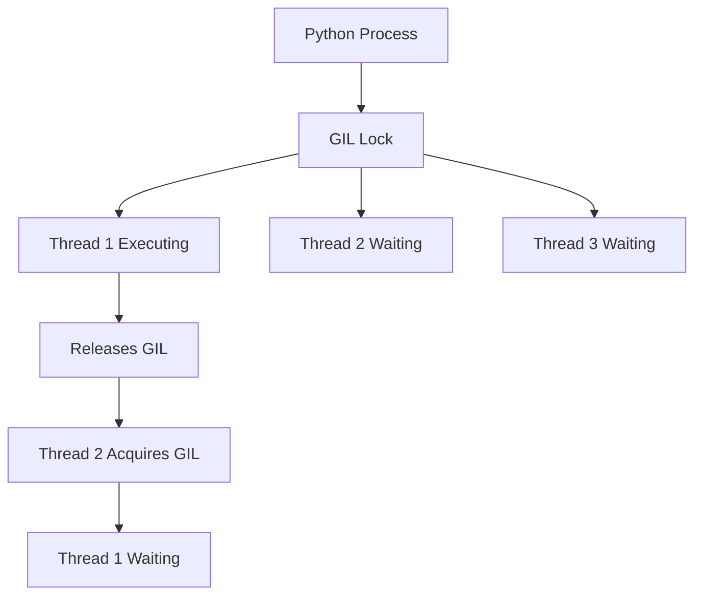
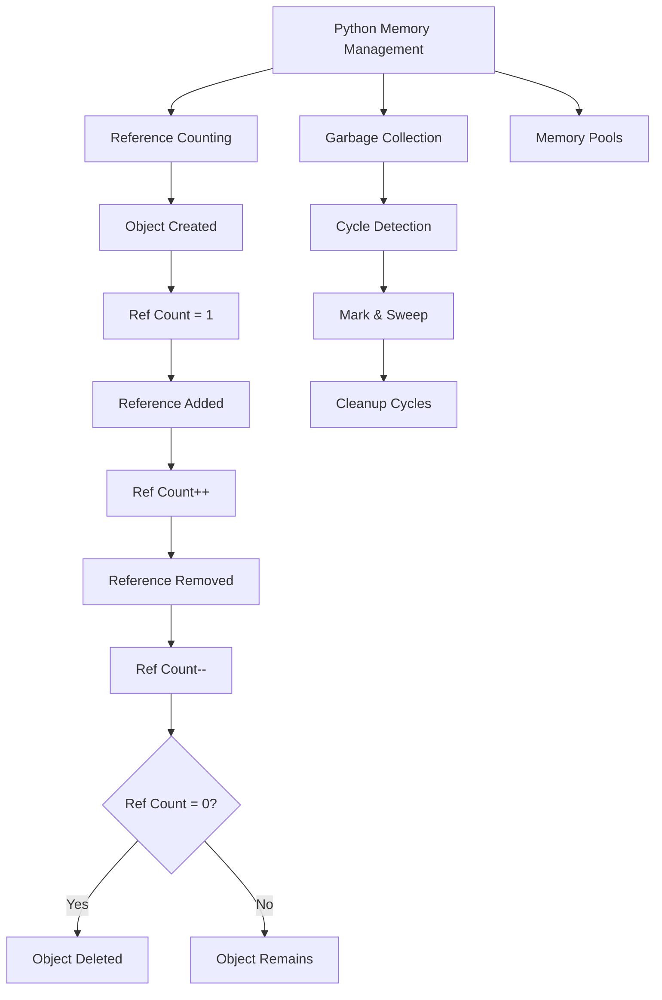

# Python DevOps Interview Preparation

This repository contains Python concepts, examples, and practical applications relevant for DevOps interviews.

## Table of Contents
- [Key Python Concepts](#key-python-concepts)
- [Python GIL (Global Interpreter Lock)](#python-gil-global-interpreter-lock)
- [F-Strings and String Formatting](#f-strings-and-string-formatting)
- [Interesting Python Facts](#interesting-python-facts)
- [Example Applications](#example-applications)
- [Performance Considerations](#performance-considerations)

## Key Python Concepts

### Python GIL (Global Interpreter Lock)

The GIL is a mutex that protects access to Python objects, preventing multiple native threads from executing Python byte-codes simultaneously.



**Key Points for DevOps:**
- **Impact**: Limits true parallelism for CPU-bound tasks
- **Workarounds**: Use `multiprocessing` instead of `threading` for CPU-intensive work
- **When GIL is released**: During I/O operations, making threading useful for I/O-bound tasks
- **Alternative**: Use async/await for concurrent I/O operations

```python
# Threading vs Multiprocessing example
import threading
import multiprocessing
import time

def cpu_bound_task():
    # Simulate CPU-intensive work
    sum(i*i for i in range(1000000))

# Threading (limited by GIL for CPU tasks)
start = time.time()
threads = [threading.Thread(target=cpu_bound_task) for _ in range(4)]
for t in threads:
    t.start()
for t in threads:
    t.join()
print(f"Threading: {time.time() - start:.2f}s")

# Multiprocessing (bypasses GIL)
start = time.time()
processes = [multiprocessing.Process(target=cpu_bound_task) for _ in range(4)]
for p in processes:
    p.start()
for p in processes:
    p.join()
print(f"Multiprocessing: {time.time() - start:.2f}s")
```

### F-Strings and String Formatting

F-strings (formatted string literals) are the most efficient and readable way to format strings in Python 3.6+.


```python
# Different formatting methods
name = "DevOps"
count = 42
price = 99.99

# Old style (avoid)
old_style = "Hello %s, count: %d, price: %.2f" % (name, count, price)

# .format() method
format_method = "Hello {}, count: {}, price: {:.2f}".format(name, count, price)

# F-strings (preferred)
f_string = f"Hello {name}, count: {count}, price: {price:.2f}"

# F-strings with expressions
import datetime
now = datetime.datetime.now()
formatted = f"Current time: {now:%Y-%m-%d %H:%M:%S}"
calculation = f"Result: {count * 2 + 10}"
```

### Interesting Python Facts

#### 1. Everything is an Object
```python
# Even functions and classes are objects
def my_function():
    pass

print(type(my_function))  # <class 'function'>
print(my_function.__name__)  # my_function

# You can add attributes to functions
my_function.custom_attr = "DevOps rocks!"
print(my_function.custom_attr)
```

#### 2. The Zen of Python
```python
import this
# Prints the Zen of Python - 19 guiding principles
```

#### 3. Chained Comparisons
```python
# Python allows chained comparisons
x = 5
if 1 < x < 10:  # More readable than: if x > 1 and x < 10:
    print("x is between 1 and 10")
```

#### 4. Context Managers
```python
# Custom context manager for timing
import time
from contextlib import contextmanager

@contextmanager
def timer():
    start = time.time()
    try:
        yield
    finally:
        print(f"Execution time: {time.time() - start:.2f}s")

# Usage
with timer():
    time.sleep(1)  # Some operation
```

#### 5. Default Mutable Arguments Gotcha
```python
# WRONG - mutable default argument
def append_item(item, target_list=[]):  # Don't do this!
    target_list.append(item)
    return target_list

# CORRECT
def append_item(item, target_list=None):
    if target_list is None:
        target_list = []
    target_list.append(item)
    return target_list
```

## Python Memory Management



## Performance Tips for DevOps

### 1. Use List Comprehensions
```python
# Faster than loops for simple operations
numbers = range(1000)

# Slow
squares = []
for n in numbers:
    squares.append(n ** 2)

# Fast
squares = [n ** 2 for n in numbers]

# Even faster for simple operations
squares = list(map(lambda x: x ** 2, numbers))
```

### 2. Use Built-in Functions
```python
# Built-ins are implemented in C and are faster
import operator

# Slow
result = 0
for item in [1, 2, 3, 4, 5]:
    result += item

# Fast
result = sum([1, 2, 3, 4, 5])

# For more complex operations
from functools import reduce  # functools is a Python built-in module
result = reduce(operator.add, [1, 2, 3, 4, 5])
```

### 3. Use Sets for Membership Testing
```python
# Lists: O(n) lookup time
large_list = list(range(10000))
if 9999 in large_list:  # Slow for large lists
    pass

# Sets: O(1) average lookup time
large_set = set(range(10000))
if 9999 in large_set:  # Fast
    pass
```

## Example Applications

This repository includes several practical Python applications:

1. **[File Processor](./file_processor/)** - Batch file operations and monitoring
2. **[Web Scraper](./web_scraper/)** - Data collection with error handling
3. **[Log Analyzer](./log_analyzer/)** - System log parsing and analysis
4. **[System Monitor](./system_monitor/)** - Resource monitoring and alerting

## Python in DevOps Context

### Configuration Management
```python
import os
from pathlib import Path  # pathlib is a Python built-in module
import yaml

# Environment-based configuration
class Config:
    def __init__(self):
        self.env = os.getenv('ENVIRONMENT', 'development')  # getenv gets environment variables
        self.debug = os.getenv('DEBUG', 'False').lower() == 'true'
        self.database_url = os.getenv('DATABASE_URL')
        
    @classmethod  # classmethod is a Python decorator
    def from_yaml(cls, config_file):
        with open(config_file) as f:
            config_data = yaml.safe_load(f)
        
        instance = cls()
        for key, value in config_data.items():
            setattr(instance, key, value)  # setattr sets object attributes dynamically
        return instance
```

### Error Handling and Logging
```python
import logging
import sys
from functools import wraps  # functools provides utilities for higher-order functions

# Configure logging
logging.basicConfig(
    level=logging.INFO,
    format='%(asctime)s - %(name)s - %(levelname)s - %(message)s',  # asctime formats timestamp
    handlers=[
        logging.FileHandler('app.log'),
        logging.StreamHandler(sys.stdout)
    ]
)

logger = logging.getLogger(__name__)

def retry(max_attempts=3, delay=1):
    def decorator(func):
        @wraps(func)
        def wrapper(*args, **kwargs):  # kwargs = keyword arguments
            for attempt in range(max_attempts):
                try:
                    return func(*args, **kwargs)  # Call function with original arguments
                except Exception as e:
                    logger.warning(f"Attempt {attempt + 1} failed: {e}")
                    if attempt == max_attempts - 1:
                        raise
                    time.sleep(delay)
        return wrapper
    return decorator

@retry(max_attempts=3, delay=2)
def unreliable_operation():
    # Simulate unreliable network call
    import random
    if random.random() < 0.7:
        raise ConnectionError("Network timeout")
    return "Success!"
```

## Testing in Python

```python
import unittest
import pytest
from unittest.mock import patch, MagicMock

class TestDevOpsOperations(unittest.TestCase):
    
    def setUp(self):
        self.config = {'timeout': 30, 'retries': 3}
    
    def test_configuration_loading(self):
        self.assertEqual(self.config['timeout'], 30)
        self.assertIn('retries', self.config)
    
    @patch('requests.get')
    def test_api_call_with_mock(self, mock_get):
        mock_response = MagicMock()
        mock_response.status_code = 200
        mock_response.json.return_value = {'status': 'ok'}
        mock_get.return_value = mock_response
        
        # Your API call logic here
        # result = make_api_call()
        # self.assertEqual(result['status'], 'ok')
        
    def tearDown(self):
        # Cleanup code
        pass

# Pytest style (more modern)
def test_string_formatting():
    name = "DevOps"
    result = f"Hello {name}!"
    assert result == "Hello DevOps!"
    assert len(result) > 5

@pytest.fixture
def sample_data():
    return {'servers': ['web1', 'web2'], 'environment': 'production'}

def test_with_fixture(sample_data):
    assert len(sample_data['servers']) == 2
    assert sample_data['environment'] == 'production'
```

## Common DevOps Python Libraries

- **`os` and `pathlib`**: File system operations (built-in modules)
- **`subprocess`**: Running shell commands
- **`requests`**: HTTP operations
- **`yaml` and `json`**: Configuration parsing
- **`docker`**: Docker API interactions
- **`kubernetes`**: Kubernetes API client
- **`boto3`**: AWS SDK
- **`paramiko`**: SSH connections (third-party library)
- **`psutil`**: System monitoring (third-party library)
- **`schedule`**: Job scheduling

## Interview Tips

1. **Explain the GIL impact**: Show understanding of when to use threading vs multiprocessing
2. **Demonstrate string formatting knowledge**: Use f-strings and explain performance benefits
3. **Show error handling skills**: Use try/except blocks appropriately
4. **Understand context managers**: Show knowledge of `with` statements
5. **Know the difference between lists and tuples**: Mutability and performance implications
6. **Explain Python 2 vs 3 differences**: Unicode handling, print function, integer division
7. **Show knowledge of virtual environments**: venv, virtualenv, conda
8. **Understand imports and modules**: Relative vs absolute imports, `__init__.py`

## Quick Reference Commands

### Using uv (Recommended)
```bash
# Install uv (if not already installed)
curl -LsSf https://astral.sh/uv/install.sh | sh

# Create and activate virtual environment using uv
uv venv
source .venv/bin/activate  # Linux/Mac
.venv\Scripts\activate     # Windows

# Install dependencies from pyproject.toml
uv pip install -e .

# Run Python scripts
uv run python script.py
uv run script.py

# Add dependencies
uv add requests
uv add --dev pytest

# Run tests
uv run pytest
uv run python -m unittest discover

# Code quality tools
uv run flake8 .
uv run black .
uv run mypy .  # mypy is a static type checker
```

### Traditional pip and venv
```bash
# Virtual environment using built-in venv module
python -m venv devops_env
source devops_env/bin/activate  # Linux/Mac
devops_env\Scripts\activate     # Windows

# Package management
pip install -r requirements.txt
pip freeze > requirements.txt
pip list --outdated

# Running Python
python script.py
python -m module_name
python -c "print('Hello DevOps')"

# Testing
python -m pytest tests/
python -m unittest discover
python -m doctest module.py  # doctest runs tests in docstrings

# Code quality
python -m flake8 .
python -m black .
python -m mypy .  # mypy provides static type checking
```