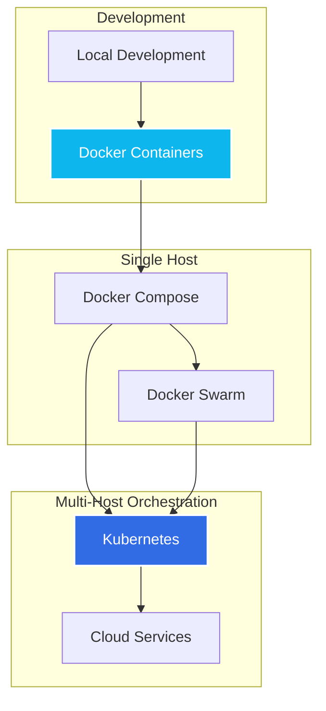
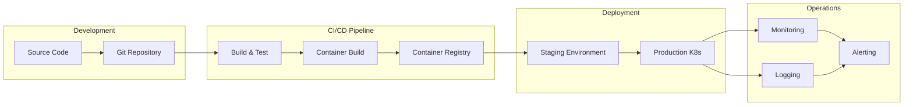
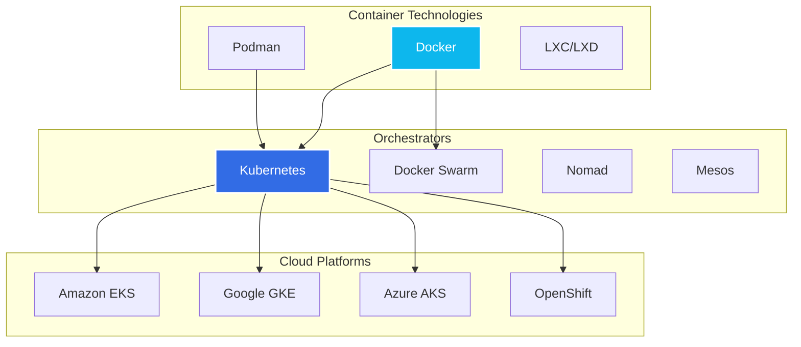

# DevOps Interview Preparation: Docker & Kubernetes

This repository contains comprehensive examples and documentation for preparing for DevOps interviews focusing on Docker and Kubernetes technologies.

## 📁 Repository Structure

```
dl_060_docker_k8s/
├── docker/
│   ├── simple-web-app/          # Basic Python Flask app with Docker
│   ├── multi-stage-build/       # Go app with optimized multi-stage build
│   ├── docker-compose-example/  # Multi-service application stack
│   └── README.md               # Docker concepts and interview guide
├── kubernetes/
│   ├── basic-deployment/        # Simple K8s deployment and services
│   ├── configmap-secret/        # Configuration and secret management
│   ├── ingress-example/         # External access and routing
│   ├── persistent-volume/       # Storage and StatefulSet examples
│   ├── namespace-rbac/          # Security and access control
│   └── README.md               # Kubernetes concepts and interview guide
└── README.md                   # This file
```

## 🐳 Docker Section

### What You'll Learn
- Container fundamentals and architecture
- Dockerfile best practices and optimization
- Multi-stage builds for production
- Docker Compose for multi-service applications
- Networking, volumes, and security

### Examples Included
1. **Simple Web App**: Basic containerization example
2. **Multi-Stage Build**: Production-ready optimization techniques
3. **Docker Compose**: Complete application stack

## ☸️ Kubernetes Section

### What You'll Learn
- Kubernetes architecture and components
- Core objects: Pods, Services, Deployments
- Configuration management with ConfigMaps and Secrets
- Networking with Ingress controllers
- Storage with Persistent Volumes
- Security with RBAC and Namespaces

### Examples Included
1. **Basic Deployment**: Fundamental K8s concepts
2. **ConfigMap & Secrets**: Configuration management
3. **Ingress**: External access patterns
4. **Persistent Storage**: Data persistence strategies
5. **RBAC & Namespaces**: Security and isolation

## 🏗️ Container Orchestration Journey



## 📊 DevOps Pipeline Integration



## 🎯 Interview Preparation Strategy

### Week 1: Docker Fundamentals
- [ ] Study Docker architecture and components
- [ ] Practice building and running containers
- [ ] Master Dockerfile optimization techniques
- [ ] Work through simple-web-app example
- [ ] Understand networking and volumes

### Week 2: Advanced Docker
- [ ] Multi-stage builds and production patterns
- [ ] Docker Compose for multi-service apps
- [ ] Security best practices
- [ ] Troubleshooting common issues
- [ ] Work through all Docker examples

### Week 3: Kubernetes Basics
- [ ] Understand K8s architecture
- [ ] Practice kubectl commands
- [ ] Master Pods, Services, Deployments
- [ ] Work through basic-deployment example
- [ ] Configuration with ConfigMaps/Secrets

### Week 4: Advanced Kubernetes
- [ ] Ingress and networking
- [ ] Storage and StatefulSets
- [ ] RBAC and security
- [ ] Monitoring and troubleshooting
- [ ] Work through all K8s examples

## 🔄 Technology Comparison



## 🚀 Quick Start Guide

### Prerequisites
- Docker installed and running
- kubectl installed (for Kubernetes examples)
- Access to a Kubernetes cluster (minikube, kind, or cloud)

### Running Docker Examples
```bash
# Navigate to Docker examples
cd docker/simple-web-app

# Build and run the application
docker build -t simple-web-app .
docker run -p 5000:5000 simple-web-app

# Test the application
curl http://localhost:5000
```

### Running Kubernetes Examples
```bash
# Navigate to Kubernetes examples
cd kubernetes/basic-deployment

# Apply the configurations
kubectl apply -f deployment.yaml
kubectl apply -f service.yaml

# Check the deployment
kubectl get pods
kubectl get services
```

## 📚 Additional Resources

### Books
- "Docker Deep Dive" by Nigel Poulton
- "Kubernetes in Action" by Marko Lukša
- "The DevOps Handbook" by Gene Kim

### Online Courses
- Docker Official Training
- Kubernetes.io Interactive Tutorials
- Linux Academy/A Cloud Guru
- Udemy Kubernetes courses

### Practice Platforms
- Katacoda (Interactive scenarios)
- Play with Docker
- Play with Kubernetes
- Kubernetes the Hard Way

## 🎓 Interview Topics Checklist

### Docker Topics
- [ ] Container vs VM differences
- [ ] Docker architecture and components
- [ ] Dockerfile best practices
- [ ] Image layers and caching
- [ ] Networking modes
- [ ] Volume types and use cases
- [ ] Security considerations
- [ ] Multi-stage builds
- [ ] Docker Compose
- [ ] Troubleshooting containers

### Kubernetes Topics
- [ ] K8s architecture and components
- [ ] Pod lifecycle and management
- [ ] Service types and networking
- [ ] Deployment strategies
- [ ] ConfigMaps and Secrets
- [ ] Persistent Volumes and Claims
- [ ] Ingress controllers
- [ ] RBAC and security
- [ ] Monitoring and logging
- [ ] Troubleshooting clusters
- [ ] Helm and package management
- [ ] Custom Resources and Operators

## 🏆 Success Tips

1. **Practice Hands-On**: Don't just read - build, deploy, and troubleshoot
2. **Understand Architecture**: Know how components interact
3. **Security First**: Always consider security implications
4. **Production Mindset**: Think about scalability, monitoring, and maintenance
5. **Stay Current**: Technologies evolve rapidly - keep learning

## 📞 Getting Help

If you encounter issues or have questions while working through these examples:

1. Check the README files in each section
2. Review the troubleshooting sections
3. Consult official documentation
4. Practice explaining concepts out loud
5. Join community forums and Discord servers

---

**Remember**: The goal isn't just to memorize commands, but to understand the underlying concepts and be able to apply them to real-world scenarios. Good luck with your interview preparation! 🚀