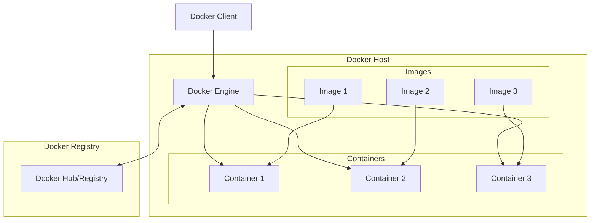
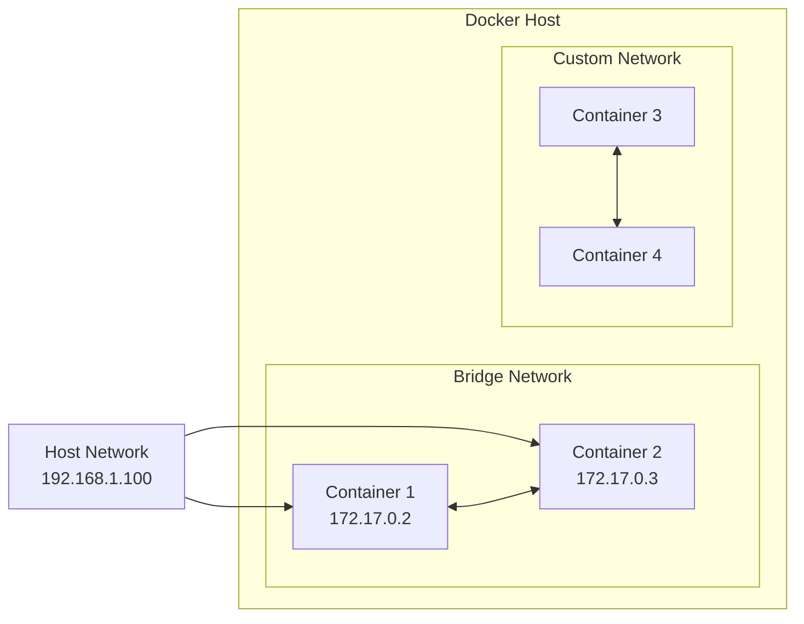

# Docker Interview Preparation Guide

## 🐳 Docker Architecture Overview



## 📚 Core Concepts

### What is Docker?
Docker is a containerization platform that packages applications and their dependencies into lightweight, portable containers.

### Key Components
- **Docker Engine**: Runtime that manages containers
- **Docker Image**: Read-only template for creating containers
- **Docker Container**: Running instance of an image
- **Dockerfile**: Text file with instructions to build images
- **Docker Registry**: Storage for Docker images (Docker Hub, ECR, etc.)

## 🔧 Essential Docker Commands

### Image Management
```bash
# Build image from Dockerfile
docker build -t myapp:1.0 .

# List images
docker images

# Remove image
docker rmi myapp:1.0

# Pull image from registry
docker pull nginx:latest

# Push image to registry
docker push myregistry/myapp:1.0
```

### Container Management
```bash
# Run container
docker run -d --name mycontainer -p 8080:80 nginx

# List running containers
docker ps

# List all containers
docker ps -a

# Stop container
docker stop mycontainer

# Start stopped container
docker start mycontainer

# Remove container
docker rm mycontainer

# Execute command in running container
docker exec -it mycontainer /bin/bash

# View container logs
docker logs mycontainer
```

### Docker Compose
```bash
# Start services
docker-compose up -d

# Stop services
docker-compose down

# View logs
docker-compose logs

# Scale services
docker-compose up --scale web=3
```

## 🏗️ Dockerfile Best Practices

### Multi-Stage Build Example
```dockerfile
# Build stage
FROM node:18-alpine AS builder
WORKDIR /app
COPY package*.json ./
RUN npm ci --only=production

# Production stage
FROM node:18-alpine
WORKDIR /app
COPY --from=builder /app/node_modules ./node_modules
COPY . .
EXPOSE 3000
USER node
CMD ["npm", "start"]
```

### Optimization Tips
1. **Use specific tags** instead of `latest`
2. **Minimize layers** by combining RUN commands
3. **Use .dockerignore** to exclude unnecessary files
4. **Run as non-root user** for security
5. **Use multi-stage builds** to reduce image size
6. **Cache dependencies** separately from application code

## 🔄 Docker Networking



### Network Types
- **Bridge**: Default network for containers
- **Host**: Container uses host's network stack
- **None**: Container has no network access
- **Custom**: User-defined networks with DNS resolution

## 💾 Data Persistence

### Volume Types
- **Named Volumes**: Managed by Docker
- **Bind Mounts**: Direct host directory mapping
- **tmpfs**: Temporary in-memory storage

```bash
# Named volume
docker run -v myvolume:/data myapp

# Bind mount
docker run -v /host/path:/container/path myapp

# tmpfs mount
docker run --tmpfs /tmp myapp
```

## 🎯 Common Interview Questions & Answers

### Q: What's the difference between a container and a virtual machine?
**A**: Containers share the host OS kernel and are lightweight, while VMs include a full OS and are more resource-intensive. Containers start faster and use fewer resources.

### Q: Explain Docker layers and image caching
**A**: Docker images are built in layers. Each Dockerfile instruction creates a new layer. Docker caches layers, so unchanged layers don't need to be rebuilt, speeding up builds.

### Q: How do you handle secrets in Docker?
**A**: Use Docker secrets (in Swarm mode), environment variables from external sources, or mount secret files. Never hardcode secrets in images.

### Q: What's the difference between COPY and ADD in Dockerfile?
**A**: COPY simply copies files/directories. ADD can also extract archives and download URLs, but COPY is preferred for transparency.

### Q: How do you troubleshoot a failing container?
**A**: 
1. Check logs: `docker logs container_name`
2. Inspect container: `docker inspect container_name`
3. Execute into container: `docker exec -it container_name /bin/sh`
4. Check resource usage: `docker stats`

### Q: Explain Docker Compose vs Docker Swarm vs Kubernetes
**A**:
- **Docker Compose**: Multi-container applications on single host
- **Docker Swarm**: Docker's native clustering solution
- **Kubernetes**: More advanced orchestration platform with rich features

## 📊 Resource Management

```dockerfile
# Resource limits in Dockerfile
FROM alpine
# Health check
HEALTHCHECK --interval=30s --timeout=3s --start-period=5s --retries=3 \
  CMD curl -f http://localhost/ || exit 1
```

```bash
# Runtime resource limits
docker run --memory=512m --cpus=0.5 myapp
```

## 🔒 Security Best Practices

1. **Use official base images**
2. **Keep images updated**
3. **Run as non-root user**
4. **Scan images for vulnerabilities**
5. **Use secrets management**
6. **Limit container capabilities**
7. **Use read-only filesystems when possible**

## 🚀 Performance Tips

1. **Optimize Dockerfile layer order**
2. **Use Alpine Linux for smaller images**
3. **Implement health checks**
4. **Use init system for PID 1**
5. **Monitor resource usage**
6. **Use buildkit for faster builds**

## 🛠️ Example Projects

### 1. Simple Web App (`simple-web-app/`)
- Basic Flask application
- Single-stage Dockerfile
- Environment variable configuration

### 2. Multi-Stage Build (`multi-stage-build/`)
- Go application with builder pattern
- Optimized final image size
- Security best practices

### 3. Docker Compose Stack (`docker-compose-example/`)
- Multi-service application
- Database and cache integration
- Volume and network configuration

## 📝 Quick Reference Commands

```bash
# Clean up everything
docker system prune -a

# View Docker system info
docker system df
docker system events

# Copy files to/from container
docker cp file.txt container_name:/path/
docker cp container_name:/path/file.txt ./

# Monitor resource usage
docker stats --no-stream

# Export/Import images
docker save myapp:1.0 | gzip > myapp.tar.gz
gunzip -c myapp.tar.gz | docker load
```

## 🎭 Interview Simulation Questions

1. **Scenario**: Your application container keeps crashing. Walk me through your debugging process.

2. **Scenario**: You need to deploy a microservices application with a database. How would you structure your Docker setup?

3. **Scenario**: Your Docker builds are taking too long. What optimization strategies would you implement?

4. **Technical**: Explain the difference between `docker run` and `docker exec`.

5. **Architecture**: Design a Docker-based CI/CD pipeline for a web application.

Remember: Practice these concepts hands-on with the provided examples!