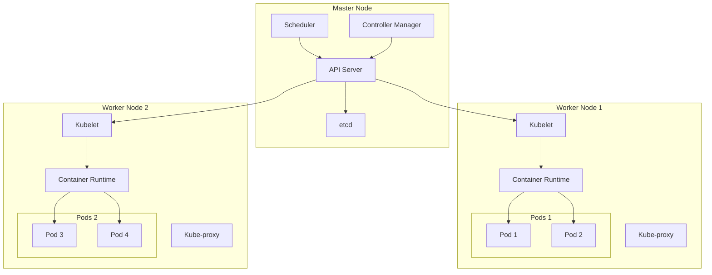
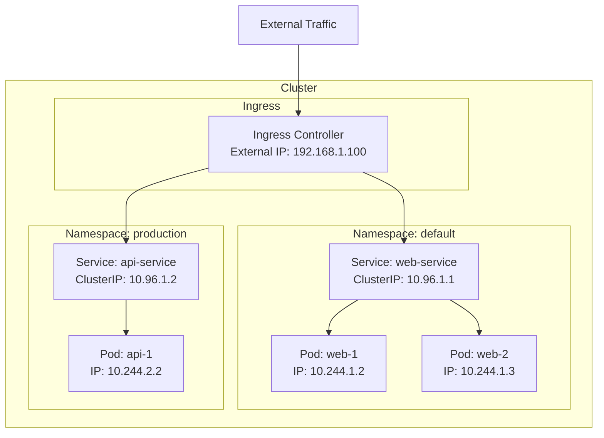
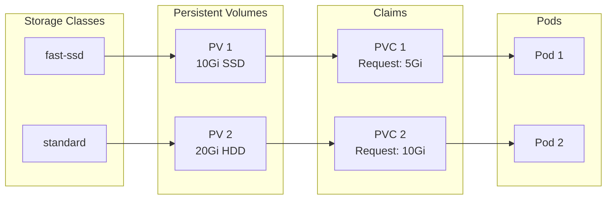
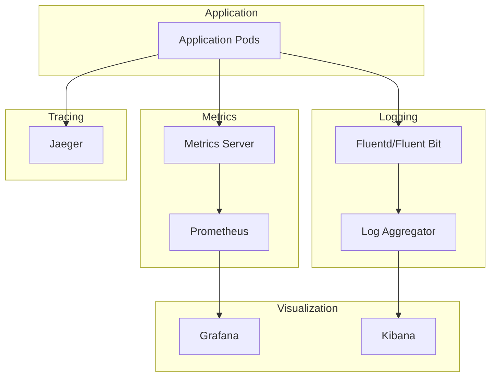

# Kubernetes Interview Preparation Guide

## ☸️ Kubernetes Architecture Overview



## 📚 Core Concepts

### What is Kubernetes?
Kubernetes (K8s) is an open-source container orchestration platform that automates deployment, scaling, and management of containerized applications.

### Key Components

#### Master Node Components
- **API Server**: Entry point for all REST commands
- **etcd**: Distributed key-value store for cluster data
- **Scheduler**: Assigns pods to nodes
- **Controller Manager**: Runs controllers that regulate cluster state

#### Worker Node Components
- **Kubelet**: Node agent that manages containers
- **Kube-proxy**: Network proxy for service networking
- **Container Runtime**: Docker, containerd, or CRI-O

### Core Objects
- **Pod**: Smallest deployable unit
- **Service**: Network abstraction for pods
- **Deployment**: Manages pod replicas
- **ConfigMap**: Configuration data
- **Secret**: Sensitive data
- **Namespace**: Virtual cluster isolation

## 🔧 Essential kubectl Commands

### Cluster Information
```bash
# Cluster info
kubectl cluster-info

# Node status
kubectl get nodes

# All resources
kubectl get all

# Describe resource
kubectl describe pod my-pod
```

### Pod Management
```bash
# Create pod
kubectl run nginx --image=nginx

# Get pods
kubectl get pods

# Get pods with labels
kubectl get pods --show-labels

# Delete pod
kubectl delete pod nginx

# Execute command in pod
kubectl exec -it nginx -- /bin/bash

# Port forward
kubectl port-forward nginx 8080:80

# View logs
kubectl logs nginx
```

### Deployment Management
```bash
# Create deployment
kubectl create deployment nginx --image=nginx

# Scale deployment
kubectl scale deployment nginx --replicas=3

# Update image
kubectl set image deployment/nginx nginx=nginx:1.21

# Rollback
kubectl rollout undo deployment/nginx

# Check rollout status
kubectl rollout status deployment/nginx
```

### Service Management
```bash
# Expose deployment
kubectl expose deployment nginx --port=80 --type=ClusterIP

# Get services
kubectl get services

# Get endpoints
kubectl get endpoints
```

### Configuration Management
```bash
# Apply configuration
kubectl apply -f deployment.yaml

# Create from multiple files
kubectl apply -f .

# Delete resources
kubectl delete -f deployment.yaml

# Dry run
kubectl apply -f deployment.yaml --dry-run=client
```

## 🏗️ Kubernetes Networking



### Service Types
- **ClusterIP**: Internal cluster communication (default)
- **NodePort**: Exposes service on each node's IP
- **LoadBalancer**: Cloud provider load balancer
- **ExternalName**: Maps to external DNS name

### Network Policies
```yaml
apiVersion: networking.k8s.io/v1
kind: NetworkPolicy
metadata:
  name: deny-all
spec:
  podSelector: {}
  policyTypes:
  - Ingress
  - Egress
```

## 💾 Storage in Kubernetes



### Volume Types
- **emptyDir**: Temporary storage
- **hostPath**: Host directory mount
- **persistentVolumeClaim**: Durable storage
- **configMap/secret**: Configuration volumes

## 🎯 Common Interview Questions & Answers

### Q: What's the difference between a Pod and a Container?
**A**: A Pod is the smallest deployable unit in Kubernetes and can contain one or more containers. Containers in the same Pod share network and storage.

### Q: Explain the difference between Deployment and StatefulSet
**A**: 
- **Deployment**: For stateless applications, pods are interchangeable
- **StatefulSet**: For stateful applications, pods have stable identities and ordered deployment

### Q: How does service discovery work in Kubernetes?
**A**: Kubernetes provides DNS-based service discovery. Services get DNS names like `service-name.namespace.svc.cluster.local`.

### Q: What's the difference between a ReplicaSet and a Deployment?
**A**: ReplicaSet ensures a specified number of pod replicas. Deployment is higher-level and manages ReplicaSets, providing rolling updates and rollbacks.

### Q: How do you handle configuration in Kubernetes?
**A**: Use ConfigMaps for non-sensitive data and Secrets for sensitive data. Both can be mounted as volumes or environment variables.

### Q: Explain Kubernetes resource limits and requests
**A**:
- **Requests**: Minimum resources guaranteed to container
- **Limits**: Maximum resources container can use
- Used by scheduler for placement and resource management

### Q: What are Kubernetes namespaces and when would you use them?
**A**: Namespaces provide virtual clusters within a physical cluster. Use for multi-tenancy, environment separation, or team isolation.

### Q: How does Kubernetes handle rolling updates?
**A**: Deployments use rolling updates by default, gradually replacing old pods with new ones to ensure zero downtime.

## 🔐 Security Best Practices

### RBAC (Role-Based Access Control)
```yaml
apiVersion: rbac.authorization.k8s.io/v1
kind: Role
metadata:
  name: pod-reader
rules:
- apiGroups: [""]
  resources: ["pods"]
  verbs: ["get", "watch", "list"]
```

### Security Contexts
```yaml
apiVersion: v1
kind: Pod
spec:
  securityContext:
    runAsUser: 1000
    runAsGroup: 3000
    fsGroup: 2000
  containers:
  - name: app
    securityContext:
      allowPrivilegeEscalation: false
      readOnlyRootFilesystem: true
      runAsNonRoot: true
```

### Security Best Practices
1. **Use RBAC** for access control
2. **Run containers as non-root**
3. **Use Network Policies** to restrict traffic
4. **Scan images** for vulnerabilities
5. **Enable Pod Security Standards**
6. **Use service accounts** properly
7. **Encrypt data** at rest and in transit

## 📊 Monitoring and Observability



### Key Observability Tools
- **Metrics**: Prometheus + Grafana
- **Logging**: ELK/EFK Stack
- **Tracing**: Jaeger/Zipkin
- **Built-in**: kubectl top, describe, logs

## 🚀 Advanced Concepts

### Custom Resource Definitions (CRDs)
```yaml
apiVersion: apiextensions.k8s.io/v1
kind: CustomResourceDefinition
metadata:
  name: crontabs.stable.example.com
spec:
  group: stable.example.com
  versions:
  - name: v1
    served: true
    storage: true
```

### Operators
Operators extend Kubernetes to manage complex applications using custom resources and controllers.

### Helm Charts
Package manager for Kubernetes applications.

```bash
# Install chart
helm install my-release bitnami/wordpress

# Upgrade release
helm upgrade my-release bitnami/wordpress

# List releases
helm list
```

## 🛠️ Troubleshooting Guide

### Common Issues and Solutions

#### Pod Stuck in Pending
```bash
# Check events
kubectl describe pod <pod-name>

# Check node resources
kubectl top nodes

# Check node status
kubectl get nodes
```

#### ImagePullBackOff
```bash
# Check image name and tag
kubectl describe pod <pod-name>

# Verify image exists
docker pull <image-name>
```

#### CrashLoopBackOff
```bash
# Check application logs
kubectl logs <pod-name>

# Check previous container logs
kubectl logs <pod-name> --previous
```

### Debugging Commands
```bash
# Get events
kubectl get events --sort-by='.lastTimestamp'

# Check resource usage
kubectl top pods
kubectl top nodes

# Debug pod networking
kubectl exec -it <pod-name> -- nslookup kubernetes.default

# Check service endpoints
kubectl get endpoints <service-name>
```

## 📝 Example Projects

### 1. Basic Deployment (`basic-deployment/`)
- Simple nginx deployment
- Service exposure
- Resource limits and health checks

### 2. ConfigMap & Secrets (`configmap-secret/`)
- Configuration management
- Secret handling
- Volume mounts

### 3. Ingress Configuration (`ingress-example/`)
- External access setup
- TLS termination
- Path-based routing

### 4. Persistent Storage (`persistent-volume/`)
- Volume management
- StatefulSet example
- Data persistence

### 5. RBAC & Namespaces (`namespace-rbac/`)
- Security configuration
- Access control
- Resource isolation

## 🎭 Interview Simulation Scenarios

### Scenario 1: Application Scaling
"Your application is experiencing high traffic. Walk me through how you would scale it in Kubernetes and what considerations you'd have."

### Scenario 2: Database in Kubernetes
"How would you deploy a database in Kubernetes? What are the challenges and best practices?"

### Scenario 3: Multi-Environment Setup
"Design a Kubernetes setup for development, staging, and production environments."

### Scenario 4: Incident Response
"A critical application pod keeps crashing. Walk me through your troubleshooting process."

### Scenario 5: CI/CD Integration
"How would you integrate Kubernetes with a CI/CD pipeline?"

## 📋 Quick Reference

### Resource Hierarchy
```
Cluster
├── Namespace
    ├── Deployment
    │   └── ReplicaSet
    │       └── Pods
    ├── Service
    ├── ConfigMap
    ├── Secret
    └── Ingress
```

### Common Patterns
```bash
# Get all resources in namespace
kubectl get all -n <namespace>

# Apply all YAML files in directory
kubectl apply -f ./

# Watch resources in real-time
kubectl get pods -w

# Delete all resources by label
kubectl delete all -l app=myapp

# Context switching
kubectl config use-context <context-name>
```

## 🏆 Interview Success Tips

1. **Understand the fundamentals** - Don't just memorize commands
2. **Practice hands-on** - Use the provided examples
3. **Know the architecture** - Understand how components interact
4. **Security awareness** - Always consider security implications
5. **Troubleshooting skills** - Practice debugging scenarios
6. **Real-world experience** - Relate concepts to practical applications

Remember: Kubernetes is complex, but understanding the core concepts and practicing with real examples will prepare you for most interview questions!