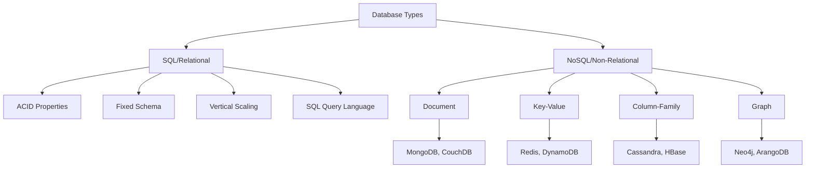
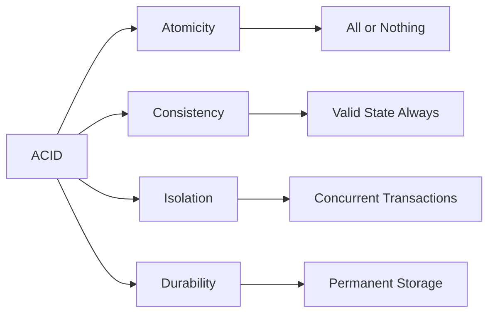

# SQL Database Interview Preparation Guide

## Table of Contents
- [SQL vs NoSQL Overview](#sql-vs-nosql-overview)
- [Database Lists](#database-lists)
- [Common Interview Questions](#common-interview-questions)
- [Example Databases](#example-databases)

## SQL vs NoSQL Overview



### Key Differences

| Aspect | SQL | NoSQL |
|--------|-----|-------|
| **Schema** | Fixed, predefined | Flexible, dynamic |
| **ACID** | Full ACID compliance | Eventual consistency |
| **Scaling** | Vertical (scale up) | Horizontal (scale out) |
| **Query Language** | Standardized SQL | Varies by database |
| **Data Model** | Tables with relationships | Various (document, key-value, etc.) |
| **Use Cases** | Complex queries, transactions | Big data, real-time web apps |

### ACID Properties


## Database Lists

### Popular SQL Databases
1. **MySQL** - Open source, widely used
2. **PostgreSQL** - Advanced open source with JSON support
3. **Oracle Database** - Enterprise-grade commercial
4. **Microsoft SQL Server** - Microsoft's enterprise solution
5. **SQLite** - Lightweight, file-based
6. **MariaDB** - MySQL fork with enhanced features
7. **IBM DB2** - Enterprise database for mainframes
8. **Amazon RDS** - Cloud-based relational database service

### Popular NoSQL Databases

#### Document Databases
- **MongoDB** - JSON-like documents
- **CouchDB** - HTTP/REST API
- **Amazon DocumentDB** - MongoDB-compatible

#### Key-Value Stores
- **Redis** - In-memory data structure store
- **Amazon DynamoDB** - Fully managed
- **Riak** - Distributed key-value store

#### Column-Family
- **Apache Cassandra** - Wide-column store
- **HBase** - Hadoop database
- **Amazon SimpleDB** - Cloud-based

#### Graph Databases
- **Neo4j** - Property graph database
- **ArangoDB** - Multi-model database
- **Amazon Neptune** - Fully managed graph database

## Common Interview Questions

### Basic SQL Concepts
1. What are primary keys and foreign keys?
2. Explain different types of JOINs
3. What is normalization and denormalization?
4. Difference between UNION and UNION ALL
5. What are indexes and how do they work?

### Advanced SQL Topics
1. Explain window functions
2. What are CTEs (Common Table Expressions)?
3. How do you optimize slow queries?
4. What is a database transaction?
5. Explain different isolation levels

### Query Examples You Should Know
```sql
-- Basic SELECT with conditions
SELECT column1, column2 FROM table WHERE condition;

-- JOINs
SELECT a.*, b.* FROM table_a a 
INNER JOIN table_b b ON a.id = b.foreign_id;

-- Aggregate functions
SELECT COUNT(*), AVG(salary), MAX(salary) 
FROM employees GROUP BY department;

-- Window functions
SELECT name, salary, 
       ROW_NUMBER() OVER (PARTITION BY department ORDER BY salary DESC) as rank
FROM employees;

-- Subqueries
SELECT * FROM employees 
WHERE salary > (SELECT AVG(salary) FROM employees);

-- CTEs
WITH department_avg AS (
    SELECT department, AVG(salary) as avg_salary
    FROM employees GROUP BY department
)
SELECT e.*, d.avg_salary 
FROM employees e 
JOIN department_avg d ON e.department = d.department;
```

## Example Databases

This repository contains several example database schemas:

1. **[E-commerce System](./ecommerce/)** - Online store with products, orders, customers
2. **[Library Management](./library/)** - Book lending system
3. **[Employee Management](./employee/)** - HR system with departments and roles
4. **[Banking System](./banking/)** - Account management and transactions

Each folder contains:
- Schema definition (DDL)
- Sample data (DML)
- Common queries
- Performance considerations

## Interview Tips

1. **Understand the business context** before designing schemas
2. **Always consider performance** when writing queries
3. **Know when to use indexes** and their trade-offs
4. **Practice explaining your thought process** out loud
5. **Be familiar with both theoretical concepts and practical implementation**

## Study Resources

- Practice on platforms like LeetCode, HackerRank, SQLBolt
- Understand real-world database design patterns
- Learn about database performance tuning
- Familiarize yourself with cloud database services