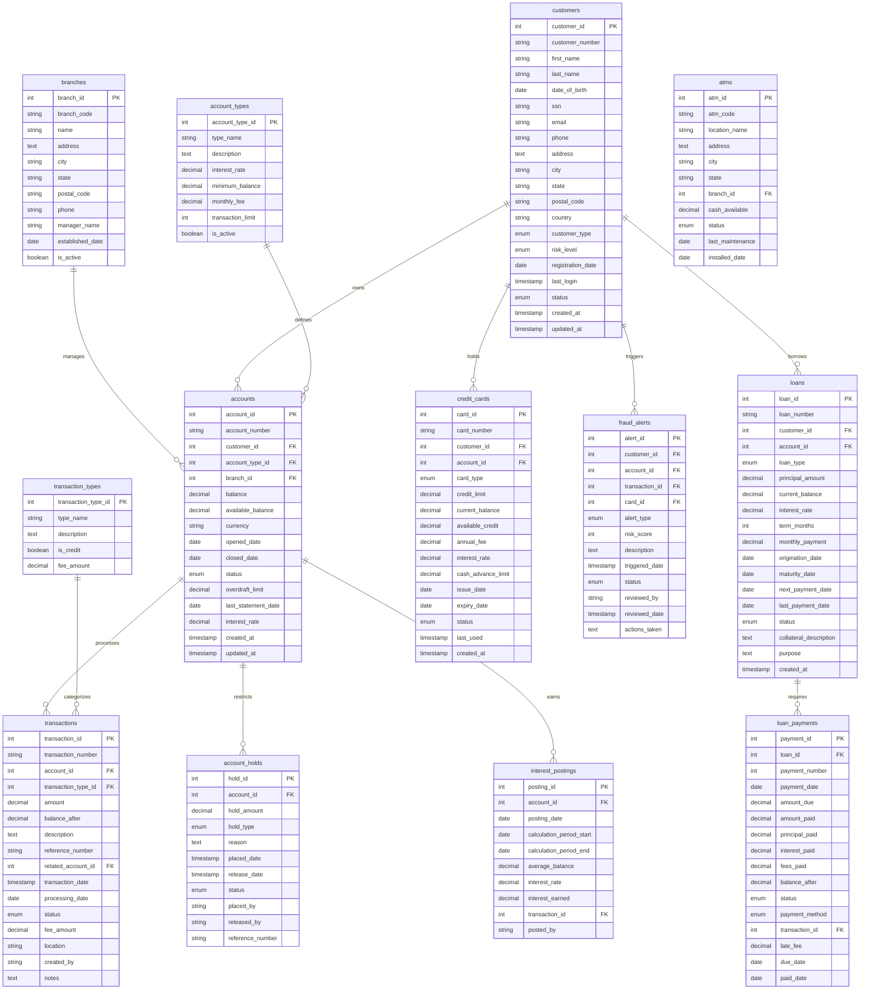

# Banking System Database

A comprehensive banking database schema covering core banking operations including customer management, accounts, transactions, loans, credit cards, and fraud detection.

## Schema Overview



## Key Features

### 1. **Customer Management**
- Individual and business customers
- Risk level assessment
- KYC (Know Your Customer) information
- Customer lifecycle tracking

### 2. **Account Management**
- Multiple account types with different features
- Interest-bearing and non-interest accounts
- Overdraft protection
- Account status management

### 3. **Transaction Processing**
- Real-time balance updates
- Transaction categorization
- Fee calculation
- Audit trail with location tracking

### 4. **Loan Management**
- Multiple loan types (personal, mortgage, auto, business)
- Payment scheduling and tracking
- Interest calculation
- Delinquency management

### 5. **Credit Card Operations**
- Credit and debit card management
- Credit limit and utilization tracking
- Interest and fee calculation
- Fraud monitoring

### 6. **Fraud Detection**
- Real-time fraud alerts
- Risk scoring system
- Pattern analysis triggers
- Investigation workflow

### 7. **Interest Management**
- Automated interest calculation
- Monthly interest postings
- Variable rate support
- Compound interest handling

### 8. **Security and Compliance**
- Account holds and freezes
- Transaction monitoring
- Regulatory reporting
- Audit trails

## Banking Operations

### Account Opening
```sql
-- Create new customer
INSERT INTO customers (customer_number, first_name, last_name, date_of_birth, email, registration_date)
VALUES ('CUST000009', 'Jane', 'Doe', '1990-01-01', 'jane.doe@email.com', CURDATE());

-- Open checking account
INSERT INTO accounts (account_number, customer_id, account_type_id, branch_id, balance, opened_date)
VALUES ('CHK4009012345', LAST_INSERT_ID(), 1, 1, 100.00, CURDATE());
```

### Fund Transfer
```sql
-- Debit from source account
INSERT INTO transactions (transaction_number, account_id, transaction_type_id, amount, balance_after, description, related_account_id)
VALUES ('TXN' + UNIX_TIMESTAMP(), ?, 5, -?, (SELECT balance FROM accounts WHERE account_id = ?) - ?, 'Transfer to account', ?);

-- Credit to destination account
INSERT INTO transactions (transaction_number, account_id, transaction_type_id, amount, balance_after, description, related_account_id)
VALUES ('TXN' + UNIX_TIMESTAMP(), ?, 4, ?, (SELECT balance FROM accounts WHERE account_id = ?) + ?, 'Transfer from account', ?);

-- Update balances
UPDATE accounts SET balance = balance - ? WHERE account_id = ?;
UPDATE accounts SET balance = balance + ? WHERE account_id = ?;
```

### Loan Payment Processing
```sql
-- Record loan payment
UPDATE loan_payments 
SET amount_paid = ?, principal_paid = ?, interest_paid = ?, paid_date = CURDATE(), status = 'paid'
WHERE loan_id = ? AND payment_number = ?;

-- Update loan balance
UPDATE loans 
SET current_balance = current_balance - ?, last_payment_date = CURDATE(), next_payment_date = DATE_ADD(next_payment_date, INTERVAL 1 MONTH)
WHERE loan_id = ?;
```

## Interview Questions

### Schema Design
1. **Why separate available_balance from balance?**
   - Pending transactions and holds
   - Overdraft calculations
   - Real-time availability checks

2. **How to handle foreign currency transactions?**
   - Currency field in accounts
   - Exchange rate tracking
   - Multi-currency support

3. **Ensuring data consistency in transfers?**
   - Database transactions (ACID)
   - Two-phase commit
   - Compensating transactions

### Financial Concepts
1. **Interest calculation methods**
   - Simple vs compound interest
   - Daily vs monthly compounding
   - Minimum balance requirements

2. **Fraud detection strategies**
   - Velocity checks
   - Geolocation analysis
   - Pattern recognition
   - Risk scoring algorithms

3. **Regulatory compliance**
   - Transaction reporting
   - Anti-money laundering (AML)
   - Know Your Customer (KYC)
   - Data retention policies

### Performance and Security
1. **Handling high transaction volumes**
   - Database partitioning
   - Read replicas
   - Caching strategies
   - Queue-based processing

2. **Data security measures**
   - Encryption at rest and in transit
   - PCI DSS compliance
   - Access controls
   - Audit logging

## Advanced Queries

### Customer Lifetime Value
```sql
SELECT 
    customer_id,
    SUM(fee_revenue + interest_revenue + loan_interest) as total_revenue,
    AVG(account_balance) as avg_balance,
    DATEDIFF(CURDATE(), registration_date) / 365 as customer_tenure_years,
    (SUM(fee_revenue + interest_revenue + loan_interest) / (DATEDIFF(CURDATE(), registration_date) / 365)) as annual_revenue
FROM customer_profitability_view
GROUP BY customer_id;
```

### Liquidity Analysis
```sql
SELECT 
    DATE_FORMAT(transaction_date, '%Y-%m-%d') as date,
    SUM(CASE WHEN is_credit THEN amount ELSE -amount END) as net_flow,
    SUM(amount) OVER (ORDER BY DATE_FORMAT(transaction_date, '%Y-%m-%d')) as cumulative_flow
FROM transactions t
JOIN transaction_types tt ON t.transaction_type_id = tt.transaction_type_id
WHERE transaction_date >= DATE_SUB(CURDATE(), INTERVAL 30 DAY)
GROUP BY DATE_FORMAT(transaction_date, '%Y-%m-%d')
ORDER BY date;
```

### Risk Concentration
```sql
SELECT 
    loan_type,
    SUM(current_balance) as total_exposure,
    COUNT(*) as loan_count,
    AVG(current_balance) as avg_loan_size,
    SUM(current_balance) / (SELECT SUM(current_balance) FROM loans WHERE status = 'active') * 100 as portfolio_percentage
FROM loans
WHERE status = 'active'
GROUP BY loan_type
ORDER BY total_exposure DESC;
```

## Practice Scenarios

1. **Account Reconciliation** - Balance verification and discrepancy resolution
2. **Fraud Investigation** - Alert analysis and pattern detection
3. **Credit Risk Assessment** - Loan default probability modeling
4. **Regulatory Reporting** - Transaction monitoring and compliance
5. **Performance Analytics** - Branch and product profitability analysis

## Compliance Considerations

- **PCI DSS** - Credit card data protection
- **SOX** - Financial reporting accuracy
- **AML/BSA** - Anti-money laundering monitoring
- **GDPR** - Customer data privacy
- **Basel III** - Capital adequacy requirements