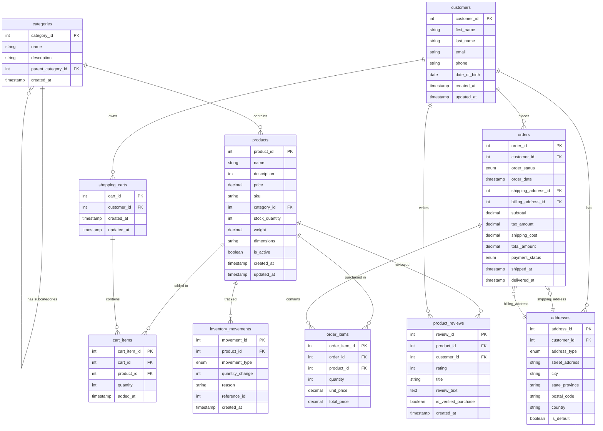

# E-commerce Database Example

This example demonstrates a comprehensive e-commerce database schema suitable for online retail applications.

## Database Schema Overview

## Key Features

### 1. **Hierarchical Categories**
- Supports nested categories (Electronics > Laptops)
- Self-referencing foreign key design

### 2. **Comprehensive Product Management**
- SKU tracking for inventory
- Stock quantity management
- Product attributes (weight, dimensions)
- Active/inactive status

### 3. **Customer Management**
- Multiple addresses per customer
- Separate billing and shipping addresses
- Customer profile information

### 4. **Shopping Cart Functionality**
- Persistent cart storage
- Multiple items per cart
- Quantity management

### 5. **Order Processing**
- Multiple order statuses
- Payment tracking
- Shipping and delivery timestamps
- Order item details with pricing

### 6. **Review System**
- Star ratings (1-5)
- Verified purchase tracking
- Review text and titles

### 7. **Inventory Tracking**
- Movement logging (in/out/adjustments)
- Reference tracking for audit trail

## Common Interview Questions

### Schema Design
1. **Why separate addresses from customers?**
   - Customers often have multiple addresses
   - Supports both billing and shipping addresses
   - Historical address tracking for orders

2. **Why track unit_price in order_items?**
   - Prices change over time
   - Order history should reflect price at time of purchase
   - Historical accuracy for reporting

3. **How to handle product variants?**
   - Could extend with `product_variants` table
   - Store size, color, etc. as separate products
   - Use parent-child relationships

### Performance Considerations
1. **Indexing Strategy**
   - Primary keys (automatic)
   - Foreign keys for joins
   - Email for customer lookup
   - SKU for product lookup
   - Order status and date for reporting

2. **Query Optimization**
   - Use appropriate JOINs
   - Limit result sets
   - Consider denormalization for reporting

### Business Logic
1. **Cart vs Wishlist**
   - Cart: intended for purchase
   - Wishlist: saved for later
   - Could add `cart_type` enum

2. **Inventory Management**
   - Real-time stock updates
   - Reserved quantities for pending orders
   - Low stock alerts

## Files Included

- `schema.sql` - Complete database schema
- `sample_data.sql` - Test data for practice
- `queries.sql` - Common query patterns
- `README.md` - This documentation

## Practice Scenarios

1. **Find abandoned carts** - Carts with items but no recent orders
2. **Calculate customer lifetime value** - Total spending per customer
3. **Inventory reports** - Low stock alerts, movement tracking
4. **Sales analytics** - Revenue by category, time periods
5. **Product recommendations** - Based on purchase history