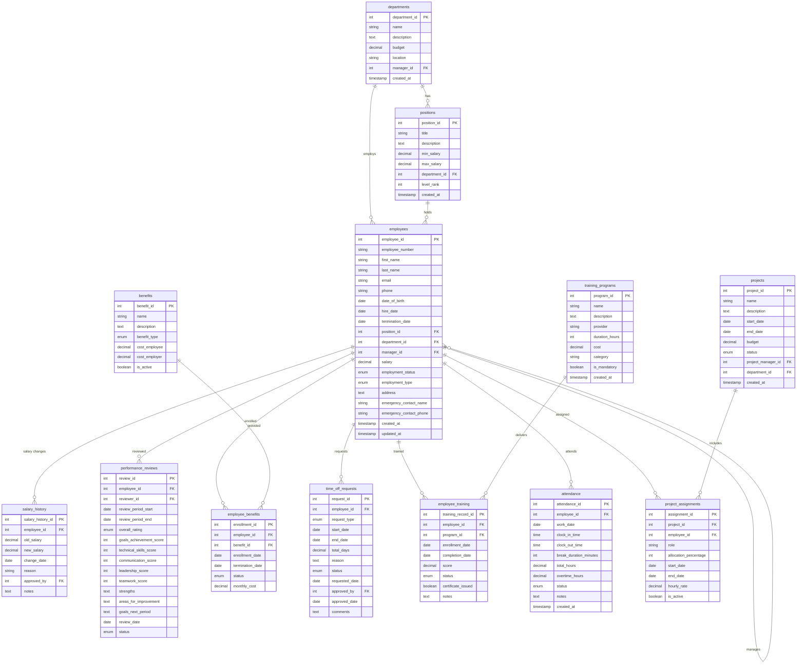

# Employee Management System

A comprehensive HR database schema covering employee lifecycle from hiring to performance management, benefits administration, and project assignments.

## Schema Overview



## Key Features

### 1. **Organizational Structure**
- Hierarchical department organization
- Position levels and salary ranges
- Manager-employee relationships

### 2. **Employee Lifecycle**
- Hiring and termination tracking
- Employment status and type management
- Contact information and emergency contacts

### 3. **Compensation Management**
- Current salary tracking
- Complete salary history with approval trail
- Position-based salary ranges

### 4. **Performance Management**
- Annual performance reviews
- Multi-dimensional scoring (goals, technical, communication, leadership, teamwork)
- Performance improvement tracking

### 5. **Benefits Administration**
- Multiple benefit types (health, dental, vision, retirement)
- Employee and employer cost tracking
- Enrollment and termination management

### 6. **Time and Attendance**
- Time off request management
- Daily attendance tracking
- Overtime calculation
- Multiple leave types

### 7. **Training and Development**
- Training program catalog
- Employee enrollment and completion tracking
- Certification management
- Mandatory vs optional training

### 8. **Project Management**
- Project assignments and resource allocation
- Role-based assignments
- Allocation percentage tracking
- Hourly rate management

## Common HR Operations

### Employee Onboarding
```sql
-- Create new employee
INSERT INTO employees (employee_number, first_name, last_name, email, hire_date, position_id, department_id, manager_id, salary)
VALUES ('EMP024', 'John', 'Doe', 'john.doe@company.com', CURDATE(), 1, 1, 7, 75000);

-- Enroll in mandatory benefits
INSERT INTO employee_benefits (employee_id, benefit_id, enrollment_date, status)
SELECT LAST_INSERT_ID(), benefit_id, CURDATE(), 'active'
FROM benefits WHERE is_active = TRUE;
```

### Performance Review Cycle
```sql
-- Find employees due for review
SELECT employee_id, CONCAT(first_name, ' ', last_name) as name
FROM employees e
WHERE employment_status = 'active'
AND NOT EXISTS (
    SELECT 1 FROM performance_reviews pr 
    WHERE pr.employee_id = e.employee_id 
    AND pr.review_period_end >= DATE_SUB(CURDATE(), INTERVAL 1 YEAR)
);
```

### Salary Adjustment
```sql
-- Record salary increase
INSERT INTO salary_history (employee_id, old_salary, new_salary, change_date, reason, approved_by)
VALUES (?, (SELECT salary FROM employees WHERE employee_id = ?), ?, CURDATE(), 'Annual increase', ?);

-- Update current salary
UPDATE employees SET salary = ? WHERE employee_id = ?;
```

## Interview Questions

### Schema Design
1. **Why separate salary_history from employees?**
   - Track all salary changes over time
   - Audit trail for compensation decisions
   - Historical reporting capabilities

2. **How to handle organizational changes?**
   - Department mergers/splits
   - Position reclassifications
   - Manager changes

3. **Managing project allocations?**
   - Resource utilization tracking
   - Billing rate management
   - Capacity planning

### Business Logic
1. **Performance review workflows**
2. **Time off accrual and balances**
3. **Benefits eligibility rules**
4. **Training compliance tracking**
5. **Overtime calculation policies**

### Reporting Challenges
1. **Headcount by department over time**
2. **Average tenure and turnover rates**
3. **Compensation analysis and equity**
4. **Training effectiveness metrics**
5. **Project profitability analysis**

## Advanced Queries

### Employee Cost Analysis
```sql
SELECT 
    department,
    COUNT(*) as headcount,
    SUM(salary) as total_salaries,
    SUM(benefit_costs) as total_benefits,
    SUM(salary + benefit_costs) as total_employee_cost
FROM (
    SELECT 
        d.name as department,
        e.salary,
        COALESCE(SUM(eb.monthly_cost * 12), 0) as benefit_costs
    FROM employees e
    JOIN departments d ON e.department_id = d.department_id
    LEFT JOIN employee_benefits eb ON e.employee_id = eb.employee_id AND eb.status = 'active'
    WHERE e.employment_status = 'active'
    GROUP BY e.employee_id, d.name, e.salary
) employee_costs
GROUP BY department;
```

### Manager Effectiveness
```sql
SELECT 
    manager_name,
    direct_reports,
    avg_performance_rating,
    avg_tenure_years,
    retention_rate
FROM (
    SELECT 
        CONCAT(m.first_name, ' ', m.last_name) as manager_name,
        COUNT(e.employee_id) as direct_reports,
        AVG(CASE pr.overall_rating 
            WHEN 'exceeds' THEN 4
            WHEN 'meets' THEN 3
            WHEN 'partially_meets' THEN 2
            WHEN 'does_not_meet' THEN 1
        END) as avg_performance_rating,
        AVG(DATEDIFF(COALESCE(e.termination_date, CURDATE()), e.hire_date) / 365.25) as avg_tenure_years,
        COUNT(CASE WHEN e.employment_status = 'active' THEN 1 END) / COUNT(e.employee_id) as retention_rate
    FROM employees m
    JOIN employees e ON m.employee_id = e.manager_id
    LEFT JOIN performance_reviews pr ON e.employee_id = pr.employee_id AND pr.status = 'final'
    GROUP BY m.employee_id, m.first_name, m.last_name
    HAVING direct_reports >= 3
) manager_metrics
ORDER BY avg_performance_rating DESC, retention_rate DESC;
```

## Practice Scenarios

1. **Org Chart Generation** - Build hierarchical organization structure
2. **Payroll Processing** - Calculate total compensation costs
3. **Performance Analytics** - Identify top and bottom performers
4. **Workforce Planning** - Predict hiring needs by department
5. **Compliance Reporting** - Track training completion and certifications