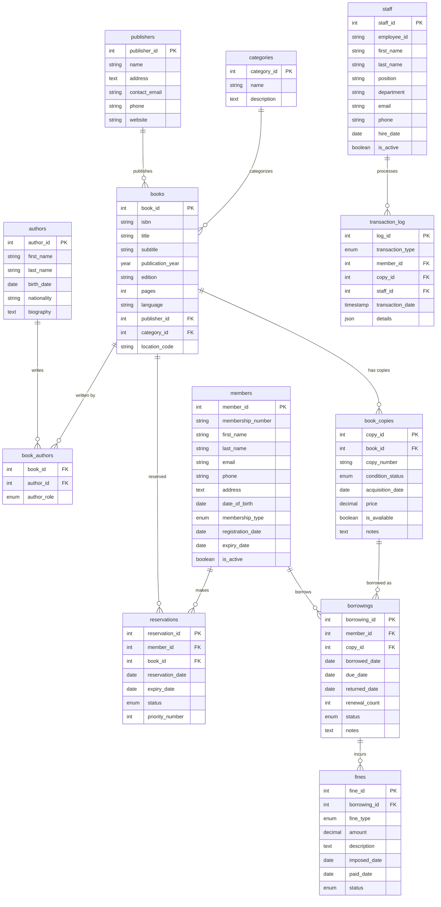

# Library Management System

A comprehensive database schema for managing library operations including book catalog, member management, borrowing/returning, reservations, and fines.

## Schema Overview



## Key Features

### 1. **Multi-Author Support**
- Many-to-many relationship between books and authors
- Support for different author roles (primary, co-author, editor, translator)

### 2. **Copy Management**
- Multiple copies of the same book
- Individual tracking of condition and availability
- Acquisition date and cost tracking

### 3. **Member Management**
- Different membership types (student, adult, senior, faculty)
- Membership expiration tracking
- Contact information management

### 4. **Borrowing System**
- Due date calculation
- Renewal tracking
- Multiple status states (active, returned, overdue, lost)

### 5. **Reservation System**
- Queue management with priority numbers
- Automatic expiration of reservations
- Status tracking

### 6. **Fine Management**
- Different fine types (overdue, damage, lost)
- Payment tracking
- Fine calculation automation

### 7. **Audit Trail**
- Complete transaction logging
- JSON details for flexible data storage
- Staff activity tracking

## Common Library Operations

### Book Availability Check
```sql
SELECT COUNT(*) as available_copies
FROM book_copies bc
JOIN books b ON bc.book_id = b.book_id
WHERE b.isbn = '978-0-452-28423-4' 
AND bc.is_available = TRUE;
```

### Check Out Process
```sql
-- Update copy availability
UPDATE book_copies SET is_available = FALSE WHERE copy_id = ?;

-- Create borrowing record
INSERT INTO borrowings (member_id, copy_id, borrowed_date, due_date)
VALUES (?, ?, CURDATE(), DATE_ADD(CURDATE(), INTERVAL 14 DAY));
```

### Calculate Overdue Fines
```sql
SELECT 
    borrowing_id,
    DATEDIFF(CURDATE(), due_date) as days_overdue,
    DATEDIFF(CURDATE(), due_date) * 0.50 as fine_amount
FROM borrowings
WHERE status = 'overdue' AND due_date < CURDATE();
```

## Interview Questions

### Schema Design
1. **Why separate books from book_copies?**
   - Same book can have multiple physical copies
   - Individual tracking of condition and availability
   - Historical lending data per copy

2. **How to handle series of books?**
   - Add series_id and volume_number to books table
   - Create separate series table for metadata

3. **Managing book reservations fairly?**
   - Priority queue with reservation_date ordering
   - Member type priority (faculty > adult > student)
   - First-come-first-served within same priority

### Business Logic
1. **Automatic fine calculation**
2. **Reservation expiration**
3. **Member privilege levels**
4. **Renewal limits**
5. **Lost book handling**

### Performance Considerations
- Index on due_date for overdue queries
- Index on member_id for quick lookup
- Index on isbn for book searches
- Composite index on (book_id, is_available)

## Practice Scenarios

1. **Overdue Management** - Find all overdue books and calculate fines
2. **Popular Books** - Identify most borrowed titles
3. **Member Analytics** - Track reading patterns
4. **Inventory Reports** - Books needing replacement
5. **Staff Performance** - Transaction processing metrics