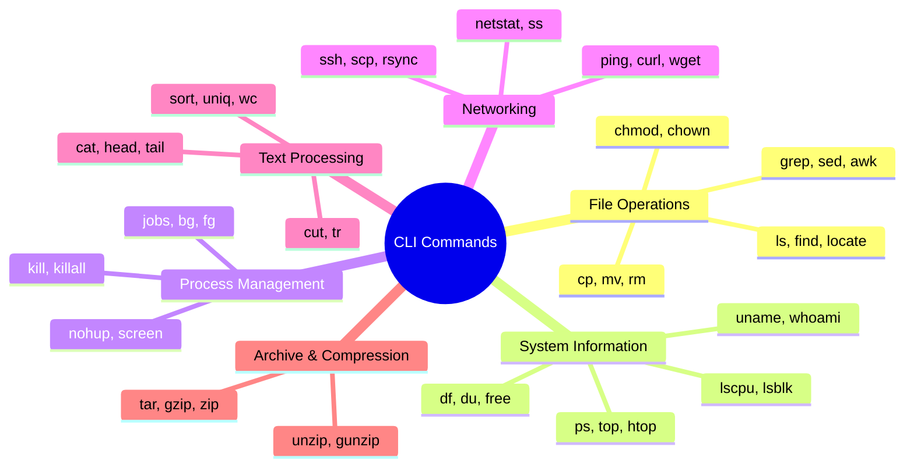

# Linux/MacOS Command Line Reference for Interviews

## Command Categories Overview



## 1. File System Navigation & Operations

### Basic Navigation
```bash
# List files and directories
ls -la                    # Detailed list with hidden files
ls -lh                    # Human readable file sizes
ls -lt                    # Sort by modification time

# Change directory
cd /path/to/directory     # Absolute path
cd ..                     # Parent directory
cd ~                      # Home directory
cd -                      # Previous directory

# Current directory
pwd                       # Print working directory
```

### File Operations
```bash
# Create files/directories
touch file.txt            # Create empty file
mkdir directory           # Create directory
mkdir -p path/to/dir      # Create nested directories

# Copy, move, remove
cp source dest            # Copy file
cp -r source dest         # Copy directory recursively
mv source dest            # Move/rename
rm file.txt               # Remove file
rm -rf directory          # Remove directory recursively (dangerous!)

# File permissions
chmod 755 file.txt        # Change permissions (rwxr-xr-x)
chmod +x script.sh        # Make executable
chown user:group file     # Change ownership
```

### Finding Files
```bash
# Find files by name
find . -name "*.txt"      # Find all .txt files
find /path -type f -name "pattern"
locate filename           # Quick search (if updatedb ran)

# Find by size/time
find . -size +100M        # Files larger than 100MB
find . -mtime -7          # Files modified in last 7 days
find . -type f -executable # Find executable files
```

## 2. Text Processing & Search

### Viewing File Contents
```bash
cat file.txt              # Display entire file
head -n 10 file.txt       # First 10 lines
tail -n 10 file.txt       # Last 10 lines
tail -f log.txt           # Follow file changes (logs)
less file.txt             # Paginated view
more file.txt             # Simple pager
```

### Text Search & Manipulation
```bash
# Search in files
grep "pattern" file.txt   # Search for pattern
grep -r "pattern" .       # Recursive search
grep -i "pattern" file    # Case insensitive
grep -n "pattern" file    # Show line numbers
grep -v "pattern" file    # Invert match (exclude)

# Text processing
sed 's/old/new/g' file    # Replace text
awk '{print $1}' file     # Print first column
cut -d',' -f1 file.csv    # Cut first field (CSV)
sort file.txt             # Sort lines
uniq file.txt             # Remove duplicates
wc -l file.txt            # Count lines
tr 'a-z' 'A-Z' < file     # Transform characters
```

## 3. System Information & Monitoring

### System Info
```bash
# System details
uname -a                  # System information
whoami                    # Current user
id                        # User/group IDs
hostname                  # Machine name
uptime                    # System uptime
date                      # Current date/time

# Hardware info
lscpu                     # CPU information (Linux)
sysctl -n hw.ncpu         # CPU count (macOS)
lsblk                     # Block devices (Linux)
diskutil list            # Disk info (macOS)
```

### Process Management
```bash
# View processes
ps aux                    # All running processes
ps -ef                    # Full format listing
top                       # Real-time process viewer
htop                      # Enhanced process viewer
pgrep process_name        # Find process by name

# Control processes
kill PID                  # Terminate process
kill -9 PID               # Force kill
killall process_name      # Kill by name
jobs                      # List background jobs
bg %1                     # Background job 1
fg %1                     # Foreground job 1
nohup command &           # Run detached from terminal
```

### System Resources
```bash
# Memory and disk
free -h                   # Memory usage (Linux)
vm_stat                   # Memory stats (macOS)
df -h                     # Disk space usage
du -sh *                  # Directory sizes
du -h --max-depth=1       # Directory sizes (1 level)

# System load
iostat                    # I/O statistics
vmstat                    # Virtual memory stats
sar                       # System activity reporter
```

## 4. Networking Commands

```bash
# Network connectivity
ping google.com           # Test connectivity
ping -c 4 host           # Ping 4 times
traceroute google.com    # Trace network path
nslookup domain.com      # DNS lookup
dig domain.com           # DNS information

# Network connections
netstat -tuln            # Listen ports
ss -tuln                 # Modern netstat alternative
lsof -i :80              # What's using port 80
netstat -an | grep :22   # SSH connections

# Download/upload
curl -O url              # Download file
wget url                 # Download file (Linux)
curl -X POST -d "data" url # POST request
scp file user@host:path  # Secure copy over SSH
rsync -av src/ dest/     # Synchronize directories
```

## 5. Archive & Compression

```bash
# tar archives
tar -czf archive.tar.gz dir/    # Create compressed archive
tar -xzf archive.tar.gz         # Extract compressed archive
tar -tf archive.tar             # List archive contents

# zip files
zip -r archive.zip dir/         # Create zip archive
unzip archive.zip               # Extract zip
unzip -l archive.zip            # List zip contents

# Individual compression
gzip file.txt                   # Compress file
gunzip file.txt.gz              # Decompress file
```

## 6. Input/Output & Redirection

### Redirection Flow
```mermaid
flowchart LR
    A[Command] --> B[stdout]
    A --> C[stderr]
    A --> D[stdin]
    
    B --> E[> file.txt]
    B --> F[>> file.txt]
    C --> G[2> error.log]
    B --> H[| next_command]
    
    E --> I[Overwrite file]
    F --> J[Append to file]
    G --> K[Redirect errors]
    H --> L[Pipe to next]
```

### Redirection Examples
```bash
# Output redirection
command > file.txt        # Redirect stdout to file
command >> file.txt       # Append stdout to file
command 2> error.log      # Redirect stderr to file
command &> all.log        # Redirect both stdout and stderr

# Input redirection
command < input.txt       # Use file as input
command <<< "string"      # Use string as input

# Pipes
ps aux | grep python      # Pipe output to grep
cat file | sort | uniq    # Chain multiple commands
ls -la | head -5          # First 5 lines of ls output
```

## 7. Environment & Variables

```bash
# Environment variables
echo $HOME                # Display variable
export VAR=value          # Set environment variable
env                       # List all environment variables
which command             # Find command location
whereis command           # Locate command and manuals

# Path manipulation
echo $PATH                # Display PATH
export PATH=$PATH:/new/path # Add to PATH

# Command history
history                   # Command history
!!                        # Last command
!n                        # Command number n
!string                   # Last command starting with string
```

## 8. Advanced Commands for Interviews

### System Administration
```bash
# Service management (systemd)
systemctl status service  # Service status
systemctl start service   # Start service
systemctl enable service  # Enable at boot
journalctl -u service     # Service logs

# Cron jobs
crontab -l                # List cron jobs
crontab -e                # Edit cron jobs

# User management
sudo adduser username     # Add user
sudo usermod -aG group user # Add user to group
su - username             # Switch user
sudo command              # Run as root
```

### Performance Analysis
```bash
# System monitoring
iotop                     # I/O usage by process
nethogs                  # Network usage by process
htop                      # Interactive process viewer
atop                      # Advanced system monitor

# Debugging
strace command            # System call tracing
ldd binary               # Library dependencies
file filename            # File type information
strings binary           # Extract strings from binary
```

## 9. Keyboard Shortcuts (Terminal)

```bash
# Navigation
Ctrl + A                  # Beginning of line
Ctrl + E                  # End of line
Ctrl + U                  # Delete to beginning
Ctrl + K                  # Delete to end
Ctrl + W                  # Delete previous word

# Process control
Ctrl + C                  # Interrupt (SIGINT)
Ctrl + Z                  # Suspend (SIGTSTP)
Ctrl + D                  # EOF/Exit
Ctrl + L                  # Clear screen

# History
Ctrl + R                  # Reverse search
Ctrl + P                  # Previous command (↑)
Ctrl + N                  # Next command (↓)
```

## 10. Common Interview Scenarios

### Log Analysis
```bash
# Find errors in logs
grep -i error /var/log/syslog
tail -f /var/log/application.log | grep ERROR

# Count occurrences
grep -c "404" access.log

# Top IP addresses
awk '{print $1}' access.log | sort | uniq -c | sort -nr | head -10
```

### Process Troubleshooting
```bash
# Find memory-hungry processes
ps aux --sort=-%mem | head

# Find processes by CPU usage
ps aux --sort=-%cpu | head

# Kill processes by pattern
pkill -f "python script.py"
```

### Disk Space Issues
```bash
# Find large files
find / -type f -size +100M 2>/dev/null

# Directory usage summary
du -sh /* | sort -hr

# Find files by age
find /tmp -type f -mtime +30 -delete
```

## Quick Reference Card

| Category | Command | Description |
|----------|---------|-------------|
| Files | `ls -la` | Detailed file listing |
| Files | `find . -name "*.log"` | Find log files |
| Text | `grep -r "error" .` | Search for "error" recursively |
| System | `ps aux` | List all processes |
| System | `df -h` | Disk usage |
| Network | `netstat -tuln` | Network connections |
| Archives | `tar -xzf file.tar.gz` | Extract tar.gz |
| Permissions | `chmod 755 file` | Set permissions |

## Tips for Interviews

1. **Always use `-h` flag** for human-readable output when available
2. **Combine commands** with pipes to show efficiency
3. **Know the difference** between `ps aux` vs `ps -ef`
4. **Understand permissions** (755, 644, etc.)
5. **Practice log analysis** scenarios
6. **Know basic regex** for grep and sed
7. **Understand process signals** (SIGTERM vs SIGKILL)
8. **Be familiar with both** absolute and relative paths