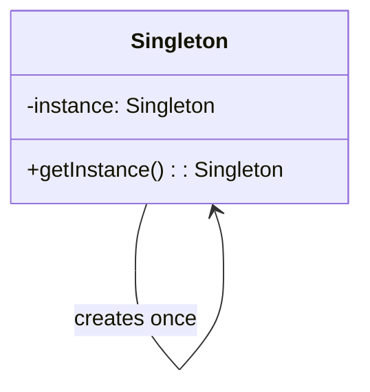
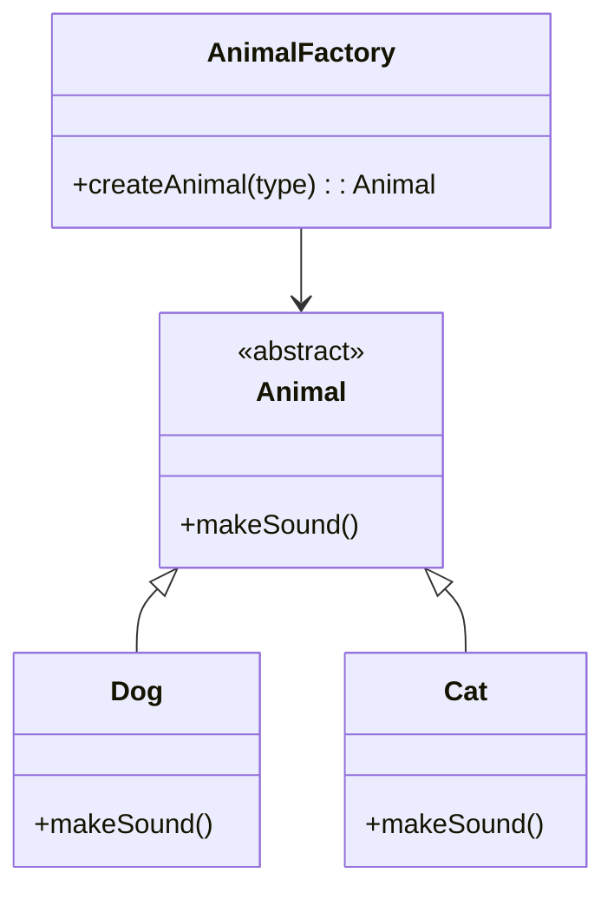
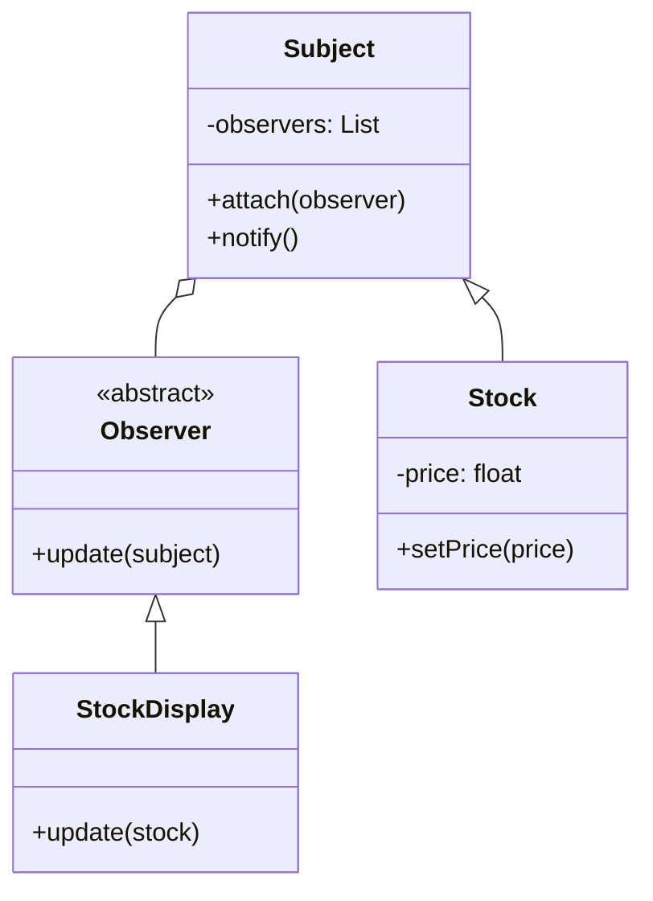
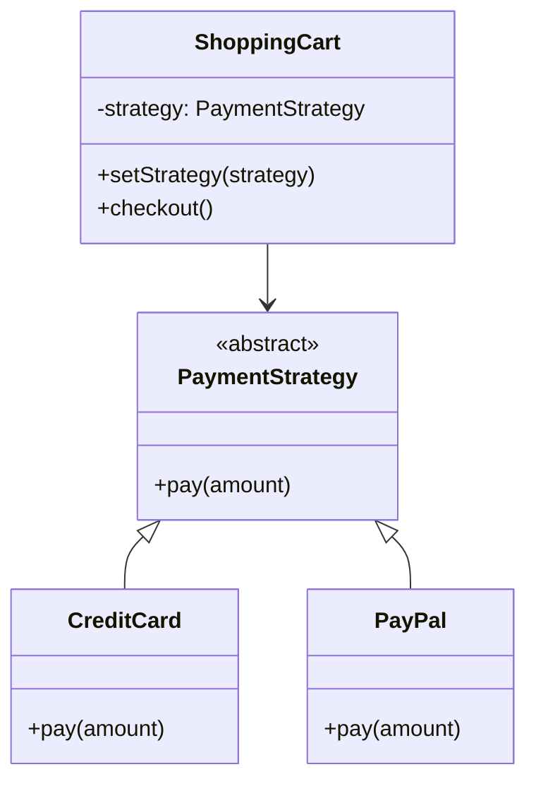
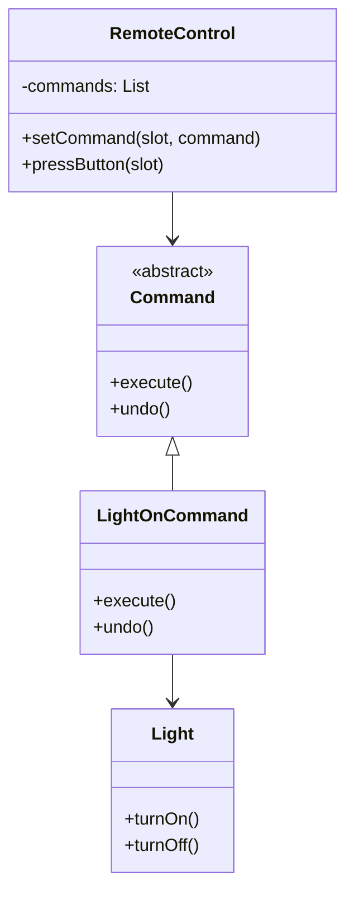
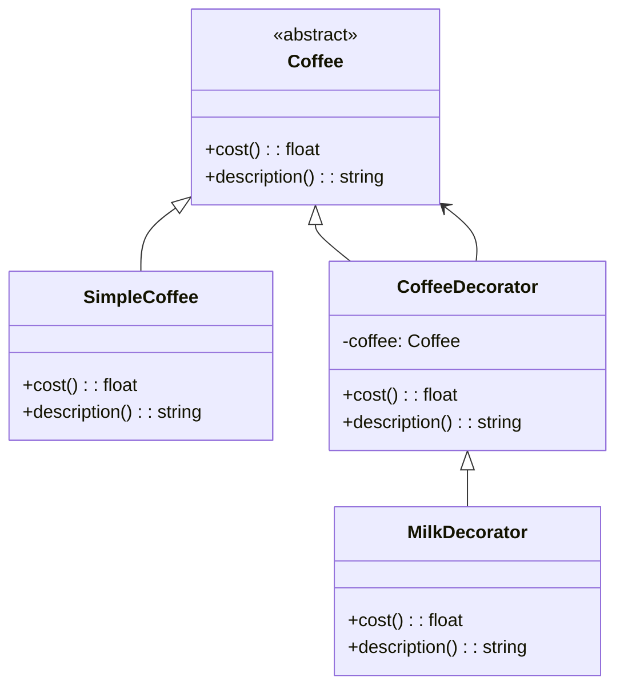
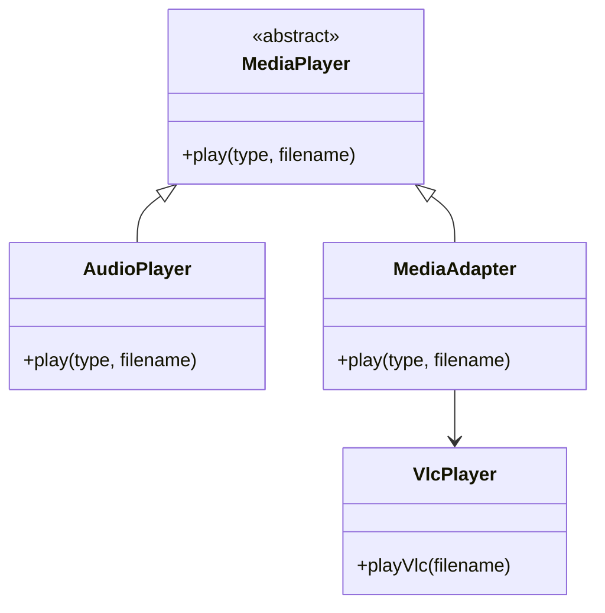
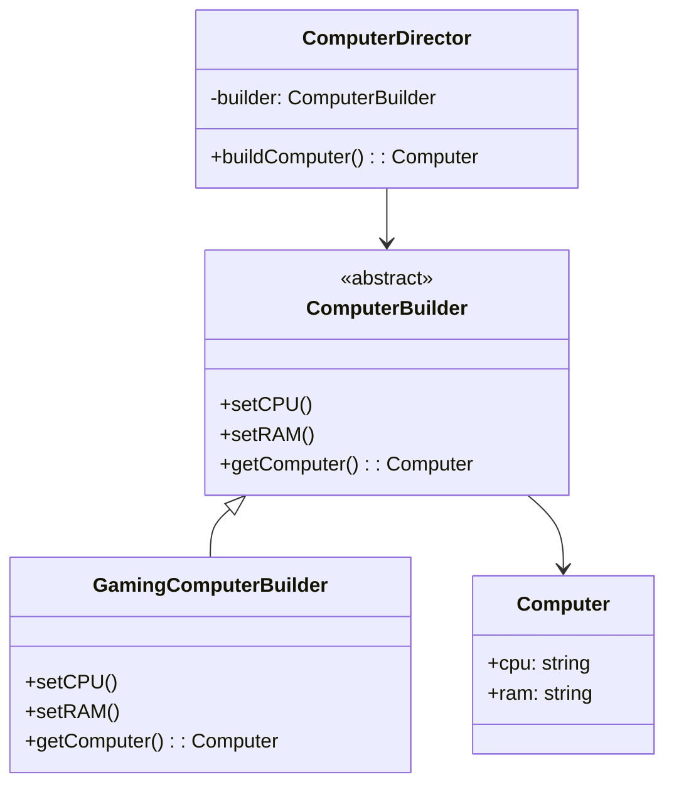

# Design Patterns for Interviews

Common design patterns with Python examples, visual diagrams, and comprehensive unit tests.

## Project Structure

```
design-patterns/
├── src/
│   └── design_patterns/
│       ├── __init__.py
│       ├── singleton.py
│       ├── factory.py
│       ├── observer.py
│       ├── strategy.py
│       ├── command.py
│       ├── decorator.py
│       ├── adapter.py
│       └── builder.py
├── tests/
│   ├── __init__.py
│   ├── test_singleton.py
│   ├── test_factory.py
│   ├── test_observer.py
│   ├── test_strategy.py
│   ├── test_command.py
│   ├── test_decorator.py
│   ├── test_adapter.py
│   └── test_builder.py
├── pyproject.toml
└── README.md
```

## Setup and Installation

This project uses [uv](https://docs.astral.sh/uv/) for dependency management.

```bash
# Install dependencies
uv sync --dev

# Or install with pip
pip install -e ".[dev]"
```

## Running Tests

```bash
# Run all tests with coverage
uv run pytest

# Run specific test file
uv run pytest tests/test_singleton.py

# Run tests with verbose output
uv run pytest -v

# Run tests without coverage
uv run pytest --no-cov
```

## Running Examples

```bash
# Run all pattern examples at once
uv run python run_examples.py

# Run individual pattern examples
uv run python src/design_patterns/singleton.py
uv run python src/design_patterns/factory.py
# ... etc for other patterns
```

## 1. Singleton Pattern
**Purpose:** Ensures only one instance exists  
**Use Cases:** Database connections, loggers, caches



## 2. Factory Pattern
**Purpose:** Creates objects without specifying exact classes  
**Use Cases:** Animal factory, vehicle factory, UI components



## 3. Observer Pattern
**Purpose:** One-to-many dependency notification  
**Use Cases:** Stock prices, newsletter subscriptions, MVC



## 4. Strategy Pattern
**Purpose:** Interchangeable algorithms  
**Use Cases:** Payment processing, sorting, compression



## 5. Command Pattern
**Purpose:** Encapsulates requests as objects  
**Use Cases:** Undo/redo, remote controls, queuing



## 6. Decorator Pattern
**Purpose:** Adds behavior dynamically  
**Use Cases:** Coffee shop, text formatting, middleware



## 7. Adapter Pattern
**Purpose:** Makes incompatible interfaces work together  
**Use Cases:** Third-party libraries, legacy systems



## 8. Builder Pattern
**Purpose:** Constructs complex objects step by step  
**Use Cases:** Computer builder, house builder, SQL queries



## Interview Tips
- **Know the problem each pattern solves**
- **Identify when to use each pattern**
- **Be able to implement from scratch**
- **Understand trade-offs and alternatives**
- **Practice drawing UML diagrams**

## Additional Resources
- [Refactoring Guru - Design Patterns](https://refactoring.guru/design-patterns) - Comprehensive guide with examples and explanations