# Python Coding Interview Preparation

This repository contains resources and practice problems to help you prepare for Python coding interviews.

## Table of Contents
- [Common Data Structures](#common-data-structures)
- [Essential Algorithms](#essential-algorithms)
- [Problem Categories](#problem-categories)
- [Sample Problems](#sample-problems)
- [Time & Space Complexity](#time--space-complexity)
- [Interview Tips](#interview-tips)

## Common Data Structures


### Key Python Data Structures
- **List**: `[1, 2, 3]` - Dynamic array, O(1) append, O(n) insert/delete
- **Dictionary**: `{'key': 'value'}` - Hash table, O(1) average lookup
- **Set**: `{1, 2, 3}` - Hash set, O(1) membership testing
- **Tuple**: `(1, 2, 3)` - Immutable sequence
- **Deque**: `collections.deque()` - Double-ended queue, O(1) operations at both ends

### Mutable vs Immutable Data Types

#### Mutable (Can be changed after creation)
- **List**: `[1, 2, 3]` - Elements can be added, removed, or modified
- **Dictionary**: `{'a': 1}` - Keys and values can be added, removed, or modified
- **Set**: `{1, 2, 3}` - Elements can be added or removed
- **Deque**: `collections.deque([1, 2, 3])` - Elements can be added/removed from both ends
- **Custom Objects**: Class instances (unless specifically made immutable)

#### Immutable (Cannot be changed after creation)
- **Tuple**: `(1, 2, 3)` - Elements cannot be modified
- **String**: `"hello"` - Characters cannot be changed (creates new string)
- **Frozenset**: `frozenset({1, 2, 3})` - Immutable version of set
- **Numbers**: `int`, `float`, `complex` - Values cannot be changed
- **Boolean**: `True`, `False` - Cannot be modified
- **None**: The None object

#### Important Notes
- Immutable objects are hashable and can be used as dictionary keys
- Mutable objects inside immutable containers don't make the container truly immutable
- String operations create new objects rather than modifying existing ones

## Essential Algorithms


## Problem Categories

### 1. Array & String Problems
- Two pointers technique
- Sliding window
- Prefix sums
- Array manipulation

### 2. Tree & Graph Problems
- Tree traversals (inorder, preorder, postorder)
- Graph traversals (DFS, BFS)
- Shortest path algorithms
- Tree construction

### 3. Dynamic Programming
- 1D and 2D DP
- Memoization vs tabulation
- Common patterns (knapsack, LIS, etc.)

### 4. Hash Table Problems
- Frequency counting
- Two sum variations
- Group anagrams

## Sample Problems

### Problem 1: Two Sum
```python
def two_sum(nums, target):
    """
    Find two numbers that add up to target.
    Time: O(n), Space: O(n)
    """
    seen = {}
    for i, num in enumerate(nums):
        complement = target - num
        if complement in seen:
            return [seen[complement], i]
        seen[num] = i
    return []

# Example usage
nums = [2, 7, 11, 15]
target = 9
print(two_sum(nums, target))  # [0, 1]
```

### Problem 2: Valid Parentheses
```python
def is_valid(s):
    """
    Check if parentheses are balanced.
    Time: O(n), Space: O(n)
    """
    stack = []
    mapping = {')': '(', '}': '{', ']': '['}
    
    for char in s:
        if char in mapping:
            if not stack or stack.pop() != mapping[char]:
                return False
        else:
            stack.append(char)
    
    return not stack

# Example usage
print(is_valid("()[]{}"))  # True
print(is_valid("([)]"))    # False
```

### Problem 3: Binary Tree Inorder Traversal
```python
class TreeNode:
    def __init__(self, val=0, left=None, right=None):
        self.val = val
        self.left = left
        self.right = right

def inorder_traversal(root):
    """
    Inorder traversal of binary tree.
    Time: O(n), Space: O(h) where h is height
    """
    result = []
    
    def dfs(node):
        if node:
            dfs(node.left)
            result.append(node.val)
            dfs(node.right)
    
    dfs(root)
    return result
```

## Time & Space Complexity

```mermaid
graph TD
    A[Complexity Analysis] --> B[Time Complexity]
    A --> C[Space Complexity]
    
    B --> D["O(1) - Constant"]
    B --> E["O(log n) - Logarithmic"]
    B --> F["O(n) - Linear"]
    B --> G["O(n log n) - Linearithmic"]
    B --> H["O(n²) - Quadratic"]
    
    C --> I["O(1) - Constant Space"]
    C --> J["O(n) - Linear Space"]
    C --> K["O(h) - Height of Tree"]
```



### Common Time Complexities
- **O(1)**: Hash table lookup, array access
- **O(log n)**: Binary search, balanced tree operations
- **O(n)**: Linear search, tree traversal
- **O(n log n)**: Efficient sorting algorithms
- **O(n²)**: Nested loops, bubble sort

## Interview Tips

### Before the Interview
1. **Practice consistently** - Solve 1-2 problems daily
2. **Understand patterns** - Learn common problem-solving techniques
3. **Time yourself** - Practice under time constraints
4. **Review basics** - Know your data structures and algorithms

### During the Interview
1. **Clarify the problem** - Ask questions about edge cases
2. **Think out loud** - Explain your thought process
3. **Start with brute force** - Then optimize
4. **Test your solution** - Walk through examples
5. **Analyze complexity** - Discuss time and space complexity

### Python-Specific Tips
- Use list comprehensions when appropriate
- Leverage built-in functions (`sorted()`, `max()`, `min()`)
- Know collections module (`Counter`, `defaultdict`, `deque`)
- Understand string methods (`split()`, `join()`, `strip()`)
- Use enumerate() and zip() effectively

### Common Python Patterns
```python
# Frequency counting
from collections import Counter
freq = Counter(arr)

# Default dictionary
from collections import defaultdict
graph = defaultdict(list)

# Two pointers
left, right = 0, len(arr) - 1

# Sliding window
window_sum = sum(arr[:k])
for i in range(k, len(arr)):
    window_sum += arr[i] - arr[i-k]
```

## Practice Resources
- LeetCode (start with Easy problems)
- HackerRank
- CodeSignal
- Pramp (mock interviews)

Good luck with your interview preparation! 🐍