# Binary Tree Interview Preparation 🌳

A comprehensive Python library for binary tree algorithms and interview preparation, built with `uv` for modern Python development.

## 📋 Table of Contents

- [Overview](#overview)
- [Installation](#installation)
- [Binary Tree Fundamentals](#binary-tree-fundamentals)
- [Core Algorithms](#core-algorithms)
- [Interview Questions Covered](#interview-questions-covered)
- [Usage Examples](#usage-examples)
- [Visual Representations](#visual-representations)
- [Time & Space Complexity](#time--space-complexity)

## 🎯 Overview

This repository contains implementations of essential binary tree algorithms commonly asked in technical interviews. It covers:

- **Tree Traversals**: DFS (Inorder, Preorder, Postorder) and BFS (Level Order)
- **Tree Properties**: Height, Depth, Diameter, Balance Check
- **Path Problems**: Path Sum, Lowest Common Ancestor
- **Tree Views**: Right Side View
- **Serialization/Deserialization**
- **Various Tree Types**: Complete, Perfect, Balanced, Skewed

## 🚀 Installation

```bash
# Clone the repository
git clone <your-repo-url>
cd binary-tree-prep

# Install dependencies with uv
uv sync

# Run examples
uv run examples.py
```

## 🌲 Binary Tree Fundamentals

### Tree Node Structure

```python
class TreeNode:
    def __init__(self, val=0, left=None, right=None):
        self.val = val
        self.left = left
        self.right = right
```

### Tree Types


## 🔄 Core Algorithms

### 1. Depth-First Search (DFS) Traversals

#### Inorder Traversal (Left → Root → Right)
- **Use Case**: Get sorted order in BST
- **Pattern**: Process left subtree, current node, then right subtree


**Order**: 4 → 2 → 5 → 1 → 3

#### Preorder Traversal (Root → Left → Right)
- **Use Case**: Tree serialization, creating tree copy
- **Pattern**: Process current node, left subtree, then right subtree


**Order**: 1 → 2 → 4 → 5 → 3

#### Postorder Traversal (Left → Right → Root)
- **Use Case**: Tree deletion, calculating directory sizes
- **Pattern**: Process left subtree, right subtree, then current node


**Order**: 4 → 5 → 2 → 3 → 1

### 2. Breadth-First Search (BFS) - Level Order

- **Use Case**: Level-by-level processing, shortest path problems
- **Pattern**: Process nodes level by level using a queue


**Order**: [1] → [2, 3] → [4, 5, 6]

## 📊 Algorithm Implementations

### Tree Properties

```python
# Height/Depth calculation
def max_depth(self) -> int:
    def depth(node):
        if not node:
            return 0
        return 1 + max(depth(node.left), depth(node.right))
    return depth(self.root)

# Diameter calculation
def diameter(self) -> int:
    self.max_diameter = 0
    def height(node):
        if not node:
            return 0
        left_height = height(node.left)
        right_height = height(node.right)
        self.max_diameter = max(self.max_diameter, left_height + right_height)
        return 1 + max(left_height, right_height)
    height(self.root)
    return self.max_diameter
```

### Path Problems

```mermaid
graph TD
    A[5] --> B[4]
    A --> C[8]
    B --> D[11]
    C --> E[13]
    C --> F[4]
    D --> G[7]
    D --> H[2]
    F --> I[1]
    
    classDef path fill:#ffcdd2
    class A,B,D,H path
    
    subgraph "Path Sum = 22"
        P1["5 → 4 → 11 → 2 = 22"]
    end
```



## 🎯 Interview Questions Covered

### Easy Level
- ✅ Binary Tree Inorder Traversal
- ✅ Binary Tree Preorder Traversal  
- ✅ Binary Tree Postorder Traversal
- ✅ Binary Tree Level Order Traversal
- ✅ Maximum Depth of Binary Tree
- ✅ Minimum Depth of Binary Tree
- ✅ Path Sum

### Medium Level
- ✅ Binary Tree Right Side View
- ✅ Diameter of Binary Tree
- ✅ Balanced Binary Tree
- ✅ Lowest Common Ancestor
- ✅ Serialize and Deserialize Binary Tree

### Advanced Patterns
- ✅ Tree construction from traversals
- ✅ Path sum variations
- ✅ Tree views (left, right, top, bottom)
- ✅ Morris traversal (space-optimized)

## 💻 Usage Examples

### Basic Usage

```python
from src.binary_tree_prep.binary_tree import BinaryTree

# Create tree from list
tree = BinaryTree.from_list([3, 9, 20, None, None, 15, 7])

# Traversals
print(tree.inorder_traversal())     # [9, 3, 15, 20, 7]
print(tree.preorder_traversal())   # [3, 9, 20, 15, 7]
print(tree.level_order_traversal()) # [[3], [9, 20], [15, 7]]

# Properties
print(tree.max_depth())    # 3
print(tree.is_balanced())  # True
print(tree.diameter())     # 3
```

### Advanced Operations

```python
# Path sum check
has_path = tree.path_sum_exists(22)

# Tree views
right_view = tree.right_side_view()

# Serialization
serialized = tree.serialize()
deserialized_tree = BinaryTree.deserialize(serialized)
```

## 📈 Time & Space Complexity

| Algorithm | Time Complexity | Space Complexity | Notes |
|-----------|----------------|------------------|-------|
| DFS Traversals | O(n) | O(h) | h = height of tree |
| BFS Traversal | O(n) | O(w) | w = maximum width |
| Height Calculation | O(n) | O(h) | Recursive stack |
| Diameter | O(n) | O(h) | Single pass |
| Balance Check | O(n) | O(h) | Bottom-up approach |
| Path Sum | O(n) | O(h) | DFS with backtracking |
| LCA | O(n) | O(h) | Recursive approach |

## 🔍 Visual Tree Representations

### Common Interview Tree Patterns


### Traversal Visualization


## 🚀 Running the Examples

```bash
# Run all examples
uv run examples.py

# Run specific algorithm tests
uv run -m pytest tests/  # if tests are implemented
```

## 🎓 Interview Tips

1. **Always clarify the problem**: Ask about null nodes, duplicates, tree balance
2. **Draw the tree**: Visualize the problem before coding
3. **Consider edge cases**: Empty tree, single node, skewed trees
4. **Optimize when possible**: Consider iterative vs recursive approaches
5. **Practice complexity analysis**: Know time/space tradeoffs

## 📚 Additional Resources

- [LeetCode Binary Tree Problems](https://leetcode.com/tag/binary-tree/)
- [GeeksforGeeks Tree Algorithms](https://www.geeksforgeeks.org/binary-tree-data-structure/)
- [Visualizing Tree Algorithms](https://www.cs.usfca.edu/~galles/visualization/)

---

**Happy Coding! 🚀** Good luck with your interviews!