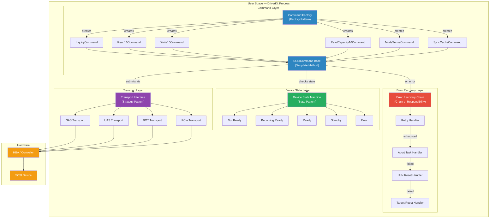
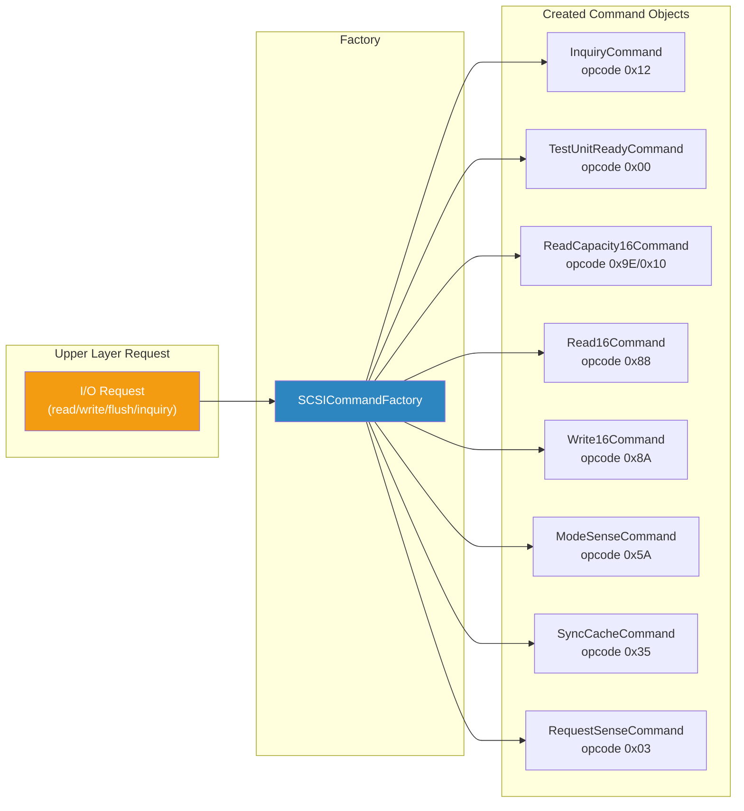
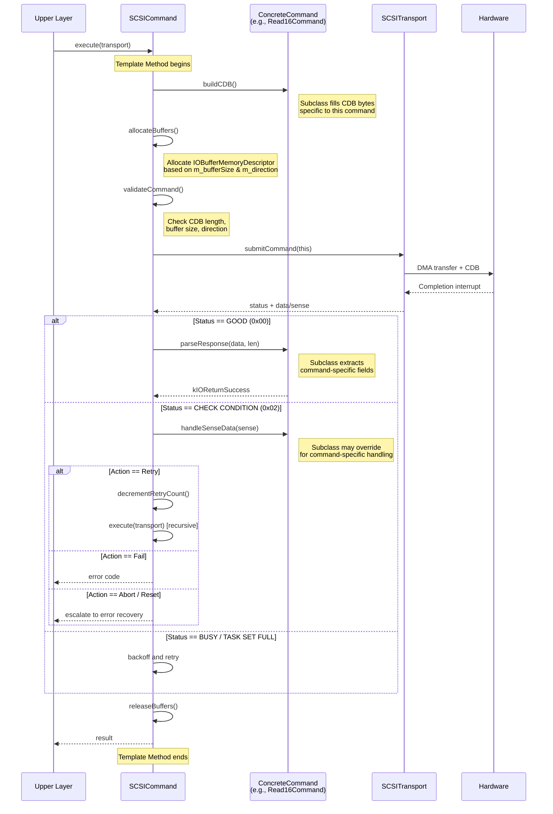
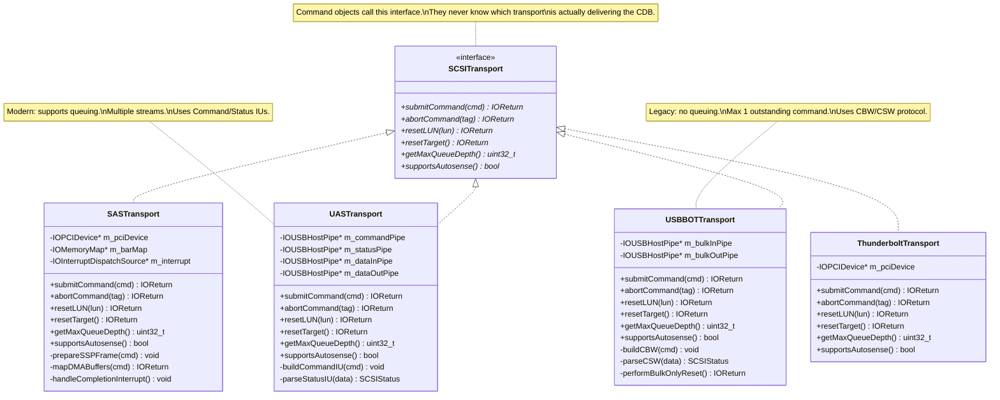
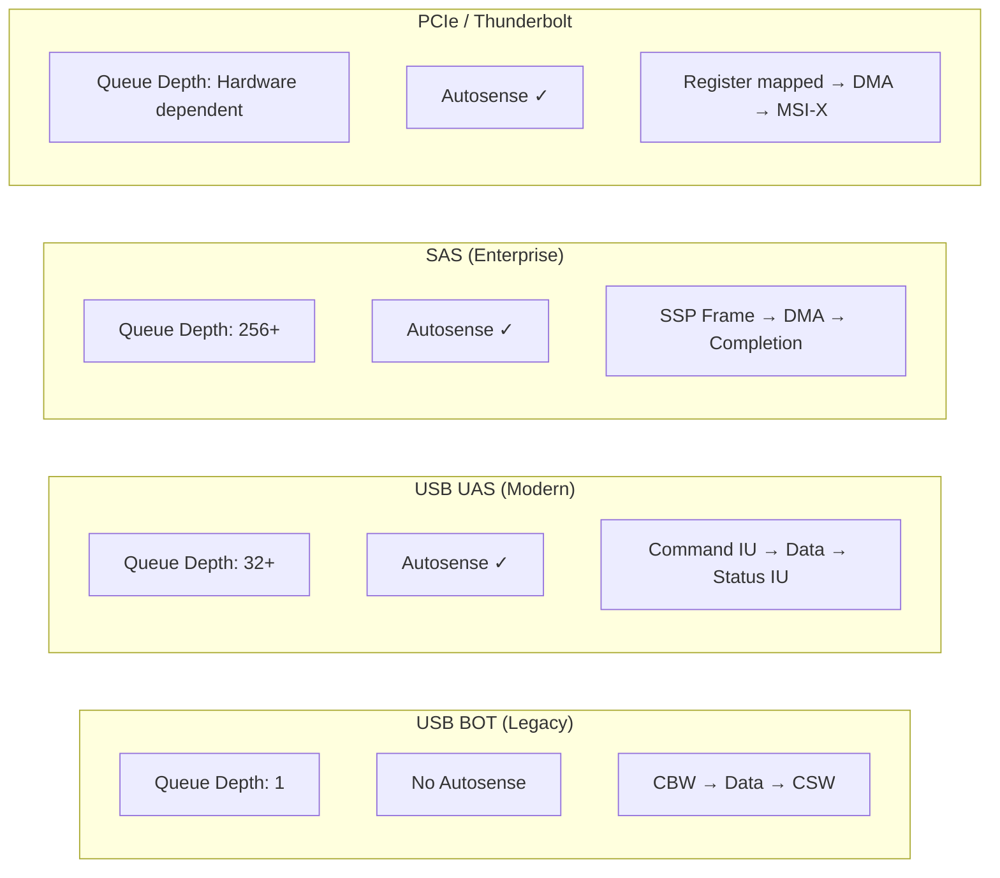
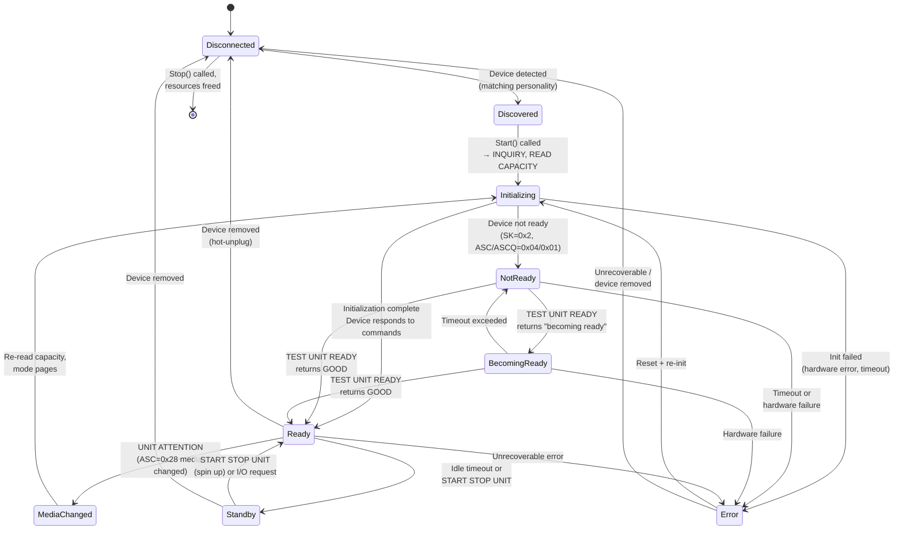
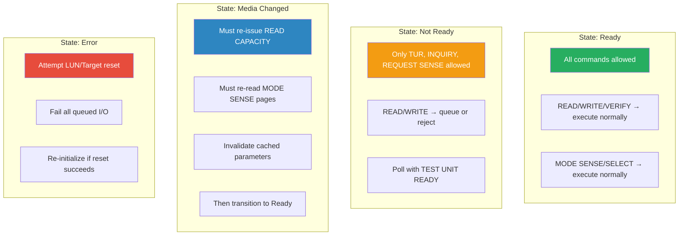
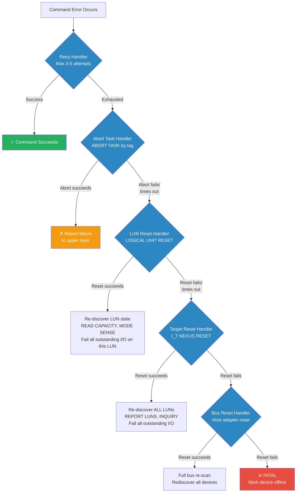
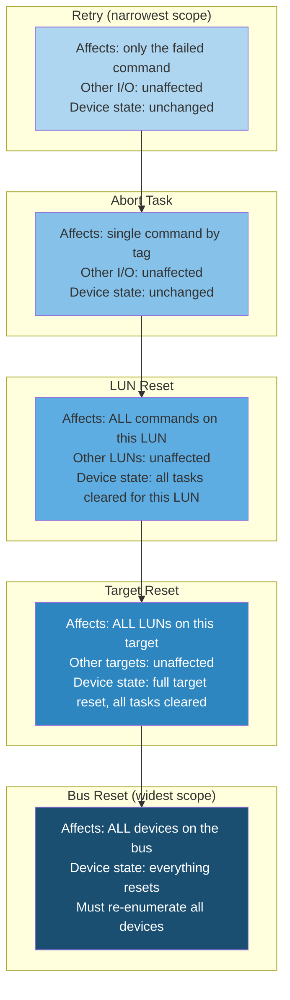

# SCSI Driver Design Patterns — C/C++ Implementation Guide

## Overview

When implementing SPC (SCSI Primary Commands) and SBC (SCSI Block Commands) in a macOS DriverKit storage driver, well-chosen design patterns transform a complex protocol into maintainable, extensible code. This document covers the key patterns, how they map to SCSI concepts, and how they work together.

---

## Pattern Architecture — The Big Picture

The following diagram shows how all the patterns fit together in a SCSI storage driver:



---

## 1. Command Pattern (Primary Pattern)

### Why It's the Natural Fit

SCSI is literally a command-based protocol. Every operation is a Command Descriptor Block (CDB) sent to a device, which returns status and optionally data. The Command Pattern encapsulates each operation as an object with a uniform interface — this maps 1:1 to how SCSI works.

### What It Gives You

- **Uniform dispatch** — all commands share the same interface regardless of type
- **Command queuing** — maps directly to SCSI tagged command queuing
- **Undo/abort** — maps to ABORT TASK management function
- **Extensibility** — adding a new SCSI command = adding a new class, zero changes to existing code
- **Testability** — each command can be unit-tested independently

### Class Diagram

```mermaid
classDiagram
    class SCSICommand {
        <<abstract>>
        #uint8_t m_cdb[32]
        #size_t m_cdbLength
        #uint8_t* m_dataBuffer
        #size_t m_transferCount
        #SCSIDataDirection m_direction
        #SenseData m_senseData
        #uint32_t m_timeoutMs
        +buildCDB()* void
        +parseResponse(data, len)* IOReturn
        +handleSenseData(sense) SCSIErrorAction
        +getTransferDirection() SCSIDataDirection
        +getTimeoutMs() uint32_t
        +execute(transport) IOReturn
    }

    class InquiryCommand {
        -InquiryData m_inquiryData
        -uint8_t m_pageCode
        -bool m_evpd
        +buildCDB() void
        +parseResponse(data, len) IOReturn
        +getDeviceType() uint8_t
        +getVendorId() string
        +getProductId() string
    }

    class ReadCapacity16Command {
        -uint64_t m_lastLBA
        -uint32_t m_blockSize
        -bool m_thinProvisioned
        +buildCDB() void
        +parseResponse(data, len) IOReturn
        +getLastLBA() uint64_t
        +getBlockSize() uint32_t
        +isThinProvisioned() bool
    }

    class Read16Command {
        -uint64_t m_lba
        -uint32_t m_blockCount
        -bool m_fua
        -bool m_dpo
        +buildCDB() void
        +parseResponse(data, len) IOReturn
        +setLBA(lba) void
        +setBlockCount(count) void
        +setFUA(fua) void
    }

    class Write16Command {
        -uint64_t m_lba
        -uint32_t m_blockCount
        -bool m_fua
        +buildCDB() void
        +parseResponse(data, len) IOReturn
        +setLBA(lba) void
        +setBlockCount(count) void
    }

    class ModeSenseCommand {
        -uint8_t m_pageCode
        -uint8_t m_subPageCode
        -bool m_dbd
        +buildCDB() void
        +parseResponse(data, len) IOReturn
        +getCachingModePage() CachingModePage
        +getControlModePage() ControlModePage
    }

    class SyncCacheCommand {
        -uint64_t m_lba
        -uint32_t m_blockCount
        -bool m_immediate
        +buildCDB() void
        +parseResponse(data, len) IOReturn
    }

    class TestUnitReadyCommand {
        +buildCDB() void
        +parseResponse(data, len) IOReturn
    }

    class RequestSenseCommand {
        -bool m_descriptorFormat
        +buildCDB() void
        +parseResponse(data, len) IOReturn
        +getSenseKey() uint8_t
        +getASC() uint8_t
        +getASCQ() uint8_t
    }

    SCSICommand <|-- InquiryCommand
    SCSICommand <|-- ReadCapacity16Command
    SCSICommand <|-- Read16Command
    SCSICommand <|-- Write16Command
    SCSICommand <|-- ModeSenseCommand
    SCSICommand <|-- SyncCacheCommand
    SCSICommand <|-- TestUnitReadyCommand
    SCSICommand <|-- RequestSenseCommand
```



### C++ Implementation Sketch

```cpp
// ============================================================
// Enumerations
// ============================================================
enum class SCSIDataDirection { None, Read, Write };
enum class SCSIErrorAction { Retry, Abort, ResetLUN, ResetTarget, Fail };

// ============================================================
// Sense Data structure
// ============================================================
struct SenseData {
    uint8_t senseKey;
    uint8_t asc;    // Additional Sense Code
    uint8_t ascq;   // Additional Sense Code Qualifier
    
    bool isUnitAttention() const { return senseKey == 0x06; }
    bool isMediumError() const  { return senseKey == 0x03; }
    bool isNotReady() const     { return senseKey == 0x02; }
    bool isIllegalRequest() const { return senseKey == 0x05; }
    bool isRecoveredError() const { return senseKey == 0x01; }
    bool isBecomingReady() const { return senseKey == 0x02 && asc == 0x04 && ascq == 0x01; }
    bool isMediaChanged() const  { return senseKey == 0x06 && asc == 0x28 && ascq == 0x00; }
};

// ============================================================
// Abstract Command base class
// ============================================================
class SCSICommand {
protected:
    uint8_t          m_cdb[32] = {};
    size_t           m_cdbLength = 0;
    uint8_t*         m_dataBuffer = nullptr;
    size_t           m_bufferSize = 0;
    size_t           m_transferCount = 0;
    SCSIDataDirection m_direction = SCSIDataDirection::None;
    SenseData        m_senseData = {};
    uint32_t         m_timeoutMs = 30000;  // 30s default
    uint8_t          m_tag = 0;

public:
    virtual ~SCSICommand() = default;
    
    // --- Pure virtual: subclasses implement these ---
    virtual void    buildCDB() = 0;
    virtual IOReturn parseResponse(const uint8_t* data, size_t len) = 0;
    
    // --- Virtual with default: subclasses may override ---
    virtual SCSIErrorAction handleSenseData(const SenseData& sense) {
        if (sense.isUnitAttention())  return SCSIErrorAction::Retry;
        if (sense.isNotReady() && sense.isBecomingReady()) return SCSIErrorAction::Retry;
        if (sense.isMediumError())    return SCSIErrorAction::Fail;
        if (sense.isIllegalRequest()) return SCSIErrorAction::Fail;
        return SCSIErrorAction::Retry;
    }
    
    // --- Template Method: common execution flow ---
    // (see Template Method section below for full implementation)
    IOReturn execute(class SCSITransport* transport);
    
    // --- Accessors ---
    const uint8_t* getCDB() const { return m_cdb; }
    size_t getCDBLength() const { return m_cdbLength; }
    SCSIDataDirection getDirection() const { return m_direction; }
    uint32_t getTimeoutMs() const { return m_timeoutMs; }
    uint8_t getTag() const { return m_tag; }
    void setTag(uint8_t tag) { m_tag = tag; }
};

// ============================================================
// Concrete Command: INQUIRY (SPC)
// ============================================================
class InquiryCommand : public SCSICommand {
    struct InquiryData {
        uint8_t  peripheralDeviceType;
        bool     removable;
        uint8_t  version;
        char     vendorId[9];
        char     productId[17];
        char     productRev[5];
    } m_data = {};
    
    uint8_t m_pageCode = 0;
    bool    m_evpd = false;

public:
    InquiryCommand(bool evpd = false, uint8_t pageCode = 0)
        : m_evpd(evpd), m_pageCode(pageCode) {
        m_direction = SCSIDataDirection::Read;
        m_bufferSize = 96;
        m_cdbLength = 6;
        m_timeoutMs = 10000;
    }
    
    void buildCDB() override {
        m_cdb[0] = 0x12;                  // INQUIRY opcode
        m_cdb[1] = m_evpd ? 0x01 : 0x00;  // EVPD bit
        m_cdb[2] = m_pageCode;             // Page code
        m_cdb[3] = (m_bufferSize >> 8) & 0xFF;
        m_cdb[4] = m_bufferSize & 0xFF;    // Allocation length
        m_cdb[5] = 0x00;                   // Control
    }
    
    IOReturn parseResponse(const uint8_t* data, size_t len) override {
        if (len < 36) return kIOReturnUnderrun;
        m_data.peripheralDeviceType = data[0] & 0x1F;
        m_data.removable = (data[1] & 0x80) != 0;
        m_data.version = data[2];
        memcpy(m_data.vendorId, &data[8], 8);   m_data.vendorId[8] = '\0';
        memcpy(m_data.productId, &data[16], 16); m_data.productId[16] = '\0';
        memcpy(m_data.productRev, &data[32], 4); m_data.productRev[4] = '\0';
        return kIOReturnSuccess;
    }
    
    uint8_t getDeviceType() const { return m_data.peripheralDeviceType; }
    const char* getVendorId() const { return m_data.vendorId; }
    const char* getProductId() const { return m_data.productId; }
};

// ============================================================
// Concrete Command: READ CAPACITY (16) (SBC)
// ============================================================
class ReadCapacity16Command : public SCSICommand {
    uint64_t m_lastLBA = 0;
    uint32_t m_blockSize = 0;
    bool     m_thinProvisioned = false;

public:
    ReadCapacity16Command() {
        m_direction = SCSIDataDirection::Read;
        m_bufferSize = 32;
        m_cdbLength = 16;
        m_timeoutMs = 10000;
    }
    
    void buildCDB() override {
        m_cdb[0]  = 0x9E;   // SERVICE ACTION IN opcode
        m_cdb[1]  = 0x10;   // Service action: READ CAPACITY (16)
        // bytes 2-9: LBA (0 for READ CAPACITY)
        m_cdb[10] = (m_bufferSize >> 24) & 0xFF;  // Allocation length
        m_cdb[11] = (m_bufferSize >> 16) & 0xFF;
        m_cdb[12] = (m_bufferSize >> 8) & 0xFF;
        m_cdb[13] = m_bufferSize & 0xFF;
    }
    
    IOReturn parseResponse(const uint8_t* data, size_t len) override {
        if (len < 12) return kIOReturnUnderrun;
        m_lastLBA   = ((uint64_t)data[0] << 56) | ((uint64_t)data[1] << 48) |
                      ((uint64_t)data[2] << 40) | ((uint64_t)data[3] << 32) |
                      ((uint64_t)data[4] << 24) | ((uint64_t)data[5] << 16) |
                      ((uint64_t)data[6] << 8)  | (uint64_t)data[7];
        m_blockSize = (data[8] << 24) | (data[9] << 16) | (data[10] << 8) | data[11];
        if (len >= 15) {
            m_thinProvisioned = (data[14] & 0x80) != 0;  // LBPME bit
        }
        return kIOReturnSuccess;
    }
    
    uint64_t getLastLBA() const { return m_lastLBA; }
    uint32_t getBlockSize() const { return m_blockSize; }
    uint64_t getTotalCapacityBytes() const { return (m_lastLBA + 1) * m_blockSize; }
    bool isThinProvisioned() const { return m_thinProvisioned; }
};

// ============================================================
// Concrete Command: READ (16) (SBC)
// ============================================================
class Read16Command : public SCSICommand {
    uint64_t m_lba = 0;
    uint32_t m_blockCount = 0;
    bool     m_fua = false;
    bool     m_dpo = false;

public:
    Read16Command(uint64_t lba, uint32_t blockCount, size_t blockSize)
        : m_lba(lba), m_blockCount(blockCount) {
        m_direction = SCSIDataDirection::Read;
        m_bufferSize = blockCount * blockSize;
        m_cdbLength = 16;
    }
    
    void buildCDB() override {
        m_cdb[0] = 0x88;   // READ(16) opcode
        m_cdb[1] = (m_dpo ? 0x10 : 0) | (m_fua ? 0x08 : 0);
        // LBA: bytes 2-9 (big-endian)
        for (int i = 0; i < 8; i++)
            m_cdb[2 + i] = (m_lba >> (56 - i * 8)) & 0xFF;
        // Transfer length: bytes 10-13 (big-endian)
        for (int i = 0; i < 4; i++)
            m_cdb[10 + i] = (m_blockCount >> (24 - i * 8)) & 0xFF;
    }
    
    IOReturn parseResponse(const uint8_t* data, size_t len) override {
        // Data is raw block data — passed to upper layer as-is
        m_transferCount = len;
        return kIOReturnSuccess;
    }
    
    void setFUA(bool fua) { m_fua = fua; }
    void setDPO(bool dpo) { m_dpo = dpo; }
};
```

---

## 2. Factory Pattern (Command Dispatch)

### Purpose

Creates the correct `SCSICommand` subclass from an opcode or a higher-level request type. This is your dispatch layer — the storage stack sends a request, and the factory figures out which command object to build.

### Diagram



### C++ Implementation

```cpp
class SCSICommandFactory {
public:
    // Create from opcode (for low-level dispatch)
    static std::unique_ptr<SCSICommand> createFromOpcode(uint8_t opcode) {
        switch (opcode) {
            case 0x00: return std::make_unique<TestUnitReadyCommand>();
            case 0x03: return std::make_unique<RequestSenseCommand>();
            case 0x12: return std::make_unique<InquiryCommand>();
            case 0x25: return std::make_unique<ReadCapacity10Command>();
            case 0x28: return std::make_unique<Read10Command>();
            case 0x2A: return std::make_unique<Write10Command>();
            case 0x35: return std::make_unique<SyncCacheCommand>();
            case 0x5A: return std::make_unique<ModeSenseCommand>();
            case 0x88: return std::make_unique<Read16Command>();
            case 0x8A: return std::make_unique<Write16Command>();
            case 0x9E: return std::make_unique<ReadCapacity16Command>();
            case 0xA0: return std::make_unique<ReportLunsCommand>();
            default:   return nullptr;
        }
    }
    
    // Create from high-level request (for storage stack integration)
    static std::unique_ptr<SCSICommand> createReadCommand(
            uint64_t lba, uint32_t blockCount, size_t blockSize) {
        // Use READ(16) for large LBAs, READ(10) for smaller ones
        if (lba > UINT32_MAX || blockCount > UINT16_MAX) {
            return std::make_unique<Read16Command>(lba, blockCount, blockSize);
        }
        return std::make_unique<Read10Command>(
            static_cast<uint32_t>(lba),
            static_cast<uint16_t>(blockCount),
            blockSize);
    }
    
    static std::unique_ptr<SCSICommand> createWriteCommand(
            uint64_t lba, uint32_t blockCount, size_t blockSize, bool fua) {
        if (lba > UINT32_MAX || blockCount > UINT16_MAX) {
            auto cmd = std::make_unique<Write16Command>(lba, blockCount, blockSize);
            cmd->setFUA(fua);
            return cmd;
        }
        auto cmd = std::make_unique<Write10Command>(
            static_cast<uint32_t>(lba),
            static_cast<uint16_t>(blockCount),
            blockSize);
        cmd->setFUA(fua);
        return cmd;
    }
};
```

---

## 3. Template Method Pattern (Command Execution Flow)

### Purpose

Every SCSI command follows the same execution skeleton: validate → build CDB → allocate buffers → submit to transport → handle completion → parse response or handle error. The Template Method defines this skeleton in the base class, with subclasses overriding only the specific steps.

### Execution Flow



### C++ Implementation

```cpp
// Template Method in the base class
IOReturn SCSICommand::execute(SCSITransport* transport) {
    // Step 1: Build the CDB (subclass implements)
    buildCDB();
    
    // Step 2: Allocate buffers (base class, common logic)
    IOReturn ret = allocateBuffers();
    if (ret != kIOReturnSuccess) return ret;
    
    // Step 3: Validate (base class)
    ret = validateCommand();
    if (ret != kIOReturnSuccess) {
        releaseBuffers();
        return ret;
    }
    
    // Step 4: Submit to transport
    int retriesLeft = m_maxRetries;
    do {
        ret = transport->submitCommand(this);
        
        // Step 5: Handle result
        if (ret == kIOReturnSuccess) {
            // Step 6a: Parse response (subclass implements)
            ret = parseResponse(m_dataBuffer, m_transferCount);
            break;
        }
        else if (ret == kSCSICheckCondition) {
            // Step 6b: Handle sense data (subclass may override)
            SCSIErrorAction action = handleSenseData(m_senseData);
            if (action == SCSIErrorAction::Retry && retriesLeft > 0) {
                retriesLeft--;
                usleep(calculateBackoff(m_maxRetries - retriesLeft));
                continue;
            }
            else if (action == SCSIErrorAction::Fail) {
                ret = mapSenseToIOReturn(m_senseData);
                break;
            }
            else {
                // Escalate (Abort, LUN Reset, etc.)
                ret = kIOReturnNotResponding;
                break;
            }
        }
        else if (ret == kSCSIBusy || ret == kSCSITaskSetFull) {
            retriesLeft--;
            usleep(calculateBackoff(m_maxRetries - retriesLeft));
            continue;
        }
        else {
            break;  // Transport error, don't retry
        }
    } while (retriesLeft > 0);
    
    // Step 7: Cleanup
    releaseBuffers();
    return ret;
}
```

---

## 4. Strategy Pattern (Transport Abstraction)

### Purpose

The same SCSI command set (SPC/SBC) must work over different physical transports: SAS, USB UAS, USB BOT, Thunderbolt (PCIe), iSCSI. The Strategy Pattern lets you swap the transport implementation without changing any command logic.

### Diagram



### Key Differences Between Transports



### C++ Implementation

```cpp
class SCSITransport {
public:
    virtual ~SCSITransport() = default;
    
    // Core operations
    virtual IOReturn submitCommand(SCSICommand* cmd) = 0;
    virtual IOReturn abortCommand(uint8_t tag) = 0;
    virtual IOReturn resetLUN(uint64_t lun) = 0;
    virtual IOReturn resetTarget() = 0;
    
    // Capabilities
    virtual uint32_t getMaxQueueDepth() const = 0;
    virtual bool     supportsAutosense() const = 0;
    virtual bool     supportsCommandQueuing() const = 0;
};

// Example: UAS (USB Attached SCSI) transport
class UASTransport : public SCSITransport {
    IOUSBHostPipe* m_commandPipe;
    IOUSBHostPipe* m_statusPipe;
    IOUSBHostPipe* m_dataInPipe;
    IOUSBHostPipe* m_dataOutPipe;
    
public:
    IOReturn submitCommand(SCSICommand* cmd) override {
        // 1. Build Command IU (Information Unit)
        UASCommandIU iu = {};
        iu.iuID = kCommandIU;
        iu.tag = cmd->getTag();
        memcpy(iu.cdb, cmd->getCDB(), cmd->getCDBLength());
        iu.taskAttribute = kSimpleTask;
        iu.dataDirection = mapDirection(cmd->getDirection());
        
        // 2. Send Command IU on command pipe
        IOReturn ret = m_commandPipe->io(iu.data(), iu.size(), /*completion=*/nullptr);
        if (ret != kIOReturnSuccess) return ret;
        
        // 3. Initiate data transfer if needed
        if (cmd->getDirection() == SCSIDataDirection::Read) {
            ret = m_dataInPipe->io(cmd->getDataBuffer(), cmd->getBufferSize(),
                                   /*completion=*/&m_dataCompletion);
        }
        // ... handle Write direction similarly on m_dataOutPipe
        
        // 4. Read Status IU from status pipe (via completion handler)
        // ... parsed asynchronously in completion callback
        
        return kIOReturnSuccess;
    }
    
    uint32_t getMaxQueueDepth() const override { return 32; }
    bool supportsAutosense() const override { return true; }
    bool supportsCommandQueuing() const override { return true; }
};
```

---

## 5. State Machine Pattern (Device Lifecycle)

### Purpose

A SCSI device transitions through well-defined states (not ready, becoming ready, ready, standby, error). The current state determines which commands are valid, how errors are interpreted, and what recovery actions to take. The State Pattern formalizes this.

### Device State Diagram



### State Impact on Command Handling



### C++ Implementation

```cpp
class DeviceState {
public:
    virtual ~DeviceState() = default;
    virtual bool canAcceptIO() const = 0;
    virtual IOReturn handleCommand(class SCSIDeviceContext* ctx, SCSICommand* cmd) = 0;
    virtual IOReturn handleSense(class SCSIDeviceContext* ctx, const SenseData& sense) = 0;
    virtual const char* name() const = 0;
};

class ReadyState : public DeviceState {
public:
    bool canAcceptIO() const override { return true; }
    
    IOReturn handleCommand(SCSIDeviceContext* ctx, SCSICommand* cmd) override {
        return cmd->execute(ctx->getTransport());
    }
    
    IOReturn handleSense(SCSIDeviceContext* ctx, const SenseData& sense) override {
        if (sense.isMediaChanged()) {
            ctx->transitionTo(std::make_unique<MediaChangedState>());
            return kIOReturnMediaChanged;
        }
        if (sense.isUnitAttention()) {
            // Other UA: re-read device state, stay Ready
            ctx->refreshDeviceParameters();
            return kIOReturnRetry;
        }
        return kIOReturnError;
    }
    
    const char* name() const override { return "Ready"; }
};

class NotReadyState : public DeviceState {
    int m_pollCount = 0;
    static constexpr int kMaxPolls = 30;  // ~30 seconds at 1/sec
    
public:
    bool canAcceptIO() const override { return false; }
    
    IOReturn handleCommand(SCSIDeviceContext* ctx, SCSICommand* cmd) override {
        // Queue the command; poll with TEST UNIT READY
        auto tur = std::make_unique<TestUnitReadyCommand>();
        IOReturn ret = tur->execute(ctx->getTransport());
        if (ret == kIOReturnSuccess) {
            ctx->transitionTo(std::make_unique<ReadyState>());
            return cmd->execute(ctx->getTransport());
        }
        if (++m_pollCount >= kMaxPolls) {
            ctx->transitionTo(std::make_unique<ErrorState>());
            return kIOReturnTimeout;
        }
        return kIOReturnNotReady;
    }
    
    const char* name() const override { return "NotReady"; }
};

// Context that holds current state
class SCSIDeviceContext {
    std::unique_ptr<DeviceState> m_state;
    SCSITransport*               m_transport;
    
    // Cached device parameters
    uint64_t m_lastLBA = 0;
    uint32_t m_blockSize = 0;
    
public:
    void transitionTo(std::unique_ptr<DeviceState> newState) {
        os_log_info(OS_LOG_DEFAULT, "State: %s → %s",
                    m_state->name(), newState->name());
        m_state = std::move(newState);
    }
    
    IOReturn submitCommand(SCSICommand* cmd) {
        return m_state->handleCommand(this, cmd);
    }
    
    SCSITransport* getTransport() { return m_transport; }
    
    void refreshDeviceParameters() {
        auto rc = std::make_unique<ReadCapacity16Command>();
        if (rc->execute(m_transport) == kIOReturnSuccess) {
            m_lastLBA = rc->getLastLBA();
            m_blockSize = rc->getBlockSize();
        }
    }
};
```

---

## 6. Chain of Responsibility (Error Recovery Escalation)

### Purpose

SCSI error recovery follows a strict escalation: retry → abort task → LUN reset → target reset → bus reset. Each level in the chain decides whether it can handle the error or must pass it up. This maps perfectly to Chain of Responsibility.

### Error Escalation Flow



### Impact Scope at Each Level



### C++ Implementation

```cpp
class ErrorRecoveryHandler {
protected:
    std::unique_ptr<ErrorRecoveryHandler> m_next;
    
public:
    virtual ~ErrorRecoveryHandler() = default;
    
    void setNext(std::unique_ptr<ErrorRecoveryHandler> next) {
        m_next = std::move(next);
    }
    
    virtual IOReturn handle(SCSIDeviceContext* ctx, SCSICommand* cmd,
                           const SenseData& sense) = 0;
    
protected:
    IOReturn escalate(SCSIDeviceContext* ctx, SCSICommand* cmd,
                      const SenseData& sense) {
        if (m_next) return m_next->handle(ctx, cmd, sense);
        return kIOReturnNotResponding;  // Nothing left to try
    }
};

class RetryHandler : public ErrorRecoveryHandler {
    static constexpr int kMaxRetries = 3;
    
public:
    IOReturn handle(SCSIDeviceContext* ctx, SCSICommand* cmd,
                   const SenseData& sense) override {
        // Don't retry non-transient errors
        if (sense.isMediumError() || sense.isIllegalRequest()) {
            return escalate(ctx, cmd, sense);
        }
        
        for (int i = 0; i < kMaxRetries; i++) {
            // Handle UNIT ATTENTION: refresh state then retry
            if (sense.isUnitAttention()) {
                ctx->refreshDeviceParameters();
            }
            
            usleep(100000 * (1 << i));  // Exponential backoff
            IOReturn ret = cmd->execute(ctx->getTransport());
            if (ret == kIOReturnSuccess) return ret;
        }
        
        return escalate(ctx, cmd, sense);
    }
};

class AbortTaskHandler : public ErrorRecoveryHandler {
public:
    IOReturn handle(SCSIDeviceContext* ctx, SCSICommand* cmd,
                   const SenseData& sense) override {
        os_log_error(OS_LOG_DEFAULT, "Aborting task tag=%d", cmd->getTag());
        
        IOReturn ret = ctx->getTransport()->abortCommand(cmd->getTag());
        if (ret == kIOReturnSuccess) {
            // Abort succeeded — command is dead, report failure up
            return kIOReturnAborted;
        }
        
        // Abort failed, escalate
        return escalate(ctx, cmd, sense);
    }
};

class LUNResetHandler : public ErrorRecoveryHandler {
public:
    IOReturn handle(SCSIDeviceContext* ctx, SCSICommand* cmd,
                   const SenseData& sense) override {
        os_log_error(OS_LOG_DEFAULT, "Resetting LUN");
        
        IOReturn ret = ctx->getTransport()->resetLUN(ctx->getLUN());
        if (ret == kIOReturnSuccess) {
            // LUN reset succeeded — fail all outstanding I/O for this LUN
            ctx->failAllOutstandingIO(kIOReturnAborted);
            // Re-discover device state
            ctx->refreshDeviceParameters();
            return kIOReturnAborted;
        }
        
        return escalate(ctx, cmd, sense);
    }
};

class TargetResetHandler : public ErrorRecoveryHandler {
public:
    IOReturn handle(SCSIDeviceContext* ctx, SCSICommand* cmd,
                   const SenseData& sense) override {
        os_log_error(OS_LOG_DEFAULT, "Resetting TARGET — all LUNs affected!");
        
        IOReturn ret = ctx->getTransport()->resetTarget();
        if (ret == kIOReturnSuccess) {
            // Target reset — fail ALL I/O on ALL LUNs
            ctx->failAllOutstandingIOAllLUNs(kIOReturnAborted);
            // Full re-enumeration
            ctx->reEnumerateLUNs();
            return kIOReturnAborted;
        }
        
        // Nothing left — device is dead
        ctx->transitionTo(std::make_unique<ErrorState>());
        return kIOReturnNotResponding;
    }
};

// ============================================================
// Build the chain
// ============================================================
std::unique_ptr<ErrorRecoveryHandler> buildErrorRecoveryChain() {
    auto retry  = std::make_unique<RetryHandler>();
    auto abort  = std::make_unique<AbortTaskHandler>();
    auto lun    = std::make_unique<LUNResetHandler>();
    auto target = std::make_unique<TargetResetHandler>();
    
    lun->setNext(std::move(target));
    abort->setNext(std::move(lun));
    retry->setNext(std::move(abort));
    
    return retry;  // Entry point of the chain
}
```

---

## Summary: Pattern Mapping to SCSI Concepts

| Pattern | SCSI Concept | Why It Fits |
|---------|-------------|-------------|
| **Command** | CDB / SCSI command | SCSI is literally a command protocol — 1:1 mapping |
| **Factory** | Opcode dispatch | Creates the right command object from opcode or request type |
| **Template Method** | Command execution flow | Same skeleton for every command: build → submit → parse/handle |
| **Strategy** | Transport layer | Same CDB works over SAS, UAS, BOT, PCIe — swap transport without changing commands |
| **State Machine** | Device lifecycle | Not Ready → Ready → Standby → Error; governs what commands are valid |
| **Chain of Responsibility** | Error recovery escalation | Retry → Abort → LUN Reset → Target Reset — each level decides or passes up |

## Interview Talking Points

When discussing design patterns in an interview for this role:

1. **Lead with Command Pattern** — It's the most natural fit. Say: "SCSI is a command-based protocol, so the Command Pattern maps directly to the CDB model. Each SCSI command becomes a class with buildCDB(), parseResponse(), and handleSenseData()."

2. **Then mention Strategy** — Transport abstraction is critical for this role: "The same SBC commands need to work over SAS, USB, and Thunderbolt. The Strategy Pattern lets me swap the transport without touching the command layer."

3. **Show depth with error recovery** — "I'd use Chain of Responsibility for the error recovery escalation ladder. Each handler decides whether to handle or escalate, mapping directly to SCSI's retry → abort → reset hierarchy."

4. **Don't over-engineer** — Acknowledge that in a real DriverKit driver, you work within Apple's IOSCSIArchitectureModelFamily which already defines some of this structure. Your patterns complement the framework rather than replacing it. Show you understand the framework while demonstrating strong design thinking.
