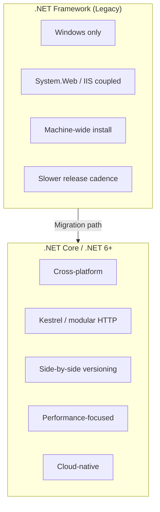
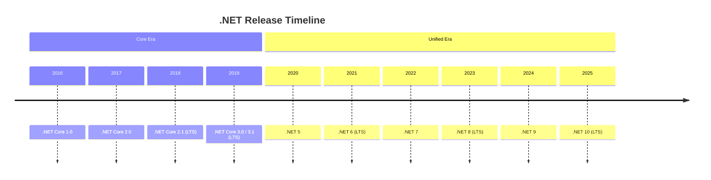
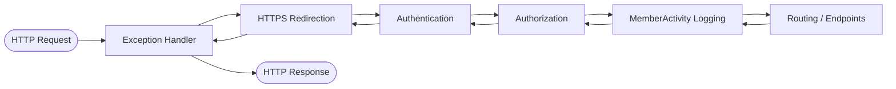
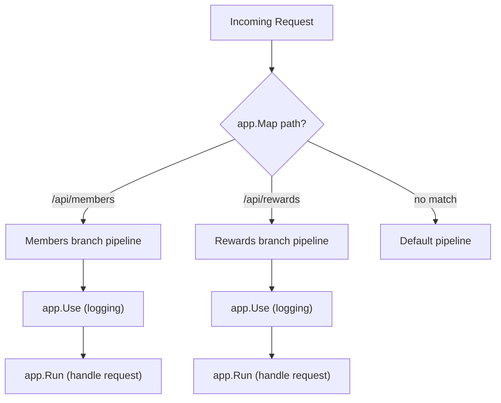
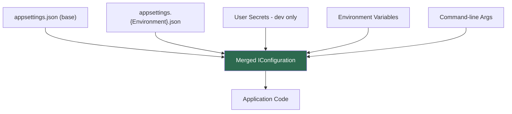
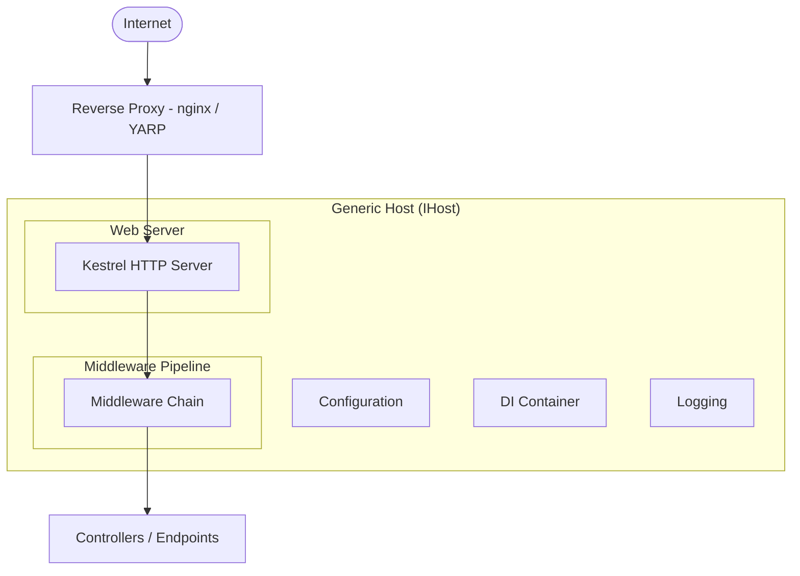

# .NET Core Fundamentals

## Overview

This document covers the foundational concepts of .NET Core that are essential for building modern web APIs and services. The examples use the Atmos Rewards domain (members, reward transactions, tier levels) to illustrate each concept in a practical context.

## 1. .NET Core vs .NET Framework

.NET Core (now unified as .NET 5+) is the cross-platform, open-source successor to the Windows-only .NET Framework. For a team building member-facing loyalty APIs, .NET Core offers significant advantages.



**Key differences at a glance:**

| Aspect | .NET Framework | .NET Core / .NET 6+ |
|--------|---------------|---------------------|
| Platform | Windows only | Windows, Linux, macOS |
| Hosting | IIS with System.Web | Kestrel, any reverse proxy |
| Deployment | Machine-wide GAC | Self-contained or framework-dependent |
| Performance | Good | Significantly faster (TechEmpower benchmarks) |
| Containerization | Difficult | First-class Docker support |
| Open source | Partial | Fully open source |

**Why .NET Core matters for Atmos Rewards:** The rewards API can be containerized and deployed to cloud infrastructure, scaled horizontally behind a load balancer, and developed on any platform.

## 2. .NET Version History and Release Schedule

Microsoft ships a new major .NET version every November. Even-numbered releases are **LTS** (Long-Term Support, 3 years), odd-numbered are **STS** (Standard-Term Support, 18 months).

| Version | Release Date | Support | End of Support | Key Features |
|---------|-------------|---------|----------------|--------------|
| .NET Core 1.0 | Jun 2016 | LTS | Jun 2019 | First cross-platform release |
| .NET Core 2.0 | Aug 2017 | STS | Oct 2018 | Razor Pages, `IConfiguration` revamp |
| .NET Core 2.1 | May 2018 | LTS | Aug 2021 | `Span<T>`, `HttpClientFactory`, SignalR |
| .NET Core 3.0 | Sep 2019 | STS | Mar 2020 | Worker Services, gRPC, C# 8 |
| .NET Core 3.1 | Dec 2019 | LTS | Dec 2022 | Blazor Server GA, last "Core" branded release |
| .NET 5 | Nov 2020 | STS | May 2022 | Unified platform, top-level programs, C# 9 records |
| .NET 6 | Nov 2021 | LTS | Nov 2024 | Minimal APIs, Hot Reload, C# 10 |
| .NET 7 | Nov 2022 | STS | May 2024 | Rate limiting, output caching, C# 11 |
| .NET 8 | Nov 2023 | LTS | Nov 2026 | Native AOT, Blazor United, keyed DI, C# 12 |
| .NET 9 | Nov 2024 | STS | May 2026 | HybridCache, OpenAPI built-in, C# 13 |
| .NET 10 | Nov 2025 | LTS | Nov 2028 | Improved AOT, field keyword, C# 14 |



### What Changed Between Versions

- **.NET Core 1.0** — The first cross-platform .NET. Minimal API surface, basic MVC and Kestrel. Proved the concept but lacked many Framework APIs.
- **.NET Core 2.0/2.1** — Made .NET Core practical for production. 2.0 brought Razor Pages and a unified `IConfiguration` system. 2.1 added `Span<T>` for zero-allocation slicing, `HttpClientFactory` (solving socket exhaustion), and SignalR for real-time communication.
- **.NET Core 3.0/3.1** — Added Worker Services (background/hosted services), gRPC support, and C# 8 (nullable reference types, async streams, pattern matching enhancements). 3.1 was the last "Core"-branded release and brought Blazor Server to GA.
- **.NET 5** — Unified .NET Core and Mono into a single platform. Introduced top-level programs (no `Main` method boilerplate), C# 9 records (immutable reference types), and `System.Text.Json` improvements.
- **.NET 6** — Minimal APIs (build endpoints without controllers), Hot Reload (edit code while running), global `using` directives, file-scoped namespaces (C# 10). Eliminated `Startup.cs` in favor of a single `Program.cs`.
- **.NET 7** — Built-in rate limiting middleware, output caching, C# 11 (raw string literals, required members, generic math via static abstract interfaces).
- **.NET 8** — Native AOT compilation (ahead-of-time, no JIT needed at runtime), Blazor United (server + WASM in one model), keyed dependency injection, C# 12 (primary constructors, collection expressions).
- **.NET 9** — `HybridCache` (combines in-memory + distributed caching), built-in OpenAPI document generation (replacing Swashbuckle), C# 13 (`params` collections, `Lock` type).
- **.NET 10** — Improved AOT support, C# 14 `field` keyword (auto-property backing field access), extended `Span<T>` usage across more APIs.

**Naming change:** The jump from ".NET Core 3.1" to ".NET 5" (skipping 4) was deliberate to avoid confusion with .NET Framework 4.x. From .NET 5 onward the "Core" branding was dropped.

**Which version for a new project today?** .NET 8 is the current LTS release (supported until Nov 2026) and is the safest choice for production. .NET 10 just shipped as the next LTS. Teams already on .NET 8 should plan a migration path to .NET 10 for long-term support.

## 3. The Middleware Pipeline

Every HTTP request in ASP.NET Core flows through a pipeline of middleware components. Each component can inspect or modify the request, optionally pass it to the next component, and then inspect or modify the response on the way back out.



### app.Use vs app.Map vs app.Run

- **`app.Use`** adds middleware that calls `next()` to pass control to the next component. Most middleware uses this.
- **`app.Run`** adds terminal middleware that does not call `next()`. It short-circuits the pipeline.
- **`app.Map`** branches the pipeline based on the request path. Each branch gets its own middleware chain.



### Code Example: Custom Middleware for Member Activity Logging

This middleware intercepts every request, checks for a member identifier, and logs the activity along with response timing.

```csharp
public class MemberActivityLoggingMiddleware
{
    private readonly RequestDelegate _next;
    private readonly ILogger<MemberActivityLoggingMiddleware> _logger;

    public MemberActivityLoggingMiddleware(
        RequestDelegate next,
        ILogger<MemberActivityLoggingMiddleware> logger)
    {
        _next = next;
        _logger = logger;
    }

    public async Task InvokeAsync(HttpContext context)
    {
        var memberId = context.Request.Headers["X-Member-Id"].FirstOrDefault();
        var stopwatch = Stopwatch.StartNew();

        _logger.LogInformation(
            "Request started: {Method} {Path} | MemberId: {MemberId}",
            context.Request.Method,
            context.Request.Path,
            memberId ?? "anonymous");

        await _next(context);

        stopwatch.Stop();
        _logger.LogInformation(
            "Request completed: {Method} {Path} | MemberId: {MemberId} | Status: {StatusCode} | Duration: {ElapsedMs}ms",
            context.Request.Method,
            context.Request.Path,
            memberId ?? "anonymous",
            context.Response.StatusCode,
            stopwatch.ElapsedMilliseconds);
    }
}

// Registration in Program.cs
app.UseMiddleware<MemberActivityLoggingMiddleware>();
```

### Code Example: Pipeline Setup with Branching

```csharp
var app = builder.Build();

app.UseExceptionHandler("/error");
app.UseHttpsRedirection();
app.UseAuthentication();
app.UseAuthorization();

// Branch: member-facing reward endpoints
app.Map("/api/rewards", rewardsApp =>
{
    rewardsApp.UseMiddleware<MemberActivityLoggingMiddleware>();
    rewardsApp.UseRouting();
    rewardsApp.UseEndpoints(endpoints =>
    {
        endpoints.MapControllers();
    });
});

// Terminal middleware for health checks
app.Map("/health", healthApp =>
{
    healthApp.Run(async context =>
    {
        context.Response.ContentType = "application/json";
        await context.Response.WriteAsJsonAsync(new
        {
            status = "healthy",
            service = "AtmosRewards.API",
            timestamp = DateTimeOffset.UtcNow
        });
    });
});

app.MapControllers();
app.Run();
```

## 4. Configuration System

ASP.NET Core uses a layered configuration system. Sources are loaded in order, and later sources override earlier ones. This allows a base configuration in `appsettings.json` to be overridden per environment or by secrets at deployment time.



**Load order matters:** Environment variables override appsettings.json values. This is how production secrets (connection strings, API keys) are injected without being stored in source control.

### Code Example: Reward Tiers Configuration with IOptions

Define a strongly-typed configuration class and bind it from `appsettings.json`.

**appsettings.json:**

```json
{
  "AtmosRewards": {
    "PointsExpirationDays": 365,
    "TierThresholds": {
      "Gold": 20000,
      "MvpGold": 50000,
      "Mvp": 75000
    },
    "PartnerEarningMultiplier": 1.5,
    "BasePointsPerDollar": 3
  }
}
```

**Configuration class and registration:**

```csharp
public class AtmosRewardsOptions
{
    public const string SectionName = "AtmosRewards";

    public int PointsExpirationDays { get; set; } = 365;
    public TierThresholdOptions TierThresholds { get; set; } = new();
    public double PartnerEarningMultiplier { get; set; } = 1.0;
    public int BasePointsPerDollar { get; set; } = 3;
}

public class TierThresholdOptions
{
    public int Gold { get; set; }
    public int MvpGold { get; set; }
    public int Mvp { get; set; }
}

// In Program.cs
builder.Services.Configure<AtmosRewardsOptions>(
    builder.Configuration.GetSection(AtmosRewardsOptions.SectionName));
```

**Using IOptions in a service:**

```csharp
public class TierEvaluationService
{
    private readonly AtmosRewardsOptions _options;
    private readonly ILogger<TierEvaluationService> _logger;

    public TierEvaluationService(
        IOptions<AtmosRewardsOptions> options,
        ILogger<TierEvaluationService> logger)
    {
        _options = options.Value;
        _logger = logger;
    }

    public TierLevel EvaluateTier(Member member)
    {
        var totalPoints = member.QualifyingPoints;

        var tier = totalPoints switch
        {
            _ when totalPoints >= _options.TierThresholds.Mvp => TierLevel.Mvp,
            _ when totalPoints >= _options.TierThresholds.MvpGold => TierLevel.MvpGold,
            _ when totalPoints >= _options.TierThresholds.Gold => TierLevel.Gold,
            _ => TierLevel.Base
        };

        _logger.LogInformation(
            "Member {MemberId} evaluated as {Tier} with {Points} qualifying points",
            member.MemberId, tier, totalPoints);

        return tier;
    }
}
```

### IOptions vs IOptionsSnapshot vs IOptionsMonitor

| Interface | Lifetime | Reloads on change | Use case |
|-----------|----------|-------------------|----------|
| `IOptions<T>` | Singleton | No | Static config read once at startup |
| `IOptionsSnapshot<T>` | Scoped | Yes, per request | Config that may change between deployments |
| `IOptionsMonitor<T>` | Singleton | Yes, via callback | Long-running services that react to config changes |

## 5. Hosting Model

ASP.NET Core applications are hosted by a Generic Host that manages the application lifetime, configuration, logging, and dependency injection.



### Kestrel

Kestrel is the cross-platform web server built into ASP.NET Core. In production it typically sits behind a reverse proxy (nginx, Azure Application Gateway, YARP) that handles TLS termination, load balancing, and static content.

**Key points:**
- Kestrel handles HTTP/1.1, HTTP/2, and HTTP/3.
- It is not intended to be exposed directly to the internet in production without a reverse proxy.
- Configuration (ports, TLS certificates, request limits) can be set in code or `appsettings.json`.

## 6. Program.cs and the Minimal Hosting Model

Starting with .NET 6, the `Startup.cs` class was eliminated in favor of a streamlined `Program.cs` that uses top-level statements and the `WebApplication` builder.

### Code Example: Complete Program.cs for the Rewards API

```csharp
using AtmosRewards.Api.Middleware;
using AtmosRewards.Api.Services;
using AtmosRewards.Api.Configuration;

var builder = WebApplication.CreateBuilder(args);

// --- Configuration ---
builder.Services.Configure<AtmosRewardsOptions>(
    builder.Configuration.GetSection(AtmosRewardsOptions.SectionName));

// --- Services ---
builder.Services.AddScoped<RewardPointsService>();
builder.Services.AddScoped<TierEvaluationService>();
builder.Services.AddScoped<PartnerEarningService>();

builder.Services.AddControllers();
builder.Services.AddEndpointsApiExplorer();
builder.Services.AddSwaggerGen();

builder.Services.AddHealthChecks()
    .AddCheck<RewardsDbHealthCheck>("rewards-db");

var app = builder.Build();

// --- Middleware pipeline ---
if (app.Environment.IsDevelopment())
{
    app.UseSwagger();
    app.UseSwaggerUI();
}

app.UseExceptionHandler("/error");
app.UseHttpsRedirection();
app.UseAuthentication();
app.UseAuthorization();
app.UseMiddleware<MemberActivityLoggingMiddleware>();

app.MapControllers();
app.MapHealthChecks("/health");

app.Run();
```

### Before (.NET 5 with Startup.cs) vs After (.NET 6+ Minimal)

| Aspect | .NET 5 Startup.cs | .NET 6+ Minimal |
|--------|-------------------|-----------------|
| Files | Program.cs + Startup.cs | Program.cs only |
| Entry point | `Main` method + `CreateHostBuilder` | Top-level statements |
| Service registration | `ConfigureServices(IServiceCollection)` | `builder.Services` directly |
| Pipeline config | `Configure(IApplicationBuilder)` | `app.Use...` directly |
| Boilerplate | More | Less |

## 7. Environments

ASP.NET Core uses the `ASPNETCORE_ENVIRONMENT` environment variable to determine the current environment. The three conventional values are Development, Staging, and Production.

```mermaid
flowchart LR
    subgraph Dev["Development"]
        D1[Developer exception page]
        D2[Swagger UI enabled]
        D3[User Secrets loaded]
        D4[Detailed logging]
    end

    subgraph Staging["Staging"]
        S1[Exception handler page]
        S2[Swagger disabled]
        S3[Env var secrets]
        S4[Warning-level logging]
    end

    subgraph Prod["Production"]
        P1[Generic error response]
        P2[Swagger disabled]
        P3[Key Vault secrets]
        P4[Error-level logging]
    end

    Dev -- "Deploy to staging" --> Staging
    Staging -- "Promote to prod" --> Prod
```



**How it works in code:**

```csharp
// Environment-specific configuration files are loaded automatically:
// appsettings.json                    <- always loaded
// appsettings.Development.json        <- loaded when ASPNETCORE_ENVIRONMENT=Development
// appsettings.Production.json         <- loaded when ASPNETCORE_ENVIRONMENT=Production

// Conditional middleware in Program.cs
if (app.Environment.IsDevelopment())
{
    app.UseSwagger();
    app.UseSwaggerUI();
    app.UseDeveloperExceptionPage();
}
else
{
    app.UseExceptionHandler("/error");
    app.UseHsts();
}

// Custom environment checks
if (app.Environment.IsEnvironment("Staging"))
{
    app.UseMiddleware<StagingDiagnosticsMiddleware>();
}
```

**Environment-specific appsettings example (`appsettings.Development.json`):**

```json
{
  "Logging": {
    "LogLevel": {
      "Default": "Debug",
      "AtmosRewards": "Debug"
    }
  },
  "AtmosRewards": {
    "PointsExpirationDays": 9999,
    "BasePointsPerDollar": 10
  }
}
```

In Development, members get more points per dollar and points never expire. This makes manual testing simpler without polluting production configuration.

## Interview Questions

### Conceptual Questions

**Q: What are the main reasons to choose .NET Core over .NET Framework for a new project?**
Cross-platform support, improved performance, side-by-side versioning (multiple apps on the same machine can use different .NET versions), container-friendly deployment, and active development with regular releases. .NET Framework is in maintenance mode.

**Q: Explain how the middleware pipeline processes a request. What happens when a middleware component does not call `next()`?**
Middleware components are invoked in the order they are registered. Each calls `await next(context)` to pass control to the next component. After the downstream middleware completes, the response flows back through each component in reverse order. If a middleware does not call `next()`, it short-circuits the pipeline and no downstream middleware or endpoint is reached. This is how authentication middleware can reject unauthorized requests before they hit the controller.

**Q: What is the difference between `IOptions<T>`, `IOptionsSnapshot<T>`, and `IOptionsMonitor<T>`?**
`IOptions<T>` is a singleton that reads configuration once at startup. `IOptionsSnapshot<T>` is scoped and re-reads configuration on each request, useful when configuration files may be reloaded. `IOptionsMonitor<T>` is a singleton that provides change notifications via a callback, suitable for long-lived services that need to react to configuration changes without restarting.

**Q: Why does middleware ordering matter? Give an example of a bug caused by incorrect ordering.**
Middleware runs in registration order. If `UseAuthorization()` is placed before `UseAuthentication()`, the authorization middleware will not have access to the authenticated user identity, so every request will be treated as unauthenticated and denied. Another example: placing `UseExceptionHandler()` after custom middleware means exceptions thrown by that custom middleware will not be caught.

### Scenario-Based Questions

**Q: You need to add a middleware that validates a `X-Member-Id` header is present on all `/api/rewards/*` requests but not on health check endpoints. How would you implement this?**
Use `app.UseWhen` or `app.Map` to conditionally apply the middleware only to paths starting with `/api/rewards`. The middleware reads the header, returns 401 if missing, and calls `next()` otherwise.

**Q: The rewards tier thresholds need to change without redeploying. How would you design the configuration?**
Store thresholds in `appsettings.json` and use `IOptionsMonitor<AtmosRewardsOptions>` in the `TierEvaluationService`. Enable file watching with `reloadOnChange: true` in the configuration builder. When the JSON file is updated (or the environment variable is changed and the app is configured to watch it), the `IOptionsMonitor` will pick up the new values. For a multi-instance deployment, use a centralized configuration store (Azure App Configuration) instead of local files.

**Q: How would you set up the application so that Swagger is available in Development and Staging but not Production?**
Check the environment in `Program.cs`:

```csharp
if (app.Environment.IsDevelopment() || app.Environment.IsEnvironment("Staging"))
{
    app.UseSwagger();
    app.UseSwaggerUI();
}
```

**Q: Explain the request lifecycle from the moment a client sends an HTTP request to the Atmos Rewards API until the response is returned.**
The request arrives at the reverse proxy (e.g., nginx or Azure App Gateway), which forwards it to Kestrel. Kestrel parses the HTTP request and creates an `HttpContext`. The request then flows through the middleware pipeline in order: exception handling, HTTPS redirection, authentication (validates JWT), authorization (checks policies), custom middleware (member activity logging), and finally routing, which dispatches to the matching controller action. The controller calls domain services (e.g., `RewardPointsService`), which use the injected `IOptions<AtmosRewardsOptions>` configuration. The response then flows back through each middleware in reverse order, and Kestrel writes the HTTP response to the client via the reverse proxy.
