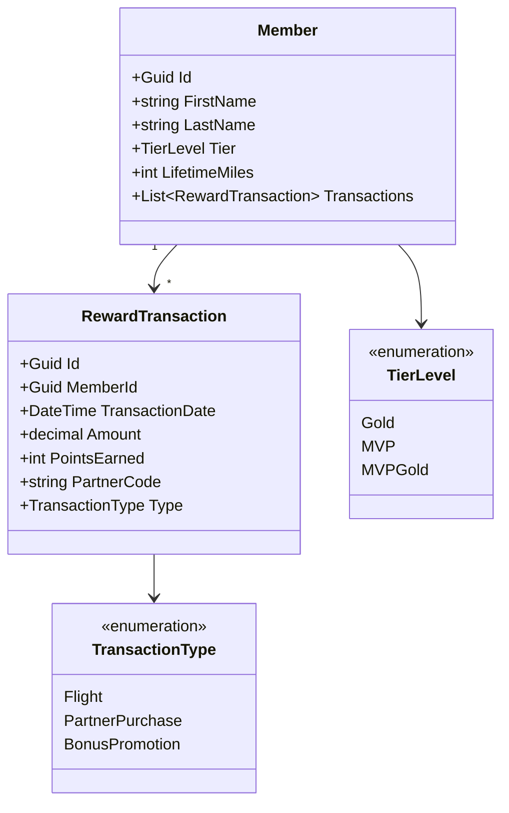
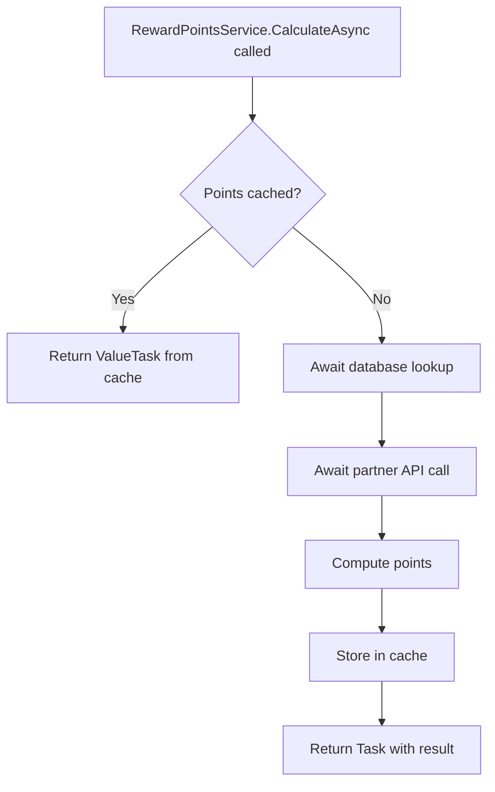
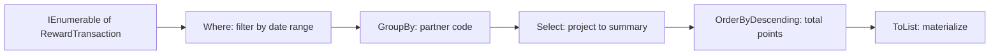
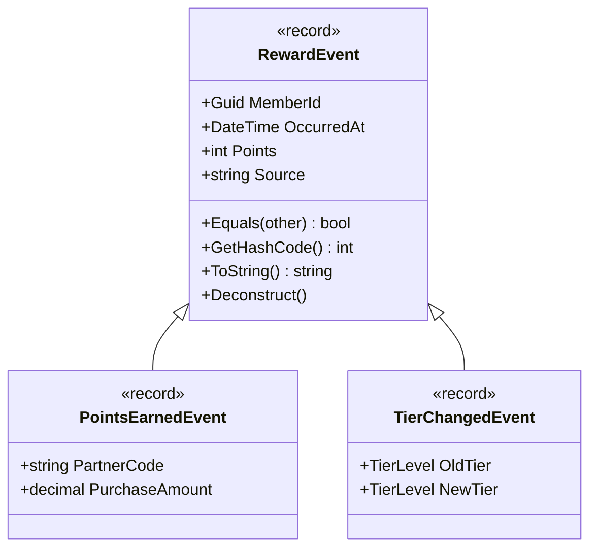
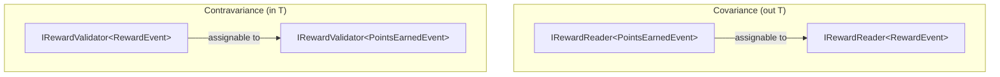
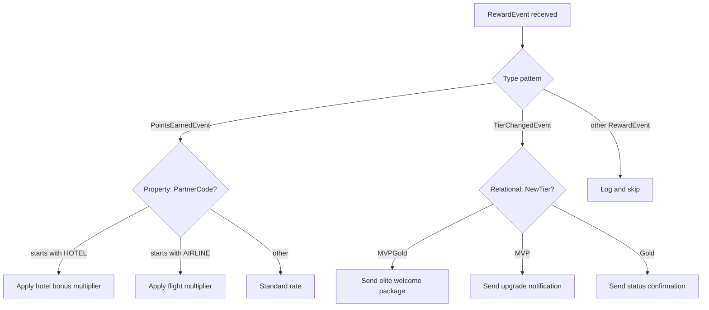
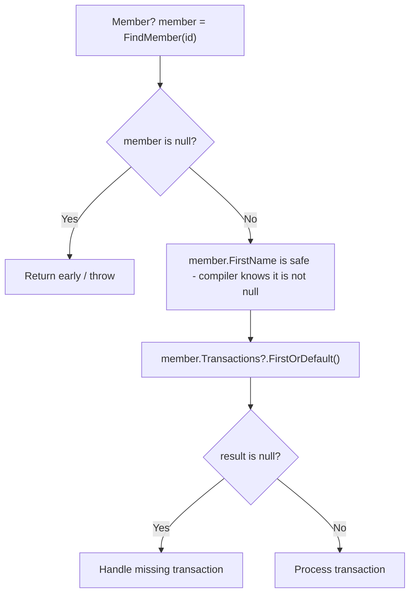

# C# Language Fundamentals

## Overview

This document covers core C# language features relevant to the Alaska Airlines Membership Atmos Rewards team. The examples use loyalty/rewards domain objects throughout: members, reward transactions, tier levels, point calculations, and partner earnings. Each section includes explanations, diagrams, code examples, and common interview questions.

Domain model used across examples:



---

## 1. Async/Await

The `async`/`await` pattern allows non-blocking I/O operations. In a rewards system this matters because point calculations, database lookups, and partner API calls should not block threads.

### Task vs ValueTask

- `Task<T>` allocates on the heap every time. Use it for most async methods.
- `ValueTask<T>` is a struct that avoids allocation when the result is already available (cached path). Use it when a method frequently returns synchronously.

### ConfigureAwait

`ConfigureAwait(false)` tells the runtime not to capture the synchronization context. Use it in library code and service layers. Omit it (or use `true`) in UI or controller code that needs the original context.

### Common Pitfalls

- **async void**: Only valid for event handlers. Exceptions in `async void` crash the process because they cannot be observed.
- **Deadlocks**: Calling `.Result` or `.Wait()` on a `Task` from a context with a synchronization context (ASP.NET classic, UI thread) causes a deadlock.
- **Fire and forget**: Discarding a `Task` without awaiting silently swallows exceptions.



### Code Example: Async Point Calculation

```csharp
public class RewardPointsService
{
    private readonly ITransactionRepository _transactionRepo;
    private readonly IPartnerApiClient _partnerApi;
    private readonly IMemoryCache _cache;

    public RewardPointsService(
        ITransactionRepository transactionRepo,
        IPartnerApiClient partnerApi,
        IMemoryCache cache)
    {
        _transactionRepo = transactionRepo;
        _partnerApi = partnerApi;
        _cache = cache;
    }

    // Use ValueTask when the cached path is common.
    public ValueTask<int> GetPointsBalanceAsync(Guid memberId)
    {
        if (_cache.TryGetValue($"balance:{memberId}", out int cached))
        {
            return ValueTask.FromResult(cached);
        }

        return new ValueTask<int>(ComputeBalanceAsync(memberId));
    }

    private async Task<int> ComputeBalanceAsync(Guid memberId)
    {
        // ConfigureAwait(false) - no need to return to the original context.
        var transactions = await _transactionRepo
            .GetByMemberIdAsync(memberId)
            .ConfigureAwait(false);

        var partnerBonus = await _partnerApi
            .GetBonusPointsAsync(memberId)
            .ConfigureAwait(false);

        int total = transactions.Sum(t => t.PointsEarned) + partnerBonus;

        _cache.Set($"balance:{memberId}", total, TimeSpan.FromMinutes(5));
        return total;
    }

    // BAD: async void - exceptions vanish and crash the process.
    // public async void RecalculatePoints(Guid memberId) { ... }

    // GOOD: return Task so the caller can observe exceptions.
    public async Task RecalculatePointsAsync(Guid memberId)
    {
        var balance = await ComputeBalanceAsync(memberId).ConfigureAwait(false);
        await _transactionRepo
            .UpdateBalanceAsync(memberId, balance)
            .ConfigureAwait(false);
    }
}
```

---

## 2. LINQ

LINQ provides a declarative way to query collections and data sources. Two syntax forms exist: query syntax (SQL-like) and method syntax (fluent extension methods). They compile to the same code.

### Deferred Execution

LINQ queries using `Where`, `Select`, `OrderBy`, etc., are not executed until the result is enumerated (e.g., `foreach`, `ToList()`, `Count()`). This means the query can be composed incrementally without hitting the data source multiple times, but it also means enumerating twice executes the query twice.

### Common Operators

| Operator | Purpose |
|---|---|
| `Where` | Filter elements |
| `Select` | Project/transform elements |
| `GroupBy` | Group elements by key |
| `Aggregate` | Reduce to a single value |
| `SelectMany` | Flatten nested collections |
| `OrderBy` / `ThenBy` | Sort |



### Code Example: Querying Reward Transactions

```csharp
public class TransactionAnalyzer
{
    // Method syntax - more common in production code.
    public IReadOnlyList<PartnerSummary> GetPartnerSummaries(
        IEnumerable<RewardTransaction> transactions,
        DateTime from,
        DateTime to)
    {
        return transactions
            .Where(t => t.TransactionDate >= from && t.TransactionDate <= to)
            .GroupBy(t => t.PartnerCode)
            .Select(g => new PartnerSummary(
                PartnerCode: g.Key,
                TransactionCount: g.Count(),
                TotalPoints: g.Sum(t => t.PointsEarned),
                AverageAmount: g.Average(t => t.Amount)))
            .OrderByDescending(s => s.TotalPoints)
            .ToList();
    }

    // Query syntax - reads like SQL, useful for joins and complex queries.
    public IReadOnlyList<PartnerSummary> GetPartnerSummariesQuerySyntax(
        IEnumerable<RewardTransaction> transactions,
        DateTime from,
        DateTime to)
    {
        var summaries =
            from t in transactions
            where t.TransactionDate >= from && t.TransactionDate <= to
            group t by t.PartnerCode into g
            orderby g.Sum(t => t.PointsEarned) descending
            select new PartnerSummary(
                PartnerCode: g.Key,
                TransactionCount: g.Count(),
                TotalPoints: g.Sum(t => t.PointsEarned),
                AverageAmount: g.Average(t => t.Amount));

        return summaries.ToList();
    }

    // Aggregate: compute a running points balance.
    public int ComputeRunningBalance(IEnumerable<RewardTransaction> transactions)
    {
        return transactions
            .OrderBy(t => t.TransactionDate)
            .Aggregate(0, (balance, t) => t.Type == TransactionType.Flight
                ? balance + t.PointsEarned
                : balance + (int)(t.PointsEarned * 0.5m));
    }

    // Deferred execution demonstration.
    public void DeferredExecutionExample(IEnumerable<RewardTransaction> transactions)
    {
        // Query is defined but NOT executed yet.
        var highValue = transactions.Where(t => t.PointsEarned > 5000);

        // Adding a new transaction to the source BEFORE enumeration
        // means the new item will be included when the query runs.

        // Query executes here when ToList() forces enumeration.
        var results = highValue.ToList();
    }
}

public record PartnerSummary(
    string PartnerCode,
    int TransactionCount,
    int TotalPoints,
    decimal AverageAmount);
```

---

## 3. Records

Records provide value-based equality, immutability by default, and concise syntax. They are ideal for DTOs, events, and domain value objects in a rewards system.

### Record vs Class

| Feature | `record` / `record class` | `class` |
|---|---|---|
| Equality | Value-based (all properties) | Reference-based |
| `ToString()` | Auto-generated with property values | Type name only |
| Immutability | Init-only by default (positional) | Mutable unless you add `init` |
| `with` expressions | Supported | Not supported |
| Deconstruction | Built-in for positional records | Must write manually |

### Positional Records

Declared with a parameter list. The compiler generates a constructor, `Deconstruct`, init-only properties, and value equality.



### Code Example: Record Types for Reward Events

```csharp
// Positional record - compiler generates constructor, Deconstruct, Equals, GetHashCode, ToString.
public record RewardEvent(
    Guid MemberId,
    DateTime OccurredAt,
    int Points,
    string Source);

// Record inheritance - adds partner-specific fields.
public record PointsEarnedEvent(
    Guid MemberId,
    DateTime OccurredAt,
    int Points,
    string Source,
    string PartnerCode,
    decimal PurchaseAmount) : RewardEvent(MemberId, OccurredAt, Points, Source);

public record TierChangedEvent(
    Guid MemberId,
    DateTime OccurredAt,
    int Points,
    string Source,
    TierLevel OldTier,
    TierLevel NewTier) : RewardEvent(MemberId, OccurredAt, Points, Source);

public class RewardEventProcessor
{
    public void DemonstrateRecordFeatures()
    {
        var earned = new PointsEarnedEvent(
            Guid.NewGuid(), DateTime.UtcNow, 500, "Partner", "HOTEL-01", 250.00m);

        // with expression - creates a copy with one property changed.
        var corrected = earned with { Points = 750 };

        // Value equality - two records with the same property values are equal.
        var duplicate = earned with { };
        bool areEqual = earned == duplicate; // true

        // Deconstruction.
        var (memberId, occurredAt, points, source) = earned;

        // ToString produces a readable representation.
        // PointsEarnedEvent { MemberId = ..., OccurredAt = ..., Points = 500, ... }
        Console.WriteLine(earned);
    }

    // Records work well as dictionary keys because of value-based GetHashCode.
    public Dictionary<RewardEvent, string> BuildAuditLog(
        IEnumerable<RewardEvent> events)
    {
        return events.ToDictionary(e => e, e => $"Processed at {DateTime.UtcNow}");
    }
}
```

---

## 4. Generics

Generics allow type-safe, reusable code without boxing or casting. Constraints narrow the allowed types and unlock additional operations.

### Constraints

| Constraint | Meaning |
|---|---|
| `where T : class` | Reference type |
| `where T : struct` | Value type |
| `where T : new()` | Has parameterless constructor |
| `where T : IComparable<T>` | Implements interface |
| `where T : Base` | Derives from base class |
| `where T : notnull` | Non-nullable |

### Covariance and Contravariance

- **Covariance** (`out T`): allows `IEnumerable<Derived>` where `IEnumerable<Base>` is expected. The type parameter is only used in output positions.
- **Contravariance** (`in T`): allows `IComparer<Base>` where `IComparer<Derived>` is expected. The type parameter is only used in input positions.



### Code Example: Generic Repository and Variance

```csharp
// Generic repository with constraints.
public interface IRepository<T> where T : class
{
    Task<T?> GetByIdAsync(Guid id);
    Task<IReadOnlyList<T>> GetAllAsync();
    Task AddAsync(T entity);
    Task UpdateAsync(T entity);
}

public class RewardTransactionRepository : IRepository<RewardTransaction>
{
    private readonly DbContext _context;

    public RewardTransactionRepository(DbContext context) => _context = context;

    public async Task<RewardTransaction?> GetByIdAsync(Guid id) =>
        await _context.Set<RewardTransaction>().FindAsync(id);

    public async Task<IReadOnlyList<RewardTransaction>> GetAllAsync() =>
        await _context.Set<RewardTransaction>().ToListAsync();

    public async Task AddAsync(RewardTransaction entity) =>
        await _context.Set<RewardTransaction>().AddAsync(entity);

    public async Task UpdateAsync(RewardTransaction entity) =>
        _context.Set<RewardTransaction>().Update(entity);
}

// Covariance: out T - can read events but not write them.
public interface IRewardReader<out T> where T : RewardEvent
{
    T GetLatest(Guid memberId);
    IEnumerable<T> GetAll();
}

// Contravariance: in T - can accept events but not return them.
public interface IRewardValidator<in T> where T : RewardEvent
{
    bool IsValid(T rewardEvent);
}

// Generic method with multiple constraints.
public class TierEvaluationService
{
    public TResult EvaluateTier<TMember, TResult>(TMember member, Func<TMember, TResult> evaluator)
        where TMember : class
        where TResult : notnull
    {
        ArgumentNullException.ThrowIfNull(member);
        return evaluator(member);
    }

    // Generic method constrained to IComparable for ranking members.
    public IReadOnlyList<T> RankMembers<T>(IEnumerable<T> members)
        where T : IComparable<T>
    {
        return members.OrderByDescending(m => m).ToList();
    }
}
```

---

## 5. Pattern Matching

Pattern matching makes conditional logic expressive and concise. C# supports type patterns, property patterns, relational patterns, and switch expressions.



### Code Example: Pattern Matching on Tier Levels and Events

```csharp
public class PartnerEarningService
{
    // Switch expression with type patterns and property patterns.
    public decimal CalculateMultiplier(RewardEvent rewardEvent) => rewardEvent switch
    {
        PointsEarnedEvent { PartnerCode: var code, PurchaseAmount: > 500 }
            when code.StartsWith("HOTEL") => 3.0m,

        PointsEarnedEvent { PartnerCode: var code }
            when code.StartsWith("HOTEL") => 2.0m,

        PointsEarnedEvent { PartnerCode: var code }
            when code.StartsWith("AIRLINE") => 1.5m,

        PointsEarnedEvent => 1.0m,

        TierChangedEvent { NewTier: TierLevel.MVPGold } => 2.5m,
        TierChangedEvent { NewTier: TierLevel.MVP } => 1.5m,
        TierChangedEvent => 1.0m,

        _ => 1.0m
    };

    // Relational patterns for tier qualification.
    public TierLevel EvaluateTier(int lifetimeMiles) => lifetimeMiles switch
    {
        >= 100_000 => TierLevel.MVPGold,
        >= 50_000 => TierLevel.MVP,
        >= 25_000 => TierLevel.Gold,
        _ => throw new ArgumentOutOfRangeException(
            nameof(lifetimeMiles), "Member does not qualify for any tier.")
    };

    // Property pattern with nested matching.
    public string DescribeTransaction(RewardTransaction transaction) => transaction switch
    {
        { Type: TransactionType.Flight, PointsEarned: > 10_000 } =>
            "Premium flight earning",
        { Type: TransactionType.Flight, PointsEarned: > 0 } =>
            "Standard flight earning",
        { Type: TransactionType.PartnerPurchase, PartnerCode: "HOTEL-01" } =>
            "Hotel partner purchase",
        { Type: TransactionType.BonusPromotion, PointsEarned: var pts } when pts > 5_000 =>
            $"High-value promotion: {pts} points",
        { Type: TransactionType.BonusPromotion } =>
            "Standard promotion",
        _ => "Unknown transaction type"
    };

    // List patterns (C# 11) for analyzing transaction sequences.
    public string AnalyzeRecentActivity(TierLevel[] recentTiers) => recentTiers switch
    {
        [TierLevel.MVPGold, TierLevel.MVPGold, ..] =>
            "Consistently elite",
        [TierLevel.MVPGold, TierLevel.MVP, ..] =>
            "Declining engagement - retention risk",
        [_, .., TierLevel.MVPGold] =>
            "Rising engagement - upgrade candidate",
        [] =>
            "No tier history",
        _ =>
            "Standard activity"
    };
}
```

---

## 6. Nullable Reference Types

Nullable reference types (NRT) make null-safety explicit at compile time. When enabled, the compiler warns when code might dereference `null` without a check.

### Enabling

Add to the `.csproj` file:

```xml
<PropertyGroup>
    <Nullable>enable</Nullable>
</PropertyGroup>
```

Or per-file with `#nullable enable`.

### Annotations

| Annotation | Meaning |
|---|---|
| `string` | Non-nullable. The compiler warns if `null` is assigned. |
| `string?` | Nullable. The compiler warns if dereferenced without a null check. |
| `!` (null-forgiving) | Suppresses the warning. Use sparingly and only when you know better than the compiler. |
| `[NotNull]` | Post-condition: the value will not be `null` after the method returns. |
| `[MaybeNull]` | Post-condition: the value might be `null`. |



### Code Example: Nullable References in a Rewards Context

```csharp
#nullable enable

public class Member
{
    public Guid Id { get; init; }
    public string FirstName { get; init; }    // Non-nullable: must be set.
    public string LastName { get; init; }      // Non-nullable: must be set.
    public string? MiddleName { get; init; }   // Nullable: not all members have one.
    public TierLevel Tier { get; set; }
    public int LifetimeMiles { get; set; }
    public List<RewardTransaction> Transactions { get; init; } = new();

    // Constructor enforces non-null requirements.
    public Member(Guid id, string firstName, string lastName)
    {
        Id = id;
        FirstName = firstName ?? throw new ArgumentNullException(nameof(firstName));
        LastName = lastName ?? throw new ArgumentNullException(nameof(lastName));
    }

    public string GetFullName()
    {
        // MiddleName is nullable, so we handle both cases.
        return MiddleName is not null
            ? $"{FirstName} {MiddleName} {LastName}"
            : $"{FirstName} {LastName}";
    }
}

public class MemberService
{
    private readonly IRepository<Member> _memberRepo;

    public MemberService(IRepository<Member> memberRepo)
    {
        _memberRepo = memberRepo ?? throw new ArgumentNullException(nameof(memberRepo));
    }

    // Return type is nullable - caller must check.
    public async Task<Member?> FindMemberAsync(Guid id)
    {
        return await _memberRepo.GetByIdAsync(id);
    }

    // Non-nullable return - throws if not found.
    public async Task<Member> GetMemberOrThrowAsync(Guid id)
    {
        var member = await _memberRepo.GetByIdAsync(id);
        return member ?? throw new KeyNotFoundException(
            $"Member {id} not found.");
    }

    public async Task<string> GetMemberTierDescriptionAsync(Guid id)
    {
        var member = await FindMemberAsync(id);

        // Null-conditional and null-coalescing patterns.
        var latestTransaction = member?.Transactions
            .OrderByDescending(t => t.TransactionDate)
            .FirstOrDefault();

        var partnerInfo = latestTransaction?.PartnerCode ?? "No partner activity";

        // Null-forgiving operator: use only when you are certain.
        // Here we have already checked member is not null via the pattern.
        if (member is { Tier: TierLevel.MVPGold } mvpGoldMember)
        {
            // mvpGoldMember is guaranteed non-null inside this block.
            return $"Elite member: {mvpGoldMember.GetFullName()} - {partnerInfo}";
        }

        return member is not null
            ? $"Member: {member.GetFullName()} - Tier: {member.Tier} - {partnerInfo}"
            : "Member not found";
    }
}
```

---

## Interview Questions

### Async/Await

1. What is the difference between `Task<T>` and `ValueTask<T>`? When would you choose one over the other?
2. Explain what `ConfigureAwait(false)` does. When should you use it and when should you avoid it?
3. Why is `async void` dangerous? What is the one acceptable use case?
4. How can calling `.Result` or `.Wait()` on a task cause a deadlock? Describe the mechanism.
5. If you have three independent async calls, how do you run them concurrently instead of sequentially?

### LINQ

6. What is deferred execution? How does it affect when a LINQ query actually runs?
7. What is the difference between `IEnumerable<T>` and `IQueryable<T>` in the context of LINQ?
8. Explain how `GroupBy` works. What does it return?
9. When would you use `Aggregate` instead of `Sum` or `Count`?
10. If you enumerate a deferred LINQ query twice, what happens?

### Records

11. How does equality work in records versus classes?
12. What does a `with` expression do? Can you use it with classes?
13. What is the difference between a positional record and one declared with property syntax?
14. Can records be inherited? What are the rules?
15. When would you choose a `record struct` over a `record class`?

### Generics

16. Explain covariance and contravariance with an example. Why does `IEnumerable<T>` use `out T`?
17. What constraints can you place on a generic type parameter? Give a practical example.
18. Why can you not use `new T()` in a generic method without the `new()` constraint?
19. What is type erasure? Does C# have it? How does C# generics differ from Java generics?

### Pattern Matching

20. How do switch expressions differ from switch statements?
21. Explain property patterns. How do they combine with type patterns?
22. What are relational patterns and when are they useful?
23. How do list patterns work in C# 11?

### Nullable Reference Types

24. What happens when you enable nullable reference types? Is it a compile-time or runtime feature?
25. When is the null-forgiving operator (`!`) appropriate? When is it a code smell?
26. How do `[NotNull]`, `[MaybeNull]`, and `[NotNullWhen]` attributes help the compiler?
27. What is the difference between `string?` for a reference type versus `int?` for a value type at the CLR level?
