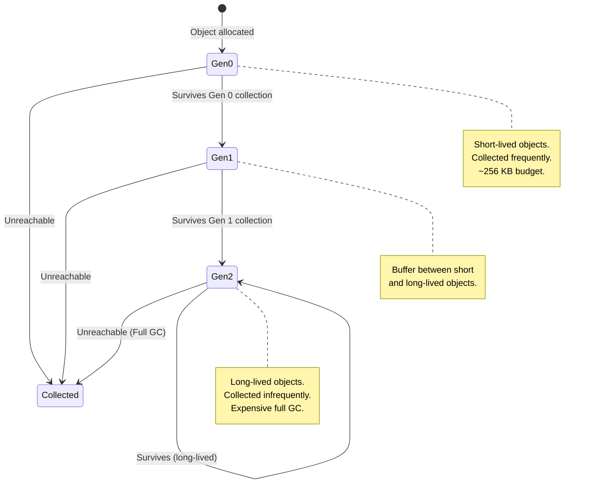
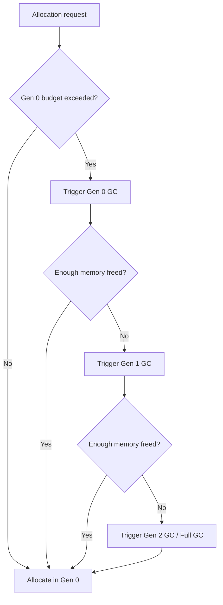
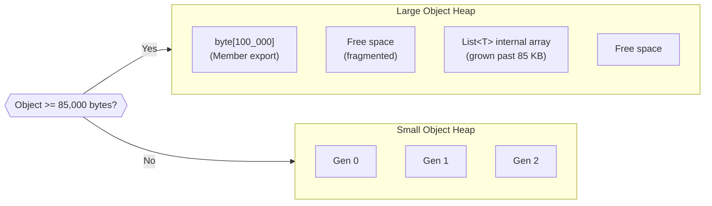
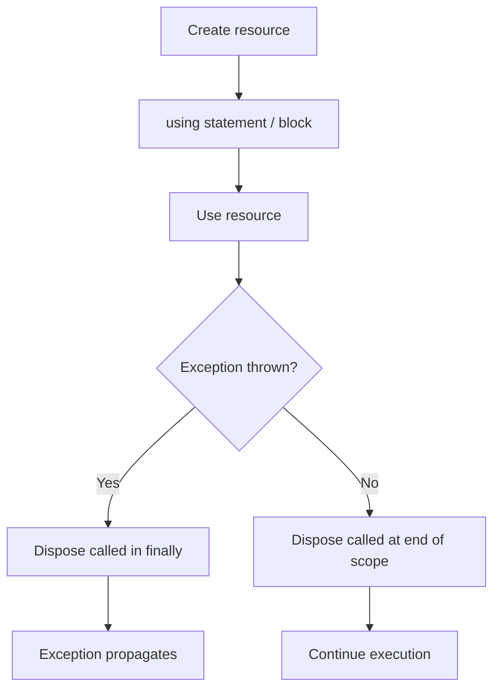
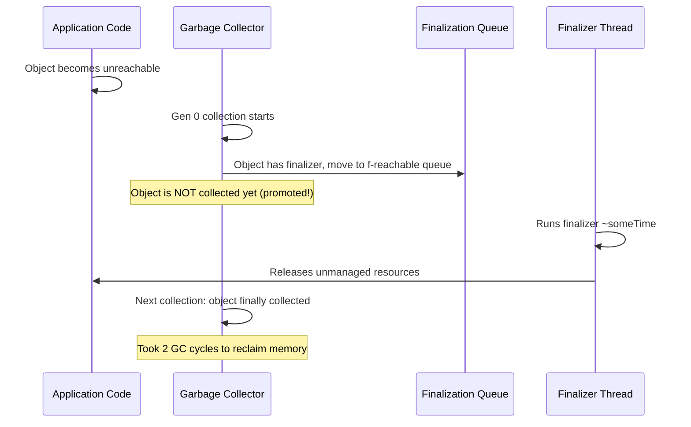
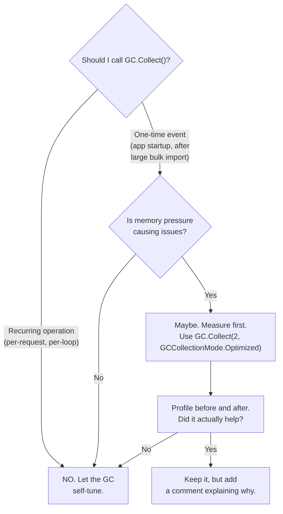
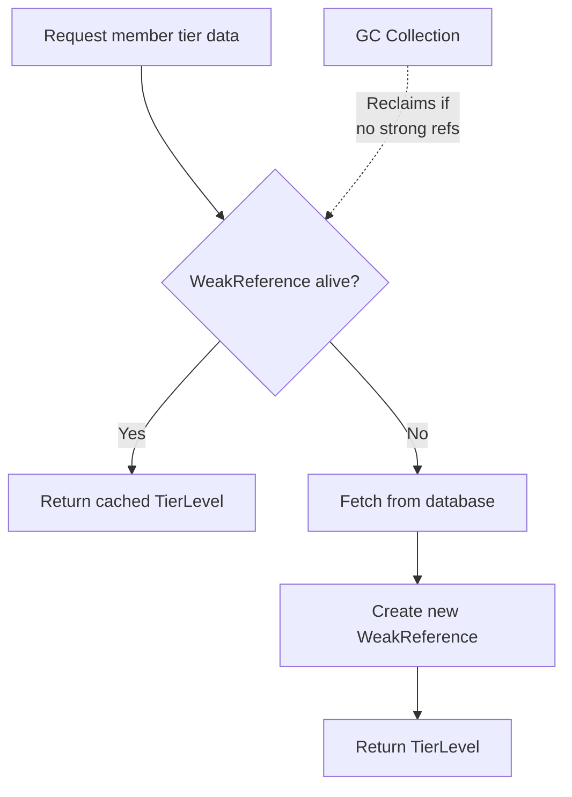

# C# Garbage Collection & Memory Management

**Position:** Software Engineer -- Membership Atmos Rewards Team, Alaska Airlines
**Focus:** GC internals, IDisposable, Span\<T\>, memory-efficient patterns for web APIs

---

## Overview

The .NET garbage collector is a generational, mark-and-sweep collector that automatically reclaims memory occupied by unreachable objects. Understanding how it works is critical for building high-throughput services like a loyalty rewards API, where thousands of `RewardTransaction` objects may be created and discarded per second. Poor memory hygiene leads to excessive GC pauses, Gen 2 collections, and Large Object Heap fragmentation -- all of which hurt latency and throughput.

This document covers the GC lifecycle from object allocation through collection, the IDisposable pattern for deterministic cleanup of unmanaged resources, modern low-allocation techniques with `Span<T>` and `Memory<T>`, and practical patterns for reducing memory pressure in ASP.NET Core services.

---

## 1. GC Generations

The .NET GC divides the managed heap into three generations based on object lifetime. Short-lived objects are collected cheaply in Gen 0; long-lived objects are promoted to Gen 2 where collections are expensive.



**Key rules:**

- **Gen 0** collections are fast (sub-millisecond) and happen frequently. Most objects die here.
- **Gen 1** acts as a buffer. If an object survives Gen 0, it gets one more chance before promotion.
- **Gen 2** collections (full GC) pause the application and scan the entire heap. Avoid triggering these unnecessarily.
- An object is only promoted when it survives a collection of its current generation.

### How Collection is Triggered



### Code Example: Object Lifetime in Generations

```csharp
public class TierEvaluationService
{
    // Long-lived: promoted to Gen 2 because the service is a singleton.
    private readonly Dictionary<string, TierLevel> _tierThresholds = new()
    {
        ["Gold"] = new TierLevel("Gold", 20_000),
        ["MVPGold"] = new TierLevel("MVP Gold", 50_000),
        ["MVP"] = new TierLevel("MVP", 75_000)
    };

    public TierLevel EvaluateTier(Member member)
    {
        // Short-lived: allocated in Gen 0, collected almost immediately.
        var qualifyingSegments = member.Transactions
            .Where(t => t.TransactionDate >= DateTime.UtcNow.AddYears(-1))
            .Sum(t => t.MilesEarned);

        // The LINQ iterator, intermediate list, and lambda closure
        // are all Gen 0 allocations that die before the next GC.

        foreach (var (_, tier) in _tierThresholds.OrderByDescending(t => t.Value.Threshold))
        {
            if (qualifyingSegments >= tier.Threshold)
                return tier;
        }

        return TierLevel.Base;
    }
}

public record TierLevel(string Name, int Threshold)
{
    public static readonly TierLevel Base = new("Base", 0);
}
```

**Interview insight:** The `_tierThresholds` dictionary lives for the lifetime of the singleton service, so it gets promoted to Gen 2 and stays there. The LINQ allocations inside `EvaluateTier` are short-lived Gen 0 objects -- this is fine if the method is called at a moderate rate. Under heavy load, consider pre-allocating or caching the result.

---

## 2. Large Object Heap (LOH)

Objects 85,000 bytes or larger are allocated on the Large Object Heap. The LOH is collected during Gen 2 collections but is **not compacted by default**, leading to fragmentation over time.



**Key points:**

- Arrays are the most common LOH citizens. A `byte[]` of 85,000+ bytes or a `List<T>` whose internal array grows past 85 KB lands on the LOH.
- LOH fragmentation can cause `OutOfMemoryException` even when total free memory is sufficient.
- Since .NET Core 3.0, you can request LOH compaction: `GCSettings.LargeObjectHeapCompactionMode = GCLargeObjectHeapCompactionMode.CompactOnce;`
- Use `ArrayPool<T>.Shared` to rent and return large arrays instead of allocating new ones.

### Code Example: Avoiding LOH Allocations with ArrayPool

```csharp
public class RewardStatementGenerator
{
    public byte[] GenerateMonthlyStatement(Member member, IReadOnlyList<RewardTransaction> transactions)
    {
        // BAD: Allocates a new large byte array every call.
        // If the statement exceeds 85 KB, this hits the LOH.
        // byte[] buffer = new byte[256_000];

        // GOOD: Rent from the shared pool to avoid LOH allocations.
        byte[] buffer = ArrayPool<byte>.Shared.Rent(256_000);
        try
        {
            int bytesWritten = 0;

            // Write header
            bytesWritten += WriteHeader(buffer, member);

            // Write each transaction line
            foreach (var transaction in transactions)
            {
                bytesWritten += WriteTransactionLine(
                    buffer.AsSpan(bytesWritten),
                    transaction);
            }

            // Return only the portion we used
            return buffer.AsSpan(0, bytesWritten).ToArray();
        }
        finally
        {
            // Always return to the pool. The pool handles reuse.
            ArrayPool<byte>.Shared.Return(buffer, clearArray: true);
        }
    }

    private int WriteHeader(byte[] buffer, Member member) { /* ... */ return 0; }
    private int WriteTransactionLine(Span<byte> destination, RewardTransaction tx) { /* ... */ return 0; }
}
```

---

## 3. IDisposable Pattern

`IDisposable` provides deterministic cleanup for unmanaged resources (database connections, file handles, HTTP clients, etc.). The `using` statement guarantees `Dispose` is called even if an exception is thrown.



### Code Example: PartnerApiClient with IDisposable

```csharp
public class PartnerApiClient : IDisposable, IAsyncDisposable
{
    private readonly HttpClient _httpClient;
    private readonly SemaphoreSlim _rateLimiter;
    private bool _disposed;

    public PartnerApiClient(string baseUrl, int maxConcurrentRequests = 5)
    {
        _httpClient = new HttpClient { BaseAddress = new Uri(baseUrl) };
        _rateLimiter = new SemaphoreSlim(maxConcurrentRequests);
    }

    public async Task<PartnerEarning> SubmitEarningAsync(
        string memberId, RewardTransaction transaction)
    {
        ObjectDisposedException.ThrowIf(_disposed, this);

        await _rateLimiter.WaitAsync();
        try
        {
            var response = await _httpClient.PostAsJsonAsync(
                $"/api/v1/members/{memberId}/earnings",
                new { transaction.FlightSegment, transaction.MilesEarned });

            response.EnsureSuccessStatusCode();
            return await response.Content.ReadFromJsonAsync<PartnerEarning>()
                ?? throw new InvalidOperationException("Null response from partner API.");
        }
        finally
        {
            _rateLimiter.Release();
        }
    }

    // Synchronous dispose for IDisposable
    public void Dispose()
    {
        Dispose(disposing: true);
        GC.SuppressFinalize(this);
    }

    // Async dispose for IAsyncDisposable
    public async ValueTask DisposeAsync()
    {
        await DisposeAsyncCore();
        Dispose(disposing: false);
        GC.SuppressFinalize(this);
    }

    protected virtual void Dispose(bool disposing)
    {
        if (_disposed) return;

        if (disposing)
        {
            // Free managed resources
            _httpClient.Dispose();
            _rateLimiter.Dispose();
        }

        _disposed = true;
    }

    protected virtual async ValueTask DisposeAsyncCore()
    {
        // If any managed resources need async cleanup, do it here.
        _httpClient.Dispose();
        _rateLimiter.Dispose();
        await ValueTask.CompletedTask;
    }
}

// Usage with using declaration (C# 8+)
public class PartnerEarningService
{
    public async Task ProcessPartnerEarningsAsync(
        Member member, IReadOnlyList<RewardTransaction> transactions)
    {
        await using var client = new PartnerApiClient("https://partners.alaskaair.com");

        foreach (var transaction in transactions)
        {
            await client.SubmitEarningAsync(member.MemberId, transaction);
        }
    }
    // client.DisposeAsync() is called automatically here
}
```

**Key details:**

- `GC.SuppressFinalize(this)` tells the GC not to call the finalizer since we already cleaned up.
- The `disposing` parameter distinguishes between explicit disposal (`true`) and finalizer invocation (`false`). When `false`, do not touch other managed objects -- they may already be finalized.
- `IAsyncDisposable` is preferred when cleanup involves I/O (flushing streams, closing connections).
- The `await using` declaration combines async dispose with the using pattern.

---

## 4. Finalizers vs. Dispose

Finalizers (destructors) are a safety net. They run on a dedicated GC finalizer thread with no guaranteed timing. Prefer `IDisposable` for deterministic cleanup.



**Critical difference:**

| Aspect | Dispose | Finalizer |
|--------|---------|-----------|
| When it runs | Deterministic (you call it) | Non-deterministic (GC decides) |
| Thread | Caller's thread | Dedicated finalizer thread |
| Can access managed objects | Yes | No (they may be finalized) |
| Effect on GC | `SuppressFinalize` avoids extra cycle | Object survives an extra GC cycle |
| Use case | Primary cleanup path | Safety net for unmanaged resources |

### When to Use a Finalizer

Only add a finalizer if your class **directly** holds an unmanaged resource (native handle, unmanaged memory). If you only hold managed `IDisposable` references, a finalizer is unnecessary and harmful -- it delays collection.

```csharp
public class NativeFlightDataReader : IDisposable
{
    private IntPtr _nativeHandle; // Unmanaged resource
    private bool _disposed;

    public NativeFlightDataReader(string dataFilePath)
    {
        _nativeHandle = NativeMethods.OpenFlightData(dataFilePath);
    }

    // Finalizer: safety net if Dispose is not called.
    ~NativeFlightDataReader()
    {
        Dispose(disposing: false);
    }

    public FlightSegment ReadSegment()
    {
        ObjectDisposedException.ThrowIf(_disposed, this);
        // Read from unmanaged buffer...
        return NativeMethods.ReadNextSegment(_nativeHandle);
    }

    public void Dispose()
    {
        Dispose(disposing: true);
        GC.SuppressFinalize(this);
    }

    protected virtual void Dispose(bool disposing)
    {
        if (_disposed) return;

        if (disposing)
        {
            // Free managed resources here (if any)
        }

        // Free unmanaged resources regardless of disposing flag
        if (_nativeHandle != IntPtr.Zero)
        {
            NativeMethods.CloseFlightData(_nativeHandle);
            _nativeHandle = IntPtr.Zero;
        }

        _disposed = true;
    }
}
```

---

## 5. Memory Pressure and GC.Collect

Calling `GC.Collect()` forces a full garbage collection. In almost all cases this is a bad idea -- the GC is self-tuning and knows more about memory state than you do. Forcing a collection disrupts the GC's generational heuristics and causes unnecessary pauses.



### Acceptable Use Cases

1. **After a large bulk operation** that allocated millions of short-lived objects (e.g., importing a year of reward transactions during migration).
2. **Before a memory-sensitive measurement** in benchmarking code.
3. **During application idle periods** in a game or desktop app (not relevant for web APIs).

```csharp
public class RewardTransactionImporter
{
    private readonly IRewardTransactionRepository _repository;

    public RewardTransactionImporter(IRewardTransactionRepository repository)
    {
        _repository = repository;
    }

    public async Task ImportHistoricalTransactionsAsync(
        IAsyncEnumerable<RewardTransaction> transactions)
    {
        int batchCount = 0;
        var batch = new List<RewardTransaction>(1000);

        await foreach (var transaction in transactions)
        {
            batch.Add(transaction);

            if (batch.Count >= 1000)
            {
                await _repository.BulkInsertAsync(batch);
                batch.Clear();
                batchCount++;
            }
        }

        // Flush remaining
        if (batch.Count > 0)
            await _repository.BulkInsertAsync(batch);

        // After importing millions of records, hint to the GC
        // that now is a good time to collect. This is a one-time
        // operation, not a per-request path.
        if (batchCount > 100)
        {
            GC.Collect(2, GCCollectionMode.Optimized, blocking: false);
        }
    }
}
```

---

## 6. Span\<T\> and Memory\<T\>

`Span<T>` is a stack-allocated, ref struct that provides a view into contiguous memory without copying. It eliminates allocations when parsing, slicing, or transforming data. `Memory<T>` is the heap-friendly counterpart that can be stored in fields and used across async boundaries.

| Type | Stack or Heap | Can be a field | Async-safe | Use case |
|------|---------------|----------------|------------|----------|
| `Span<T>` | Stack only (ref struct) | No | No | Synchronous parsing, slicing |
| `Memory<T>` | Heap | Yes | Yes | Async pipelines, buffering |
| `ReadOnlySpan<T>` | Stack only | No | No | Read-only slicing of strings, arrays |
| `ReadOnlyMemory<T>` | Heap | Yes | Yes | Async read-only access |

### Code Example: Parsing Flight Segment Data with Span\<T\>

```csharp
public static class FlightSegmentParser
{
    /// <summary>
    /// Parse a fixed-width flight segment record without allocating substrings.
    /// Format: "SEA-LAX 2026-02-15 1250 AS0372"
    ///          ^origin ^dest   ^date       ^miles ^flight
    /// Positions: 0-2  4-6   8-17     19-22  24-29
    /// </summary>
    public static FlightSegment Parse(ReadOnlySpan<char> record)
    {
        // Slice without allocating new strings (until .ToString() at the end)
        ReadOnlySpan<char> origin = record[..3];
        ReadOnlySpan<char> destination = record[4..7];
        ReadOnlySpan<char> dateSpan = record[8..18];
        ReadOnlySpan<char> milesSpan = record[19..23];
        ReadOnlySpan<char> flightNumber = record[24..];

        return new FlightSegment
        {
            Origin = origin.ToString(),
            Destination = destination.ToString(),
            FlightDate = DateTime.Parse(dateSpan),
            MilesEarned = int.Parse(milesSpan),
            FlightNumber = flightNumber.Trim().ToString()
        };
    }

    /// <summary>
    /// Parse multiple records from a large buffer, avoiding substring allocations for delimiters.
    /// </summary>
    public static List<FlightSegment> ParseAll(ReadOnlySpan<char> data)
    {
        var segments = new List<FlightSegment>();
        int lineStart = 0;

        for (int i = 0; i < data.Length; i++)
        {
            if (data[i] == '\n')
            {
                var line = data[lineStart..i];
                if (line.Length >= 24)
                    segments.Add(Parse(line));
                lineStart = i + 1;
            }
        }

        // Handle last line without trailing newline
        if (lineStart < data.Length)
        {
            var lastLine = data[lineStart..];
            if (lastLine.Length >= 24)
                segments.Add(Parse(lastLine));
        }

        return segments;
    }
}

public class FlightSegment
{
    public string Origin { get; init; } = "";
    public string Destination { get; init; } = "";
    public DateTime FlightDate { get; init; }
    public int MilesEarned { get; init; }
    public string FlightNumber { get; init; } = "";
}
```

**Why this matters:** In a high-throughput rewards processing pipeline, parsing thousands of flight segment records per second with `string.Substring()` creates massive Gen 0 pressure. `Span<T>` slicing is zero-allocation until you call `.ToString()` at the boundary where you actually need a `string`.

---

## 7. Weak References

A `WeakReference<T>` holds a reference to an object without preventing the GC from collecting it. This is useful for caches where you want to keep data around if memory allows, but let the GC reclaim it under pressure.



### Code Example: Weak Reference Cache for Member Tier Data

```csharp
public class MemberTierCache
{
    private readonly ConcurrentDictionary<string, WeakReference<MemberTierInfo>> _cache = new();
    private readonly IMemberRepository _memberRepository;

    public MemberTierCache(IMemberRepository memberRepository)
    {
        _memberRepository = memberRepository;
    }

    public async Task<MemberTierInfo> GetTierInfoAsync(string memberId)
    {
        // Try the weak reference cache first
        if (_cache.TryGetValue(memberId, out var weakRef)
            && weakRef.TryGetTarget(out var cached))
        {
            return cached;
        }

        // Cache miss or GC collected the object -- fetch from DB
        var member = await _memberRepository.GetByIdAsync(memberId);
        var tierInfo = new MemberTierInfo
        {
            MemberId = member.MemberId,
            CurrentTier = member.TierLevel,
            QualifyingMiles = member.QualifyingMiles,
            ExpiresUtc = DateTime.UtcNow.AddMinutes(30)
        };

        // Store as weak reference. GC can collect under memory pressure.
        _cache[memberId] = new WeakReference<MemberTierInfo>(tierInfo);

        return tierInfo;
    }

    /// <summary>
    /// Periodically clean up dead weak references to avoid dictionary bloat.
    /// </summary>
    public void Scavenge()
    {
        foreach (var key in _cache.Keys)
        {
            if (_cache.TryGetValue(key, out var weakRef)
                && !weakRef.TryGetTarget(out _))
            {
                _cache.TryRemove(key, out _);
            }
        }
    }
}

public class MemberTierInfo
{
    public string MemberId { get; init; } = "";
    public TierLevel CurrentTier { get; init; } = TierLevel.Base;
    public int QualifyingMiles { get; init; }
    public DateTime ExpiresUtc { get; init; }
}
```

**When to use weak references vs. IMemoryCache:**

- Use `IMemoryCache` (or Redis) for production caching with TTL, size limits, and eviction policies.
- Use `WeakReference<T>` when you want a lightweight, GC-friendly secondary cache or when you need to avoid pinning objects that should be collectable.
- In practice, `IMemoryCache` with size limits is usually the better choice for web APIs. Weak references are more useful in long-running desktop or service applications.

---

## 8. Best Practices for Reducing Memory Pressure in Web APIs

These patterns are especially relevant for the Atmos Rewards API handling thousands of concurrent requests.

### Object Pooling with ObjectPool\<T\>

```csharp
// In Program.cs / Startup
builder.Services.AddSingleton<ObjectPoolProvider, DefaultObjectPoolProvider>();
builder.Services.AddSingleton(sp =>
{
    var provider = sp.GetRequiredService<ObjectPoolProvider>();
    return provider.Create(new RewardCalculatorPoolPolicy());
});

public class RewardCalculatorPoolPolicy : PooledObjectPolicy<RewardCalculator>
{
    public override RewardCalculator Create() => new RewardCalculator();

    public override bool Return(RewardCalculator obj)
    {
        obj.Reset(); // Clear state for reuse
        return true;
    }
}

public class RewardCalculator
{
    private readonly List<int> _segmentMiles = new(capacity: 50);

    public int CalculateTotalMiles(IEnumerable<RewardTransaction> transactions)
    {
        _segmentMiles.Clear();

        foreach (var t in transactions)
            _segmentMiles.Add(t.MilesEarned);

        return _segmentMiles.Sum();
    }

    public void Reset() => _segmentMiles.Clear();
}

// In a controller or service
public class RewardPointsService
{
    private readonly ObjectPool<RewardCalculator> _calculatorPool;

    public RewardPointsService(ObjectPool<RewardCalculator> calculatorPool)
    {
        _calculatorPool = calculatorPool;
    }

    public int CalculateMilesForMember(Member member)
    {
        var calculator = _calculatorPool.Get();
        try
        {
            return calculator.CalculateTotalMiles(member.Transactions);
        }
        finally
        {
            _calculatorPool.Return(calculator);
        }
    }
}
```

### Summary of Best Practices

| Practice | Benefit |
|----------|---------|
| Use `ArrayPool<T>.Shared` for large arrays | Avoids LOH allocations and fragmentation |
| Use `ObjectPool<T>` for frequently created objects | Reduces Gen 0 pressure |
| Use `Span<T>` / `ReadOnlySpan<T>` for parsing | Zero-allocation slicing |
| Prefer `using` / `await using` for `IDisposable` | Deterministic cleanup, prevents resource leaks |
| Avoid finalizers unless holding unmanaged resources | Prevents extra GC cycle for finalization |
| Call `GC.SuppressFinalize` in `Dispose()` | Skips finalization when already cleaned up |
| Set initial collection capacity (`new List<T>(capacity)`) | Avoids repeated array resizing and copying |
| Use `ValueTask<T>` for hot async paths | Avoids `Task` allocation when result is synchronous |
| Use `IAsyncDisposable` for async cleanup | Proper resource release in async contexts |
| Profile with `dotnet-counters` and `dotnet-trace` | Data-driven decisions, not guesswork |

---

## Interview Questions

### Conceptual Questions

1. **Explain the three GC generations. Why does the GC use a generational approach?**
   - Gen 0 for short-lived, Gen 1 as a buffer, Gen 2 for long-lived. The generational hypothesis states that most objects die young, so scanning only Gen 0 is much faster than scanning the entire heap.

2. **What is the Large Object Heap? Why does it cause fragmentation?**
   - Objects >= 85,000 bytes go to the LOH. It is not compacted by default, so freed space leaves gaps that may not be reusable for differently sized allocations.

3. **What happens if you forget to call Dispose on a database connection?**
   - The connection stays open, consuming a slot in the connection pool. Under load, the pool exhausts and new requests wait or fail. If the object has a finalizer, the finalizer eventually runs, but timing is non-deterministic.

4. **When would you use a finalizer? When would you not?**
   - Use a finalizer only if your class directly owns an unmanaged resource (IntPtr, native handle). Do not add a finalizer if you only hold managed IDisposable references -- just implement IDisposable and dispose them.

5. **Explain the difference between `Span<T>` and `Memory<T>`. When would you use each?**
   - `Span<T>` is a ref struct, stack-only, cannot cross async boundaries or be stored in fields. `Memory<T>` can be stored on the heap and used in async code. Use `Span<T>` for synchronous hot-path parsing; use `Memory<T>` when the data must survive across awaits.

6. **Why is calling `GC.Collect()` in a web API request handler a bad idea?**
   - It forces a full blocking collection on every request, causing latency spikes and disrupting the GC's self-tuning. Gen 0 collections are usually sufficient; forcing Gen 2 scans the entire heap.

### Scenario-Based Questions

7. **You notice high Gen 2 collection rates in your rewards API. How do you diagnose and fix it?**
   - Use `dotnet-counters` to monitor GC generation counts and heap sizes. Use `dotnet-trace` or a profiler to find allocation hotspots. Common fixes: pool large objects, reduce allocations with `Span<T>`, increase initial collection capacities, check for unintentional object retention (static references, event handlers).

8. **A code review shows a class implementing IDisposable but not calling `GC.SuppressFinalize`. What is the impact?**
   - If the class has a finalizer, the object still gets queued for finalization even though Dispose already cleaned up. This means the object survives an extra GC cycle, delaying memory reclamation. If there is no finalizer, the call is a no-op but is still good practice as a safeguard for derived classes.

9. **Design a memory-efficient batch processor for importing 10 million reward transactions from a CSV file.**
   - Stream the file line-by-line with `StreamReader` instead of reading everything into memory. Parse each line with `Span<char>` to avoid substring allocations. Process in batches of 1,000 using a reusable `List<T>` with pre-set capacity. Use `ArrayPool<byte>` if you need a read buffer. Insert batches asynchronously. The steady-state memory footprint should be roughly one batch worth of objects.

10. **Your service caches member tier data in a `static Dictionary<string, MemberTierInfo>`. What memory problems can this cause?**
    - The dictionary and all cached objects are rooted by the static field, so they are never collected. As more members are cached, heap size grows unbounded. The objects are promoted to Gen 2 and stay there permanently. Solution: use `IMemoryCache` with size limits and TTL, or `WeakReference<T>` if you want GC-friendly behavior.
