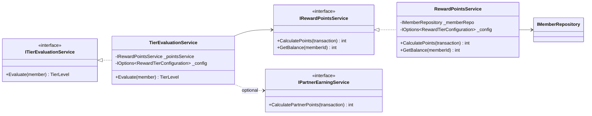
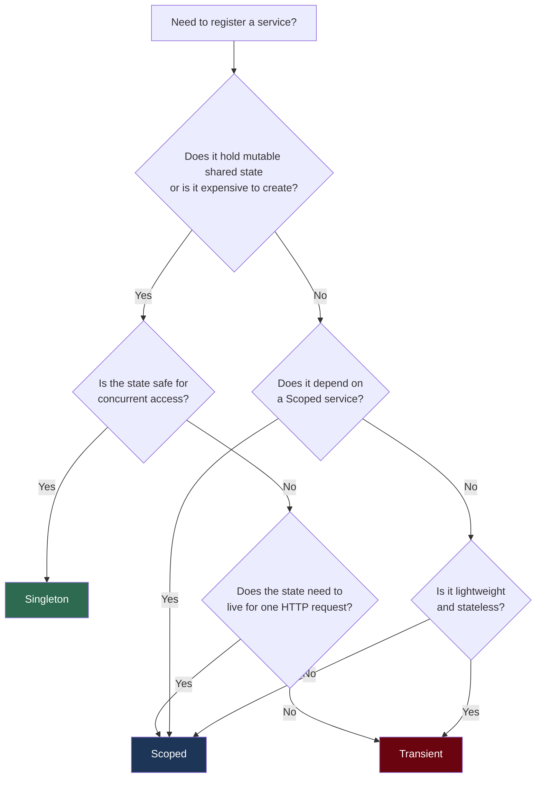
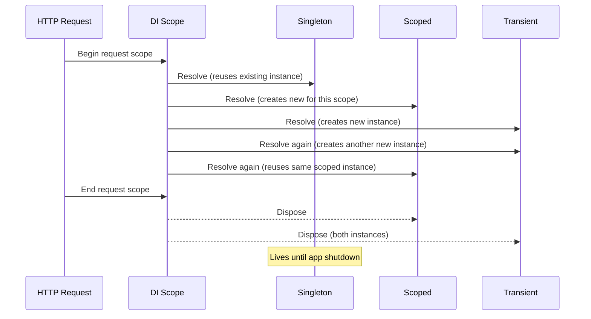
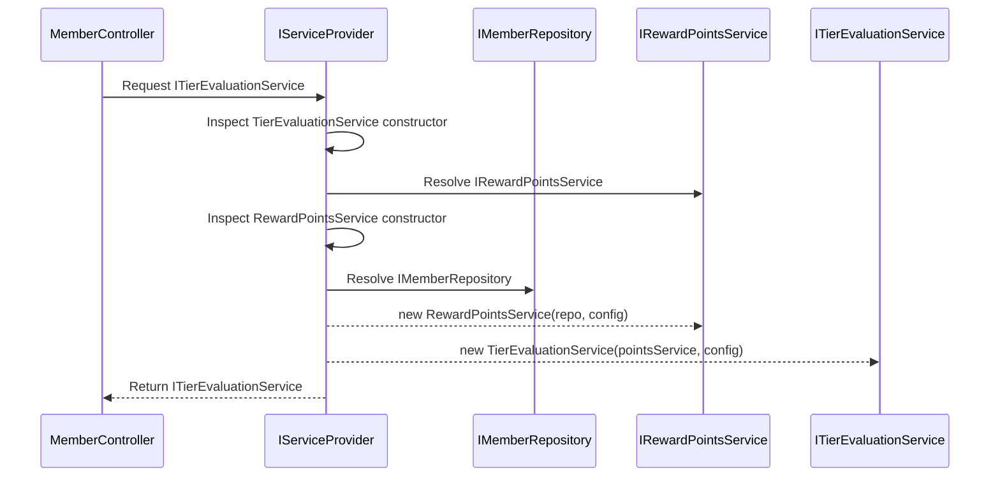
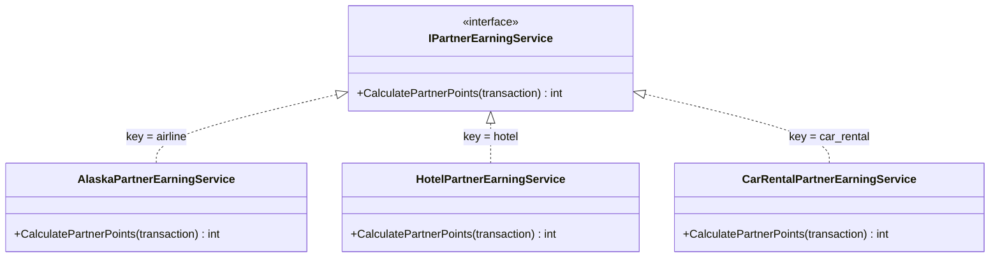
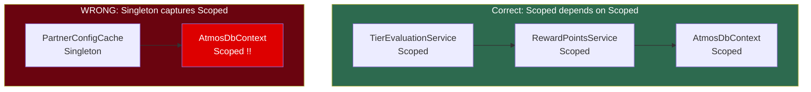

# Dependency Injection in .NET

## Overview

Dependency Injection (DI) is a design technique where an object receives its dependencies from an external source rather than creating them itself. In .NET, the built-in DI container is a first-class citizen baked into the framework's hosting model. Every ASP.NET Core application starts with `WebApplicationBuilder`, which exposes an `IServiceCollection` for registering services and an `IServiceProvider` for resolving them at runtime.

For the Atmos Rewards platform this means services like `RewardPointsService`, `TierEvaluationService`, and `PartnerEarningService` are wired together by the container, making the system easy to test, extend, and maintain.



---

## 1. DI Fundamentals: Inversion of Control

**Inversion of Control (IoC)** means a class does not control how its collaborators are created -- that responsibility is inverted to a container or framework. DI is the most common form of IoC.

Without DI a service creates its own dependencies:

```csharp
// Tightly coupled -- hard to test, hard to swap implementations
public class TierEvaluationService
{
    private readonly RewardPointsService _pointsService;

    public TierEvaluationService()
    {
        // This class decides which concrete type to use
        _pointsService = new RewardPointsService(
            new MemberRepository(new AtmosDbContext()));
    }
}
```

With DI the container provides the dependency:

```csharp
public class TierEvaluationService : ITierEvaluationService
{
    private readonly IRewardPointsService _pointsService;
    private readonly IOptions<RewardTierConfiguration> _config;

    public TierEvaluationService(
        IRewardPointsService pointsService,
        IOptions<RewardTierConfiguration> config)
    {
        _pointsService = pointsService;
        _config = config;
    }

    public TierLevel Evaluate(Member member)
    {
        int points = _pointsService.GetBalance(member.Id);
        var thresholds = _config.Value;

        return points switch
        {
            _ when points >= thresholds.MvpGoldThreshold => TierLevel.MVPGold,
            _ when points >= thresholds.MvpThreshold     => TierLevel.MVP,
            _ when points >= thresholds.GoldThreshold    => TierLevel.Gold,
            _                                            => TierLevel.Standard
        };
    }
}
```

**Why DI matters:**

- **Testability** -- swap real services for mocks or fakes
- **Loose coupling** -- depend on abstractions, not concrete classes
- **Lifetime management** -- the container controls when objects are created and disposed
- **Composition root** -- all wiring happens in one place (`Program.cs`)

---

## 2. Service Lifetimes

The built-in container supports three lifetimes. Choosing the wrong one is the most common source of DI bugs.



| Lifetime | Created | Disposed | Use when |
|----------|---------|----------|----------|
| **Transient** | Every time it is requested | When the scope ends | Lightweight, stateless services |
| **Scoped** | Once per scope (HTTP request) | When the scope ends | Services that hold per-request state (DbContext) |
| **Singleton** | Once for the application lifetime | When the application shuts down | Thread-safe shared state, caches, configuration |



### Practical lifetime examples

```csharp
var builder = WebApplication.CreateBuilder(args);

// Scoped: one DbContext per HTTP request -- EF Core tracks changes per request
builder.Services.AddDbContext<AtmosDbContext>(options =>
    options.UseSqlServer(builder.Configuration.GetConnectionString("AtmosRewards")));

// Scoped: depends on DbContext, so it must also be scoped (or transient)
builder.Services.AddScoped<IMemberRepository, MemberRepository>();

// Scoped: orchestrates per-request business logic
builder.Services.AddScoped<IRewardPointsService, RewardPointsService>();
builder.Services.AddScoped<ITierEvaluationService, TierEvaluationService>();

// Singleton: thread-safe, holds no per-request state
builder.Services.AddSingleton<IPartnerConfigCache, PartnerConfigCache>();

// Transient: lightweight calculator with no state
builder.Services.AddTransient<IPointsCalculator, PointsCalculator>();
```

---

## 3. Constructor Injection

Constructor injection is the preferred approach in .NET. The container inspects the constructor parameters, resolves each one, and passes them in.



Rules the container follows:

1. It looks for the **public constructor** with the most parameters it can satisfy.
2. All parameters must be registered in the container or have default values.
3. If it cannot resolve a parameter, it throws an `InvalidOperationException` at runtime (or at startup if `ValidateOnBuild` is enabled).

```csharp
var builder = WebApplication.CreateBuilder(args);

// Enable build-time validation -- catches missing registrations at startup
builder.Host.UseDefaultServiceProvider(options =>
{
    options.ValidateScopes = true;
    options.ValidateOnBuild = true;
});
```

---

## 4. The IOptions Pattern

The Options pattern binds configuration sections to strongly typed classes. There are three interfaces, each with different refresh behavior.

| Interface | Lifetime | Reloads on change | Use when |
|-----------|----------|-------------------|----------|
| `IOptions<T>` | Singleton | No -- reads once at startup | Config that never changes |
| `IOptionsSnapshot<T>` | Scoped | Yes -- per request | Config that may change between requests |
| `IOptionsMonitor<T>` | Singleton | Yes -- via `OnChange` callback | Singleton services that need live updates |

### Configuration class

```csharp
public class RewardTierConfiguration
{
    public const string SectionName = "RewardTiers";

    public int GoldThreshold { get; set; }        // e.g., 20_000
    public int MvpThreshold { get; set; }          // e.g., 50_000
    public int MvpGoldThreshold { get; set; }      // e.g., 100_000
    public double PartnerBonusMultiplier { get; set; } // e.g., 1.5
}
```

### Registration in Program.cs

```csharp
builder.Services.Configure<RewardTierConfiguration>(
    builder.Configuration.GetSection(RewardTierConfiguration.SectionName));

// Optional: add validation
builder.Services.AddOptions<RewardTierConfiguration>()
    .Bind(builder.Configuration.GetSection(RewardTierConfiguration.SectionName))
    .ValidateDataAnnotations()
    .ValidateOnStart();
```

### Consuming the options

```csharp
// In a SCOPED service -- use IOptionsSnapshot to pick up config changes per request
public class RewardPointsService : IRewardPointsService
{
    private readonly IMemberRepository _memberRepo;
    private readonly RewardTierConfiguration _config;

    public RewardPointsService(
        IMemberRepository memberRepo,
        IOptionsSnapshot<RewardTierConfiguration> config)
    {
        _memberRepo = memberRepo;
        _config = config.Value;
    }

    public int CalculatePoints(RewardTransaction transaction)
    {
        int basePoints = transaction.Miles;
        double multiplier = transaction.IsPartnerFlight
            ? _config.PartnerBonusMultiplier
            : 1.0;
        return (int)(basePoints * multiplier);
    }
}

// In a SINGLETON service -- use IOptionsMonitor to react to changes
public class PartnerConfigCache : IPartnerConfigCache
{
    private RewardTierConfiguration _current;

    public PartnerConfigCache(IOptionsMonitor<RewardTierConfiguration> monitor)
    {
        _current = monitor.CurrentValue;
        monitor.OnChange(updated => _current = updated);
    }

    public double GetPartnerMultiplier() => _current.PartnerBonusMultiplier;
}
```

---

## 5. Registering Services

### Standard registration methods

```csharp
// Explicit interface-to-implementation mapping
builder.Services.AddScoped<IRewardPointsService, RewardPointsService>();

// Factory overload -- useful when construction needs runtime logic
builder.Services.AddScoped<ITierEvaluationService>(sp =>
{
    var pointsService = sp.GetRequiredService<IRewardPointsService>();
    var config = sp.GetRequiredService<IOptions<RewardTierConfiguration>>();
    return new TierEvaluationService(pointsService, config);
});

// Register the concrete type directly (no interface)
builder.Services.AddSingleton<PartnerConfigCache>();
```

### TryAdd variants -- safe for library authors

`TryAdd` only registers a service if no registration already exists for that service type. This prevents libraries from overwriting application registrations.

```csharp
using Microsoft.Extensions.DependencyInjection.Extensions;

// Only registers if IRewardPointsService has no registration yet
builder.Services.TryAddScoped<IRewardPointsService, RewardPointsService>();

// Only registers if no IPartnerEarningService exists
builder.Services.TryAddTransient<IPartnerEarningService, AlaskaPartnerEarningService>();
```

### Multiple implementations of the same interface

When multiple implementations are registered for the same interface, `IEnumerable<T>` resolves all of them, while requesting `T` directly returns the **last registered** implementation.

```csharp
builder.Services.AddTransient<IPartnerEarningService, AlaskaPartnerEarningService>();
builder.Services.AddTransient<IPartnerEarningService, HotelPartnerEarningService>();
builder.Services.AddTransient<IPartnerEarningService, CarRentalPartnerEarningService>();

// In a service that needs all partner calculators:
public class AggregateEarningService
{
    private readonly IEnumerable<IPartnerEarningService> _calculators;

    public AggregateEarningService(IEnumerable<IPartnerEarningService> calculators)
    {
        _calculators = calculators;
    }

    public int CalculateTotalPartnerPoints(RewardTransaction transaction)
    {
        return _calculators.Sum(c => c.CalculatePartnerPoints(transaction));
    }
}
```

---

## 6. Keyed Services (.NET 8)

.NET 8 introduced keyed services for registering multiple implementations of the same interface, distinguished by a key. This replaces the older workaround of injecting `IEnumerable<T>` and filtering.



### Registration

```csharp
builder.Services.AddKeyedTransient<IPartnerEarningService, AlaskaPartnerEarningService>("airline");
builder.Services.AddKeyedTransient<IPartnerEarningService, HotelPartnerEarningService>("hotel");
builder.Services.AddKeyedTransient<IPartnerEarningService, CarRentalPartnerEarningService>("car_rental");
```

### Resolution with `[FromKeyedServices]`

```csharp
public class RewardTransactionController : ControllerBase
{
    private readonly IPartnerEarningService _airlineCalc;
    private readonly IPartnerEarningService _hotelCalc;

    public RewardTransactionController(
        [FromKeyedServices("airline")] IPartnerEarningService airlineCalc,
        [FromKeyedServices("hotel")] IPartnerEarningService hotelCalc)
    {
        _airlineCalc = airlineCalc;
        _hotelCalc = hotelCalc;
    }

    [HttpPost("calculate")]
    public IActionResult Calculate(RewardTransaction transaction)
    {
        int points = transaction.PartnerType switch
        {
            "airline" => _airlineCalc.CalculatePartnerPoints(transaction),
            "hotel"   => _hotelCalc.CalculatePartnerPoints(transaction),
            _         => 0
        };

        return Ok(new { Points = points });
    }
}

// Or resolve dynamically via IServiceProvider
public class DynamicPartnerResolver
{
    private readonly IServiceProvider _provider;

    public DynamicPartnerResolver(IServiceProvider provider)
    {
        _provider = provider;
    }

    public int Resolve(RewardTransaction transaction)
    {
        var service = _provider.GetKeyedService<IPartnerEarningService>(transaction.PartnerType);
        return service?.CalculatePartnerPoints(transaction) ?? 0;
    }
}
```

---

## 7. Common Pitfalls

### Captive dependency (singleton capturing scoped)

A **captive dependency** occurs when a longer-lived service holds a reference to a shorter-lived one. The shorter-lived service is "captured" and effectively becomes a singleton, which can cause stale data, concurrency bugs, and disposed-object exceptions.



```csharp
// BAD: Singleton captures a scoped DbContext.
// The DbContext is created once and reused for the entire app lifetime.
// It will use stale data and eventually throw ObjectDisposedException.
public class BadTierCache
{
    private readonly AtmosDbContext _db; // Scoped! Will be disposed after first request.

    public BadTierCache(AtmosDbContext db)
    {
        _db = db;
    }

    public TierLevel GetTier(int memberId)
    {
        // On the second request this will throw because _db is disposed
        var member = _db.Members.Find(memberId);
        return member?.Tier ?? TierLevel.Standard;
    }
}

// GOOD: Inject IServiceScopeFactory to create a fresh scope when needed.
public class GoodTierCache
{
    private readonly IServiceScopeFactory _scopeFactory;

    public GoodTierCache(IServiceScopeFactory scopeFactory)
    {
        _scopeFactory = scopeFactory;
    }

    public TierLevel GetTier(int memberId)
    {
        using var scope = _scopeFactory.CreateScope();
        var db = scope.ServiceProvider.GetRequiredService<AtmosDbContext>();
        var member = db.Members.Find(memberId);
        return member?.Tier ?? TierLevel.Standard;
    }
}
```

Enable `ValidateScopes` to catch this at startup in Development:

```csharp
builder.Host.UseDefaultServiceProvider(options =>
{
    options.ValidateScopes = true;  // Throws if scoped service is resolved from root
    options.ValidateOnBuild = true; // Validates all registrations at startup
});
```

### Service locator anti-pattern

Injecting `IServiceProvider` and calling `GetService<T>()` throughout your code is the **service locator anti-pattern**. It hides dependencies, makes testing harder, and defeats the purpose of DI.

```csharp
// BAD: Service locator -- dependencies are hidden
public class BadRewardPointsService
{
    private readonly IServiceProvider _provider;

    public BadRewardPointsService(IServiceProvider provider)
    {
        _provider = provider;
    }

    public int CalculatePoints(RewardTransaction transaction)
    {
        // Caller has no idea this class needs IMemberRepository
        var repo = _provider.GetRequiredService<IMemberRepository>();
        var member = repo.GetById(transaction.MemberId);
        return member is not null ? transaction.Miles : 0;
    }
}

// GOOD: Constructor injection -- dependencies are explicit
public class GoodRewardPointsService : IRewardPointsService
{
    private readonly IMemberRepository _memberRepo;

    public GoodRewardPointsService(IMemberRepository memberRepo)
    {
        _memberRepo = memberRepo;
    }

    public int CalculatePoints(RewardTransaction transaction)
    {
        var member = _memberRepo.GetById(transaction.MemberId);
        return member is not null ? transaction.Miles : 0;
    }
}
```

The only acceptable uses of `IServiceProvider` are:
- Inside factory registrations (the `sp =>` lambda)
- Inside middleware that needs to resolve scoped services
- In singleton services that use `IServiceScopeFactory` (as shown above)
- In keyed service dynamic resolution when the key is only known at runtime

---

## 8. Third-Party DI Containers

The built-in container is intentionally simple. It covers most scenarios but lacks advanced features. Consider a third-party container like **Autofac** when you need:

| Feature | Built-in | Autofac |
|---------|----------|---------|
| Constructor injection | Yes | Yes |
| Keyed services | Yes (.NET 8+) | Yes |
| Property injection | No | Yes |
| Assembly scanning | No | Yes |
| Decorator pattern | No | Yes |
| Interceptors (AOP) | No | Yes |
| Child/nested scopes with overrides | Limited | Yes |

### When Autofac shines: decorator pattern

```csharp
// Autofac makes it easy to wrap a service with a decorator
builder.Host.UseServiceProviderFactory(new AutofacServiceProviderFactory());

builder.Host.ConfigureContainer<ContainerBuilder>(container =>
{
    container.RegisterType<RewardPointsService>()
        .As<IRewardPointsService>();

    // Automatically wraps RewardPointsService with the logging decorator
    container.RegisterDecorator<LoggingRewardPointsDecorator, IRewardPointsService>();
});

public class LoggingRewardPointsDecorator : IRewardPointsService
{
    private readonly IRewardPointsService _inner;
    private readonly ILogger<LoggingRewardPointsDecorator> _logger;

    public LoggingRewardPointsDecorator(
        IRewardPointsService inner,
        ILogger<LoggingRewardPointsDecorator> logger)
    {
        _inner = inner;
        _logger = logger;
    }

    public int CalculatePoints(RewardTransaction transaction)
    {
        _logger.LogInformation("Calculating points for member {MemberId}", transaction.MemberId);
        var result = _inner.CalculatePoints(transaction);
        _logger.LogInformation("Calculated {Points} points", result);
        return result;
    }

    public int GetBalance(int memberId)
    {
        return _inner.GetBalance(memberId);
    }
}
```

**General guidance:** Start with the built-in container. Only add Autofac or a similar library when you have a concrete need that the built-in container cannot satisfy cleanly.

---

## Interview Questions

### Fundamentals

1. **What is Dependency Injection and how does it relate to Inversion of Control?**
   DI is a specific technique for achieving IoC. Instead of a class creating its own dependencies, they are provided (injected) by an external container. IoC is the broader principle that a class should not control how its collaborators are created.

2. **What are the three service lifetimes in .NET DI? When would you use each?**
   Transient (new instance every request), Scoped (one per HTTP request/scope), Singleton (one for the app). Use Transient for lightweight stateless services, Scoped for per-request state like DbContext, Singleton for thread-safe shared resources like caches.

3. **Why is constructor injection preferred over property injection or method injection?**
   Constructor injection makes dependencies explicit and mandatory. The class cannot be instantiated without all its dependencies. Property injection allows partially constructed objects and hides optional dependencies.

### Service Lifetimes and Pitfalls

4. **What is a captive dependency? How do you prevent it?**
   A captive dependency occurs when a longer-lived service (Singleton) captures a shorter-lived one (Scoped). The scoped service lives far longer than intended. Prevent it by enabling `ValidateScopes`, by matching lifetimes correctly, or by injecting `IServiceScopeFactory` in singletons that need scoped services.

5. **What happens if you register `DbContext` as Singleton instead of Scoped?**
   EF Core's `DbContext` is not thread-safe. A singleton `DbContext` would be shared across all concurrent requests, leading to race conditions, stale tracked entities, and exceptions. It must be Scoped so each request gets its own instance.

6. **What is the service locator anti-pattern and why should you avoid it?**
   It is the practice of injecting `IServiceProvider` and resolving dependencies manually throughout the codebase. It hides dependencies, makes testing harder, and defeats static analysis of dependency graphs.

### Options Pattern

7. **What is the difference between `IOptions<T>`, `IOptionsSnapshot<T>`, and `IOptionsMonitor<T>`?**
   `IOptions<T>` is a singleton that reads configuration once. `IOptionsSnapshot<T>` is scoped and re-reads configuration per request. `IOptionsMonitor<T>` is a singleton that provides a callback (`OnChange`) for live configuration updates. Use `IOptions<T>` for static config, `IOptionsSnapshot<T>` in scoped services, and `IOptionsMonitor<T>` in singleton services that need live updates.

8. **How would you validate configuration at startup?**
   Use `ValidateDataAnnotations()` and `ValidateOnStart()` in the options builder chain. This ensures the application fails fast at startup if configuration is invalid rather than at runtime when the config is first accessed.

### Advanced

9. **How do keyed services in .NET 8 improve on the pattern of injecting `IEnumerable<T>`?**
   Keyed services let you register and resolve a specific implementation by a string or enum key, so a consumer can ask for exactly the one it needs via `[FromKeyedServices("key")]`. With `IEnumerable<T>`, the consumer receives all implementations and must filter, which is less explicit and less efficient.

10. **When would you consider using Autofac instead of the built-in container?**
    When you need features like assembly scanning, decorator registration, property injection, or AOP interceptors. The built-in container is intentionally minimal, so if your architecture requires advanced wiring (such as decorating every service that implements a marker interface with a logging wrapper), Autofac or a similar library is a better fit.
