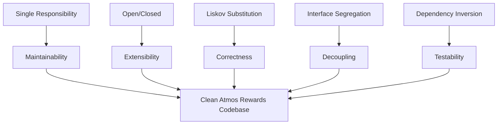
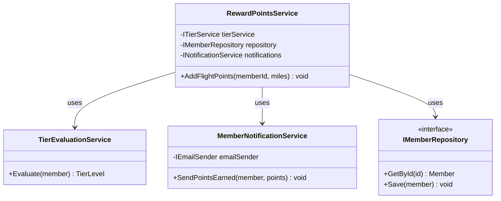
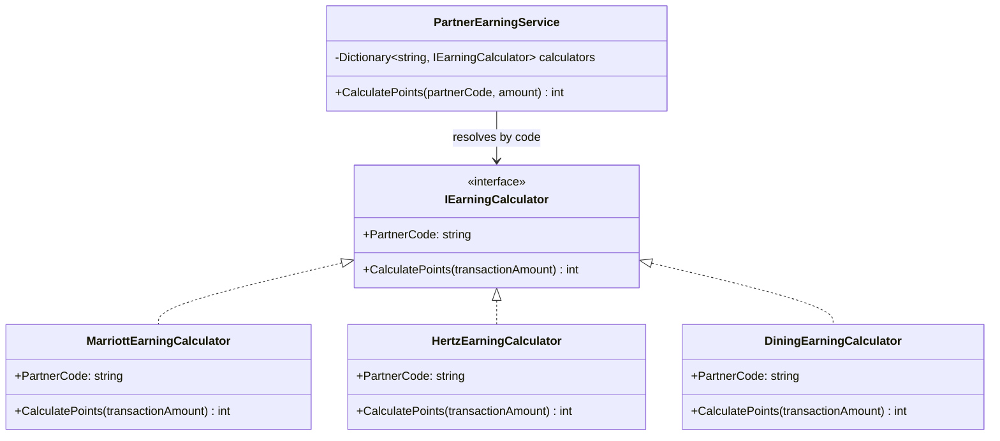
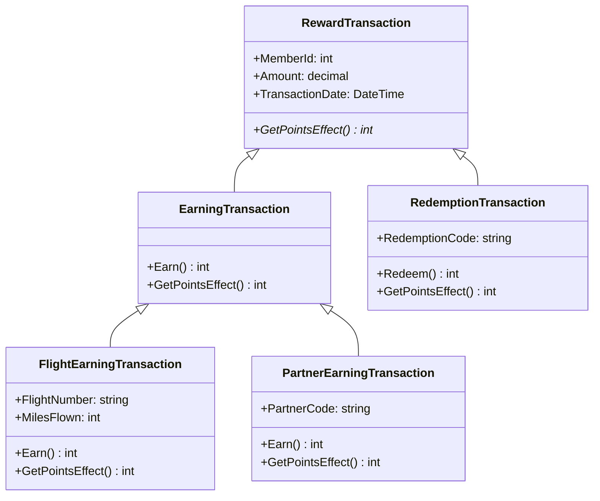
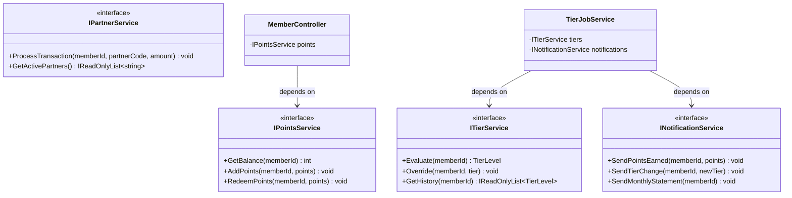
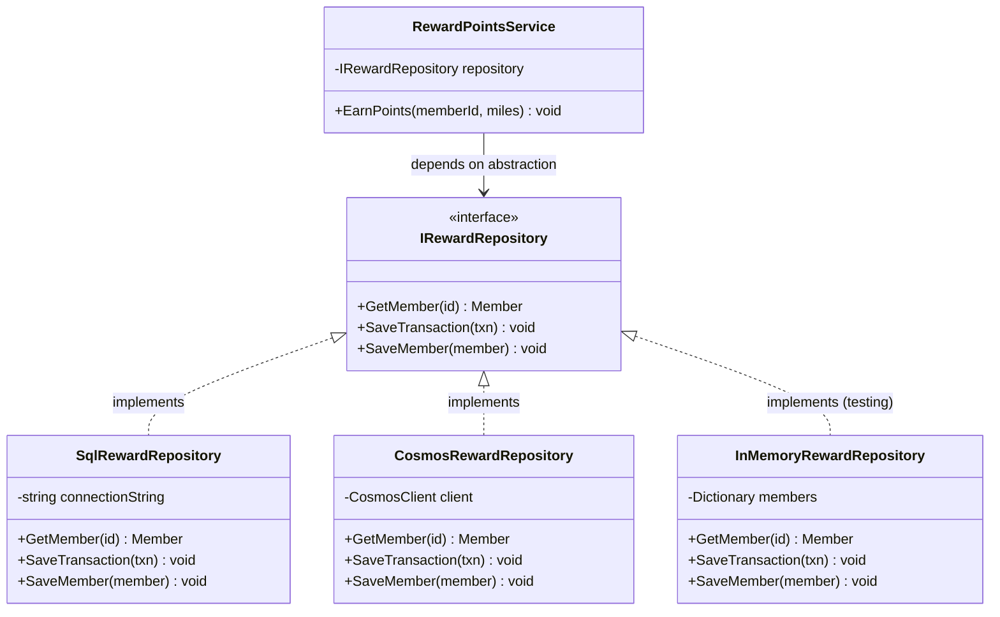
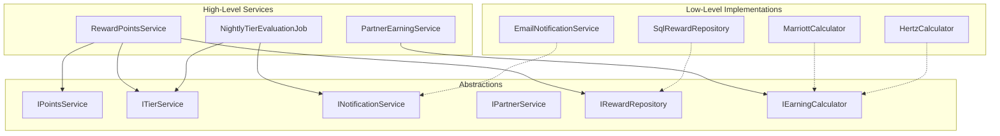

# SOLID Principles

## Overview

SOLID is a set of five design principles that guide object-oriented software toward code that is easier to understand, maintain, and extend. Each principle addresses a specific aspect of class and module design. In the context of the Atmos Rewards system, these principles shape how we structure services like points calculation, tier evaluation, and partner integrations so that changes in one area do not ripple across the entire codebase.

| Principle | Focus |
|-----------|-------|
| **S** - Single Responsibility | A class should have one reason to change |
| **O** - Open/Closed | Open for extension, closed for modification |
| **L** - Liskov Substitution | Subtypes must be substitutable for their base types |
| **I** - Interface Segregation | Clients should not depend on methods they do not use |
| **D** - Dependency Inversion | Depend on abstractions, not concretions |



---

## 1. Single Responsibility Principle (SRP)

> A class should have only one reason to change.

When a class handles multiple concerns, a change to one concern risks breaking the others. In a loyalty system this is especially dangerous because points calculations, tier rules, and notification logic each evolve on different schedules driven by different stakeholders.

### Before -- SRP Violation

The `MemberService` handles points accrual, tier evaluation, AND email notifications all in one class. A change to the email template could accidentally affect points logic.

```csharp
// BAD: Three reasons to change in one class
public class MemberService
{
    private readonly SqlConnection _connection;

    public MemberService(string connectionString)
    {
        _connection = new SqlConnection(connectionString);
    }

    public void AddFlightPoints(int memberId, int miles)
    {
        // Responsibility 1: Points calculation
        var member = GetMember(memberId);
        var multiplier = member.Tier switch
        {
            TierLevel.Gold => 1.5m,
            TierLevel.MVP => 2.0m,
            TierLevel.MVPGold => 3.0m,
            _ => 1.0m
        };
        var points = (int)(miles * multiplier);
        member.PointsBalance += points;

        // Responsibility 2: Tier evaluation
        if (member.PointsBalance >= 75000)
            member.Tier = TierLevel.MVPGold;
        else if (member.PointsBalance >= 50000)
            member.Tier = TierLevel.MVP;
        else if (member.PointsBalance >= 25000)
            member.Tier = TierLevel.Gold;

        SaveMember(member);

        // Responsibility 3: Notification
        var smtp = new SmtpClient("mail.alaskaair.com");
        var message = new MailMessage(
            "rewards@alaskaair.com",
            member.Email,
            "Points Earned!",
            $"You earned {points} points. Balance: {member.PointsBalance}");
        smtp.Send(message);
    }

    private Member GetMember(int id) { /* SQL query */ }
    private void SaveMember(Member member) { /* SQL update */ }
}
```

### After -- SRP Applied

Each concern lives in its own service with a single reason to change.



```csharp
// GOOD: Each class has a single responsibility

public class RewardPointsService
{
    private readonly IMemberRepository _repository;
    private readonly ITierService _tierService;
    private readonly INotificationService _notifications;

    public RewardPointsService(
        IMemberRepository repository,
        ITierService tierService,
        INotificationService notifications)
    {
        _repository = repository;
        _tierService = tierService;
        _notifications = notifications;
    }

    public void AddFlightPoints(int memberId, int miles)
    {
        var member = _repository.GetById(memberId);

        var multiplier = _tierService.GetEarningMultiplier(member.Tier);
        var points = (int)(miles * multiplier);
        member.PointsBalance += points;

        member.Tier = _tierService.Evaluate(member);

        _repository.Save(member);
        _notifications.SendPointsEarned(member, points);
    }
}

public class TierEvaluationService : ITierService
{
    public TierLevel Evaluate(Member member)
    {
        return member.PointsBalance switch
        {
            >= 75000 => TierLevel.MVPGold,
            >= 50000 => TierLevel.MVP,
            >= 25000 => TierLevel.Gold,
            _ => TierLevel.Base
        };
    }

    public decimal GetEarningMultiplier(TierLevel tier)
    {
        return tier switch
        {
            TierLevel.Gold => 1.5m,
            TierLevel.MVP => 2.0m,
            TierLevel.MVPGold => 3.0m,
            _ => 1.0m
        };
    }
}

public class MemberNotificationService : INotificationService
{
    private readonly IEmailSender _emailSender;

    public MemberNotificationService(IEmailSender emailSender)
    {
        _emailSender = emailSender;
    }

    public void SendPointsEarned(Member member, int points)
    {
        _emailSender.Send(
            to: member.Email,
            subject: "Points Earned!",
            body: $"You earned {points} points. Balance: {member.PointsBalance}");
    }
}
```

**Key takeaway:** The `RewardPointsService` now orchestrates but delegates. If the notification channel changes from email to push, only `MemberNotificationService` changes. If tier thresholds change, only `TierEvaluationService` changes.

---

## 2. Open/Closed Principle (OCP)

> Software entities should be open for extension but closed for modification.

When a new partner joins the Atmos Rewards program, we should be able to add its earning logic without modifying existing, tested code. The classic sign of an OCP violation is a growing `switch` or `if-else` chain that must be edited every time a new variant is introduced.

### Before -- OCP Violation

Every new partner requires editing the `PartnerEarningService` class, touching code that already works for existing partners.

```csharp
// BAD: Must modify this class for every new partner
public class PartnerEarningService
{
    public int CalculatePoints(string partnerCode, decimal transactionAmount)
    {
        switch (partnerCode)
        {
            case "HOTEL_MARRIOTT":
                return (int)(transactionAmount * 2);
            case "CAR_HERTZ":
                return (int)(transactionAmount * 1.5m);
            case "DINING_PROGRAM":
                return (int)(transactionAmount * 3);
            // Every new partner means editing this file
            // and risking a bug in existing partner logic
            default:
                throw new ArgumentException($"Unknown partner: {partnerCode}");
        }
    }
}
```

### After -- OCP Applied (Strategy Pattern)

New partners are added by implementing a new class, not by modifying existing ones.



```csharp
// GOOD: Closed for modification, open for extension

public interface IEarningCalculator
{
    string PartnerCode { get; }
    int CalculatePoints(decimal transactionAmount);
}

public class MarriottEarningCalculator : IEarningCalculator
{
    public string PartnerCode => "HOTEL_MARRIOTT";
    public int CalculatePoints(decimal transactionAmount)
        => (int)(transactionAmount * 2);
}

public class HertzEarningCalculator : IEarningCalculator
{
    public string PartnerCode => "CAR_HERTZ";
    public int CalculatePoints(decimal transactionAmount)
        => (int)(transactionAmount * 1.5m);
}

public class DiningEarningCalculator : IEarningCalculator
{
    public string PartnerCode => "DINING_PROGRAM";
    public int CalculatePoints(decimal transactionAmount)
        => (int)(transactionAmount * 3);
}

// This class never changes when a new partner is added
public class PartnerEarningService
{
    private readonly Dictionary<string, IEarningCalculator> _calculators;

    public PartnerEarningService(IEnumerable<IEarningCalculator> calculators)
    {
        _calculators = calculators.ToDictionary(c => c.PartnerCode);
    }

    public int CalculatePoints(string partnerCode, decimal transactionAmount)
    {
        if (!_calculators.TryGetValue(partnerCode, out var calculator))
            throw new ArgumentException($"No calculator registered for partner: {partnerCode}");

        return calculator.CalculatePoints(transactionAmount);
    }
}
```

DI registration -- adding a new partner is just one line:

```csharp
// In Program.cs or Startup.cs
services.AddSingleton<IEarningCalculator, MarriottEarningCalculator>();
services.AddSingleton<IEarningCalculator, HertzEarningCalculator>();
services.AddSingleton<IEarningCalculator, DiningEarningCalculator>();
// New partner? Just add one more line:
// services.AddSingleton<IEarningCalculator, AvisEarningCalculator>();

services.AddSingleton<PartnerEarningService>();
```

**Key takeaway:** `PartnerEarningService` is closed -- its source file never needs to change. New partners extend the system by adding a new `IEarningCalculator` implementation and registering it in DI.

---

## 3. Liskov Substitution Principle (LSP)

> Subtypes must be substitutable for their base types without altering program correctness.

If code accepts a base type, any derived type passed in must honor the base type's contract (preconditions, postconditions, invariants). In a rewards system, different transaction types (flight earning, partner earning, redemption) are natural candidates for inheritance, but a poorly designed subclass can break callers.

### Before -- LSP Violation

`RedemptionTransaction` inherits from `RewardTransaction` but breaks the contract by making `Earn()` throw an exception. Any code iterating over a list of `RewardTransaction` objects and calling `Earn()` will blow up when it encounters a redemption.

```csharp
// BAD: RedemptionTransaction violates the base class contract

public class RewardTransaction
{
    public int MemberId { get; set; }
    public decimal Amount { get; set; }
    public DateTime TransactionDate { get; set; }

    public virtual int Earn()
    {
        // Base: 1 point per dollar
        return (int)Amount;
    }
}

public class FlightTransaction : RewardTransaction
{
    public string FlightNumber { get; set; }
    public int MilesFlown { get; set; }

    public override int Earn()
    {
        // Flight transactions earn based on miles
        return MilesFlown;
    }
}

public class RedemptionTransaction : RewardTransaction
{
    public string RedemptionCode { get; set; }

    public override int Earn()
    {
        // LSP VIOLATION: callers expect Earn() to return points,
        // but redemptions don't earn -- they spend.
        throw new InvalidOperationException(
            "Redemption transactions do not earn points.");
    }
}

// This code breaks at runtime
public class BatchPointsProcessor
{
    public int ProcessAll(IEnumerable<RewardTransaction> transactions)
    {
        int total = 0;
        foreach (var txn in transactions)
        {
            // Explodes on RedemptionTransaction
            total += txn.Earn();
        }
        return total;
    }
}
```

### After -- LSP Applied

The type hierarchy is redesigned so that each transaction type only promises what it can deliver. Earning and redemption are separate concerns.



```csharp
// GOOD: Every subtype honors the base contract

public abstract class RewardTransaction
{
    public int MemberId { get; set; }
    public decimal Amount { get; set; }
    public DateTime TransactionDate { get; set; }

    /// Returns the net effect on the member's points balance.
    /// Positive for earnings, negative for redemptions.
    public abstract int GetPointsEffect();
}

public class EarningTransaction : RewardTransaction
{
    public virtual int Earn() => (int)Amount;

    public override int GetPointsEffect() => Earn();
}

public class FlightEarningTransaction : EarningTransaction
{
    public string FlightNumber { get; set; } = string.Empty;
    public int MilesFlown { get; set; }

    public override int Earn() => MilesFlown;
}

public class PartnerEarningTransaction : EarningTransaction
{
    public string PartnerCode { get; set; } = string.Empty;
    public decimal Multiplier { get; set; } = 1.0m;

    public override int Earn() => (int)(Amount * Multiplier);
}

public class RedemptionTransaction : RewardTransaction
{
    public string RedemptionCode { get; set; } = string.Empty;

    public int Redeem() => (int)Amount;

    public override int GetPointsEffect() => -Redeem(); // negative = deduction
}

// This now works safely with ANY RewardTransaction subtype
public class BatchPointsProcessor
{
    public int ProcessAll(IEnumerable<RewardTransaction> transactions)
    {
        int netEffect = 0;
        foreach (var txn in transactions)
        {
            // Every subtype returns a meaningful value -- no exceptions
            netEffect += txn.GetPointsEffect();
        }
        return netEffect;
    }
}
```

**Key takeaway:** The base class contract (`GetPointsEffect`) is something every transaction type can fulfill. Earnings return positive values, redemptions return negative values. No subtype throws or silently misbehaves.

---

## 4. Interface Segregation Principle (ISP)

> Clients should not be forced to depend on interfaces they do not use.

A fat interface forces every implementer to handle methods it does not care about. It also couples consumers to capabilities they never call, making the system harder to test and reason about.

### Before -- ISP Violation

One monolithic `IMemberService` interface forces every consumer and every implementer to deal with all concerns at once.

```csharp
// BAD: Fat interface -- most consumers only need a subset

public interface IMemberService
{
    // Points operations
    Member GetMember(int memberId);
    void AddPoints(int memberId, int points);
    void RedeemPoints(int memberId, int points);
    int GetPointsBalance(int memberId);

    // Tier operations
    TierLevel EvaluateTier(int memberId);
    void OverrideTier(int memberId, TierLevel tier);
    IReadOnlyList<TierLevel> GetTierHistory(int memberId);

    // Notification operations
    void SendPointsEarnedEmail(int memberId, int points);
    void SendTierChangeEmail(int memberId, TierLevel newTier);
    void SendMonthlyStatement(int memberId);

    // Partner operations
    void ProcessPartnerTransaction(int memberId, string partnerCode, decimal amount);
    IReadOnlyList<string> GetActivePartners();
}
```

A controller that only needs to display a member's points balance is forced to depend on notification and partner methods it never calls. Mocking this interface in tests is painful -- twelve methods to stub for a test that exercises one.

### After -- ISP Applied

The fat interface is split into focused, role-specific interfaces.



```csharp
// GOOD: Focused interfaces -- each consumer depends only on what it uses

public interface IPointsService
{
    int GetBalance(int memberId);
    void AddPoints(int memberId, int points);
    void RedeemPoints(int memberId, int points);
}

public interface ITierService
{
    TierLevel Evaluate(int memberId);
    void Override(int memberId, TierLevel tier);
    IReadOnlyList<TierLevel> GetHistory(int memberId);
}

public interface INotificationService
{
    void SendPointsEarned(int memberId, int points);
    void SendTierChange(int memberId, TierLevel newTier);
    void SendMonthlyStatement(int memberId);
}

public interface IPartnerService
{
    void ProcessTransaction(int memberId, string partnerCode, decimal amount);
    IReadOnlyList<string> GetActivePartners();
}
```

Consumers now declare only the dependencies they actually need:

```csharp
// Controller only needs points -- easy to test, clear contract
[ApiController]
[Route("api/members/{memberId}/points")]
public class MemberPointsController : ControllerBase
{
    private readonly IPointsService _pointsService;

    public MemberPointsController(IPointsService pointsService)
    {
        _pointsService = pointsService;
    }

    [HttpGet("balance")]
    public IActionResult GetBalance(int memberId)
    {
        var balance = _pointsService.GetBalance(memberId);
        return Ok(new { MemberId = memberId, Balance = balance });
    }
}

// Background job needs tiers and notifications -- nothing else
public class NightlyTierEvaluationJob
{
    private readonly ITierService _tierService;
    private readonly INotificationService _notifications;
    private readonly IMemberRepository _repository;

    public NightlyTierEvaluationJob(
        ITierService tierService,
        INotificationService notifications,
        IMemberRepository repository)
    {
        _tierService = tierService;
        _notifications = notifications;
        _repository = repository;
    }

    public void Run()
    {
        var members = _repository.GetAllActive();
        foreach (var member in members)
        {
            var newTier = _tierService.Evaluate(member.Id);
            if (newTier != member.Tier)
            {
                _tierService.Override(member.Id, newTier);
                _notifications.SendTierChange(member.Id, newTier);
            }
        }
    }
}
```

A single concrete class can still implement multiple interfaces if the implementation is shared:

```csharp
// One class can implement multiple focused interfaces
public class MemberDomainService : IPointsService, ITierService
{
    private readonly IMemberRepository _repository;

    public MemberDomainService(IMemberRepository repository)
    {
        _repository = repository;
    }

    // IPointsService
    public int GetBalance(int memberId)
        => _repository.GetById(memberId).PointsBalance;

    public void AddPoints(int memberId, int points)
    {
        var member = _repository.GetById(memberId);
        member.PointsBalance += points;
        _repository.Save(member);
    }

    public void RedeemPoints(int memberId, int points)
    {
        var member = _repository.GetById(memberId);
        if (member.PointsBalance < points)
            throw new InvalidOperationException("Insufficient points balance.");
        member.PointsBalance -= points;
        _repository.Save(member);
    }

    // ITierService
    public TierLevel Evaluate(int memberId)
    {
        var member = _repository.GetById(memberId);
        return member.PointsBalance switch
        {
            >= 75000 => TierLevel.MVPGold,
            >= 50000 => TierLevel.MVP,
            >= 25000 => TierLevel.Gold,
            _ => TierLevel.Base
        };
    }

    public void Override(int memberId, TierLevel tier)
    {
        var member = _repository.GetById(memberId);
        member.Tier = tier;
        _repository.Save(member);
    }

    public IReadOnlyList<TierLevel> GetHistory(int memberId)
        => _repository.GetTierHistory(memberId);
}
```

**Key takeaway:** Splitting the interface costs almost nothing but gives every consumer a minimal, testable surface. One concrete class can still implement multiple small interfaces.

---

## 5. Dependency Inversion Principle (DIP)

> High-level modules should not depend on low-level modules. Both should depend on abstractions.

When a high-level service directly instantiates a low-level dependency (like a SQL repository), you cannot test the service in isolation, swap implementations, or change infrastructure without modifying business logic.

### Before -- DIP Violation

`RewardPointsService` directly creates `SqlRewardRepository`. The business logic is welded to SQL Server.

```csharp
// BAD: High-level module depends directly on low-level implementation

public class SqlRewardRepository
{
    private readonly string _connectionString;

    public SqlRewardRepository()
    {
        _connectionString = "Server=prod-sql;Database=AtmosRewards;...";
    }

    public Member GetMember(int id) { /* ADO.NET query */ return new Member(); }
    public void SaveTransaction(RewardTransaction txn) { /* ADO.NET insert */ }
}

public class RewardPointsService
{
    // Direct dependency on concrete class -- cannot test, cannot swap
    private readonly SqlRewardRepository _repository = new SqlRewardRepository();

    public void EarnPoints(int memberId, int miles)
    {
        var member = _repository.GetMember(memberId);

        var points = miles * GetMultiplier(member.Tier);
        var transaction = new RewardTransaction
        {
            MemberId = memberId,
            Amount = points,
            TransactionDate = DateTime.UtcNow
        };

        member.PointsBalance += points;
        _repository.SaveTransaction(transaction);
    }

    private int GetMultiplier(TierLevel tier) => tier switch
    {
        TierLevel.MVPGold => 3,
        TierLevel.MVP => 2,
        TierLevel.Gold => 1,
        _ => 1
    };
}
```

Problems: unit tests hit a real database, switching to CosmosDB means rewriting the service, and the connection string is hardcoded.

### After -- DIP Applied

Both the high-level service and the low-level repository depend on an abstraction (`IRewardRepository`). The concrete implementation is injected at runtime.



```csharp
// GOOD: Both layers depend on the abstraction

public interface IRewardRepository
{
    Member GetMember(int id);
    void SaveTransaction(RewardTransaction transaction);
    void SaveMember(Member member);
}

public class RewardPointsService
{
    private readonly IRewardRepository _repository;

    // Dependency is injected -- service has no knowledge of SQL, Cosmos, etc.
    public RewardPointsService(IRewardRepository repository)
    {
        _repository = repository;
    }

    public void EarnPoints(int memberId, int miles)
    {
        var member = _repository.GetMember(memberId);

        var points = miles * GetMultiplier(member.Tier);
        var transaction = new RewardTransaction
        {
            MemberId = memberId,
            Amount = points,
            TransactionDate = DateTime.UtcNow
        };

        member.PointsBalance += points;
        _repository.SaveMember(member);
        _repository.SaveTransaction(transaction);
    }

    private int GetMultiplier(TierLevel tier) => tier switch
    {
        TierLevel.MVPGold => 3,
        TierLevel.MVP => 2,
        TierLevel.Gold => 1,
        _ => 1
    };
}

// Low-level module also depends on the abstraction
public class SqlRewardRepository : IRewardRepository
{
    private readonly string _connectionString;

    public SqlRewardRepository(IOptions<DatabaseOptions> options)
    {
        _connectionString = options.Value.ConnectionString;
    }

    public Member GetMember(int id)
    {
        using var connection = new SqlConnection(_connectionString);
        // Dapper, EF Core, or raw ADO.NET -- implementation detail
        return connection.QuerySingle<Member>(
            "SELECT * FROM Members WHERE Id = @Id", new { Id = id });
    }

    public void SaveTransaction(RewardTransaction transaction)
    {
        using var connection = new SqlConnection(_connectionString);
        connection.Execute(
            "INSERT INTO RewardTransactions (MemberId, Amount, TransactionDate) " +
            "VALUES (@MemberId, @Amount, @TransactionDate)", transaction);
    }

    public void SaveMember(Member member)
    {
        using var connection = new SqlConnection(_connectionString);
        connection.Execute(
            "UPDATE Members SET PointsBalance = @PointsBalance, Tier = @Tier " +
            "WHERE Id = @Id", member);
    }
}
```

Now unit tests use a simple in-memory implementation with zero infrastructure:

```csharp
// Test double -- no database required
public class InMemoryRewardRepository : IRewardRepository
{
    private readonly Dictionary<int, Member> _members = new();
    public List<RewardTransaction> SavedTransactions { get; } = new();

    public void SeedMember(Member member) => _members[member.Id] = member;

    public Member GetMember(int id) => _members[id];

    public void SaveTransaction(RewardTransaction transaction)
        => SavedTransactions.Add(transaction);

    public void SaveMember(Member member)
        => _members[member.Id] = member;
}

// Clean, isolated unit test
[Fact]
public void EarnPoints_MVPGold_TriplesMiles()
{
    // Arrange
    var repo = new InMemoryRewardRepository();
    repo.SeedMember(new Member { Id = 1, Tier = TierLevel.MVPGold, PointsBalance = 0 });
    var service = new RewardPointsService(repo);

    // Act
    service.EarnPoints(memberId: 1, miles: 1000);

    // Assert
    var member = repo.GetMember(1);
    Assert.Equal(3000, member.PointsBalance);
    Assert.Single(repo.SavedTransactions);
}
```

**Key takeaway:** The business rule ("MVP Gold members earn 3x miles") is fully testable without any database. Swapping from SQL Server to CosmosDB is a DI registration change, not a rewrite of business logic.

---

## Putting It All Together

When all five principles are applied, the Atmos Rewards domain looks like this:



| Principle | How It Manifests |
|-----------|-----------------|
| **SRP** | `RewardPointsService` orchestrates; tier logic, notifications, and persistence each live in their own class |
| **OCP** | New partners added via new `IEarningCalculator` implementations, no switch edits |
| **LSP** | All `RewardTransaction` subtypes honor `GetPointsEffect()` -- no surprising exceptions |
| **ISP** | Controllers depend on `IPointsService`, background jobs depend on `ITierService` -- nothing more |
| **DIP** | Every service depends on interfaces, never on concrete infrastructure |

---

## Interview Questions

### Conceptual Questions

1. **Explain SRP in your own words. How do you decide what counts as "one reason to change"?**
   Think about who requests the change. If the business team wants to change tier thresholds, and the ops team wants to change the email provider, those are two different reasons to change -- so they belong in separate classes.

2. **How does OCP relate to the Strategy pattern?**
   The Strategy pattern is one of the primary mechanisms for achieving OCP. The context class (e.g., `PartnerEarningService`) is closed for modification because new behavior is added by implementing a new strategy (e.g., a new `IEarningCalculator`) rather than by editing existing code.

3. **Give a real-world example of an LSP violation.**
   A classic example: `Square` inheriting from `Rectangle`. Setting the width of a `Rectangle` should not affect its height, but a `Square` must keep them equal. Code that relies on independent width/height breaks. In our domain, a `RedemptionTransaction` that throws on `Earn()` violates LSP because callers of the base type expect `Earn()` to succeed.

4. **What is the difference between ISP and SRP?**
   SRP is about the implementation -- a class should have one reason to change. ISP is about the interface exposed to consumers -- a client should not be forced to depend on methods it does not use. A single class can implement multiple small interfaces (ISP) and still have a single responsibility (SRP) if all those methods serve one cohesive purpose from the class's perspective.

5. **Why is DIP important for unit testing?**
   Without DIP, a service directly instantiates its dependencies (e.g., database clients), making it impossible to test business logic in isolation. With DIP, you inject abstractions and substitute them with test doubles (mocks, fakes, stubs).

### Scenario-Based Questions

6. **Alaska adds a new partner airline (e.g., American Airlines) to Atmos Rewards. Which SOLID principle guides how you add the earning logic, and how would you do it?**
   OCP. Create a new `AmericanAirlinesEarningCalculator : IEarningCalculator`, implement `CalculatePoints`, register it in DI. No existing code is modified.

7. **You discover that a `MemberProfileService` class handles profile updates, password resets, AND audit logging. What do you do?**
   Apply SRP. Extract `PasswordResetService` and `AuditService` as separate classes. `MemberProfileService` should only handle profile data (name, address, preferences). Each class then has one reason to change.

8. **A junior developer adds a `VoidTransaction` subclass that returns 0 from `GetPointsEffect()` but also silently deletes the member's transaction history as a side effect. Is this an LSP violation?**
   Yes. The base contract implies that `GetPointsEffect()` returns the points impact without destructive side effects. Silently deleting history violates the postcondition that calling this method is safe and idempotent with respect to transaction records.

9. **Your team is debating whether to have one `IRewardService` interface with 20 methods or five small interfaces. What is your recommendation?**
   Five small interfaces (ISP). Each consumer depends only on the slice it needs, tests are simpler to set up, and it is clearer which capabilities a given class actually requires.

10. **How would you refactor a service that directly instantiates `HttpClient` to call a partner API?**
    Apply DIP. Define an `IPartnerApiClient` interface. Implement it with a concrete class that wraps `HttpClient` (ideally using `IHttpClientFactory`). Inject `IPartnerApiClient` into the service. For tests, provide a fake or mock that returns canned responses without making real HTTP calls.
