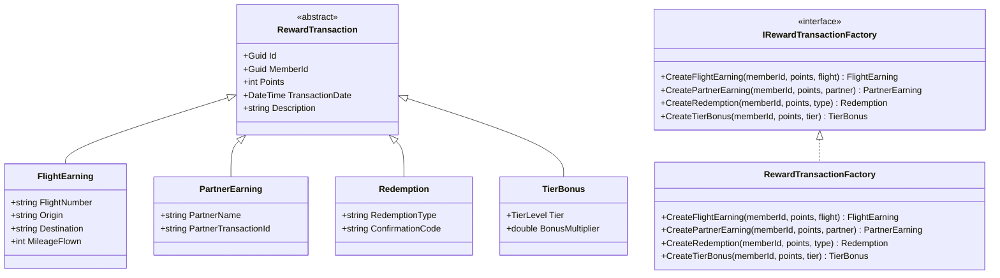
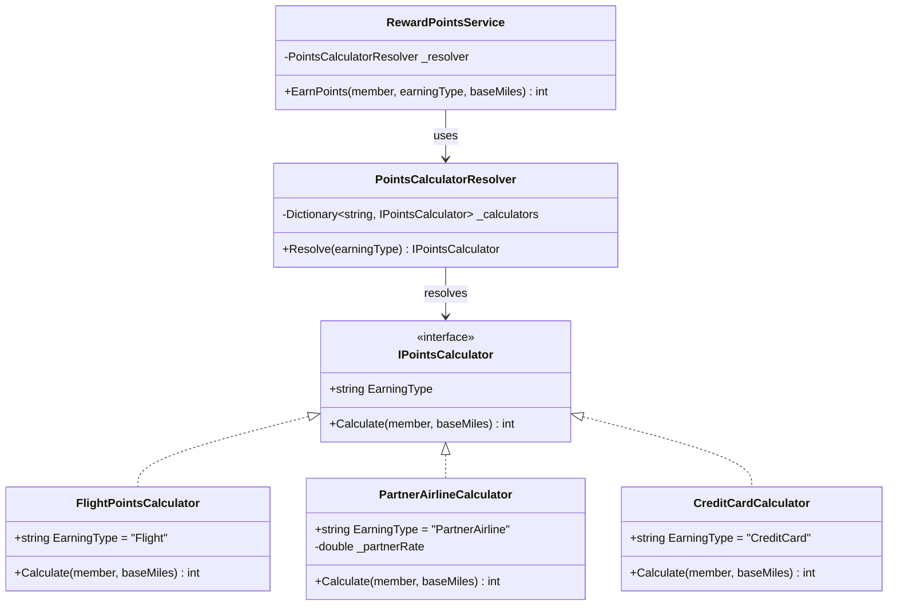
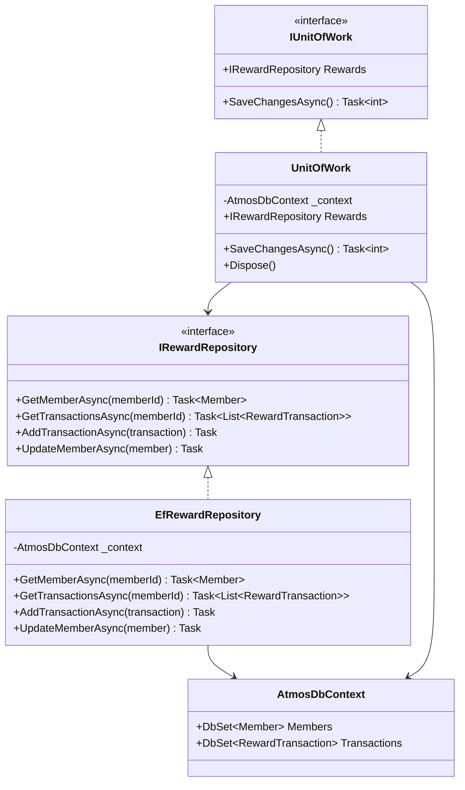
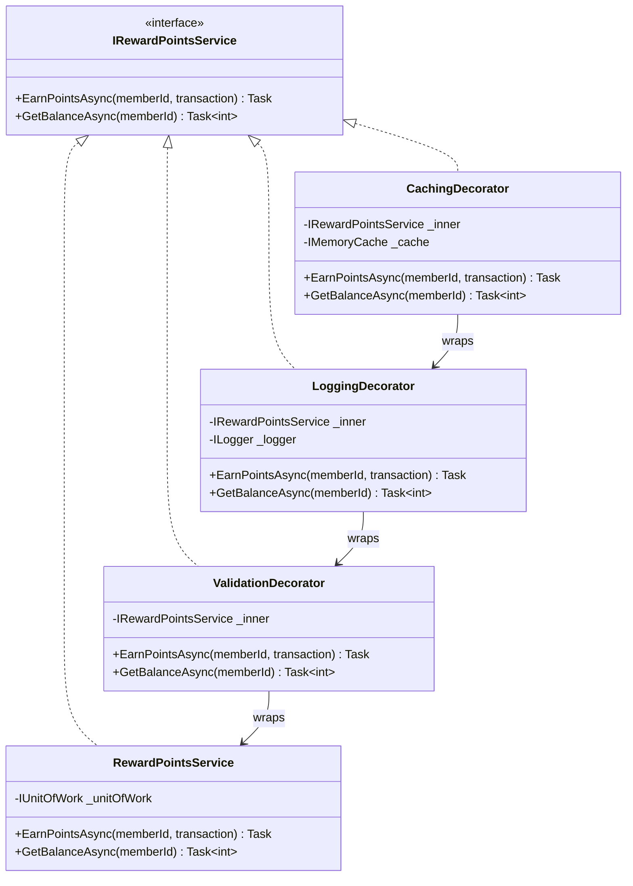
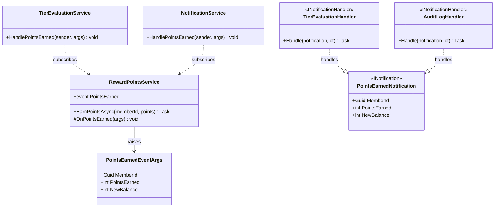
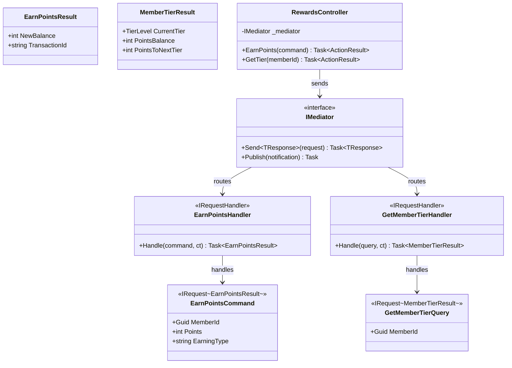

# Design Patterns in C#/.NET

## Overview

Design patterns are reusable solutions to common software design problems. In the context of Alaska Airlines' Atmos Rewards system, patterns help manage complexity around point calculations, tier evaluations, partner integrations, and transaction processing. This document covers six patterns that are highly relevant to the Membership Atmos Rewards team and frequently discussed in .NET interviews.

**Domain objects used throughout:**

- `Member` -- a loyalty program member with a tier and point balance
- `RewardTransaction` -- a points transaction (earning or redemption)
- `TierLevel` -- enumeration: `Gold`, `MVP`, `MVPGold`
- `RewardPointsService` -- orchestrates point earning and spending
- `TierEvaluationService` -- evaluates and promotes member tiers
- `PartnerEarningService` -- handles points earned through partner airlines

---

## 1. Factory Pattern

### When to Use

Use the Factory pattern when you need to create objects without exposing the instantiation logic to the caller. This is ideal when the type of object to create is determined at runtime -- for example, creating different `RewardTransaction` subtypes based on how points were earned.

### Class Diagram



### C# Implementation

```csharp
public abstract class RewardTransaction
{
    public Guid Id { get; init; } = Guid.NewGuid();
    public Guid MemberId { get; init; }
    public int Points { get; init; }
    public DateTime TransactionDate { get; init; } = DateTime.UtcNow;
    public abstract string Description { get; }
}

public class FlightEarning : RewardTransaction
{
    public string FlightNumber { get; init; } = string.Empty;
    public string Origin { get; init; } = string.Empty;
    public string Destination { get; init; } = string.Empty;
    public int MileageFlown { get; init; }
    public override string Description =>
        $"Flight {FlightNumber} ({Origin}->{Destination}): +{Points} pts";
}

public class PartnerEarning : RewardTransaction
{
    public string PartnerName { get; init; } = string.Empty;
    public string PartnerTransactionId { get; init; } = string.Empty;
    public override string Description =>
        $"Partner {PartnerName}: +{Points} pts";
}

public class Redemption : RewardTransaction
{
    public string RedemptionType { get; init; } = string.Empty;
    public string ConfirmationCode { get; init; } = string.Empty;
    public override string Description =>
        $"Redemption ({RedemptionType}): -{Points} pts";
}

public class TierBonus : RewardTransaction
{
    public TierLevel Tier { get; init; }
    public double BonusMultiplier { get; init; }
    public override string Description =>
        $"Tier bonus ({Tier}, {BonusMultiplier:P0}): +{Points} pts";
}

public interface IRewardTransactionFactory
{
    FlightEarning CreateFlightEarning(
        Guid memberId, int basePoints, string flightNumber,
        string origin, string destination, int mileageFlown);

    PartnerEarning CreatePartnerEarning(
        Guid memberId, int points, string partnerName,
        string partnerTransactionId);

    Redemption CreateRedemption(
        Guid memberId, int points, string redemptionType);

    TierBonus CreateTierBonus(
        Guid memberId, int basePoints, TierLevel tier);
}

public class RewardTransactionFactory : IRewardTransactionFactory
{
    private static readonly Dictionary<TierLevel, double> TierMultipliers = new()
    {
        [TierLevel.Gold] = 0.25,
        [TierLevel.MVP] = 0.50,
        [TierLevel.MVPGold] = 1.00
    };

    public FlightEarning CreateFlightEarning(
        Guid memberId, int basePoints, string flightNumber,
        string origin, string destination, int mileageFlown)
    {
        return new FlightEarning
        {
            MemberId = memberId,
            Points = basePoints,
            FlightNumber = flightNumber,
            Origin = origin,
            Destination = destination,
            MileageFlown = mileageFlown
        };
    }

    public PartnerEarning CreatePartnerEarning(
        Guid memberId, int points, string partnerName,
        string partnerTransactionId)
    {
        return new PartnerEarning
        {
            MemberId = memberId,
            Points = points,
            PartnerName = partnerName,
            PartnerTransactionId = partnerTransactionId
        };
    }

    public Redemption CreateRedemption(
        Guid memberId, int points, string redemptionType)
    {
        return new Redemption
        {
            MemberId = memberId,
            Points = points,
            RedemptionType = redemptionType,
            ConfirmationCode = $"RDM-{Guid.NewGuid().ToString()[..8].ToUpper()}"
        };
    }

    public TierBonus CreateTierBonus(
        Guid memberId, int basePoints, TierLevel tier)
    {
        var multiplier = TierMultipliers.GetValueOrDefault(tier, 0);
        return new TierBonus
        {
            MemberId = memberId,
            Points = (int)(basePoints * multiplier),
            Tier = tier,
            BonusMultiplier = multiplier
        };
    }
}

// DI registration
services.AddSingleton<IRewardTransactionFactory, RewardTransactionFactory>();
```

### Benefits and Trade-offs

| Benefits | Trade-offs |
|----------|------------|
| Centralizes creation logic | Adds an extra abstraction layer |
| Easy to add new transaction types | Factory interface grows with each new type |
| Encapsulates default values and validation | Can become a "god factory" if not split |
| Testable -- mock the factory in unit tests | Simple `new()` calls may be sufficient for simple cases |

---

## 2. Strategy Pattern

### When to Use

Use the Strategy pattern when you have multiple algorithms that can be swapped at runtime. In Atmos Rewards, different partner airlines and earning types each have their own points calculation formula. The Strategy pattern lets you add new calculation rules without modifying existing code (Open/Closed Principle).

### Class Diagram



### C# Implementation

```csharp
public interface IPointsCalculator
{
    /// The earning type identifier this calculator handles.
    string EarningType { get; }

    /// Calculate reward points for a member based on base miles.
    int Calculate(Member member, int baseMiles);
}

public class FlightPointsCalculator : IPointsCalculator
{
    public string EarningType => "Flight";

    private static readonly Dictionary<TierLevel, double> TierBonuses = new()
    {
        [TierLevel.Gold] = 1.25,
        [TierLevel.MVP] = 1.50,
        [TierLevel.MVPGold] = 2.00
    };

    public int Calculate(Member member, int baseMiles)
    {
        var multiplier = TierBonuses.GetValueOrDefault(member.Tier, 1.0);
        return (int)(baseMiles * multiplier);
    }
}

public class PartnerAirlineCalculator : IPointsCalculator
{
    private readonly double _partnerRate;

    public PartnerAirlineCalculator(double partnerRate = 0.5)
    {
        _partnerRate = partnerRate;
    }

    public string EarningType => "PartnerAirline";

    public int Calculate(Member member, int baseMiles)
    {
        return (int)(baseMiles * _partnerRate);
    }
}

public class CreditCardCalculator : IPointsCalculator
{
    public string EarningType => "CreditCard";

    public int Calculate(Member member, int baseMiles)
    {
        // Credit card points: 1 point per dollar, doubled for MVP Gold
        var multiplier = member.Tier == TierLevel.MVPGold ? 2.0 : 1.0;
        return (int)(baseMiles * multiplier);
    }
}

// Resolver to pick the right strategy at runtime
public class PointsCalculatorResolver
{
    private readonly Dictionary<string, IPointsCalculator> _calculators;

    public PointsCalculatorResolver(IEnumerable<IPointsCalculator> calculators)
    {
        _calculators = calculators.ToDictionary(c => c.EarningType);
    }

    public IPointsCalculator Resolve(string earningType)
    {
        if (!_calculators.TryGetValue(earningType, out var calculator))
            throw new NotSupportedException(
                $"No calculator registered for earning type: {earningType}");
        return calculator;
    }
}

// DI registration -- each strategy is registered, resolver collects them all
services.AddSingleton<IPointsCalculator, FlightPointsCalculator>();
services.AddSingleton<IPointsCalculator, PartnerAirlineCalculator>();
services.AddSingleton<IPointsCalculator, CreditCardCalculator>();
services.AddSingleton<PointsCalculatorResolver>();

// Usage in service
public class RewardPointsService
{
    private readonly PointsCalculatorResolver _resolver;

    public RewardPointsService(PointsCalculatorResolver resolver)
    {
        _resolver = resolver;
    }

    public int EarnPoints(Member member, string earningType, int baseMiles)
    {
        var calculator = _resolver.Resolve(earningType);
        return calculator.Calculate(member, baseMiles);
    }
}
```

### Benefits and Trade-offs

| Benefits | Trade-offs |
|----------|------------|
| Open/Closed -- add strategies without changing existing code | More classes to manage |
| Each calculation rule is isolated and independently testable | Resolver adds a level of indirection |
| DI-friendly -- just register new implementations | Caller must know the string key for each strategy |
| Easy to swap or configure per environment | Dictionary lookup has a small runtime cost |

---

## 3. Repository Pattern

### When to Use

Use the Repository pattern to abstract data access behind a clean interface. This separates your domain logic from persistence concerns and makes your services testable without hitting a real database. The Unit of Work concept groups multiple repository operations into a single database transaction.

### Class Diagram



### C# Implementation

```csharp
public interface IRewardRepository
{
    /// Retrieve a member by their unique identifier.
    Task<Member?> GetMemberAsync(Guid memberId);

    /// Retrieve all transactions for a given member.
    Task<List<RewardTransaction>> GetTransactionsAsync(Guid memberId);

    /// Add a new reward transaction.
    Task AddTransactionAsync(RewardTransaction transaction);

    /// Update an existing member record.
    Task UpdateMemberAsync(Member member);
}

public interface IUnitOfWork : IDisposable
{
    IRewardRepository Rewards { get; }

    /// Persist all pending changes as a single transaction.
    Task<int> SaveChangesAsync();
}

// EF Core DbContext
public class AtmosDbContext : DbContext
{
    public DbSet<Member> Members => Set<Member>();
    public DbSet<RewardTransaction> Transactions => Set<RewardTransaction>();

    public AtmosDbContext(DbContextOptions<AtmosDbContext> options)
        : base(options) { }

    protected override void OnModelCreating(ModelBuilder modelBuilder)
    {
        modelBuilder.Entity<RewardTransaction>()
            .HasDiscriminator<string>("TransactionType")
            .HasValue<FlightEarning>("FlightEarning")
            .HasValue<PartnerEarning>("PartnerEarning")
            .HasValue<Redemption>("Redemption")
            .HasValue<TierBonus>("TierBonus");
    }
}

// Repository implementation
public class EfRewardRepository : IRewardRepository
{
    private readonly AtmosDbContext _context;

    public EfRewardRepository(AtmosDbContext context)
    {
        _context = context;
    }

    public async Task<Member?> GetMemberAsync(Guid memberId)
    {
        return await _context.Members.FindAsync(memberId);
    }

    public async Task<List<RewardTransaction>> GetTransactionsAsync(Guid memberId)
    {
        return await _context.Transactions
            .Where(t => t.MemberId == memberId)
            .OrderByDescending(t => t.TransactionDate)
            .ToListAsync();
    }

    public async Task AddTransactionAsync(RewardTransaction transaction)
    {
        await _context.Transactions.AddAsync(transaction);
    }

    public Task UpdateMemberAsync(Member member)
    {
        _context.Members.Update(member);
        return Task.CompletedTask;
    }
}

// Unit of Work implementation
public class UnitOfWork : IUnitOfWork
{
    private readonly AtmosDbContext _context;

    public UnitOfWork(AtmosDbContext context, IRewardRepository rewards)
    {
        _context = context;
        Rewards = rewards;
    }

    public IRewardRepository Rewards { get; }

    public async Task<int> SaveChangesAsync()
    {
        return await _context.SaveChangesAsync();
    }

    public void Dispose()
    {
        _context.Dispose();
    }
}

// DI registration
services.AddDbContext<AtmosDbContext>(options =>
    options.UseSqlServer(configuration.GetConnectionString("AtmosRewards")));
services.AddScoped<IRewardRepository, EfRewardRepository>();
services.AddScoped<IUnitOfWork, UnitOfWork>();

// Usage: earn points and save in one transaction
public class RewardPointsService
{
    private readonly IUnitOfWork _unitOfWork;

    public RewardPointsService(IUnitOfWork unitOfWork)
    {
        _unitOfWork = unitOfWork;
    }

    public async Task EarnPointsAsync(Guid memberId, RewardTransaction transaction)
    {
        var member = await _unitOfWork.Rewards.GetMemberAsync(memberId)
            ?? throw new InvalidOperationException("Member not found");

        member.PointsBalance += transaction.Points;

        await _unitOfWork.Rewards.AddTransactionAsync(transaction);
        await _unitOfWork.Rewards.UpdateMemberAsync(member);
        await _unitOfWork.SaveChangesAsync(); // single DB round-trip
    }
}
```

### Benefits and Trade-offs

| Benefits | Trade-offs |
|----------|------------|
| Testable -- mock `IRewardRepository` in unit tests | EF Core `DbContext` already acts as a repository/UoW |
| Swappable persistence (SQL, Cosmos, in-memory) | Extra abstraction layer over EF Core |
| Unit of Work ensures atomicity across operations | Can lead to "repository per entity" bloat |
| Clean separation of domain and data access | Risk of leaky abstractions (e.g., exposing `IQueryable`) |

---

## 4. Decorator Pattern

### When to Use

Use the Decorator pattern to add behavior to an object without modifying its class. This is perfect for cross-cutting concerns like logging, caching, and validation. Each decorator wraps the same interface, so they can be chained in any order.

### Class Diagram



### C# Implementation

```csharp
public interface IRewardPointsService
{
    /// Add a reward transaction and update the member balance.
    Task EarnPointsAsync(Guid memberId, RewardTransaction transaction);

    /// Get the current points balance for a member.
    Task<int> GetBalanceAsync(Guid memberId);
}

// Core implementation
public class RewardPointsService : IRewardPointsService
{
    private readonly IUnitOfWork _unitOfWork;

    public RewardPointsService(IUnitOfWork unitOfWork)
    {
        _unitOfWork = unitOfWork;
    }

    public async Task EarnPointsAsync(Guid memberId, RewardTransaction transaction)
    {
        var member = await _unitOfWork.Rewards.GetMemberAsync(memberId)
            ?? throw new InvalidOperationException("Member not found");

        member.PointsBalance += transaction.Points;
        await _unitOfWork.Rewards.AddTransactionAsync(transaction);
        await _unitOfWork.SaveChangesAsync();
    }

    public async Task<int> GetBalanceAsync(Guid memberId)
    {
        var member = await _unitOfWork.Rewards.GetMemberAsync(memberId)
            ?? throw new InvalidOperationException("Member not found");
        return member.PointsBalance;
    }
}

// Validation decorator
public class ValidationDecorator : IRewardPointsService
{
    private readonly IRewardPointsService _inner;

    public ValidationDecorator(IRewardPointsService inner)
    {
        _inner = inner;
    }

    public async Task EarnPointsAsync(Guid memberId, RewardTransaction transaction)
    {
        if (memberId == Guid.Empty)
            throw new ArgumentException("Member ID is required", nameof(memberId));
        if (transaction.Points <= 0)
            throw new ArgumentException("Points must be positive", nameof(transaction));

        await _inner.EarnPointsAsync(memberId, transaction);
    }

    public Task<int> GetBalanceAsync(Guid memberId)
    {
        if (memberId == Guid.Empty)
            throw new ArgumentException("Member ID is required", nameof(memberId));
        return _inner.GetBalanceAsync(memberId);
    }
}

// Logging decorator
public class LoggingDecorator : IRewardPointsService
{
    private readonly IRewardPointsService _inner;
    private readonly ILogger<LoggingDecorator> _logger;

    public LoggingDecorator(IRewardPointsService inner, ILogger<LoggingDecorator> logger)
    {
        _inner = inner;
        _logger = logger;
    }

    public async Task EarnPointsAsync(Guid memberId, RewardTransaction transaction)
    {
        _logger.LogInformation(
            "Earning {Points} points for member {MemberId}",
            transaction.Points, memberId);

        var sw = Stopwatch.StartNew();
        await _inner.EarnPointsAsync(memberId, transaction);
        sw.Stop();

        _logger.LogInformation(
            "Points earned for member {MemberId} in {ElapsedMs}ms",
            memberId, sw.ElapsedMilliseconds);
    }

    public async Task<int> GetBalanceAsync(Guid memberId)
    {
        _logger.LogInformation("Getting balance for member {MemberId}", memberId);
        return await _inner.GetBalanceAsync(memberId);
    }
}

// Caching decorator
public class CachingDecorator : IRewardPointsService
{
    private readonly IRewardPointsService _inner;
    private readonly IMemoryCache _cache;

    public CachingDecorator(IRewardPointsService inner, IMemoryCache cache)
    {
        _inner = inner;
        _cache = cache;
    }

    public async Task EarnPointsAsync(Guid memberId, RewardTransaction transaction)
    {
        await _inner.EarnPointsAsync(memberId, transaction);

        // Invalidate the cached balance after earning
        _cache.Remove($"balance:{memberId}");
    }

    public async Task<int> GetBalanceAsync(Guid memberId)
    {
        var cacheKey = $"balance:{memberId}";

        if (_cache.TryGetValue(cacheKey, out int cachedBalance))
            return cachedBalance;

        var balance = await _inner.GetBalanceAsync(memberId);
        _cache.Set(cacheKey, balance, TimeSpan.FromMinutes(5));
        return balance;
    }
}

// DI registration -- chain: Caching -> Logging -> Validation -> Core
services.AddScoped<RewardPointsService>();
services.AddScoped<IRewardPointsService>(sp =>
{
    var core = sp.GetRequiredService<RewardPointsService>();
    var validated = new ValidationDecorator(core);
    var logged = new LoggingDecorator(
        validated, sp.GetRequiredService<ILogger<LoggingDecorator>>());
    var cached = new CachingDecorator(
        logged, sp.GetRequiredService<IMemoryCache>());
    return cached;
});
```

The call chain flows inward: **Caching** -> **Logging** -> **Validation** -> **Core service**. A `GetBalanceAsync` call first checks the cache, then logs the request, then validates the input, then hits the database.

### Benefits and Trade-offs

| Benefits | Trade-offs |
|----------|------------|
| Each concern is a separate, focused class | DI registration is more manual |
| Decorators are composable and reorderable | Deep nesting can complicate debugging |
| Core service stays clean -- no logging/caching code | Every interface method must be forwarded |
| Each decorator is independently testable | Adding methods to the interface means updating all decorators |

---

## 5. Observer Pattern

### When to Use

Use the Observer pattern when a change in one object should trigger reactions in other objects, without tight coupling between them. In Atmos Rewards, when a member earns enough points, the system should evaluate their tier status, send notifications, and update dashboards. The Observer pattern (via C# events or MediatR notifications) decouples these reactions from the earning logic.

### Class Diagram



### C# Implementation

**Approach 1: C# events (classic Observer)**

```csharp
public class PointsEarnedEventArgs : EventArgs
{
    public Guid MemberId { get; init; }
    public int PointsEarned { get; init; }
    public int NewBalance { get; init; }
}

public class RewardPointsService
{
    public event EventHandler<PointsEarnedEventArgs>? PointsEarned;

    private readonly IUnitOfWork _unitOfWork;

    public RewardPointsService(IUnitOfWork unitOfWork)
    {
        _unitOfWork = unitOfWork;
    }

    public async Task EarnPointsAsync(Guid memberId, int points)
    {
        var member = await _unitOfWork.Rewards.GetMemberAsync(memberId)
            ?? throw new InvalidOperationException("Member not found");

        member.PointsBalance += points;
        await _unitOfWork.SaveChangesAsync();

        // Notify all observers
        OnPointsEarned(new PointsEarnedEventArgs
        {
            MemberId = memberId,
            PointsEarned = points,
            NewBalance = member.PointsBalance
        });
    }

    protected virtual void OnPointsEarned(PointsEarnedEventArgs args)
    {
        PointsEarned?.Invoke(this, args);
    }
}

public class TierEvaluationService
{
    private static readonly Dictionary<TierLevel, int> TierThresholds = new()
    {
        [TierLevel.Gold] = 20_000,
        [TierLevel.MVP] = 50_000,
        [TierLevel.MVPGold] = 100_000
    };

    private readonly IUnitOfWork _unitOfWork;

    public TierEvaluationService(IUnitOfWork unitOfWork)
    {
        _unitOfWork = unitOfWork;
    }

    /// Evaluate whether a member qualifies for a tier upgrade.
    public async void HandlePointsEarned(object? sender, PointsEarnedEventArgs args)
    {
        var member = await _unitOfWork.Rewards.GetMemberAsync(args.MemberId);
        if (member is null) return;

        foreach (var (tier, threshold) in TierThresholds.OrderByDescending(t => t.Value))
        {
            if (args.NewBalance >= threshold && member.Tier < tier)
            {
                member.Tier = tier;
                await _unitOfWork.SaveChangesAsync();
                break;
            }
        }
    }
}

// Wiring up observers (typically in startup or a composition root)
var rewardService = serviceProvider.GetRequiredService<RewardPointsService>();
var tierService = serviceProvider.GetRequiredService<TierEvaluationService>();
rewardService.PointsEarned += tierService.HandlePointsEarned;
```

**Approach 2: MediatR notifications (preferred in modern .NET)**

```csharp
// Notification (the event)
public record PointsEarnedNotification(
    Guid MemberId,
    int PointsEarned,
    int NewBalance) : INotification;

// Handler 1: Tier evaluation
public class TierEvaluationHandler : INotificationHandler<PointsEarnedNotification>
{
    private readonly IUnitOfWork _unitOfWork;
    private readonly ILogger<TierEvaluationHandler> _logger;

    public TierEvaluationHandler(IUnitOfWork unitOfWork,
        ILogger<TierEvaluationHandler> logger)
    {
        _unitOfWork = unitOfWork;
        _logger = logger;
    }

    public async Task Handle(PointsEarnedNotification notification,
        CancellationToken cancellationToken)
    {
        var member = await _unitOfWork.Rewards
            .GetMemberAsync(notification.MemberId);
        if (member is null) return;

        var newTier = notification.NewBalance switch
        {
            >= 100_000 => TierLevel.MVPGold,
            >= 50_000 => TierLevel.MVP,
            >= 20_000 => TierLevel.Gold,
            _ => member.Tier
        };

        if (newTier > member.Tier)
        {
            _logger.LogInformation(
                "Member {MemberId} promoted from {OldTier} to {NewTier}",
                member.Id, member.Tier, newTier);
            member.Tier = newTier;
            await _unitOfWork.SaveChangesAsync();
        }
    }
}

// Handler 2: Audit logging
public class AuditLogHandler : INotificationHandler<PointsEarnedNotification>
{
    private readonly ILogger<AuditLogHandler> _logger;

    public AuditLogHandler(ILogger<AuditLogHandler> logger)
    {
        _logger = logger;
    }

    public Task Handle(PointsEarnedNotification notification,
        CancellationToken cancellationToken)
    {
        _logger.LogInformation(
            "Audit: Member {MemberId} earned {Points} points. Balance: {Balance}",
            notification.MemberId,
            notification.PointsEarned,
            notification.NewBalance);
        return Task.CompletedTask;
    }
}

// Publishing from the service
public class RewardPointsService
{
    private readonly IUnitOfWork _unitOfWork;
    private readonly IMediator _mediator;

    public RewardPointsService(IUnitOfWork unitOfWork, IMediator mediator)
    {
        _unitOfWork = unitOfWork;
        _mediator = mediator;
    }

    public async Task EarnPointsAsync(Guid memberId, int points)
    {
        var member = await _unitOfWork.Rewards.GetMemberAsync(memberId)
            ?? throw new InvalidOperationException("Member not found");

        member.PointsBalance += points;
        await _unitOfWork.SaveChangesAsync();

        await _mediator.Publish(new PointsEarnedNotification(
            memberId, points, member.PointsBalance));
    }
}
```

### Benefits and Trade-offs

| Benefits | Trade-offs |
|----------|------------|
| Publisher does not know about subscribers | C# events can cause memory leaks if not unsubscribed |
| Easy to add new observers without modifying the publisher | Event handlers run sequentially by default in MediatR |
| MediatR version is fully DI-integrated | Debugging event flow can be harder than direct calls |
| Clean separation of concerns | `async void` in classic events is dangerous (errors are lost) |

---

## 6. MediatR / Mediator Pattern

### When to Use

Use the Mediator pattern to decouple the sender of a request from its handler. MediatR is the go-to library in .NET for implementing this. It separates your API controllers from business logic by using Commands (write operations) and Queries (read operations). This is especially useful in CQRS-style architectures.

### Class Diagram



### C# Implementation

```csharp
// --- Commands (write operations) ---

public record EarnPointsCommand(
    Guid MemberId,
    int Points,
    string EarningType) : IRequest<EarnPointsResult>;

public record EarnPointsResult(
    int NewBalance,
    string TransactionId);

public class EarnPointsHandler
    : IRequestHandler<EarnPointsCommand, EarnPointsResult>
{
    private readonly IUnitOfWork _unitOfWork;
    private readonly IRewardTransactionFactory _factory;
    private readonly IMediator _mediator;

    public EarnPointsHandler(
        IUnitOfWork unitOfWork,
        IRewardTransactionFactory factory,
        IMediator mediator)
    {
        _unitOfWork = unitOfWork;
        _factory = factory;
        _mediator = mediator;
    }

    public async Task<EarnPointsResult> Handle(
        EarnPointsCommand command, CancellationToken cancellationToken)
    {
        var member = await _unitOfWork.Rewards.GetMemberAsync(command.MemberId)
            ?? throw new InvalidOperationException("Member not found");

        var transaction = _factory.CreatePartnerEarning(
            command.MemberId, command.Points,
            command.EarningType, Guid.NewGuid().ToString());

        member.PointsBalance += command.Points;
        await _unitOfWork.Rewards.AddTransactionAsync(transaction);
        await _unitOfWork.SaveChangesAsync();

        // Publish notification for observers (tier evaluation, audit, etc.)
        await _mediator.Publish(
            new PointsEarnedNotification(
                command.MemberId, command.Points, member.PointsBalance),
            cancellationToken);

        return new EarnPointsResult(member.PointsBalance, transaction.Id.ToString());
    }
}

// --- Queries (read operations) ---

public record GetMemberTierQuery(Guid MemberId) : IRequest<MemberTierResult>;

public record MemberTierResult(
    TierLevel CurrentTier,
    int PointsBalance,
    int PointsToNextTier);

public class GetMemberTierHandler
    : IRequestHandler<GetMemberTierQuery, MemberTierResult>
{
    private readonly IRewardRepository _repository;

    private static readonly SortedList<int, TierLevel> TierThresholds = new()
    {
        [20_000] = TierLevel.Gold,
        [50_000] = TierLevel.MVP,
        [100_000] = TierLevel.MVPGold
    };

    public GetMemberTierHandler(IRewardRepository repository)
    {
        _repository = repository;
    }

    public async Task<MemberTierResult> Handle(
        GetMemberTierQuery query, CancellationToken cancellationToken)
    {
        var member = await _repository.GetMemberAsync(query.MemberId)
            ?? throw new InvalidOperationException("Member not found");

        var pointsToNext = TierThresholds
            .Where(t => t.Key > member.PointsBalance)
            .Select(t => t.Key - member.PointsBalance)
            .DefaultIfEmpty(0)
            .First();

        return new MemberTierResult(
            member.Tier,
            member.PointsBalance,
            pointsToNext);
    }
}

// --- Controller (thin -- just sends commands/queries) ---

[ApiController]
[Route("api/[controller]")]
public class RewardsController : ControllerBase
{
    private readonly IMediator _mediator;

    public RewardsController(IMediator mediator)
    {
        _mediator = mediator;
    }

    [HttpPost("earn")]
    public async Task<ActionResult<EarnPointsResult>> EarnPoints(
        [FromBody] EarnPointsCommand command)
    {
        var result = await _mediator.Send(command);
        return Ok(result);
    }

    [HttpGet("tier/{memberId:guid}")]
    public async Task<ActionResult<MemberTierResult>> GetTier(Guid memberId)
    {
        var result = await _mediator.Send(new GetMemberTierQuery(memberId));
        return Ok(result);
    }
}

// --- Pipeline behavior (cross-cutting with MediatR) ---

public class LoggingBehavior<TRequest, TResponse>
    : IPipelineBehavior<TRequest, TResponse>
    where TRequest : IRequest<TResponse>
{
    private readonly ILogger<LoggingBehavior<TRequest, TResponse>> _logger;

    public LoggingBehavior(ILogger<LoggingBehavior<TRequest, TResponse>> logger)
    {
        _logger = logger;
    }

    public async Task<TResponse> Handle(
        TRequest request,
        RequestHandlerDelegate<TResponse> next,
        CancellationToken cancellationToken)
    {
        var requestName = typeof(TRequest).Name;
        _logger.LogInformation("Handling {RequestName}: {@Request}",
            requestName, request);

        var sw = Stopwatch.StartNew();
        var response = await next();
        sw.Stop();

        _logger.LogInformation(
            "Handled {RequestName} in {ElapsedMs}ms",
            requestName, sw.ElapsedMilliseconds);
        return response;
    }
}

// --- DI registration ---

services.AddMediatR(cfg =>
{
    cfg.RegisterServicesFromAssemblyContaining<EarnPointsHandler>();
    cfg.AddBehavior(typeof(IPipelineBehavior<,>),
        typeof(LoggingBehavior<,>));
});
```

### Benefits and Trade-offs

| Benefits | Trade-offs |
|----------|------------|
| Controllers are thin -- zero business logic | Handler classes proliferate (one per command/query) |
| Each handler is independently testable | "Go to definition" navigation is harder (indirection) |
| Pipeline behaviors add cross-cutting concerns cleanly | Adds a dependency on MediatR library |
| Natural fit for CQRS (separate read/write paths) | Overkill for very simple CRUD operations |
| Easy to add validation, logging, caching globally | Can hide the flow of the application |

---

## Interview Questions

### Conceptual Questions

1. **What is the difference between the Factory Method and Abstract Factory patterns?**
   Factory Method defines an interface for creating a single object, letting subclasses decide the concrete type. Abstract Factory provides an interface for creating families of related objects. In our example, `RewardTransactionFactory` is closer to a Factory Method approach since each method creates one specific type.

2. **Why use the Strategy pattern instead of a switch statement?**
   A switch statement violates the Open/Closed Principle -- adding a new earning type requires modifying the switch. With Strategy, you register a new `IPointsCalculator` implementation and the resolver picks it up automatically. Each strategy is also independently testable.

3. **Is the Repository pattern still necessary with Entity Framework Core?**
   This is debated. EF Core's `DbContext` already implements Repository and Unit of Work patterns. However, a custom repository interface makes it easier to mock in unit tests, swap persistence providers, and keep EF-specific concerns out of your domain services. The trade-off is an extra abstraction layer.

4. **How do decorators differ from middleware?**
   Both add behavior around a core operation. Middleware operates at the HTTP pipeline level (applies to all requests). Decorators wrap a specific service interface and only affect calls to that service. Decorators are more targeted and type-safe.

5. **When would you choose C# events over MediatR notifications?**
   C# events are simpler and have no library dependency, making them suitable for in-process scenarios where the publisher lifecycle is well-controlled. MediatR notifications integrate with DI, support async handlers naturally, and are easier to test. For most ASP.NET Core applications, MediatR is the better choice.

### Scenario-Based Questions

6. **A new partner airline is added to Atmos Rewards. How do you add their earning rules with minimal code changes?**
   Create a new `IPointsCalculator` implementation (e.g., `HawaiianAirlineCalculator`), register it in DI. The `PointsCalculatorResolver` automatically picks it up. No existing code changes needed -- this is the Strategy pattern with Open/Closed Principle.

7. **You need to add rate limiting to the `RewardPointsService`. How would you do it without modifying the service?**
   Create a `RateLimitingDecorator : IRewardPointsService` that checks a rate limiter before delegating to the inner service. Register it in the decorator chain. The core service remains untouched.

8. **A member reaches MVP Gold status after a flight. Walk through the event flow.**
   The `EarnPointsHandler` processes the `EarnPointsCommand`, updates the balance, saves to the database, then publishes a `PointsEarnedNotification`. The `TierEvaluationHandler` receives the notification, checks the new balance against tier thresholds, and promotes the member to MVP Gold. The `AuditLogHandler` logs the earning event independently.

9. **How would you test the `EarnPointsHandler` without a database?**
   Mock `IUnitOfWork` and `IRewardTransactionFactory` using Moq. Set up `GetMemberAsync` to return a test member. Verify that `AddTransactionAsync` and `SaveChangesAsync` were called. Capture the published `PointsEarnedNotification` by mocking `IMediator.Publish` and assert the correct values.

10. **You notice the decorator chain is becoming hard to manage. What alternatives exist?**
    Use MediatR pipeline behaviors instead. They act as decorators for the mediator pipeline (logging, validation, caching) without requiring manual DI wiring. Another option is Scrutor, a library that simplifies decorator registration: `services.Decorate<IRewardPointsService, LoggingDecorator>()`.
