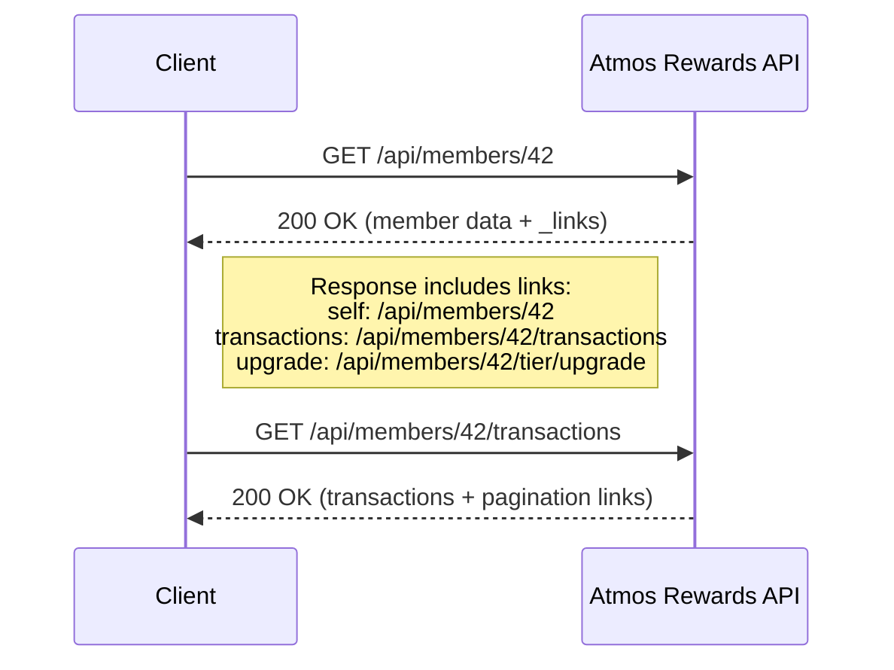
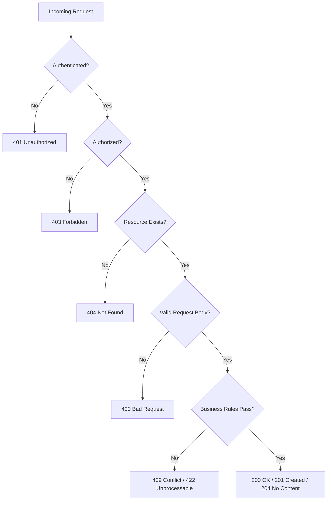
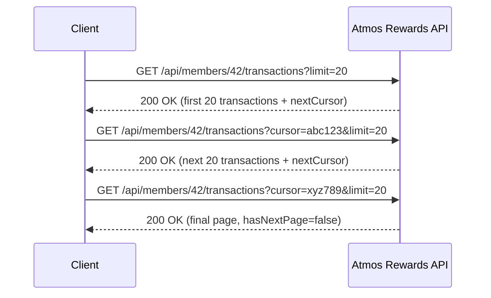
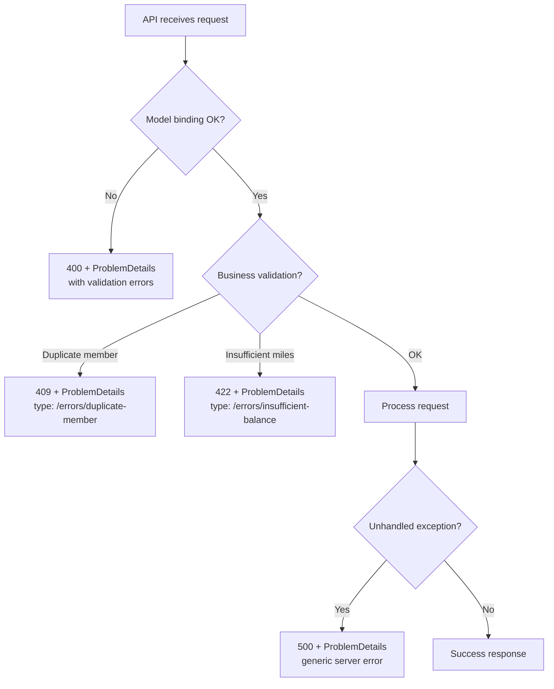
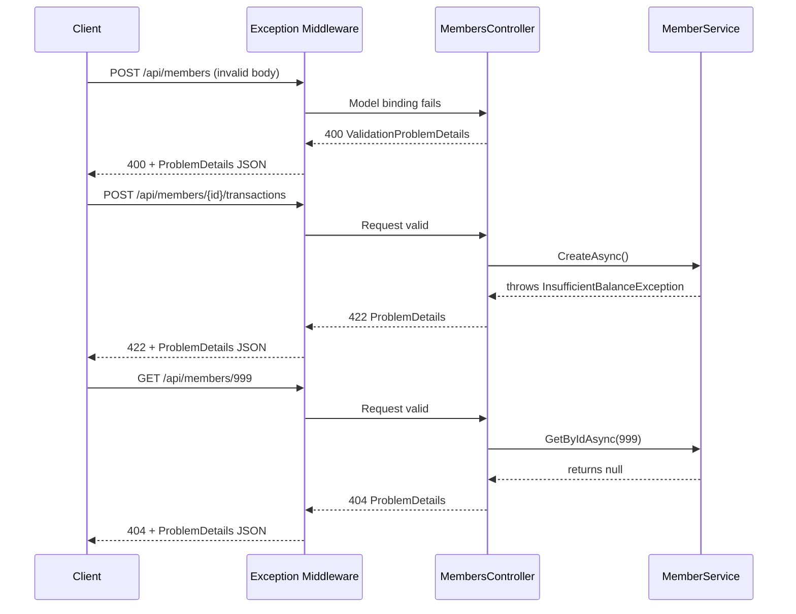
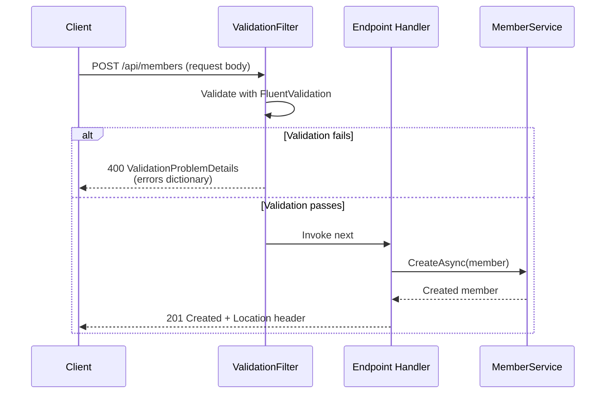

# RESTful API Design

## Overview

RESTful API design is central to building the backend services that power loyalty programs like Alaska Airlines Atmos Rewards. This document covers REST principles, HTTP semantics, resource modeling, pagination, error handling, and the practical differences between Minimal APIs and Controllers in .NET. Code examples use the Atmos Rewards domain: members, reward transactions, and tier levels (Gold, MVP, MVP Gold).

---

## 1. REST Principles

REST (Representational State Transfer) is an architectural style defined by six constraints:

| Constraint | Description |
|---|---|
| **Client-Server** | Separation of concerns between UI and data storage |
| **Stateless** | Each request contains all information needed to process it |
| **Cacheable** | Responses must define themselves as cacheable or not |
| **Uniform Interface** | Resources identified by URIs, manipulated through representations |
| **Layered System** | Client cannot tell whether it is connected directly to the server |
| **Code on Demand** (optional) | Server can extend client functionality via scripts |

### Resource-Oriented Design

Resources are the core abstraction. In Atmos Rewards:

- A **Member** is a resource: `/api/members/42`
- A **Reward Transaction** is a sub-resource: `/api/members/42/transactions/101`
- A **Tier Level** is an attribute of a member, not typically its own top-level resource

### HATEOAS (Hypermedia as the Engine of Application State)

Responses include links that tell the client what actions are available next. This decouples the client from hardcoded URL knowledge.



---

## 2. HTTP Methods and Status Codes

Each HTTP method has specific semantics. Using them correctly is what makes an API truly RESTful.

| Method | Semantics | Idempotent | Safe | Typical Status Codes |
|---|---|---|---|---|
| **GET** | Retrieve a resource | Yes | Yes | 200, 404 |
| **POST** | Create a new resource | No | No | 201, 400, 409 |
| **PUT** | Full replacement of a resource | Yes | No | 200, 204, 404 |
| **PATCH** | Partial update | No* | No | 200, 204, 404 |
| **DELETE** | Remove a resource | Yes | No | 204, 404 |

*PATCH can be made idempotent depending on the patch format, but is not required to be.

### Key Status Codes for Atmos Rewards

- **200 OK** - Successful GET, PUT, PATCH
- **201 Created** - Successful POST (include `Location` header)
- **204 No Content** - Successful DELETE or PUT with no response body
- **400 Bad Request** - Validation failure
- **401 Unauthorized** - Missing or invalid authentication
- **403 Forbidden** - Authenticated but insufficient permissions
- **404 Not Found** - Resource does not exist
- **409 Conflict** - Duplicate enrollment, concurrent update conflict
- **422 Unprocessable Entity** - Semantically invalid request



---

## 3. Resource Naming Conventions

### Rules

1. **Use plural nouns** for collections: `/api/members`, not `/api/member`
2. **Use path segments for hierarchy**: `/api/members/{memberId}/transactions`
3. **Use query parameters for filtering**, not path segments: `/api/members?tier=Gold`
4. **Use kebab-case** for multi-word segments: `/api/reward-transactions`
5. **Avoid verbs in URIs** - the HTTP method is the verb
6. **Avoid deep nesting** beyond two levels: prefer `/api/transactions?memberId=42` over `/api/members/42/accounts/1/transactions`

### Atmos Rewards URI Examples

| Resource | URI |
|---|---|
| All members | `GET /api/members` |
| Single member | `GET /api/members/{id}` |
| Member's transactions | `GET /api/members/{id}/transactions` |
| Single transaction | `GET /api/members/{id}/transactions/{txId}` |
| Member's current tier | `GET /api/members/{id}/tier` |
| Enroll a new member | `POST /api/members` |
| Earn miles | `POST /api/members/{id}/transactions` |
| Redeem miles | `POST /api/members/{id}/redemptions` |

---

## 4. Pagination

### Cursor-Based vs Offset Pagination

| Approach | Pros | Cons |
|---|---|---|
| **Offset** (`?page=3&pageSize=20`) | Simple, allows jumping to any page | Slow on large datasets, inconsistent under inserts/deletes |
| **Cursor** (`?cursor=abc123&limit=20`) | Consistent results, performant | Cannot jump to arbitrary page, cursor is opaque |

For Atmos Rewards transactions (high volume, append-mostly), cursor-based pagination is the better choice.

### Response Envelope

```json
{
  "data": [ ... ],
  "pagination": {
    "cursor": "eyJpZCI6MTAxfQ==",
    "limit": 20,
    "hasNextPage": true,
    "nextCursor": "eyJpZCI6MTIxfQ=="
  },
  "_links": {
    "self": "/api/members/42/transactions?cursor=eyJpZCI6MTAxfQ==&limit=20",
    "next": "/api/members/42/transactions?cursor=eyJpZCI6MTIxfQ==&limit=20"
  }
}
```



---

## 5. Filtering, Sorting, and Searching

### Query Parameter Conventions

| Operation | Example |
|---|---|
| **Filter by field** | `GET /api/members?tier=Gold` |
| **Filter by range** | `GET /api/members/42/transactions?from=2026-01-01&to=2026-02-01` |
| **Sort** | `GET /api/members?sort=lastName:asc,enrolledAt:desc` |
| **Search** | `GET /api/members?search=smith` |
| **Field selection** | `GET /api/members/42?fields=firstName,lastName,tier` |
| **Combined** | `GET /api/members?tier=MVP&sort=enrolledAt:desc&limit=10` |

### Design Decisions

- Use comma-separated values for multi-value filters: `?tier=Gold,MVP`
- Use colon for sort direction: `?sort=field:asc`
- Enforce a maximum page size (e.g., 100) to prevent abuse
- Default to sensible sort order (e.g., transactions by date descending)

---

## 6. Error Handling with ProblemDetails (RFC 7807)

RFC 7807 defines a standard JSON structure for API error responses. ASP.NET Core has built-in support via `ProblemDetails`.

### ProblemDetails Structure

```json
{
  "type": "https://tools.ietf.org/html/rfc7231#section-6.5.1",
  "title": "One or more validation errors occurred.",
  "status": 400,
  "detail": "See the errors property for details.",
  "instance": "/api/members",
  "traceId": "00-abc123-def456-01",
  "errors": {
    "Email": ["The Email field is required."],
    "FirstName": ["The FirstName field must be between 1 and 100 characters."]
  }
}
```



---

## 7. Content Negotiation

Content negotiation uses the `Accept` header to let clients specify their preferred response format.

```
GET /api/members/42 HTTP/1.1
Accept: application/json
```

In practice, most APIs default to JSON and may optionally support XML. ASP.NET Core handles this through output formatters.

### JSON Serialization Options

Key decisions for Atmos Rewards:

- **camelCase** property naming (ASP.NET Core default with `System.Text.Json`)
- **Enum as string** for tier levels: `"Gold"` not `2`
- **ISO 8601** for dates: `"2026-02-24T14:30:00Z"`
- **Null handling**: omit null properties or include them explicitly

---

## 8. Minimal APIs vs Controllers in .NET

| Aspect | Controllers | Minimal APIs |
|---|---|---|
| **Structure** | Class-based, attribute routing | Lambda/delegate-based |
| **Best for** | Complex APIs, many endpoints | Simple APIs, microservices |
| **Filters** | Full filter pipeline | Endpoint filters (since .NET 7) |
| **Model binding** | Attribute-based, flexible | Parameter-based, convention-driven |
| **Testability** | Integration tests with `WebApplicationFactory` | Same, but also easy unit testing of handlers |
| **API versioning** | Mature support | Supported since .NET 7 |
| **OpenAPI** | Built-in with `[ApiController]` | Built-in since .NET 9 |

**Rule of thumb**: Use Controllers when the API has many related endpoints with shared concerns (filters, base classes). Use Minimal APIs for simple CRUD microservices or when you want less ceremony.

---

## Code Examples

### Example 1: Domain Models and DTOs

```csharp
// Domain Models
public enum TierLevel
{
    Standard,
    Gold,
    MVP,
    MVPGold
}

public class Member
{
    public int Id { get; set; }
    public string FirstName { get; set; } = string.Empty;
    public string LastName { get; set; } = string.Empty;
    public string Email { get; set; } = string.Empty;
    public string MileagePlanNumber { get; set; } = string.Empty;
    public TierLevel Tier { get; set; }
    public int MilesBalance { get; set; }
    public DateTime EnrolledAt { get; set; }
    public List<RewardTransaction> Transactions { get; set; } = [];
}

public class RewardTransaction
{
    public int Id { get; set; }
    public int MemberId { get; set; }
    public string Description { get; set; } = string.Empty;
    public int Miles { get; set; }
    public TransactionType Type { get; set; }
    public DateTime CreatedAt { get; set; }
}

public enum TransactionType
{
    Earn,
    Redeem,
    BonusCredit,
    TierQualification
}

// Request DTOs
public record CreateMemberRequest(
    string FirstName,
    string LastName,
    string Email);

public record UpdateMemberRequest(
    string FirstName,
    string LastName,
    string Email);

public record PatchMemberRequest(
    string? FirstName = null,
    string? LastName = null,
    string? Email = null);

public record CreateTransactionRequest(
    string Description,
    int Miles,
    TransactionType Type);

// Response DTOs
public record MemberResponse(
    int Id,
    string FirstName,
    string LastName,
    string Email,
    string MileagePlanNumber,
    TierLevel Tier,
    int MilesBalance,
    DateTime EnrolledAt,
    Dictionary<string, string> Links);

public record TransactionResponse(
    int Id,
    string Description,
    int Miles,
    TransactionType Type,
    DateTime CreatedAt);

public record PagedResponse<T>(
    IReadOnlyList<T> Data,
    PaginationInfo Pagination,
    Dictionary<string, string> Links);

public record PaginationInfo(
    string? Cursor,
    int Limit,
    bool HasNextPage,
    string? NextCursor);
```

### Example 2: MembersController with CRUD Operations

```csharp
[ApiController]
[Route("api/[controller]")]
[Produces("application/json")]
public class MembersController : ControllerBase
{
    private readonly IMemberService _memberService;
    private readonly ILogger<MembersController> _logger;

    public MembersController(
        IMemberService memberService,
        ILogger<MembersController> logger)
    {
        _memberService = memberService;
        _logger = logger;
    }

    /// <summary>
    /// Retrieves a paginated list of Atmos Rewards members.
    /// </summary>
    [HttpGet]
    [ProducesResponseType(typeof(PagedResponse<MemberResponse>), StatusCodes.Status200OK)]
    public async Task<IActionResult> GetMembers(
        [FromQuery] TierLevel? tier,
        [FromQuery] string? search,
        [FromQuery] string? sort,
        [FromQuery] int limit = 20,
        [FromQuery] string? cursor = null,
        CancellationToken cancellationToken = default)
    {
        limit = Math.Clamp(limit, 1, 100);

        var result = await _memberService.GetMembersAsync(
            tier, search, sort, limit, cursor, cancellationToken);

        var response = new PagedResponse<MemberResponse>(
            Data: result.Members.Select(MapToResponse).ToList(),
            Pagination: new PaginationInfo(
                cursor, limit, result.HasNextPage, result.NextCursor),
            Links: BuildCollectionLinks(tier, sort, limit, cursor, result));

        return Ok(response);
    }

    /// <summary>
    /// Retrieves a single Atmos Rewards member by ID.
    /// </summary>
    [HttpGet("{id:int}")]
    [ProducesResponseType(typeof(MemberResponse), StatusCodes.Status200OK)]
    [ProducesResponseType(typeof(ProblemDetails), StatusCodes.Status404NotFound)]
    public async Task<IActionResult> GetMember(
        int id,
        CancellationToken cancellationToken)
    {
        var member = await _memberService.GetByIdAsync(id, cancellationToken);

        if (member is null)
        {
            return Problem(
                title: "Member not found",
                detail: $"No Atmos Rewards member exists with ID {id}.",
                statusCode: StatusCodes.Status404NotFound,
                type: "https://api.alaskaair.com/errors/member-not-found");
        }

        return Ok(MapToResponse(member));
    }

    /// <summary>
    /// Enrolls a new member in the Atmos Rewards program.
    /// </summary>
    [HttpPost]
    [ProducesResponseType(typeof(MemberResponse), StatusCodes.Status201Created)]
    [ProducesResponseType(typeof(ValidationProblemDetails), StatusCodes.Status400BadRequest)]
    [ProducesResponseType(typeof(ProblemDetails), StatusCodes.Status409Conflict)]
    public async Task<IActionResult> CreateMember(
        [FromBody] CreateMemberRequest request,
        CancellationToken cancellationToken)
    {
        var existingMember = await _memberService.GetByEmailAsync(
            request.Email, cancellationToken);

        if (existingMember is not null)
        {
            return Problem(
                title: "Duplicate enrollment",
                detail: $"A member with email {request.Email} is already enrolled.",
                statusCode: StatusCodes.Status409Conflict,
                type: "https://api.alaskaair.com/errors/duplicate-member");
        }

        var member = new Member
        {
            FirstName = request.FirstName,
            LastName = request.LastName,
            Email = request.Email,
            Tier = TierLevel.Standard,
            MilesBalance = 0,
            EnrolledAt = DateTime.UtcNow
        };

        var created = await _memberService.CreateAsync(member, cancellationToken);

        return CreatedAtAction(
            nameof(GetMember),
            new { id = created.Id },
            MapToResponse(created));
    }

    /// <summary>
    /// Fully replaces an existing member's information.
    /// </summary>
    [HttpPut("{id:int}")]
    [ProducesResponseType(typeof(MemberResponse), StatusCodes.Status200OK)]
    [ProducesResponseType(typeof(ProblemDetails), StatusCodes.Status404NotFound)]
    public async Task<IActionResult> UpdateMember(
        int id,
        [FromBody] UpdateMemberRequest request,
        CancellationToken cancellationToken)
    {
        var member = await _memberService.GetByIdAsync(id, cancellationToken);

        if (member is null)
        {
            return Problem(
                title: "Member not found",
                detail: $"No Atmos Rewards member exists with ID {id}.",
                statusCode: StatusCodes.Status404NotFound);
        }

        member.FirstName = request.FirstName;
        member.LastName = request.LastName;
        member.Email = request.Email;

        var updated = await _memberService.UpdateAsync(member, cancellationToken);

        return Ok(MapToResponse(updated));
    }

    /// <summary>
    /// Partially updates a member's information.
    /// </summary>
    [HttpPatch("{id:int}")]
    [ProducesResponseType(typeof(MemberResponse), StatusCodes.Status200OK)]
    [ProducesResponseType(typeof(ProblemDetails), StatusCodes.Status404NotFound)]
    public async Task<IActionResult> PatchMember(
        int id,
        [FromBody] PatchMemberRequest request,
        CancellationToken cancellationToken)
    {
        var member = await _memberService.GetByIdAsync(id, cancellationToken);

        if (member is null)
        {
            return Problem(
                title: "Member not found",
                detail: $"No Atmos Rewards member exists with ID {id}.",
                statusCode: StatusCodes.Status404NotFound);
        }

        if (request.FirstName is not null) member.FirstName = request.FirstName;
        if (request.LastName is not null) member.LastName = request.LastName;
        if (request.Email is not null) member.Email = request.Email;

        var updated = await _memberService.UpdateAsync(member, cancellationToken);

        return Ok(MapToResponse(updated));
    }

    /// <summary>
    /// Removes a member from the Atmos Rewards program.
    /// </summary>
    [HttpDelete("{id:int}")]
    [ProducesResponseType(StatusCodes.Status204NoContent)]
    [ProducesResponseType(typeof(ProblemDetails), StatusCodes.Status404NotFound)]
    public async Task<IActionResult> DeleteMember(
        int id,
        CancellationToken cancellationToken)
    {
        var member = await _memberService.GetByIdAsync(id, cancellationToken);

        if (member is null)
        {
            return Problem(
                title: "Member not found",
                detail: $"No Atmos Rewards member exists with ID {id}.",
                statusCode: StatusCodes.Status404NotFound);
        }

        await _memberService.DeleteAsync(id, cancellationToken);

        return NoContent();
    }

    private static MemberResponse MapToResponse(Member member)
    {
        return new MemberResponse(
            Id: member.Id,
            FirstName: member.FirstName,
            LastName: member.LastName,
            Email: member.Email,
            MileagePlanNumber: member.MileagePlanNumber,
            Tier: member.Tier,
            MilesBalance: member.MilesBalance,
            EnrolledAt: member.EnrolledAt,
            Links: new Dictionary<string, string>
            {
                ["self"] = $"/api/members/{member.Id}",
                ["transactions"] = $"/api/members/{member.Id}/transactions",
                ["tier"] = $"/api/members/{member.Id}/tier"
            });
    }

    private static Dictionary<string, string> BuildCollectionLinks(
        TierLevel? tier, string? sort, int limit, string? cursor,
        MemberPageResult result)
    {
        var links = new Dictionary<string, string>
        {
            ["self"] = BuildQueryString(tier, sort, limit, cursor)
        };

        if (result.HasNextPage)
        {
            links["next"] = BuildQueryString(tier, sort, limit, result.NextCursor);
        }

        return links;
    }

    private static string BuildQueryString(
        TierLevel? tier, string? sort, int limit, string? cursor)
    {
        var query = $"/api/members?limit={limit}";
        if (tier.HasValue) query += $"&tier={tier}";
        if (sort is not null) query += $"&sort={sort}";
        if (cursor is not null) query += $"&cursor={cursor}";
        return query;
    }
}
```

### Example 3: Paginated Reward Transactions

```csharp
[ApiController]
[Route("api/members/{memberId:int}/transactions")]
[Produces("application/json")]
public class TransactionsController : ControllerBase
{
    private readonly ITransactionService _transactionService;
    private readonly IMemberService _memberService;

    public TransactionsController(
        ITransactionService transactionService,
        IMemberService memberService)
    {
        _transactionService = transactionService;
        _memberService = memberService;
    }

    /// <summary>
    /// Retrieves paginated reward transactions for a member.
    /// </summary>
    [HttpGet]
    [ProducesResponseType(typeof(PagedResponse<TransactionResponse>), StatusCodes.Status200OK)]
    [ProducesResponseType(typeof(ProblemDetails), StatusCodes.Status404NotFound)]
    public async Task<IActionResult> GetTransactions(
        int memberId,
        [FromQuery] TransactionType? type,
        [FromQuery] DateTime? from,
        [FromQuery] DateTime? to,
        [FromQuery] string? sort,
        [FromQuery] int limit = 20,
        [FromQuery] string? cursor = null,
        CancellationToken cancellationToken = default)
    {
        var member = await _memberService.GetByIdAsync(memberId, cancellationToken);
        if (member is null)
        {
            return Problem(
                title: "Member not found",
                detail: $"No Atmos Rewards member exists with ID {memberId}.",
                statusCode: StatusCodes.Status404NotFound);
        }

        limit = Math.Clamp(limit, 1, 100);

        var result = await _transactionService.GetByMemberIdAsync(
            memberId, type, from, to, sort, limit, cursor, cancellationToken);

        var data = result.Transactions
            .Select(t => new TransactionResponse(
                t.Id, t.Description, t.Miles, t.Type, t.CreatedAt))
            .ToList();

        var basePath = $"/api/members/{memberId}/transactions";
        var response = new PagedResponse<TransactionResponse>(
            Data: data,
            Pagination: new PaginationInfo(
                cursor, limit, result.HasNextPage, result.NextCursor),
            Links: new Dictionary<string, string>
            {
                ["self"] = $"{basePath}?limit={limit}" +
                    (cursor is not null ? $"&cursor={cursor}" : ""),
                ["next"] = result.HasNextPage
                    ? $"{basePath}?limit={limit}&cursor={result.NextCursor}"
                    : ""
            });

        return Ok(response);
    }

    /// <summary>
    /// Records a new reward transaction (earn or redeem miles).
    /// </summary>
    [HttpPost]
    [ProducesResponseType(typeof(TransactionResponse), StatusCodes.Status201Created)]
    [ProducesResponseType(typeof(ProblemDetails), StatusCodes.Status404NotFound)]
    [ProducesResponseType(typeof(ProblemDetails), StatusCodes.Status422UnprocessableEntity)]
    public async Task<IActionResult> CreateTransaction(
        int memberId,
        [FromBody] CreateTransactionRequest request,
        CancellationToken cancellationToken)
    {
        var member = await _memberService.GetByIdAsync(memberId, cancellationToken);
        if (member is null)
        {
            return Problem(
                title: "Member not found",
                detail: $"No Atmos Rewards member exists with ID {memberId}.",
                statusCode: StatusCodes.Status404NotFound);
        }

        if (request.Type == TransactionType.Redeem && member.MilesBalance < request.Miles)
        {
            return Problem(
                title: "Insufficient miles balance",
                detail: $"Member has {member.MilesBalance} miles but attempted " +
                        $"to redeem {request.Miles} miles.",
                statusCode: StatusCodes.Status422UnprocessableEntity,
                type: "https://api.alaskaair.com/errors/insufficient-balance");
        }

        var transaction = new RewardTransaction
        {
            MemberId = memberId,
            Description = request.Description,
            Miles = request.Miles,
            Type = request.Type,
            CreatedAt = DateTime.UtcNow
        };

        var created = await _transactionService.CreateAsync(
            transaction, cancellationToken);

        return CreatedAtAction(
            nameof(GetTransactions),
            new { memberId },
            new TransactionResponse(
                created.Id, created.Description,
                created.Miles, created.Type, created.CreatedAt));
    }
}
```

### Example 4: Global ProblemDetails Error Handling

```csharp
// In Program.cs - configure ProblemDetails globally
var builder = WebApplication.CreateBuilder(args);

builder.Services.AddProblemDetails(options =>
{
    options.CustomizeProblemDetails = context =>
    {
        context.ProblemDetails.Extensions["traceId"] =
            context.HttpContext.TraceIdentifier;

        // Add a timestamp to every error response
        context.ProblemDetails.Extensions["timestamp"] =
            DateTime.UtcNow.ToString("o");
    };
});

builder.Services.AddControllers()
    .AddJsonOptions(options =>
    {
        options.JsonSerializerOptions.Converters.Add(
            new JsonStringEnumConverter());
        options.JsonSerializerOptions.DefaultIgnoreCondition =
            JsonIgnoreCondition.WhenWritingNull;
    });

var app = builder.Build();

// Use the exception handler middleware to catch unhandled exceptions
// and return a ProblemDetails response instead of a 500 HTML page
app.UseExceptionHandler();
app.UseStatusCodePages();

app.MapControllers();
app.Run();
```



### Example 5: Minimal API Endpoints

```csharp
// Program.cs - Minimal API approach for simpler routes
var builder = WebApplication.CreateBuilder(args);

builder.Services.AddEndpointsApiExplorer();
builder.Services.AddSwaggerGen();
builder.Services.AddProblemDetails();
builder.Services.AddScoped<IMemberService, MemberService>();
builder.Services.AddScoped<ITransactionService, TransactionService>();

var app = builder.Build();

app.UseExceptionHandler();
app.UseStatusCodePages();

// Group related endpoints under a common prefix
var members = app.MapGroup("/api/members")
    .WithTags("Members")
    .WithOpenApi();

// GET /api/members/{id}/tier - Get member's current tier level
members.MapGet("/{id:int}/tier", async (
    int id,
    IMemberService memberService,
    CancellationToken cancellationToken) =>
{
    var member = await memberService.GetByIdAsync(id, cancellationToken);

    return member is null
        ? Results.Problem(
            title: "Member not found",
            detail: $"No Atmos Rewards member exists with ID {id}.",
            statusCode: StatusCodes.Status404NotFound)
        : Results.Ok(new
        {
            member.Id,
            member.Tier,
            MilesUntilNextTier = CalculateMilesToNextTier(member),
            Links = new Dictionary<string, string>
            {
                ["self"] = $"/api/members/{id}/tier",
                ["member"] = $"/api/members/{id}"
            }
        });
})
.WithName("GetMemberTier")
.Produces<object>(StatusCodes.Status200OK)
.ProducesProblem(StatusCodes.Status404NotFound);

// POST /api/members/{id}/tier/upgrade - Request tier upgrade evaluation
members.MapPost("/{id:int}/tier/upgrade", async (
    int id,
    IMemberService memberService,
    CancellationToken cancellationToken) =>
{
    var member = await memberService.GetByIdAsync(id, cancellationToken);

    if (member is null)
    {
        return Results.Problem(
            title: "Member not found",
            detail: $"No Atmos Rewards member exists with ID {id}.",
            statusCode: StatusCodes.Status404NotFound);
    }

    var nextTier = EvaluateNextTier(member);

    if (nextTier == member.Tier)
    {
        return Results.Problem(
            title: "Upgrade not available",
            detail: $"Member does not qualify for a tier upgrade. " +
                    $"Current tier: {member.Tier}.",
            statusCode: StatusCodes.Status422UnprocessableEntity,
            type: "https://api.alaskaair.com/errors/upgrade-not-available");
    }

    member.Tier = nextTier;
    await memberService.UpdateAsync(member, cancellationToken);

    return Results.Ok(new
    {
        member.Id,
        PreviousTier = member.Tier,
        NewTier = nextTier,
        UpgradedAt = DateTime.UtcNow
    });
})
.WithName("RequestTierUpgrade")
.Produces<object>(StatusCodes.Status200OK)
.ProducesProblem(StatusCodes.Status404NotFound)
.ProducesProblem(StatusCodes.Status422UnprocessableEntity);

app.Run();

static int CalculateMilesToNextTier(Member member) => member.Tier switch
{
    TierLevel.Standard => 20000 - member.MilesBalance,
    TierLevel.Gold => 40000 - member.MilesBalance,
    TierLevel.MVP => 75000 - member.MilesBalance,
    TierLevel.MVPGold => 0,
    _ => 0
};

static TierLevel EvaluateNextTier(Member member) => member.MilesBalance switch
{
    >= 75000 => TierLevel.MVPGold,
    >= 40000 => TierLevel.MVP,
    >= 20000 => TierLevel.Gold,
    _ => TierLevel.Standard
};
```

### Example 6: Validation with FluentValidation and Request/Response Mapping

```csharp
// Validators
public class CreateMemberRequestValidator : AbstractValidator<CreateMemberRequest>
{
    public CreateMemberRequestValidator()
    {
        RuleFor(x => x.FirstName)
            .NotEmpty()
            .MaximumLength(100)
            .WithMessage("First name must be between 1 and 100 characters.");

        RuleFor(x => x.LastName)
            .NotEmpty()
            .MaximumLength(100)
            .WithMessage("Last name must be between 1 and 100 characters.");

        RuleFor(x => x.Email)
            .NotEmpty()
            .EmailAddress()
            .WithMessage("A valid email address is required.");
    }
}

public class CreateTransactionRequestValidator
    : AbstractValidator<CreateTransactionRequest>
{
    public CreateTransactionRequestValidator()
    {
        RuleFor(x => x.Description)
            .NotEmpty()
            .MaximumLength(500);

        RuleFor(x => x.Miles)
            .GreaterThan(0)
            .WithMessage("Miles must be a positive value.");

        RuleFor(x => x.Type)
            .IsInEnum()
            .WithMessage("Transaction type must be Earn, Redeem, " +
                         "BonusCredit, or TierQualification.");
    }
}

// Validation filter for Minimal APIs
public class ValidationFilter<T> : IEndpointFilter where T : class
{
    private readonly IValidator<T> _validator;

    public ValidationFilter(IValidator<T> validator)
    {
        _validator = validator;
    }

    public async ValueTask<object?> InvokeAsync(
        EndpointFilterInvocationContext context,
        EndpointFilterDelegate next)
    {
        var argument = context.Arguments
            .OfType<T>()
            .FirstOrDefault();

        if (argument is null)
        {
            return Results.Problem(
                title: "Invalid request",
                detail: "Request body is required.",
                statusCode: StatusCodes.Status400BadRequest);
        }

        var validationResult = await _validator.ValidateAsync(argument);

        if (!validationResult.IsValid)
        {
            return Results.ValidationProblem(
                validationResult.ToDictionary());
        }

        return await next(context);
    }
}

// Registration in Program.cs
builder.Services.AddValidatorsFromAssemblyContaining<Program>();

members.MapPost("/", async (
    CreateMemberRequest request,
    IMemberService memberService,
    CancellationToken cancellationToken) =>
{
    // Validation already passed via the filter
    var created = await memberService.CreateAsync(
        new Member
        {
            FirstName = request.FirstName,
            LastName = request.LastName,
            Email = request.Email
        },
        cancellationToken);

    return Results.Created(
        $"/api/members/{created.Id}",
        MapToResponse(created));
})
.AddEndpointFilter<ValidationFilter<CreateMemberRequest>>()
.WithName("CreateMember");
```



---

## Interview Questions

### Conceptual Questions

1. **What makes an API RESTful vs just an HTTP API?**
   A RESTful API adheres to the REST constraints: client-server separation, statelessness, cacheability, uniform interface (resource-based URIs, standard HTTP methods, self-descriptive messages, HATEOAS), and layered system. Most production APIs implement some but not all constraints--particularly HATEOAS is often skipped.

2. **Explain idempotency. Which HTTP methods are idempotent and why does it matter?**
   An idempotent operation produces the same result regardless of how many times it is called. GET, PUT, and DELETE are idempotent. POST is not. This matters for retry logic: clients can safely retry idempotent requests without causing duplicates or side effects.

3. **When would you use PUT vs PATCH?**
   PUT replaces the entire resource--the client must send the full representation. PATCH updates only the provided fields. Use PUT when the client always has the complete object; use PATCH for partial updates (e.g., updating only a member's email without touching their name).

4. **What is HATEOAS and is it worth implementing?**
   HATEOAS means the API response includes links that guide the client to related actions. It reduces coupling because clients follow links rather than constructing URLs. It is worth implementing for pagination (next/prev links) and discoverability, but full HATEOAS is often overkill for internal APIs.

5. **What is the difference between 401 and 403?**
   401 means the request lacks valid authentication credentials. 403 means the client is authenticated but does not have permission to access the resource. A common mistake is returning 403 when the user is not logged in at all.

### Design Questions

6. **How would you design the URL structure for the Atmos Rewards API?**
   `/api/members` for the collection, `/api/members/{id}` for a single member, `/api/members/{id}/transactions` for their transactions. Avoid deep nesting beyond two levels. Use query parameters for filtering (`?tier=Gold&sort=enrolledAt:desc`).

7. **Cursor-based vs offset pagination--when would you choose each?**
   Offset is simpler and allows direct page jumps, suitable for small datasets or admin UIs. Cursor-based is better for large, frequently-changing datasets (like transaction histories) because it avoids the shifting-window problem and performs better with indexed queries.

8. **How do you handle API versioning?**
   Common strategies: URL path (`/api/v2/members`), query parameter (`?api-version=2`), or header (`Accept: application/vnd.alaskaair.v2+json`). URL path is the most common and easiest to understand. ASP.NET Core supports all three via the `Asp.Versioning` package.

9. **How would you handle a request to redeem more miles than a member has?**
   Return 422 Unprocessable Entity with a ProblemDetails body that includes a descriptive `type` URI, `title`, and `detail` explaining the insufficient balance. The client can then display a meaningful error message.

### Implementation Questions

10. **When would you choose Minimal APIs over Controllers?**
    Minimal APIs are ideal for microservices with a small number of endpoints, simple CRUD operations, or when you want minimal boilerplate. Controllers are better for larger APIs with shared concerns (authorization policies, filters, model binding conventions) and when the team is already familiar with MVC patterns.

11. **How do you implement consistent error responses across an API?**
    Configure `ProblemDetails` globally in `Program.cs`. Use `app.UseExceptionHandler()` and `app.UseStatusCodePages()` to ensure all errors (including unhandled exceptions and 404s from routing) return ProblemDetails JSON. Add custom properties like `traceId` and `timestamp` via `CustomizeProblemDetails`.

12. **How would you test a REST API in ASP.NET Core?**
    Use `WebApplicationFactory<Program>` for integration tests. Create an `HttpClient` from the factory, send requests, and assert on status codes and deserialized response bodies. For unit testing handlers in Minimal APIs, extract the handler logic into a separate method and test it directly.

13. **How do you handle content negotiation in ASP.NET Core?**
    ASP.NET Core reads the `Accept` header and selects the appropriate output formatter. JSON is configured by default. To support additional formats, add formatters (e.g., `AddXmlSerializerFormatters()`). Use `[Produces("application/json")]` to restrict a controller to a specific format.

14. **What are the tradeoffs of returning domain models directly vs using DTOs?**
    Returning domain models is simpler but risks exposing internal structure, leaking sensitive data, and creating tight coupling between API contract and database schema. DTOs provide a stable API contract, allow different shapes for requests and responses, and make versioning easier. The mapping overhead is small compared to the maintenance benefits.
