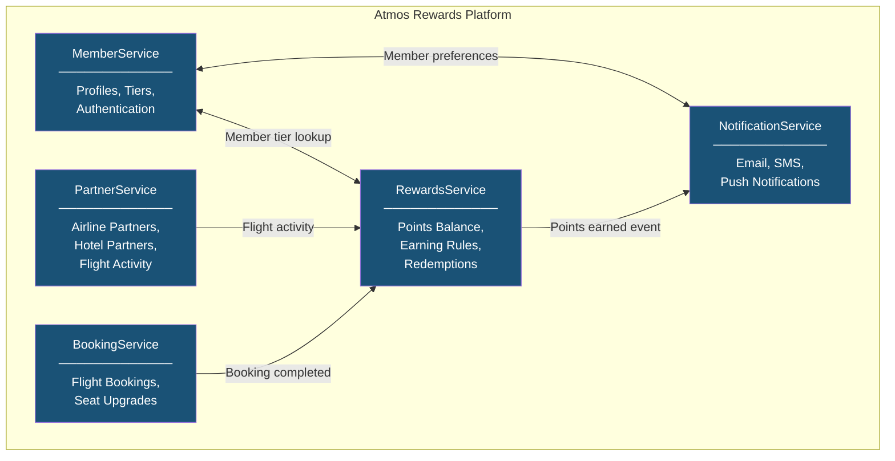
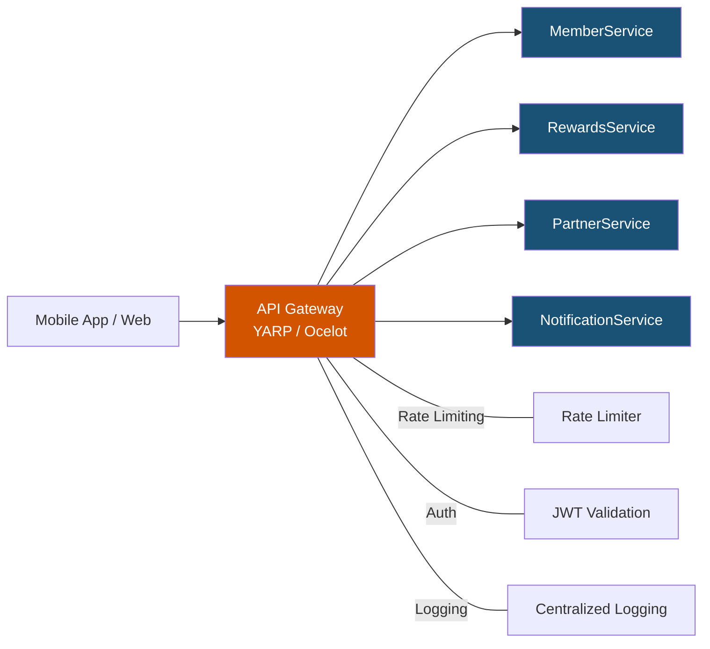
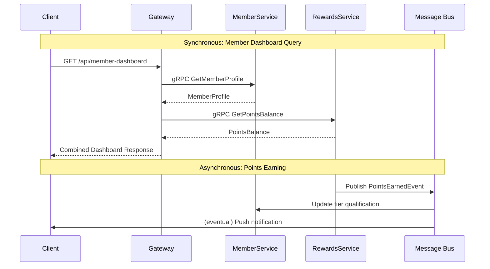
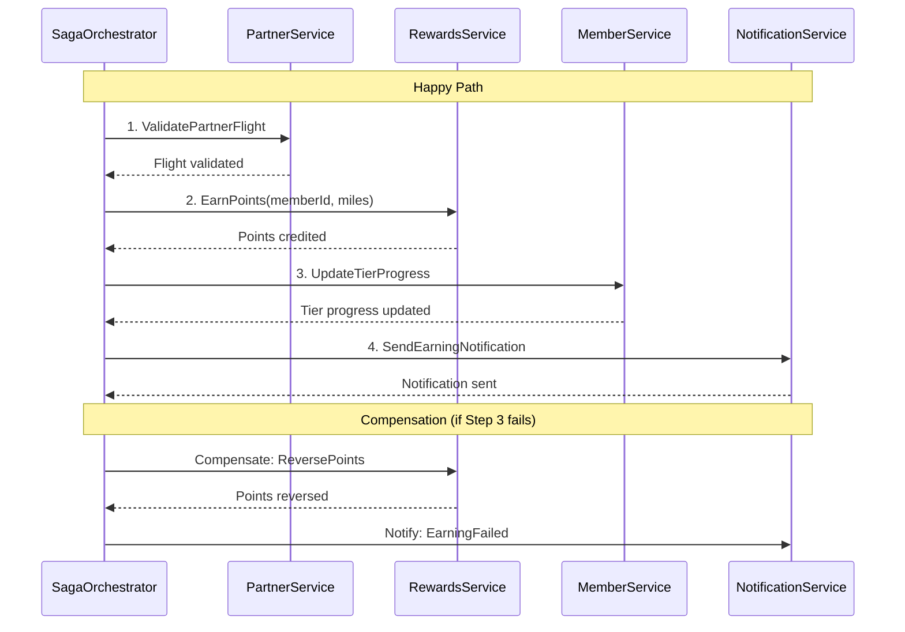
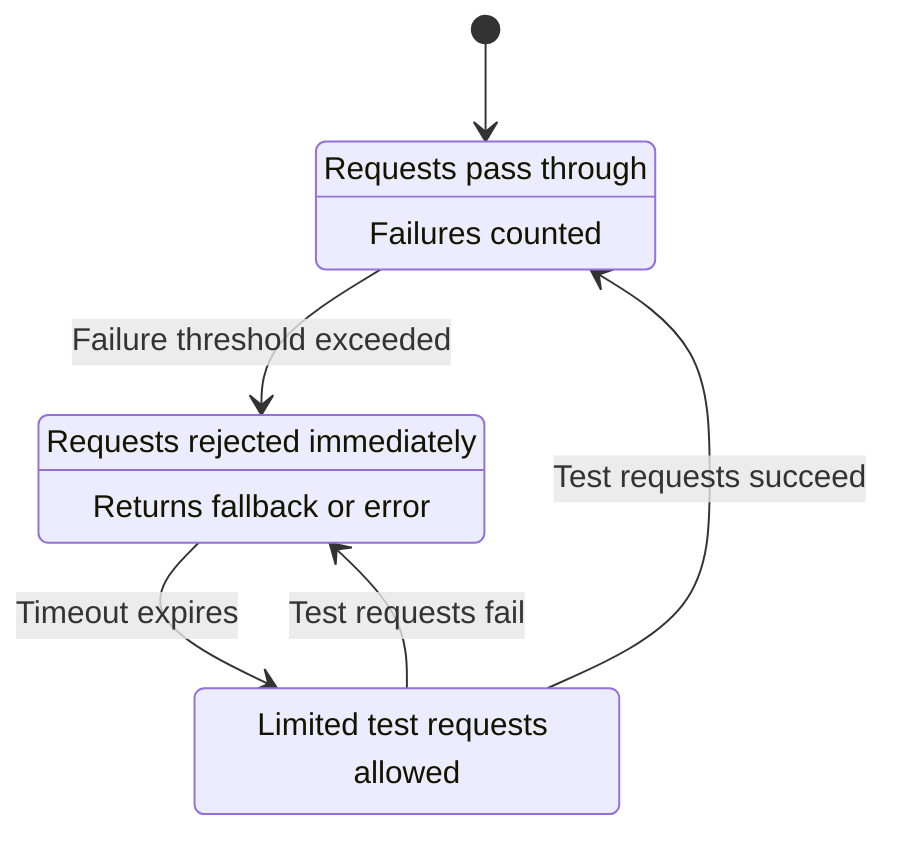
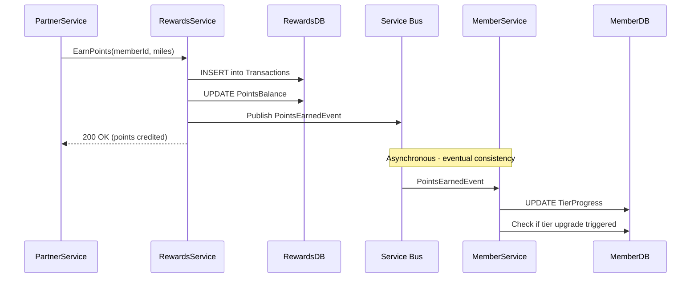

# Microservices Architecture

## Overview

Microservices architecture decomposes a system into small, independently deployable services that each own their data and business logic. For a loyalty platform like Alaska Airlines Atmos Rewards, this means services such as `MemberService`, `RewardsService`, `PartnerService`, and `NotificationService` can evolve, scale, and deploy independently. This document covers the core patterns, trade-offs, and implementation details relevant to building and maintaining such a platform.

---

## 1. Microservices vs Monolith

### Trade-offs

| Aspect | Monolith | Microservices |
|---|---|---|
| **Deployment** | Single unit, all-or-nothing releases | Independent deployments per service |
| **Scaling** | Scale entire application | Scale individual services based on load |
| **Data management** | Shared database, strong consistency | Database per service, eventual consistency |
| **Team autonomy** | Tight coupling between teams | Teams own services end-to-end |
| **Complexity** | Simpler infrastructure, harder code boundaries | Distributed system complexity, clearer domain boundaries |
| **Testing** | Easier integration testing | Requires contract testing, integration environments |
| **Latency** | In-process calls | Network calls between services |

### When to choose each

- **Monolith first**: Small team, unclear domain boundaries, early product stage, need to iterate quickly.
- **Microservices**: Well-understood domain boundaries, independent scaling requirements, multiple teams working in parallel, need for technology diversity.
- **Modular monolith**: A middle ground -- enforce bounded contexts within a single deployable unit, then extract services when the need arises.

---

## 2. Service Decomposition

Domain-driven design (DDD) guides decomposition by identifying bounded contexts. Each bounded context maps to a microservice that owns its domain logic and data.

### Atmos Rewards Bounded Contexts



### Decomposition principles

- **Single responsibility**: Each service owns one business capability.
- **Loose coupling**: Services interact through well-defined APIs or events, not shared databases.
- **High cohesion**: Related data and behavior stay together (e.g., points balance and earning rules both live in `RewardsService`).
- **Data ownership**: `MemberService` owns member profiles; `RewardsService` owns points data. No shared tables.

---

## 3. API Gateway Pattern

The API Gateway sits between clients and backend services. It handles routing, request aggregation, authentication, rate limiting, and cross-cutting concerns.

### Gateway architecture



### Responsibilities

- **Routing**: Forward `/api/members/*` to `MemberService`, `/api/rewards/*` to `RewardsService`.
- **Aggregation**: A single `/api/member-dashboard` call fetches member profile from `MemberService` and points balance from `RewardsService`, combining the response.
- **Rate limiting**: Protect services from abuse (e.g., 100 requests/minute per API key).
- **Authentication**: Validate JWT tokens at the gateway so individual services don't need to.
- **YARP vs Ocelot**: YARP (Yet Another Reverse Proxy) is Microsoft's high-performance proxy, better suited for .NET 6+ and high-throughput scenarios. Ocelot is simpler to configure for straightforward routing.

---

## 4. Service Communication

### Synchronous vs Asynchronous

| Aspect | Synchronous (HTTP/gRPC) | Asynchronous (Message Queue) |
|---|---|---|
| **Coupling** | Temporal coupling -- caller waits | Decoupled -- fire and forget |
| **Latency** | Immediate response | Eventual processing |
| **Failure handling** | Caller must handle failures directly | Messages retry from queue |
| **Use case** | Queries, real-time lookups | Events, long-running workflows |
| **Example** | Member tier lookup via gRPC | "Points Earned" event via Azure Service Bus |

### Communication flow



### gRPC service definition for member tier lookup

gRPC uses Protocol Buffers for strongly-typed, high-performance service contracts. It is well-suited for internal service-to-service calls where performance matters.

```protobuf
syntax = "proto3";

option csharp_namespace = "AtmosRewards.MemberService.Grpc";

package member;

service MemberTierService {
  rpc GetMemberTier (MemberTierRequest) returns (MemberTierResponse);
  rpc GetMemberProfile (MemberProfileRequest) returns (MemberProfileResponse);
}

message MemberTierRequest {
  string member_id = 1;
}

message MemberTierResponse {
  string member_id = 1;
  string tier = 2;               // MVP, MVP Gold, MVP Gold 75K
  int32 qualifying_miles = 3;
  int32 qualifying_segments = 4;
  string tier_expiration_date = 5;
}

message MemberProfileRequest {
  string member_id = 1;
}

message MemberProfileResponse {
  string member_id = 1;
  string first_name = 2;
  string last_name = 3;
  string email = 4;
  string tier = 5;
  int64 total_points = 6;
}
```

### C# gRPC client usage

```csharp
public class MemberTierClient
{
    private readonly MemberTierService.MemberTierServiceClient _client;

    public MemberTierClient(MemberTierService.MemberTierServiceClient client)
    {
        _client = client;
    }

    /// Retrieve the current tier and qualifying mile data for a member.
    public async Task<MemberTierResponse> GetTierAsync(string memberId)
    {
        var request = new MemberTierRequest { MemberId = memberId };
        var response = await _client.GetMemberTierAsync(request);
        return response;
    }
}
```

---

## 5. Saga Pattern

The Saga pattern manages distributed transactions across multiple services without using two-phase commit. Each step has a compensating action that undoes its effect if a later step fails.

### Choreography vs Orchestration

| Aspect | Choreography | Orchestration |
|---|---|---|
| **Coordination** | Each service listens for events and reacts | A central orchestrator directs the flow |
| **Coupling** | Services know about each other's events | Services only know the orchestrator |
| **Visibility** | Hard to trace the full flow | Orchestrator provides a single view |
| **Complexity** | Simpler for 2-3 steps | Better for 4+ steps or complex branching |
| **Best for** | Simple, linear workflows | Complex workflows with conditional logic |

### Earning points from a partner flight (Orchestration)



### Saga orchestrator implementation

```csharp
public class EarnPointsSagaOrchestrator
{
    private readonly IPartnerService _partnerService;
    private readonly IRewardsService _rewardsService;
    private readonly IMemberService _memberService;
    private readonly INotificationService _notificationService;
    private readonly ILogger<EarnPointsSagaOrchestrator> _logger;

    public EarnPointsSagaOrchestrator(
        IPartnerService partnerService,
        IRewardsService rewardsService,
        IMemberService memberService,
        INotificationService notificationService,
        ILogger<EarnPointsSagaOrchestrator> logger)
    {
        _partnerService = partnerService;
        _rewardsService = rewardsService;
        _memberService = memberService;
        _notificationService = notificationService;
        _logger = logger;
    }

    /// Execute the full earn-points saga for a partner flight activity.
    public async Task<SagaResult> ExecuteAsync(EarnPointsRequest request)
    {
        string? transactionId = null;

        try
        {
            // Step 1: Validate the partner flight
            var flightValidation = await _partnerService
                .ValidateFlightAsync(request.PartnerCode, request.FlightNumber,
                    request.FlightDate, request.MemberId);

            if (!flightValidation.IsValid)
                return SagaResult.Failure("Flight validation failed",
                    flightValidation.Reason);

            // Step 2: Credit points to the member
            var earnResult = await _rewardsService
                .EarnPointsAsync(request.MemberId, flightValidation.EligibleMiles,
                    EarningSource.PartnerFlight, request.PartnerCode);

            transactionId = earnResult.TransactionId;

            // Step 3: Update tier qualification progress
            await _memberService
                .UpdateTierProgressAsync(request.MemberId,
                    flightValidation.QualifyingMiles,
                    flightValidation.QualifyingSegments);

            // Step 4: Send notification
            await _notificationService
                .SendPointsEarnedAsync(request.MemberId, earnResult.PointsEarned,
                    earnResult.NewBalance, request.PartnerCode);

            return SagaResult.Success(earnResult.TransactionId,
                earnResult.PointsEarned);
        }
        catch (Exception ex)
        {
            _logger.LogError(ex,
                "Earn points saga failed for member {MemberId}. " +
                "Initiating compensation.", request.MemberId);

            await CompensateAsync(transactionId, request.MemberId);
            return SagaResult.Failure("Saga failed", ex.Message);
        }
    }

    /// Reverse the effects of a failed saga by undoing completed steps.
    private async Task CompensateAsync(string? transactionId, string memberId)
    {
        if (transactionId != null)
        {
            try
            {
                await _rewardsService.ReversePointsAsync(transactionId);
                _logger.LogInformation(
                    "Compensated: reversed points for transaction {TransactionId}",
                    transactionId);
            }
            catch (Exception ex)
            {
                _logger.LogCritical(ex,
                    "COMPENSATION FAILED for transaction {TransactionId}. " +
                    "Manual intervention required.", transactionId);
            }
        }

        await _notificationService
            .SendEarningFailedAsync(memberId,
                "We were unable to process your recent flight activity. " +
                "Please allow 24-48 hours for reprocessing.");
    }
}
```

---

## 6. Circuit Breaker Pattern

The Circuit Breaker prevents a service from repeatedly calling a failing downstream dependency. It has three states:

- **Closed**: Requests flow normally. Failures are counted.
- **Open**: Requests are immediately rejected without calling the downstream service. A timer runs.
- **Half-Open**: After the timer expires, a limited number of test requests are allowed through. If they succeed, the circuit closes. If they fail, it reopens.

### State diagram



### Polly circuit breaker for a partner API call

Polly is the standard .NET resilience library. It provides policies for retries, circuit breaking, timeouts, and fallbacks that can be composed together.

```csharp
using Polly;
using Polly.CircuitBreaker;
using Polly.Extensions.Http;

public static class PartnerApiResiliencePolicy
{
    /// Build a combined retry + circuit breaker + timeout policy for partner API calls.
    public static IAsyncPolicy<HttpResponseMessage> CreatePolicy(
        ILogger logger)
    {
        // Retry transient failures up to 3 times with exponential backoff
        var retryPolicy = HttpPolicyExtensions
            .HandleTransientHttpError()
            .WaitAndRetryAsync(
                retryCount: 3,
                sleepDurationProvider: attempt =>
                    TimeSpan.FromSeconds(Math.Pow(2, attempt)),
                onRetry: (outcome, delay, attempt, _) =>
                {
                    logger.LogWarning(
                        "Retry {Attempt} for partner API after {Delay}s. " +
                        "Status: {StatusCode}",
                        attempt, delay.TotalSeconds,
                        outcome.Result?.StatusCode);
                });

        // Circuit breaker: open after 5 failures in 30 seconds,
        // stay open for 60 seconds before trying half-open
        var circuitBreakerPolicy = HttpPolicyExtensions
            .HandleTransientHttpError()
            .AdvancedCircuitBreakerAsync(
                failureThreshold: 0.5,       // 50% failure rate
                samplingDuration: TimeSpan.FromSeconds(30),
                minimumThroughput: 5,         // At least 5 requests before evaluating
                durationOfBreak: TimeSpan.FromSeconds(60),
                onBreak: (outcome, duration) =>
                {
                    logger.LogError(
                        "Circuit OPEN for partner API. " +
                        "Duration: {Duration}s. Last status: {StatusCode}",
                        duration.TotalSeconds,
                        outcome.Result?.StatusCode);
                },
                onReset: () =>
                {
                    logger.LogInformation("Circuit CLOSED for partner API. " +
                        "Resuming normal operations.");
                },
                onHalfOpen: () =>
                {
                    logger.LogInformation("Circuit HALF-OPEN for partner API. " +
                        "Testing with limited requests.");
                });

        // Timeout: fail fast if a single call takes more than 10 seconds
        var timeoutPolicy = Policy.TimeoutAsync<HttpResponseMessage>(
            TimeSpan.FromSeconds(10));

        // Compose: retry wraps circuit breaker wraps timeout
        // Order matters: retry is outermost, timeout is innermost
        return Policy.WrapAsync(retryPolicy, circuitBreakerPolicy, timeoutPolicy);
    }
}

// Registration in DI container
public static class ServiceCollectionExtensions
{
    /// Register the PartnerService HTTP client with resilience policies.
    public static IServiceCollection AddPartnerServiceClient(
        this IServiceCollection services)
    {
        services.AddHttpClient<IPartnerService, PartnerServiceClient>(client =>
        {
            client.BaseAddress = new Uri("https://partners-api.alaskaair.com");
            client.DefaultRequestHeaders.Add("Accept", "application/json");
        })
        .AddPolicyHandler((provider, _) =>
        {
            var logger = provider
                .GetRequiredService<ILogger<PartnerServiceClient>>();
            return PartnerApiResiliencePolicy.CreatePolicy(logger);
        });

        return services;
    }
}
```

---

## 7. Service Discovery and Health Checks

In a microservices environment, services need to find each other (service discovery) and the platform needs to know if services are healthy (health checks).

### Service discovery approaches

- **Client-side discovery**: The client queries a service registry (e.g., Consul, Eureka) and picks an instance. The client handles load balancing.
- **Server-side discovery**: A load balancer or API gateway queries the registry. The client just calls a known endpoint. Kubernetes services work this way.
- **DNS-based**: Kubernetes provides built-in DNS (e.g., `memberservice.rewards.svc.cluster.local`).

### Health check implementation

ASP.NET Core has built-in health check middleware. Health checks verify that the service itself and its dependencies are operational.

```csharp
// Startup / Program.cs configuration
public static class HealthCheckConfiguration
{
    /// Register all health checks for the RewardsService.
    public static IServiceCollection AddRewardsHealthChecks(
        this IServiceCollection services, IConfiguration config)
    {
        services.AddHealthChecks()
            // Check the service's own database
            .AddSqlServer(
                connectionString: config.GetConnectionString("RewardsDb")!,
                name: "rewards-database",
                tags: new[] { "db", "critical" })
            // Check the message bus connection
            .AddAzureServiceBusTopic(
                connectionString: config.GetConnectionString("ServiceBus")!,
                topicName: "rewards-events",
                name: "service-bus",
                tags: new[] { "messaging", "critical" })
            // Check a downstream dependency
            .AddUrlGroup(
                uri: new Uri("https://member-service.internal/health/live"),
                name: "member-service",
                tags: new[] { "downstream" })
            // Custom health check for cache
            .AddCheck<RedisHealthCheck>("redis-cache",
                tags: new[] { "cache" });

        return services;
    }

    /// Map health check endpoints with filtering by tag.
    public static WebApplication MapRewardsHealthChecks(
        this WebApplication app)
    {
        // Liveness: is the process running?
        // Kubernetes uses this to decide whether to restart the pod
        app.MapHealthChecks("/health/live", new HealthCheckOptions
        {
            Predicate = _ => false  // No dependency checks, just "am I running?"
        });

        // Readiness: can the service handle requests?
        // Kubernetes uses this to decide whether to route traffic to the pod
        app.MapHealthChecks("/health/ready", new HealthCheckOptions
        {
            Predicate = check => check.Tags.Contains("critical"),
            ResponseWriter = WriteDetailedResponse
        });

        // Startup: has the service finished initializing?
        app.MapHealthChecks("/health/startup", new HealthCheckOptions
        {
            Predicate = check => check.Tags.Contains("critical"),
        });

        return app;
    }

    /// Write a JSON response with individual health check details.
    private static Task WriteDetailedResponse(
        HttpContext context, HealthReport report)
    {
        context.Response.ContentType = "application/json";

        var response = new
        {
            status = report.Status.ToString(),
            duration = report.TotalDuration.TotalMilliseconds,
            checks = report.Entries.Select(e => new
            {
                name = e.Key,
                status = e.Value.Status.ToString(),
                duration = e.Value.Duration.TotalMilliseconds,
                description = e.Value.Description,
                error = e.Value.Exception?.Message
            })
        };

        return context.Response.WriteAsJsonAsync(response);
    }
}
```

---

## 8. Data Management

### Database per service

Each microservice owns its database. No other service accesses that database directly. This ensures loose coupling and allows each service to choose the storage technology that fits its needs.

| Service | Database | Rationale |
|---|---|---|
| MemberService | SQL Server | Relational data, strong consistency for profiles |
| RewardsService | SQL Server | Transactional integrity for points balances |
| PartnerService | PostgreSQL | Flexible schema for varying partner configurations |
| NotificationService | CosmosDB | High-write throughput, flexible document structure |

### Eventual consistency

When `RewardsService` credits points, `MemberService` needs to know about it for tier calculations. Rather than a synchronous call (which creates coupling), `RewardsService` publishes a `PointsEarnedEvent` and `MemberService` subscribes to it. The data is eventually consistent -- there is a brief window where `RewardsService` has the new balance but `MemberService` has not yet updated tier progress.

### Data consistency flow



### Strategies for handling eventual consistency

- **Idempotency**: Every message handler must be idempotent. If `PointsEarnedEvent` is delivered twice, the second processing should have no effect. Use a unique `TransactionId` to detect duplicates.
- **Outbox pattern**: Write the event to an outbox table in the same database transaction as the business data. A separate process publishes outbox events to the message bus. This guarantees that either both the data change and the event happen, or neither does.
- **Compensating transactions**: If a downstream step fails, issue a compensating action (as in the Saga pattern).

---

## Interview Questions

### Foundational

1. **What are the key differences between microservices and a monolithic architecture? When would you choose one over the other?**
   - Cover: independent deployment, scaling, team autonomy, operational complexity, data management. Monolith for small teams or unclear domains; microservices for well-defined bounded contexts and independent scaling needs.

2. **How do you decompose a monolith into microservices? What principles guide the boundaries?**
   - Cover: bounded contexts from DDD, single responsibility, loose coupling, high cohesion, data ownership. Start with the domain model, not the technical layers.

3. **What is the role of an API Gateway? What problems does it solve?**
   - Cover: routing, aggregation, authentication, rate limiting, protocol translation. Single entry point for clients. Mention YARP or Ocelot in the .NET ecosystem.

### Communication and Data

4. **When would you use synchronous communication (HTTP/gRPC) vs asynchronous messaging between services?**
   - Synchronous for queries that need an immediate response (e.g., member tier lookup during booking). Asynchronous for events where the caller does not need to wait (e.g., sending a notification after points are earned).

5. **What is eventual consistency and how do you handle it in a microservices system?**
   - Cover: CAP theorem basics, idempotent consumers, outbox pattern, compensating transactions. Give the example of points being credited in `RewardsService` while `MemberService` tier progress updates asynchronously.

6. **Explain the database-per-service pattern. What challenges does it introduce?**
   - Cover: no cross-service joins, data duplication, need for events to synchronize state, choosing the right database per service. Contrast with shared database anti-pattern.

### Resilience Patterns

7. **Explain the Circuit Breaker pattern. What are its states and why is it important?**
   - Cover: Closed, Open, Half-Open states. Prevents cascading failures. Allows failing dependencies to recover. Mention Polly in .NET. Discuss the difference between basic and advanced circuit breaker (failure count vs failure rate).

8. **What is the Saga pattern? Compare choreography and orchestration approaches.**
   - Choreography: services react to events, no central coordinator, simpler but harder to trace. Orchestration: a central orchestrator directs the flow, easier to reason about, better for complex workflows. Give the earn-points example.

9. **How would you handle a situation where the PartnerService is down and a member is trying to earn points from a recent flight?**
   - Cover: circuit breaker to fail fast, retry with backoff, message queue to buffer requests, dead-letter queue for persistent failures, manual reconciliation process, user-facing messaging ("points will appear within 24-48 hours").

### Operational

10. **How do you implement health checks in a microservices system? What is the difference between liveness and readiness probes?**
    - Liveness: is the process running? Failure triggers a restart. Readiness: can the service handle traffic? Failure removes the pod from load balancing. Startup: has initialization completed?

11. **How would you trace a request that spans multiple services?**
    - Cover: distributed tracing (OpenTelemetry), correlation IDs propagated through HTTP headers and message metadata, centralized logging (ELK stack, Application Insights), service mesh observability.

12. **What strategies do you use to deploy microservices safely?**
    - Cover: blue-green deployment, canary releases, feature flags, rolling updates, database migration strategies (backward-compatible schema changes), contract testing between services.
