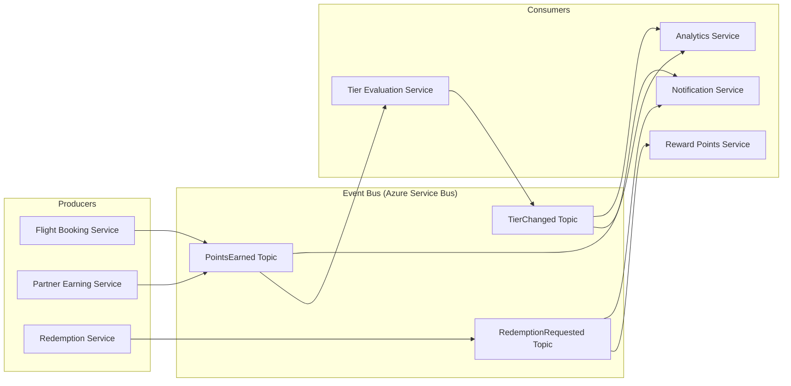
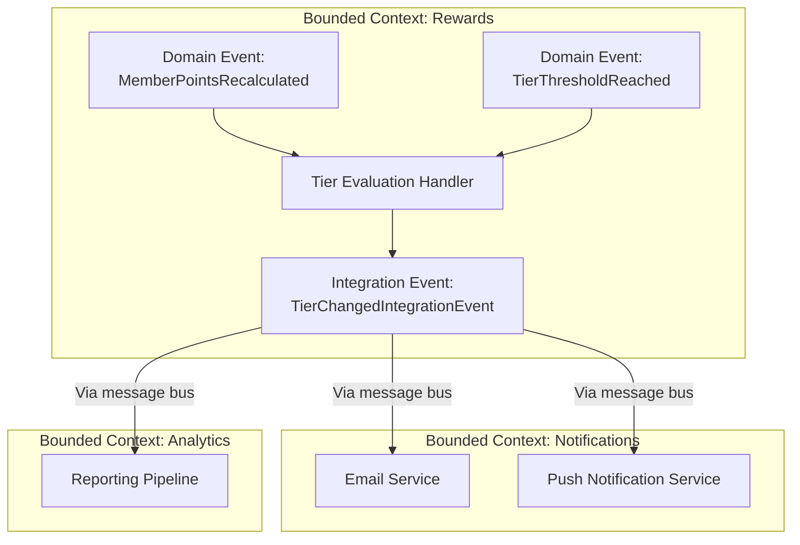
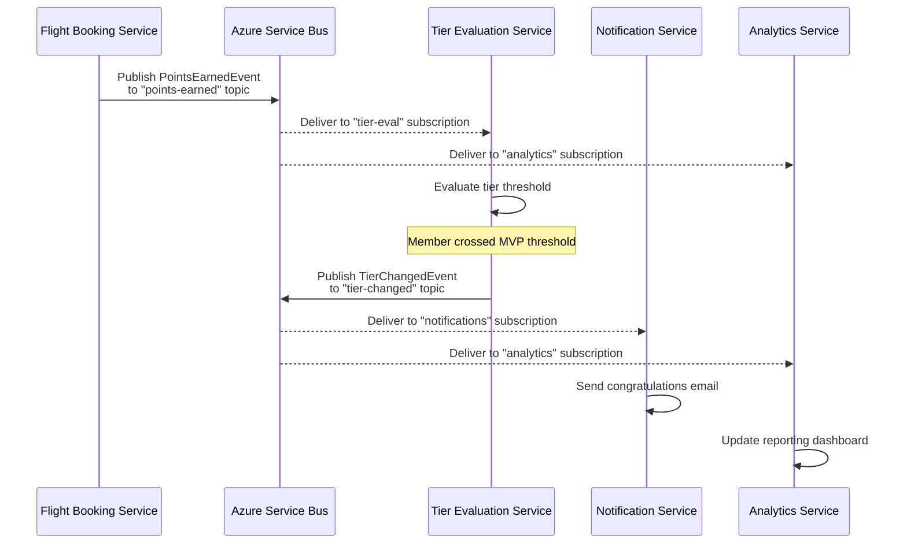
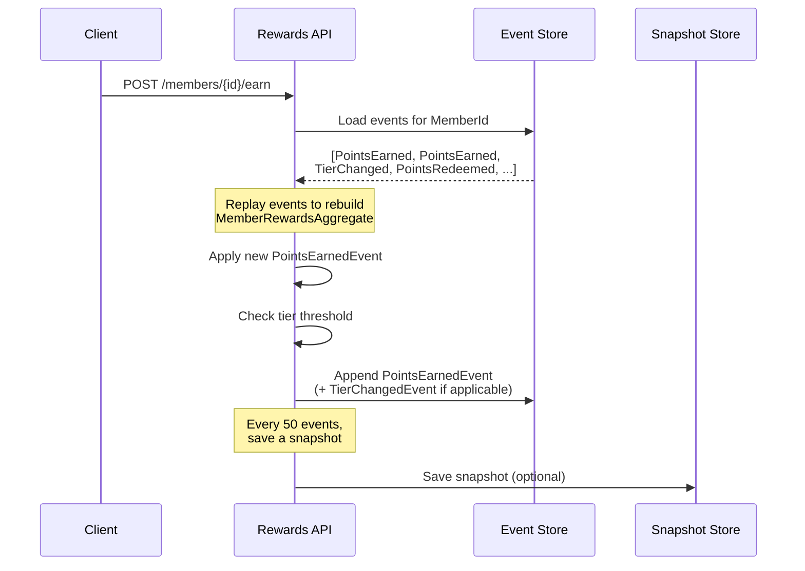
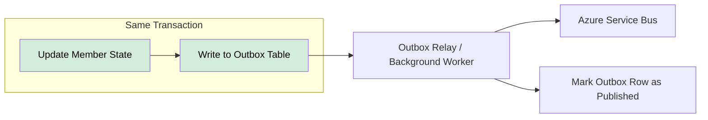
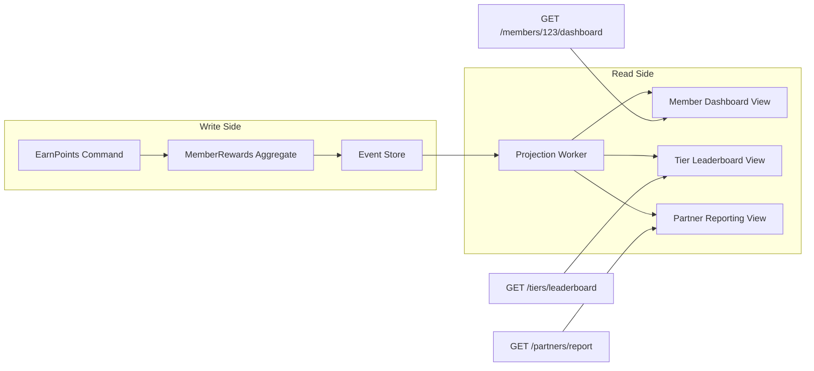
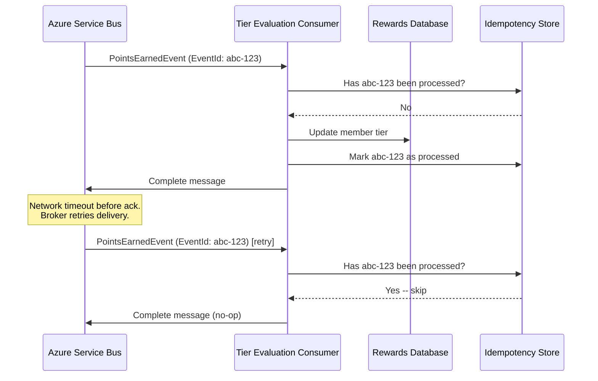

# Event-Driven Architecture

## Overview

Event-driven architecture (EDA) is a design paradigm where the flow of the program is determined by events -- significant changes in state that the system produces, detects, and reacts to. Instead of services calling each other directly, they communicate by publishing and subscribing to events, achieving loose coupling and high scalability. For the Atmos Rewards platform, this means that when a member earns points on a flight, a `PointsEarnedEvent` can trigger tier evaluation, partner notifications, and analytics updates independently, without the originating service knowing about any of them.

This document covers the core patterns, implementation strategies, and pitfalls of event-driven systems in .NET, all illustrated with the Atmos Rewards domain.



## 1. Events as First-Class Citizens

In an event-driven system, events are not afterthoughts or logging concerns. They are part of the domain model. An event represents something that has already happened -- it is a fact stated in the past tense.

**Key principles:**

| Principle | Description |
|-----------|-------------|
| Immutability | Events describe facts. Once published, they never change. |
| Past tense naming | `PointsEarned`, `TierChanged`, `RedemptionRequested` -- not `EarnPoints` or `ChangeTier`. |
| Self-contained | An event carries all the data a consumer needs to react, so consumers do not need to call back to the producer. |
| Temporal ordering | Events have timestamps and often sequence numbers so consumers can reason about order. |

**Benefits for Atmos Rewards:**

- **Loose coupling** -- The flight booking service does not need to know about tier evaluation logic.
- **Scalability** -- Consumers can be scaled independently based on their own throughput needs.
- **Extensibility** -- Adding a new consumer (e.g., a fraud detection service) requires zero changes to existing producers.
- **Resilience** -- If the notification service is down, events queue up and are processed when it recovers.

## 2. Domain Events vs Integration Events

Not all events serve the same purpose. The distinction between domain events and integration events is critical for maintaining clean boundaries.



| Aspect | Domain Events | Integration Events |
|--------|--------------|-------------------|
| Scope | Within a single bounded context | Across bounded contexts or services |
| Transport | In-process (MediatR, in-memory bus) | Message broker (Azure Service Bus, RabbitMQ) |
| Coupling | Can reference domain entities directly | Must use serializable DTOs / contracts |
| Consistency | Part of the same transaction | Eventually consistent |
| Schema | Can evolve freely within the team | Requires versioning strategy |
| Example | `MemberPointsRecalculated` | `TierChangedIntegrationEvent` |

### Domain Event Base Class

```csharp
public abstract class DomainEvent
{
    public Guid EventId { get; } = Guid.NewGuid();
    public DateTime OccurredOn { get; } = DateTime.UtcNow;
}

public class PointsEarnedEvent : DomainEvent
{
    public Guid MemberId { get; }
    public int PointsAmount { get; }
    public string Source { get; }
    public string FlightNumber { get; }

    public PointsEarnedEvent(
        Guid memberId, int pointsAmount, string source, string flightNumber)
    {
        MemberId = memberId;
        PointsAmount = pointsAmount;
        Source = source;
        FlightNumber = flightNumber;
    }
}

public class TierChangedEvent : DomainEvent
{
    public Guid MemberId { get; }
    public TierLevel PreviousTier { get; }
    public TierLevel NewTier { get; }

    public TierChangedEvent(
        Guid memberId, TierLevel previousTier, TierLevel newTier)
    {
        MemberId = memberId;
        PreviousTier = previousTier;
        NewTier = newTier;
    }
}

public class RedemptionRequestedEvent : DomainEvent
{
    public Guid MemberId { get; }
    public Guid RedemptionId { get; }
    public int PointsToRedeem { get; }
    public string RewardDescription { get; }

    public RedemptionRequestedEvent(
        Guid memberId, Guid redemptionId, int pointsToRedeem, string rewardDescription)
    {
        MemberId = memberId;
        RedemptionId = redemptionId;
        PointsToRedeem = pointsToRedeem;
        RewardDescription = rewardDescription;
    }
}

public enum TierLevel
{
    Standard,
    Gold,       // 20,000+ miles
    MVP,        // 50,000+ miles
    MVPGold     // 75,000+ miles
}
```

### Integration Event Contract

```csharp
// Shared contract published to a NuGet package or schema registry.
// Consumers in other bounded contexts depend on this, not on domain internals.
public record TierChangedIntegrationEvent
{
    public Guid EventId { get; init; }
    public DateTime OccurredOn { get; init; }
    public Guid MemberId { get; init; }
    public string PreviousTier { get; init; } = default!;
    public string NewTier { get; init; } = default!;
    public int CurrentMilesBalance { get; init; }
}
```

## 3. Pub/Sub Pattern

The publish-subscribe pattern decouples producers from consumers through a message broker. Producers publish events to topics. Consumers subscribe to the topics they care about and process events independently.



### MassTransit Consumer Setup

MassTransit is a popular open-source abstraction over Azure Service Bus and RabbitMQ in .NET. It handles serialization, retry policies, error queues, and consumer lifecycle.

```csharp
// Program.cs -- Configuring MassTransit with Azure Service Bus
builder.Services.AddMassTransit(x =>
{
    // Register consumers from the assembly
    x.AddConsumer<TierEvaluationConsumer>();
    x.AddConsumer<PartnerNotificationConsumer>();

    x.UsingAzureServiceBus((context, cfg) =>
    {
        cfg.Host(builder.Configuration.GetConnectionString("AzureServiceBus"));

        cfg.SubscriptionEndpoint<PointsEarnedEvent>(
            "tier-evaluation-sub", e =>
        {
            e.ConfigureConsumer<TierEvaluationConsumer>(context);
            e.UseMessageRetry(r => r.Intervals(
                TimeSpan.FromSeconds(1),
                TimeSpan.FromSeconds(5),
                TimeSpan.FromSeconds(15)));
        });

        cfg.SubscriptionEndpoint<TierChangedEvent>(
            "partner-notification-sub", e =>
        {
            e.ConfigureConsumer<PartnerNotificationConsumer>(context);
        });
    });
});

// Consumer that updates member tier when points change
public class TierEvaluationConsumer : IConsumer<PointsEarnedEvent>
{
    private readonly TierEvaluationService _tierService;
    private readonly IPublishEndpoint _publisher;
    private readonly ILogger<TierEvaluationConsumer> _logger;

    public TierEvaluationConsumer(
        TierEvaluationService tierService,
        IPublishEndpoint publisher,
        ILogger<TierEvaluationConsumer> logger)
    {
        _tierService = tierService;
        _publisher = publisher;
        _logger = logger;
    }

    public async Task Consume(ConsumeContext<PointsEarnedEvent> context)
    {
        var message = context.Message;
        _logger.LogInformation(
            "Evaluating tier for member {MemberId} after earning {Points} points",
            message.MemberId, message.PointsAmount);

        var result = await _tierService.EvaluateAsync(message.MemberId);

        if (result.TierChanged)
        {
            _logger.LogInformation(
                "Member {MemberId} tier changed: {OldTier} -> {NewTier}",
                message.MemberId, result.PreviousTier, result.NewTier);

            await _publisher.Publish(new TierChangedEvent(
                message.MemberId, result.PreviousTier, result.NewTier));
        }
    }
}
```

### Raw Azure Service Bus Consumer (without MassTransit)

For cases where you need direct control over the Service Bus SDK.

```csharp
public class PointsEarnedProcessor : BackgroundService
{
    private readonly ServiceBusClient _client;
    private readonly TierEvaluationService _tierService;
    private ServiceBusProcessor? _processor;

    public PointsEarnedProcessor(
        ServiceBusClient client, TierEvaluationService tierService)
    {
        _client = client;
        _tierService = tierService;
    }

    protected override async Task ExecuteAsync(CancellationToken stoppingToken)
    {
        _processor = _client.CreateProcessor(
            topicName: "points-earned",
            subscriptionName: "tier-evaluation",
            new ServiceBusProcessorOptions
            {
                MaxConcurrentCalls = 5,
                AutoCompleteMessages = false,
                MaxAutoLockRenewalDuration = TimeSpan.FromMinutes(10)
            });

        _processor.ProcessMessageAsync += HandleMessageAsync;
        _processor.ProcessErrorAsync += HandleErrorAsync;

        await _processor.StartProcessingAsync(stoppingToken);
    }

    private async Task HandleMessageAsync(ProcessMessageEventArgs args)
    {
        var body = args.Message.Body.ToString();
        var pointsEvent = JsonSerializer.Deserialize<PointsEarnedEvent>(body);

        if (pointsEvent is not null)
        {
            await _tierService.EvaluateAsync(pointsEvent.MemberId);
        }

        // Explicitly complete the message after successful processing
        await args.CompleteMessageAsync(args.Message);
    }

    private Task HandleErrorAsync(ProcessErrorEventArgs args)
    {
        // Log error -- the SDK automatically retries based on broker config
        return Task.CompletedTask;
    }
}
```

## 4. Event Sourcing

Event sourcing stores the state of an aggregate not as a single current-state row, but as an ordered sequence of events. To get the current state, you replay all events from the beginning (or from the most recent snapshot). This gives you a complete audit trail and the ability to reconstruct state at any point in time.



### MemberRewardsAggregate with Event Sourcing

```csharp
public class MemberRewardsAggregate
{
    public Guid MemberId { get; private set; }
    public int TotalMiles { get; private set; }
    public int RedeemablePoints { get; private set; }
    public TierLevel CurrentTier { get; private set; }
    public int Version { get; private set; }

    private readonly List<DomainEvent> _uncommittedEvents = new();
    public IReadOnlyList<DomainEvent> UncommittedEvents => _uncommittedEvents;

    // Rebuild state by replaying persisted events.
    public static MemberRewardsAggregate FromHistory(
        Guid memberId, IEnumerable<DomainEvent> history)
    {
        var aggregate = new MemberRewardsAggregate { MemberId = memberId };

        foreach (var domainEvent in history)
        {
            aggregate.Apply(domainEvent);
            aggregate.Version++;
        }

        return aggregate;
    }

    // Rebuild from a snapshot and then replay events after that snapshot.
    public static MemberRewardsAggregate FromSnapshot(
        MemberRewardsSnapshot snapshot, IEnumerable<DomainEvent> eventsAfterSnapshot)
    {
        var aggregate = new MemberRewardsAggregate
        {
            MemberId = snapshot.MemberId,
            TotalMiles = snapshot.TotalMiles,
            RedeemablePoints = snapshot.RedeemablePoints,
            CurrentTier = snapshot.CurrentTier,
            Version = snapshot.Version
        };

        foreach (var domainEvent in eventsAfterSnapshot)
        {
            aggregate.Apply(domainEvent);
            aggregate.Version++;
        }

        return aggregate;
    }

    public void EarnPoints(int miles, string source, string flightNumber)
    {
        var pointsEvent = new PointsEarnedEvent(MemberId, miles, source, flightNumber);
        Apply(pointsEvent);
        _uncommittedEvents.Add(pointsEvent);

        // Check if tier should change
        var newTier = EvaluateTier(TotalMiles);
        if (newTier != CurrentTier)
        {
            var tierEvent = new TierChangedEvent(MemberId, CurrentTier, newTier);
            Apply(tierEvent);
            _uncommittedEvents.Add(tierEvent);
        }
    }

    public void RequestRedemption(Guid redemptionId, int points, string description)
    {
        if (points > RedeemablePoints)
            throw new InvalidOperationException(
                $"Insufficient points. Available: {RedeemablePoints}, Requested: {points}");

        var redemptionEvent = new RedemptionRequestedEvent(
            MemberId, redemptionId, points, description);
        Apply(redemptionEvent);
        _uncommittedEvents.Add(redemptionEvent);
    }

    // Apply routes each event type to its specific state mutation.
    private void Apply(DomainEvent domainEvent)
    {
        switch (domainEvent)
        {
            case PointsEarnedEvent e:
                TotalMiles += e.PointsAmount;
                RedeemablePoints += e.PointsAmount;
                break;

            case TierChangedEvent e:
                CurrentTier = e.NewTier;
                break;

            case RedemptionRequestedEvent e:
                RedeemablePoints -= e.PointsToRedeem;
                break;
        }
    }

    private static TierLevel EvaluateTier(int totalMiles) => totalMiles switch
    {
        >= 75_000 => TierLevel.MVPGold,
        >= 50_000 => TierLevel.MVP,
        >= 20_000 => TierLevel.Gold,
        _         => TierLevel.Standard
    };

    public void ClearUncommittedEvents() => _uncommittedEvents.Clear();
}

public record MemberRewardsSnapshot
{
    public Guid MemberId { get; init; }
    public int TotalMiles { get; init; }
    public int RedeemablePoints { get; init; }
    public TierLevel CurrentTier { get; init; }
    public int Version { get; init; }
}
```

**When to use event sourcing:**

- You need a full audit trail (regulatory compliance, financial transactions).
- You need to reconstruct state at any past point in time.
- Your domain is naturally event-centric (rewards earned, redeemed, transferred).

**When to avoid it:**

- Simple CRUD operations where current state is sufficient.
- The added complexity of event replay and snapshots is not justified.

## 5. The Outbox Pattern

One of the most dangerous problems in event-driven systems is the dual-write problem: you save state to the database and publish an event to the message broker. If either fails after the other succeeds, the system ends up in an inconsistent state. The outbox pattern solves this by writing events to an outbox table within the same database transaction, then a separate process relays those events to the message broker.



### Outbox Implementation with EF Core

```csharp
// Outbox message entity stored alongside domain data
public class OutboxMessage
{
    public Guid Id { get; set; }
    public string EventType { get; set; } = default!;
    public string Payload { get; set; } = default!;
    public DateTime CreatedAt { get; set; }
    public DateTime? ProcessedAt { get; set; }
    public int RetryCount { get; set; }
}

// DbContext includes both domain entities and the outbox table
public class RewardsDbContext : DbContext
{
    public DbSet<Member> Members => Set<Member>();
    public DbSet<RewardTransaction> RewardTransactions => Set<RewardTransaction>();
    public DbSet<OutboxMessage> OutboxMessages => Set<OutboxMessage>();

    protected override void OnModelCreating(ModelBuilder modelBuilder)
    {
        modelBuilder.Entity<OutboxMessage>(entity =>
        {
            entity.HasIndex(e => e.ProcessedAt)
                  .HasFilter("[ProcessedAt] IS NULL")
                  .HasDatabaseName("IX_OutboxMessages_Unprocessed");
        });
    }
}

// Service that earns points AND writes the event in a single transaction
public class RewardPointsService
{
    private readonly RewardsDbContext _db;
    private readonly ILogger<RewardPointsService> _logger;

    public RewardPointsService(RewardsDbContext db, ILogger<RewardPointsService> logger)
    {
        _db = db;
        _logger = logger;
    }

    public async Task EarnPointsAsync(
        Guid memberId, int miles, string source, string flightNumber)
    {
        // Use a transaction to guarantee atomicity
        await using var transaction = await _db.Database.BeginTransactionAsync();

        try
        {
            var member = await _db.Members.FindAsync(memberId)
                ?? throw new InvalidOperationException(
                    $"Member {memberId} not found");

            member.TotalMiles += miles;
            member.RedeemablePoints += miles;

            var rewardTransaction = new RewardTransaction
            {
                Id = Guid.NewGuid(),
                MemberId = memberId,
                Miles = miles,
                Source = source,
                FlightNumber = flightNumber,
                TransactionDate = DateTime.UtcNow
            };
            _db.RewardTransactions.Add(rewardTransaction);

            // Write event to the outbox in the same transaction
            var pointsEvent = new PointsEarnedEvent(
                memberId, miles, source, flightNumber);

            _db.OutboxMessages.Add(new OutboxMessage
            {
                Id = pointsEvent.EventId,
                EventType = nameof(PointsEarnedEvent),
                Payload = JsonSerializer.Serialize(pointsEvent),
                CreatedAt = DateTime.UtcNow
            });

            await _db.SaveChangesAsync();
            await transaction.CommitAsync();

            _logger.LogInformation(
                "Earned {Miles} miles for member {MemberId} with outbox event {EventId}",
                miles, memberId, pointsEvent.EventId);
        }
        catch
        {
            await transaction.RollbackAsync();
            throw;
        }
    }
}

// Background worker that relays outbox messages to the broker
public class OutboxRelayWorker : BackgroundService
{
    private readonly IServiceScopeFactory _scopeFactory;
    private readonly IPublishEndpoint _publisher;
    private readonly ILogger<OutboxRelayWorker> _logger;

    public OutboxRelayWorker(
        IServiceScopeFactory scopeFactory,
        IPublishEndpoint publisher,
        ILogger<OutboxRelayWorker> logger)
    {
        _scopeFactory = scopeFactory;
        _publisher = publisher;
        _logger = logger;
    }

    protected override async Task ExecuteAsync(CancellationToken stoppingToken)
    {
        while (!stoppingToken.IsCancellationRequested)
        {
            using var scope = _scopeFactory.CreateScope();
            var db = scope.ServiceProvider.GetRequiredService<RewardsDbContext>();

            var pendingMessages = await db.OutboxMessages
                .Where(m => m.ProcessedAt == null)
                .OrderBy(m => m.CreatedAt)
                .Take(20)
                .ToListAsync(stoppingToken);

            foreach (var message in pendingMessages)
            {
                try
                {
                    var eventObject = DeserializeEvent(
                        message.EventType, message.Payload);
                    await _publisher.Publish(eventObject, stoppingToken);

                    message.ProcessedAt = DateTime.UtcNow;
                }
                catch (Exception ex)
                {
                    message.RetryCount++;
                    _logger.LogWarning(ex,
                        "Failed to relay outbox message {MessageId}, retry #{Retry}",
                        message.Id, message.RetryCount);
                }
            }

            await db.SaveChangesAsync(stoppingToken);
            await Task.Delay(TimeSpan.FromSeconds(5), stoppingToken);
        }
    }

    private static object DeserializeEvent(string eventType, string payload)
    {
        return eventType switch
        {
            nameof(PointsEarnedEvent) =>
                JsonSerializer.Deserialize<PointsEarnedEvent>(payload)!,
            nameof(TierChangedEvent) =>
                JsonSerializer.Deserialize<TierChangedEvent>(payload)!,
            nameof(RedemptionRequestedEvent) =>
                JsonSerializer.Deserialize<RedemptionRequestedEvent>(payload)!,
            _ => throw new InvalidOperationException(
                $"Unknown event type: {eventType}")
        };
    }
}
```

## 6. CQRS Connection

Command Query Responsibility Segregation (CQRS) pairs naturally with event-driven architecture. Commands mutate state and produce events. Events feed projections that build optimized read models. The write side and read side can scale independently.



**How events connect the two sides:**

1. A command (`EarnPointsCommand`) is handled on the write side, producing a `PointsEarnedEvent`.
2. The event is appended to the event store.
3. A projection worker subscribes to new events and updates denormalized read models (e.g., a `MemberDashboardView` table optimized for the member's profile page).
4. Query handlers read directly from the optimized read models -- no joins, no complex aggregation at query time.

**Benefits for Atmos Rewards:**

- The member dashboard can read from a single denormalized row instead of joining members, transactions, and tier tables.
- The write side can enforce business rules (tier thresholds, redemption limits) without worrying about read performance.
- Read replicas can be in different databases or even different storage technologies (SQL for transactional, Redis for hot data, Elasticsearch for search).

## 7. Idempotency

In a distributed system, messages can be delivered more than once. A consumer restart, a network hiccup, or a broker retry can all cause duplicate delivery. Every event consumer must be idempotent -- processing the same event twice should produce the same result as processing it once.



**Idempotency strategies:**

| Strategy | How It Works | Trade-off |
|----------|-------------|-----------|
| Idempotency key table | Store processed event IDs in a database table. Check before processing. | Requires storage, but simple and reliable. |
| Natural idempotency | Design operations so repeating them has no effect (e.g., SET balance = X instead of INCREMENT). | Not always possible with complex business logic. |
| Deduplication at the broker | Azure Service Bus has built-in duplicate detection based on `MessageId`. | Limited time window (configurable, default 10 minutes). |
| Conditional writes | Use optimistic concurrency (ETag/version) so a duplicate write fails gracefully. | Requires version tracking on all entities. |

## 8. Event Schema Evolution

As the system evolves, event schemas change. New fields are added, old fields become irrelevant, and the meaning of fields may shift. Since events are persisted (especially with event sourcing), you must handle schema evolution carefully.

**Versioning strategies:**

| Strategy | Description | Example |
|----------|-------------|---------|
| Always additive | Only add new optional fields. Never remove or rename existing fields. | Add `CabinClass` to `PointsEarnedEvent` without removing anything. |
| Explicit version number | Include a `Version` property in events. Consumers switch on version. | `PointsEarnedEvent` v1 vs v2. |
| Event type per version | Create new types for breaking changes. Keep consumers for old types. | `PointsEarnedEventV2` alongside `PointsEarnedEvent`. |
| Upcasting | Transform old events to the latest schema at read time. | A deserializer maps v1 events to v2 shape on the fly. |

**Best practices:**

- Prefer additive changes. They are backwards compatible by default.
- Use nullable types for new fields so old events deserialize without error.
- If a breaking change is unavoidable, introduce a new event type and deprecate the old one gradually.
- Test deserialization of old events with every schema change.
- Document the event catalog with a schema registry or shared contract NuGet package.

**Example of additive evolution:**

```
v1: { MemberId, PointsAmount, Source, FlightNumber }
v2: { MemberId, PointsAmount, Source, FlightNumber, CabinClass?, BonusMultiplier? }
v3: { MemberId, PointsAmount, Source, FlightNumber, CabinClass?, BonusMultiplier?, PartnerCode? }
```

Consumers written for v1 ignore the new nullable fields. Consumers that need `CabinClass` handle the case where it is null (for events written before v2).

---

## Interview Questions

### Conceptual

1. **What is event-driven architecture and why would you use it for a loyalty rewards system?**
   Events represent facts about state changes (points earned, tier changed). EDA decouples services so the flight booking system does not need to know about tier evaluation, notifications, or analytics. This enables independent scaling, resilience (events queue when a consumer is down), and extensibility (new consumers can be added without modifying producers).

2. **What is the difference between a domain event and an integration event?**
   Domain events are used within a single bounded context, often dispatched in-process via MediatR. They can reference domain objects directly. Integration events cross service boundaries via a message broker, must use serializable contracts, and require schema versioning. Domain events participate in the same transaction; integration events are eventually consistent.

3. **Explain the dual-write problem and how the outbox pattern solves it.**
   When you update a database and publish a message, either operation can fail after the other succeeds, leaving the system inconsistent. The outbox pattern writes the event to an outbox table in the same database transaction as the state change. A background relay then publishes outbox rows to the broker. If the relay fails, it retries from the outbox. If the broker receives a duplicate, idempotency handles it.

4. **When would you choose event sourcing over a traditional state-based persistence model?**
   Event sourcing is a good fit when you need a complete audit trail, the ability to reconstruct past state, or when the domain is naturally modeled as a series of events (financial transactions, loyalty points). It adds complexity (event replay, snapshots, projection management), so it should be avoided for simple CRUD domains where current state is sufficient.

5. **How does CQRS complement event-driven architecture?**
   Commands produce events on the write side. Those events feed projections that build optimized, denormalized read models on the read side. This separation lets you optimize writes for consistency and business rules while optimizing reads for query performance. In a rewards system, the write side enforces tier thresholds while the read side serves a pre-built member dashboard without complex joins.

### Practical / Scenario-Based

6. **A consumer processes a `PointsEarnedEvent` and updates the member tier, but the message acknowledgment fails. The broker redelivers the event. What happens, and how do you prevent issues?**
   Without idempotency, the tier evaluation runs again and might produce a duplicate `TierChangedEvent`. To prevent this, check an idempotency store (e.g., a table of processed event IDs) before processing. If the event ID has already been handled, skip it and acknowledge the message.

7. **You need to add a `CabinClass` field to `PointsEarnedEvent`. How do you handle this without breaking existing consumers?**
   Make `CabinClass` nullable (additive change). Existing consumers that do not need this field will deserialize the event without error -- the new field is simply null for old events. Consumers that need `CabinClass` handle the null case gracefully for historical events.

8. **The notification service has been down for two hours. What happens to the `TierChangedEvent` messages?**
   With Azure Service Bus, messages remain in the subscription queue with a configurable TTL (time-to-live). When the notification service comes back online, it processes the backlog. The events are not lost. If the TTL expires before the service recovers, messages move to the dead-letter queue for manual inspection.

9. **How would you design the event flow for a partner airline (e.g., American Airlines) crediting miles to an Alaska member?**
   The Partner Earning Service receives the credit request, validates the partner and member, and writes the transaction plus a `PointsEarnedEvent` to the outbox. The relay publishes it. The Tier Evaluation Service consumes it and checks if the new miles push the member to a higher tier. If so, it publishes a `TierChangedEvent`. The Notification Service sends the member an email. All services are decoupled -- the partner integration does not know about tiers or notifications.

10. **Your event store has a member with 100,000 events. How do you keep aggregate loading performant?**
    Use snapshots. Periodically (e.g., every 50 or 100 events), save the aggregate's current state as a snapshot. When loading, fetch the most recent snapshot and only replay events that occurred after it. This bounds the replay cost regardless of total event count.

### Design Exercise

11. **Design an event-driven system for Atmos Rewards redemption flow.**
    Sketch the events (`RedemptionRequestedEvent`, `PointsDeductedEvent`, `RedemptionFulfilledEvent`, `RedemptionFailedEvent`), identify the services involved (Redemption Service, Points Service, Fulfillment Service), describe the saga or choreography that coordinates them, and explain how you handle partial failures (e.g., points deducted but fulfillment fails -- you publish a `RedemptionFailedEvent` that triggers a compensating `PointsRefundedEvent`).
