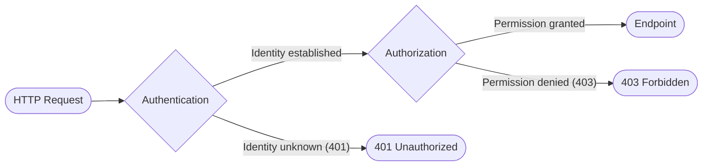
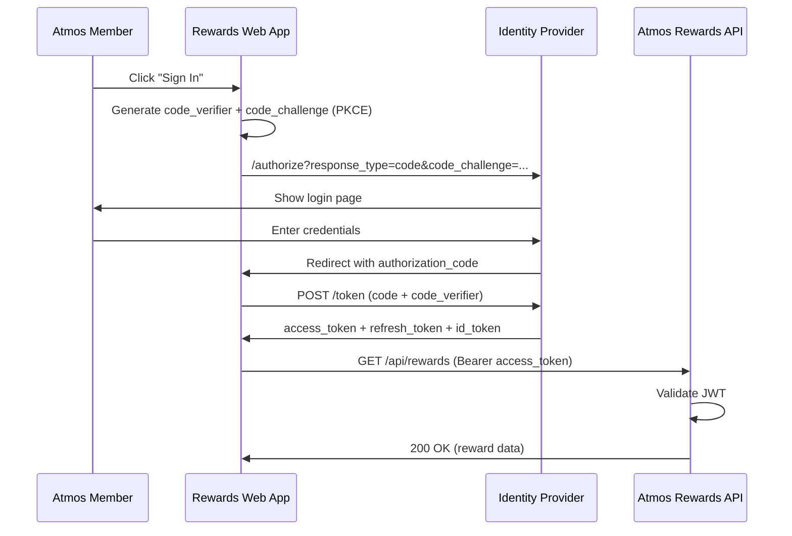
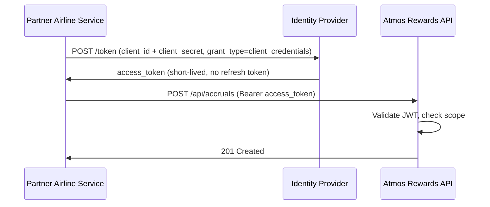
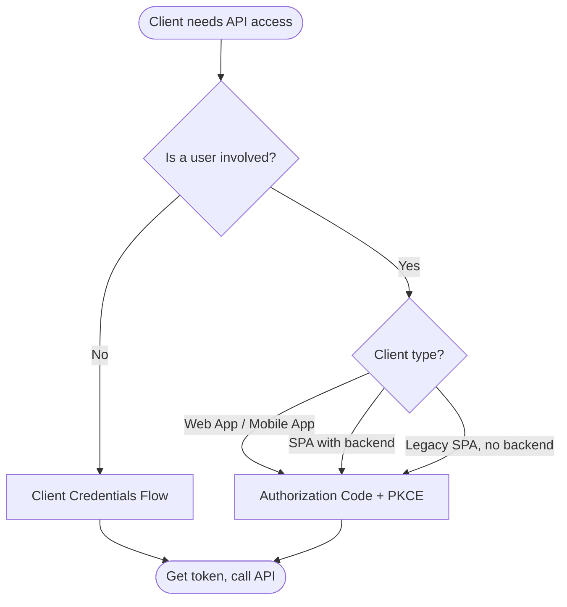
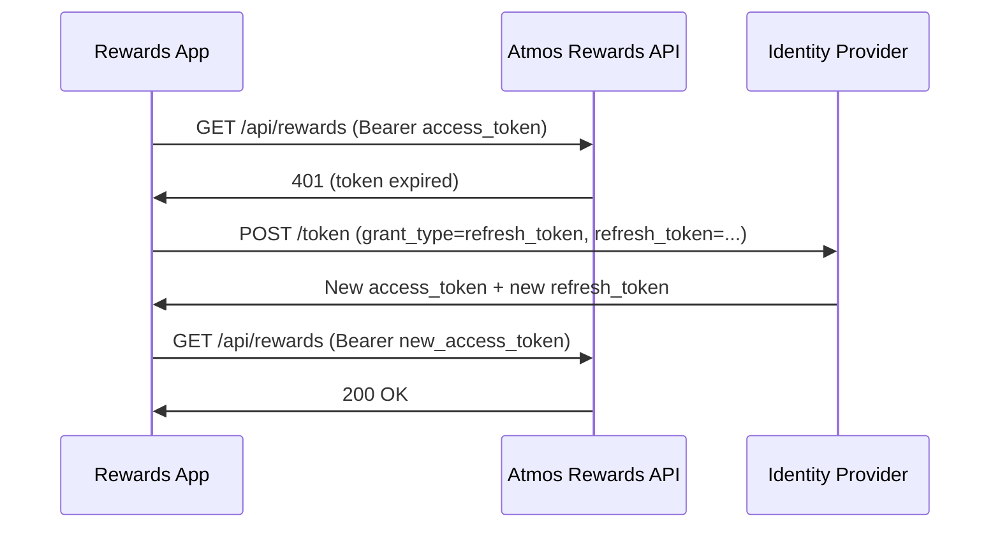
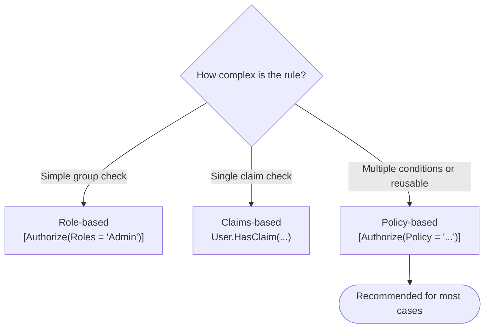
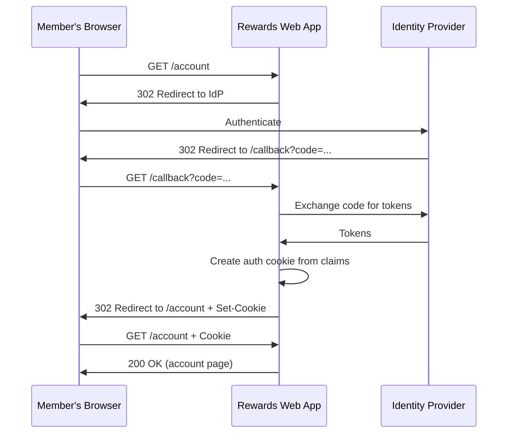

# Authentication and Authorization in .NET

## Overview

Authentication and authorization are two distinct but complementary security concerns. **Authentication** answers the question "Who are you?" -- it verifies the identity of a user or service. **Authorization** answers "What are you allowed to do?" -- it determines whether an authenticated identity has permission to perform a specific action or access a particular resource.

In the Atmos Rewards system, authentication proves that a member is who they claim to be (e.g., via login credentials or an OAuth token), while authorization enforces that only MVP Gold members and above can access premium reward redemptions, or that only the partner API for a specific airline alliance can submit mileage accrual requests.

A common mistake is conflating the two. A request can be successfully authenticated (we know who you are) but still be denied authorization (you do not have the required tier level). ASP.NET Core models this cleanly by separating the two into distinct middleware steps.



## 1. Authentication vs Authorization

| Aspect | Authentication (AuthN) | Authorization (AuthZ) |
|--------|----------------------|----------------------|
| Question answered | Who are you? | What can you do? |
| HTTP failure code | 401 Unauthorized | 403 Forbidden |
| ASP.NET middleware | `UseAuthentication()` | `UseAuthorization()` |
| Configured via | `AddAuthentication()`, schemes | `AddAuthorization()`, policies |
| Typical mechanism | JWT, cookies, API keys | Roles, claims, policies |
| Atmos example | Validate member's JWT token | Check if member tier is Gold+ |

**Middleware ordering matters.** Authentication must run before authorization. The pipeline must be:

```
UseAuthentication();   // Step 1: Who is this?
UseAuthorization();    // Step 2: Are they allowed?
```

If these are reversed, authorization will always fail because no identity has been established yet.

## 2. OAuth 2.0 Flows

OAuth 2.0 is a delegation protocol that allows a client application to access resources on behalf of a user (or on its own behalf) without sharing credentials. The Atmos Rewards system would use different OAuth flows depending on the client type.

### Authorization Code Flow (with PKCE)

Used when an Atmos Rewards member signs in through a web or mobile app. The app redirects to the identity provider, the member authenticates, and the app receives an authorization code that it exchanges for tokens.



**When to use:** Browser-based web apps, mobile apps, any client where a user is present. PKCE (Proof Key for Code Exchange) should always be used, even for confidential clients, to prevent authorization code interception attacks.

### Client Credentials Flow

Used for service-to-service communication where no user is involved. For example, a nightly batch job that recalculates all member tier levels, or a partner airline's backend submitting mileage accrual records.



**When to use:** Backend services, daemons, partner integrations -- any scenario where the application itself is the identity, not a user.

### Choosing the Right Flow



**Deprecated flows to be aware of:** The Implicit flow and Resource Owner Password Credentials (ROPC) flow are considered insecure and should not be used in new applications. If an interviewer asks, explain that Authorization Code + PKCE has replaced both.

## 3. JWT Tokens

JSON Web Tokens are the standard token format used in modern API authentication. A JWT consists of three Base64-encoded parts separated by dots.

### Structure: header.payload.signature

```
eyJhbGciOiJSUzI1NiIsInR5cCI6IkpXVCJ9.
eyJzdWIiOiIxMjM0NTY3ODkwIiwibmFtZSI6IkpvaG4iLCJpYXQiOjE1MTYyMzkwMjJ9.
SflKxwRJSMeKKF2QT4fwpMeJf36POk6yJV_adQssw5c
```

| Part | Contains | Example Fields |
|------|----------|----------------|
| Header | Algorithm and token type | `alg: RS256`, `typ: JWT` |
| Payload | Claims about the identity | `sub`, `name`, `atmos_tier`, `exp`, `iss` |
| Signature | Verification hash | HMAC or RSA signature of header + payload |

### Claims in the Atmos Context

Claims are key-value pairs in the JWT payload that describe the authenticated member or service.

```json
{
  "sub": "atmos-member-88421",
  "name": "Jordan Rivera",
  "email": "jrivera@example.com",
  "atmos_tier": "Gold",
  "atmos_miles": 52340,
  "partner_id": null,
  "iss": "https://identity.alaskaair.com",
  "aud": "atmos-rewards-api",
  "exp": 1740500000,
  "iat": 1740496400,
  "scope": "rewards.read rewards.redeem"
}
```

### Token Validation

When the Atmos Rewards API receives a JWT, it must validate:

1. **Signature** -- Verify using the identity provider's public key (from JWKS endpoint).
2. **Issuer (`iss`)** -- Must match the expected identity provider.
3. **Audience (`aud`)** -- Must include this API's identifier.
4. **Expiration (`exp`)** -- Token must not be expired.
5. **Not Before (`nbf`)** -- Token must be active.

### Refresh Tokens

Access tokens are short-lived (minutes to hours). Refresh tokens are long-lived and used to obtain new access tokens without re-authenticating the member.



**Security consideration:** Refresh tokens should be stored securely (encrypted at rest, never in browser localStorage) and should support rotation -- each use of a refresh token invalidates the old one and issues a new one.

## 4. ASP.NET Core Authentication Middleware

### JWT Bearer Configuration for the Atmos Rewards API

This is the foundational setup in `Program.cs` that tells the API how to authenticate incoming requests using JWT tokens.

```csharp
// Program.cs -- Atmos Rewards API authentication setup
using Microsoft.AspNetCore.Authentication.JwtBearer;
using Microsoft.IdentityModel.Tokens;

var builder = WebApplication.CreateBuilder(args);

builder.Services.AddAuthentication(options =>
{
    options.DefaultAuthenticateScheme = JwtBearerDefaults.AuthenticationScheme;
    options.DefaultChallengeScheme = JwtBearerDefaults.AuthenticationScheme;
})
.AddJwtBearer(options =>
{
    options.Authority = "https://identity.alaskaair.com";
    options.Audience = "atmos-rewards-api";

    options.TokenValidationParameters = new TokenValidationParameters
    {
        ValidateIssuer = true,
        ValidIssuer = "https://identity.alaskaair.com",
        ValidateAudience = true,
        ValidAudience = "atmos-rewards-api",
        ValidateLifetime = true,
        ClockSkew = TimeSpan.FromMinutes(2),
        ValidateIssuerSigningKey = true
    };

    options.Events = new JwtBearerEvents
    {
        OnAuthenticationFailed = context =>
        {
            if (context.Exception is SecurityTokenExpiredException)
            {
                context.Response.Headers.Append(
                    "X-Token-Expired", "true");
            }
            return Task.CompletedTask;
        }
    };
});

builder.Services.AddAuthorization();

var app = builder.Build();

// Order matters: authentication before authorization
app.UseAuthentication();
app.UseAuthorization();

app.MapControllers();
app.Run();
```

**Key points:**
- `AddAuthentication` sets the default scheme so every request is evaluated.
- `AddJwtBearer` configures how tokens are parsed and validated.
- `Authority` tells the middleware where to find the JWKS (JSON Web Key Set) for signature verification.
- `ClockSkew` allows a small tolerance for clock drift between servers.
- The `Events` hook allows custom behavior on authentication failure.

## 5. Policy-Based Authorization

Policy-based authorization is the recommended approach in ASP.NET Core. It decouples authorization rules from controllers and allows complex, composable requirements.

### Defining a Custom Policy: "MustBeMVPOrHigher"

This policy checks that the authenticated member has a tier claim at MVP level or above.

```csharp
// Authorization/AtmosTierRequirement.cs
using Microsoft.AspNetCore.Authorization;

public class AtmosTierRequirement : IAuthorizationRequirement
{
    public IReadOnlyList<string> AllowedTiers { get; }

    public AtmosTierRequirement(params string[] allowedTiers)
    {
        AllowedTiers = allowedTiers;
    }
}

// Authorization/AtmosTierHandler.cs
public class AtmosTierHandler : AuthorizationHandler<AtmosTierRequirement>
{
    protected override Task HandleRequirementAsync(
        AuthorizationHandlerContext context,
        AtmosTierRequirement requirement)
    {
        var tierClaim = context.User.FindFirst("atmos_tier");

        if (tierClaim is null)
        {
            // No tier claim present -- do not call Fail(),
            // just return so other handlers can still succeed.
            return Task.CompletedTask;
        }

        if (requirement.AllowedTiers.Contains(
            tierClaim.Value, StringComparer.OrdinalIgnoreCase))
        {
            context.Succeed(requirement);
        }

        return Task.CompletedTask;
    }
}

// Registration in Program.cs
builder.Services.AddAuthorization(options =>
{
    options.AddPolicy("MustBeMVPOrHigher", policy =>
        policy.Requirements.Add(
            new AtmosTierRequirement("MVP", "MVP Gold", "MVP Gold 75K")));

    options.AddPolicy("MustBeGoldOrHigher", policy =>
        policy.Requirements.Add(
            new AtmosTierRequirement("MVP Gold", "MVP Gold 75K")));
});

builder.Services
    .AddSingleton<IAuthorizationHandler, AtmosTierHandler>();
```

**Why not call `context.Fail()`?** Calling `Fail()` short-circuits all other handlers. By simply not calling `Succeed()`, we allow other handlers or policies to still evaluate. Only call `Fail()` when you want to explicitly deny regardless of other handlers (e.g., a blocked account).

### Protecting Endpoints with the Policy

```csharp
// Controllers/RewardsController.cs
using Microsoft.AspNetCore.Authorization;
using Microsoft.AspNetCore.Mvc;

[ApiController]
[Route("api/[controller]")]
[Authorize] // All endpoints require authentication
public class RewardsController : ControllerBase
{
    // Any authenticated member can view available rewards
    [HttpGet]
    public IActionResult GetAvailableRewards()
    {
        var memberId = User.FindFirst("sub")?.Value;
        // Return rewards catalog for this member's tier
        return Ok(new { memberId, rewards = new[] { "Seat upgrade", "Lounge pass" } });
    }

    // Only Gold+ members can access premium reward redemptions
    [HttpPost("redeem/premium")]
    [Authorize(Policy = "MustBeGoldOrHigher")]
    public IActionResult RedeemPremiumReward([FromBody] RedemptionRequest request)
    {
        var memberTier = User.FindFirst("atmos_tier")?.Value;
        return Ok(new
        {
            confirmation = Guid.NewGuid().ToString(),
            tier = memberTier,
            reward = request.RewardCode,
            message = "Premium reward redeemed successfully"
        });
    }

    // Only MVP Gold 75K can access the elite concierge booking
    [HttpPost("concierge")]
    [Authorize(Policy = "MustBeMVPOrHigher")]
    public IActionResult BookConcierge([FromBody] ConciergeRequest request)
    {
        return Ok(new { booking = Guid.NewGuid().ToString() });
    }
}

public record RedemptionRequest(string RewardCode, int MilesAmount);
public record ConciergeRequest(string ServiceType, DateTime PreferredDate);
```

## 6. Role-Based vs Claims-Based vs Policy-Based Authorization

### Comparison

| Approach | Mechanism | Strengths | Weaknesses |
|----------|-----------|-----------|------------|
| Role-based | `[Authorize(Roles = "Admin")]` | Simple, familiar | Rigid, doesn't scale, hard to combine conditions |
| Claims-based | Check specific claims in code | Flexible, fine-grained | Logic scattered across controllers |
| Policy-based | `[Authorize(Policy = "...")]` | Composable, testable, centralized | Slightly more setup |

### When to Use Each

**Role-based** works for simple, static groupings (Admin, Member, Partner). It breaks down when you need combinations or dynamic conditions.

**Claims-based** gives you raw flexibility -- you can check any claim value anywhere. But it leads to repeated `if` checks and is hard to maintain.

**Policy-based** is the recommended approach. Policies can combine multiple requirements (tier level AND account age AND region), are registered centrally, and the handlers are independently testable.



## 7. Claims Transformation

Claims transformation allows you to enrich the authenticated identity with additional claims after authentication but before authorization. This is useful when the JWT from the identity provider contains a basic member ID, and you need to look up tier information from a database.

```csharp
// Authentication/AtmosTierClaimsTransformation.cs
using System.Security.Claims;
using Microsoft.AspNetCore.Authentication;

public class AtmosTierClaimsTransformation : IClaimsTransformation
{
    private readonly IMemberTierService _tierService;

    public AtmosTierClaimsTransformation(IMemberTierService tierService)
    {
        _tierService = tierService;
    }

    public async Task<ClaimsPrincipal> TransformAsync(ClaimsPrincipal principal)
    {
        var identity = principal.Identity as ClaimsIdentity;
        if (identity is null || !identity.IsAuthenticated)
        {
            return principal;
        }

        // Skip if tier claim already exists (transformation runs per request)
        if (identity.HasClaim(c => c.Type == "atmos_tier"))
        {
            return principal;
        }

        var memberId = identity.FindFirst("sub")?.Value;
        if (memberId is null)
        {
            return principal;
        }

        var tierInfo = await _tierService.GetTierInfoAsync(memberId);
        if (tierInfo is not null)
        {
            identity.AddClaim(new Claim("atmos_tier", tierInfo.TierName));
            identity.AddClaim(new Claim("atmos_miles", tierInfo.MilesBalance.ToString()));
            identity.AddClaim(new Claim("atmos_tier_expiry", tierInfo.ExpiryDate.ToString("O")));
        }

        return principal;
    }
}

public interface IMemberTierService
{
    Task<TierInfo?> GetTierInfoAsync(string memberId);
}

public record TierInfo(string TierName, int MilesBalance, DateTime ExpiryDate);

// Registration in Program.cs
builder.Services.AddScoped<IMemberTierService, MemberTierService>();
builder.Services.AddTransient<IClaimsTransformation, AtmosTierClaimsTransformation>();
```

**Important:** `IClaimsTransformation.TransformAsync` is called on every request. The idempotency check (`HasClaim`) prevents duplicate claims from accumulating. For performance, consider caching tier lookups with a short TTL.

## 8. API Key Authentication for Partner Integrations

Some partner integrations use API keys instead of OAuth tokens. This is common for server-to-server calls from legacy partners that cannot implement OAuth. ASP.NET Core supports custom authentication handlers for this.

```csharp
// Authentication/ApiKeyAuthenticationHandler.cs
using System.Security.Claims;
using System.Text.Encodings.Web;
using Microsoft.AspNetCore.Authentication;
using Microsoft.Extensions.Options;

public class ApiKeyAuthenticationHandler
    : AuthenticationHandler<ApiKeyAuthenticationOptions>
{
    private readonly IPartnerKeyStore _keyStore;

    public ApiKeyAuthenticationHandler(
        IOptionsMonitor<ApiKeyAuthenticationOptions> options,
        ILoggerFactory logger,
        UrlEncoder encoder,
        IPartnerKeyStore keyStore)
        : base(options, logger, encoder)
    {
        _keyStore = keyStore;
    }

    protected override async Task<AuthenticateResult> HandleAuthenticateAsync()
    {
        if (!Request.Headers.TryGetValue("X-Api-Key", out var apiKeyHeader))
        {
            return AuthenticateResult.NoResult();
        }

        var apiKey = apiKeyHeader.ToString();
        var partner = await _keyStore.ValidateKeyAsync(apiKey);

        if (partner is null)
        {
            return AuthenticateResult.Fail("Invalid API key");
        }

        var claims = new[]
        {
            new Claim(ClaimTypes.Name, partner.PartnerName),
            new Claim("partner_id", partner.PartnerId),
            new Claim("partner_scope", partner.Scope)
        };

        var identity = new ClaimsIdentity(claims, Scheme.Name);
        var principal = new ClaimsPrincipal(identity);
        var ticket = new AuthenticationTicket(principal, Scheme.Name);

        return AuthenticateResult.Success(ticket);
    }
}

public class ApiKeyAuthenticationOptions : AuthenticationSchemeOptions { }

public interface IPartnerKeyStore
{
    Task<PartnerInfo?> ValidateKeyAsync(string apiKey);
}

public record PartnerInfo(string PartnerId, string PartnerName, string Scope);

// Registration in Program.cs -- multiple authentication schemes
builder.Services.AddAuthentication(JwtBearerDefaults.AuthenticationScheme)
    .AddJwtBearer(options =>
    {
        options.Authority = "https://identity.alaskaair.com";
        options.Audience = "atmos-rewards-api";
    })
    .AddScheme<ApiKeyAuthenticationOptions, ApiKeyAuthenticationHandler>(
        "ApiKey", options => { });

// Policy that accepts either JWT or API key
builder.Services.AddAuthorization(options =>
{
    options.AddPolicy("PartnerAccess", policy =>
    {
        policy.AuthenticationSchemes.Add("ApiKey");
        policy.RequireClaim("partner_scope", "mileage.accrual");
    });
});
```

**Usage on an endpoint:**

```csharp
[HttpPost("api/accruals")]
[Authorize(Policy = "PartnerAccess")]
public IActionResult SubmitMileageAccrual([FromBody] AccrualRequest request)
{
    var partnerId = User.FindFirst("partner_id")?.Value;
    return Created($"/api/accruals/{request.TransactionId}",
        new { request.TransactionId, partnerId, status = "Processed" });
}

public record AccrualRequest(string TransactionId, string MemberId, int Miles);
```

## 9. Identity and Cookie Authentication for Web Apps

While the Atmos Rewards API uses JWT bearer tokens, the member-facing web application uses cookie-based authentication backed by ASP.NET Core Identity. After the OAuth flow completes, the web app issues an encrypted cookie to the browser.



Cookies handle session management automatically (expiration, sliding windows, secure flags). The trade-off is that cookies are browser-specific and cannot be used for mobile apps or service-to-service calls.

**Security settings for cookies:**

```csharp
builder.Services.AddAuthentication(CookieAuthenticationDefaults.AuthenticationScheme)
    .AddCookie(options =>
    {
        options.Cookie.HttpOnly = true;     // Not accessible via JavaScript
        options.Cookie.SecurePolicy = CookieSecurePolicy.Always; // HTTPS only
        options.Cookie.SameSite = SameSiteMode.Strict;           // CSRF protection
        options.ExpireTimeSpan = TimeSpan.FromHours(8);
        options.SlidingExpiration = true;
        options.LoginPath = "/auth/login";
        options.AccessDeniedPath = "/auth/access-denied";
    });
```

## Interview Questions

**Fundamentals:**

1. What is the difference between authentication and authorization? Which HTTP status code corresponds to each failure?
2. Why must `UseAuthentication()` be called before `UseAuthorization()` in the middleware pipeline?
3. What happens if you apply `[Authorize]` to a controller but forget to call `UseAuthorization()` in `Program.cs`?

**OAuth 2.0:**

4. Explain the Authorization Code flow with PKCE. Why was PKCE added, and why is it recommended even for confidential clients now?
5. When would you use the Client Credentials flow instead of Authorization Code?
6. Why is the Implicit flow considered deprecated? What replaced it?

**JWT:**

7. Describe the three parts of a JWT. Which part is not encrypted and can be read by anyone?
8. How does the API verify a JWT's signature without contacting the identity provider on every request?
9. What is the purpose of a refresh token? Where should it be stored?
10. What happens if you set `ClockSkew` to zero in `TokenValidationParameters`? Why is a small skew typically allowed?

**ASP.NET Core specifics:**

11. What does `AddAuthentication` do versus `AddJwtBearer`? Why do you need both?
12. How would you support multiple authentication schemes (e.g., JWT for members and API keys for partners) in the same API?
13. Explain how `IClaimsTransformation` works. When would you use it instead of including all claims in the JWT?

**Authorization:**

14. Compare role-based, claims-based, and policy-based authorization. When would you choose each?
15. In a custom `AuthorizationHandler`, what is the difference between not calling `context.Succeed()` and calling `context.Fail()`?
16. How would you implement a policy that requires the member to be Gold tier or higher AND have an account older than one year?
17. Can you apply multiple `[Authorize]` attributes to a single endpoint? If so, are they combined with AND or OR logic?

**Security:**

18. Why should cookies be marked `HttpOnly` and `Secure`? What does `SameSite=Strict` protect against?
19. How do you prevent JWT tokens from being used after a member's account is deactivated, given that JWTs are self-contained?
20. What are the security risks of storing JWTs in browser localStorage versus using HTTP-only cookies?
