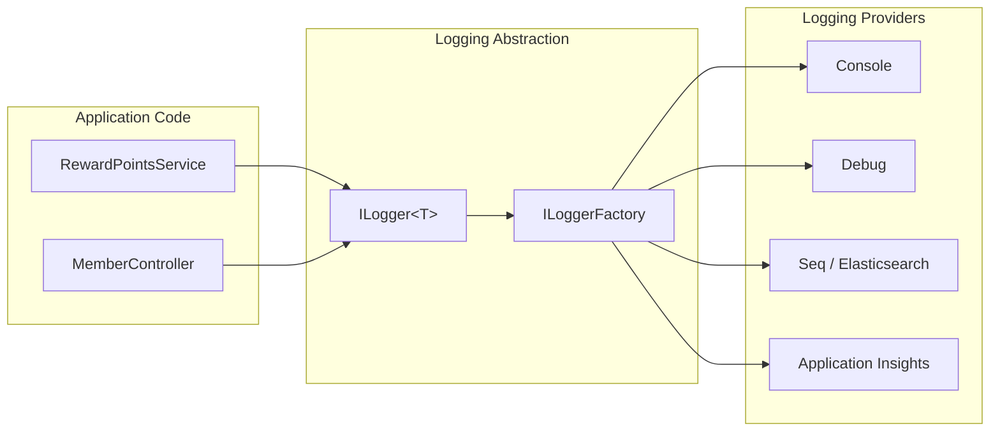
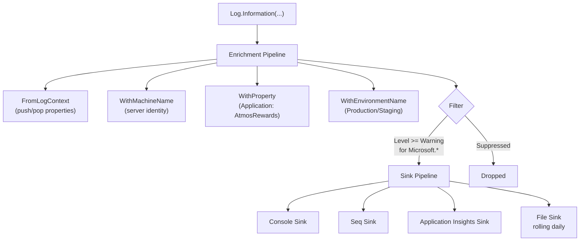
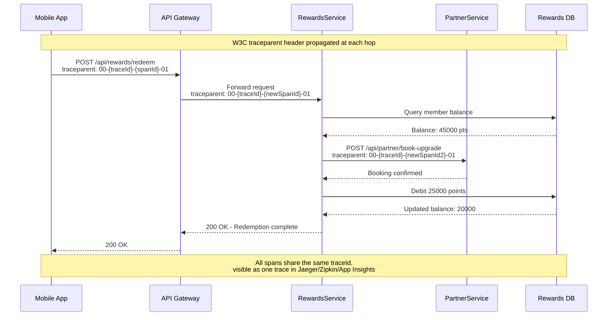
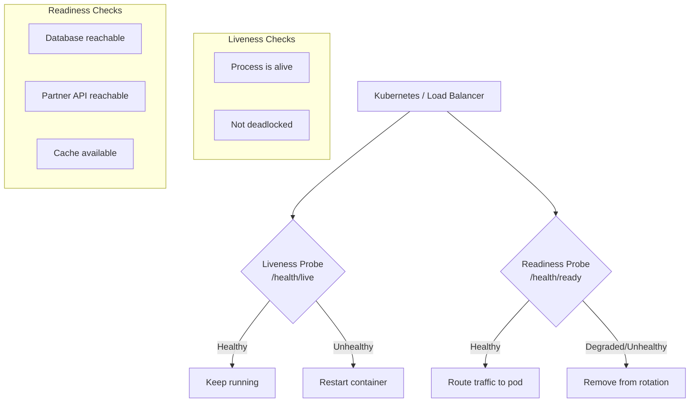
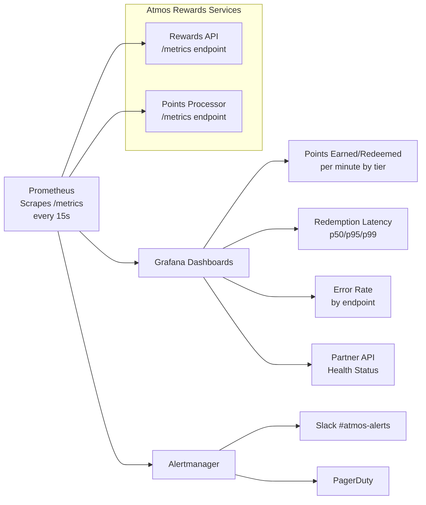
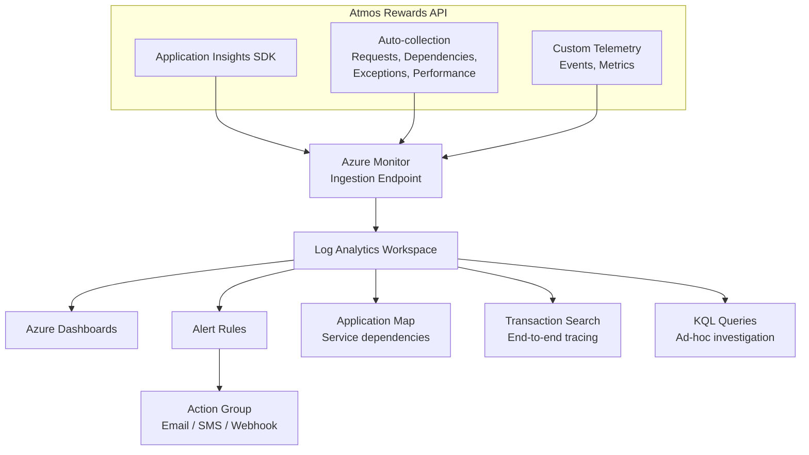

# Logging and Observability

## Overview

This document covers logging, tracing, metrics, and health checks in .NET, the pillars of observability for distributed systems. The examples use the Atmos Rewards domain (members, reward transactions, tier levels, partner integrations) to illustrate how a loyalty platform team would instrument services for production readiness. A well-observed system lets you answer "what happened to this member's points?" without guessing.

## 1. ILogger and ILoggerFactory

ASP.NET Core ships with a built-in logging abstraction. `ILoggerFactory` creates loggers, and `ILogger<T>` is the typed logger injected into your classes. The framework routes log entries to registered providers (Console, Debug, EventSource, or third-party sinks like Serilog).

### Log Levels

Log levels control verbosity. Choosing the right level is critical: too verbose buries important signals, too quiet hides problems.

| Level | Value | Use Case |
|-------|-------|----------|
| Trace | 0 | Granular diagnostic detail, never in production |
| Debug | 1 | Development-time flow information |
| Information | 2 | Normal operational events (member enrolled, points credited) |
| Warning | 3 | Abnormal but recoverable (partner API slow, retry triggered) |
| Error | 4 | Failure that needs attention (points calculation failed) |
| Critical | 5 | System-wide failure (database unreachable, service crash) |

### Structured Logging with Message Templates

Structured logging captures data as named properties rather than interpolated strings. This makes log entries searchable and filterable in tools like Seq, Kibana, or Application Insights.

```csharp
public class RewardPointsService
{
    private readonly ILogger<RewardPointsService> _logger;

    public RewardPointsService(ILogger<RewardPointsService> logger)
    {
        _logger = logger;
    }

    public async Task<int> CreditPointsAsync(string memberId, int points, string source)
    {
        // GOOD: structured logging with message templates.
        // Properties {MemberId}, {Points}, {Source} are captured as queryable fields.
        _logger.LogInformation(
            "Crediting {Points} points to member {MemberId} from {Source}",
            points, memberId, source);

        // BAD: string interpolation destroys structure.
        // _logger.LogInformation($"Crediting {points} points to member {memberId}");

        try
        {
            var newBalance = await ProcessCreditAsync(memberId, points, source);

            _logger.LogInformation(
                "Credit complete for member {MemberId}. New balance: {Balance}",
                memberId, newBalance);

            return newBalance;
        }
        catch (Exception ex)
        {
            _logger.LogError(ex,
                "Failed to credit {Points} points to member {MemberId} from {Source}",
                points, memberId, source);
            throw;
        }
    }
}
```

**Why message templates matter:** When you write `"Crediting {Points} points to member {MemberId}"`, the logging framework stores `Points` and `MemberId` as separate properties. In Application Insights you can then query `where customDimensions.MemberId == "AK-90210"` instead of parsing strings.



## 2. Serilog

Serilog is the most widely used structured logging library in the .NET ecosystem. It replaces the default logging providers with a richer pipeline of sinks (outputs), enrichers (context), and destructuring policies.

### Serilog Configuration for Atmos Rewards

```csharp
// Program.cs
using Serilog;
using Serilog.Events;

var builder = WebApplication.CreateBuilder(args);

Log.Logger = new LoggerConfiguration()
    .MinimumLevel.Information()
    .MinimumLevel.Override("Microsoft.AspNetCore", LogEventLevel.Warning)
    .MinimumLevel.Override("Microsoft.EntityFrameworkCore", LogEventLevel.Warning)
    .Enrich.FromLogContext()
    .Enrich.WithMachineName()
    .Enrich.WithEnvironmentName()
    .Enrich.WithProperty("Application", "AtmosRewards.API")
    .WriteTo.Console(outputTemplate:
        "[{Timestamp:HH:mm:ss} {Level:u3}] {Message:lj} " +
        "{Properties:j}{NewLine}{Exception}")
    .WriteTo.Seq("http://seq.internal.alaskaair.com:5341")
    .WriteTo.ApplicationInsights(
        builder.Configuration["ApplicationInsights:ConnectionString"],
        TelemetryConverter.Traces)
    .CreateLogger();

builder.Host.UseSerilog();

var app = builder.Build();

// Request logging middleware replaces default ASP.NET Core request logs
// with a single structured entry per request.
app.UseSerilogRequestLogging(options =>
{
    options.EnrichDiagnosticContext = (diagnosticContext, httpContext) =>
    {
        diagnosticContext.Set("MemberId",
            httpContext.User.FindFirst("member_id")?.Value ?? "anonymous");
        diagnosticContext.Set("RequestHost", httpContext.Request.Host.Value);
    };
});

app.Run();
```

### Sinks, Enrichers, and Filters



**Key Serilog concepts:**

- **Sinks** are output destinations. Each sink can have its own minimum level and formatting.
- **Enrichers** add properties to every log event. `FromLogContext` picks up properties pushed via `LogContext.PushProperty` (useful in middleware).
- **Destructuring** controls how complex objects are serialized. Use `@` to destructure: `_logger.LogInformation("Transaction: {@Transaction}", tx)`.
- **Minimum level overrides** silence noisy framework logs while keeping your application logs at Information.

## 3. Distributed Tracing

In a microservices architecture, a single member action (redeem points for a flight upgrade) can touch multiple services. Distributed tracing connects the dots by propagating a trace context across service boundaries.

### OpenTelemetry and W3C Trace Context

OpenTelemetry is the vendor-neutral standard for traces, metrics, and logs. The W3C `traceparent` header carries trace ID and span ID across HTTP calls.



### OpenTelemetry Setup

```csharp
// Program.cs - OpenTelemetry configuration for AtmosRewards
using OpenTelemetry.Resources;
using OpenTelemetry.Trace;
using OpenTelemetry.Metrics;

var builder = WebApplication.CreateBuilder(args);

builder.Services.AddOpenTelemetry()
    .ConfigureResource(resource => resource
        .AddService(
            serviceName: "AtmosRewards.API",
            serviceVersion: "1.0.0")
        .AddAttributes(new Dictionary<string, object>
        {
            ["deployment.environment"] = builder.Environment.EnvironmentName,
            ["team"] = "membership-atmos-rewards"
        }))
    .WithTracing(tracing => tracing
        .AddAspNetCoreInstrumentation(options =>
        {
            // Filter out health check noise from traces.
            options.Filter = context =>
                !context.Request.Path.StartsWithSegments("/health");
        })
        .AddHttpClientInstrumentation()
        .AddEntityFrameworkCoreInstrumentation()
        .AddSource("AtmosRewards.RewardPointsService")
        .AddOtlpExporter(options =>
        {
            options.Endpoint = new Uri("http://otel-collector:4317");
        }))
    .WithMetrics(metrics => metrics
        .AddAspNetCoreInstrumentation()
        .AddHttpClientInstrumentation()
        .AddMeter("AtmosRewards.Metrics")
        .AddOtlpExporter());
```

### Correlation ID Middleware

A correlation ID ties all log entries for a single request together, even across service boundaries. This middleware reads or generates the ID and pushes it into the logging context.

```csharp
public class CorrelationIdMiddleware
{
    private const string CorrelationIdHeader = "X-Correlation-Id";
    private readonly RequestDelegate _next;

    public CorrelationIdMiddleware(RequestDelegate next)
    {
        _next = next;
    }

    public async Task InvokeAsync(HttpContext context)
    {
        // Read correlation ID from incoming header or generate a new one.
        var correlationId = context.Request.Headers[CorrelationIdHeader].FirstOrDefault()
            ?? Guid.NewGuid().ToString("N");

        // Make it available throughout the request pipeline.
        context.Items["CorrelationId"] = correlationId;
        context.Response.Headers[CorrelationIdHeader] = correlationId;

        // Push into Serilog's LogContext so every log entry includes it.
        using (LogContext.PushProperty("CorrelationId", correlationId))
        {
            await _next(context);
        }
    }
}

// Delegating handler to propagate correlation ID to downstream HTTP calls.
public class CorrelationIdDelegatingHandler : DelegatingHandler
{
    private readonly IHttpContextAccessor _httpContextAccessor;

    public CorrelationIdDelegatingHandler(IHttpContextAccessor httpContextAccessor)
    {
        _httpContextAccessor = httpContextAccessor;
    }

    protected override Task<HttpResponseMessage> SendAsync(
        HttpRequestMessage request, CancellationToken cancellationToken)
    {
        if (_httpContextAccessor.HttpContext?.Items["CorrelationId"]
            is string correlationId)
        {
            request.Headers.TryAddWithoutValidation("X-Correlation-Id", correlationId);
        }

        return base.SendAsync(request, cancellationToken);
    }
}

// Registration in Program.cs:
// builder.Services.AddHttpContextAccessor();
// builder.Services.AddTransient<CorrelationIdDelegatingHandler>();
// builder.Services.AddHttpClient<PartnerService>()
//     .AddHttpMessageHandler<CorrelationIdDelegatingHandler>();
```

## 4. Health Checks

Health checks let orchestrators (Kubernetes, Azure App Service) know whether a service is alive and ready to receive traffic. ASP.NET Core provides the `IHealthCheck` interface and built-in middleware.

### Liveness vs Readiness



- **Liveness** answers: "Is the process alive?" If not, restart it. Keep this check cheap and fast.
- **Readiness** answers: "Can this instance serve requests?" If not, stop routing traffic to it but do not restart.

### Custom Health Check for Partner API

```csharp
public class PartnerApiHealthCheck : IHealthCheck
{
    private readonly HttpClient _httpClient;
    private readonly ILogger<PartnerApiHealthCheck> _logger;

    public PartnerApiHealthCheck(
        IHttpClientFactory httpClientFactory,
        ILogger<PartnerApiHealthCheck> logger)
    {
        _httpClient = httpClientFactory.CreateClient("PartnerAPI");
        _logger = logger;
    }

    public async Task<HealthCheckResult> CheckHealthAsync(
        HealthCheckContext context,
        CancellationToken cancellationToken = default)
    {
        try
        {
            var stopwatch = Stopwatch.StartNew();
            var response = await _httpClient.GetAsync(
                "/health", cancellationToken);
            stopwatch.Stop();

            var data = new Dictionary<string, object>
            {
                ["responseTime"] = stopwatch.ElapsedMilliseconds,
                ["statusCode"] = (int)response.StatusCode
            };

            if (response.IsSuccessStatusCode && stopwatch.ElapsedMilliseconds < 2000)
            {
                return HealthCheckResult.Healthy(
                    "Partner API is responsive.", data);
            }

            if (response.IsSuccessStatusCode)
            {
                _logger.LogWarning(
                    "Partner API responded in {ResponseTime}ms, above 2000ms threshold",
                    stopwatch.ElapsedMilliseconds);

                return HealthCheckResult.Degraded(
                    $"Partner API slow: {stopwatch.ElapsedMilliseconds}ms.", data);
            }

            return HealthCheckResult.Unhealthy(
                $"Partner API returned {response.StatusCode}.", data);
        }
        catch (Exception ex)
        {
            _logger.LogError(ex, "Partner API health check failed");

            return HealthCheckResult.Unhealthy(
                "Partner API unreachable.", exception: ex);
        }
    }
}

// Registration in Program.cs:
// builder.Services.AddHealthChecks()
//     .AddCheck<PartnerApiHealthCheck>(
//         "partner-api",
//         failureStatus: HealthStatus.Degraded,
//         tags: new[] { "readiness" })
//     .AddSqlServer(
//         connectionString: builder.Configuration.GetConnectionString("RewardsDb"),
//         name: "rewards-db",
//         tags: new[] { "readiness" })
//     .AddCheck("self", () => HealthCheckResult.Healthy(), tags: new[] { "liveness" });
//
// app.MapHealthChecks("/health/live", new HealthCheckOptions
// {
//     Predicate = check => check.Tags.Contains("liveness")
// });
// app.MapHealthChecks("/health/ready", new HealthCheckOptions
// {
//     Predicate = check => check.Tags.Contains("readiness"),
//     ResponseWriter = UIResponseWriter.WriteHealthCheckUIResponse
// });
```

## 5. Metrics

Metrics are numeric measurements collected over time. Unlike logs (discrete events) or traces (request flows), metrics give you aggregate views: request rates, error percentages, latency distributions.

### Counters, Histograms, and Gauges

```csharp
using System.Diagnostics.Metrics;

public class RewardsMetrics
{
    private readonly Counter<long> _pointsEarned;
    private readonly Counter<long> _pointsRedeemed;
    private readonly Counter<long> _redemptionsProcessed;
    private readonly Histogram<double> _redemptionDuration;
    private readonly UpDownCounter<int> _activeRedemptions;

    public RewardsMetrics(IMeterFactory meterFactory)
    {
        var meter = meterFactory.Create("AtmosRewards.Metrics");

        _pointsEarned = meter.CreateCounter<long>(
            "rewards.points.earned",
            unit: "points",
            description: "Total reward points earned by members");

        _pointsRedeemed = meter.CreateCounter<long>(
            "rewards.points.redeemed",
            unit: "points",
            description: "Total reward points redeemed by members");

        _redemptionsProcessed = meter.CreateCounter<long>(
            "rewards.redemptions.processed",
            unit: "redemptions",
            description: "Number of redemption transactions processed");

        _redemptionDuration = meter.CreateHistogram<double>(
            "rewards.redemption.duration",
            unit: "ms",
            description: "Time to process a redemption request");

        _activeRedemptions = meter.CreateUpDownCounter<int>(
            "rewards.redemptions.active",
            description: "Currently in-flight redemption requests");
    }

    public void RecordPointsEarned(long points, string tierLevel, string source)
    {
        _pointsEarned.Add(points,
            new KeyValuePair<string, object?>("tier", tierLevel),
            new KeyValuePair<string, object?>("source", source));
    }

    public void RecordRedemption(long points, double durationMs, string category)
    {
        _pointsRedeemed.Add(points,
            new KeyValuePair<string, object?>("category", category));

        _redemptionsProcessed.Add(1,
            new KeyValuePair<string, object?>("category", category));

        _redemptionDuration.Record(durationMs,
            new KeyValuePair<string, object?>("category", category));
    }

    public void RedemptionStarted() => _activeRedemptions.Add(1);
    public void RedemptionCompleted() => _activeRedemptions.Add(-1);
}
```

### Prometheus and Grafana Integration



## 6. Application Insights and Azure Monitor

Azure Application Insights provides integrated logging, tracing, metrics, and alerting as a managed service. For teams already on Azure, it reduces operational overhead compared to self-hosted stacks.



**Useful KQL queries for Atmos Rewards:**

```
// Find all failed redemptions for a specific member in the last 24 hours
requests
| where timestamp > ago(24h)
| where name contains "redeem"
| where success == false
| where customDimensions.MemberId == "AK-90210"
| project timestamp, name, resultCode, duration, customDimensions

// Redemption latency percentiles by tier level
requests
| where name == "POST /api/rewards/redeem"
| where timestamp > ago(1h)
| extend tier = tostring(customDimensions.TierLevel)
| summarize p50=percentile(duration, 50),
            p95=percentile(duration, 95),
            p99=percentile(duration, 99)
    by tier
| order by p95 desc

// Dependency failures (partner API, database) over time
dependencies
| where timestamp > ago(6h)
| where success == false
| summarize failureCount=count() by bin(timestamp, 5m), target, type
| render timechart
```

## 7. Logging Best Practices

### What to Log

| Event | Level | Example |
|-------|-------|---------|
| Request received/completed | Information | `"Processing redemption for member {MemberId}"` |
| Business rule triggered | Information | `"Member {MemberId} promoted to {NewTier}"` |
| External call slow or retried | Warning | `"Partner API retry {Attempt} after {DelayMs}ms"` |
| Handled exception with fallback | Warning | `"Cache miss for member {MemberId}, falling back to DB"` |
| Unhandled exception | Error | `"Unhandled error processing redemption {RedemptionId}"` |
| Startup/shutdown events | Information | `"AtmosRewards.API started in {EnvironmentName}"` |
| Configuration loaded | Debug | `"Loaded {PartnerCount} partner configurations"` |

### What NOT to Log

Never log personally identifiable information (PII) or sensitive data.

| Do Not Log | Why | Instead |
|------------|-----|---------|
| Full credit card numbers | PCI compliance violation | Log last 4 digits only |
| Passwords or tokens | Security breach risk | Log "authentication attempted" |
| Full email addresses | GDPR / privacy regulations | Log hashed or masked version |
| Social security numbers | Legal liability | Never log, even masked |
| API keys or secrets | Credential leak in log aggregator | Log "using key ending in ...XXXX" |
| Full request/response bodies | May contain PII, bloats storage | Log summary or specific fields |

### Log Level Decision Guide

```
Is it a normal, expected operation?
├── Yes: Is it useful for production monitoring?
│   ├── Yes → Information
│   └── No: Is it useful during development?
│       ├── Yes → Debug
│       └── No → Trace
└── No: Did the operation complete successfully?
    ├── Yes (with degraded behavior) → Warning
    └── No: Is the failure isolated to this request?
        ├── Yes → Error
        └── No (system-wide impact) → Critical
```

### Structured Logging Dos and Don'ts

```csharp
// DO: Use message templates with named placeholders.
_logger.LogInformation(
    "Member {MemberId} redeemed {Points} points for {Category}",
    member.Id, transaction.Points, transaction.Category);

// DO: Use @ prefix to destructure complex objects.
_logger.LogInformation("Processing transaction {@Transaction}", transaction);

// DO: Include exception as first parameter.
_logger.LogError(ex, "Redemption failed for member {MemberId}", memberId);

// DON'T: Use string interpolation (loses structure).
_logger.LogInformation($"Member {member.Id} redeemed {transaction.Points} points");

// DON'T: Log PII fields.
_logger.LogInformation("Member email: {Email}", member.Email); // violation

// DON'T: Use overly generic messages.
_logger.LogError("Something went wrong"); // useless in production

// DON'T: Log inside tight loops without sampling.
foreach (var item in thousandsOfItems)
{
    _logger.LogDebug("Processing item {ItemId}", item.Id); // log storm
}
```

## Interview Questions

**ILogger and Structured Logging:**

1. What is the difference between `ILogger`, `ILogger<T>`, and `ILoggerFactory`? When would you use each?
2. Why does structured logging use message templates (`{MemberId}`) instead of string interpolation (`$"{memberId}"`)? What is the practical difference in a log aggregator?
3. How do you configure different log levels for different namespaces (for example, suppress verbose EF Core logs while keeping your service logs at Information)?
4. What happens when you call `_logger.LogDebug(...)` but the minimum level is set to Information? Does the message template get evaluated?

**Serilog:**

5. Explain the difference between Serilog sinks, enrichers, and filters. Give a practical example of each for a rewards API.
6. What does `Enrich.FromLogContext()` do and how does it interact with `LogContext.PushProperty` in middleware?
7. How would you configure Serilog to write warnings and above to Application Insights but everything Information and above to a local Seq instance?

**Distributed Tracing:**

8. Explain the W3C `traceparent` header format. What are trace ID and span ID, and how do they relate?
9. How does `System.Diagnostics.Activity` integrate with OpenTelemetry in .NET? What is an `ActivitySource`?
10. A member reports that a redemption took 30 seconds. Walk through how you would use distributed tracing to identify which service or dependency caused the latency.

**Health Checks:**

11. What is the difference between a liveness probe and a readiness probe? What happens if you conflate them?
12. Why should a liveness check be lightweight? What could go wrong if your liveness check queries the database?
13. A health check for a non-critical partner API is failing. Should the overall health endpoint return Unhealthy or Degraded? Why?

**Metrics:**

14. Explain the difference between a Counter, Histogram, and Gauge. Which would you use to track redemption latency, and why?
15. What are metric cardinality problems and how can they affect Prometheus? Give an example of a bad label choice for the rewards domain.
16. How do histogram buckets work and why does choosing the right bucket boundaries matter for percentile accuracy?

**Application Insights:**

17. Write a KQL query to find the slowest 10 API calls to the partner service in the last hour.
18. What is the Application Map in Application Insights, and how does it discover service dependencies automatically?
19. How does sampling work in Application Insights, and when would you adjust the sampling rate?

**Best Practices:**

20. A junior developer logs the full `Member` object including email and phone number. How would you prevent this at the code level, not just through code review?
21. Your rewards API processes 10,000 requests per second. How do you balance observability with log storage costs?
22. Describe your ideal observability setup for a new microservice from day one. What would you instrument before the first deployment?
