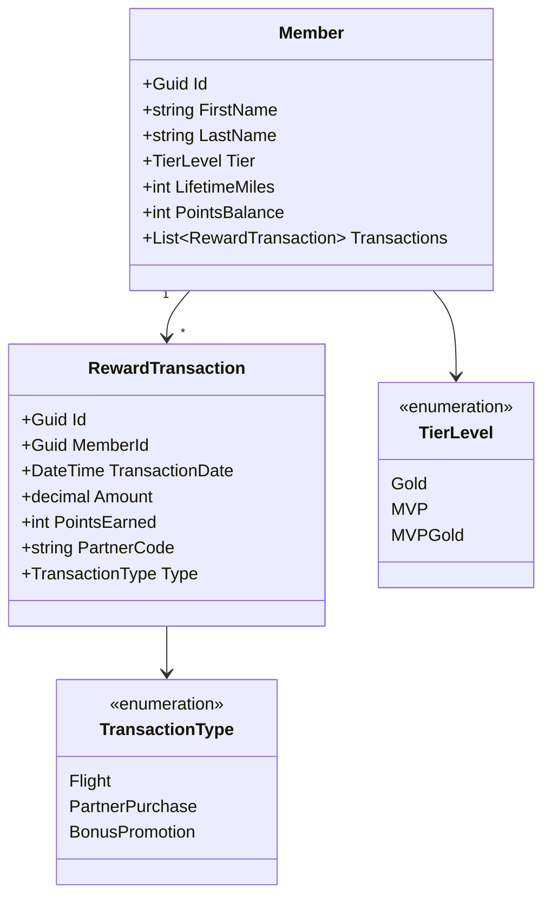
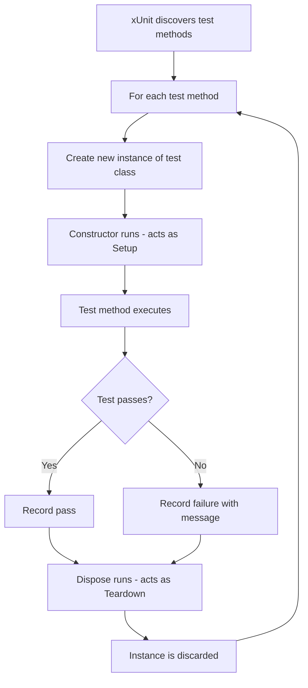
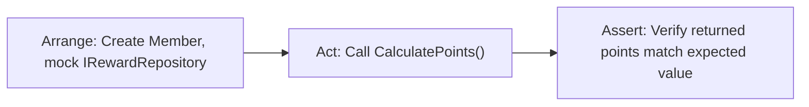
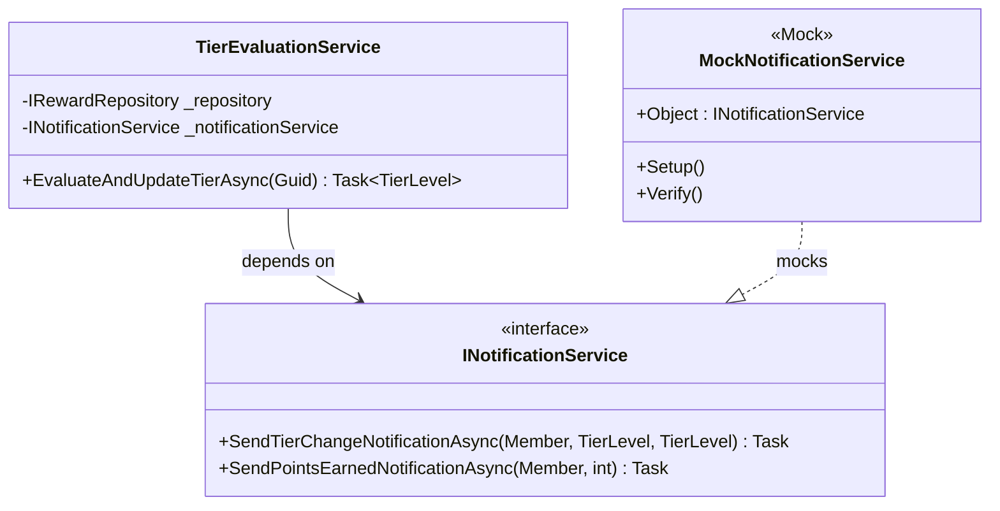
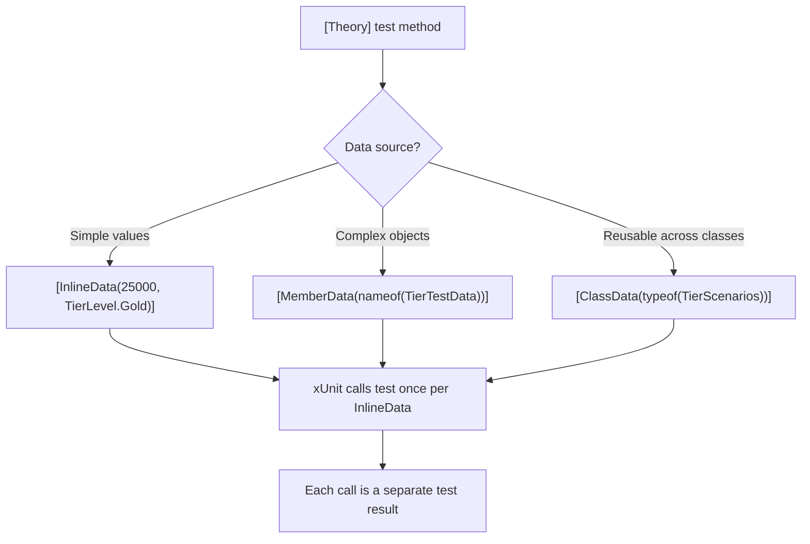
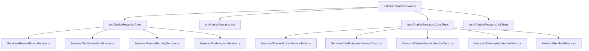

# Unit Testing in .NET

## Overview

This document covers unit testing practices in .NET for the Alaska Airlines Membership Atmos Rewards team. The examples use the loyalty/rewards domain throughout: members, reward transactions, tier levels (Gold, MVP, MVPGold), point calculations, and partner earnings. Topics include xUnit fundamentals, the AAA pattern, mocking with Moq, parameterized tests, FluentAssertions, test organization, testing async code, and code coverage strategy.

Domain model used across examples:



---

## 1. xUnit Fundamentals

xUnit is the most widely used test framework in .NET. It creates a new instance of the test class for every test method, which means constructor logic acts as setup and `IDisposable.Dispose` acts as teardown. This differs from NUnit and MSTest, which reuse a single instance.

### Key Attributes

| Attribute | Purpose |
|---|---|
| `[Fact]` | Marks a parameterless test method |
| `[Theory]` | Marks a parameterized test method |
| `[InlineData]` | Provides inline arguments to a `[Theory]` |
| `[MemberData]` | Provides arguments from a static property or method |
| `[ClassData]` | Provides arguments from a separate class implementing `IEnumerable<object[]>` |
| `[Trait]` | Categorizes tests for filtering |

### Test Lifecycle



Constructor injection means each test starts with a fresh state. There is no shared mutable state between tests, which eliminates ordering bugs.

---

## 2. AAA Pattern

Every well-structured unit test follows three phases: Arrange (set up the inputs and dependencies), Act (call the method under test), Assert (verify the result). Separating these phases clearly makes tests easy to read and maintain.



### Code Example: Testing RewardPointsService.CalculatePoints

This example demonstrates the AAA pattern with a mocked repository. The service under test calculates total points for a member by summing transaction points from the repository.

```csharp
public interface IRewardRepository
{
    Task<List<RewardTransaction>> GetTransactionsAsync(Guid memberId);
    Task<Member?> GetMemberAsync(Guid memberId);
    Task UpdatePointsBalanceAsync(Guid memberId, int newBalance);
}

public class RewardPointsService
{
    private readonly IRewardRepository _rewardRepository;

    public RewardPointsService(IRewardRepository rewardRepository)
    {
        _rewardRepository = rewardRepository;
    }

    public async Task<int> CalculatePointsAsync(Guid memberId)
    {
        var transactions = await _rewardRepository.GetTransactionsAsync(memberId);

        if (transactions is null || transactions.Count == 0)
            return 0;

        return transactions.Sum(t => t.PointsEarned);
    }
}
```

```csharp
public class RewardPointsServiceTests
{
    private readonly Mock<IRewardRepository> _mockRepository;
    private readonly RewardPointsService _sut;

    // Constructor acts as setup - runs before each test.
    public RewardPointsServiceTests()
    {
        _mockRepository = new Mock<IRewardRepository>();
        _sut = new RewardPointsService(_mockRepository.Object);
    }

    [Fact]
    public async Task CalculatePointsAsync_WithMultipleTransactions_ReturnsSumOfPoints()
    {
        // Arrange
        var memberId = Guid.NewGuid();
        var transactions = new List<RewardTransaction>
        {
            new() { Id = Guid.NewGuid(), MemberId = memberId, PointsEarned = 1_500, PartnerCode = "AIRLINE-01", Type = TransactionType.Flight },
            new() { Id = Guid.NewGuid(), MemberId = memberId, PointsEarned = 800, PartnerCode = "HOTEL-01", Type = TransactionType.PartnerPurchase },
            new() { Id = Guid.NewGuid(), MemberId = memberId, PointsEarned = 200, PartnerCode = "PROMO-Q4", Type = TransactionType.BonusPromotion }
        };

        _mockRepository
            .Setup(r => r.GetTransactionsAsync(memberId))
            .ReturnsAsync(transactions);

        // Act
        var result = await _sut.CalculatePointsAsync(memberId);

        // Assert
        Assert.Equal(2_500, result);
    }

    [Fact]
    public async Task CalculatePointsAsync_WithNoTransactions_ReturnsZero()
    {
        // Arrange
        var memberId = Guid.NewGuid();
        _mockRepository
            .Setup(r => r.GetTransactionsAsync(memberId))
            .ReturnsAsync(new List<RewardTransaction>());

        // Act
        var result = await _sut.CalculatePointsAsync(memberId);

        // Assert
        Assert.Equal(0, result);
    }
}
```

---

## 3. Moq Library

Moq creates mock implementations of interfaces at runtime. It enables isolated unit testing by replacing real dependencies with controlled fakes.

### Core API

| Method | Purpose |
|---|---|
| `new Mock<T>()` | Creates a mock of interface or virtual class `T` |
| `.Object` | Returns the mocked instance to inject |
| `.Setup(expression)` | Configures a method to return a value or execute logic |
| `.Returns(value)` | Specifies a synchronous return value |
| `.ReturnsAsync(value)` | Specifies an async return value |
| `.Callback(action)` | Executes custom logic when the method is called |
| `.Throws<TException>()` | Configures the method to throw |
| `.Verify(expression, times)` | Asserts that a method was called with expected arguments |
| `It.IsAny<T>()` | Matches any argument of type `T` |
| `It.Is<T>(predicate)` | Matches arguments that satisfy a predicate |



### Code Example: Moq Verify That NotificationService Was Called on Tier Change

This test verifies that when a member's tier changes during evaluation, the notification service is called exactly once with the correct old and new tiers.

```csharp
public interface INotificationService
{
    Task SendTierChangeNotificationAsync(Member member, TierLevel oldTier, TierLevel newTier);
    Task SendPointsEarnedNotificationAsync(Member member, int pointsEarned);
}

public class TierEvaluationService
{
    private readonly IRewardRepository _repository;
    private readonly INotificationService _notificationService;

    public TierEvaluationService(
        IRewardRepository repository,
        INotificationService notificationService)
    {
        _repository = repository;
        _notificationService = notificationService;
    }

    public async Task<TierLevel> EvaluateAndUpdateTierAsync(Guid memberId)
    {
        var member = await _repository.GetMemberAsync(memberId)
            ?? throw new InvalidOperationException($"Member {memberId} not found.");

        var transactions = await _repository.GetTransactionsAsync(memberId);
        var totalPoints = transactions.Sum(t => t.PointsEarned);

        var newTier = totalPoints switch
        {
            >= 100_000 => TierLevel.MVPGold,
            >= 50_000 => TierLevel.MVP,
            >= 25_000 => TierLevel.Gold,
            _ => member.Tier
        };

        if (newTier != member.Tier)
        {
            var oldTier = member.Tier;
            member.Tier = newTier;
            await _notificationService.SendTierChangeNotificationAsync(member, oldTier, newTier);
        }

        return newTier;
    }
}
```

```csharp
public class TierEvaluationServiceTests
{
    private readonly Mock<IRewardRepository> _mockRepository;
    private readonly Mock<INotificationService> _mockNotification;
    private readonly TierEvaluationService _sut;

    public TierEvaluationServiceTests()
    {
        _mockRepository = new Mock<IRewardRepository>();
        _mockNotification = new Mock<INotificationService>();
        _sut = new TierEvaluationService(_mockRepository.Object, _mockNotification.Object);
    }

    [Fact]
    public async Task EvaluateAndUpdateTierAsync_WhenTierChanges_SendsNotification()
    {
        // Arrange
        var memberId = Guid.NewGuid();
        var member = new Member
        {
            Id = memberId,
            FirstName = "Jordan",
            LastName = "Miles",
            Tier = TierLevel.Gold,
            PointsBalance = 25_000
        };

        var transactions = new List<RewardTransaction>
        {
            new() { MemberId = memberId, PointsEarned = 60_000, Type = TransactionType.Flight }
        };

        _mockRepository
            .Setup(r => r.GetMemberAsync(memberId))
            .ReturnsAsync(member);

        _mockRepository
            .Setup(r => r.GetTransactionsAsync(memberId))
            .ReturnsAsync(transactions);

        _mockNotification
            .Setup(n => n.SendTierChangeNotificationAsync(
                It.IsAny<Member>(),
                It.IsAny<TierLevel>(),
                It.IsAny<TierLevel>()))
            .Returns(Task.CompletedTask);

        // Act
        var result = await _sut.EvaluateAndUpdateTierAsync(memberId);

        // Assert
        Assert.Equal(TierLevel.MVP, result);

        _mockNotification.Verify(
            n => n.SendTierChangeNotificationAsync(
                It.Is<Member>(m => m.Id == memberId),
                TierLevel.Gold,     // old tier
                TierLevel.MVP),     // new tier
            Times.Once);
    }

    [Fact]
    public async Task EvaluateAndUpdateTierAsync_WhenTierStaysSame_DoesNotNotify()
    {
        // Arrange
        var memberId = Guid.NewGuid();
        var member = new Member
        {
            Id = memberId,
            FirstName = "Sam",
            LastName = "Chen",
            Tier = TierLevel.Gold,
            PointsBalance = 30_000
        };

        var transactions = new List<RewardTransaction>
        {
            new() { MemberId = memberId, PointsEarned = 30_000, Type = TransactionType.Flight }
        };

        _mockRepository.Setup(r => r.GetMemberAsync(memberId)).ReturnsAsync(member);
        _mockRepository.Setup(r => r.GetTransactionsAsync(memberId)).ReturnsAsync(transactions);

        // Act
        await _sut.EvaluateAndUpdateTierAsync(memberId);

        // Assert - notification should never be sent.
        _mockNotification.Verify(
            n => n.SendTierChangeNotificationAsync(
                It.IsAny<Member>(),
                It.IsAny<TierLevel>(),
                It.IsAny<TierLevel>()),
            Times.Never);
    }
}
```

---

## 4. Parameterized Tests

Parameterized tests reduce duplication when the same logic needs verification across multiple inputs. xUnit provides three mechanisms: `[InlineData]` for simple inline values, `[MemberData]` for data from static members, and `[ClassData]` for data from dedicated classes.



### Code Example: Parameterized Test for TierEvaluationService

```csharp
public class TierEvaluationServiceParameterizedTests
{
    private readonly Mock<IRewardRepository> _mockRepository;
    private readonly Mock<INotificationService> _mockNotification;
    private readonly TierEvaluationService _sut;

    public TierEvaluationServiceParameterizedTests()
    {
        _mockRepository = new Mock<IRewardRepository>();
        _mockNotification = new Mock<INotificationService>();
        _sut = new TierEvaluationService(_mockRepository.Object, _mockNotification.Object);

        _mockNotification
            .Setup(n => n.SendTierChangeNotificationAsync(
                It.IsAny<Member>(), It.IsAny<TierLevel>(), It.IsAny<TierLevel>()))
            .Returns(Task.CompletedTask);
    }

    // InlineData - best for simple scalar values.
    [Theory]
    [InlineData(24_999, TierLevel.Gold, false)]     // Below Gold threshold, no change from Gold.
    [InlineData(25_000, TierLevel.Gold, false)]      // Exactly at Gold threshold, no change.
    [InlineData(49_999, TierLevel.Gold, false)]      // Below MVP threshold, stays Gold.
    [InlineData(50_000, TierLevel.MVP, true)]        // Reaches MVP threshold.
    [InlineData(99_999, TierLevel.MVP, true)]        // Below MVPGold threshold, stays MVP.
    [InlineData(100_000, TierLevel.MVPGold, true)]   // Reaches MVPGold threshold.
    [InlineData(250_000, TierLevel.MVPGold, true)]   // Well above MVPGold threshold.
    public async Task EvaluateAndUpdateTierAsync_WithVariousPointTotals_ReturnsExpectedTier(
        int totalPoints,
        TierLevel expectedTier,
        bool shouldNotify)
    {
        // Arrange
        var memberId = Guid.NewGuid();
        var member = new Member
        {
            Id = memberId, FirstName = "Test", LastName = "Member", Tier = TierLevel.Gold
        };

        _mockRepository.Setup(r => r.GetMemberAsync(memberId)).ReturnsAsync(member);
        _mockRepository.Setup(r => r.GetTransactionsAsync(memberId)).ReturnsAsync(
            new List<RewardTransaction>
            {
                new() { MemberId = memberId, PointsEarned = totalPoints, Type = TransactionType.Flight }
            });

        // Act
        var result = await _sut.EvaluateAndUpdateTierAsync(memberId);

        // Assert
        Assert.Equal(expectedTier, result);

        var expectedTimes = shouldNotify ? Times.Once() : Times.Never();
        _mockNotification.Verify(
            n => n.SendTierChangeNotificationAsync(
                It.IsAny<Member>(), It.IsAny<TierLevel>(), It.IsAny<TierLevel>()),
            expectedTimes);
    }

    // MemberData - for complex scenarios or when data includes objects.
    public static IEnumerable<object[]> MultipleTierTransitionScenarios()
    {
        yield return new object[]
        {
            TierLevel.Gold,     // starting tier
            75_000,             // total points
            TierLevel.MVP,      // expected new tier
            "Gold member reaching MVP"
        };
        yield return new object[]
        {
            TierLevel.MVP,
            150_000,
            TierLevel.MVPGold,
            "MVP member reaching MVPGold"
        };
        yield return new object[]
        {
            TierLevel.MVPGold,
            200_000,
            TierLevel.MVPGold,
            "MVPGold member staying MVPGold"
        };
    }

    [Theory]
    [MemberData(nameof(MultipleTierTransitionScenarios))]
    public async Task EvaluateAndUpdateTierAsync_TierTransitions_MatchExpected(
        TierLevel startingTier,
        int totalPoints,
        TierLevel expectedTier,
        string scenario)
    {
        // Arrange
        var memberId = Guid.NewGuid();
        var member = new Member
        {
            Id = memberId, FirstName = "Test", LastName = "Member", Tier = startingTier
        };

        _mockRepository.Setup(r => r.GetMemberAsync(memberId)).ReturnsAsync(member);
        _mockRepository.Setup(r => r.GetTransactionsAsync(memberId)).ReturnsAsync(
            new List<RewardTransaction>
            {
                new() { MemberId = memberId, PointsEarned = totalPoints, Type = TransactionType.Flight }
            });

        // Act
        var result = await _sut.EvaluateAndUpdateTierAsync(memberId);

        // Assert
        Assert.Equal(expectedTier, result);
    }
}

// ClassData - reusable across multiple test classes.
public class TierBoundaryScenarios : IEnumerable<object[]>
{
    public IEnumerator<object[]> GetEnumerator()
    {
        // Boundary values for tier thresholds.
        yield return new object[] { 24_999, TierLevel.Gold };
        yield return new object[] { 25_000, TierLevel.Gold };
        yield return new object[] { 49_999, TierLevel.Gold };
        yield return new object[] { 50_000, TierLevel.MVP };
        yield return new object[] { 99_999, TierLevel.MVP };
        yield return new object[] { 100_000, TierLevel.MVPGold };
    }

    IEnumerator IEnumerable.GetEnumerator() => GetEnumerator();
}
```

---

## 5. FluentAssertions

FluentAssertions replaces xUnit's `Assert` class with a readable, chainable API. Failed assertions produce descriptive messages that immediately tell you what went wrong.

### Common Assertions

| Category | Example |
|---|---|
| Equality | `result.Should().Be(42)` |
| Strings | `name.Should().StartWith("Alaska")` |
| Collections | `list.Should().HaveCount(3).And.Contain(x => x.Points > 100)` |
| Objects | `member.Should().BeEquivalentTo(expected)` |
| Exceptions | `act.Should().ThrowAsync<InvalidOperationException>()` |
| Nulls | `result.Should().NotBeNull()` |
| Booleans | `isEligible.Should().BeTrue()` |
| Approximate | `amount.Should().BeApproximately(99.99m, 0.01m)` |

### Code Example: FluentAssertions for Reward Transaction Validation

```csharp
public class RewardTransactionValidationTests
{
    [Fact]
    public void RewardTransaction_WhenCreated_HasExpectedProperties()
    {
        // Arrange & Act
        var transaction = new RewardTransaction
        {
            Id = Guid.NewGuid(),
            MemberId = Guid.NewGuid(),
            TransactionDate = new DateTime(2026, 2, 24),
            Amount = 349.99m,
            PointsEarned = 1_050,
            PartnerCode = "AIRLINE-AS",
            Type = TransactionType.Flight
        };

        // Assert - readable chained assertions.
        transaction.PointsEarned.Should().BePositive();
        transaction.Amount.Should().BeGreaterThan(0);
        transaction.PartnerCode.Should().StartWith("AIRLINE");
        transaction.TransactionDate.Should().BeBefore(DateTime.UtcNow);
        transaction.Type.Should().Be(TransactionType.Flight);
    }

    [Fact]
    public void Member_Transactions_ShouldMatchExpectedCollection()
    {
        // Arrange
        var memberId = Guid.NewGuid();
        var member = new Member
        {
            Id = memberId,
            FirstName = "Dana",
            LastName = "Reeves",
            Tier = TierLevel.MVP,
            Transactions = new List<RewardTransaction>
            {
                new() { MemberId = memberId, PointsEarned = 5_000, PartnerCode = "AIRLINE-AS", Type = TransactionType.Flight },
                new() { MemberId = memberId, PointsEarned = 2_000, PartnerCode = "HOTEL-MR", Type = TransactionType.PartnerPurchase },
                new() { MemberId = memberId, PointsEarned = 500, PartnerCode = "PROMO-Q1", Type = TransactionType.BonusPromotion }
            }
        };

        // Assert - collection assertions.
        member.Transactions.Should().HaveCount(3);
        member.Transactions.Should().OnlyContain(t => t.PointsEarned > 0);
        member.Transactions.Should().ContainSingle(t => t.Type == TransactionType.Flight);
        member.Transactions.Should().BeInAscendingOrder(t => t.PointsEarned)
            .And.AllSatisfy(t => t.MemberId.Should().Be(memberId));
    }

    [Fact]
    public void Member_ShouldBeEquivalentTo_ExpectedObject()
    {
        // Arrange
        var id = Guid.NewGuid();

        var actual = new Member
        {
            Id = id, FirstName = "Alex", LastName = "Kim", Tier = TierLevel.Gold
        };

        var expected = new Member
        {
            Id = id, FirstName = "Alex", LastName = "Kim", Tier = TierLevel.Gold
        };

        // Assert - object graph comparison (compares property values, not references).
        actual.Should().BeEquivalentTo(expected, options => options
            .Excluding(m => m.Transactions)
            .Excluding(m => m.LifetimeMiles));
    }

    [Fact]
    public async Task CalculatePointsAsync_WithNullMemberId_ThrowsArgumentException()
    {
        // Arrange
        var mockRepo = new Mock<IRewardRepository>();
        mockRepo
            .Setup(r => r.GetTransactionsAsync(It.IsAny<Guid>()))
            .ReturnsAsync((List<RewardTransaction>)null!);

        var service = new RewardPointsService(mockRepo.Object);

        // Act
        Func<Task> act = async () => await service.CalculatePointsAsync(Guid.Empty);

        // Assert - exception assertion.
        // Note: this verifies CalculatePointsAsync handles the null list gracefully
        // by returning 0 rather than throwing. Adjust based on actual behavior.
        var result = await service.CalculatePointsAsync(Guid.Empty);
        result.Should().Be(0, "a member with no transactions has zero points");
    }
}
```

---

## 6. Testing Partner Earning Multipliers

When the system applies different earning multipliers based on partner type or purchase amount, thorough testing ensures each path produces the correct result.

### Code Example: Testing PartnerEarningService Multipliers

```csharp
public class PartnerEarningService
{
    public int ApplyMultiplier(RewardTransaction transaction, TierLevel memberTier)
    {
        var basePoints = transaction.PointsEarned;

        var partnerMultiplier = transaction.PartnerCode switch
        {
            var code when code.StartsWith("AIRLINE") => 1.5m,
            var code when code.StartsWith("HOTEL") => 2.0m,
            var code when code.StartsWith("CAR") => 1.25m,
            _ => 1.0m
        };

        var tierMultiplier = memberTier switch
        {
            TierLevel.MVPGold => 1.5m,
            TierLevel.MVP => 1.25m,
            TierLevel.Gold => 1.0m,
            _ => 1.0m
        };

        return (int)(basePoints * partnerMultiplier * tierMultiplier);
    }
}
```

```csharp
public class PartnerEarningServiceTests
{
    private readonly PartnerEarningService _sut = new();

    [Theory]
    [InlineData("AIRLINE-AS", TierLevel.Gold, 1000, 1500)]      // 1000 * 1.5 * 1.0
    [InlineData("AIRLINE-AS", TierLevel.MVP, 1000, 1875)]        // 1000 * 1.5 * 1.25
    [InlineData("AIRLINE-AS", TierLevel.MVPGold, 1000, 2250)]    // 1000 * 1.5 * 1.5
    [InlineData("HOTEL-MR", TierLevel.Gold, 1000, 2000)]         // 1000 * 2.0 * 1.0
    [InlineData("HOTEL-MR", TierLevel.MVPGold, 1000, 3000)]      // 1000 * 2.0 * 1.5
    [InlineData("CAR-HZ", TierLevel.MVP, 1000, 1562)]            // 1000 * 1.25 * 1.25 = 1562.5 truncated
    [InlineData("DINING-01", TierLevel.Gold, 1000, 1000)]        // 1000 * 1.0 * 1.0
    public void ApplyMultiplier_WithPartnerAndTierCombinations_ReturnsExpectedPoints(
        string partnerCode,
        TierLevel tier,
        int basePoints,
        int expectedPoints)
    {
        // Arrange
        var transaction = new RewardTransaction
        {
            PartnerCode = partnerCode,
            PointsEarned = basePoints,
            Type = TransactionType.PartnerPurchase
        };

        // Act
        var result = _sut.ApplyMultiplier(transaction, tier);

        // Assert
        result.Should().Be(expectedPoints,
            $"partner '{partnerCode}' with tier '{tier}' and {basePoints} base points " +
            $"should yield {expectedPoints} points");
    }

    [Fact]
    public void ApplyMultiplier_MVPGoldWithAirlinePartner_EarnsMostPoints()
    {
        // Arrange
        var transaction = new RewardTransaction
        {
            PartnerCode = "AIRLINE-AS",
            PointsEarned = 10_000,
            Type = TransactionType.Flight
        };

        // Act
        var goldResult = _sut.ApplyMultiplier(transaction, TierLevel.Gold);
        var mvpResult = _sut.ApplyMultiplier(transaction, TierLevel.MVP);
        var mvpGoldResult = _sut.ApplyMultiplier(transaction, TierLevel.MVPGold);

        // Assert - higher tiers should always earn more.
        mvpGoldResult.Should().BeGreaterThan(mvpResult);
        mvpResult.Should().BeGreaterThan(goldResult);
    }
}
```

---

## 7. Testing Exception Scenarios

Testing that methods throw the correct exception under invalid conditions is just as important as testing the happy path. This is especially relevant for operations like point redemption where insufficient balance must be rejected.

### Code Example: Testing Insufficient Points for Redemption

```csharp
public class RedemptionService
{
    private readonly IRewardRepository _repository;

    public RedemptionService(IRewardRepository repository)
    {
        _repository = repository;
    }

    public async Task<RewardTransaction> RedeemPointsAsync(Guid memberId, int pointsToRedeem)
    {
        if (pointsToRedeem <= 0)
            throw new ArgumentOutOfRangeException(nameof(pointsToRedeem), "Points to redeem must be positive.");

        var member = await _repository.GetMemberAsync(memberId)
            ?? throw new InvalidOperationException($"Member {memberId} not found.");

        if (member.PointsBalance < pointsToRedeem)
            throw new InvalidOperationException(
                $"Insufficient points. Balance: {member.PointsBalance}, Requested: {pointsToRedeem}.");

        var redemption = new RewardTransaction
        {
            Id = Guid.NewGuid(),
            MemberId = memberId,
            TransactionDate = DateTime.UtcNow,
            PointsEarned = -pointsToRedeem,
            Type = TransactionType.BonusPromotion,
            PartnerCode = "REDEMPTION"
        };

        await _repository.UpdatePointsBalanceAsync(memberId, member.PointsBalance - pointsToRedeem);
        return redemption;
    }
}
```

```csharp
public class RedemptionServiceTests
{
    private readonly Mock<IRewardRepository> _mockRepository;
    private readonly RedemptionService _sut;

    public RedemptionServiceTests()
    {
        _mockRepository = new Mock<IRewardRepository>();
        _sut = new RedemptionService(_mockRepository.Object);
    }

    [Fact]
    public async Task RedeemPointsAsync_WithInsufficientBalance_ThrowsInvalidOperation()
    {
        // Arrange
        var memberId = Guid.NewGuid();
        var member = new Member
        {
            Id = memberId, FirstName = "Pat", LastName = "Lee",
            Tier = TierLevel.Gold, PointsBalance = 5_000
        };

        _mockRepository.Setup(r => r.GetMemberAsync(memberId)).ReturnsAsync(member);

        // Act
        Func<Task> act = async () => await _sut.RedeemPointsAsync(memberId, 10_000);

        // Assert
        await act.Should().ThrowAsync<InvalidOperationException>()
            .WithMessage("*Insufficient points*")
            .WithMessage("*Balance: 5000*");
    }

    [Theory]
    [InlineData(0)]
    [InlineData(-100)]
    [InlineData(-1)]
    public async Task RedeemPointsAsync_WithNonPositivePoints_ThrowsArgumentOutOfRange(int invalidPoints)
    {
        // Act
        Func<Task> act = async () => await _sut.RedeemPointsAsync(Guid.NewGuid(), invalidPoints);

        // Assert
        await act.Should().ThrowAsync<ArgumentOutOfRangeException>()
            .Where(ex => ex.ParamName == "pointsToRedeem");
    }

    [Fact]
    public async Task RedeemPointsAsync_WithNonexistentMember_ThrowsInvalidOperation()
    {
        // Arrange
        var memberId = Guid.NewGuid();
        _mockRepository.Setup(r => r.GetMemberAsync(memberId)).ReturnsAsync((Member?)null);

        // Act
        Func<Task> act = async () => await _sut.RedeemPointsAsync(memberId, 100);

        // Assert
        await act.Should().ThrowAsync<InvalidOperationException>()
            .WithMessage($"*{memberId}*not found*");
    }

    [Fact]
    public async Task RedeemPointsAsync_WithSufficientBalance_ReturnsRedemptionTransaction()
    {
        // Arrange
        var memberId = Guid.NewGuid();
        var member = new Member
        {
            Id = memberId, FirstName = "Casey", LastName = "Nguyen",
            Tier = TierLevel.MVP, PointsBalance = 20_000
        };

        _mockRepository.Setup(r => r.GetMemberAsync(memberId)).ReturnsAsync(member);
        _mockRepository.Setup(r => r.UpdatePointsBalanceAsync(memberId, 15_000)).Returns(Task.CompletedTask);

        // Act
        var result = await _sut.RedeemPointsAsync(memberId, 5_000);

        // Assert
        result.Should().NotBeNull();
        result.PointsEarned.Should().Be(-5_000);
        result.MemberId.Should().Be(memberId);
        result.PartnerCode.Should().Be("REDEMPTION");

        _mockRepository.Verify(r => r.UpdatePointsBalanceAsync(memberId, 15_000), Times.Once);
    }
}
```

---

## 8. Testing Async Code

Async tests in xUnit work by returning `Task` from the test method. xUnit awaits the task automatically. The key rules: always use `async Task` (never `async void`), always `await` the method under test, and use `ReturnsAsync` or `Returns(Task.CompletedTask)` when setting up mock async methods.

### Moq Callback with Async Methods

The `Callback` method in Moq captures arguments passed to a mocked method. This is useful for verifying that the correct data was passed without coupling the assertion to the method signature.

```csharp
[Fact]
public async Task EvaluateAndUpdateTierAsync_WhenUpgrading_PassesCorrectBalanceToRepository()
{
    // Arrange
    var memberId = Guid.NewGuid();
    var member = new Member
    {
        Id = memberId, FirstName = "Robin", LastName = "Park",
        Tier = TierLevel.Gold, PointsBalance = 25_000
    };

    int capturedBalance = 0;

    _mockRepository.Setup(r => r.GetMemberAsync(memberId)).ReturnsAsync(member);
    _mockRepository.Setup(r => r.GetTransactionsAsync(memberId)).ReturnsAsync(
        new List<RewardTransaction>
        {
            new() { MemberId = memberId, PointsEarned = 55_000, Type = TransactionType.Flight }
        });

    _mockRepository
        .Setup(r => r.UpdatePointsBalanceAsync(It.IsAny<Guid>(), It.IsAny<int>()))
        .Callback<Guid, int>((id, balance) => capturedBalance = balance)
        .Returns(Task.CompletedTask);

    _mockNotification
        .Setup(n => n.SendTierChangeNotificationAsync(
            It.IsAny<Member>(), It.IsAny<TierLevel>(), It.IsAny<TierLevel>()))
        .Returns(Task.CompletedTask);

    // Act
    await _sut.EvaluateAndUpdateTierAsync(memberId);

    // Assert
    capturedBalance.Should().Be(55_000);
}
```

---

## 9. Test Organization

Well-organized tests are easier to maintain, read, and debug. Consistent naming and structure make the test suite serve as living documentation.

### Naming Convention

The recommended naming format is: `MethodName_Scenario_ExpectedBehavior`.

| Example | Meaning |
|---|---|
| `CalculatePointsAsync_WithNoTransactions_ReturnsZero` | Tests the zero-transaction edge case |
| `RedeemPointsAsync_WithInsufficientBalance_ThrowsInvalidOperation` | Tests the insufficient balance guard |
| `EvaluateAndUpdateTierAsync_WhenTierChanges_SendsNotification` | Tests the notification side effect |

### Test Project Structure



### One Assert Per Test Debate

**In favor of one assert:** Each test failure points to exactly one broken behavior. Tests are small and focused.

**Against strict one assert:** Multiple related assertions on the same result (e.g., checking several properties of a returned object) are fine in a single test. The key guideline is one _logical concept_ per test. If you need to arrange the same scenario twice just to assert different properties of the same result, that is unnecessary duplication.

Practical rule: multiple `Assert` calls on the same result object are acceptable. Multiple `Act` calls in the same test are not.

---

## 10. Code Coverage

Code coverage measures how much of the production code is exercised by tests. It is a useful signal but a poor target.

### What to Measure

| Metric | What It Tells You |
|---|---|
| Line coverage | Which lines were executed during tests |
| Branch coverage | Which conditional branches were taken |
| Method coverage | Which methods were called |

### When 100% Coverage Is Harmful

- **Trivial code**: Testing auto-generated property getters, constructors with no logic, and simple DTOs adds maintenance cost without catching bugs.
- **Perverse incentives**: When coverage is a hard target, developers write tests that exercise code without verifying behavior (assertions on nothing).
- **False confidence**: 100% line coverage does not mean every edge case is tested. A method can be fully covered without testing boundary values, null inputs, or concurrent access.
- **Diminishing returns**: Going from 80% to 90% coverage typically catches real gaps. Going from 95% to 100% often means testing framework glue code and defensive branches that never fail in practice.

A reasonable target for a rewards service like Atmos Rewards is 80-90% line coverage with high branch coverage on business-critical paths (point calculations, tier evaluations, redemption logic). Exclude generated code, DTOs, and startup configuration from coverage requirements.

---

## Interview Questions

### xUnit Fundamentals

1. How does xUnit's test lifecycle differ from NUnit? Why does xUnit create a new class instance per test?
2. What is the difference between `[Fact]` and `[Theory]`? When would you use each?
3. How do you share expensive setup (like a database) across tests without recreating it per test? Explain `IClassFixture<T>` and `ICollectionFixture<T>`.
4. What happens if a test constructor throws an exception?

### AAA Pattern and Test Design

5. Explain the Arrange-Act-Assert pattern. Why is it important to separate these phases visually in the test body?
6. When is it acceptable to have multiple Assert statements in a single test?
7. What is the difference between a unit test, an integration test, and an end-to-end test? Where does each fit in the testing pyramid?

### Moq

8. What is the difference between `Mock.Setup` and `Mock.Verify`? Can you have a test with Verify but no Setup?
9. Explain `It.IsAny<T>()` vs `It.Is<T>(predicate)`. When should you use each?
10. What does `Times.Once`, `Times.Never`, and `Times.Exactly(n)` mean in `Mock.Verify`?
11. How do you mock a method that returns `Task<T>`? What about a method that returns `void`?
12. What is the difference between Strict and Loose mock behavior? Which is the default in Moq?

### Parameterized Tests

13. Compare `[InlineData]`, `[MemberData]`, and `[ClassData]`. When would you choose each one?
14. How do you pass complex objects as test data when `[InlineData]` only supports compile-time constants?
15. How does xUnit report parameterized test results in the test runner?

### FluentAssertions

16. What advantage does `result.Should().Be(42)` have over `Assert.Equal(42, result)`?
17. How does `BeEquivalentTo` differ from `Be`? When is each appropriate?
18. How do you assert that an async method throws a specific exception using FluentAssertions?

### Testing Async Code

19. Why should test methods return `Task` rather than `void` when testing async code?
20. How do you test a method that uses `CancellationToken`? How do you simulate cancellation?

### Code Coverage

21. What is the difference between line coverage and branch coverage? Which is more informative?
22. Why can 100% code coverage be misleading? Give an example.
23. What parts of a codebase would you exclude from coverage requirements?
24. How would you prioritize which code to write tests for in a rewards system with limited time?
