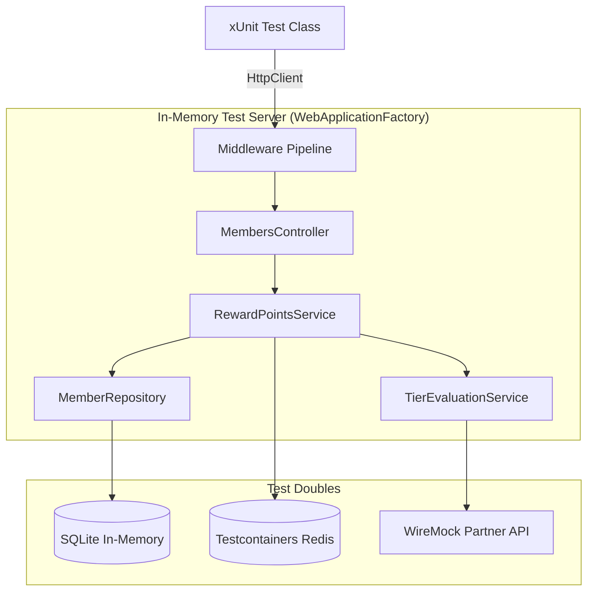
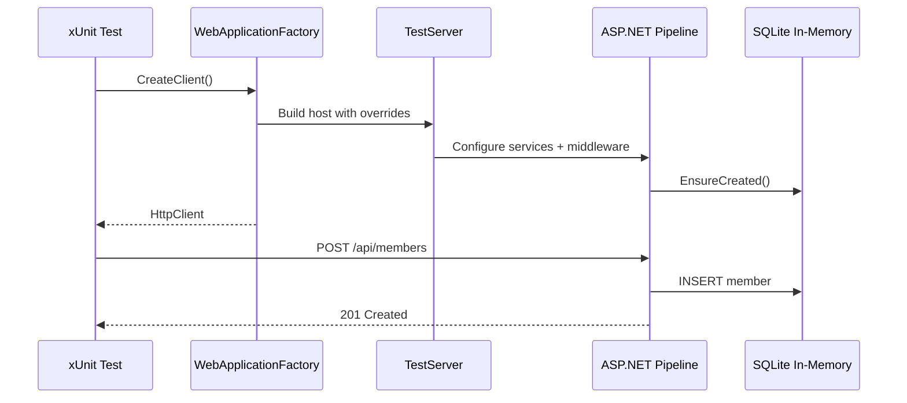
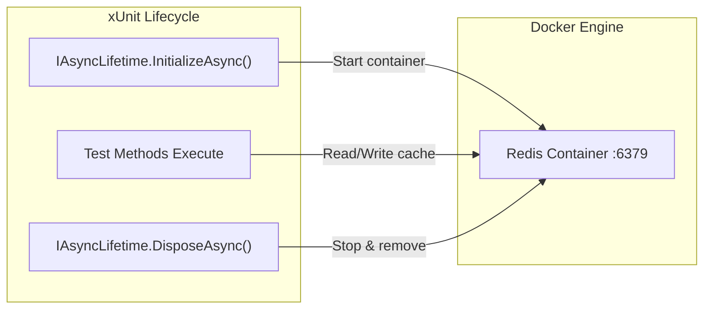
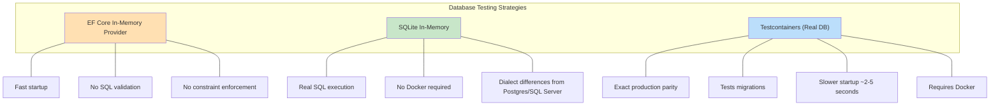
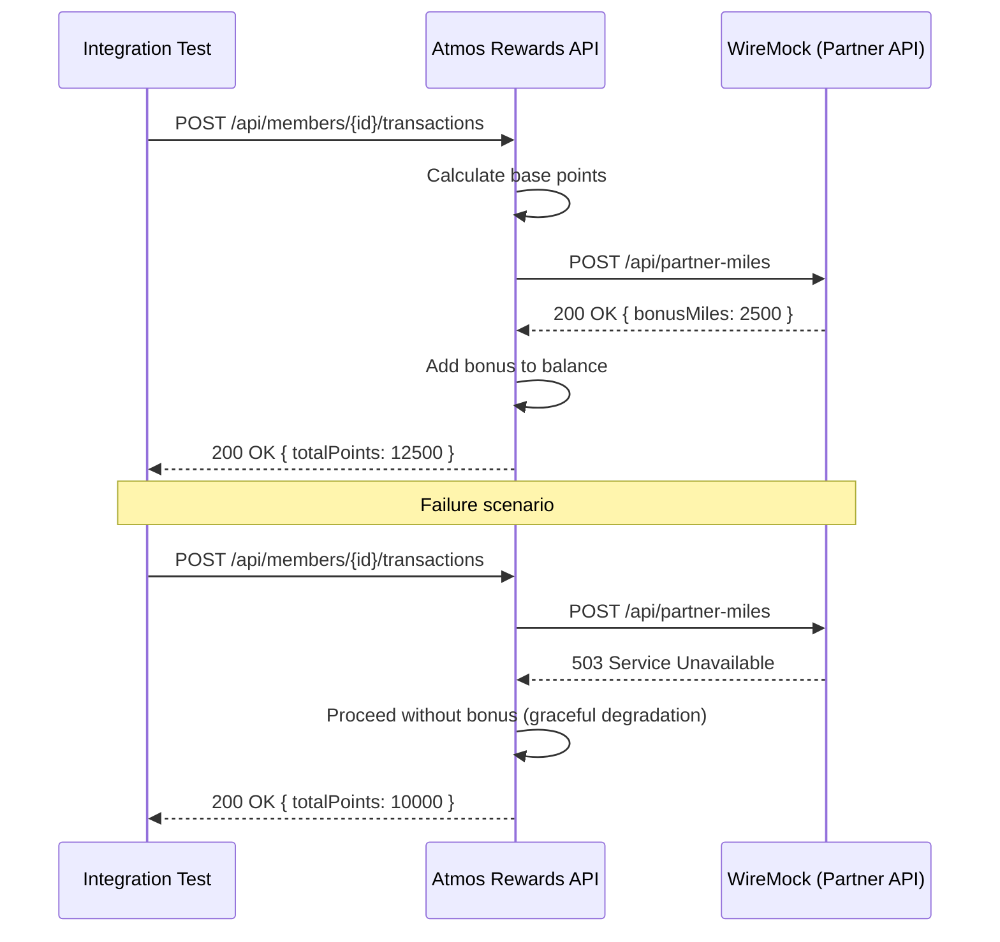
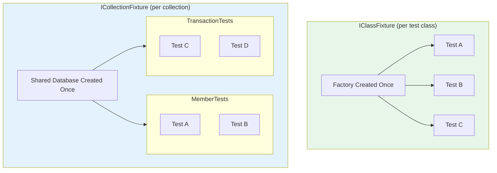

# Integration Testing in .NET

## Overview

Integration testing verifies that multiple components of an application work together correctly, from HTTP entry points through business logic, data access, and external service calls. Unlike unit tests that isolate a single class, integration tests exercise the real pipeline -- middleware, routing, model binding, filters, serialization, and database access -- confirming the system behaves as a whole.

In ASP.NET Core the primary tool is `WebApplicationFactory<T>`, which spins up an in-memory test server hosting the actual application. Combined with libraries like Testcontainers for real databases, WireMock.Net for HTTP dependency simulation, and xUnit fixtures for sharing expensive resources, integration tests can catch configuration errors, serialization bugs, and service wiring mistakes that unit tests miss entirely.

For the Atmos Rewards platform, integration tests ensure that a member earning points on a flight triggers the correct tier evaluation, that Redis caching returns consistent balances, and that partner airline API failures are handled gracefully.



---

## 1. WebApplicationFactory\<T\>

`WebApplicationFactory<TEntryPoint>` creates a `TestServer` that hosts the application in-process. Tests get an `HttpClient` wired directly to that server with no network overhead. The factory allows overriding service registrations, configuration, and logging so the test controls every seam.

A custom factory typically replaces the real database with SQLite in-memory, swaps partner API clients for WireMock endpoints, and injects a test authentication handler.



### Custom WebApplicationFactory with SQLite and Mocked Partner APIs

```csharp
// AtmosRewardsWebApplicationFactory.cs
public class AtmosRewardsWebApplicationFactory : WebApplicationFactory<Program>
{
    private readonly WireMockServer _partnerApiMock;

    public AtmosRewardsWebApplicationFactory()
    {
        _partnerApiMock = WireMockServer.Start();
    }

    public WireMockServer PartnerApiMock => _partnerApiMock;

    protected override void ConfigureWebHost(IWebHostBuilder builder)
    {
        builder.ConfigureServices(services =>
        {
            // Remove the real DbContext registration
            var dbDescriptor = services.SingleOrDefault(
                d => d.ServiceType == typeof(DbContextOptions<AtmosDbContext>));
            if (dbDescriptor is not null)
                services.Remove(dbDescriptor);

            // Replace with SQLite in-memory for deterministic testing
            services.AddDbContext<AtmosDbContext>(options =>
            {
                var connection = new SqliteConnection("DataSource=:memory:");
                connection.Open();
                options.UseSqlite(connection);
            });

            // Point the partner airline HttpClient at WireMock
            services.Configure<PartnerApiOptions>(opts =>
            {
                opts.BaseUrl = _partnerApiMock.Url!;
            });

            // Replace the real Redis cache with an in-memory stub
            var cacheDescriptor = services.SingleOrDefault(
                d => d.ServiceType == typeof(IDistributedCache));
            if (cacheDescriptor is not null)
                services.Remove(cacheDescriptor);

            services.AddDistributedMemoryCache();

            // Ensure the database schema exists
            var sp = services.BuildServiceProvider();
            using var scope = sp.CreateScope();
            var db = scope.ServiceProvider.GetRequiredService<AtmosDbContext>();
            db.Database.EnsureCreated();
        });

        builder.ConfigureTestServices(services =>
        {
            // Add test authentication so requests pass auth middleware
            services.AddAuthentication("Test")
                .AddScheme<AuthenticationSchemeOptions, TestAuthHandler>(
                    "Test", _ => { });
        });
    }

    protected override void Dispose(bool disposing)
    {
        _partnerApiMock.Stop();
        base.Dispose(disposing);
    }
}
```

Key design decisions:

- **SQLite in-memory** keeps the connection open for the lifetime of the factory. If the connection closes, the database vanishes.
- **WireMock** is started in the constructor and its URL injected via options, so the `HttpClient` created by the real DI container hits WireMock instead of the live partner API.
- `ConfigureTestServices` runs after the application's `ConfigureServices`, so test registrations win.

---

## 2. Testcontainers for Real Infrastructure

Testcontainers spins up real Docker containers (PostgreSQL, Redis, RabbitMQ) during test execution. This catches driver-specific SQL issues and caching behaviors that in-memory fakes cannot reproduce.



### Testcontainers Setup for Redis Cache Testing

```csharp
// RedisIntegrationTests.cs
public class RedisIntegrationTests : IAsyncLifetime
{
    private readonly RedisContainer _redisContainer = new RedisBuilder()
        .WithImage("redis:7-alpine")
        .Build();

    private IDistributedCache _cache = null!;
    private ServiceProvider _serviceProvider = null!;

    public async Task InitializeAsync()
    {
        await _redisContainer.StartAsync();

        var services = new ServiceCollection();
        services.AddStackExchangeRedisCache(options =>
        {
            options.Configuration = _redisContainer.GetConnectionString();
            options.InstanceName = "AtmosRewards:";
        });
        _serviceProvider = services.BuildServiceProvider();
        _cache = _serviceProvider.GetRequiredService<IDistributedCache>();
    }

    [Fact]
    public async Task CachedMemberBalance_SurvivesTtl_ThenExpires()
    {
        var memberId = "AK-100200";
        var balance = new MemberBalance(memberId, Points: 48_750, Tier: TierLevel.MVP);
        var json = JsonSerializer.SerializeToUtf8Bytes(balance);

        await _cache.SetAsync(
            $"balance:{memberId}",
            json,
            new DistributedCacheEntryOptions
            {
                AbsoluteExpirationRelativeToNow = TimeSpan.FromSeconds(2)
            });

        // Immediately available
        var cached = await _cache.GetAsync($"balance:{memberId}");
        Assert.NotNull(cached);

        var deserialized = JsonSerializer.Deserialize<MemberBalance>(cached);
        Assert.Equal(48_750, deserialized!.Points);
        Assert.Equal(TierLevel.MVP, deserialized.Tier);

        // Wait for expiration
        await Task.Delay(TimeSpan.FromSeconds(3));
        var expired = await _cache.GetAsync($"balance:{memberId}");
        Assert.Null(expired);
    }

    public async Task DisposeAsync()
    {
        _serviceProvider.Dispose();
        await _redisContainer.DisposeAsync();
    }
}
```

Testcontainers requires Docker to be running. In CI this is typically handled by Docker-in-Docker or a dedicated Docker socket. The container is ephemeral -- created before the test class runs and destroyed after, leaving no state behind.

---

## 3. API Testing with HttpClient

Integration tests use the `HttpClient` from the factory to exercise the full HTTP pipeline. This validates routing, model validation, content negotiation, and status codes.

### End-to-End Test: Create Member, Earn Points, Verify Tier Promotion

```csharp
// MemberTierPromotionTests.cs
public class MemberTierPromotionTests
    : IClassFixture<AtmosRewardsWebApplicationFactory>
{
    private readonly HttpClient _client;
    private readonly WireMockServer _partnerApi;

    public MemberTierPromotionTests(AtmosRewardsWebApplicationFactory factory)
    {
        _client = factory.CreateClient();
        _partnerApi = factory.PartnerApiMock;
    }

    [Fact]
    public async Task Member_EarnsEnoughPoints_GetsPromotedToMvpGold()
    {
        // Arrange -- stub the partner API to award bonus miles
        _partnerApi.Reset();
        _partnerApi
            .Given(Request.Create()
                .WithPath("/api/partner-miles")
                .UsingPost())
            .RespondWith(Response.Create()
                .WithStatusCode(200)
                .WithBodyAsJson(new { bonusMiles = 5_000 }));

        // Act 1 -- create a new member
        var createRequest = new
        {
            FirstName = "Jordan",
            LastName = "Nguyen",
            Email = "jordan.nguyen@example.com"
        };

        var createResponse = await _client.PostAsJsonAsync(
            "/api/members", createRequest);
        createResponse.EnsureSuccessStatusCode();
        var member = await createResponse.Content
            .ReadFromJsonAsync<MemberResponse>();

        Assert.Equal(TierLevel.Base, member!.Tier);
        Assert.Equal(0, member.PointsBalance);

        // Act 2 -- record flight transactions totaling 55,000 points
        //          (MVP Gold threshold is 50,000)
        var flights = new[]
        {
            new { FlightNumber = "AS308", Origin = "SEA", Destination = "LAX", FareAmount = 320.00m },
            new { FlightNumber = "AS118", Origin = "SEA", Destination = "JFK", FareAmount = 580.00m },
            new { FlightNumber = "AS742", Origin = "ANC", Destination = "SEA", FareAmount = 410.00m },
        };

        foreach (var flight in flights)
        {
            var txnResponse = await _client.PostAsJsonAsync(
                $"/api/members/{member.MemberId}/transactions",
                new RewardTransactionRequest
                {
                    FlightNumber = flight.FlightNumber,
                    Origin = flight.Origin,
                    Destination = flight.Destination,
                    FareAmount = flight.FareAmount,
                    TransactionDate = DateOnly.FromDateTime(DateTime.UtcNow)
                });
            txnResponse.EnsureSuccessStatusCode();
        }

        // Assert -- fetch the member and verify tier promotion
        var getResponse = await _client.GetAsync(
            $"/api/members/{member.MemberId}");
        getResponse.EnsureSuccessStatusCode();
        var updated = await getResponse.Content
            .ReadFromJsonAsync<MemberResponse>();

        Assert.True(updated!.PointsBalance >= 50_000,
            $"Expected at least 50,000 points but got {updated.PointsBalance}");
        Assert.Equal(TierLevel.MVPGold, updated.Tier);

        // Verify partner API was called for each transaction
        _partnerApi.LogEntries.Should().HaveCount(3);
    }
}
```

This single test covers the full lifecycle: HTTP POST to create a member, multiple transaction POSTs through the rewards pipeline, tier evaluation triggered as a side effect, and a final GET to verify state. It also confirms the partner API integration by checking WireMock's request log.

---

## 4. Database Testing Strategies

Choosing the right database backend for integration tests involves trade-offs between speed, fidelity, and CI complexity.



| Strategy | Speed | Fidelity | CI Friendly | Best For |
|---|---|---|---|---|
| EF Core In-Memory | Fastest | Low | Yes | Simple CRUD, unit-ish tests |
| SQLite In-Memory | Fast | Medium | Yes | Most integration tests |
| Testcontainers | Slower | Highest | Needs Docker | Migration testing, complex queries |

The Atmos Rewards platform uses SQLite for everyday integration tests and Testcontainers with PostgreSQL for migration and query-specific tests that rely on PostgreSQL features like `jsonb` or window functions.

---

## 5. Mocking External Services with WireMock.Net

WireMock.Net runs an actual HTTP server locally. Unlike mocking an `HttpMessageHandler`, it tests the full `HttpClient` pipeline including serialization, headers, retries, and timeout policies.



### WireMock Setup for Partner Airline API

```csharp
// PartnerApiIntegrationTests.cs
public class PartnerApiIntegrationTests
    : IClassFixture<AtmosRewardsWebApplicationFactory>
{
    private readonly HttpClient _client;
    private readonly WireMockServer _partnerApi;

    public PartnerApiIntegrationTests(AtmosRewardsWebApplicationFactory factory)
    {
        _client = factory.CreateClient();
        _partnerApi = factory.PartnerApiMock;
    }

    [Fact]
    public async Task WhenPartnerApiReturnsBonus_PointsIncludeBonus()
    {
        _partnerApi.Reset();
        _partnerApi
            .Given(Request.Create()
                .WithPath("/api/partner-miles")
                .WithBody(new JsonMatcher(new
                {
                    carrierCode = "AS",
                    origin = "SEA",
                    destination = "HNL"
                }, true))
                .UsingPost())
            .RespondWith(Response.Create()
                .WithStatusCode(200)
                .WithHeader("Content-Type", "application/json")
                .WithBodyAsJson(new { bonusMiles = 3_000 }));

        var response = await _client.PostAsJsonAsync(
            "/api/members/AK-100200/transactions",
            new RewardTransactionRequest
            {
                FlightNumber = "AS888",
                Origin = "SEA",
                Destination = "HNL",
                FareAmount = 650.00m,
                TransactionDate = DateOnly.FromDateTime(DateTime.UtcNow)
            });

        response.EnsureSuccessStatusCode();
        var result = await response.Content
            .ReadFromJsonAsync<TransactionResult>();

        // Base points from fare + 3,000 bonus from partner
        Assert.True(result!.TotalPoints > 3_000);
    }

    [Fact]
    public async Task WhenPartnerApiTimesOut_TransactionStillSucceeds()
    {
        _partnerApi.Reset();
        _partnerApi
            .Given(Request.Create()
                .WithPath("/api/partner-miles")
                .UsingPost())
            .RespondWith(Response.Create()
                .WithDelay(TimeSpan.FromSeconds(30))
                .WithStatusCode(200));

        var response = await _client.PostAsJsonAsync(
            "/api/members/AK-100200/transactions",
            new RewardTransactionRequest
            {
                FlightNumber = "AS100",
                Origin = "SEA",
                Destination = "SFO",
                FareAmount = 180.00m,
                TransactionDate = DateOnly.FromDateTime(DateTime.UtcNow)
            });

        // Should succeed with base points only -- partner timeout is non-fatal
        response.EnsureSuccessStatusCode();
    }
}
```

WireMock strengths for interview discussion: fault injection (`WithFault`), request verification (`LogEntries`), stateful scenarios (`InScenario`), and regex/JsonPath matchers.

---

## 6. Authentication in Tests

Production APIs require JWT tokens from an identity provider. In integration tests a custom `AuthenticationHandler` bypasses real token validation and injects claims directly, letting tests control the member identity.

### Test Authentication Handler with Member Claims

```csharp
// TestAuthHandler.cs
public class TestAuthHandler : AuthenticationHandler<AuthenticationSchemeOptions>
{
    public const string DefaultMemberId = "AK-100200";
    public const string DefaultTier = "MVP";

    public TestAuthHandler(
        IOptionsMonitor<AuthenticationSchemeOptions> options,
        ILoggerFactory logger,
        UrlEncoder encoder)
        : base(options, logger, encoder)
    { }

    protected override Task<AuthenticateResult> HandleAuthenticateAsync()
    {
        // Allow tests to override claims via a custom header
        var memberId = Request.Headers.TryGetValue("X-Test-MemberId", out var id)
            ? id.ToString()
            : DefaultMemberId;

        var tier = Request.Headers.TryGetValue("X-Test-Tier", out var t)
            ? t.ToString()
            : DefaultTier;

        var claims = new[]
        {
            new Claim(ClaimTypes.NameIdentifier, memberId),
            new Claim("member_id", memberId),
            new Claim("tier_level", tier),
            new Claim(ClaimTypes.Email, $"{memberId.ToLower()}@atmosrewards.test"),
            new Claim(ClaimTypes.Role, "Member"),
        };

        var identity = new ClaimsIdentity(claims, "Test");
        var principal = new ClaimsPrincipal(identity);
        var ticket = new AuthenticationTicket(principal, "Test");

        return Task.FromResult(AuthenticateResult.Success(ticket));
    }
}

// Usage in a test -- override the member identity per request
[Fact]
public async Task GetProfile_ReturnsMemberData_ForAuthenticatedMember()
{
    var client = _factory.CreateClient();
    client.DefaultRequestHeaders.Add("X-Test-MemberId", "AK-555888");
    client.DefaultRequestHeaders.Add("X-Test-Tier", "MVPGold");

    var response = await client.GetAsync("/api/members/me");

    response.EnsureSuccessStatusCode();
    var profile = await response.Content.ReadFromJsonAsync<MemberResponse>();
    Assert.Equal("AK-555888", profile!.MemberId);
}
```

The `X-Test-MemberId` header pattern lets each test specify a different identity without creating separate factories. The handler is registered in `ConfigureTestServices` (shown in section 1), so it overrides the real JWT bearer handler.

---

## 7. Test Fixtures and Shared Context

Integration tests that spin up databases or Docker containers benefit from sharing that infrastructure across tests. xUnit provides two mechanisms.



### Collection Fixture Sharing a Database Across Test Classes

```csharp
// AtmosRewardsDatabaseFixture.cs
public class AtmosRewardsDatabaseFixture : IAsyncLifetime
{
    private SqliteConnection _connection = null!;
    public AtmosDbContext DbContext { get; private set; } = null!;
    public AtmosRewardsWebApplicationFactory Factory { get; private set; } = null!;

    public async Task InitializeAsync()
    {
        _connection = new SqliteConnection("DataSource=:memory:");
        await _connection.OpenAsync();

        var options = new DbContextOptionsBuilder<AtmosDbContext>()
            .UseSqlite(_connection)
            .Options;

        DbContext = new AtmosDbContext(options);
        await DbContext.Database.EnsureCreatedAsync();

        // Seed shared reference data used by all test classes
        DbContext.TierThresholds.AddRange(
            new TierThreshold { Tier = TierLevel.Base,    MinPoints = 0 },
            new TierThreshold { Tier = TierLevel.MVP,     MinPoints = 25_000 },
            new TierThreshold { Tier = TierLevel.MVPGold, MinPoints = 50_000 }
        );
        await DbContext.SaveChangesAsync();

        Factory = new AtmosRewardsWebApplicationFactory();
    }

    /// <summary>
    /// Reset transactional data between tests while keeping reference data.
    /// </summary>
    public async Task ResetTransactionalDataAsync()
    {
        DbContext.RewardTransactions.RemoveRange(
            DbContext.RewardTransactions);
        DbContext.Members.RemoveRange(DbContext.Members);
        await DbContext.SaveChangesAsync();
    }

    public async Task DisposeAsync()
    {
        await DbContext.DisposeAsync();
        await _connection.DisposeAsync();
        await Factory.DisposeAsync();
    }
}

// Define the collection
[CollectionDefinition("AtmosDatabase")]
public class AtmosDatabaseCollection
    : ICollectionFixture<AtmosRewardsDatabaseFixture>
{ }

// Test class 1 -- member operations
[Collection("AtmosDatabase")]
public class MemberIntegrationTests : IAsyncLifetime
{
    private readonly AtmosRewardsDatabaseFixture _fixture;
    private readonly HttpClient _client;

    public MemberIntegrationTests(AtmosRewardsDatabaseFixture fixture)
    {
        _fixture = fixture;
        _client = fixture.Factory.CreateClient();
    }

    public async Task InitializeAsync()
        => await _fixture.ResetTransactionalDataAsync();

    public Task DisposeAsync() => Task.CompletedTask;

    [Fact]
    public async Task CreateMember_ReturnsBaseTier()
    {
        var response = await _client.PostAsJsonAsync("/api/members", new
        {
            FirstName = "Casey",
            LastName = "Park",
            Email = "casey.park@example.com"
        });

        response.StatusCode.Should().Be(HttpStatusCode.Created);
        var member = await response.Content.ReadFromJsonAsync<MemberResponse>();
        member!.Tier.Should().Be(TierLevel.Base);
    }
}

// Test class 2 -- transaction operations, shares the same fixture
[Collection("AtmosDatabase")]
public class TransactionIntegrationTests : IAsyncLifetime
{
    private readonly AtmosRewardsDatabaseFixture _fixture;
    private readonly HttpClient _client;

    public TransactionIntegrationTests(AtmosRewardsDatabaseFixture fixture)
    {
        _fixture = fixture;
        _client = fixture.Factory.CreateClient();
    }

    public async Task InitializeAsync()
        => await _fixture.ResetTransactionalDataAsync();

    public Task DisposeAsync() => Task.CompletedTask;

    [Fact]
    public async Task RecordTransaction_IncrementsMemberPoints()
    {
        // Create member first
        var createResponse = await _client.PostAsJsonAsync("/api/members", new
        {
            FirstName = "Taylor",
            LastName = "Kim",
            Email = "taylor.kim@example.com"
        });
        var member = await createResponse.Content
            .ReadFromJsonAsync<MemberResponse>();

        // Record a transaction
        var txnResponse = await _client.PostAsJsonAsync(
            $"/api/members/{member!.MemberId}/transactions",
            new RewardTransactionRequest
            {
                FlightNumber = "AS204",
                Origin = "SEA",
                Destination = "PDX",
                FareAmount = 95.00m,
                TransactionDate = DateOnly.FromDateTime(DateTime.UtcNow)
            });

        txnResponse.EnsureSuccessStatusCode();

        // Verify points increased
        var getResponse = await _client.GetAsync(
            $"/api/members/{member.MemberId}");
        var updated = await getResponse.Content
            .ReadFromJsonAsync<MemberResponse>();

        updated!.PointsBalance.Should().BeGreaterThan(0);
    }
}
```

`IClassFixture<T>` creates one instance per test class. `ICollectionFixture<T>` creates one instance shared across all classes in the collection. The `ResetTransactionalDataAsync` method between tests ensures isolation without the cost of recreating the database.

---

## Summary of Libraries and Their Roles

| Library | Purpose | NuGet Package |
|---|---|---|
| `WebApplicationFactory<T>` | In-memory test server | `Microsoft.AspNetCore.Mvc.Testing` |
| Testcontainers | Real Docker containers for tests | `Testcontainers.Redis`, `Testcontainers.PostgreSql` |
| WireMock.Net | Mock HTTP services | `WireMock.Net` |
| SQLite EF Provider | Lightweight relational test DB | `Microsoft.EntityFrameworkCore.Sqlite` |
| FluentAssertions | Readable assertions | `FluentAssertions` |

---

## Interview Questions

1. **What is `WebApplicationFactory<T>` and why is it preferred over manually setting up a test server?**
   It boots the real ASP.NET Core pipeline in-memory with no network overhead. It uses the actual `Program`/`Startup` configuration so tests catch wiring bugs, middleware ordering issues, and DI misconfigurations. Manual setups miss these because they bypass the framework's hosting infrastructure.

2. **How do you replace a registered service in integration tests?**
   Use `ConfigureTestServices` on the `IWebHostBuilder` inside `WebApplicationFactory`. Registrations there run after the application's `ConfigureServices`, so they override production bindings. For example, replacing the real `IDistributedCache` with `AddDistributedMemoryCache()`.

3. **What are the trade-offs between EF Core In-Memory, SQLite, and Testcontainers for database testing?**
   In-Memory is fastest but does not validate SQL or enforce constraints. SQLite executes real SQL and supports constraints but has dialect differences from production databases. Testcontainers runs the exact production database engine so nothing is faked, but requires Docker and has slower startup. Most teams use SQLite for routine tests and Testcontainers for migration and query-specific tests.

4. **How does WireMock.Net differ from mocking `HttpMessageHandler` directly?**
   WireMock runs a real HTTP server, so the test exercises the full `HttpClient` pipeline including DNS resolution config, serialization, headers, and Polly retry policies. Handler mocks skip all of that. WireMock also supports stateful scenarios, fault injection, request verification, and regex/JSON matchers.

5. **How do you handle authentication in integration tests without a real identity provider?**
   Register a custom `AuthenticationHandler<AuthenticationSchemeOptions>` in `ConfigureTestServices`. The handler creates a `ClaimsPrincipal` with the desired claims and returns `AuthenticateResult.Success`. Tests can vary identity per request using custom headers that the handler reads.

6. **What is the difference between `IClassFixture<T>` and `ICollectionFixture<T>` in xUnit?**
   `IClassFixture<T>` creates one fixture instance per test class, shared across all tests in that class. `ICollectionFixture<T>` creates one fixture instance shared across all test classes in the same `[Collection]`. Collection fixtures reduce setup cost when multiple test classes need the same expensive resource like a database or Docker container.

7. **How do you ensure test isolation when sharing a database fixture across tests?**
   Reset transactional data between tests using `IAsyncLifetime.InitializeAsync`. Keep reference/seed data intact and only clear the tables that tests write to. Alternatively, wrap each test in a transaction and roll it back in cleanup, though this can interfere with `SaveChangesAsync` behavior in the code under test.

8. **A test passes locally but fails in CI. What do you check?**
   Port conflicts (WireMock), Docker availability (Testcontainers), test ordering dependencies (xUnit runs tests in parallel by default within a collection unless `[Collection]` groups them), timing-sensitive assertions (`Task.Delay`-based cache expiry tests), and environment-specific configuration that leaks into the test host.

9. **When would you choose integration tests over unit tests for the Atmos Rewards platform?**
   When verifying cross-cutting concerns: Does the tier promotion trigger after a transaction is saved? Does the caching layer return stale data correctly? Does the partner API timeout policy degrade gracefully? Unit tests verify `RewardPointsService.CalculatePoints` in isolation; integration tests verify the full pipeline from HTTP request to database write to cache update.
