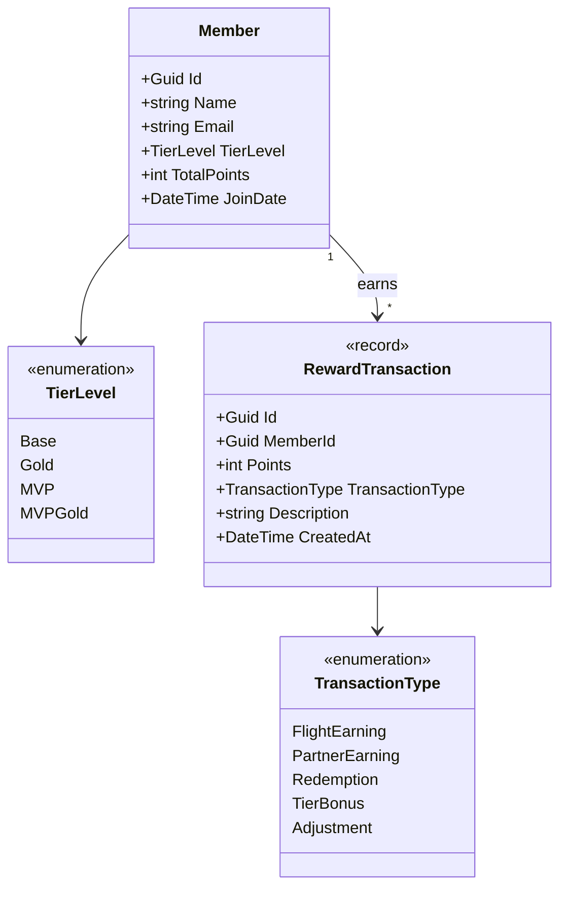
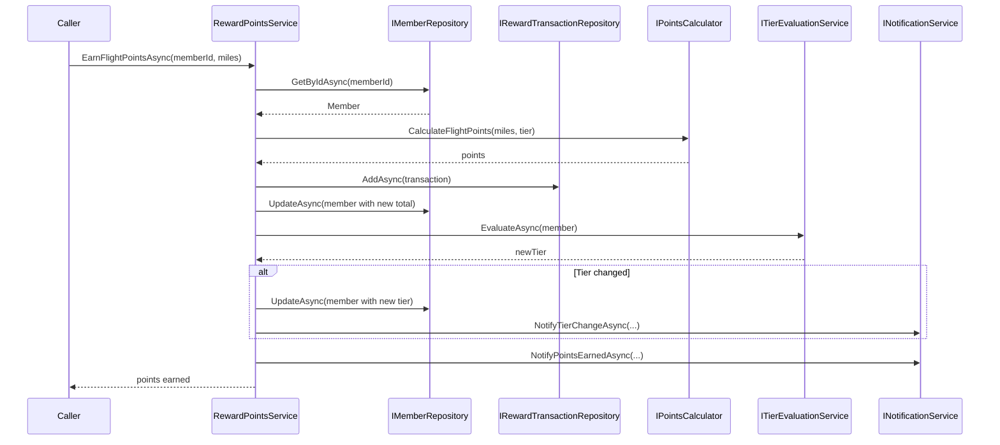
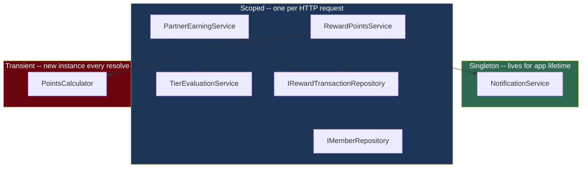

# C# Dependency Injection and Testing: End-to-End Walkthrough

## Overview

This document is a complete, self-contained walkthrough that combines domain models, service interfaces, business logic implementations, DI registration, and unit tests into a single reference. It follows the natural build order of a real feature for the Atmos Rewards platform: define the domain, declare abstractions, implement services, wire everything through the DI container, and prove correctness with tests.

Every code block compiles as part of a coherent system. The progression is intentional -- each section depends on the ones before it, so reading top to bottom gives you the full picture of how a well-structured .NET service layer comes together.


---

## 1. Domain Models

The domain layer has no dependencies on frameworks, DI, or infrastructure. These are plain C# types that represent the core concepts of the Atmos Rewards system.



### Enums

```csharp
namespace AtmosRewards.Domain;

public enum TierLevel
{
    Base = 0,
    Gold = 1,
    MVP = 2,
    MVPGold = 3
}

public enum TransactionType
{
    FlightEarning,
    PartnerEarning,
    Redemption,
    TierBonus,
    Adjustment
}
```

### Member entity

```csharp
namespace AtmosRewards.Domain;

public class Member
{
    public Guid Id { get; set; }
    public string Name { get; set; } = string.Empty;
    public string Email { get; set; } = string.Empty;
    public TierLevel TierLevel { get; set; } = TierLevel.Base;
    public int TotalPoints { get; set; }
    public DateTime JoinDate { get; set; }
}
```

### RewardTransaction record

Using a `record` instead of a class because transactions are immutable once created. Records give value-based equality and a concise syntax.

```csharp
namespace AtmosRewards.Domain;

public record RewardTransaction(
    Guid Id,
    Guid MemberId,
    int Points,
    TransactionType TransactionType,
    string Description,
    DateTime CreatedAt);
```

---

## 2. Interfaces

Clean abstractions define the contracts that the rest of the system depends on. Every service and repository is accessed through an interface, which makes testing with mocks straightforward.

### Repository interfaces

```csharp
namespace AtmosRewards.Domain.Interfaces;

public interface IMemberRepository
{
    /// Retrieve a member by their unique identifier.
    Task<Member?> GetByIdAsync(Guid memberId);

    /// Persist changes to a member entity.
    Task UpdateAsync(Member member);

    /// Retrieve all members at a given tier level.
    Task<IReadOnlyList<Member>> GetByTierAsync(TierLevel tier);
}

public interface IRewardTransactionRepository
{
    /// Persist a new reward transaction.
    Task AddAsync(RewardTransaction transaction);

    /// Retrieve all transactions for a specific member.
    Task<IReadOnlyList<RewardTransaction>> GetByMemberIdAsync(Guid memberId);

    /// Retrieve the total points earned by a member across all transactions.
    Task<int> GetSummaryAsync(Guid memberId);
}
```

### Service interfaces

```csharp
namespace AtmosRewards.Domain.Interfaces;

public interface IPointsCalculator
{
    /// Calculate points earned from a flight based on miles and tier multiplier.
    int CalculateFlightPoints(int miles, TierLevel tier);

    /// Calculate points earned from a partner transaction.
    int CalculatePartnerPoints(decimal amount, string partnerCode);
}

public interface ITierEvaluationService
{
    /// Evaluate whether a member's tier should change based on their current points.
    Task<TierLevel> EvaluateAsync(Member member);
}

public interface INotificationService
{
    /// Notify a member that their tier has changed.
    Task NotifyTierChangeAsync(Guid memberId, TierLevel oldTier, TierLevel newTier);

    /// Notify a member that they earned points.
    Task NotifyPointsEarnedAsync(Guid memberId, int points, string description);
}
```

---

## 3. Service Implementations

### PointsCalculator

A stateless calculator with no dependencies. Registered as Transient because it holds no state.

```csharp
namespace AtmosRewards.Services;

using AtmosRewards.Domain;
using AtmosRewards.Domain.Interfaces;

public class PointsCalculator : IPointsCalculator
{
    private static readonly Dictionary<string, decimal> PartnerRates = new()
    {
        ["HOTEL_AA"] = 2.0m,
        ["CAR_HERTZ"] = 1.5m,
        ["DINING_DEFAULT"] = 1.0m
    };

    /// Calculate points earned from a flight based on miles and tier multiplier.
    public int CalculateFlightPoints(int miles, TierLevel tier)
    {
        if (miles <= 0)
            return 0;

        double multiplier = tier switch
        {
            TierLevel.MVPGold => 2.0,
            TierLevel.MVP => 1.5,
            TierLevel.Gold => 1.25,
            _ => 1.0
        };

        return (int)(miles * multiplier);
    }

    /// Calculate points earned from a partner transaction.
    public int CalculatePartnerPoints(decimal amount, string partnerCode)
    {
        if (amount <= 0)
            return 0;

        decimal rate = PartnerRates.GetValueOrDefault(partnerCode, 1.0m);
        return (int)(amount * rate);
    }
}
```

### RewardPointsService

The main orchestrator for earning and redeeming points. It coordinates between the repository, calculator, tier evaluation, and notification services.



```csharp
namespace AtmosRewards.Services;

using AtmosRewards.Domain;
using AtmosRewards.Domain.Interfaces;

public class RewardPointsService
{
    private readonly IMemberRepository _memberRepository;
    private readonly IRewardTransactionRepository _transactionRepository;
    private readonly IPointsCalculator _pointsCalculator;
    private readonly ITierEvaluationService _tierEvaluationService;
    private readonly INotificationService _notificationService;

    public RewardPointsService(
        IMemberRepository memberRepository,
        IRewardTransactionRepository transactionRepository,
        IPointsCalculator pointsCalculator,
        ITierEvaluationService tierEvaluationService,
        INotificationService notificationService)
    {
        _memberRepository = memberRepository;
        _transactionRepository = transactionRepository;
        _pointsCalculator = pointsCalculator;
        _tierEvaluationService = tierEvaluationService;
        _notificationService = notificationService;
    }

    /// Earn flight points for a member and trigger tier evaluation.
    public async Task<int> EarnFlightPointsAsync(Guid memberId, int miles)
    {
        var member = await _memberRepository.GetByIdAsync(memberId)
            ?? throw new ArgumentException($"Member {memberId} not found.");

        int points = _pointsCalculator.CalculateFlightPoints(miles, member.TierLevel);

        var transaction = new RewardTransaction(
            Id: Guid.NewGuid(),
            MemberId: memberId,
            Points: points,
            TransactionType: TransactionType.FlightEarning,
            Description: $"Flight earning: {miles} miles",
            CreatedAt: DateTime.UtcNow);

        await _transactionRepository.AddAsync(transaction);

        member.TotalPoints += points;
        await _memberRepository.UpdateAsync(member);

        await EvaluateTierAsync(member);
        await _notificationService.NotifyPointsEarnedAsync(
            memberId, points, transaction.Description);

        return points;
    }

    /// Earn partner points for a member based on a purchase amount and partner code.
    public async Task<int> EarnPartnerPointsAsync(
        Guid memberId, decimal amount, string partnerCode)
    {
        var member = await _memberRepository.GetByIdAsync(memberId)
            ?? throw new ArgumentException($"Member {memberId} not found.");

        int points = _pointsCalculator.CalculatePartnerPoints(amount, partnerCode);

        var transaction = new RewardTransaction(
            Id: Guid.NewGuid(),
            MemberId: memberId,
            Points: points,
            TransactionType: TransactionType.PartnerEarning,
            Description: $"Partner earning: {partnerCode} ${amount}",
            CreatedAt: DateTime.UtcNow);

        await _transactionRepository.AddAsync(transaction);

        member.TotalPoints += points;
        await _memberRepository.UpdateAsync(member);

        await EvaluateTierAsync(member);
        await _notificationService.NotifyPointsEarnedAsync(
            memberId, points, transaction.Description);

        return points;
    }

    /// Redeem points from a member's balance.
    public async Task RedeemPointsAsync(Guid memberId, int points, string description)
    {
        if (points <= 0)
            throw new ArgumentException("Redemption points must be positive.");

        var member = await _memberRepository.GetByIdAsync(memberId)
            ?? throw new ArgumentException($"Member {memberId} not found.");

        if (member.TotalPoints < points)
            throw new InvalidOperationException(
                $"Insufficient balance. Available: {member.TotalPoints}, requested: {points}.");

        var transaction = new RewardTransaction(
            Id: Guid.NewGuid(),
            MemberId: memberId,
            Points: -points,
            TransactionType: TransactionType.Redemption,
            Description: description,
            CreatedAt: DateTime.UtcNow);

        await _transactionRepository.AddAsync(transaction);

        member.TotalPoints -= points;
        await _memberRepository.UpdateAsync(member);
    }

    /// Evaluate and apply tier changes for a member.
    private async Task EvaluateTierAsync(Member member)
    {
        var newTier = await _tierEvaluationService.EvaluateAsync(member);

        if (newTier != member.TierLevel)
        {
            var oldTier = member.TierLevel;
            member.TierLevel = newTier;
            await _memberRepository.UpdateAsync(member);
            await _notificationService.NotifyTierChangeAsync(
                member.Id, oldTier, newTier);
        }
    }
}
```

### TierEvaluationService

Evaluates whether a member qualifies for a higher (or lower) tier based on their total points.

```csharp
namespace AtmosRewards.Services;

using AtmosRewards.Domain;
using AtmosRewards.Domain.Interfaces;

public class TierEvaluationService : ITierEvaluationService
{
    private const int GoldThreshold = 20_000;
    private const int MvpThreshold = 50_000;
    private const int MvpGoldThreshold = 100_000;

    /// Evaluate whether a member's tier should change based on their current points.
    public Task<TierLevel> EvaluateAsync(Member member)
    {
        var tier = member.TotalPoints switch
        {
            >= MvpGoldThreshold => TierLevel.MVPGold,
            >= MvpThreshold => TierLevel.MVP,
            >= GoldThreshold => TierLevel.Gold,
            _ => TierLevel.Base
        };

        return Task.FromResult(tier);
    }
}
```

### PartnerEarningService

A separate service that encapsulates partner-specific earning rates. In a production system this might call an external partner API.

```csharp
namespace AtmosRewards.Services;

using AtmosRewards.Domain;
using AtmosRewards.Domain.Interfaces;

public class PartnerEarningService
{
    private readonly IPointsCalculator _calculator;
    private readonly IRewardTransactionRepository _transactionRepository;

    public PartnerEarningService(
        IPointsCalculator calculator,
        IRewardTransactionRepository transactionRepository)
    {
        _calculator = calculator;
        _transactionRepository = transactionRepository;
    }

    /// Calculate and record partner points for a given purchase.
    public async Task<int> ProcessPartnerPurchaseAsync(
        Guid memberId, decimal amount, string partnerCode)
    {
        int points = _calculator.CalculatePartnerPoints(amount, partnerCode);

        if (points > 0)
        {
            var transaction = new RewardTransaction(
                Id: Guid.NewGuid(),
                MemberId: memberId,
                Points: points,
                TransactionType: TransactionType.PartnerEarning,
                Description: $"Partner purchase: {partnerCode}",
                CreatedAt: DateTime.UtcNow);

            await _transactionRepository.AddAsync(transaction);
        }

        return points;
    }
}
```

---

## 4. DI Registration

With models, interfaces, and implementations defined, `Program.cs` wires everything into the container. Each lifetime is chosen deliberately.



```csharp
// Program.cs
using AtmosRewards.Domain.Interfaces;
using AtmosRewards.Services;
using AtmosRewards.Infrastructure;

var builder = WebApplication.CreateBuilder(args);

// --- Database ---
builder.Services.AddDbContext<AtmosDbContext>(options =>
    options.UseSqlServer(
        builder.Configuration.GetConnectionString("AtmosRewards")));

// --- Repositories (Scoped: tied to DbContext lifetime) ---
builder.Services.AddScoped<IMemberRepository, MemberRepository>();
builder.Services.AddScoped<IRewardTransactionRepository, RewardTransactionRepository>();

// --- Calculators (Transient: stateless, lightweight) ---
builder.Services.AddTransient<IPointsCalculator, PointsCalculator>();

// --- Services (Scoped: per-request business logic) ---
builder.Services.AddScoped<RewardPointsService>();
builder.Services.AddScoped<ITierEvaluationService, TierEvaluationService>();
builder.Services.AddScoped<PartnerEarningService>();

// --- Notifications (Singleton: thread-safe, holds no per-request state) ---
builder.Services.AddSingleton<INotificationService, NotificationService>();

// --- Validation ---
builder.Host.UseDefaultServiceProvider(options =>
{
    options.ValidateScopes = true;
    options.ValidateOnBuild = true;
});

var app = builder.Build();

app.MapControllers();
app.Run();
```

### Why each lifetime was chosen

| Service | Lifetime | Reason |
|---------|----------|--------|
| `MemberRepository` | Scoped | Depends on `DbContext`, which is scoped |
| `RewardTransactionRepository` | Scoped | Same -- depends on `DbContext` |
| `PointsCalculator` | Transient | Stateless, no dependencies that constrain lifetime |
| `RewardPointsService` | Scoped | Orchestrates scoped repositories |
| `TierEvaluationService` | Scoped | May need scoped data in the future |
| `PartnerEarningService` | Scoped | Uses scoped transaction repository |
| `NotificationService` | Singleton | Thread-safe, sends fire-and-forget messages |

---

## 5. Unit Tests

The tests use **xUnit** as the test framework, **Moq** for creating mock dependencies, and **FluentAssertions** for expressive assertions. Each test class focuses on one service and mocks everything else.

### Test project dependencies

```xml
<!-- AtmosRewards.Tests.csproj -->
<Project Sdk="Microsoft.NET.Sdk">
  <PropertyGroup>
    <TargetFramework>net8.0</TargetFramework>
    <IsPackable>false</IsPackable>
  </PropertyGroup>

  <ItemGroup>
    <PackageReference Include="Microsoft.NET.Test.Sdk" Version="17.*" />
    <PackageReference Include="xunit" Version="2.*" />
    <PackageReference Include="xunit.runner.visualstudio" Version="2.*" />
    <PackageReference Include="Moq" Version="4.*" />
    <PackageReference Include="FluentAssertions" Version="7.*" />
  </ItemGroup>

  <ItemGroup>
    <ProjectReference Include="../AtmosRewards/AtmosRewards.csproj" />
  </ItemGroup>
</Project>
```

### RewardPointsServiceTests

```csharp
namespace AtmosRewards.Tests;

using AtmosRewards.Domain;
using AtmosRewards.Domain.Interfaces;
using AtmosRewards.Services;
using FluentAssertions;
using Moq;
using Xunit;

public class RewardPointsServiceTests
{
    private readonly Mock<IMemberRepository> _memberRepoMock;
    private readonly Mock<IRewardTransactionRepository> _transactionRepoMock;
    private readonly Mock<IPointsCalculator> _calculatorMock;
    private readonly Mock<ITierEvaluationService> _tierEvalMock;
    private readonly Mock<INotificationService> _notificationMock;
    private readonly RewardPointsService _sut;

    public RewardPointsServiceTests()
    {
        _memberRepoMock = new Mock<IMemberRepository>();
        _transactionRepoMock = new Mock<IRewardTransactionRepository>();
        _calculatorMock = new Mock<IPointsCalculator>();
        _tierEvalMock = new Mock<ITierEvaluationService>();
        _notificationMock = new Mock<INotificationService>();

        _sut = new RewardPointsService(
            _memberRepoMock.Object,
            _transactionRepoMock.Object,
            _calculatorMock.Object,
            _tierEvalMock.Object,
            _notificationMock.Object);
    }

    // -- Helper --

    private static Member CreateMember(
        int totalPoints = 10_000,
        TierLevel tier = TierLevel.Gold)
    {
        return new Member
        {
            Id = Guid.NewGuid(),
            Name = "Test Member",
            Email = "test@alaska.com",
            TierLevel = tier,
            TotalPoints = totalPoints,
            JoinDate = new DateTime(2023, 1, 1)
        };
    }

    // -------------------------------------------------------------------
    // EarnFlightPointsAsync
    // -------------------------------------------------------------------

    [Fact]
    public async Task EarnFlightPointsAsync_ValidMember_ReturnsCalculatedPoints()
    {
        // Arrange
        var member = CreateMember();
        _memberRepoMock
            .Setup(r => r.GetByIdAsync(member.Id))
            .ReturnsAsync(member);
        _calculatorMock
            .Setup(c => c.CalculateFlightPoints(500, TierLevel.Gold))
            .Returns(625);
        _tierEvalMock
            .Setup(t => t.EvaluateAsync(It.IsAny<Member>()))
            .ReturnsAsync(TierLevel.Gold);

        // Act
        int result = await _sut.EarnFlightPointsAsync(member.Id, 500);

        // Assert
        result.Should().Be(625);
    }

    [Fact]
    public async Task EarnFlightPointsAsync_ValidMember_PersistsTransaction()
    {
        // Arrange
        var member = CreateMember();
        _memberRepoMock
            .Setup(r => r.GetByIdAsync(member.Id))
            .ReturnsAsync(member);
        _calculatorMock
            .Setup(c => c.CalculateFlightPoints(It.IsAny<int>(), It.IsAny<TierLevel>()))
            .Returns(100);
        _tierEvalMock
            .Setup(t => t.EvaluateAsync(It.IsAny<Member>()))
            .ReturnsAsync(TierLevel.Gold);

        // Act
        await _sut.EarnFlightPointsAsync(member.Id, 100);

        // Assert
        _transactionRepoMock.Verify(
            r => r.AddAsync(It.Is<RewardTransaction>(t =>
                t.MemberId == member.Id &&
                t.Points == 100 &&
                t.TransactionType == TransactionType.FlightEarning)),
            Times.Once);
    }

    [Fact]
    public async Task EarnFlightPointsAsync_ValidMember_UpdatesMemberTotalPoints()
    {
        // Arrange
        var member = CreateMember(totalPoints: 5_000);
        _memberRepoMock
            .Setup(r => r.GetByIdAsync(member.Id))
            .ReturnsAsync(member);
        _calculatorMock
            .Setup(c => c.CalculateFlightPoints(1000, TierLevel.Gold))
            .Returns(1_250);
        _tierEvalMock
            .Setup(t => t.EvaluateAsync(It.IsAny<Member>()))
            .ReturnsAsync(TierLevel.Gold);

        // Act
        await _sut.EarnFlightPointsAsync(member.Id, 1000);

        // Assert
        _memberRepoMock.Verify(
            r => r.UpdateAsync(It.Is<Member>(m => m.TotalPoints == 6_250)),
            Times.AtLeastOnce);
    }

    [Fact]
    public async Task EarnFlightPointsAsync_TierChanges_NotifiesMember()
    {
        // Arrange
        var member = CreateMember(totalPoints: 49_000, tier: TierLevel.Gold);
        _memberRepoMock
            .Setup(r => r.GetByIdAsync(member.Id))
            .ReturnsAsync(member);
        _calculatorMock
            .Setup(c => c.CalculateFlightPoints(It.IsAny<int>(), It.IsAny<TierLevel>()))
            .Returns(2_000);
        _tierEvalMock
            .Setup(t => t.EvaluateAsync(It.IsAny<Member>()))
            .ReturnsAsync(TierLevel.MVP); // promoted

        // Act
        await _sut.EarnFlightPointsAsync(member.Id, 1600);

        // Assert
        _notificationMock.Verify(
            n => n.NotifyTierChangeAsync(member.Id, TierLevel.Gold, TierLevel.MVP),
            Times.Once);
    }

    [Fact]
    public async Task EarnFlightPointsAsync_TierUnchanged_DoesNotNotifyTierChange()
    {
        // Arrange
        var member = CreateMember(totalPoints: 10_000, tier: TierLevel.Gold);
        _memberRepoMock
            .Setup(r => r.GetByIdAsync(member.Id))
            .ReturnsAsync(member);
        _calculatorMock
            .Setup(c => c.CalculateFlightPoints(It.IsAny<int>(), It.IsAny<TierLevel>()))
            .Returns(500);
        _tierEvalMock
            .Setup(t => t.EvaluateAsync(It.IsAny<Member>()))
            .ReturnsAsync(TierLevel.Gold); // same tier

        // Act
        await _sut.EarnFlightPointsAsync(member.Id, 400);

        // Assert
        _notificationMock.Verify(
            n => n.NotifyTierChangeAsync(
                It.IsAny<Guid>(), It.IsAny<TierLevel>(), It.IsAny<TierLevel>()),
            Times.Never);
    }

    [Fact]
    public async Task EarnFlightPointsAsync_MemberNotFound_ThrowsArgumentException()
    {
        // Arrange
        var unknownId = Guid.NewGuid();
        _memberRepoMock
            .Setup(r => r.GetByIdAsync(unknownId))
            .ReturnsAsync((Member?)null);

        // Act
        Func<Task> act = () => _sut.EarnFlightPointsAsync(unknownId, 500);

        // Assert
        await act.Should().ThrowAsync<ArgumentException>()
            .WithMessage($"*{unknownId}*");
    }

    [Fact]
    public async Task EarnFlightPointsAsync_AlwaysSendsPointsEarnedNotification()
    {
        // Arrange
        var member = CreateMember();
        _memberRepoMock
            .Setup(r => r.GetByIdAsync(member.Id))
            .ReturnsAsync(member);
        _calculatorMock
            .Setup(c => c.CalculateFlightPoints(It.IsAny<int>(), It.IsAny<TierLevel>()))
            .Returns(750);
        _tierEvalMock
            .Setup(t => t.EvaluateAsync(It.IsAny<Member>()))
            .ReturnsAsync(member.TierLevel);

        // Act
        await _sut.EarnFlightPointsAsync(member.Id, 600);

        // Assert
        _notificationMock.Verify(
            n => n.NotifyPointsEarnedAsync(member.Id, 750, It.IsAny<string>()),
            Times.Once);
    }

    // -------------------------------------------------------------------
    // EarnPartnerPointsAsync
    // -------------------------------------------------------------------

    [Fact]
    public async Task EarnPartnerPointsAsync_ValidPartner_ReturnsCalculatedPoints()
    {
        // Arrange
        var member = CreateMember();
        _memberRepoMock
            .Setup(r => r.GetByIdAsync(member.Id))
            .ReturnsAsync(member);
        _calculatorMock
            .Setup(c => c.CalculatePartnerPoints(150.00m, "HOTEL_AA"))
            .Returns(300);
        _tierEvalMock
            .Setup(t => t.EvaluateAsync(It.IsAny<Member>()))
            .ReturnsAsync(member.TierLevel);

        // Act
        int result = await _sut.EarnPartnerPointsAsync(member.Id, 150.00m, "HOTEL_AA");

        // Assert
        result.Should().Be(300);
    }

    [Fact]
    public async Task EarnPartnerPointsAsync_PersistsPartnerTransaction()
    {
        // Arrange
        var member = CreateMember();
        _memberRepoMock
            .Setup(r => r.GetByIdAsync(member.Id))
            .ReturnsAsync(member);
        _calculatorMock
            .Setup(c => c.CalculatePartnerPoints(It.IsAny<decimal>(), It.IsAny<string>()))
            .Returns(200);
        _tierEvalMock
            .Setup(t => t.EvaluateAsync(It.IsAny<Member>()))
            .ReturnsAsync(member.TierLevel);

        // Act
        await _sut.EarnPartnerPointsAsync(member.Id, 100.00m, "CAR_HERTZ");

        // Assert
        _transactionRepoMock.Verify(
            r => r.AddAsync(It.Is<RewardTransaction>(t =>
                t.TransactionType == TransactionType.PartnerEarning &&
                t.Points == 200)),
            Times.Once);
    }

    // -------------------------------------------------------------------
    // RedeemPointsAsync
    // -------------------------------------------------------------------

    [Fact]
    public async Task RedeemPointsAsync_SufficientBalance_DeductsPoints()
    {
        // Arrange
        var member = CreateMember(totalPoints: 5_000);
        _memberRepoMock
            .Setup(r => r.GetByIdAsync(member.Id))
            .ReturnsAsync(member);

        // Act
        await _sut.RedeemPointsAsync(member.Id, 2_000, "Seat upgrade");

        // Assert
        _memberRepoMock.Verify(
            r => r.UpdateAsync(It.Is<Member>(m => m.TotalPoints == 3_000)),
            Times.Once);
    }

    [Fact]
    public async Task RedeemPointsAsync_SufficientBalance_PersistsNegativeTransaction()
    {
        // Arrange
        var member = CreateMember(totalPoints: 5_000);
        _memberRepoMock
            .Setup(r => r.GetByIdAsync(member.Id))
            .ReturnsAsync(member);

        // Act
        await _sut.RedeemPointsAsync(member.Id, 1_000, "Lounge access");

        // Assert
        _transactionRepoMock.Verify(
            r => r.AddAsync(It.Is<RewardTransaction>(t =>
                t.Points == -1_000 &&
                t.TransactionType == TransactionType.Redemption)),
            Times.Once);
    }

    [Fact]
    public async Task RedeemPointsAsync_InsufficientBalance_ThrowsInvalidOperation()
    {
        // Arrange
        var member = CreateMember(totalPoints: 500);
        _memberRepoMock
            .Setup(r => r.GetByIdAsync(member.Id))
            .ReturnsAsync(member);

        // Act
        Func<Task> act = () => _sut.RedeemPointsAsync(member.Id, 1_000, "Upgrade");

        // Assert
        await act.Should().ThrowAsync<InvalidOperationException>()
            .WithMessage("*Insufficient balance*");
    }

    [Fact]
    public async Task RedeemPointsAsync_ZeroPoints_ThrowsArgumentException()
    {
        // Act
        Func<Task> act = () => _sut.RedeemPointsAsync(Guid.NewGuid(), 0, "Nothing");

        // Assert
        await act.Should().ThrowAsync<ArgumentException>()
            .WithMessage("*positive*");
    }

    [Fact]
    public async Task RedeemPointsAsync_NegativePoints_ThrowsArgumentException()
    {
        // Act
        Func<Task> act = () => _sut.RedeemPointsAsync(Guid.NewGuid(), -100, "Negative");

        // Assert
        await act.Should().ThrowAsync<ArgumentException>();
    }
}
```

### TierEvaluationServiceTests

Parameterized tests (`[Theory]` with `[InlineData]`) cover every tier boundary cleanly.

```csharp
namespace AtmosRewards.Tests;

using AtmosRewards.Domain;
using AtmosRewards.Services;
using FluentAssertions;
using Xunit;

public class TierEvaluationServiceTests
{
    private readonly TierEvaluationService _sut = new();

    private static Member CreateMember(int totalPoints) => new()
    {
        Id = Guid.NewGuid(),
        Name = "Tier Test",
        Email = "tier@alaska.com",
        TierLevel = TierLevel.Base,
        TotalPoints = totalPoints,
        JoinDate = DateTime.UtcNow
    };

    // -------------------------------------------------------------------
    // Tier boundary tests (parameterized)
    // -------------------------------------------------------------------

    [Theory]
    [InlineData(0, TierLevel.Base)]
    [InlineData(10_000, TierLevel.Base)]
    [InlineData(19_999, TierLevel.Base)]
    [InlineData(20_000, TierLevel.Gold)]
    [InlineData(35_000, TierLevel.Gold)]
    [InlineData(49_999, TierLevel.Gold)]
    [InlineData(50_000, TierLevel.MVP)]
    [InlineData(75_000, TierLevel.MVP)]
    [InlineData(99_999, TierLevel.MVP)]
    [InlineData(100_000, TierLevel.MVPGold)]
    [InlineData(250_000, TierLevel.MVPGold)]
    public async Task EvaluateAsync_GivenPoints_ReturnsExpectedTier(
        int points, TierLevel expectedTier)
    {
        // Arrange
        var member = CreateMember(points);

        // Act
        var result = await _sut.EvaluateAsync(member);

        // Assert
        result.Should().Be(expectedTier);
    }

    // -------------------------------------------------------------------
    // Promotion scenarios
    // -------------------------------------------------------------------

    [Fact]
    public async Task EvaluateAsync_ExactGoldThreshold_ReturnsGold()
    {
        var member = CreateMember(20_000);

        var result = await _sut.EvaluateAsync(member);

        result.Should().Be(TierLevel.Gold);
    }

    [Fact]
    public async Task EvaluateAsync_ExactMvpThreshold_ReturnsMvp()
    {
        var member = CreateMember(50_000);

        var result = await _sut.EvaluateAsync(member);

        result.Should().Be(TierLevel.MVP);
    }

    [Fact]
    public async Task EvaluateAsync_ExactMvpGoldThreshold_ReturnsMvpGold()
    {
        var member = CreateMember(100_000);

        var result = await _sut.EvaluateAsync(member);

        result.Should().Be(TierLevel.MVPGold);
    }

    // -------------------------------------------------------------------
    // Demotion scenarios
    // -------------------------------------------------------------------

    [Fact]
    public async Task EvaluateAsync_PointsBelowGold_ReturnsBase()
    {
        var member = CreateMember(19_999);
        member.TierLevel = TierLevel.Gold; // was Gold, but points dropped

        var result = await _sut.EvaluateAsync(member);

        result.Should().Be(TierLevel.Base);
    }

    [Fact]
    public async Task EvaluateAsync_PointsBelowMvp_ReturnsGold()
    {
        var member = CreateMember(45_000);
        member.TierLevel = TierLevel.MVP; // was MVP, but points dropped

        var result = await _sut.EvaluateAsync(member);

        result.Should().Be(TierLevel.Gold);
    }

    // -------------------------------------------------------------------
    // Edge cases
    // -------------------------------------------------------------------

    [Fact]
    public async Task EvaluateAsync_ZeroPoints_ReturnsBase()
    {
        var member = CreateMember(0);

        var result = await _sut.EvaluateAsync(member);

        result.Should().Be(TierLevel.Base);
    }

    [Fact]
    public async Task EvaluateAsync_NegativePoints_ReturnsBase()
    {
        var member = CreateMember(-100);

        var result = await _sut.EvaluateAsync(member);

        result.Should().Be(TierLevel.Base);
    }

    [Fact]
    public async Task EvaluateAsync_MaxIntPoints_ReturnsMvpGold()
    {
        var member = CreateMember(int.MaxValue);

        var result = await _sut.EvaluateAsync(member);

        result.Should().Be(TierLevel.MVPGold);
    }
}
```

### PointsCalculatorTests

Tests for the stateless calculator. No mocks needed since it has no dependencies.

```csharp
namespace AtmosRewards.Tests;

using AtmosRewards.Domain;
using AtmosRewards.Services;
using FluentAssertions;
using Xunit;

public class PointsCalculatorTests
{
    private readonly PointsCalculator _sut = new();

    // -------------------------------------------------------------------
    // CalculateFlightPoints
    // -------------------------------------------------------------------

    [Theory]
    [InlineData(1000, TierLevel.Base, 1000)]
    [InlineData(1000, TierLevel.Gold, 1250)]
    [InlineData(1000, TierLevel.MVP, 1500)]
    [InlineData(1000, TierLevel.MVPGold, 2000)]
    public void CalculateFlightPoints_VariousTiers_AppliesCorrectMultiplier(
        int miles, TierLevel tier, int expected)
    {
        var result = _sut.CalculateFlightPoints(miles, tier);

        result.Should().Be(expected);
    }

    [Fact]
    public void CalculateFlightPoints_ZeroMiles_ReturnsZero()
    {
        var result = _sut.CalculateFlightPoints(0, TierLevel.MVPGold);

        result.Should().Be(0);
    }

    [Fact]
    public void CalculateFlightPoints_NegativeMiles_ReturnsZero()
    {
        var result = _sut.CalculateFlightPoints(-500, TierLevel.Gold);

        result.Should().Be(0);
    }

    // -------------------------------------------------------------------
    // CalculatePartnerPoints
    // -------------------------------------------------------------------

    [Theory]
    [InlineData(100.00, "HOTEL_AA", 200)]
    [InlineData(100.00, "CAR_HERTZ", 150)]
    [InlineData(100.00, "DINING_DEFAULT", 100)]
    [InlineData(100.00, "UNKNOWN_PARTNER", 100)]
    public void CalculatePartnerPoints_VariousPartners_AppliesCorrectRate(
        decimal amount, string partnerCode, int expected)
    {
        var result = _sut.CalculatePartnerPoints(amount, partnerCode);

        result.Should().Be(expected);
    }

    [Fact]
    public void CalculatePartnerPoints_ZeroAmount_ReturnsZero()
    {
        var result = _sut.CalculatePartnerPoints(0m, "HOTEL_AA");

        result.Should().Be(0);
    }

    [Fact]
    public void CalculatePartnerPoints_NegativeAmount_ReturnsZero()
    {
        var result = _sut.CalculatePartnerPoints(-50.00m, "HOTEL_AA");

        result.Should().Be(0);
    }

    [Fact]
    public void CalculatePartnerPoints_UnknownPartner_UsesDefaultRate()
    {
        var result = _sut.CalculatePartnerPoints(200.00m, "TOTALLY_UNKNOWN");

        // Default rate is 1.0, so 200 * 1.0 = 200
        result.Should().Be(200);
    }
}
```

---

## 6. Key Patterns to Highlight in an Interview

### Arrange-Act-Assert

Every test follows the same three-phase structure. This makes tests predictable and easy to read.

```csharp
[Fact]
public async Task MethodUnderTest_Scenario_ExpectedBehavior()
{
    // Arrange -- set up mocks, create test data
    var member = CreateMember(totalPoints: 10_000);
    _memberRepoMock.Setup(r => r.GetByIdAsync(member.Id)).ReturnsAsync(member);

    // Act -- call the method being tested
    var result = await _sut.EarnFlightPointsAsync(member.Id, 500);

    // Assert -- verify the outcome
    result.Should().Be(625);
}
```

### Moq verification patterns

```csharp
// Verify a method was called exactly once with specific arguments
_transactionRepoMock.Verify(
    r => r.AddAsync(It.Is<RewardTransaction>(t =>
        t.MemberId == memberId && t.Points == 100)),
    Times.Once);

// Verify a method was never called
_notificationMock.Verify(
    n => n.NotifyTierChangeAsync(
        It.IsAny<Guid>(), It.IsAny<TierLevel>(), It.IsAny<TierLevel>()),
    Times.Never);

// Verify with flexible argument matching
_memberRepoMock.Verify(
    r => r.UpdateAsync(It.Is<Member>(m => m.TotalPoints > 0)),
    Times.AtLeastOnce);
```

### FluentAssertions patterns

```csharp
// Simple value assertion
result.Should().Be(625);

// String assertion
message.Should().Contain("insufficient");

// Exception assertion
Func<Task> act = () => _sut.RedeemPointsAsync(id, 1_000, "Upgrade");
await act.Should().ThrowAsync<InvalidOperationException>()
    .WithMessage("*Insufficient balance*");

// Collection assertions
transactions.Should().HaveCount(3);
transactions.Should().AllSatisfy(t => t.MemberId.Should().Be(memberId));
```

---

## Interview Questions

### Domain Modeling

1. **Why use a `record` for `RewardTransaction` instead of a `class`?**
   Records provide value-based equality and are immutable by default. A transaction, once created, should never change -- the amount, type, and date are facts. Records enforce this at the type level and give you `ToString`, `Equals`, and `GetHashCode` for free.

2. **Why is `TierLevel` an enum and not a string?**
   Enums are type-safe, prevent typos, and work well with `switch` expressions. A string like `"mvp_gold"` could be misspelled anywhere in the codebase without the compiler catching it.

### Dependency Injection

3. **Walk through how `RewardPointsService` gets instantiated by the DI container.**
   The container sees that `RewardPointsService` has a constructor requiring five parameters. It resolves each one in turn: `IMemberRepository` maps to `MemberRepository` (scoped), `IRewardTransactionRepository` maps to `RewardTransactionRepository` (scoped), `IPointsCalculator` maps to `PointsCalculator` (transient -- new instance), `ITierEvaluationService` maps to `TierEvaluationService` (scoped), and `INotificationService` maps to `NotificationService` (singleton -- reused). It injects all five and returns the fully constructed service.

4. **Why is `PointsCalculator` registered as Transient and `NotificationService` as Singleton?**
   `PointsCalculator` is stateless and cheap to create -- Transient is fine and avoids any risk of shared state. `NotificationService` is thread-safe and likely holds a persistent connection (e.g., to a message queue), so creating one instance for the application lifetime is more efficient.

5. **What would happen if `RewardPointsService` were registered as Singleton?**
   It would capture its scoped dependencies (`IMemberRepository`, `IRewardTransactionRepository`) and hold them beyond their intended lifetime. The `DbContext` behind those repositories would become stale and eventually throw `ObjectDisposedException`. Enabling `ValidateScopes` would catch this at startup.

### Unit Testing

6. **Why mock `IMemberRepository` instead of using a real database in unit tests?**
   Unit tests must be fast, isolated, and deterministic. A real database introduces network latency, requires setup/teardown, and makes tests dependent on external state. Mocking the interface lets us control exactly what the repository returns and verify exactly what the service sends to it.

7. **What is the difference between `Setup` and `Verify` in Moq?**
   `Setup` defines what a mock returns when called -- it configures behavior before the test runs. `Verify` checks that a mock was called with specific arguments after the test runs. `Setup` answers "when this is called, return that." `Verify` answers "was this called the way I expected?"

8. **Why use `[Theory]` with `[InlineData]` for the tier evaluation tests?**
   Parameterized tests avoid writing a separate test method for each input/output pair. The tier thresholds have many boundary values (19,999 vs 20,000 vs 20,001), and `[Theory]` tests all of them with a single method. Each `[InlineData]` row is a separate test case that runs independently and reports individually.

9. **How do FluentAssertions improve test readability over `Assert.Equal`?**
   `result.Should().Be(625)` reads like a sentence. `Assert.Equal(625, result)` puts the expected value first, which is the opposite of how humans describe outcomes. FluentAssertions also provide richer failure messages -- when a collection assertion fails, it tells you exactly which element was wrong and why.

10. **In `RewardPointsServiceTests`, why do we test that tier-change notifications are NOT sent when the tier does not change?**
    Testing the absence of behavior is just as important as testing its presence. If a bug causes a tier-change notification on every point earning, members would be spammed with false alerts. The `Times.Never` verification catches this regression.
