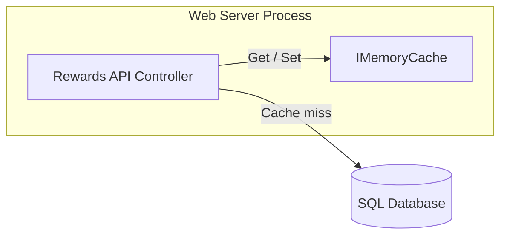
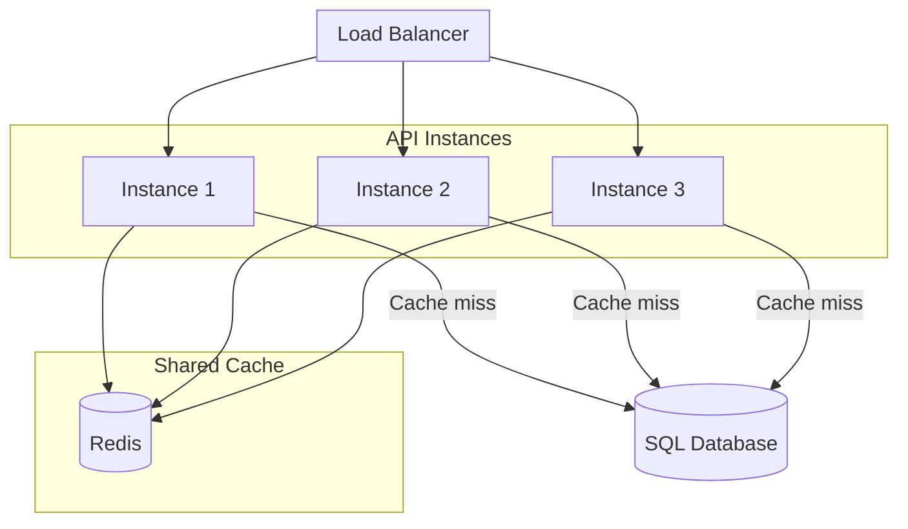
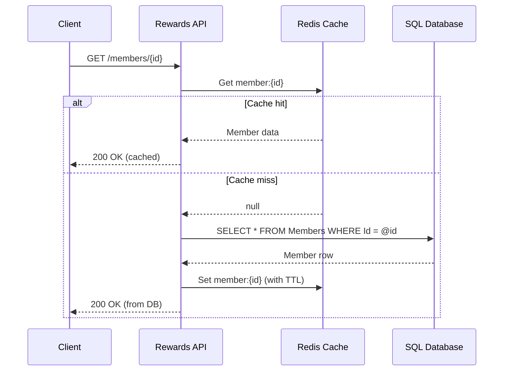
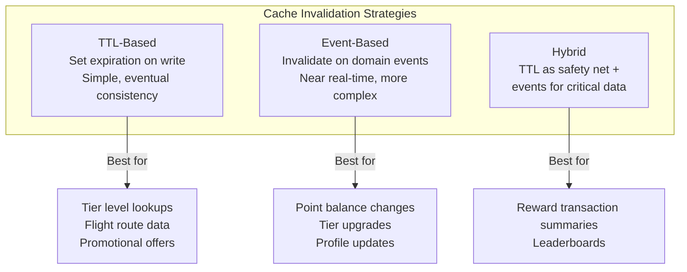
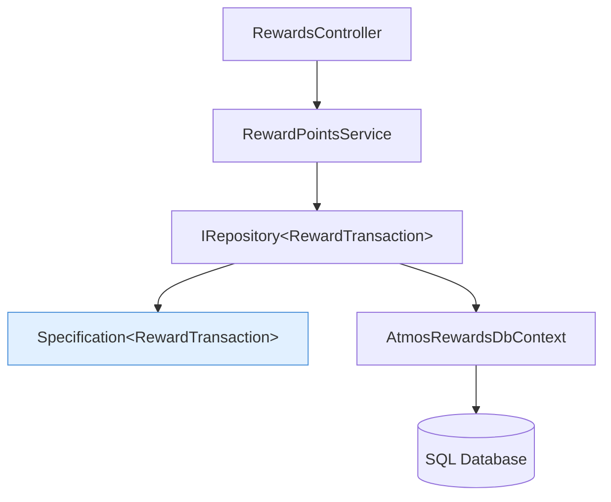
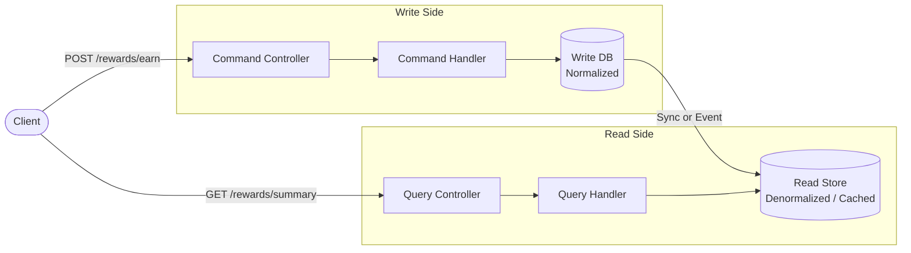
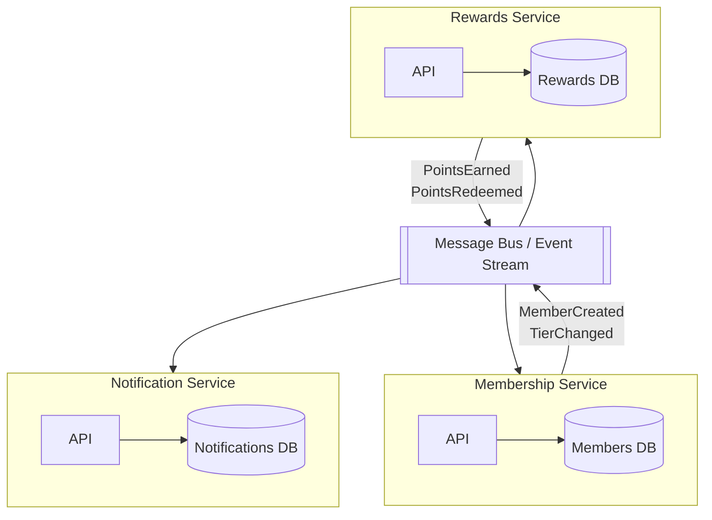

# Caching and Database Patterns

## Overview

This document covers caching strategies and database access patterns essential for building performant, scalable loyalty services. The examples use the Atmos Rewards domain (Member, RewardTransaction, TierLevel with Gold/MVP/MVPGold, RewardPointsService) to illustrate real-world scenarios where caching decisions directly impact user experience and system reliability. Choosing the right caching layer and database access pattern determines whether a member sees their updated tier status in milliseconds or seconds.

## 1. IMemoryCache - In-Process Caching

IMemoryCache stores objects in the web server's memory. It is fast (no serialization, no network hop) but scoped to a single process. When the process restarts, the cache is lost. This makes it ideal for data that is expensive to compute, read frequently, and tolerant of brief staleness.



**Expiration policies:**

| Policy | Behavior | Best for |
|--------|----------|----------|
| Absolute expiration | Entry removed after a fixed duration from creation | Reference data that changes on a schedule |
| Sliding expiration | Entry removed after a period of inactivity | Session-like data, active member lookups |
| Size limit + eviction | Least-recently-used entries evicted when limit reached | Bounded memory environments |

**IMemoryCache for member tier lookups with sliding expiration:**

```csharp
public class MemberTierCacheService
{
    private readonly IMemoryCache _cache;
    private readonly AtmosRewardsDbContext _dbContext;
    private readonly ILogger<MemberTierCacheService> _logger;

    public MemberTierCacheService(
        IMemoryCache cache,
        AtmosRewardsDbContext dbContext,
        ILogger<MemberTierCacheService> logger)
    {
        _cache = cache;
        _dbContext = dbContext;
        _logger = logger;
    }

    public async Task<TierLevel> GetMemberTierAsync(string memberId)
    {
        var cacheKey = $"member-tier:{memberId}";

        if (_cache.TryGetValue(cacheKey, out TierLevel cachedTier))
        {
            _logger.LogDebug("Cache hit for member tier {MemberId}", memberId);
            return cachedTier;
        }

        _logger.LogDebug("Cache miss for member tier {MemberId}", memberId);

        var member = await _dbContext.Members
            .AsNoTracking()
            .Where(m => m.MemberId == memberId)
            .Select(m => new { m.TierLevel })
            .FirstOrDefaultAsync()
            ?? throw new MemberNotFoundException(memberId);

        var options = new MemoryCacheEntryOptions()
            .SetSlidingExpiration(TimeSpan.FromMinutes(10))
            .SetAbsoluteExpiration(TimeSpan.FromHours(1))
            .SetSize(1)
            .RegisterPostEvictionCallback((key, value, reason, state) =>
            {
                _logger.LogDebug(
                    "Cache evicted {Key} due to {Reason}", key, reason);
            });

        _cache.Set(cacheKey, member.TierLevel, options);

        return member.TierLevel;
    }

    public void InvalidateMemberTier(string memberId)
    {
        _cache.Remove($"member-tier:{memberId}");
    }
}
```

**Key points:** Sliding expiration keeps frequently accessed member tiers warm. The absolute expiration acts as an upper bound so stale data does not live indefinitely. SetSize works with the SizeLimit configured on MemoryCache in DI registration.

## 2. IDistributedCache and Redis

When the application runs behind a load balancer with multiple instances, in-process memory cache creates inconsistency: one instance may have a stale tier while another has the updated value. IDistributedCache provides a shared cache layer across all instances.



**When to use distributed vs in-memory:**

| Criteria | IMemoryCache | IDistributedCache (Redis) |
|----------|-------------|--------------------------|
| Deployment | Single instance or sticky sessions | Multiple instances, stateless |
| Speed | Nanoseconds (in-process) | Sub-millisecond to low milliseconds (network hop) |
| Serialization | None required | JSON or binary serialization |
| Capacity | Limited by process memory | Dedicated Redis node(s) |
| Survivability | Lost on restart | Survives app restarts |
| Cost | Free | Redis infrastructure cost |

**Redis distributed cache for reward transaction summaries:**

```csharp
public class RewardTransactionSummaryCacheService
{
    private readonly IDistributedCache _cache;
    private readonly AtmosRewardsDbContext _dbContext;
    private readonly ILogger<RewardTransactionSummaryCacheService> _logger;

    private static readonly DistributedCacheEntryOptions CacheOptions = new()
    {
        AbsoluteExpirationRelativeToNow = TimeSpan.FromMinutes(15),
        SlidingExpiration = TimeSpan.FromMinutes(5)
    };

    public RewardTransactionSummaryCacheService(
        IDistributedCache cache,
        AtmosRewardsDbContext dbContext,
        ILogger<RewardTransactionSummaryCacheService> logger)
    {
        _cache = cache;
        _dbContext = dbContext;
        _logger = logger;
    }

    public async Task<RewardTransactionSummary> GetSummaryAsync(
        string memberId, CancellationToken ct = default)
    {
        var cacheKey = $"reward-summary:{memberId}";

        var cachedJson = await _cache.GetStringAsync(cacheKey, ct);
        if (cachedJson is not null)
        {
            _logger.LogDebug("Distributed cache hit for {MemberId}", memberId);
            return JsonSerializer.Deserialize<RewardTransactionSummary>(cachedJson)!;
        }

        _logger.LogDebug("Distributed cache miss for {MemberId}", memberId);

        var summary = await _dbContext.RewardTransactions
            .Where(t => t.MemberId == memberId)
            .GroupBy(t => t.MemberId)
            .Select(g => new RewardTransactionSummary
            {
                MemberId = memberId,
                TotalPointsEarned = g.Sum(t => t.PointsEarned),
                TotalPointsRedeemed = g.Sum(t => t.PointsRedeemed),
                TransactionCount = g.Count(),
                LastActivityDate = g.Max(t => t.TransactionDate)
            })
            .FirstOrDefaultAsync(ct)
            ?? new RewardTransactionSummary { MemberId = memberId };

        var json = JsonSerializer.Serialize(summary);
        await _cache.SetStringAsync(cacheKey, json, CacheOptions, ct);

        return summary;
    }

    public async Task InvalidateSummaryAsync(
        string memberId, CancellationToken ct = default)
    {
        await _cache.RemoveAsync($"reward-summary:{memberId}", ct);
    }
}

public record RewardTransactionSummary
{
    public string MemberId { get; init; } = string.Empty;
    public long TotalPointsEarned { get; init; }
    public long TotalPointsRedeemed { get; init; }
    public long AvailablePoints => TotalPointsEarned - TotalPointsRedeemed;
    public int TransactionCount { get; init; }
    public DateTime? LastActivityDate { get; init; }
}
```

**Registration in Program.cs:**

```csharp
builder.Services.AddStackExchangeRedisCache(options =>
{
    options.Configuration = builder.Configuration
        .GetConnectionString("Redis");
    options.InstanceName = "AtmosRewards:";
});
```

The InstanceName prefix isolates keys for this service from other applications sharing the same Redis cluster.

## 3. Cache-Aside Pattern

Cache-aside (also called lazy-loading) is the most common caching strategy. The application code is responsible for reading from and writing to the cache. The cache does not interact with the database directly.



**Cache-aside pattern in a CachedMemberRepository decorator:**

```csharp
// The inner repository handles database access
public interface IMemberRepository
{
    Task<Member?> GetByIdAsync(string memberId, CancellationToken ct = default);
    Task<Member> UpdateAsync(Member member, CancellationToken ct = default);
    Task<IReadOnlyList<Member>> GetByTierAsync(TierLevel tier, CancellationToken ct = default);
}

// Decorator wraps the real repository with caching logic
public class CachedMemberRepository : IMemberRepository
{
    private readonly IMemberRepository _inner;
    private readonly IDistributedCache _cache;
    private readonly ILogger<CachedMemberRepository> _logger;
    private static readonly TimeSpan DefaultTtl = TimeSpan.FromMinutes(10);

    public CachedMemberRepository(
        IMemberRepository inner,
        IDistributedCache cache,
        ILogger<CachedMemberRepository> logger)
    {
        _inner = inner;
        _cache = cache;
        _logger = logger;
    }

    public async Task<Member?> GetByIdAsync(
        string memberId, CancellationToken ct = default)
    {
        var cacheKey = $"member:{memberId}";

        var cached = await _cache.GetStringAsync(cacheKey, ct);
        if (cached is not null)
        {
            return JsonSerializer.Deserialize<Member>(cached);
        }

        var member = await _inner.GetByIdAsync(memberId, ct);
        if (member is not null)
        {
            var json = JsonSerializer.Serialize(member);
            var options = new DistributedCacheEntryOptions
            {
                AbsoluteExpirationRelativeToNow = DefaultTtl
            };
            await _cache.SetStringAsync(cacheKey, json, options, ct);
        }

        return member;
    }

    public async Task<Member> UpdateAsync(
        Member member, CancellationToken ct = default)
    {
        var updated = await _inner.UpdateAsync(member, ct);

        // Invalidate after write so the next read fetches fresh data
        await _cache.RemoveAsync($"member:{member.MemberId}", ct);

        return updated;
    }

    public async Task<IReadOnlyList<Member>> GetByTierAsync(
        TierLevel tier, CancellationToken ct = default)
    {
        // Collection queries bypass cache to avoid stale list results.
        // Consider caching with a short TTL if this becomes a hot path.
        return await _inner.GetByTierAsync(tier, ct);
    }
}

// DI registration using Scrutor or manual decoration
builder.Services.AddScoped<MemberRepository>();
builder.Services.AddScoped<IMemberRepository>(sp =>
    new CachedMemberRepository(
        sp.GetRequiredService<MemberRepository>(),
        sp.GetRequiredService<IDistributedCache>(),
        sp.GetRequiredService<ILogger<CachedMemberRepository>>()));
```

**Why the decorator pattern works well here:** The controller and other consumers depend on IMemberRepository. They do not know or care whether caching is applied. The caching behavior can be added, removed, or reconfigured without changing any business logic.

## 4. Cache Invalidation Strategies

Cache invalidation is famously one of the two hard problems in computer science. Getting it wrong means members see stale reward balances or outdated tier levels.



**Strategy comparison:**

| Strategy | Consistency | Complexity | Use case |
|----------|------------|------------|----------|
| TTL only | Eventual (up to TTL duration) | Low | Reference data, flight routes |
| Write-through | Strong (write updates cache) | Medium | Member profile |
| Write-behind | Eventual (async write) | High | Analytics, activity logs |
| Event-based invalidation | Near real-time | Medium | Point balance, tier changes |
| Cache tags / groups | Depends on underlying strategy | Medium | Invalidate all member-related keys at once |

**Event-based invalidation example:**

```csharp
// Domain event raised when points are earned
public record PointsEarnedEvent(
    string MemberId,
    long PointsEarned,
    string TransactionId,
    DateTime OccurredAt);

// Handler invalidates all caches related to this member
public class PointsEarnedCacheInvalidationHandler
    : INotificationHandler<PointsEarnedEvent>
{
    private readonly IDistributedCache _cache;
    private readonly ILogger<PointsEarnedCacheInvalidationHandler> _logger;

    public PointsEarnedCacheInvalidationHandler(
        IDistributedCache cache,
        ILogger<PointsEarnedCacheInvalidationHandler> logger)
    {
        _cache = cache;
        _logger = logger;
    }

    public async Task Handle(
        PointsEarnedEvent notification, CancellationToken ct)
    {
        var memberId = notification.MemberId;

        // Invalidate all cached data that depends on point balance
        var keysToInvalidate = new[]
        {
            $"member:{memberId}",
            $"member-tier:{memberId}",
            $"reward-summary:{memberId}"
        };

        foreach (var key in keysToInvalidate)
        {
            await _cache.RemoveAsync(key, ct);
            _logger.LogDebug("Invalidated cache key {Key}", key);
        }
    }
}
```

## 5. Repository Pattern with EF Core

The repository pattern abstracts data access behind a clean interface. Combined with the specification pattern, it enables composable, testable queries without leaking EF Core details into service or controller layers.



**Generic repository with specification pattern for reward transactions:**

```csharp
// Base specification class
public abstract class Specification<T> where T : class
{
    public Expression<Func<T, bool>>? Criteria { get; protected init; }
    public List<Expression<Func<T, object>>> Includes { get; } = new();
    public Expression<Func<T, object>>? OrderBy { get; protected init; }
    public Expression<Func<T, object>>? OrderByDescending { get; protected init; }
    public int? Take { get; protected init; }
    public int? Skip { get; protected init; }
}

// Concrete specification: recent transactions for a member
public class RecentRewardTransactionsSpec : Specification<RewardTransaction>
{
    public RecentRewardTransactionsSpec(string memberId, int count = 20)
    {
        Criteria = t => t.MemberId == memberId;
        OrderByDescending = t => t.TransactionDate;
        Take = count;
    }
}

// Concrete specification: transactions by tier qualifying activity
public class TierQualifyingTransactionsSpec : Specification<RewardTransaction>
{
    public TierQualifyingTransactionsSpec(string memberId, DateTime since)
    {
        Criteria = t => t.MemberId == memberId
                     && t.IsTierQualifying
                     && t.TransactionDate >= since;
        OrderByDescending = t => t.TransactionDate;
    }
}

// Generic repository interface
public interface IRepository<T> where T : class
{
    Task<T?> GetByIdAsync(object id, CancellationToken ct = default);
    Task<IReadOnlyList<T>> ListAsync(
        Specification<T> spec, CancellationToken ct = default);
    Task<int> CountAsync(
        Specification<T> spec, CancellationToken ct = default);
    Task AddAsync(T entity, CancellationToken ct = default);
    Task UpdateAsync(T entity, CancellationToken ct = default);
}

// EF Core implementation applies specifications to IQueryable
public class EfRepository<T> : IRepository<T> where T : class
{
    private readonly AtmosRewardsDbContext _dbContext;

    public EfRepository(AtmosRewardsDbContext dbContext)
    {
        _dbContext = dbContext;
    }

    public async Task<T?> GetByIdAsync(
        object id, CancellationToken ct = default)
    {
        return await _dbContext.Set<T>().FindAsync(new[] { id }, ct);
    }

    public async Task<IReadOnlyList<T>> ListAsync(
        Specification<T> spec, CancellationToken ct = default)
    {
        return await ApplySpecification(spec).ToListAsync(ct);
    }

    public async Task<int> CountAsync(
        Specification<T> spec, CancellationToken ct = default)
    {
        return await ApplySpecification(spec).CountAsync(ct);
    }

    public async Task AddAsync(T entity, CancellationToken ct = default)
    {
        await _dbContext.Set<T>().AddAsync(entity, ct);
        await _dbContext.SaveChangesAsync(ct);
    }

    public async Task UpdateAsync(T entity, CancellationToken ct = default)
    {
        _dbContext.Set<T>().Update(entity);
        await _dbContext.SaveChangesAsync(ct);
    }

    private IQueryable<T> ApplySpecification(Specification<T> spec)
    {
        IQueryable<T> query = _dbContext.Set<T>().AsNoTracking();

        if (spec.Criteria is not null)
            query = query.Where(spec.Criteria);

        foreach (var include in spec.Includes)
            query = query.Include(include);

        if (spec.OrderBy is not null)
            query = query.OrderBy(spec.OrderBy);
        else if (spec.OrderByDescending is not null)
            query = query.OrderByDescending(spec.OrderByDescending);

        if (spec.Skip.HasValue)
            query = query.Skip(spec.Skip.Value);

        if (spec.Take.HasValue)
            query = query.Take(spec.Take.Value);

        return query;
    }
}
```

**Usage in RewardPointsService:**

```csharp
public class RewardPointsService
{
    private readonly IRepository<RewardTransaction> _transactionRepo;
    private readonly IRepository<Member> _memberRepo;

    public RewardPointsService(
        IRepository<RewardTransaction> transactionRepo,
        IRepository<Member> memberRepo)
    {
        _transactionRepo = transactionRepo;
        _memberRepo = memberRepo;
    }

    public async Task<IReadOnlyList<RewardTransaction>>
        GetRecentTransactionsAsync(string memberId, CancellationToken ct)
    {
        var spec = new RecentRewardTransactionsSpec(memberId);
        return await _transactionRepo.ListAsync(spec, ct);
    }

    public async Task<int> GetTierQualifyingCountAsync(
        string memberId, CancellationToken ct)
    {
        var qualifyingSince = new DateTime(DateTime.UtcNow.Year, 1, 1);
        var spec = new TierQualifyingTransactionsSpec(memberId, qualifyingSince);
        return await _transactionRepo.CountAsync(spec, ct);
    }
}
```

## 6. CQRS - Command Query Responsibility Segregation

CQRS separates read and write operations into distinct models. Writes (commands) go through domain validation and persist to a normalized database. Reads (queries) can use denormalized views, cached projections, or even a separate read store optimized for the specific query shape.



**When to use CQRS:**

- Read and write workloads have very different scaling needs (reward balance checks happen 100x more than point earnings).
- Read models benefit from denormalization (a summary view that joins members, transactions, and tiers).
- You need independent caching strategies for reads vs immediate consistency for writes.

**When CQRS is overkill:**

- Simple CRUD with balanced read/write ratios.
- Small team where the operational overhead of two models is not justified.

**CQRS with separate command and query models:**

```csharp
// --- Command side ---

public record EarnPointsCommand(
    string MemberId,
    long Points,
    string Description,
    string FlightNumber,
    bool IsTierQualifying);

public interface ICommandHandler<in TCommand>
{
    Task HandleAsync(TCommand command, CancellationToken ct = default);
}

public class EarnPointsCommandHandler : ICommandHandler<EarnPointsCommand>
{
    private readonly AtmosRewardsDbContext _dbContext;
    private readonly IMediator _mediator;

    public EarnPointsCommandHandler(
        AtmosRewardsDbContext dbContext,
        IMediator mediator)
    {
        _dbContext = dbContext;
        _mediator = mediator;
    }

    public async Task HandleAsync(
        EarnPointsCommand command, CancellationToken ct = default)
    {
        var member = await _dbContext.Members
            .FirstOrDefaultAsync(m => m.MemberId == command.MemberId, ct)
            ?? throw new MemberNotFoundException(command.MemberId);

        var transaction = new RewardTransaction
        {
            TransactionId = Guid.NewGuid().ToString(),
            MemberId = command.MemberId,
            PointsEarned = command.Points,
            Description = command.Description,
            FlightNumber = command.FlightNumber,
            IsTierQualifying = command.IsTierQualifying,
            TransactionDate = DateTime.UtcNow
        };

        member.TotalPoints += command.Points;

        // Evaluate tier upgrade
        var newTier = EvaluateTier(member.TotalPoints);
        var tierChanged = newTier != member.TierLevel;
        member.TierLevel = newTier;

        _dbContext.RewardTransactions.Add(transaction);
        await _dbContext.SaveChangesAsync(ct);

        // Publish domain event for cache invalidation and read model update
        await _mediator.Publish(new PointsEarnedEvent(
            command.MemberId,
            command.Points,
            transaction.TransactionId,
            DateTime.UtcNow), ct);

        if (tierChanged)
        {
            await _mediator.Publish(new TierChangedEvent(
                command.MemberId, newTier), ct);
        }
    }

    private static TierLevel EvaluateTier(long totalPoints) => totalPoints switch
    {
        >= 100_000 => TierLevel.MVPGold,
        >= 50_000 => TierLevel.MVP,
        >= 20_000 => TierLevel.Gold,
        _ => TierLevel.Standard
    };
}

// --- Query side ---

public record GetMemberRewardSummaryQuery(string MemberId);

public record MemberRewardSummaryResult
{
    public string MemberId { get; init; } = string.Empty;
    public string FullName { get; init; } = string.Empty;
    public TierLevel Tier { get; init; }
    public long AvailablePoints { get; init; }
    public long LifetimePointsEarned { get; init; }
    public int FlightsThisYear { get; init; }
    public long PointsToNextTier { get; init; }
}

public interface IQueryHandler<in TQuery, TResult>
{
    Task<TResult> HandleAsync(TQuery query, CancellationToken ct = default);
}

public class GetMemberRewardSummaryQueryHandler
    : IQueryHandler<GetMemberRewardSummaryQuery, MemberRewardSummaryResult>
{
    private readonly IDistributedCache _cache;
    private readonly AtmosRewardsDbContext _dbContext;
    private static readonly TimeSpan CacheTtl = TimeSpan.FromMinutes(5);

    public GetMemberRewardSummaryQueryHandler(
        IDistributedCache cache,
        AtmosRewardsDbContext dbContext)
    {
        _cache = cache;
        _dbContext = dbContext;
    }

    public async Task<MemberRewardSummaryResult> HandleAsync(
        GetMemberRewardSummaryQuery query, CancellationToken ct = default)
    {
        var cacheKey = $"reward-summary-view:{query.MemberId}";
        var cached = await _cache.GetStringAsync(cacheKey, ct);

        if (cached is not null)
            return JsonSerializer.Deserialize<MemberRewardSummaryResult>(cached)!;

        var yearStart = new DateTime(DateTime.UtcNow.Year, 1, 1);

        var result = await _dbContext.Members
            .Where(m => m.MemberId == query.MemberId)
            .Select(m => new MemberRewardSummaryResult
            {
                MemberId = m.MemberId,
                FullName = m.FirstName + " " + m.LastName,
                Tier = m.TierLevel,
                AvailablePoints = m.TotalPoints,
                LifetimePointsEarned = m.RewardTransactions
                    .Sum(t => t.PointsEarned),
                FlightsThisYear = m.RewardTransactions
                    .Count(t => t.TransactionDate >= yearStart
                             && t.FlightNumber != null),
                PointsToNextTier = CalculatePointsToNextTier(
                    m.TierLevel, m.TotalPoints)
            })
            .FirstOrDefaultAsync(ct)
            ?? throw new MemberNotFoundException(query.MemberId);

        await _cache.SetStringAsync(
            cacheKey,
            JsonSerializer.Serialize(result),
            new DistributedCacheEntryOptions
            {
                AbsoluteExpirationRelativeToNow = CacheTtl
            },
            ct);

        return result;
    }

    private static long CalculatePointsToNextTier(
        TierLevel current, long points) => current switch
    {
        TierLevel.Standard => 20_000 - points,
        TierLevel.Gold => 50_000 - points,
        TierLevel.MVP => 100_000 - points,
        TierLevel.MVPGold => 0,
        _ => 0
    };
}
```

## 7. Database per Service in Microservices

In a microservices architecture, each service owns its data store. The Membership service owns the Members table, while the Rewards service owns RewardTransactions. They communicate through events rather than shared database access.



**Eventual consistency trade-offs:**

| Aspect | Shared Database | Database per Service |
|--------|----------------|---------------------|
| Consistency | Strong (ACID transactions) | Eventual (events + compensating actions) |
| Coupling | Tight (schema changes affect all) | Loose (services evolve independently) |
| Scaling | Scale the one shared DB | Scale each DB independently |
| Complexity | Low (one connection string) | Higher (event choreography, idempotency) |
| Failure isolation | One DB outage affects all | Isolated failures per service |

**Practical considerations for the Atmos Rewards team:**

- When a member earns points (Rewards service), the Membership service needs to evaluate tier upgrades. This happens via a PointsEarned event, not a direct DB call.
- If the event bus is temporarily unavailable, the Rewards service must still record the transaction. Tier evaluation happens when the event is eventually delivered (outbox pattern).
- Read APIs that need data from multiple services use an API composition layer or a materialized view that subscribes to events from both services.

## 8. Connection Resilience

Network blips, database failovers, and transient errors are inevitable. EF Core and ADO.NET provide built-in retry mechanisms to handle these without failing the request immediately.

**EF Core retry policy configuration:**

```csharp
builder.Services.AddDbContext<AtmosRewardsDbContext>(options =>
{
    options.UseSqlServer(
        builder.Configuration.GetConnectionString("AtmosRewardsDb"),
        sqlOptions =>
        {
            sqlOptions.EnableRetryOnFailure(
                maxRetryCount: 5,
                maxRetryDelay: TimeSpan.FromSeconds(30),
                errorNumbersToAdd: null);

            sqlOptions.CommandTimeout(30);

            sqlOptions.MigrationsAssembly(
                typeof(AtmosRewardsDbContext).Assembly.FullName);
        });

    if (builder.Environment.IsDevelopment())
    {
        options.EnableSensitiveDataLogging();
        options.EnableDetailedErrors();
    }
});
```

**Connection pooling considerations:**

- EF Core uses ADO.NET connection pooling by default. The pool size is controlled in the connection string (`Max Pool Size=100`).
- Each DbContext instance checks out a connection from the pool when a query executes and returns it when the operation completes.
- In high-throughput scenarios (batch point earnings during a promotion), exhausting the pool causes `TimeoutException`. Monitor pool usage and adjust the size based on load testing results.
- For Redis connections, StackExchange.Redis uses a single multiplexed connection by default, which is efficient for most workloads.

**Combining Polly with HttpClient for external service calls:**

```csharp
builder.Services.AddHttpClient("PartnerRewardsApi", client =>
{
    client.BaseAddress = new Uri(
        builder.Configuration["PartnerApi:BaseUrl"]!);
    client.Timeout = TimeSpan.FromSeconds(10);
})
.AddTransientHttpErrorPolicy(policy =>
    policy.WaitAndRetryAsync(3, attempt =>
        TimeSpan.FromSeconds(Math.Pow(2, attempt))))
.AddTransientHttpErrorPolicy(policy =>
    policy.CircuitBreakerAsync(5, TimeSpan.FromSeconds(30)));
```

This configures exponential backoff retry (1s, 2s, 4s) and a circuit breaker that opens after 5 consecutive failures, preventing cascade failures when a partner rewards API is down.

---

## Interview Questions

**IMemoryCache and IDistributedCache:**

1. When would you choose IMemoryCache over IDistributedCache? What are the risks of using in-memory cache behind a load balancer?
2. How does sliding expiration differ from absolute expiration? When would you combine both on the same entry?
3. What happens to IMemoryCache entries during a deployment rolling restart? How would you mitigate cold-cache latency spikes?

**Cache-Aside and Invalidation:**

4. Walk through the cache-aside pattern. What happens if the database write succeeds but the cache invalidation fails?
5. Compare write-through and write-behind caching. Which would you use for member point balances and why?
6. How would you handle cache stampede (thundering herd) when a popular cache entry expires and hundreds of requests hit the database simultaneously?

**Repository and Specification Pattern:**

7. What are the arguments for and against the repository pattern when using EF Core? Does it add value or just wrap the DbContext?
8. How does the specification pattern improve testability compared to passing IQueryable chains through service methods?
9. Should SaveChangesAsync be called inside the repository or managed by a unit of work? What are the trade-offs?

**CQRS:**

10. Explain CQRS and when the complexity is justified. How does it relate to event sourcing (and are they always used together)?
11. In the EarnPointsCommand handler, what happens if the domain event publish fails after the database commit? How would you ensure consistency?
12. How would you handle a query that needs data from both the Membership service and the Rewards service in a CQRS architecture?

**Database per Service and Resilience:**

13. How does the outbox pattern help ensure reliable event publishing in a database-per-service architecture?
14. Explain EF Core's execution strategy retry behavior. What types of errors trigger retries and what types do not?
15. How would you implement idempotency for the EarnPointsCommand to handle duplicate events from the message bus?

**Architecture and Trade-offs:**

16. A member earns points on a flight but their cached summary still shows the old balance. Walk through all the layers where this staleness could originate and how you would diagnose it.
17. Your Redis instance goes down. How should the Rewards API behave? Should it fail open (skip cache, hit DB) or fail closed (return an error)?
18. How would you approach load testing the caching layer? What metrics would you monitor to validate that cache hit ratios are acceptable?
