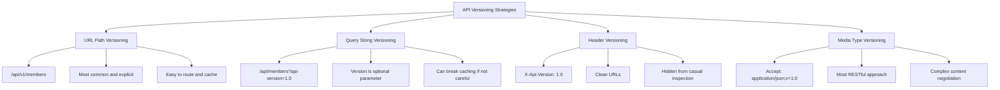
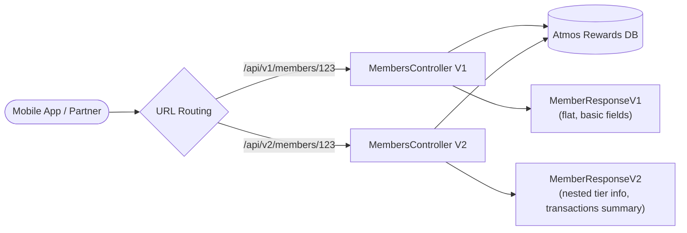
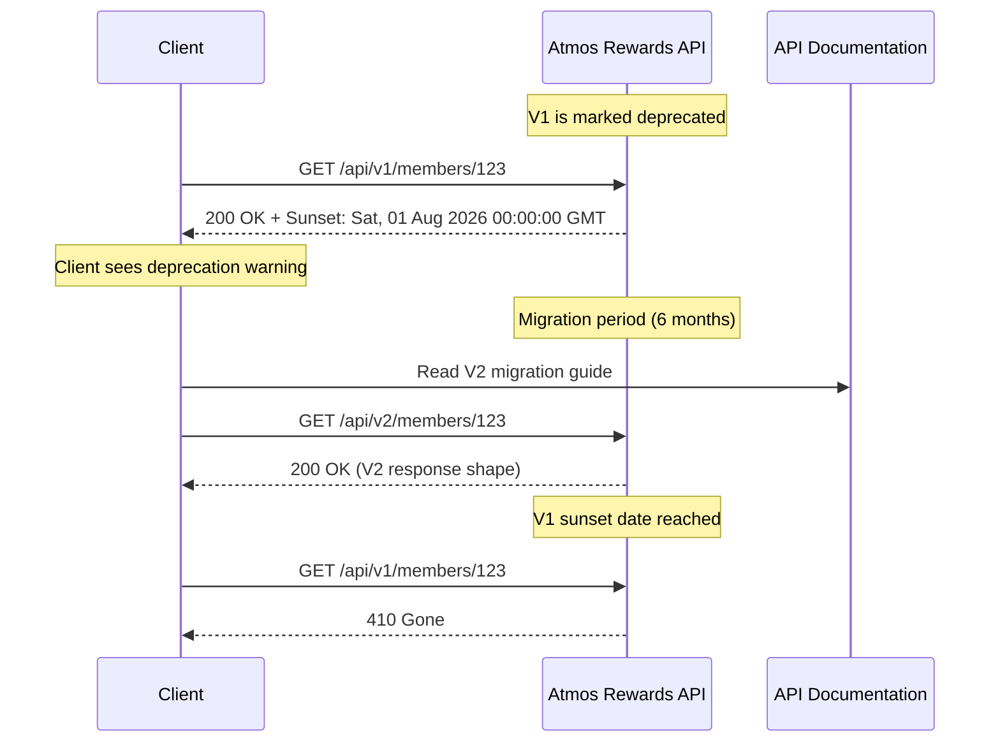
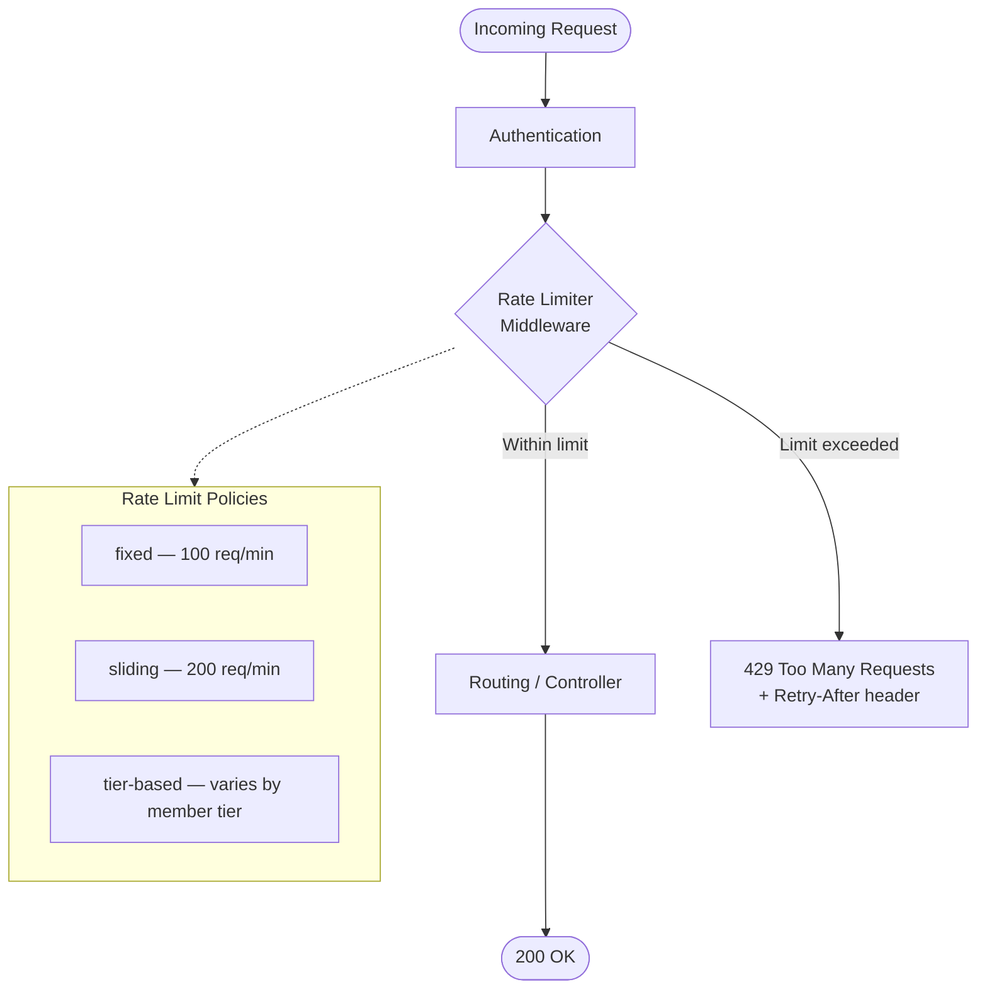
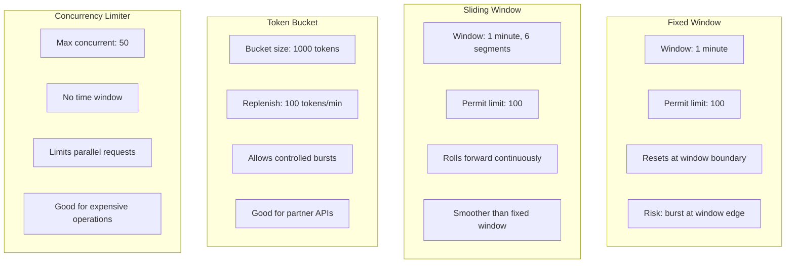
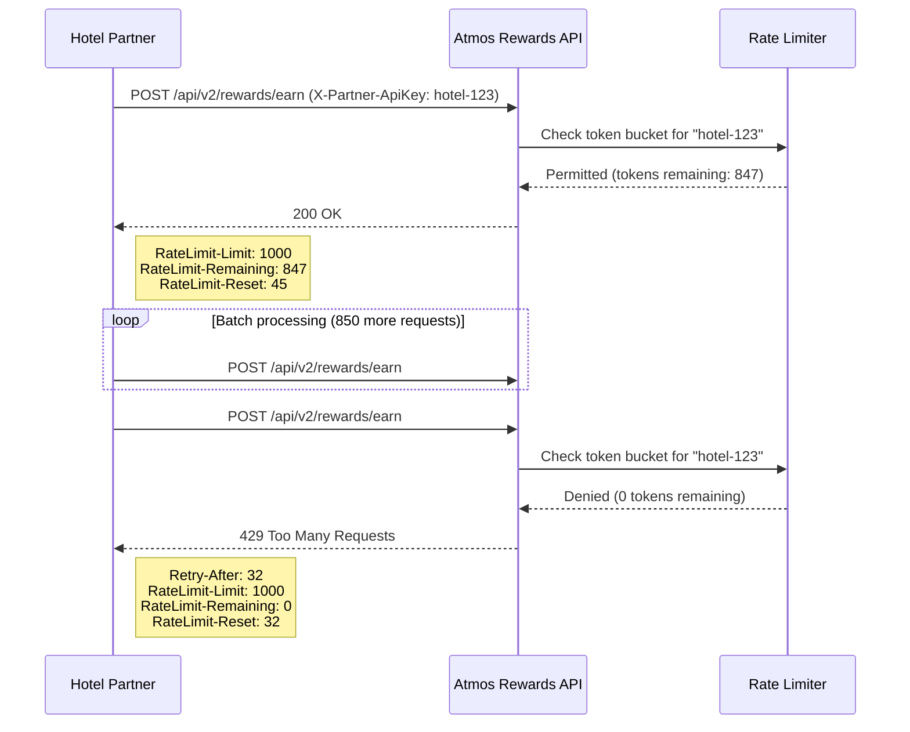
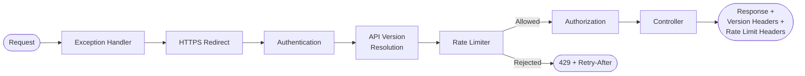

# API Versioning and Rate Limiting

## Overview

This document covers API versioning strategies and rate limiting techniques for ASP.NET Core Web APIs. For the Atmos Rewards team, versioning is critical because the members API evolves over time (new fields, changed response shapes) while external partners and mobile clients depend on stable contracts. Rate limiting protects the rewards system from abuse, ensures fair resource allocation across member tiers, and maintains service reliability during high-traffic events like double-miles promotions.

---

## 1. API Versioning Strategies

There are four common approaches to versioning a REST API. Each makes different trade-offs between discoverability, cacheability, and client coupling.



| Strategy | URL Example | Pros | Cons |
|----------|-------------|------|------|
| URL path | `/api/v1/members` | Explicit, easy to route, cacheable | URL changes between versions |
| Query string | `/api/members?api-version=1.0` | URL stays stable, version is optional | Easy to forget, caching issues |
| Header | `X-Api-Version: 1.0` header | Clean URLs, no path changes | Not visible in browser, harder to test |
| Media type | `Accept: application/vnd.atmos.v1+json` | Most RESTful, leverages content negotiation | Complex, tooling support varies |

**Recommendation for Atmos Rewards:** URL path versioning is the most practical choice. Partners integrating with the rewards API can clearly see which version they target, and the version is visible in logs, documentation, and monitoring dashboards.

---

## 2. Asp.Versioning Library Configuration

The `Asp.Versioning` library (the successor to `Microsoft.AspNetCore.Mvc.Versioning`) provides a declarative way to manage API versions in ASP.NET Core.

```csharp
// Program.cs — Configuring API versioning for Atmos Rewards
using Asp.Versioning;

var builder = WebApplication.CreateBuilder(args);

builder.Services.AddApiVersioning(options =>
{
    options.DefaultApiVersion = new ApiVersion(1, 0);
    options.AssumeDefaultVersionWhenUnspecified = true;
    options.ReportApiVersions = true; // Adds api-supported-versions header
    options.ApiVersionReader = ApiVersionReader.Combine(
        new UrlSegmentApiVersionReader(),
        new HeaderApiVersionReader("X-Api-Version")
    );
})
.AddApiExplorer(options =>
{
    options.GroupNameFormat = "'v'VVV"; // v1, v2, etc.
    options.SubstituteApiVersionInUrl = true;
});

builder.Services.AddControllers();

var app = builder.Build();

app.MapControllers();
app.Run();
```

**Key configuration options:**

- `DefaultApiVersion` — the version used when a client does not specify one.
- `AssumeDefaultVersionWhenUnspecified` — when `true`, requests without a version default to `DefaultApiVersion` instead of returning a 400.
- `ReportApiVersions` — adds `api-supported-versions` and `api-deprecated-versions` response headers so clients can discover available versions.
- `ApiVersionReader` — determines where the version is read from. `Combine` allows multiple strategies simultaneously.

---

## 3. Versioned Controllers

When the response shape changes between versions, separate controllers keep each version clean and independently testable.



```csharp
// Controllers/V1/MembersController.cs
using Asp.Versioning;
using Microsoft.AspNetCore.Mvc;

namespace AtmosRewards.Api.Controllers.V1;

[ApiController]
[ApiVersion("1.0")]
[Route("api/v{version:apiVersion}/[controller]")]
public class MembersController : ControllerBase
{
    private readonly IMemberService _memberService;

    public MembersController(IMemberService memberService)
    {
        _memberService = memberService;
    }

    [HttpGet("{memberId:guid}")]
    public async Task<ActionResult<MemberResponseV1>> GetMember(Guid memberId)
    {
        var member = await _memberService.GetByIdAsync(memberId);
        if (member is null) return NotFound();

        return Ok(new MemberResponseV1
        {
            Id = member.Id,
            FullName = $"{member.FirstName} {member.LastName}",
            Tier = member.Tier.ToString(),
            LifetimeMiles = member.LifetimeMiles
        });
    }
}

public class MemberResponseV1
{
    public Guid Id { get; set; }
    public string FullName { get; set; } = string.Empty;
    public string Tier { get; set; } = string.Empty;
    public int LifetimeMiles { get; set; }
}
```

```csharp
// Controllers/V2/MembersController.cs
using Asp.Versioning;
using Microsoft.AspNetCore.Mvc;

namespace AtmosRewards.Api.Controllers.V2;

[ApiController]
[ApiVersion("2.0")]
[Route("api/v{version:apiVersion}/[controller]")]
public class MembersController : ControllerBase
{
    private readonly IMemberService _memberService;

    public MembersController(IMemberService memberService)
    {
        _memberService = memberService;
    }

    [HttpGet("{memberId:guid}")]
    public async Task<ActionResult<MemberResponseV2>> GetMember(Guid memberId)
    {
        var member = await _memberService.GetByIdAsync(memberId);
        if (member is null) return NotFound();

        var recentTransactions = member.Transactions
            .OrderByDescending(t => t.TransactionDate)
            .Take(5);

        return Ok(new MemberResponseV2
        {
            Id = member.Id,
            FirstName = member.FirstName,
            LastName = member.LastName,
            TierInfo = new TierInfoDto
            {
                Level = member.Tier,
                LifetimeMiles = member.LifetimeMiles,
                MilesUntilNextTier = CalculateMilesUntilNextTier(member)
            },
            RecentTransactions = recentTransactions.Select(t => new TransactionSummaryDto
            {
                Id = t.Id,
                Date = t.TransactionDate,
                PointsEarned = t.PointsEarned,
                PartnerCode = t.PartnerCode
            }).ToList()
        });
    }

    private static int CalculateMilesUntilNextTier(Member member) => member.Tier switch
    {
        TierLevel.Gold => Math.Max(0, 25_000 - member.LifetimeMiles),
        TierLevel.MVP => Math.Max(0, 50_000 - member.LifetimeMiles),
        TierLevel.MVPGold => 0, // Already at the top
        _ => 25_000
    };
}

public class MemberResponseV2
{
    public Guid Id { get; set; }
    public string FirstName { get; set; } = string.Empty;
    public string LastName { get; set; } = string.Empty;
    public TierInfoDto TierInfo { get; set; } = new();
    public List<TransactionSummaryDto> RecentTransactions { get; set; } = [];
}

public class TierInfoDto
{
    public TierLevel Level { get; set; }
    public int LifetimeMiles { get; set; }
    public int MilesUntilNextTier { get; set; }
}

public class TransactionSummaryDto
{
    public Guid Id { get; set; }
    public DateTime Date { get; set; }
    public int PointsEarned { get; set; }
    public string PartnerCode { get; set; } = string.Empty;
}
```

**V1 vs V2 differences:** V1 returns a flat response with a `FullName` string and `Tier` as text. V2 splits the name, nests tier information with miles-to-next-tier calculations, and includes recent transactions. This is a breaking change in response shape, which is why it requires a new major version.

---

## 4. Deprecation Policies and Sunset Headers

When retiring an API version, provide advance notice so clients can migrate. The `Sunset` header (RFC 8594) communicates the retirement date.



```csharp
// Deprecation configuration and sunset header middleware

// Mark V1 as deprecated in the controller
[ApiController]
[ApiVersion("1.0", Deprecated = true)]
[Route("api/v{version:apiVersion}/[controller]")]
public class MembersController : ControllerBase
{
    // V1 endpoints still work but response includes deprecation headers
}

// Middleware to add Sunset and Deprecation headers
public class ApiDeprecationMiddleware
{
    private readonly RequestDelegate _next;

    // Sunset dates keyed by major version number.
    private static readonly Dictionary<int, DateTimeOffset> SunsetSchedule = new()
    {
        { 1, new DateTimeOffset(2026, 8, 1, 0, 0, 0, TimeSpan.Zero) }
    };

    public ApiDeprecationMiddleware(RequestDelegate next)
    {
        _next = next;
    }

    public async Task InvokeAsync(HttpContext context)
    {
        await _next(context);

        var apiVersion = context.GetRequestedApiVersion();
        if (apiVersion is not null && SunsetSchedule.TryGetValue(apiVersion.MajorVersion ?? 0, out var sunsetDate))
        {
            context.Response.Headers["Sunset"] = sunsetDate.ToString("R");
            context.Response.Headers["Deprecation"] = "true";
            context.Response.Headers["Link"] =
                "</api/v2/docs>; rel=\"successor-version\"";
        }
    }
}

// Register in Program.cs
// app.UseMiddleware<ApiDeprecationMiddleware>();
```

**Best practices for deprecation:**

- Announce deprecation at least 6 months before the sunset date.
- Return `Sunset` and `Deprecation` headers on every response from deprecated versions.
- Include a `Link` header pointing to the successor version documentation.
- After the sunset date, return `410 Gone` with a message directing clients to the new version.
- Track usage of deprecated versions in monitoring to understand migration progress.

---

## 5. Rate Limiting in .NET 7+ — Built-in Middleware

.NET 7 introduced `Microsoft.AspNetCore.RateLimiting` as a first-class middleware. It supports multiple algorithms and named policies.



```csharp
// Program.cs — Configuring rate limiting with tier-based policies
using Microsoft.AspNetCore.RateLimiting;
using System.Threading.RateLimiting;

var builder = WebApplication.CreateBuilder(args);

builder.Services.AddRateLimiter(options =>
{
    options.RejectionStatusCode = StatusCodes.Status429TooManyRequests;

    // Global fallback policy — applies when no named policy is specified
    options.GlobalLimiter = PartitionedRateLimiter.Create<HttpContext, string>(context =>
        RateLimitPartition.GetFixedWindowLimiter(
            partitionKey: context.Connection.RemoteIpAddress?.ToString() ?? "unknown",
            factory: _ => new FixedWindowRateLimiterOptions
            {
                PermitLimit = 60,
                Window = TimeSpan.FromMinutes(1),
                QueueProcessingOrder = QueueProcessingOrder.OldestFirst,
                QueueLimit = 0
            }));

    // Tier-based policy — Gold members get higher limits than unauthenticated users
    options.AddPolicy("tier-based", context =>
    {
        var tierClaim = context.User.FindFirst("tier")?.Value;
        var (permitLimit, windowSeconds) = tierClaim switch
        {
            "MVPGold" => (500, 60),
            "MVP" => (300, 60),
            "Gold" => (200, 60),
            _ => (100, 60)
        };

        return RateLimitPartition.GetFixedWindowLimiter(
            partitionKey: context.User.Identity?.Name ?? context.Connection.RemoteIpAddress?.ToString() ?? "anonymous",
            factory: _ => new FixedWindowRateLimiterOptions
            {
                PermitLimit = permitLimit,
                Window = TimeSpan.FromSeconds(windowSeconds),
                QueueProcessingOrder = QueueProcessingOrder.OldestFirst,
                QueueLimit = 2
            });
    });

    // Partner API policy — partners get dedicated rate limits by API key
    options.AddPolicy("partner-api", context =>
    {
        var apiKey = context.Request.Headers["X-Partner-ApiKey"].FirstOrDefault() ?? "no-key";

        return RateLimitPartition.GetTokenBucketLimiter(
            partitionKey: apiKey,
            factory: _ => new TokenBucketRateLimiterOptions
            {
                TokenLimit = 1000,
                ReplenishmentPeriod = TimeSpan.FromMinutes(1),
                TokensPerPeriod = 100,
                QueueProcessingOrder = QueueProcessingOrder.OldestFirst,
                QueueLimit = 10,
                AutoReplenishment = true
            });
    });

    // Handle rejection with custom response body
    options.OnRejected = async (context, cancellationToken) =>
    {
        context.HttpContext.Response.StatusCode = StatusCodes.Status429TooManyRequests;
        context.HttpContext.Response.ContentType = "application/json";

        if (context.Lease.TryGetMetadata(MetadataName.RetryAfter, out var retryAfter))
        {
            context.HttpContext.Response.Headers["Retry-After"] = ((int)retryAfter.TotalSeconds).ToString();
        }

        await context.HttpContext.Response.WriteAsJsonAsync(new
        {
            Error = "Rate limit exceeded",
            Message = "Too many requests to the Atmos Rewards API. Please wait before retrying.",
            RetryAfterSeconds = context.Lease.TryGetMetadata(MetadataName.RetryAfter, out var retry)
                ? (int)retry.TotalSeconds
                : 60
        }, cancellationToken);
    };
});

var app = builder.Build();

app.UseRateLimiter();
app.MapControllers();
app.Run();
```

---

## 6. Rate Limiting Algorithms

Each algorithm fits different traffic patterns. Choosing the right one depends on whether you need strict enforcement, smooth distribution, or burst tolerance.



| Algorithm | Best For | Burst Handling | Complexity |
|-----------|----------|----------------|------------|
| Fixed window | Simple rate caps | Allows edge bursts (2x at boundary) | Low |
| Sliding window | Smooth distribution | Minimizes edge bursts | Medium |
| Token bucket | APIs with burst tolerance | Controlled bursts up to bucket size | Medium |
| Concurrency | Expensive operations | Limits parallel, not rate | Low |

**Fixed window edge-burst problem:** If a client makes 100 requests at the end of minute 1 and 100 requests at the start of minute 2, they effectively make 200 requests in a short span. Sliding window solves this by distributing the window across segments.

**Token bucket for partners:** Partner integrations (hotel bookings, car rentals earning miles) often send requests in bursts when processing batch transactions. The token bucket allows short bursts while enforcing a sustained rate over time.

---

## 7. Per-Client Rate Limiting and Response Headers

Rate limit response headers let clients self-regulate. The draft IETF standard defines `RateLimit-Limit`, `RateLimit-Remaining`, and `RateLimit-Reset`.



```csharp
// Middleware that adds standard rate limit response headers
public class RateLimitHeadersMiddleware
{
    private readonly RequestDelegate _next;

    public RateLimitHeadersMiddleware(RequestDelegate next)
    {
        _next = next;
    }

    public async Task InvokeAsync(HttpContext context)
    {
        await _next(context);

        // These values would come from the rate limiter lease metadata
        // or from a custom IRateLimiterPolicy implementation
        if (context.Items.TryGetValue("RateLimit.Limit", out var limit))
        {
            context.Response.Headers["RateLimit-Limit"] = limit?.ToString();
        }

        if (context.Items.TryGetValue("RateLimit.Remaining", out var remaining))
        {
            context.Response.Headers["RateLimit-Remaining"] = remaining?.ToString();
        }

        if (context.Items.TryGetValue("RateLimit.Reset", out var reset))
        {
            context.Response.Headers["RateLimit-Reset"] = reset?.ToString();
        }
    }
}

// Applying rate limit policies to specific controllers
[ApiController]
[ApiVersion("2.0")]
[Route("api/v{version:apiVersion}/[controller]")]
public class RewardsController : ControllerBase
{
    private readonly IRewardTransactionService _transactionService;

    public RewardsController(IRewardTransactionService transactionService)
    {
        _transactionService = transactionService;
    }

    // Member-facing endpoint — tier-based rate limiting
    [HttpGet("balance/{memberId:guid}")]
    [EnableRateLimiting("tier-based")]
    public async Task<ActionResult<PointsBalanceDto>> GetBalance(Guid memberId)
    {
        var balance = await _transactionService.GetBalanceAsync(memberId);
        if (balance is null) return NotFound();

        return Ok(balance);
    }

    // Partner-facing endpoint — API key rate limiting with higher throughput
    [HttpPost("earn")]
    [EnableRateLimiting("partner-api")]
    public async Task<ActionResult<RewardTransaction>> EarnPoints(
        [FromBody] EarnPointsRequest request,
        [FromHeader(Name = "X-Partner-ApiKey")] string apiKey)
    {
        var transaction = await _transactionService.ProcessEarningAsync(request, apiKey);
        return CreatedAtAction(nameof(GetBalance), new { memberId = request.MemberId }, transaction);
    }

    // Expensive report endpoint — concurrency limited
    [HttpGet("reports/annual/{memberId:guid}")]
    [EnableRateLimiting("concurrency")]
    public async Task<ActionResult<AnnualReportDto>> GetAnnualReport(Guid memberId, [FromQuery] int year)
    {
        var report = await _transactionService.GenerateAnnualReportAsync(memberId, year);
        return Ok(report);
    }

    // Exempt health check from all rate limiting
    [HttpGet("/health")]
    [DisableRateLimiting]
    public IActionResult Health() => Ok(new { Status = "Healthy" });
}
```

---

## 8. Combining Versioning and Rate Limiting

In practice, versioning and rate limiting work together in the middleware pipeline. The order matters: rate limiting should run after authentication (so you can identify the member tier) but before routing (so rejected requests never reach controllers).



```csharp
// Program.cs — Full pipeline combining versioning, rate limiting, and deprecation
var builder = WebApplication.CreateBuilder(args);

// API versioning
builder.Services.AddApiVersioning(options =>
{
    options.DefaultApiVersion = new ApiVersion(2, 0);
    options.AssumeDefaultVersionWhenUnspecified = true;
    options.ReportApiVersions = true;
    options.ApiVersionReader = new UrlSegmentApiVersionReader();
})
.AddApiExplorer(options =>
{
    options.GroupNameFormat = "'v'VVV";
    options.SubstituteApiVersionInUrl = true;
});

// Authentication
builder.Services.AddAuthentication().AddJwtBearer();

// Rate limiting (see Section 5 for full configuration)
builder.Services.AddRateLimiter(options =>
{
    options.RejectionStatusCode = StatusCodes.Status429TooManyRequests;

    options.AddPolicy("tier-based", context =>
    {
        var tier = context.User.FindFirst("tier")?.Value ?? "none";
        var limit = tier switch
        {
            "MVPGold" => 500,
            "MVP" => 300,
            "Gold" => 200,
            _ => 100
        };

        return RateLimitPartition.GetSlidingWindowLimiter(
            partitionKey: context.User.Identity?.Name ?? "anonymous",
            factory: _ => new SlidingWindowRateLimiterOptions
            {
                PermitLimit = limit,
                Window = TimeSpan.FromMinutes(1),
                SegmentsPerWindow = 6,
                QueueProcessingOrder = QueueProcessingOrder.OldestFirst,
                QueueLimit = 0
            });
    });
});

builder.Services.AddControllers();

var app = builder.Build();

// Middleware order matters
app.UseExceptionHandler("/error");
app.UseHttpsRedirection();
app.UseAuthentication();
app.UseMiddleware<ApiDeprecationMiddleware>();
app.UseRateLimiter();
app.UseAuthorization();
app.MapControllers();

app.Run();
```

---

## Interview Questions

### API Versioning

1. **What are the four main API versioning strategies? Which would you recommend for a member rewards API and why?**
   URL path, query string, header, and media type versioning. URL path versioning is best for a rewards API because it is explicit, easy to route and log, works well with API gateways, and partners can clearly see which version they integrate with.

2. **How does the `Asp.Versioning` library determine which version of a controller to invoke?**
   It reads the requested version from the configured `ApiVersionReader` (URL segment, header, query string, or a combination), matches it against the `[ApiVersion]` attributes on controllers, and routes to the matching controller. If no version is specified and `AssumeDefaultVersionWhenUnspecified` is true, it uses `DefaultApiVersion`.

3. **What is the difference between a deprecated API version and a removed one? How do you communicate each to clients?**
   A deprecated version still works but returns `Sunset` and `Deprecation` headers warning clients to migrate. A removed version returns `410 Gone`. The deprecation period (typically 6-12 months) gives clients time to update their integrations.

4. **How would you handle a situation where V1 and V2 share most logic but differ in response shape?**
   Use a shared service layer for business logic. Each versioned controller maps the service output to its own response DTO. This avoids duplicating business rules and keeps version-specific concerns in the controller/mapping layer only.

5. **What response headers does `ReportApiVersions = true` add, and why are they useful?**
   It adds `api-supported-versions` (lists all active versions) and `api-deprecated-versions` (lists deprecated versions). Clients can use these to discover available versions and detect when their version is deprecated without consulting documentation.

### Rate Limiting

6. **Explain the fixed window edge-burst problem and how sliding window solves it.**
   A fixed window resets at a hard boundary (e.g., start of each minute). A client can exhaust the limit at the end of one window and immediately exhaust the next at the start of the following window, effectively doubling throughput in a short span. Sliding window divides the window into segments and considers requests from overlapping segments, preventing this burst.

7. **When would you choose a token bucket limiter over a fixed or sliding window?**
   Token bucket is ideal when clients send requests in bursts but you want to enforce a sustained average rate. For example, partner batch imports (hotels reporting earned miles) naturally come in bursts. The token bucket allows bursts up to the bucket size while replenishing at a steady rate.

8. **How does the .NET 7+ built-in `RateLimiter` middleware partition rate limits per client?**
   Using `PartitionedRateLimiter.Create`, you provide a factory that extracts a partition key from the `HttpContext` (e.g., IP address, user identity, API key, member tier claim). Each unique partition key gets its own independent rate limiter instance.

9. **What rate limit response headers should an API return, and what purpose does each serve?**
   `RateLimit-Limit` (maximum requests allowed in the window), `RateLimit-Remaining` (requests left in the current window), `RateLimit-Reset` (seconds until the window resets), and `Retry-After` (seconds to wait before retrying, included with 429 responses). These let clients self-regulate without guessing.

10. **How would you implement different rate limits for different member tiers (Gold, MVP, MVPGold)?**
    Use a partitioned rate limiter policy that reads the tier from the authenticated user's claims. Map each tier to a different `PermitLimit`. The partition key should be the user identity (not just tier) so each member gets their own counter. MVPGold members get the highest limit, Gold members a moderate limit, and unauthenticated users the lowest.

11. **Why should rate limiting middleware run after authentication but before authorization in the pipeline?**
    It needs to run after authentication so it can read the user's identity and tier claims for per-user partitioning. It should run before authorization (and before controllers) so that rate-limited requests are rejected early, saving resources. A rejected request should never reach the controller layer.

12. **How would you rate limit a partner API differently from the member-facing API?**
    Create separate named policies. The partner policy uses the `X-Partner-ApiKey` header as the partition key and a token bucket algorithm to accommodate batch processing. The member policy uses the authenticated user identity and a sliding window. Apply each policy to the relevant controller endpoints using `[EnableRateLimiting("policy-name")]`.
