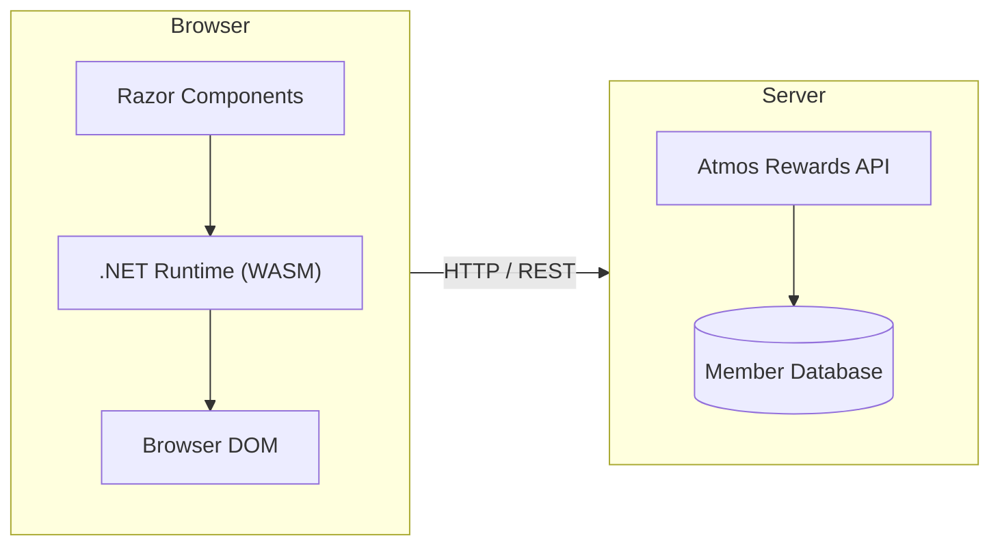
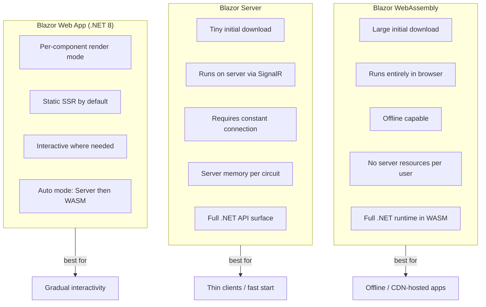
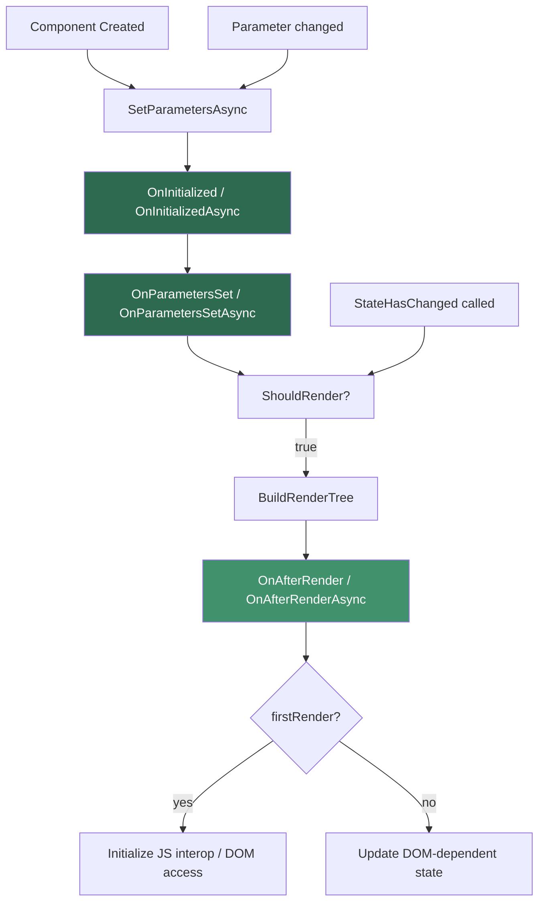
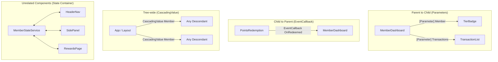
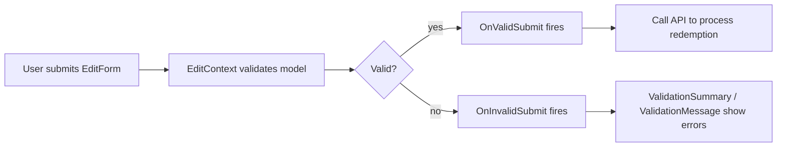
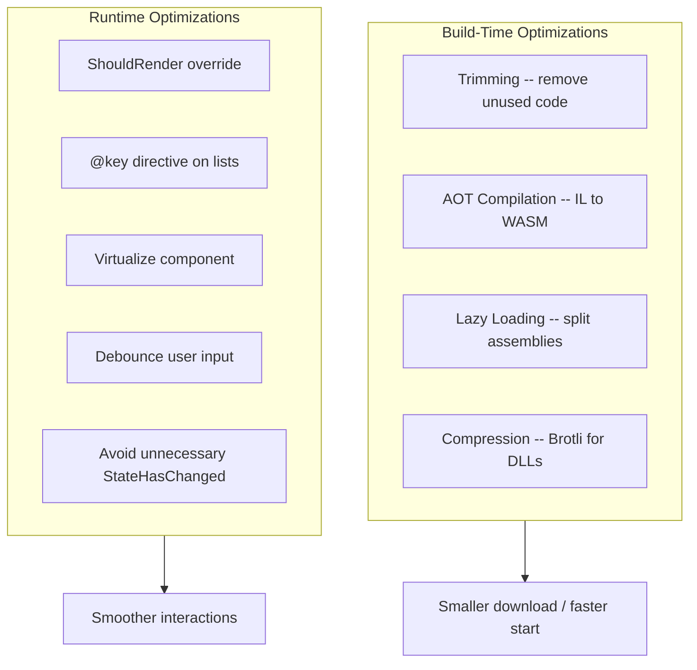

# Blazor WebAssembly

## Overview

Blazor is a .NET web framework that lets developers build interactive client-side web UI using C# instead of JavaScript. With Blazor WebAssembly (WASM), the .NET runtime itself runs inside the browser, meaning C# code executes directly on the client with no persistent server connection required. In .NET 8, a new unified hosting model called Blazor Web App combines the strengths of Server and WebAssembly into a single project.

For the Atmos Rewards platform this means the member dashboard, points balance, tier status, and redemption flows can all be built with the same C# domain models and validation logic that the backend API uses, eliminating duplication between client and server.



---

## 1. Blazor Hosting Models

Blazor offers three hosting models, each with different trade-offs for latency, scalability, and offline capability.

### WebAssembly (Client-Side)

The entire .NET runtime and application DLLs are downloaded to the browser. All rendering and logic happen client-side. The server is only needed for API calls.

### Server (SignalR)

Components execute on the server. UI updates are pushed to the browser over a persistent SignalR WebSocket connection. The browser only handles DOM diffing.

### Hybrid / Blazor Web App (.NET 8)

.NET 8 introduced a unified model where individual pages or components can choose their render mode: Static SSR, Interactive Server, Interactive WebAssembly, or Auto (starts on Server, transitions to WASM once the runtime downloads).



**Comparison for Atmos Rewards:**

| Aspect | WebAssembly | Server | Hybrid (.NET 8) |
|--------|-------------|--------|-----------------|
| Initial load | ~2-5 MB (runtime + DLLs) | ~200 KB | Static SSR + progressive |
| Latency after load | Near-zero (client-side) | Each interaction round-trips | Depends on render mode |
| Offline support | Yes | No | WASM components only |
| Server cost | API only | Memory per circuit | Mixed |
| .NET API surface | Subset (no direct DB) | Full | Full on server components |
| Best fit | Member self-service portal | Admin dashboards | Mixed public/admin site |

---

## 2. Component Lifecycle

Every Blazor component follows a defined lifecycle. Understanding this is critical for knowing when to load data, subscribe to events, or interact with JavaScript.



**Key lifecycle methods:**

- **`OnInitialized` / `OnInitializedAsync`** -- Runs once when the component is first created. Load initial data here (API calls, service lookups).
- **`OnParametersSet` / `OnParametersSetAsync`** -- Runs after parameters are set or updated. Use this to react to parent-supplied parameter changes.
- **`ShouldRender`** -- Return `false` to skip rendering. Useful for high-frequency updates where the component output has not changed.
- **`OnAfterRender` / `OnAfterRenderAsync`** -- Runs after the DOM has been updated. The only safe place for JavaScript interop. The `firstRender` parameter distinguishes the initial render from subsequent ones.
- **`StateHasChanged`** -- Not a lifecycle method but triggers a re-render. Called automatically after event handlers; must be called manually when state changes outside the render cycle (timers, background tasks).
- **`Dispose`** -- Implement `IDisposable` or `IAsyncDisposable` to clean up event subscriptions, timers, or JS interop references.

---

## 3. Data Binding and Event Handling

Blazor supports one-way binding (parent to child, expression to UI) and two-way binding (UI element syncs back to a C# field via `@bind`).

**One-way binding** renders a C# expression into the markup:

```razor
<p>Welcome back, @member.FirstName!</p>
<p>Your tier: <strong>@member.TierLevel</strong></p>
<p>Points balance: @member.PointsBalance.ToString("N0")</p>
```

**Two-way binding** uses `@bind` which combines a `value` attribute with an `onchange` event:

```razor
<!-- These two are equivalent -->
<input @bind="searchTerm" />
<input value="@searchTerm" @onchange="@(e => searchTerm = (string)e.Value!)" />

<!-- Bind with specific event for real-time filtering -->
<input @bind="searchTerm" @bind:event="oninput" placeholder="Search transactions..." />
```

**Event handling** uses `@on{event}` directives:

```razor
<button class="btn btn-primary" @onclick="RedeemPoints">Redeem Points</button>
<button class="btn btn-secondary" @onclick="@(() => LoadPage(currentPage + 1))">Next Page</button>
<button class="btn btn-danger" @onclick="CancelRedemption" @onclick:preventDefault>Cancel</button>

@code {
    private async Task RedeemPoints()
    {
        await RewardService.RedeemAsync(memberId, selectedReward);
        await LoadMemberData();
    }
}
```

---

## 4. Component Communication

Components need to pass data up, down, and across the tree. Blazor provides several mechanisms.



### Parameters (parent to child)

```razor
<!-- Parent passes data down -->
<TierBadge Level="@currentMember.TierLevel" PointsBalance="@currentMember.PointsBalance" />
```

### EventCallback (child to parent)

The child declares an `EventCallback` parameter; the parent supplies a handler method.

### CascadingValue (tree-wide)

Wrapping components in `<CascadingValue>` makes a value available to all descendants without explicit parameter passing.

### State container (unrelated components)

A registered service holds shared state and notifies subscribers through events. Components inject the service and subscribe to changes.

---

## 5. Forms and Validation

Blazor provides `EditForm` with built-in support for `DataAnnotations` and custom validation logic.



---

## 6. HTTP Calls from WebAssembly

In Blazor WebAssembly, `HttpClient` is preconfigured to use the browser's `fetch` API under the hood. It is registered in DI and injected into components or services.

**Key points:**

- `HttpClient` in WASM is subject to browser CORS restrictions.
- Use typed clients or named clients via `IHttpClientFactory` for production code.
- The base address is typically set to the API host in `Program.cs`.
- Use `System.Net.Http.Json` extension methods (`GetFromJsonAsync`, `PostAsJsonAsync`) for clean serialization.

---

## 7. Authentication in Blazor

Blazor has a built-in authentication framework based on `AuthenticationStateProvider`. In WebAssembly, authentication typically works with tokens (JWT or cookies) obtained from an identity provider.

**Core concepts:**

- **`AuthenticationStateProvider`** -- Abstract class that supplies the current `ClaimsPrincipal` to the framework.
- **`<AuthorizeView>`** -- Component that conditionally renders content based on authorization state.
- **`<CascadingAuthenticationState>`** -- Wraps the app and makes `Task<AuthenticationState>` available to all descendants.
- **`[Authorize]` attribute** -- Applied to pages/components to require authentication or specific roles/policies.

---

## 8. JavaScript Interop

When you need browser APIs that .NET cannot access directly (geolocation, clipboard, third-party JS libraries), Blazor provides `IJSRuntime` for calling JavaScript from C# and `DotNetObjectReference` for calling C# from JavaScript.

**Key rules:**

- JS interop calls are only safe in `OnAfterRenderAsync` or event handlers, not during `OnInitialized`.
- Use `IJSRuntime.InvokeAsync<T>` for calls that return a value, `InvokeVoidAsync` otherwise.
- For performance-sensitive scenarios, use `IJSInProcessRuntime` (WASM only, synchronous).
- Always dispose `DotNetObjectReference` instances to prevent memory leaks.

---

## 9. Performance Optimization

Blazor WebAssembly performance can be improved at build time and runtime.

**Lazy loading assemblies** -- Load DLLs on demand when navigating to specific routes. Reduces initial payload.

**AOT (Ahead-of-Time) compilation** -- Compiles .NET IL to native WebAssembly. Improves runtime execution speed at the cost of larger download size (~2-3x). Best for compute-heavy pages.

**Render optimization:**

- Override `ShouldRender()` to skip unnecessary re-renders.
- Use `@key` on list items to help the diff algorithm.
- Avoid calling `StateHasChanged()` unnecessarily.
- Use `virtualization` (`<Virtualize>`) for large lists instead of rendering all items.



---

## Code Examples

The following examples use the Atmos Rewards domain to demonstrate real Blazor component patterns.

### Example 1: MemberDashboard.razor -- Tier Status and Points Balance

This component is the main entry point for a logged-in member. It loads the member profile and displays tier status, points balance, and quick actions.

```csharp
@page "/dashboard"
@attribute [Authorize]
@inject IAtmosRewardsApiService RewardsApi
@inject NavigationManager Navigation

<PageTitle>My Dashboard - Atmos Rewards</PageTitle>

<CascadingValue Value="member" Name="CurrentMember">
    @if (isLoading)
    {
        <div class="spinner-border text-primary" role="status">
            <span class="visually-hidden">Loading your rewards...</span>
        </div>
    }
    else if (member is not null)
    {
        <div class="dashboard-header">
            <h2>Welcome, @member.FirstName @member.LastName</h2>
            <TierBadge Level="@member.TierLevel" />
        </div>

        <div class="row">
            <div class="col-md-4">
                <div class="card">
                    <div class="card-body">
                        <h5 class="card-title">Points Balance</h5>
                        <p class="display-4">@member.PointsBalance.ToString("N0")</p>
                        <p class="text-muted">
                            @FormatTierProgress()
                        </p>
                    </div>
                </div>
            </div>

            <div class="col-md-4">
                <div class="card">
                    <div class="card-body">
                        <h5 class="card-title">Current Tier</h5>
                        <p class="display-6">@member.TierLevel</p>
                        <ProgressBar Value="@tierProgress" Label="@tierProgressLabel" />
                    </div>
                </div>
            </div>

            <div class="col-md-4">
                <div class="card">
                    <div class="card-body">
                        <h5 class="card-title">Quick Actions</h5>
                        <button class="btn btn-primary w-100 mb-2"
                                @onclick="@(() => Navigation.NavigateTo("/redeem"))">
                            Redeem Points
                        </button>
                        <button class="btn btn-outline-secondary w-100"
                                @onclick="@(() => Navigation.NavigateTo("/transactions"))">
                            View Transactions
                        </button>
                    </div>
                </div>
            </div>
        </div>

        <div class="mt-4">
            <h4>Recent Activity</h4>
            <RewardTransactionList Transactions="@recentTransactions"
                                   PageSize="5"
                                   ShowPagination="false" />
        </div>
    }
    else
    {
        <div class="alert alert-warning">Unable to load member data. Please try again.</div>
    }
</CascadingValue>

@code {
    private Member? member;
    private List<RewardTransaction> recentTransactions = new();
    private bool isLoading = true;
    private int tierProgress;
    private string tierProgressLabel = string.Empty;

    protected override async Task OnInitializedAsync()
    {
        try
        {
            member = await RewardsApi.GetCurrentMemberAsync();
            recentTransactions = await RewardsApi.GetRecentTransactionsAsync(count: 5);
            CalculateTierProgress();
        }
        finally
        {
            isLoading = false;
        }
    }

    private void CalculateTierProgress()
    {
        if (member is null) return;

        var (pointsNeeded, nextTier) = member.TierLevel switch
        {
            TierLevel.Standard => (20_000, TierLevel.Gold),
            TierLevel.Gold => (50_000, TierLevel.MVP),
            TierLevel.MVP => (75_000, TierLevel.MVPGold),
            TierLevel.MVPGold => (0, TierLevel.MVPGold),
            _ => (0, TierLevel.Standard)
        };

        if (pointsNeeded > 0)
        {
            tierProgress = (int)((double)member.PointsBalance / pointsNeeded * 100);
            tierProgressLabel = $"{member.PointsBalance:N0} / {pointsNeeded:N0} to {nextTier}";
        }
        else
        {
            tierProgress = 100;
            tierProgressLabel = "Maximum tier reached";
        }
    }

    private string FormatTierProgress()
    {
        return member?.TierLevel == TierLevel.MVPGold
            ? "You have reached the highest tier."
            : $"{tierProgressLabel}";
    }
}
```

### Example 2: RewardTransactionList.razor -- Pagination and Filtering

This component displays a paginated, filterable list of reward transactions. It demonstrates parameters, event callbacks, and efficient list rendering.

```csharp
@inject IAtmosRewardsApiService RewardsApi

<div class="transaction-filters mb-3">
    <div class="row g-2">
        <div class="col-md-4">
            <input class="form-control"
                   @bind="filterText"
                   @bind:event="oninput"
                   @bind:after="ApplyFilter"
                   placeholder="Search transactions..." />
        </div>
        <div class="col-md-3">
            <select class="form-select" @bind="selectedType" @bind:after="ApplyFilter">
                <option value="">All Types</option>
                <option value="Earn">Earn</option>
                <option value="Redeem">Redeem</option>
                <option value="Bonus">Bonus</option>
                <option value="TierQualifying">Tier Qualifying</option>
            </select>
        </div>
        <div class="col-md-3">
            <select class="form-select" @bind="sortOrder" @bind:after="ApplyFilter">
                <option value="DateDesc">Newest First</option>
                <option value="DateAsc">Oldest First</option>
                <option value="PointsDesc">Most Points</option>
            </select>
        </div>
    </div>
</div>

@if (filteredTransactions.Any())
{
    <table class="table table-striped">
        <thead>
            <tr>
                <th>Date</th>
                <th>Description</th>
                <th>Type</th>
                <th class="text-end">Points</th>
            </tr>
        </thead>
        <tbody>
            @foreach (var transaction in GetCurrentPage())
            {
                <tr @key="transaction.Id">
                    <td>@transaction.TransactionDate.ToString("MMM dd, yyyy")</td>
                    <td>@transaction.Description</td>
                    <td>
                        <span class="badge @GetBadgeClass(transaction.Type)">
                            @transaction.Type
                        </span>
                    </td>
                    <td class="text-end @GetPointsClass(transaction.Points)">
                        @(transaction.Points > 0 ? "+" : "")@transaction.Points.ToString("N0")
                    </td>
                </tr>
            }
        </tbody>
    </table>

    @if (ShowPagination && totalPages > 1)
    {
        <nav>
            <ul class="pagination justify-content-center">
                <li class="page-item @(currentPage == 1 ? "disabled" : "")">
                    <button class="page-link" @onclick="@(() => GoToPage(currentPage - 1))">
                        Previous
                    </button>
                </li>
                @for (int i = 1; i <= totalPages; i++)
                {
                    var pageNumber = i;
                    <li class="page-item @(currentPage == pageNumber ? "active" : "")">
                        <button class="page-link" @onclick="@(() => GoToPage(pageNumber))">
                            @pageNumber
                        </button>
                    </li>
                }
                <li class="page-item @(currentPage == totalPages ? "disabled" : "")">
                    <button class="page-link" @onclick="@(() => GoToPage(currentPage + 1))">
                        Next
                    </button>
                </li>
            </ul>
        </nav>
    }
}
else
{
    <p class="text-muted">No transactions match your filter.</p>
}

@code {
    [Parameter]
    public List<RewardTransaction> Transactions { get; set; } = new();

    [Parameter]
    public int PageSize { get; set; } = 10;

    [Parameter]
    public bool ShowPagination { get; set; } = true;

    [Parameter]
    public EventCallback<RewardTransaction> OnTransactionSelected { get; set; }

    private List<RewardTransaction> filteredTransactions = new();
    private string filterText = string.Empty;
    private string selectedType = string.Empty;
    private string sortOrder = "DateDesc";
    private int currentPage = 1;
    private int totalPages => (int)Math.Ceiling((double)filteredTransactions.Count / PageSize);

    protected override void OnParametersSet()
    {
        ApplyFilter();
    }

    private void ApplyFilter()
    {
        filteredTransactions = Transactions
            .Where(t => string.IsNullOrEmpty(filterText)
                || t.Description.Contains(filterText, StringComparison.OrdinalIgnoreCase))
            .Where(t => string.IsNullOrEmpty(selectedType)
                || t.Type.ToString() == selectedType)
            .ToList();

        filteredTransactions = sortOrder switch
        {
            "DateAsc" => filteredTransactions.OrderBy(t => t.TransactionDate).ToList(),
            "PointsDesc" => filteredTransactions.OrderByDescending(t => t.Points).ToList(),
            _ => filteredTransactions.OrderByDescending(t => t.TransactionDate).ToList()
        };

        currentPage = 1;
    }

    private List<RewardTransaction> GetCurrentPage()
    {
        return filteredTransactions
            .Skip((currentPage - 1) * PageSize)
            .Take(PageSize)
            .ToList();
    }

    private void GoToPage(int page)
    {
        if (page >= 1 && page <= totalPages)
            currentPage = page;
    }

    private string GetBadgeClass(TransactionType type) => type switch
    {
        TransactionType.Earn => "bg-success",
        TransactionType.Redeem => "bg-warning text-dark",
        TransactionType.Bonus => "bg-info",
        TransactionType.TierQualifying => "bg-primary",
        _ => "bg-secondary"
    };

    private string GetPointsClass(int points) =>
        points >= 0 ? "text-success" : "text-danger";
}
```

### Example 3: PointsRedemption.razor -- Form with Validation

This component handles points redemption with DataAnnotations validation, minimum-points checks, and tier-based restrictions.

```csharp
@page "/redeem"
@attribute [Authorize]
@inject IAtmosRewardsApiService RewardsApi
@inject NavigationManager Navigation

<PageTitle>Redeem Points - Atmos Rewards</PageTitle>

<h3>Redeem Your Atmos Rewards Points</h3>

@if (member is not null)
{
    <div class="alert alert-info">
        Current balance: <strong>@member.PointsBalance.ToString("N0") points</strong>
        | Tier: <strong>@member.TierLevel</strong>
    </div>

    <EditForm Model="redemptionModel" OnValidSubmit="HandleValidSubmit" FormName="RedemptionForm">
        <DataAnnotationsValidator />
        <ValidationSummary class="text-danger" />

        <div class="mb-3">
            <label for="rewardType" class="form-label">Reward Type</label>
            <InputSelect id="rewardType" class="form-select"
                         @bind-Value="redemptionModel.RewardType">
                <option value="">-- Select a reward --</option>
                @foreach (var reward in availableRewards)
                {
                    <option value="@reward.Type">@reward.Name (@reward.PointsCost.ToString("N0") pts)</option>
                }
            </InputSelect>
            <ValidationMessage For="@(() => redemptionModel.RewardType)" />
        </div>

        <div class="mb-3">
            <label for="points" class="form-label">Points to Redeem</label>
            <InputNumber id="points" class="form-control"
                         @bind-Value="redemptionModel.PointsToRedeem" />
            <ValidationMessage For="@(() => redemptionModel.PointsToRedeem)" />
            @if (redemptionModel.PointsToRedeem > member.PointsBalance)
            {
                <div class="text-danger mt-1">Insufficient points balance.</div>
            }
        </div>

        <div class="mb-3">
            <label for="notes" class="form-label">Notes (optional)</label>
            <InputTextArea id="notes" class="form-control"
                           @bind-Value="redemptionModel.Notes" rows="3" />
            <ValidationMessage For="@(() => redemptionModel.Notes)" />
        </div>

        <div class="d-flex gap-2">
            <button type="submit" class="btn btn-primary"
                    disabled="@(isSubmitting || redemptionModel.PointsToRedeem > member.PointsBalance)">
                @if (isSubmitting)
                {
                    <span class="spinner-border spinner-border-sm me-1"></span>
                }
                Redeem Points
            </button>
            <button type="button" class="btn btn-outline-secondary"
                    @onclick="@(() => Navigation.NavigateTo("/dashboard"))">
                Cancel
            </button>
        </div>
    </EditForm>

    @if (!string.IsNullOrEmpty(resultMessage))
    {
        <div class="alert @(isSuccess ? "alert-success" : "alert-danger") mt-3">
            @resultMessage
        </div>
    }
}

@code {
    private Member? member;
    private RedemptionModel redemptionModel = new();
    private List<AvailableReward> availableRewards = new();
    private bool isSubmitting;
    private bool isSuccess;
    private string resultMessage = string.Empty;

    protected override async Task OnInitializedAsync()
    {
        member = await RewardsApi.GetCurrentMemberAsync();
        availableRewards = await RewardsApi.GetAvailableRewardsAsync(member!.TierLevel);
    }

    private async Task HandleValidSubmit()
    {
        if (member is null || redemptionModel.PointsToRedeem > member.PointsBalance)
            return;

        isSubmitting = true;
        resultMessage = string.Empty;

        try
        {
            var result = await RewardsApi.RedeemPointsAsync(new RedemptionRequest
            {
                MemberId = member.Id,
                RewardType = redemptionModel.RewardType,
                PointsToRedeem = redemptionModel.PointsToRedeem,
                Notes = redemptionModel.Notes
            });

            isSuccess = true;
            resultMessage = $"Redeemed {redemptionModel.PointsToRedeem:N0} points. "
                + $"New balance: {result.NewBalance:N0} points.";
            member.PointsBalance = result.NewBalance;
            redemptionModel = new();
        }
        catch (ApiException ex)
        {
            isSuccess = false;
            resultMessage = $"Redemption failed: {ex.Message}";
        }
        finally
        {
            isSubmitting = false;
        }
    }

    public class RedemptionModel
    {
        [Required(ErrorMessage = "Please select a reward type.")]
        public string RewardType { get; set; } = string.Empty;

        [Required]
        [Range(1000, int.MaxValue, ErrorMessage = "Minimum redemption is 1,000 points.")]
        public int PointsToRedeem { get; set; }

        [MaxLength(500, ErrorMessage = "Notes cannot exceed 500 characters.")]
        public string? Notes { get; set; }
    }
}
```

### Example 4: IAtmosRewardsApiService -- API Service Layer

This service abstracts all HTTP calls to the Atmos Rewards backend. It is registered as a typed `HttpClient` in DI.

```csharp
// Services/IAtmosRewardsApiService.cs
public interface IAtmosRewardsApiService
{
    Task<Member> GetCurrentMemberAsync();
    Task<List<RewardTransaction>> GetRecentTransactionsAsync(int count = 10);
    Task<List<RewardTransaction>> GetTransactionsAsync(int page, int pageSize);
    Task<List<AvailableReward>> GetAvailableRewardsAsync(TierLevel tier);
    Task<RedemptionResult> RedeemPointsAsync(RedemptionRequest request);
}

// Services/AtmosRewardsApiService.cs
public class AtmosRewardsApiService : IAtmosRewardsApiService
{
    private readonly HttpClient _http;

    public AtmosRewardsApiService(HttpClient http)
    {
        _http = http;
    }

    public async Task<Member> GetCurrentMemberAsync()
    {
        return await _http.GetFromJsonAsync<Member>("api/members/me")
            ?? throw new ApiException("Failed to load member profile.");
    }

    public async Task<List<RewardTransaction>> GetRecentTransactionsAsync(int count = 10)
    {
        return await _http.GetFromJsonAsync<List<RewardTransaction>>(
            $"api/transactions/recent?count={count}") ?? new();
    }

    public async Task<List<RewardTransaction>> GetTransactionsAsync(int page, int pageSize)
    {
        return await _http.GetFromJsonAsync<List<RewardTransaction>>(
            $"api/transactions?page={page}&pageSize={pageSize}") ?? new();
    }

    public async Task<List<AvailableReward>> GetAvailableRewardsAsync(TierLevel tier)
    {
        return await _http.GetFromJsonAsync<List<AvailableReward>>(
            $"api/rewards/available?tier={tier}") ?? new();
    }

    public async Task<RedemptionResult> RedeemPointsAsync(RedemptionRequest request)
    {
        var response = await _http.PostAsJsonAsync("api/rewards/redeem", request);
        response.EnsureSuccessStatusCode();
        return await response.Content.ReadFromJsonAsync<RedemptionResult>()
            ?? throw new ApiException("Empty response from redemption endpoint.");
    }
}

// Registration in Program.cs
builder.Services.AddHttpClient<IAtmosRewardsApiService, AtmosRewardsApiService>(client =>
{
    client.BaseAddress = new Uri(builder.Configuration["ApiBaseUrl"]
        ?? "https://api.atmosrewards.alaskaair.com");
});
```

### Example 5: AuthorizeView for Tier-Based Content

This example shows how `AuthorizeView` and policy-based authorization render different content depending on the member's tier level.

```csharp
// Shared/TierBasedContent.razor -- different UI per tier level
@using Microsoft.AspNetCore.Authorization

<AuthorizeView>
    <Authorized>
        @* All authenticated members see their basic dashboard *@
        <div class="tier-content">
            <h4>Your Atmos Rewards Benefits</h4>

            <AuthorizeView Policy="GoldTierOrHigher">
                <Authorized>
                    <div class="alert alert-warning">
                        <strong>Gold Member Benefits:</strong>
                        Priority check-in, free checked bag, bonus earning rate (1.5x).
                    </div>
                </Authorized>
            </AuthorizeView>

            <AuthorizeView Policy="MVPTierOrHigher">
                <Authorized>
                    <div class="alert alert-primary">
                        <strong>MVP Benefits:</strong>
                        Complimentary upgrades (when available), Alaska Lounge day pass,
                        bonus earning rate (2x).
                    </div>
                </Authorized>
            </AuthorizeView>

            <AuthorizeView Policy="MVPGoldOnly">
                <Authorized>
                    <div class="alert alert-success">
                        <strong>MVP Gold Benefits:</strong>
                        Guaranteed upgrades, unlimited Alaska Lounge access,
                        bonus earning rate (3x), Global Partner awards.
                    </div>
                </Authorized>
            </AuthorizeView>
        </div>
    </Authorized>

    <NotAuthorized>
        <div class="alert alert-secondary">
            <a href="/login">Sign in</a> to view your Atmos Rewards benefits.
        </div>
    </NotAuthorized>
</AuthorizeView>

// Program.cs -- policy registration
builder.Services.AddAuthorizationCore(options =>
{
    options.AddPolicy("GoldTierOrHigher", policy =>
        policy.RequireAssertion(context =>
        {
            var tierClaim = context.User.FindFirst("AtmosTier")?.Value;
            return Enum.TryParse<TierLevel>(tierClaim, out var tier)
                && tier >= TierLevel.Gold;
        }));

    options.AddPolicy("MVPTierOrHigher", policy =>
        policy.RequireAssertion(context =>
        {
            var tierClaim = context.User.FindFirst("AtmosTier")?.Value;
            return Enum.TryParse<TierLevel>(tierClaim, out var tier)
                && tier >= TierLevel.MVP;
        }));

    options.AddPolicy("MVPGoldOnly", policy =>
        policy.RequireAssertion(context =>
        {
            var tierClaim = context.User.FindFirst("AtmosTier")?.Value;
            return Enum.TryParse<TierLevel>(tierClaim, out var tier)
                && tier == TierLevel.MVPGold;
        }));
});
```

### Example 6: CascadingValue for Current Member Context

This pattern provides the current member to all components in the render tree without prop-drilling.

```csharp
// Shared/MemberContextProvider.razor
@inject IAtmosRewardsApiService RewardsApi
@implements IDisposable

<CascadingValue Value="memberContext" Name="MemberContext">
    @if (memberContext.IsLoaded)
    {
        @ChildContent
    }
    else if (memberContext.HasError)
    {
        <div class="alert alert-danger">
            Failed to load member context. Please refresh the page.
        </div>
    }
    else
    {
        <div class="d-flex justify-content-center p-5">
            <div class="spinner-border" role="status">
                <span class="visually-hidden">Loading...</span>
            </div>
        </div>
    }
</CascadingValue>

@code {
    [Parameter]
    public RenderFragment ChildContent { get; set; } = default!;

    private MemberContext memberContext = new();

    protected override async Task OnInitializedAsync()
    {
        try
        {
            var member = await RewardsApi.GetCurrentMemberAsync();
            memberContext = new MemberContext
            {
                Member = member,
                IsLoaded = true
            };
        }
        catch
        {
            memberContext = new MemberContext { HasError = true };
        }
    }

    public void Dispose()
    {
        // Clean up any subscriptions if needed
    }
}

// Models/MemberContext.cs
public class MemberContext
{
    public Member? Member { get; set; }
    public bool IsLoaded { get; set; }
    public bool HasError { get; set; }

    public TierLevel CurrentTier => Member?.TierLevel ?? TierLevel.Standard;
    public int PointsBalance => Member?.PointsBalance ?? 0;
    public bool IsGoldOrHigher => CurrentTier >= TierLevel.Gold;
    public bool IsMVPOrHigher => CurrentTier >= TierLevel.MVP;
}

// Domain models used throughout
public class Member
{
    public int Id { get; set; }
    public string FirstName { get; set; } = string.Empty;
    public string LastName { get; set; } = string.Empty;
    public string Email { get; set; } = string.Empty;
    public string MemberNumber { get; set; } = string.Empty;
    public TierLevel TierLevel { get; set; }
    public int PointsBalance { get; set; }
    public DateTime MemberSince { get; set; }
}

public enum TierLevel
{
    Standard = 0,
    Gold = 1,
    MVP = 2,
    MVPGold = 3
}

public class RewardTransaction
{
    public int Id { get; set; }
    public int MemberId { get; set; }
    public TransactionType Type { get; set; }
    public int Points { get; set; }
    public string Description { get; set; } = string.Empty;
    public DateTime TransactionDate { get; set; }
}

public enum TransactionType
{
    Earn,
    Redeem,
    Bonus,
    TierQualifying
}

// Consuming the cascading value in any descendant component
// SomeNestedComponent.razor
@code {
    [CascadingParameter(Name = "MemberContext")]
    private MemberContext MemberContext { get; set; } = default!;

    private string WelcomeMessage => MemberContext.CurrentTier switch
    {
        TierLevel.MVPGold => $"Welcome, MVP Gold member {MemberContext.Member!.FirstName}!",
        TierLevel.MVP => $"Welcome, MVP member {MemberContext.Member!.FirstName}!",
        TierLevel.Gold => $"Welcome, Gold member {MemberContext.Member!.FirstName}!",
        _ => $"Welcome, {MemberContext.Member!.FirstName}!"
    };
}
```

---

## Interview Questions

### Fundamentals

1. **What is the difference between Blazor Server and Blazor WebAssembly?** Explain the hosting model, when each is appropriate, and the latency/scalability trade-offs.

2. **How does Blazor WebAssembly execute .NET code in the browser?** Describe the role of the .NET IL interpreter and the WebAssembly runtime (Mono WASM).

3. **What changed with Blazor in .NET 8?** Describe the Blazor Web App template, render modes (`InteractiveServer`, `InteractiveWebAssembly`, `InteractiveAuto`), and static SSR.

4. **What is the purpose of `StateHasChanged()`?** When is it called automatically, and when must you call it manually?

### Component Design

5. **Walk through the Blazor component lifecycle.** Describe the order: `SetParametersAsync` -> `OnInitialized` -> `OnParametersSet` -> `ShouldRender` -> `BuildRenderTree` -> `OnAfterRender`.

6. **How do you pass data from a parent component to a child?** Explain `[Parameter]` and when to use `[CascadingParameter]`.

7. **How does `EventCallback` work?** Why is it preferred over raw `Action`/`Func` delegates for component communication?

8. **When would you use a state container service instead of `CascadingValue`?** Discuss scenarios where unrelated components need to share state (header, sidebar, page body).

### Data and Forms

9. **How does `@bind` work under the hood?** What does `@bind:event="oninput"` do differently from the default `onchange`?

10. **Explain how `EditForm` validation works.** Describe `EditContext`, `DataAnnotationsValidator`, `ValidationSummary`, and `ValidationMessage`.

11. **How do you call a REST API from Blazor WebAssembly?** Discuss `HttpClient` registration, `GetFromJsonAsync`, CORS considerations, and typed clients.

### Security

12. **How does authentication work in Blazor WebAssembly?** Explain `AuthenticationStateProvider`, token storage, and how `<AuthorizeView>` uses the authentication state.

13. **How would you implement role-based or policy-based authorization in Blazor?** Describe `[Authorize(Policy = "...")]`, `RequireAssertion`, and claims-based policies.

14. **What security risks are unique to Blazor WebAssembly?** Discuss the fact that all client-side code is visible, authorization must be enforced server-side, and token storage considerations.

### Performance

15. **What is AOT compilation in Blazor WebAssembly?** When is it beneficial, and what is the trade-off (larger payload vs. faster execution)?

16. **How does lazy loading of assemblies work?** Describe `OnNavigateAsync` in the `Router` component and the `LazyAssemblyLoader` service.

17. **How do you optimize rendering performance?** Discuss `ShouldRender()`, `@key`, `<Virtualize>`, and avoiding unnecessary `StateHasChanged` calls.

18. **What is the `@key` directive and why does it matter for list rendering?** Explain how the diff algorithm uses keys to avoid unnecessary DOM mutations.

### JavaScript Interop

19. **When and how would you use JavaScript interop in Blazor?** Describe `IJSRuntime.InvokeAsync`, `DotNetObjectReference`, and the restriction that JS calls must happen after render.

20. **What is the difference between `IJSRuntime` and `IJSInProcessRuntime`?** When can you use the synchronous version, and why does it only work in WebAssembly?

### Architecture and Real-World Scenarios

21. **How would you structure a Blazor WebAssembly app for the Atmos Rewards member portal?** Discuss project layout, shared models, API service layer, authentication flow, and component hierarchy.

22. **A member reports that the dashboard takes 8 seconds to load on mobile. How would you diagnose and improve this?** Discuss trimming, AOT, lazy loading, caching, reducing API calls, and pre-rendering.

23. **How would you handle offline scenarios in Blazor WebAssembly?** Discuss service workers, local storage caching, and sync-on-reconnect patterns.

24. **Compare Blazor WebAssembly to a React/Angular SPA for the Atmos Rewards front-end.** Discuss ecosystem maturity, team skillset, performance, and code sharing with the .NET backend.
