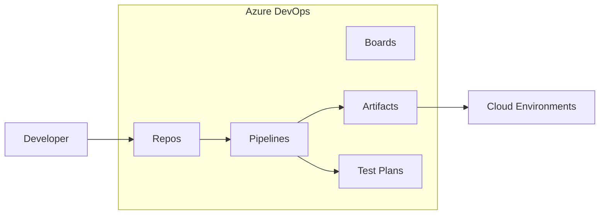
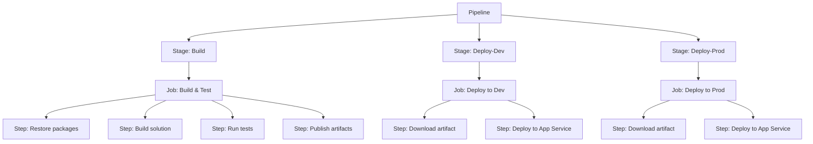
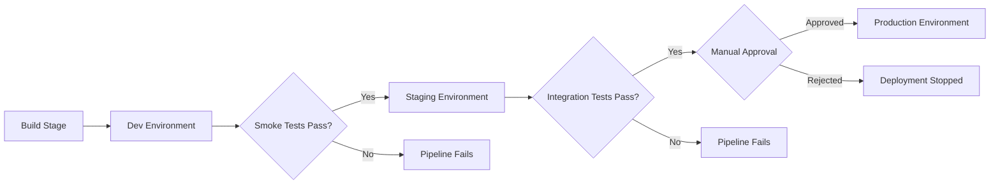
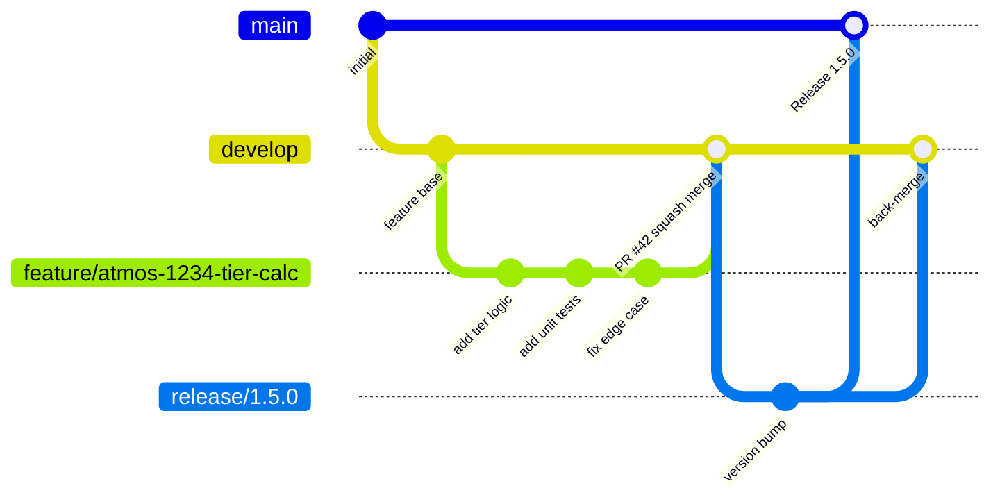
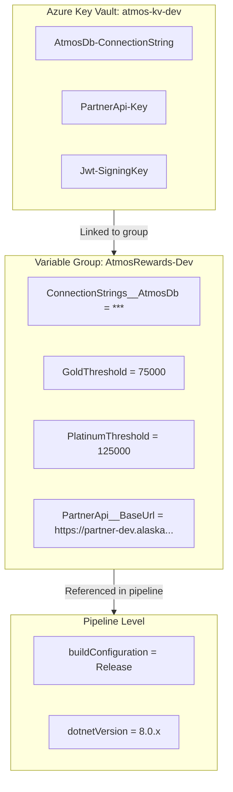
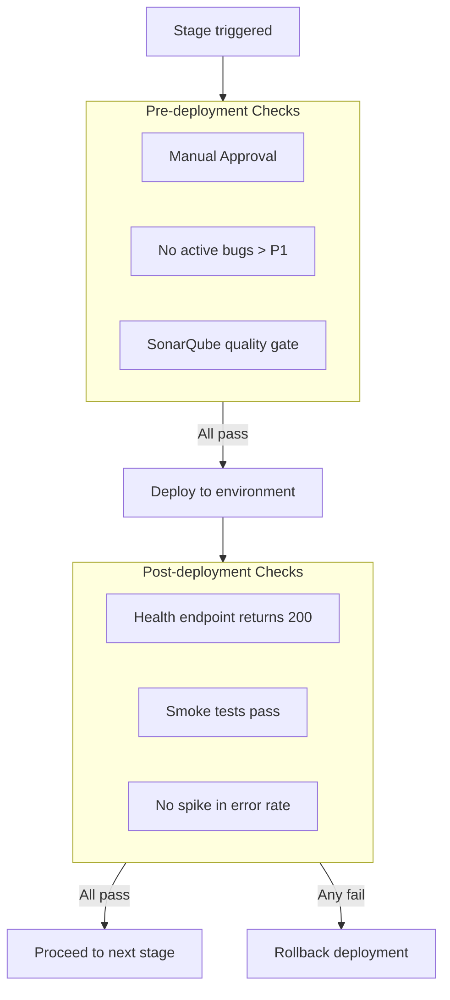

# Azure DevOps Pipelines and CI/CD

## Overview

Azure DevOps provides a comprehensive set of services for planning, building, testing, and deploying software. At its core, Azure Pipelines enables continuous integration and continuous delivery (CI/CD) for any language and any platform. For the Atmos Rewards team, this means automated build validation on every pull request, multi-stage deployments with approval gates across Dev/Staging/Production, and reusable pipeline templates that enforce consistency across the loyalty platform's microservices.

This document covers YAML-based pipelines, branching strategies, artifact management, infrastructure as code, and the practices that keep the Atmos Rewards platform shipping reliably.



---

## 1. Azure Pipelines Fundamentals

Azure Pipelines supports two authoring experiences: **Classic** (GUI-based) and **YAML** (code-based). YAML pipelines are the modern standard because they live alongside the application code, are version-controlled, and support pull request review workflows.

### YAML Pipeline Hierarchy

Every YAML pipeline is organized into a hierarchy of stages, jobs, and steps.



**Key concepts:**

| Concept | Description |
|---------|-------------|
| **Stage** | A logical boundary in the pipeline (e.g., Build, Deploy-Dev). Stages run sequentially by default but can be parallelized. |
| **Job** | A series of steps that run on a single agent. Jobs within a stage can run in parallel. |
| **Step** | The smallest unit of work -- a script or a task. |
| **Agent pool** | A collection of build machines. Microsoft-hosted pools provide clean VMs; self-hosted pools offer custom configurations. |
| **Trigger** | Defines when the pipeline runs -- on push, on PR, on schedule, or manually. |

### YAML vs Classic Pipelines

| Aspect | YAML Pipelines | Classic Pipelines |
|--------|---------------|-------------------|
| Source control | Stored in repo as `azure-pipelines.yml` | Stored in Azure DevOps service |
| Code review | PR-reviewable changes | No PR workflow for pipeline changes |
| Templates | Full template support with parameters | Limited task group reuse |
| Multi-stage | Native multi-stage support | Separate Build and Release definitions |
| Recommended | Yes -- industry standard | Legacy, still supported |

---

## 2. CI Pipeline -- Build, Test, and Code Coverage

A CI pipeline runs on every push and pull request to validate that the codebase compiles, all tests pass, and code coverage meets the team's threshold.

### Complete CI Pipeline for Atmos Rewards

```yaml
# azure-pipelines-ci.yml
trigger:
  branches:
    include:
      - main
      - develop
      - feature/*
      - release/*

pr:
  branches:
    include:
      - main
      - develop

pool:
  vmImage: 'ubuntu-latest'

variables:
  buildConfiguration: 'Release'
  dotnetVersion: '8.0.x'
  solution: 'AtmosRewards.sln'
  testProjects: '**/*Tests.csproj'
  coverageThreshold: 80

stages:
  - stage: Build
    displayName: 'Build & Test'
    jobs:
      - job: BuildAndTest
        displayName: 'Build, Test, and Analyze'
        steps:
          - task: UseDotNet@2
            displayName: 'Install .NET SDK'
            inputs:
              packageType: 'sdk'
              version: '$(dotnetVersion)'

          - task: DotNetCoreCLI@2
            displayName: 'Restore NuGet packages'
            inputs:
              command: 'restore'
              projects: '$(solution)'
              feedsToUse: 'select'
              vstsFeed: 'AtmosRewards/atmos-nuget-feed'

          - task: DotNetCoreCLI@2
            displayName: 'Build solution'
            inputs:
              command: 'build'
              projects: '$(solution)'
              arguments: >-
                --configuration $(buildConfiguration)
                --no-restore

          - task: DotNetCoreCLI@2
            displayName: 'Run unit tests with coverage'
            inputs:
              command: 'test'
              projects: '$(testProjects)'
              arguments: >-
                --configuration $(buildConfiguration)
                --no-build
                --collect:"XPlat Code Coverage"
                --logger trx
                --results-directory $(Agent.TempDirectory)/TestResults

          - task: PublishTestResults@2
            displayName: 'Publish test results'
            inputs:
              testResultsFormat: 'VSTest'
              testResultsFiles: '$(Agent.TempDirectory)/TestResults/**/*.trx'
              mergeTestResults: true

          - script: |
              dotnet tool install -g dotnet-reportgenerator-globaltool
              reportgenerator \
                -reports:$(Agent.TempDirectory)/TestResults/**/coverage.cobertura.xml \
                -targetdir:$(Build.ArtifactStagingDirectory)/CoverageReport \
                -reporttypes:HtmlInline_AzurePipelines\;Cobertura
            displayName: 'Generate coverage report'

          - task: PublishCodeCoverageResults@2
            displayName: 'Publish code coverage'
            inputs:
              summaryFileLocation: >-
                $(Build.ArtifactStagingDirectory)/CoverageReport/Cobertura.xml

          - task: DotNetCoreCLI@2
            displayName: 'Publish build output'
            inputs:
              command: 'publish'
              publishWebProjects: false
              projects: '**/AtmosRewards.Api.csproj'
              arguments: >-
                --configuration $(buildConfiguration)
                --no-build
                --output $(Build.ArtifactStagingDirectory)/app

          - task: PublishPipelineArtifact@1
            displayName: 'Upload pipeline artifact'
            inputs:
              targetPath: '$(Build.ArtifactStagingDirectory)/app'
              artifact: 'atmos-rewards-api'
              publishLocation: 'pipeline'
```

**What each step does:**

1. **Install .NET SDK** -- ensures the correct SDK version is available on the agent.
2. **Restore** -- pulls NuGet packages from both nuget.org and the team's private feed.
3. **Build** -- compiles the entire solution in Release configuration.
4. **Test** -- runs all test projects, collects XPlat Code Coverage (Cobertura format), and outputs TRX result files.
5. **Publish test results** -- makes test results visible on the pipeline run summary.
6. **Generate coverage report** -- uses ReportGenerator to produce an HTML report and a Cobertura summary.
7. **Publish code coverage** -- displays the coverage report in the Azure DevOps UI.
8. **Publish build output** -- packages the API project as a deployable artifact.
9. **Upload pipeline artifact** -- stores the artifact so downstream stages can consume it.

---

## 3. CD Pipeline -- Multi-Stage Deployment with Approvals

A CD pipeline takes a validated build artifact and promotes it through environments: Dev (automatic), Staging (automatic with smoke tests), and Production (manual approval required).



### Multi-Stage CD Pipeline

```yaml
# azure-pipelines-cd.yml
trigger:
  branches:
    include:
      - main

resources:
  pipelines:
    - pipeline: ci-build
      source: 'AtmosRewards-CI'
      trigger:
        branches:
          include:
            - main

variables:
  - group: AtmosRewards-Common
  - name: azureSubscription
    value: 'Alaska-Airlines-Azure-ServiceConnection'

stages:
  # --------------------------------------------------------
  # Stage 1: Deploy to Dev (automatic)
  # --------------------------------------------------------
  - stage: DeployDev
    displayName: 'Deploy to Dev'
    jobs:
      - deployment: DeployDevJob
        displayName: 'Deploy Atmos Rewards API to Dev'
        environment: 'atmos-rewards-dev'
        strategy:
          runOnce:
            deploy:
              steps:
                - download: ci-build
                  artifact: atmos-rewards-api

                - task: AzureWebApp@1
                  displayName: 'Deploy to Dev App Service'
                  inputs:
                    azureSubscription: '$(azureSubscription)'
                    appType: 'webAppLinux'
                    appName: 'atmos-rewards-api-dev'
                    package: '$(Pipeline.Workspace)/ci-build/atmos-rewards-api/**/*.zip'

                - task: AzureAppServiceSettings@1
                  displayName: 'Configure Dev settings'
                  inputs:
                    azureSubscription: '$(azureSubscription)'
                    appName: 'atmos-rewards-api-dev'
                    appSettings: |
                      [
                        { "name": "ASPNETCORE_ENVIRONMENT", "value": "Development" },
                        { "name": "RewardTier__GoldThreshold", "value": "$(GoldThreshold)" }
                      ]

  # --------------------------------------------------------
  # Stage 2: Deploy to Staging (with smoke tests)
  # --------------------------------------------------------
  - stage: DeployStaging
    displayName: 'Deploy to Staging'
    dependsOn: DeployDev
    condition: succeeded()
    jobs:
      - deployment: DeployStagingJob
        displayName: 'Deploy Atmos Rewards API to Staging'
        environment: 'atmos-rewards-staging'
        strategy:
          runOnce:
            deploy:
              steps:
                - download: ci-build
                  artifact: atmos-rewards-api

                - task: AzureWebApp@1
                  displayName: 'Deploy to Staging App Service'
                  inputs:
                    azureSubscription: '$(azureSubscription)'
                    appType: 'webAppLinux'
                    appName: 'atmos-rewards-api-staging'
                    package: '$(Pipeline.Workspace)/ci-build/atmos-rewards-api/**/*.zip'

            postRouteTraffic:
              steps:
                - script: |
                    echo "Running smoke tests against Staging..."
                    dotnet test tests/AtmosRewards.SmokeTests \
                      --configuration Release \
                      --logger trx \
                      -- TestRunParameters.Parameter\(name=\"BaseUrl\",value=\"https://atmos-rewards-api-staging.azurewebsites.net\"\)
                  displayName: 'Run smoke tests'

  # --------------------------------------------------------
  # Stage 3: Deploy to Production (manual approval gate)
  # --------------------------------------------------------
  - stage: DeployProd
    displayName: 'Deploy to Production'
    dependsOn: DeployStaging
    condition: succeeded()
    jobs:
      - deployment: DeployProdJob
        displayName: 'Deploy Atmos Rewards API to Production'
        environment: 'atmos-rewards-prod'   # Approval configured on this environment
        strategy:
          canary:
            increments: [10, 50, 100]
            deploy:
              steps:
                - download: ci-build
                  artifact: atmos-rewards-api

                - task: AzureWebApp@1
                  displayName: 'Deploy to Prod App Service'
                  inputs:
                    azureSubscription: '$(azureSubscription)'
                    appType: 'webAppLinux'
                    appName: 'atmos-rewards-api-prod'
                    package: '$(Pipeline.Workspace)/ci-build/atmos-rewards-api/**/*.zip'
                    deployToSlotOrASE: true
                    slotName: 'canary'

            on:
              success:
                steps:
                  - script: echo "Canary deployment succeeded at $(Strategy.Increment)%"
              failure:
                steps:
                  - script: echo "Canary deployment failed -- rolling back"
```

**Key patterns in this pipeline:**

- **`deployment` jobs** use the `environment` keyword, which enables approval checks, audit history, and Kubernetes/VM resource targeting.
- **`runOnce`** strategy deploys once to Dev and Staging. The `postRouteTraffic` hook runs smoke tests after deployment.
- **`canary`** strategy in Production gradually shifts traffic (10% -> 50% -> 100%), rolling back automatically on failure.
- **Manual approvals** are configured on the `atmos-rewards-prod` environment resource in Azure DevOps, not in the YAML itself.

---

## 4. Branch Policies and Merge Strategies

Branch policies enforce quality gates before code reaches protected branches. They are configured in Azure DevOps under **Repos > Branches > Policies**.



### Branch Policy Configuration

| Policy | Configuration | Purpose |
|--------|--------------|---------|
| **Minimum reviewers** | 2 required approvers, reset on push | At least two team members approve every PR |
| **Build validation** | CI pipeline must succeed | Prevents merging broken code |
| **Comment resolution** | All comments must be resolved | Ensures review feedback is addressed |
| **Merge strategy** | Squash merge enforced | Keeps main/develop history clean |
| **Work item linking** | Required | Every PR links to an Azure Board item |
| **Automatically included reviewers** | `@atmos-rewards-team` for `/src/AtmosRewards.Core/**` | Domain experts review core business logic |

### Merge Strategies Explained

| Strategy | Resulting History | Best For |
|----------|------------------|----------|
| **Merge commit** | Preserves all commits plus a merge commit | Large features where individual commits matter |
| **Squash merge** | Single commit on target branch | Feature branches where internal history is noise |
| **Rebase** | Linear history, all commits replayed | Small changes, keeping a very clean log |
| **Semi-linear merge** | Rebase + merge commit | Linear history but with a merge marker |

For Atmos Rewards, **squash merge** into `develop` keeps the history clean while the feature branch retains the detailed commit history until it is deleted.

---

## 5. Pipeline Variables and Variable Groups

Variables parameterize pipelines. Variable groups centralize configuration that multiple pipelines share, and they integrate with Azure Key Vault for secrets management.

### Variable Scopes



### Variable Group Usage for Environment-Specific Configuration

```yaml
# Variable groups per environment, linked to Azure Key Vault for secrets
variables:
  - group: AtmosRewards-Common      # Shared across all environments
  - ${{ if eq(variables['Build.SourceBranch'], 'refs/heads/main') }}:
    - group: AtmosRewards-Prod
  - ${{ if eq(variables['Build.SourceBranch'], 'refs/heads/develop') }}:
    - group: AtmosRewards-Dev
  - ${{ else }}:
    - group: AtmosRewards-Dev

# Each variable group contains environment-specific values:
#
# AtmosRewards-Common:
#   buildConfiguration: Release
#   dotnetVersion: 8.0.x
#
# AtmosRewards-Dev:
#   AppService.Name: atmos-rewards-api-dev
#   ConnectionStrings.AtmosDb: <linked from Key Vault>
#   RewardTier.GoldThreshold: 75000
#   RewardTier.PlatinumThreshold: 125000
#   PartnerApi.BaseUrl: https://partner-dev.alaskaair.internal
#   PartnerApi.Key: <linked from Key Vault>
#
# AtmosRewards-Prod:
#   AppService.Name: atmos-rewards-api-prod
#   ConnectionStrings.AtmosDb: <linked from Key Vault>
#   RewardTier.GoldThreshold: 75000
#   RewardTier.PlatinumThreshold: 125000
#   PartnerApi.BaseUrl: https://partner.alaskaair.com
#   PartnerApi.Key: <linked from Key Vault>
```

**Secrets management best practices:**

- Never store secrets directly in YAML or variable groups. Link variable groups to Azure Key Vault.
- Mark sensitive variables as `isSecret: true` so they are masked in logs.
- Use service connections with managed identities to access Key Vault -- no passwords to rotate.
- Scope Key Vault access policies per environment so Dev pipelines cannot read Prod secrets.

---

## 6. Artifacts -- NuGet, Containers, and Pipeline Artifacts

Artifacts are the outputs of a build that downstream stages or other pipelines consume.

### Artifact Types

| Type | Use Case | Storage |
|------|----------|---------|
| **Pipeline artifacts** | Build outputs consumed by later stages in the same pipeline | Azure DevOps pipeline storage |
| **NuGet packages** | Shared libraries published to a feed | Azure Artifacts feed |
| **Container images** | Docker images pushed to a registry | Azure Container Registry (ACR) |
| **Universal packages** | Large files, binaries, or datasets | Azure Artifacts universal packages |

### Docker Build and Push Stage

```yaml
# Stage that builds a Docker image and pushes it to Azure Container Registry
- stage: BuildContainer
  displayName: 'Build & Push Container Image'
  dependsOn: Build
  condition: and(succeeded(), eq(variables['Build.SourceBranch'], 'refs/heads/main'))
  jobs:
    - job: DockerBuildPush
      displayName: 'Docker Build and Push'
      pool:
        vmImage: 'ubuntu-latest'
      variables:
        imageRepository: 'atmos-rewards-api'
        containerRegistry: 'atmosrewardsacr.azurecr.io'
        dockerfilePath: 'src/AtmosRewards.Api/Dockerfile'
        tag: '$(Build.BuildId)-$(Build.SourceVersion)'
      steps:
        - task: Docker@2
          displayName: 'Build container image'
          inputs:
            containerRegistry: 'AtmosRewards-ACR-ServiceConnection'
            repository: '$(imageRepository)'
            command: 'build'
            Dockerfile: '$(dockerfilePath)'
            buildContext: '.'
            tags: |
              $(tag)
              latest
            arguments: >-
              --build-arg BUILD_CONFIG=Release
              --build-arg DOTNET_VERSION=8.0

        - task: Docker@2
          displayName: 'Push to ACR'
          inputs:
            containerRegistry: 'AtmosRewards-ACR-ServiceConnection'
            repository: '$(imageRepository)'
            command: 'push'
            tags: |
              $(tag)
              latest

        - task: KubernetesManifest@1
          displayName: 'Deploy to AKS Dev'
          inputs:
            action: 'deploy'
            connectionType: 'azureResourceManager'
            azureSubscriptionConnection: '$(azureSubscription)'
            azureResourceGroup: 'atmos-rewards-rg-dev'
            kubernetesCluster: 'atmos-rewards-aks-dev'
            manifests: 'k8s/deployment.yml'
            containers: '$(containerRegistry)/$(imageRepository):$(tag)'
```

---

## 7. Pipeline Templates -- Reusable Build Steps

Templates eliminate duplication across pipelines. A template can define reusable steps, jobs, or entire stages and accept parameters.

### Reusable .NET Build Template

```yaml
# templates/dotnet-build.yml
# Reusable template for building and testing any .NET project in the Atmos platform.
parameters:
  - name: solution
    type: string
    default: '*.sln'
  - name: buildConfiguration
    type: string
    default: 'Release'
  - name: dotnetVersion
    type: string
    default: '8.0.x'
  - name: runTests
    type: boolean
    default: true
  - name: publishProject
    type: string
    default: ''
  - name: nugetFeed
    type: string
    default: 'AtmosRewards/atmos-nuget-feed'

steps:
  - task: UseDotNet@2
    displayName: 'Install .NET SDK ${{ parameters.dotnetVersion }}'
    inputs:
      packageType: 'sdk'
      version: '${{ parameters.dotnetVersion }}'

  - task: DotNetCoreCLI@2
    displayName: 'Restore NuGet packages'
    inputs:
      command: 'restore'
      projects: '${{ parameters.solution }}'
      feedsToUse: 'select'
      vstsFeed: '${{ parameters.nugetFeed }}'

  - task: DotNetCoreCLI@2
    displayName: 'Build ${{ parameters.solution }}'
    inputs:
      command: 'build'
      projects: '${{ parameters.solution }}'
      arguments: '--configuration ${{ parameters.buildConfiguration }} --no-restore'

  - ${{ if eq(parameters.runTests, true) }}:
    - task: DotNetCoreCLI@2
      displayName: 'Run tests with coverage'
      inputs:
        command: 'test'
        projects: '**/*Tests.csproj'
        arguments: >-
          --configuration ${{ parameters.buildConfiguration }}
          --no-build
          --collect:"XPlat Code Coverage"
          --logger trx

    - task: PublishTestResults@2
      displayName: 'Publish test results'
      inputs:
        testResultsFormat: 'VSTest'
        testResultsFiles: '**/*.trx'
        mergeTestResults: true

  - ${{ if ne(parameters.publishProject, '') }}:
    - task: DotNetCoreCLI@2
      displayName: 'Publish ${{ parameters.publishProject }}'
      inputs:
        command: 'publish'
        projects: '${{ parameters.publishProject }}'
        arguments: >-
          --configuration ${{ parameters.buildConfiguration }}
          --no-build
          --output $(Build.ArtifactStagingDirectory)/app

    - task: PublishPipelineArtifact@1
      displayName: 'Upload artifact'
      inputs:
        targetPath: '$(Build.ArtifactStagingDirectory)/app'
        artifact: 'drop'
```

### Consuming the Template

```yaml
# azure-pipelines.yml for AtmosRewards.Api
trigger:
  - main
  - develop

pool:
  vmImage: 'ubuntu-latest'

stages:
  - stage: Build
    jobs:
      - job: BuildJob
        steps:
          - template: templates/dotnet-build.yml
            parameters:
              solution: 'AtmosRewards.sln'
              buildConfiguration: 'Release'
              dotnetVersion: '8.0.x'
              runTests: true
              publishProject: '**/AtmosRewards.Api.csproj'

  # Other microservices reuse the same template:
  # - template: templates/dotnet-build.yml
  #   parameters:
  #     solution: 'AtmosPartnerService.sln'
  #     publishProject: '**/AtmosPartnerService.Api.csproj'
```

**Template best practices:**

- Store templates in a dedicated repository (e.g., `atmos-pipeline-templates`) and reference it as a `resource`.
- Use `parameters` with defaults so consuming pipelines only override what differs.
- Version template references with `ref: refs/tags/v1.2` to avoid breaking changes.
- Create stage-level templates for standard deployment patterns (deploy to App Service, deploy to AKS).

---

## 8. Infrastructure as Code

Infrastructure as Code (IaC) manages cloud resources through declarative configuration files. Azure DevOps pipelines can provision infrastructure before deploying application code.

### IaC Tool Comparison

| Tool | Language | State Management | Azure Support |
|------|----------|-----------------|---------------|
| **ARM templates** | JSON | Azure-managed | Native, full coverage |
| **Bicep** | Domain-specific | Compiles to ARM | Native, recommended over raw ARM |
| **Terraform** | HCL | Remote state backend | Provider-based, very broad coverage |
| **Pulumi** | C#, Python, TS | Managed or self-hosted | SDK-based |

### Bicep Deployment Stage

```yaml
# Stage that provisions Azure infrastructure using Bicep before deploying the app
- stage: ProvisionInfra
  displayName: 'Provision Infrastructure'
  jobs:
    - job: DeployBicep
      displayName: 'Deploy Bicep template'
      pool:
        vmImage: 'ubuntu-latest'
      steps:
        - task: AzureCLI@2
          displayName: 'Deploy Atmos Rewards infrastructure'
          inputs:
            azureSubscription: '$(azureSubscription)'
            scriptType: 'bash'
            scriptLocation: 'inlineScript'
            inlineScript: |
              az deployment group create \
                --resource-group atmos-rewards-rg-$(environment) \
                --template-file infra/main.bicep \
                --parameters infra/parameters.$(environment).json \
                --parameters \
                    sqlAdminPassword=$(SqlAdminPassword) \
                    appServicePlanSku=$(AppServiceSku) \
                    rewardsApiName=atmos-rewards-api-$(environment)
```

A simplified Bicep file for the Atmos Rewards API infrastructure:

```bicep
// infra/main.bicep
// Provisions the App Service, SQL Database, and Key Vault for Atmos Rewards.

@description('The environment name (dev, staging, prod).')
param environmentName string

@description('The SKU for the App Service Plan.')
param appServicePlanSku string = 'P1v3'

@description('The name of the Rewards API App Service.')
param rewardsApiName string

@secure()
@description('SQL admin password, sourced from pipeline secrets.')
param sqlAdminPassword string

var location = resourceGroup().location
var prefix = 'atmos-${environmentName}'

resource appServicePlan 'Microsoft.Web/serverfarms@2023-01-01' = {
  name: '${prefix}-plan'
  location: location
  sku: {
    name: appServicePlanSku
  }
  kind: 'linux'
  properties: {
    reserved: true
  }
}

resource webApp 'Microsoft.Web/sites@2023-01-01' = {
  name: rewardsApiName
  location: location
  properties: {
    serverFarmId: appServicePlan.id
    siteConfig: {
      linuxFxVersion: 'DOTNETCORE|8.0'
      alwaysOn: true
      healthCheckPath: '/health'
    }
  }
  identity: {
    type: 'SystemAssigned'
  }
}

resource sqlServer 'Microsoft.Sql/servers@2023-05-01-preview' = {
  name: '${prefix}-sql'
  location: location
  properties: {
    administratorLogin: 'atmosadmin'
    administratorLoginPassword: sqlAdminPassword
  }
}

resource sqlDatabase 'Microsoft.Sql/servers/databases@2023-05-01-preview' = {
  parent: sqlServer
  name: 'AtmosRewardsDb'
  location: location
  sku: {
    name: 'S1'
    tier: 'Standard'
  }
}

resource keyVault 'Microsoft.KeyVault/vaults@2023-07-01' = {
  name: '${prefix}-kv'
  location: location
  properties: {
    sku: {
      family: 'A'
      name: 'standard'
    }
    tenantId: subscription().tenantId
    accessPolicies: [
      {
        tenantId: subscription().tenantId
        objectId: webApp.identity.principalId
        permissions: {
          secrets: ['get', 'list']
        }
      }
    ]
  }
}
```

---

## 9. Release Gates -- Pre/Post Deployment Conditions

Release gates are automated checks that run before or after a deployment stage. They pause the pipeline until conditions are met, then proceed or reject the deployment.



### Gate Types

| Gate | Phase | Description |
|------|-------|-------------|
| **Manual approval** | Pre-deployment | One or more team members must approve before deployment begins |
| **Azure Policy compliance** | Pre-deployment | Verifies the target resource group meets organizational policies |
| **Work item query** | Pre-deployment | Checks that no blocking bugs exist for the release |
| **SonarQube quality gate** | Pre-deployment | Ensures code quality metrics (coverage, duplication, bugs) pass thresholds |
| **Health check** | Post-deployment | Invokes the `/health` endpoint and verifies a 200 response |
| **Azure Monitor alerts** | Post-deployment | Queries Application Insights for error rate spikes in a defined window |
| **Automated smoke tests** | Post-deployment | Runs a curated set of integration tests against the deployed environment |

**Environment approvals and checks are configured in Azure DevOps under Pipelines > Environments > (select environment) > Approvals and checks.** This keeps approval logic out of YAML and managed by the operations team.

### Configuring Checks on an Environment

Checks are additive. For the `atmos-rewards-prod` environment, a typical configuration:

1. **Approval** -- requires sign-off from at least one member of the `@atmos-release-approvers` group with a 48-hour timeout.
2. **Business hours** -- deployments only proceed Monday-Thursday 9 AM - 3 PM PST.
3. **Exclusive lock** -- only one deployment to Production runs at a time.
4. **Invoke Azure Function** -- calls a custom function that queries Application Insights for the Staging environment's error rate over the last hour. If the error rate exceeds 1%, the gate fails.

---

## Interview Questions

### Fundamentals

1. **What is the difference between a YAML pipeline and a Classic pipeline in Azure DevOps?**
   YAML pipelines are defined in code, stored in the repository, version-controlled, and support pull request review workflows. Classic pipelines use a GUI editor and are stored in the Azure DevOps service. YAML is the modern standard and supports multi-stage pipelines natively.

2. **Explain the hierarchy of stages, jobs, and steps in an Azure Pipeline.**
   A pipeline contains one or more stages (logical divisions like Build, Deploy). Each stage contains one or more jobs (units of work assigned to an agent). Each job contains steps (individual tasks or scripts). Jobs within a stage can run in parallel; stages run sequentially by default unless `dependsOn` is configured for parallelism.

3. **When would you use a self-hosted agent pool instead of a Microsoft-hosted pool?**
   When you need access to on-premises resources (databases, file shares), require specific hardware or software that is not available on Microsoft-hosted images, need persistent caches between builds for faster compilation, or have compliance requirements that prevent code from running on shared infrastructure.

### CI/CD Pipeline Design

4. **How would you design a CI pipeline for a .NET microservices solution with multiple projects?**
   Define a YAML pipeline triggered on PRs and pushes. Use `dotnet restore` with a private NuGet feed, `dotnet build` in Release configuration, `dotnet test` with code coverage collection, and publish the coverage report. Use pipeline caching for NuGet packages to speed up builds. For multiple microservices, use path-based triggers so only affected services rebuild.

5. **How do you implement progressive deployment (canary or blue-green) in Azure Pipelines?**
   Use deployment jobs with the `canary` strategy and define increments (e.g., 10%, 50%, 100%). Deploy to a staging slot on Azure App Service, run health checks, then use `az webapp traffic-routing set` to shift traffic. Alternatively, use the `routeTraffic` lifecycle hook in the deployment strategy to control traffic percentage. On failure, the `on: failure` hook triggers automatic rollback.

6. **What is the difference between `resources.pipelines` and `resources.repositories` in YAML?**
   `resources.pipelines` references another pipeline as a resource, allowing you to download its artifacts and trigger the current pipeline when the referenced pipeline completes. `resources.repositories` references another Git repository, enabling you to check out code from multiple repos in a single pipeline or reference templates from a shared template repository.

### Branching and Policies

7. **How do branch policies help maintain code quality?**
   Branch policies enforce minimum reviewer counts, require passing build validation, mandate linked work items, require comment resolution, and restrict merge strategies. They prevent direct pushes to protected branches and ensure every change goes through a reviewed pull request.

8. **Squash merge vs. merge commit: when do you prefer each?**
   Squash merge is preferred for feature branches where the internal commit history is not valuable -- it produces a single, clean commit on the target branch. Merge commit is preferred for release branches or long-lived branches where preserving the full history of individual changes matters for auditing or bisecting.

### Variables and Secrets

9. **How do you manage secrets in Azure DevOps pipelines?**
   Link variable groups to Azure Key Vault. The pipeline accesses secrets through variable references, and Azure DevOps fetches them from Key Vault at runtime. Secrets are masked in logs. Use managed identities for the service connection to Key Vault, avoiding stored credentials. Scope Key Vault access per environment so Dev pipelines cannot read Prod secrets.

10. **What is the difference between compile-time (`${{ }}`) and runtime (`$()`) expressions?**
    Compile-time expressions are evaluated when the pipeline is parsed, before any stage runs. They are used in template parameters, conditional insertion of steps, and template expressions. Runtime expressions are evaluated during execution and can reference variables set by previous tasks or stages. A third form, `$[variables.x]`, is used in conditions and is evaluated at the start of a job.

### Templates and Reuse

11. **How do you structure reusable pipeline templates across multiple teams?**
    Store templates in a dedicated repository (e.g., `pipeline-templates`). Reference it as a `resources.repositories` entry in consuming pipelines. Use `ref: refs/tags/v1.0` to pin to a specific version. Define templates with clear parameter contracts including defaults. Create templates at different levels: step templates for build/test patterns, job templates for deployment patterns, and stage templates for entire promote-through-environments flows.

### Infrastructure and Advanced Topics

12. **How would you integrate Bicep deployments into an Azure Pipeline?**
    Use the `AzureCLI@2` task to run `az deployment group create` with the Bicep template and a parameters file. Store the Bicep files in the same repository. Use pipeline variables and Key Vault-linked variable groups to inject secrets (like database passwords) as deployment parameters. Run the infrastructure stage before the application deployment stage with a `dependsOn` relationship.

13. **How do release gates differ from approvals?**
    Approvals are manual checkpoints where a human reviews and approves the deployment. Release gates are automated checks that query external services (Application Insights, SonarQube, Azure Policy) and evaluate conditions at a configured sampling interval. Gates can run alongside approvals -- for example, requiring both a manual sign-off and a passing quality gate before deployment proceeds.

14. **How would you handle a failed production deployment and rollback?**
    Use deployment slots in Azure App Service: deploy to a staging slot, validate with health checks, then swap slots. If issues arise post-swap, swap back immediately. In the pipeline, configure the `on: failure` lifecycle hook in the deployment strategy to trigger automated rollback steps. For Kubernetes deployments, use `kubectl rollout undo` or rely on the KubernetesManifest task's built-in rollback. Always maintain the previous build's artifact so you can redeploy the known-good version.
