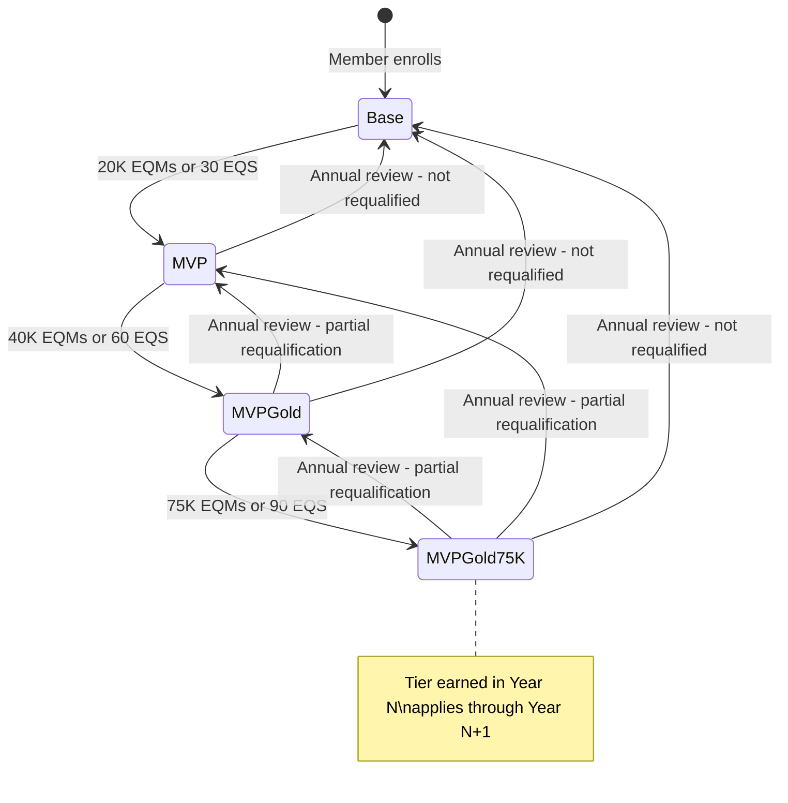
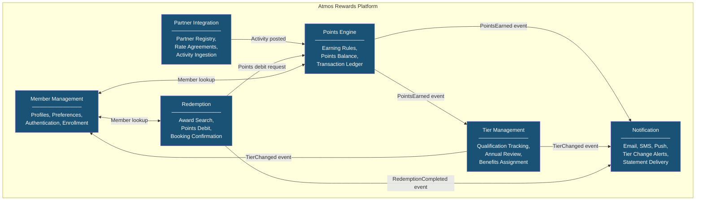
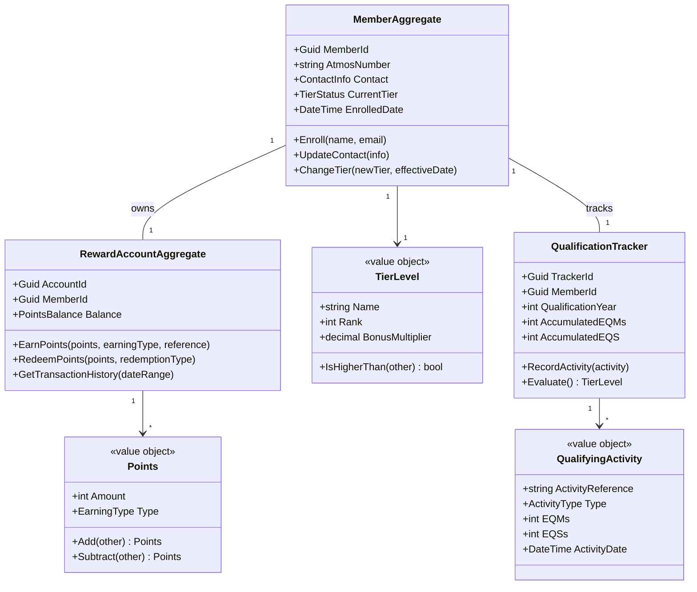
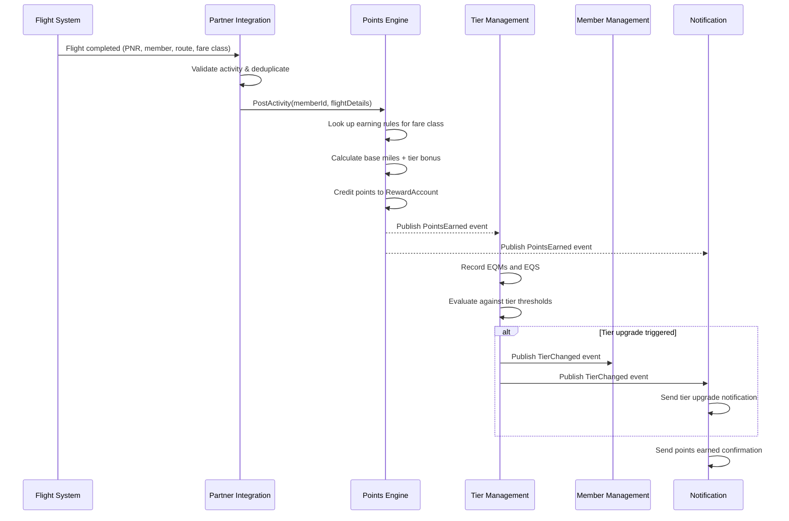
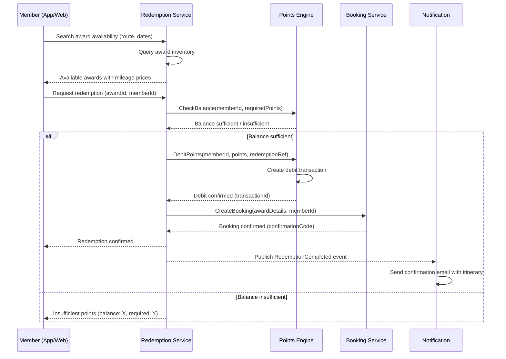

# Account Management & Loyalty Program Domain Knowledge

## Overview

Loyalty programs are the revenue backbone of modern airlines -- Alaska Airlines' Atmos Rewards program drives customer retention, ancillary revenue through co-branded credit cards, and partner network monetization. The Membership Atmos Rewards team owns the domain that manages member accounts, points earning and burning, tier qualification, partner integrations, and redemption workflows. This document covers the loyalty domain fundamentals, Domain-Driven Design modeling for the Atmos Rewards platform, key architectural flows, and data considerations relevant to the team's interview process.

**Domain objects used throughout:**

- `Member` -- a loyalty program member identified by a unique Atmos Rewards number
- `RewardAccount` -- the points ledger tied to a member
- `TierLevel` -- qualification tiers: `Base`, `Gold (MVP)`, `MVPGold`, `MVPGold75K`
- `QualifyingActivity` -- flights, segments, or spend that count toward tier status
- `PointsEngine` -- orchestrates earning across flight, partner, and credit card channels
- `TierEvaluationService` -- evaluates tier qualification during annual review and after qualifying activities

---

## 1. Loyalty Program Fundamentals

### Earn and Burn Model

Airlines operate loyalty programs on an **earn and burn** model:

- **Earn**: Members accumulate points (miles) through flights, partner spend, credit card purchases, and promotions.
- **Burn**: Members redeem points for award flights, upgrades, partner rewards, merchandise, or experiences.

The economic engine works because points are a **liability on the balance sheet** until redeemed, but the cost of fulfillment (an empty seat, a partner discount) is far below the revenue generated through the earning channels -- especially co-branded credit card programs, which are the single largest revenue source for most airline loyalty programs.

### Tier Programs

Tier programs reward frequent travelers with escalating benefits. Higher tiers receive priority boarding, complimentary upgrades, bonus earning rates, and lounge access. Tiers create **switching costs** that lock in high-value customers.

### Partner Networks

Loyalty programs extend their reach through partner networks:

| Partner Type | Examples | Earning Mechanism |
|---|---|---|
| **Airline alliances** | Oneworld partners (American, British Airways, Qantas) | Miles per qualifying mile flown |
| **Hotel partners** | Marriott, Hilton | Points per stay or per dollar |
| **Car rental** | Hertz, Avis | Points per rental |
| **Dining** | Alaska Airlines dining program | Points per dollar at participating restaurants |
| **Credit card** | Bank of America Alaska Airlines Visa | Miles per dollar spent |
| **Retail** | Alaska Airlines shopping portal | Miles per dollar at online retailers |

---

## 2. Alaska Airlines Atmos Rewards Specifics

### Tier Levels and Qualification

| Tier | Qualification Criteria | Key Benefits |
|---|---|---|
| **Base** | Enrollment (free) | Earn miles on flights and partners |
| **MVP (Gold)** | 20,000 EQMs or 30 EQS | 50% bonus miles, Priority Check-in, preferred boarding |
| **MVP Gold** | 40,000 EQMs or 60 EQS | 100% bonus miles, complimentary upgrades, 2 free bags |
| **MVP Gold 75K** | 75,000 EQMs or 90 EQS | 150% bonus miles, guaranteed upgrades (purchased), Gold Guest lounge access |

- **EQM** = Elite Qualifying Miles -- distance-based, earned on Alaska and partner flights.
- **EQS** = Elite Qualifying Segments -- one takeoff + one landing = one segment.
- Qualification period is the **calendar year** (Jan 1 -- Dec 31). Status earned applies to the following calendar year plus the remainder of the current year.

### Earning

- **Flights**: Miles earned based on fare class and distance. Premium fares earn higher multipliers.
- **Credit card**: 3 miles per dollar on Alaska purchases, 1 mile per dollar on all other purchases (Bank of America Alaska Airlines Visa Signature).
- **Partners**: Rates vary -- hotel stays typically earn 250-500 miles per stay, car rentals 50-500 miles per rental.
- **Bonus miles**: Elite members earn bonus miles on top of base earning (50%/100%/150% by tier).

### Redemption

- **Award flights**: Starting at 5,000 miles for short-haul, dynamic pricing based on demand.
- **Upgrades**: First-class upgrades on Alaska flights using miles or upgrade certificates.
- **Partner awards**: Redeem on Oneworld alliance partners using mileage charts.
- **Non-air rewards**: Hotel stays, car rentals, merchandise through the Alaska Airlines rewards shop.

### Tier Lifecycle



---

## 3. Domain-Driven Design for Loyalty

### Bounded Context Map

The loyalty platform decomposes into bounded contexts, each owning its domain logic and data. Communication between contexts happens through domain events and well-defined APIs.



### Aggregates

| Aggregate | Root Entity | Owned Entities / VOs | Invariants |
|---|---|---|---|
| **MemberAggregate** | `Member` | `ContactInfo`, `Preferences`, `TierStatus` | Member number is unique; tier transitions follow defined rules |
| **RewardAccountAggregate** | `RewardAccount` | `PointsBalance`, `Transaction`, `Points` | Balance must never go negative; every debit must have a matching transaction |
| **QualificationAggregate** | `QualificationTracker` | `QualifyingActivity`, `EQMBalance`, `EQSBalance` | Activities are idempotent (no double-counting); qualification only moves forward within a period |
| **PartnerAgreementAggregate** | `PartnerAgreement` | `EarningRate`, `PartnerCode` | Rates are effective-dated; only one active agreement per partner |

### Value Objects

- **Points**: Immutable, non-negative amount with an earning type (flight, partner, credit card, bonus).
- **TierLevel**: Enumeration with ordering (`Base < MVP < MVPGold < MVPGold75K`).
- **QualifyingActivity**: Flight segment or eligible spend with date, type, EQM/EQS values.
- **Money**: Currency + amount, used for fare-based earning calculations.
- **DateRange**: Start and end date for qualification periods and agreement effectivity.

### Domain Events

| Event | Published By | Consumed By | Payload |
|---|---|---|---|
| `MemberEnrolled` | Member Management | Points Engine, Notification | MemberId, EnrollmentDate |
| `ActivityPosted` | Partner Integration | Points Engine | MemberId, ActivityType, Amount, Date |
| `PointsEarned` | Points Engine | Tier Management, Notification | MemberId, Points, EarningType, TransactionId |
| `PointsRedeemed` | Points Engine | Notification | MemberId, Points, RedemptionType |
| `TierChanged` | Tier Management | Member Management, Notification | MemberId, OldTier, NewTier, EffectiveDate |
| `RedemptionCompleted` | Redemption | Notification, Points Engine | MemberId, RedemptionId, PointsDebited |
| `AnnualReviewCompleted` | Tier Management | Member Management, Notification | MemberId, NewTier, QualificationSummary |

### Aggregate Relationships (Class Diagram)



---

## 4. Key Domain Flows

### Flight Activity Posting to Points Earning to Tier Evaluation

This is the core flow: a member flies, the flight activity is posted, points are calculated and credited, and the tier qualification tracker is updated.



### Redemption Flow



### Annual Tier Re-evaluation

At the end of each calendar year, the Tier Management context evaluates every member's qualifying activity and assigns their tier for the next year.

```
Annual Review Process (batch job, runs Jan 1-3):

1. Query all members with active qualification trackers for the completed year.
2. For each member:
   a. Sum EQMs and EQS for the qualification year.
   b. Determine highest tier qualified for.
   c. Compare to current tier.
   d. If tier changes (up or down), publish TierChanged event.
   e. Reset qualification tracker for the new year.
3. Generate annual status summary for each member.
4. Trigger bulk notification dispatch.
```

---

## 5. C# Code Examples

### 5.1 Value Objects: Points and QualifyingActivity

```csharp
public enum EarningType
{
    Flight,
    Partner,
    CreditCard,
    Bonus,
    Promotion
}

public enum ActivityType
{
    FlightSegment,
    PartnerSpend,
    CreditCardSpend
}

/// <summary>
/// Represents an immutable points amount with an associated earning type.
/// </summary>
public sealed record Points
{
    public int Amount { get; }
    public EarningType Type { get; }

    public Points(int amount, EarningType type)
    {
        if (amount < 0)
            throw new ArgumentException("Points amount cannot be negative.", nameof(amount));

        Amount = amount;
        Type = type;
    }

    public Points Add(Points other)
    {
        if (other.Type != Type)
            throw new InvalidOperationException("Cannot add points of different earning types.");

        return new Points(Amount + other.Amount, Type);
    }

    public static Points operator +(Points a, Points b) => a.Add(b);
}

/// <summary>
/// Represents a qualifying activity that counts toward tier status.
/// </summary>
public sealed record QualifyingActivity
{
    public string ActivityReference { get; }
    public ActivityType Type { get; }
    public int EliteQualifyingMiles { get; }
    public int EliteQualifyingSegments { get; }
    public DateTime ActivityDate { get; }

    public QualifyingActivity(
        string activityReference,
        ActivityType type,
        int eqm,
        int eqs,
        DateTime activityDate)
    {
        if (string.IsNullOrWhiteSpace(activityReference))
            throw new ArgumentException("Activity reference is required.", nameof(activityReference));

        ActivityReference = activityReference;
        Type = type;
        EliteQualifyingMiles = eqm;
        EliteQualifyingSegments = eqs;
        ActivityDate = activityDate;
    }
}

/// <summary>
/// Represents tier levels with ordering and bonus multiplier configuration.
/// </summary>
public sealed record TierLevel : IComparable<TierLevel>
{
    public static readonly TierLevel Base = new("Base", 0, 0.0m);
    public static readonly TierLevel MVP = new("MVP", 1, 0.50m);
    public static readonly TierLevel MVPGold = new("MVP Gold", 2, 1.00m);
    public static readonly TierLevel MVPGold75K = new("MVP Gold 75K", 3, 1.50m);

    public string Name { get; }
    public int Rank { get; }
    public decimal BonusMultiplier { get; }

    private TierLevel(string name, int rank, decimal bonusMultiplier)
    {
        Name = name;
        Rank = rank;
        BonusMultiplier = bonusMultiplier;
    }

    public bool IsHigherThan(TierLevel other) => Rank > other.Rank;

    public int CompareTo(TierLevel? other) =>
        other is null ? 1 : Rank.CompareTo(other.Rank);

    public static TierLevel FromName(string name) => name switch
    {
        "Base" => Base,
        "MVP" => MVP,
        "MVP Gold" => MVPGold,
        "MVP Gold 75K" => MVPGold75K,
        _ => throw new ArgumentException($"Unknown tier level: {name}", nameof(name))
    };
}
```

### 5.2 Domain Events

```csharp
/// <summary>
/// Base class for all domain events in the Atmos Rewards system.
/// </summary>
public abstract record DomainEvent
{
    public Guid EventId { get; } = Guid.NewGuid();
    public DateTime OccurredAt { get; } = DateTime.UtcNow;
}

public sealed record PointsEarnedEvent(
    Guid MemberId,
    int PointsAmount,
    EarningType EarningType,
    Guid TransactionId,
    string Reference) : DomainEvent;

public sealed record PointsRedeemedEvent(
    Guid MemberId,
    int PointsAmount,
    string RedemptionType,
    Guid TransactionId) : DomainEvent;

public sealed record TierChangedEvent(
    Guid MemberId,
    TierLevel OldTier,
    TierLevel NewTier,
    DateTime EffectiveDate,
    string Reason) : DomainEvent;

public sealed record RedemptionCompletedEvent(
    Guid MemberId,
    Guid RedemptionId,
    int PointsDebited,
    string ConfirmationCode) : DomainEvent;

public sealed record AnnualReviewCompletedEvent(
    Guid MemberId,
    TierLevel NewTier,
    int TotalEQMs,
    int TotalEQS,
    int QualificationYear) : DomainEvent;
```

### 5.3 MemberAggregate with Earning and Redeeming Logic

```csharp
/// <summary>
/// Aggregate root for a loyalty program member, encapsulating account state and domain rules.
/// </summary>
public sealed class MemberAggregate
{
    private readonly List<DomainEvent> _domainEvents = new();
    private readonly List<Transaction> _transactions = new();

    public Guid MemberId { get; private set; }
    public string AtmosNumber { get; private set; } = string.Empty;
    public string FullName { get; private set; } = string.Empty;
    public TierLevel CurrentTier { get; private set; } = TierLevel.Base;
    public int PointsBalance { get; private set; }
    public DateTime EnrolledDate { get; private set; }
    public IReadOnlyList<DomainEvent> DomainEvents => _domainEvents.AsReadOnly();

    private MemberAggregate() { }

    public static MemberAggregate Enroll(string fullName, string email)
    {
        var member = new MemberAggregate
        {
            MemberId = Guid.NewGuid(),
            AtmosNumber = GenerateAtmosNumber(),
            FullName = fullName,
            CurrentTier = TierLevel.Base,
            PointsBalance = 0,
            EnrolledDate = DateTime.UtcNow
        };

        member._domainEvents.Add(new MemberEnrolledEvent(member.MemberId, member.AtmosNumber));
        return member;
    }

    /// <summary>
    /// Earns points for the member, applying tier bonus multiplier automatically.
    /// </summary>
    public void EarnPoints(int basePoints, EarningType earningType, string reference)
    {
        if (basePoints <= 0)
            throw new ArgumentException("Points to earn must be positive.", nameof(basePoints));

        var bonusPoints = (int)(basePoints * CurrentTier.BonusMultiplier);
        var totalPoints = basePoints + bonusPoints;

        PointsBalance += totalPoints;

        var transactionId = Guid.NewGuid();
        _transactions.Add(new Transaction(transactionId, totalPoints, earningType, reference, DateTime.UtcNow));

        _domainEvents.Add(new PointsEarnedEvent(
            MemberId, totalPoints, earningType, transactionId, reference));

        if (bonusPoints > 0)
        {
            _domainEvents.Add(new PointsEarnedEvent(
                MemberId, bonusPoints, EarningType.Bonus, Guid.NewGuid(),
                $"Tier bonus ({CurrentTier.Name}) on {reference}"));
        }
    }

    /// <summary>
    /// Redeems points from the member's balance, enforcing the non-negative invariant.
    /// </summary>
    public void RedeemPoints(int points, string redemptionType, string reference)
    {
        if (points <= 0)
            throw new ArgumentException("Points to redeem must be positive.", nameof(points));

        if (points > PointsBalance)
            throw new InsufficientPointsException(MemberId, PointsBalance, points);

        PointsBalance -= points;

        var transactionId = Guid.NewGuid();
        _transactions.Add(new Transaction(transactionId, -points, EarningType.Flight, reference, DateTime.UtcNow));

        _domainEvents.Add(new PointsRedeemedEvent(
            MemberId, points, redemptionType, transactionId));
    }

    /// <summary>
    /// Changes the member's tier level, recording the transition as a domain event.
    /// </summary>
    public void ChangeTier(TierLevel newTier, string reason)
    {
        if (newTier == CurrentTier) return;

        var oldTier = CurrentTier;
        CurrentTier = newTier;

        _domainEvents.Add(new TierChangedEvent(
            MemberId, oldTier, newTier, DateTime.UtcNow, reason));
    }

    public void ClearDomainEvents() => _domainEvents.Clear();

    private static string GenerateAtmosNumber() =>
        $"AR{DateTime.UtcNow:yyyyMMdd}{Random.Shared.Next(100000, 999999)}";
}

public sealed record Transaction(
    Guid TransactionId,
    int Points,
    EarningType Type,
    string Reference,
    DateTime Timestamp);

public sealed record MemberEnrolledEvent(
    Guid MemberId,
    string AtmosNumber) : DomainEvent;

public sealed class InsufficientPointsException : DomainException
{
    public InsufficientPointsException(Guid memberId, int balance, int requested)
        : base($"Member {memberId} has {balance} points but attempted to redeem {requested}.") { }
}

public abstract class DomainException : Exception
{
    protected DomainException(string message) : base(message) { }
}
```

### 5.4 TierEvaluationService with Qualification Rules

```csharp
/// <summary>
/// Evaluates a member's qualifying activities and determines their tier level.
/// </summary>
public sealed class TierEvaluationService
{
    private static readonly IReadOnlyList<TierQualificationRule> QualificationRules = new List<TierQualificationRule>
    {
        // Evaluated in descending order -- first match wins
        new(TierLevel.MVPGold75K, RequiredEQMs: 75_000, RequiredEQS: 90),
        new(TierLevel.MVPGold,    RequiredEQMs: 40_000, RequiredEQS: 60),
        new(TierLevel.MVP,        RequiredEQMs: 20_000, RequiredEQS: 30),
    };

    /// <summary>
    /// Evaluates a member's qualifying activity for a given year and returns the earned tier.
    /// </summary>
    public TierEvaluationResult Evaluate(
        Guid memberId,
        TierLevel currentTier,
        IReadOnlyList<QualifyingActivity> activities,
        int qualificationYear)
    {
        var totalEQMs = activities.Sum(a => a.EliteQualifyingMiles);
        var totalEQS = activities.Sum(a => a.EliteQualifyingSegments);

        var qualifiedTier = DetermineQualifiedTier(totalEQMs, totalEQS);

        return new TierEvaluationResult(
            MemberId: memberId,
            QualificationYear: qualificationYear,
            TotalEQMs: totalEQMs,
            TotalEQS: totalEQS,
            QualifiedTier: qualifiedTier,
            PreviousTier: currentTier,
            TierChanged: qualifiedTier != currentTier);
    }

    private static TierLevel DetermineQualifiedTier(int totalEQMs, int totalEQS)
    {
        foreach (var rule in QualificationRules)
        {
            // Member qualifies if they meet EITHER the EQM or EQS threshold
            if (totalEQMs >= rule.RequiredEQMs || totalEQS >= rule.RequiredEQS)
                return rule.Tier;
        }

        return TierLevel.Base;
    }

    /// <summary>
    /// Runs the annual tier review for a member and applies the tier change.
    /// </summary>
    public void RunAnnualReview(
        MemberAggregate member,
        IReadOnlyList<QualifyingActivity> activities,
        int qualificationYear)
    {
        var result = Evaluate(
            member.MemberId, member.CurrentTier, activities, qualificationYear);

        if (result.TierChanged)
        {
            var direction = result.QualifiedTier.IsHigherThan(result.PreviousTier)
                ? "upgrade" : "downgrade";
            member.ChangeTier(result.QualifiedTier,
                $"Annual review {qualificationYear}: {direction} based on {result.TotalEQMs} EQMs / {result.TotalEQS} EQS");
        }
    }
}

public sealed record TierQualificationRule(
    TierLevel Tier,
    int RequiredEQMs,
    int RequiredEQS);

public sealed record TierEvaluationResult(
    Guid MemberId,
    int QualificationYear,
    int TotalEQMs,
    int TotalEQS,
    TierLevel QualifiedTier,
    TierLevel PreviousTier,
    bool TierChanged);
```

### 5.5 PointsEngine Handling Different Earning Types

```csharp
/// <summary>
/// Orchestrates points earning across different channels with configurable earning rates.
/// </summary>
public sealed class PointsEngine
{
    private readonly IEarningRateRepository _earningRates;
    private readonly IMemberRepository _memberRepository;
    private readonly ILogger<PointsEngine> _logger;

    public PointsEngine(
        IEarningRateRepository earningRates,
        IMemberRepository memberRepository,
        ILogger<PointsEngine> logger)
    {
        _earningRates = earningRates;
        _memberRepository = memberRepository;
        _logger = logger;
    }

    /// <summary>
    /// Processes a flight activity and credits the appropriate miles to the member.
    /// </summary>
    public async Task<PointsEarningResult> ProcessFlightActivity(
        Guid memberId, FlightActivity flight, CancellationToken ct)
    {
        var member = await _memberRepository.GetByIdAsync(memberId, ct)
            ?? throw new MemberNotFoundException(memberId);

        var rate = await _earningRates.GetFlightRateAsync(flight.FareClass, ct);
        var baseMiles = (int)(flight.DistanceMiles * rate.MilesPerMile);

        member.EarnPoints(baseMiles, EarningType.Flight, $"Flight {flight.FlightNumber}");

        await _memberRepository.SaveAsync(member, ct);

        _logger.LogInformation(
            "Processed flight {FlightNumber} for member {MemberId}: {BaseMiles} base miles earned",
            flight.FlightNumber, memberId, baseMiles);

        return new PointsEarningResult(memberId, baseMiles, EarningType.Flight);
    }

    /// <summary>
    /// Processes a partner activity and credits miles based on the partner agreement.
    /// </summary>
    public async Task<PointsEarningResult> ProcessPartnerActivity(
        Guid memberId, PartnerActivity activity, CancellationToken ct)
    {
        var member = await _memberRepository.GetByIdAsync(memberId, ct)
            ?? throw new MemberNotFoundException(memberId);

        var rate = await _earningRates.GetPartnerRateAsync(activity.PartnerCode, ct);
        var baseMiles = CalculatePartnerMiles(activity, rate);

        member.EarnPoints(baseMiles, EarningType.Partner,
            $"Partner {activity.PartnerCode}: {activity.ActivityReference}");

        await _memberRepository.SaveAsync(member, ct);

        return new PointsEarningResult(memberId, baseMiles, EarningType.Partner);
    }

    /// <summary>
    /// Processes a credit card spend activity.
    /// </summary>
    public async Task<PointsEarningResult> ProcessCreditCardSpend(
        Guid memberId, CreditCardActivity activity, CancellationToken ct)
    {
        var member = await _memberRepository.GetByIdAsync(memberId, ct)
            ?? throw new MemberNotFoundException(memberId);

        var rate = activity.IsAlaskaPurchase ? 3 : 1; // 3x on Alaska, 1x on everything else
        var baseMiles = (int)(activity.SpendAmount * rate);

        member.EarnPoints(baseMiles, EarningType.CreditCard,
            $"Credit card spend: ${activity.SpendAmount:F2}");

        await _memberRepository.SaveAsync(member, ct);

        return new PointsEarningResult(memberId, baseMiles, EarningType.CreditCard);
    }

    private static int CalculatePartnerMiles(PartnerActivity activity, PartnerEarningRate rate) =>
        rate.EarningBasis switch
        {
            EarningBasis.PerDollar => (int)(activity.SpendAmount * rate.MilesPerUnit),
            EarningBasis.PerStay => (int)rate.MilesPerUnit,
            EarningBasis.PerRental => (int)rate.MilesPerUnit,
            _ => throw new ArgumentOutOfRangeException(nameof(rate.EarningBasis))
        };
}

public sealed record FlightActivity(
    string FlightNumber, string Origin, string Destination,
    int DistanceMiles, string FareClass, DateTime FlightDate);

public sealed record PartnerActivity(
    string PartnerCode, string ActivityReference,
    decimal SpendAmount, DateTime ActivityDate);

public sealed record CreditCardActivity(
    decimal SpendAmount, bool IsAlaskaPurchase, DateTime TransactionDate);

public sealed record PointsEarningResult(
    Guid MemberId, int PointsEarned, EarningType Type);

public sealed record PartnerEarningRate(
    string PartnerCode, decimal MilesPerUnit, EarningBasis EarningBasis);

public enum EarningBasis { PerDollar, PerStay, PerRental }

public sealed class MemberNotFoundException : DomainException
{
    public MemberNotFoundException(Guid memberId)
        : base($"Member {memberId} not found.") { }
}
```

---

## 6. Data Considerations

### Event Sourcing for Transaction History

The points ledger is a natural fit for event sourcing. Every points earning and redemption is an immutable event. The current balance is a projection (fold) over the event stream.

| Concern | Approach |
|---|---|
| **Rebuild balance** | Replay all `PointsEarned` and `PointsRedeemed` events from the event store |
| **Audit trail** | Event store is append-only -- full history is preserved automatically |
| **Snapshots** | Periodically snapshot the balance to avoid replaying the entire stream on every read |
| **Temporal queries** | "What was the member's balance on March 15?" -- replay events up to that date |
| **Correction** | Post a compensating event (never mutate or delete existing events) |

### Consistency Requirements

- **Points balance must never go negative**: This is a hard invariant enforced at the aggregate level. The `RedeemPoints` method checks balance before debiting. Under concurrent requests, use **optimistic concurrency** (version number on the aggregate) to prevent race conditions.
- **Idempotent activity posting**: Partner systems may retry. Each activity has a unique reference. The system deduplicates by checking if an activity reference has already been processed.
- **Tier transitions are deterministic**: Given the same set of qualifying activities, the evaluation always produces the same result.

### Read/Write Patterns

| Pattern | Details |
|---|---|
| **Tier lookups** | High-read, low-write. Tier changes happen at most a few times per year. Use a read-optimized projection or cache (Redis) with cache-aside. |
| **Points balance** | Moderate-read, moderate-write. Balance changes with every flight/purchase. Use CQRS -- write model is event-sourced, read model is a denormalized balance table. |
| **Transaction history** | Low-read (on-demand), append-only write. Stored in the event store; paginated read API. |
| **Qualification progress** | Medium-read (member checks status online), low-write (only on qualifying activities). Projected view updated on each `PointsEarned` event. |

### CQRS Separation

```
Write Side (Command):
  - MemberAggregate processes commands (EarnPoints, RedeemPoints, ChangeTier)
  - Events persisted to event store
  - Optimistic concurrency on aggregate version

Read Side (Query):
  - Denormalized projections in SQL/NoSQL
  - MemberDashboardView: balance, tier, recent transactions
  - TierProgressView: current EQMs, EQS, next tier threshold
  - TransactionHistoryView: paginated transaction list
  - Updated asynchronously via event handlers
```

---

## 7. Interview Questions

### Domain Knowledge

1. **Explain the earn and burn model.** How do airlines generate revenue from loyalty programs even though points represent a liability?
2. **Walk through what happens when a member flies from Seattle to Los Angeles.** Cover the full flow from flight completion to points posting to tier evaluation.
3. **A member has MVP Gold status and their EQMs reset on January 1. They had 35,000 EQMs last year. What happens to their tier?** Explain the annual review process and the concept of partial requalification.
4. **How would you handle a partner sending the same activity twice?** Discuss idempotency strategies and deduplication.
5. **Why do co-branded credit cards matter so much to airline loyalty economics?** Discuss the revenue model where banks pay airlines for miles.

### Domain-Driven Design

6. **Identify the bounded contexts for a loyalty platform and explain why you drew the boundaries where you did.** Discuss coupling, data ownership, and team alignment.
7. **What is the difference between an Entity and a Value Object in this domain?** Give examples using `Member` (entity) vs `Points` (value object).
8. **Why is `MemberAggregate` an aggregate root and not just an entity?** Discuss transactional boundaries and invariant enforcement.
9. **How would you model the relationship between Member Management and Points Engine?** Discuss context mapping patterns (shared kernel, customer-supplier, anti-corruption layer).
10. **What domain events would you publish when a member redeems miles for an award flight?** Walk through the event chain and which contexts consume each event.

### Architecture and Data

11. **Why is event sourcing a good fit for the points ledger?** Discuss auditability, temporal queries, and the ability to rebuild state.
12. **How do you prevent a member's points balance from going negative under concurrent requests?** Discuss optimistic concurrency, aggregate-level locking, and idempotency.
13. **The tier lookup API is called millions of times per day but tier changes are rare. How do you design for this?** Discuss caching strategies, CQRS read models, and cache invalidation on `TierChanged` events.
14. **How would you design the annual tier review batch process for millions of members?** Discuss partitioning, parallel processing, idempotency, and error handling.
15. **A member calls support saying they flew last week but their miles have not posted. How would you investigate this?** Discuss event store queries, partner integration logs, and the activity posting pipeline.

### Coding / Whiteboard

16. **Implement a `TierEvaluationService` that takes a list of qualifying activities and returns the member's tier.** Focus on clean domain logic, value objects, and testability.
17. **Write a `RedeemPoints` method that enforces the non-negative balance invariant and publishes the appropriate domain event.** Discuss what happens if two redemptions arrive concurrently.
18. **Design the `PointsEngine.ProcessFlightActivity` method.** Handle fare class lookup, base mile calculation, tier bonus application, and event publishing.
19. **Model the `QualifyingActivity` value object.** What properties does it need? How do you ensure immutability and equality semantics in C#?
20. **Write a projection handler that updates a read-model `MemberDashboard` table whenever a `PointsEarned` or `TierChanged` event is published.**
