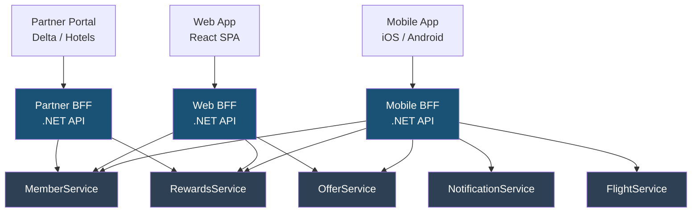
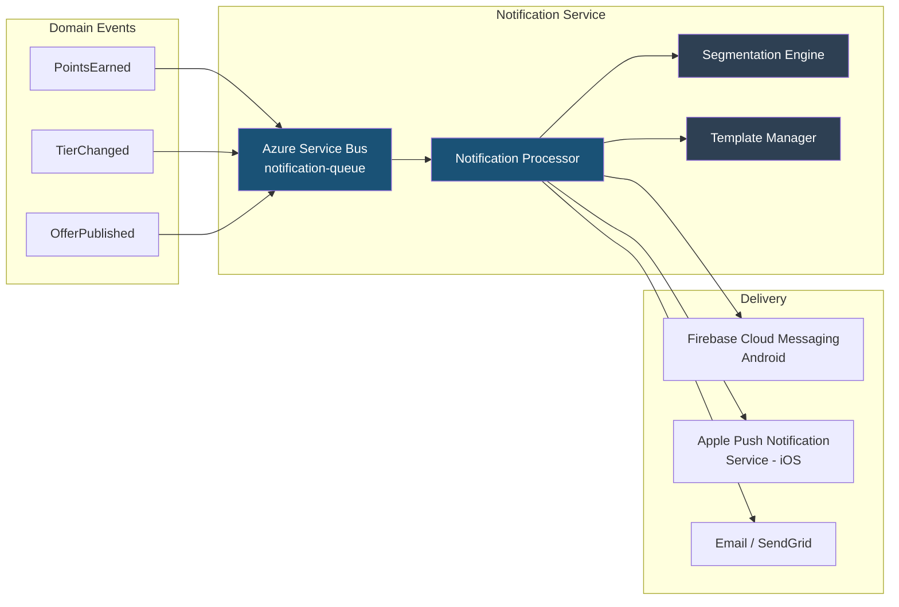
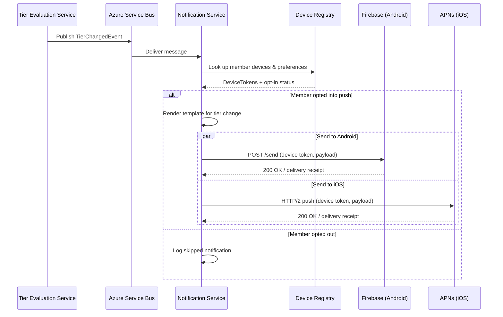
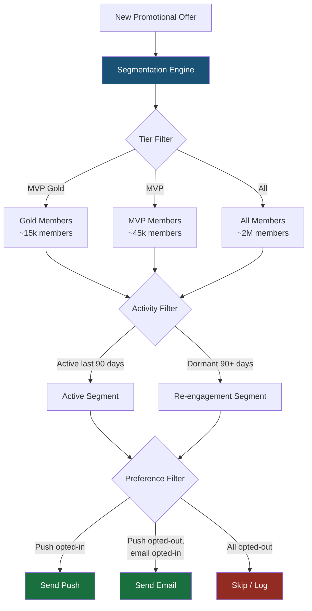
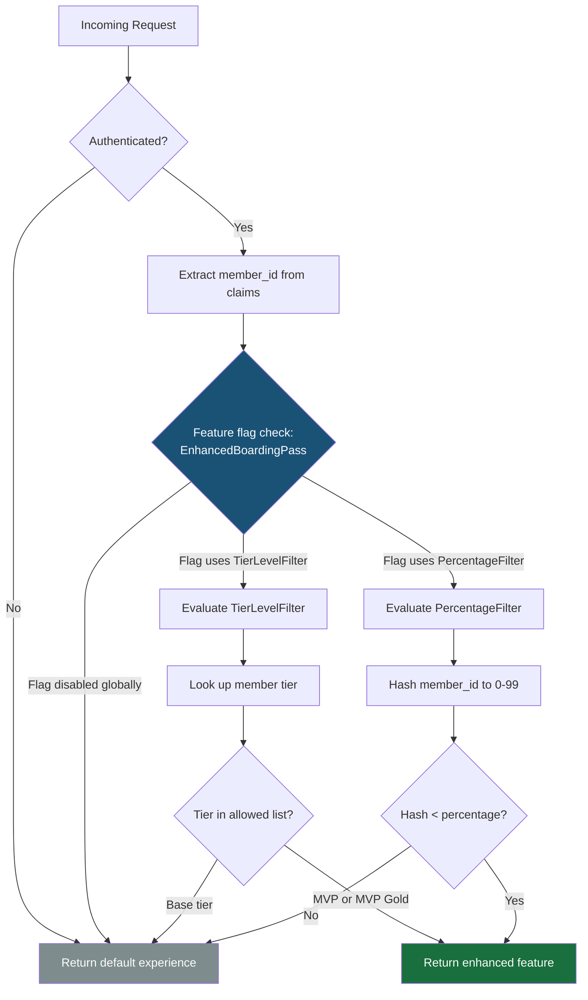
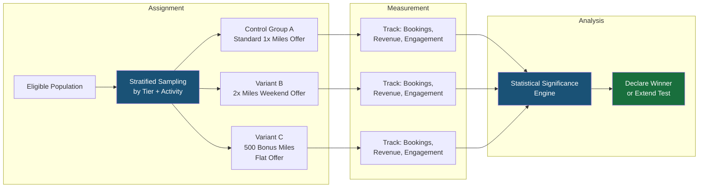

# App-Exclusive Features and Backend-for-Frontend Pattern

## Overview

Modern loyalty programs live or die by their mobile experience. Alaska Airlines Atmos Rewards members expect fast, personalized, and context-aware interactions on their devices -- from real-time points tracking to location-based lounge access offers. The Backend-for-Frontend (BFF) pattern enables dedicated API layers tailored to each client type (mobile, web, partner), while push notifications, feature flags, and A/B testing provide the mechanisms for targeted engagement and controlled rollouts.

This document covers the architecture and implementation of app-exclusive features for the Atmos Rewards platform: BFF design, push notification infrastructure, feature flag strategies, mobile-optimized experiences, and experimentation frameworks.

---

## 1. Backend-for-Frontend (BFF) Pattern

### Why BFF

Different clients have fundamentally different needs. A mobile app requires compact payloads, offline-friendly data shapes, and push notification registration. A web SPA needs rich HTML-friendly structures and SEO metadata. A partner API requires stable, versioned contracts with API key authentication. A single general-purpose API that tries to serve all three becomes bloated and hard to evolve.

The BFF pattern assigns each client type its own backend layer that aggregates, transforms, and optimizes responses from downstream microservices.

### BFF per client type architecture



### BFF responsibilities

| Responsibility | Example |
|---|---|
| **Aggregation** | Combine member profile, points balance, and offers into a single mobile dashboard response |
| **Shape optimization** | Return compact JSON for mobile, richer payloads for web |
| **Client-specific auth** | Mobile uses OAuth2 + device tokens; partner uses API keys |
| **Caching strategy** | Mobile BFF caches aggressively for offline support; web BFF uses shorter TTLs |
| **Rate limiting** | Different rate limits per client type |
| **Protocol adaptation** | Mobile BFF may expose GraphQL; partner BFF stays REST |

### GraphQL vs REST for BFF

| Factor | REST | GraphQL |
|---|---|---|
| **Mobile battery / bandwidth** | Multiple round-trips or over-fetching | Single request, client picks fields |
| **Versioning** | URL or header versioning | Schema evolution, deprecated fields |
| **Caching** | HTTP caching is straightforward | Requires persisted queries or CDN integration |
| **Tooling** | Mature ecosystem | Requires Hot Chocolate or similar library in .NET |
| **When to choose** | Partner BFF (stable contracts) | Mobile BFF (flexible, evolving UI) |

### BFF controller aggregating member dashboard

This controller demonstrates the core BFF pattern: calling multiple downstream services in parallel and assembling a mobile-optimized response.

```csharp
[ApiController]
[Route("api/mobile/v1/[controller]")]
public class DashboardController : ControllerBase
{
    private readonly IMemberServiceClient _memberClient;
    private readonly IRewardsServiceClient _rewardsClient;
    private readonly IOfferServiceClient _offerClient;

    public DashboardController(
        IMemberServiceClient memberClient,
        IRewardsServiceClient rewardsClient,
        IOfferServiceClient offerClient)
    {
        _memberClient = memberClient;
        _rewardsClient = rewardsClient;
        _offerClient = offerClient;
    }

    /// <summary>
    /// Aggregates member profile, recent transactions, and personalized offers into a single mobile dashboard response.
    /// </summary>
    [HttpGet("{memberId}")]
    public async Task<ActionResult<MobileDashboardResponse>> GetDashboard(
        string memberId,
        CancellationToken ct)
    {
        // Fan out to downstream services in parallel.
        var profileTask = _memberClient.GetProfileAsync(memberId, ct);
        var transactionsTask = _rewardsClient.GetRecentTransactionsAsync(memberId, limit: 5, ct);
        var offersTask = _offerClient.GetPersonalizedOffersAsync(memberId, maxOffers: 3, ct);

        await Task.WhenAll(profileTask, transactionsTask, offersTask);

        var profile = profileTask.Result;
        var transactions = transactionsTask.Result;
        var offers = offersTask.Result;

        // Shape the response for mobile consumption.
        var response = new MobileDashboardResponse
        {
            MemberId = profile.MemberId,
            DisplayName = profile.FirstName,
            TierStatus = profile.CurrentTier.ToString(),
            PointsBalance = profile.PointsBalance,
            MilesUntilNextTier = profile.MilesUntilNextTier,
            TierProgressPercent = CalculateTierProgress(profile),
            RecentActivity = transactions.Select(t => new ActivitySummary
            {
                Description = t.Description,
                Points = t.PointsEarned,
                Date = t.TransactionDate.ToString("MMM dd"),
                IconType = MapActivityIcon(t.Type)
            }).ToList(),
            TopOffers = offers.Select(o => new OfferCard
            {
                Title = o.Headline,
                BonusPoints = o.BonusPoints,
                ExpiresIn = FormatExpiry(o.ExpirationDate),
                DeepLink = o.MobileDeepLink
            }).ToList()
        };

        return Ok(response);
    }

    private static int CalculateTierProgress(MemberProfile profile)
    {
        if (profile.MilesRequiredForNextTier == 0) return 100;
        var earned = profile.MilesRequiredForNextTier - profile.MilesUntilNextTier;
        return (int)((double)earned / profile.MilesRequiredForNextTier * 100);
    }

    private static string MapActivityIcon(TransactionType type) => type switch
    {
        TransactionType.Flight => "airplane",
        TransactionType.PartnerPurchase => "shopping",
        TransactionType.CreditCard => "card",
        TransactionType.Redemption => "gift",
        _ => "star"
    };

    private static string FormatExpiry(DateTimeOffset expiration)
    {
        var days = (expiration - DateTimeOffset.UtcNow).Days;
        return days switch
        {
            <= 0 => "Expires today",
            1 => "1 day left",
            _ => $"{days} days left"
        };
    }
}
```

### Mobile-optimized response shapes

The response DTOs are designed to be compact and ready-to-render by the mobile UI without further transformation.

```csharp
public record MobileDashboardResponse
{
    public string MemberId { get; init; } = string.Empty;
    public string DisplayName { get; init; } = string.Empty;
    public string TierStatus { get; init; } = string.Empty;
    public long PointsBalance { get; init; }
    public int MilesUntilNextTier { get; init; }
    public int TierProgressPercent { get; init; }
    public List<ActivitySummary> RecentActivity { get; init; } = [];
    public List<OfferCard> TopOffers { get; init; } = [];
}

public record ActivitySummary
{
    public string Description { get; init; } = string.Empty;
    public int Points { get; init; }
    public string Date { get; init; } = string.Empty;
    public string IconType { get; init; } = string.Empty;
}

public record OfferCard
{
    public string Title { get; init; } = string.Empty;
    public int BonusPoints { get; init; }
    public string ExpiresIn { get; init; } = string.Empty;
    public string DeepLink { get; init; } = string.Empty;
}
```

---

## 2. Push Notifications

### Architecture

The notification pipeline starts with domain events from backend services, routes through a central notification service, and fans out to platform-specific delivery channels.



### Notification types

| Type | Trigger | Example | Priority |
|---|---|---|---|
| **Transactional** | Points earned, redemption confirmed | "You earned 1,250 miles on your SEA-LAX flight" | High |
| **Status** | Tier change, annual qualification reset | "Congratulations! You've reached MVP Gold status" | High |
| **Promotional** | Bonus offer published, partner deal | "Earn 3x miles on dining this weekend" | Normal |
| **Operational** | Flight delay, gate change | "Gate changed to B12 for AS123" | Urgent |

### Push notification flow for tier change



### Notification service with FCM integration

```csharp
public class PushNotificationService : IPushNotificationService
{
    private readonly FirebaseMessaging _firebaseMessaging;
    private readonly IDeviceRegistryRepository _deviceRegistry;
    private readonly INotificationTemplateEngine _templateEngine;
    private readonly ILogger<PushNotificationService> _logger;

    public PushNotificationService(
        FirebaseMessaging firebaseMessaging,
        IDeviceRegistryRepository deviceRegistry,
        INotificationTemplateEngine templateEngine,
        ILogger<PushNotificationService> logger)
    {
        _firebaseMessaging = firebaseMessaging;
        _deviceRegistry = deviceRegistry;
        _templateEngine = templateEngine;
        _logger = logger;
    }

    /// <summary>
    /// Sends a tier change push notification to all registered devices for a member.
    /// </summary>
    public async Task SendTierChangeNotificationAsync(
        TierChangedEvent tierEvent,
        CancellationToken ct)
    {
        var devices = await _deviceRegistry
            .GetActiveDevicesAsync(tierEvent.MemberId, ct);

        if (devices.Count == 0)
        {
            _logger.LogInformation(
                "No registered devices for member {MemberId}, skipping push",
                tierEvent.MemberId);
            return;
        }

        var template = _templateEngine.Render("tier-change", new
        {
            MemberName = tierEvent.MemberFirstName,
            OldTier = tierEvent.PreviousTier.ToString(),
            NewTier = tierEvent.NewTier.ToString(),
            BenefitHighlight = GetTopBenefit(tierEvent.NewTier)
        });

        var tasks = devices.Select(device => SendToDeviceAsync(device, template, tierEvent, ct));
        await Task.WhenAll(tasks);
    }

    private async Task SendToDeviceAsync(
        DeviceRegistration device,
        NotificationContent content,
        TierChangedEvent tierEvent,
        CancellationToken ct)
    {
        try
        {
            var message = new Message
            {
                Token = device.PushToken,
                Notification = new Notification
                {
                    Title = content.Title,
                    Body = content.Body,
                    ImageUrl = content.ImageUrl
                },
                Data = new Dictionary<string, string>
                {
                    ["type"] = "tier_change",
                    ["memberId"] = tierEvent.MemberId,
                    ["newTier"] = tierEvent.NewTier.ToString(),
                    ["deepLink"] = "alaska://rewards/tier-status"
                },
                Android = new AndroidConfig
                {
                    Priority = Priority.High,
                    Notification = new AndroidNotification
                    {
                        ChannelId = "tier_updates",
                        Icon = "ic_tier_badge"
                    }
                },
                Apns = new ApnsConfig
                {
                    Aps = new Aps
                    {
                        Badge = 1,
                        Sound = "tier_upgrade.aiff",
                        Category = "TIER_CHANGE"
                    }
                }
            };

            var response = await _firebaseMessaging.SendAsync(message, ct);
            _logger.LogInformation(
                "Push sent to device {DeviceId} for member {MemberId}: {Response}",
                device.DeviceId, tierEvent.MemberId, response);
        }
        catch (FirebaseMessagingException ex) when (ex.MessagingErrorCode ==
            MessagingErrorCode.Unregistered)
        {
            _logger.LogWarning(
                "Device {DeviceId} is unregistered, removing from registry",
                device.DeviceId);
            await _deviceRegistry.RemoveDeviceAsync(device.DeviceId, ct);
        }
    }

    private static string GetTopBenefit(TierLevel tier) => tier switch
    {
        TierLevel.MvpGold => "Enjoy complimentary upgrades and Alaska Lounge access",
        TierLevel.Mvp => "Priority boarding and bonus miles on every flight",
        TierLevel.Base => "Start earning miles toward your next reward",
        _ => "Explore your new tier benefits"
    };
}
```

### Segmentation for targeted notifications



---

## 3. Feature Flags

### Why feature flags

Feature flags decouple deployment from release. Code ships to production behind a flag and is turned on when the team is ready, for a specific audience, or as part of an experiment.

| Pattern | Purpose | Lifetime | Example |
|---|---|---|---|
| **Release toggle** | Ship incomplete feature safely | Short (days to weeks) | New boarding pass UI |
| **Experiment toggle** | A/B test variants | Medium (weeks) | Different points-earning display |
| **Ops toggle** | Circuit breaker / kill switch | Long-lived | Disable partner API integration |
| **Permission toggle** | Entitlement gate | Long-lived | MVP Gold exclusive features |

### Microsoft.FeatureManagement integration

The `Microsoft.FeatureManagement` library integrates directly with ASP.NET Core configuration and dependency injection.

```csharp
// Program.cs registration
builder.Services.AddFeatureManagement()
    .AddFeatureFilter<PercentageFilter>()
    .AddFeatureFilter<TierLevelFilter>()
    .AddFeatureFilter<RegionFilter>();

// appsettings.json
// {
//   "FeatureManagement": {
//     "EnhancedBoardingPass": {
//       "EnabledFor": [
//         {
//           "Name": "TierLevel",
//           "Parameters": {
//             "AllowedTiers": ["Mvp", "MvpGold"]
//           }
//         }
//       ]
//     },
//     "NewPointsDisplay": {
//       "EnabledFor": [
//         {
//           "Name": "Percentage",
//           "Parameters": {
//             "Value": 25
//           }
//         }
//       ]
//     },
//     "PartnerApiV2": true
//   }
// }
```

### Custom TierLevelFilter

This filter enables features only for members at or above a specific loyalty tier. It reads the member's tier from the current HTTP context and checks it against the allowed tiers configured in appsettings.

```csharp
[FilterAlias("TierLevel")]
public class TierLevelFilter : IFeatureFilter
{
    private readonly IHttpContextAccessor _httpContextAccessor;
    private readonly IMemberServiceClient _memberClient;

    public TierLevelFilter(
        IHttpContextAccessor httpContextAccessor,
        IMemberServiceClient memberClient)
    {
        _httpContextAccessor = httpContextAccessor;
        _memberClient = memberClient;
    }

    /// <summary>
    /// Evaluates whether the current member's tier is in the allowed tiers list.
    /// </summary>
    public async Task<bool> EvaluateAsync(FeatureFilterEvaluationContext context)
    {
        var settings = context.Parameters.Get<TierLevelFilterSettings>();

        if (settings?.AllowedTiers == null || settings.AllowedTiers.Length == 0)
            return false;

        var httpContext = _httpContextAccessor.HttpContext;
        if (httpContext == null) return false;

        var memberId = httpContext.User.FindFirst("member_id")?.Value;
        if (string.IsNullOrEmpty(memberId)) return false;

        var profile = await _memberClient.GetProfileAsync(memberId, CancellationToken.None);

        return settings.AllowedTiers.Contains(profile.CurrentTier.ToString());
    }
}

public class TierLevelFilterSettings
{
    public string[] AllowedTiers { get; set; } = [];
}
```

### Feature flag decision flow



### Using feature flags in controllers

```csharp
[ApiController]
[Route("api/mobile/v1/[controller]")]
public class BoardingPassController : ControllerBase
{
    private readonly IFeatureManager _featureManager;
    private readonly IBoardingPassService _boardingPassService;

    public BoardingPassController(
        IFeatureManager featureManager,
        IBoardingPassService boardingPassService)
    {
        _featureManager = featureManager;
        _boardingPassService = boardingPassService;
    }

    /// <summary>
    /// Returns the boarding pass with enhanced or standard layout based on feature flag evaluation.
    /// </summary>
    [HttpGet("{bookingReference}")]
    public async Task<IActionResult> GetBoardingPass(string bookingReference)
    {
        var memberId = User.FindFirst("member_id")?.Value
            ?? throw new UnauthorizedAccessException("Member ID claim missing");

        var pass = await _boardingPassService.GetBoardingPassAsync(
            memberId, bookingReference);

        if (await _featureManager.IsEnabledAsync("EnhancedBoardingPass"))
        {
            return Ok(new EnhancedBoardingPassResponse
            {
                BookingReference = pass.BookingReference,
                QrCodeData = pass.QrCodeBase64,
                FlightNumber = pass.FlightNumber,
                DepartureGate = pass.Gate,
                DepartureTime = pass.DepartureTime,
                SeatNumber = pass.Seat,
                BoardingGroup = pass.BoardingGroup,
                // Enhanced fields available only behind feature flag.
                MilesEarned = pass.EstimatedMilesEarned,
                LoungeAccess = pass.HasLoungeAccess,
                UpgradeAvailable = pass.UpgradeEligible,
                WalletDeepLink = $"alaska://wallet/add/{pass.BookingReference}"
            });
        }

        return Ok(new StandardBoardingPassResponse
        {
            BookingReference = pass.BookingReference,
            QrCodeData = pass.QrCodeBase64,
            FlightNumber = pass.FlightNumber,
            DepartureGate = pass.Gate,
            DepartureTime = pass.DepartureTime,
            SeatNumber = pass.Seat,
            BoardingGroup = pass.BoardingGroup
        });
    }
}
```

---

## 4. App-Exclusive Features for Loyalty

### Digital wallet and boarding pass integration

The mobile app integrates with Apple Wallet and Google Wallet to provide boarding passes, loyalty cards, and offer coupons as native wallet passes. The BFF generates signed `.pkpass` (Apple) or JWT-based save objects (Google) on demand.

### Real-time flight status with points tracking

The mobile BFF combines flight status data with loyalty calculations to show members how many miles they will earn on the current flight, updated in real time as flight details change (equipment swap, route change).

### Location-based offers

When a member is at an airport, the app can surface contextual offers: lounge access for MVP Gold members, dining bonus mile offers, or upgrade opportunities at the gate. This requires a combination of geofencing, member tier lookup, and offer eligibility checks.

### App-exclusive endpoint example

This endpoint returns location-aware offers that are only available through the mobile app. It combines geolocation data with member tier and feature flag evaluation.

```csharp
[ApiController]
[Route("api/mobile/v1/[controller]")]
public class LocationOffersController : ControllerBase
{
    private readonly IOfferServiceClient _offerClient;
    private readonly IMemberServiceClient _memberClient;
    private readonly IFeatureManager _featureManager;
    private readonly ILogger<LocationOffersController> _logger;

    public LocationOffersController(
        IOfferServiceClient offerClient,
        IMemberServiceClient memberClient,
        IFeatureManager featureManager,
        ILogger<LocationOffersController> logger)
    {
        _offerClient = offerClient;
        _memberClient = memberClient;
        _featureManager = featureManager;
        _logger = logger;
    }

    /// <summary>
    /// Returns location-aware, tier-gated offers available exclusively through the mobile app.
    /// </summary>
    [HttpGet]
    public async Task<ActionResult<LocationOffersResponse>> GetNearbyOffers(
        [FromQuery] double latitude,
        [FromQuery] double longitude,
        CancellationToken ct)
    {
        var memberId = User.FindFirst("member_id")?.Value
            ?? throw new UnauthorizedAccessException("Member ID claim missing");

        var profile = await _memberClient.GetProfileAsync(memberId, ct);

        var offers = await _offerClient.GetLocationOffersAsync(
            latitude, longitude, radiusMiles: 5, ct);

        // Filter offers by tier eligibility.
        var eligible = offers
            .Where(o => o.MinimumTier <= profile.CurrentTier)
            .Select(o => new LocationOfferCard
            {
                OfferId = o.OfferId,
                Title = o.Title,
                Description = o.Description,
                BonusMiles = o.BonusMiles,
                VenueName = o.VenueName,
                DistanceFeet = o.DistanceFromMember,
                ExpiresAt = o.ExpirationDate,
                RequiresActivation = o.RequiresOptIn,
                ActivationDeepLink = $"alaska://offers/activate/{o.OfferId}"
            })
            .ToList();

        // MVP Gold+ members get lounge access offers when near an Alaska Lounge.
        if (profile.CurrentTier >= TierLevel.MvpGold &&
            await _featureManager.IsEnabledAsync("LoungeAccessOffers"))
        {
            var loungeOffer = await _offerClient.GetLoungeOfferAsync(
                latitude, longitude, ct);
            if (loungeOffer != null)
            {
                eligible.Insert(0, new LocationOfferCard
                {
                    OfferId = loungeOffer.OfferId,
                    Title = "Alaska Lounge Access",
                    Description = "Your MVP Gold status includes complimentary lounge access",
                    BonusMiles = 0,
                    VenueName = loungeOffer.LoungeName,
                    DistanceFeet = loungeOffer.DistanceFromMember,
                    IsPremium = true,
                    ActivationDeepLink = $"alaska://lounge/checkin/{loungeOffer.LoungeId}"
                });
            }
        }

        return Ok(new LocationOffersResponse
        {
            MemberTier = profile.CurrentTier.ToString(),
            Offers = eligible,
            LastUpdatedUtc = DateTimeOffset.UtcNow
        });
    }
}
```

### Offline mode considerations

| Concern | Strategy |
|---|---|
| **Boarding pass** | Cache the `.pkpass` / wallet object locally; QR code works offline |
| **Points balance** | Cache last known balance; show "as of" timestamp |
| **Offers** | Pre-fetch and cache eligible offers when connected |
| **Flight status** | Use platform push notifications for updates even when app is backgrounded |
| **Sync conflict** | Use last-write-wins for preference changes; queue offer activations for retry |

---

## 5. A/B Testing and Experimentation

### Experiment design for reward offers

A/B testing in a loyalty app must account for member tier distribution, activity level, and seasonal travel patterns. Naive random assignment can skew results if one group has disproportionately more MVP Gold members.



### Experiment tracking

The experimentation framework assigns members to variants using a deterministic hash (so the same member always sees the same variant) and logs exposures for analysis.

| Metric | What it measures | Why it matters |
|---|---|---|
| **Booking conversion rate** | % of members who book after seeing the offer | Direct revenue impact |
| **Incremental miles earned** | Additional miles earned vs control | Engagement lift |
| **Offer activation rate** | % of members who opt in to the offer | Offer attractiveness |
| **Revenue per member** | Average revenue in test period | ROI of the promotion |
| **Tier advancement rate** | % of members who advance a tier during test | Long-term loyalty impact |

### Guardrails

- **Minimum sample size**: Calculate required sample size before starting; do not peek at results early.
- **Holdout group**: Always maintain a no-treatment control to measure incremental impact.
- **Kill switch**: Use an ops feature flag to disable an experiment immediately if negative impact is detected.
- **Mutual exclusion**: Members in one experiment should not be simultaneously enrolled in conflicting experiments for the same surface.

---

## Interview Questions

### Backend-for-Frontend

1. **Why would you choose a BFF over a single general-purpose API?** Different clients have different payload, authentication, and performance needs. A BFF lets each client evolve independently without compromising others.

2. **How do you avoid duplicating business logic across multiple BFFs?** Business logic stays in the downstream microservices. BFFs only handle aggregation, shaping, and client-specific concerns. Shared client libraries or a shared SDK can reduce boilerplate.

3. **What are the downsides of the BFF pattern?** More services to deploy and monitor. Risk of BFF becoming a "kitchen sink" if boundaries are not enforced. Requires discipline to keep BFFs thin.

4. **When would you use GraphQL in a BFF vs REST?** GraphQL is useful for mobile BFFs where the UI changes frequently and clients benefit from selecting exactly the fields they need. REST is better for partner BFFs that need stable, versioned contracts and straightforward HTTP caching.

### Push Notifications

5. **How do you handle a device token that becomes invalid?** Catch the `Unregistered` error from FCM/APNs and remove the token from the device registry. Periodically audit the registry for stale tokens.

6. **How do you prevent notification fatigue?** Implement frequency caps (e.g., max 3 promotional pushes per week), respect quiet hours, honor member preferences, and let members choose notification categories.

7. **How would you design the notification system for high throughput during a flash promotion?** Use a message queue (Azure Service Bus) to decouple event production from notification delivery. The notification service consumes from the queue at its own pace, with autoscaling based on queue depth.

### Feature Flags

8. **What is the difference between a release toggle and an experiment toggle?** A release toggle gates an incomplete or untested feature and is removed after rollout. An experiment toggle gates A/B test variants and is removed after the experiment concludes and a winner is chosen.

9. **How do you prevent feature flag tech debt?** Set expiration dates on flags. Track flags in a registry with owners. Remove flags in the sprint after full rollout. Use naming conventions that indicate intent (e.g., `release_`, `experiment_`, `ops_`).

10. **How does the TierLevelFilter work, and what happens if the MemberService is down?** The filter reads the member's tier from MemberService. If the service is unavailable, the filter should fail closed (return `false`), falling back to the default experience. Caching the member's tier with a short TTL can reduce this risk.

### App-Exclusive Features

11. **How would you implement offline boarding pass access?** Generate the boarding pass (QR code and flight details) when the member is online and cache it locally on the device. The QR code is self-contained and does not require a network connection to be scanned at the gate.

12. **What considerations apply to location-based offers in a mobile app?** Battery consumption from GPS, user privacy and consent, geofence accuracy, and graceful degradation when location services are unavailable.

### A/B Testing

13. **Why use stratified sampling instead of pure random assignment?** Loyalty programs have highly skewed populations. Without stratification, one test group might end up with more MVP Gold members (who spend more), biasing the results.

14. **How do you avoid the peeking problem in A/B tests?** Pre-register the sample size and duration. Use sequential testing methods if early stopping is needed. Do not make decisions based on intermediate results without statistical correction.

15. **How would you measure whether an app-exclusive feature actually drives loyalty?** Compare engagement and tier advancement rates between app users and non-app users using a quasi-experimental design (propensity score matching), since true randomization is not possible when the treatment is "using the app."
