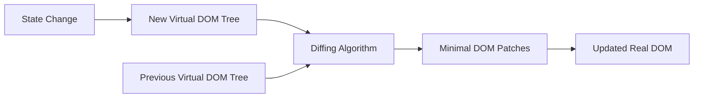
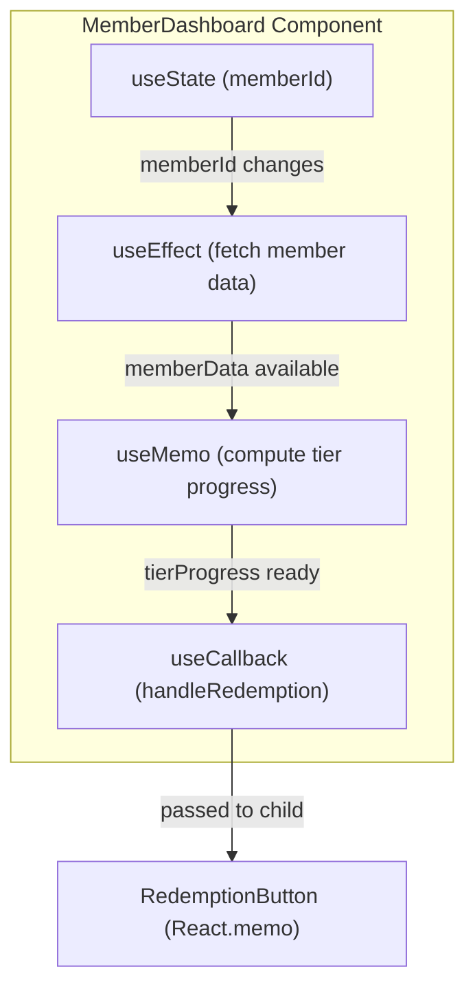
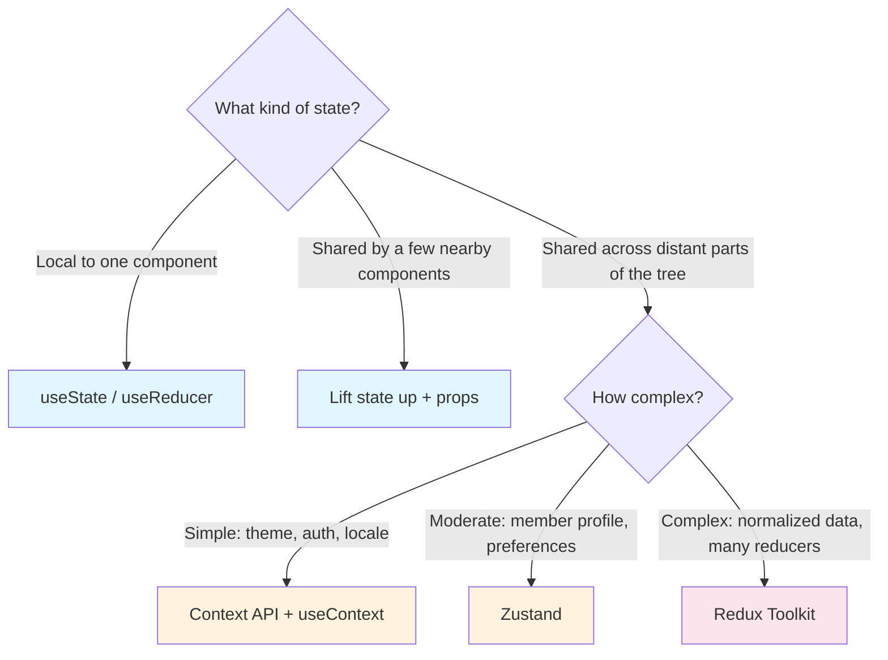
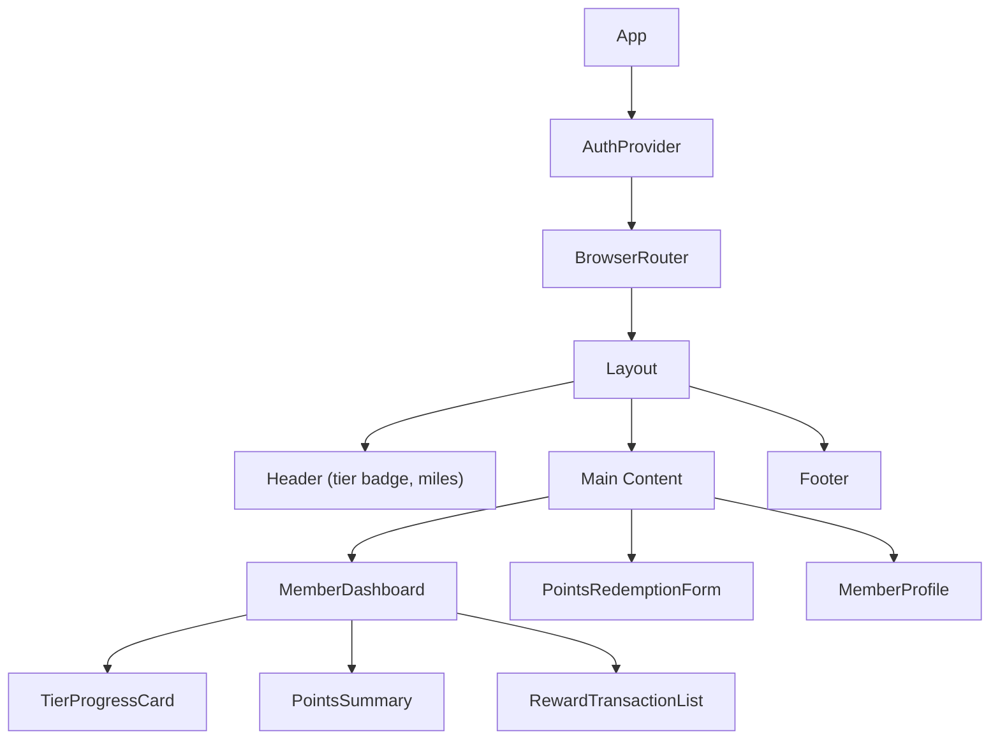
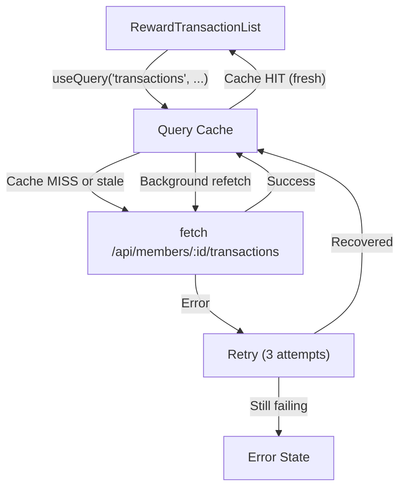

# React Frontend Development

## Overview

This document covers React frontend development concepts essential for building the member-facing UI of a loyalty rewards program like Alaska Airlines Atmos Rewards. Topics range from React fundamentals and hooks through state management, component patterns, data fetching, routing, forms, and performance optimization. All code examples use TypeScript and JSX with the Atmos Rewards domain: members, reward transactions, tier levels (Gold, MVP, MVP Gold 75K), and points balances.

---

## 1. React Fundamentals

### JSX and the Virtual DOM

JSX is a syntax extension that lets you write HTML-like markup inside TypeScript. Under the hood, JSX compiles to `React.createElement` calls that produce a tree of plain JavaScript objects called the virtual DOM.

When state changes, React builds a new virtual DOM tree and compares it to the previous one using a process called **reconciliation**. Only the differences (the minimal set of DOM mutations) are applied to the real DOM.



**Key reconciliation rules:**

- Elements of different types produce different trees (React tears down the old tree and builds a new one).
- The developer can hint at which child elements are stable across renders with the `key` prop.
- React processes the tree top-down. If a parent changes type, all children are unmounted and remounted.

### Component Types

| Type | Syntax | State | Lifecycle | Use Case |
|---|---|---|---|---|
| **Function component** | `function MemberCard() {}` | Via hooks | Via hooks | Default choice for all new code |
| **Class component** | `class MemberCard extends Component {}` | `this.state` | `componentDidMount`, etc. | Legacy codebases |

Function components with hooks are the standard in modern React. Class components still appear in older codebases but are not recommended for new development.

---

## 2. Hooks

Hooks let function components use state, side effects, context, and other React features. They must be called at the top level of a component (not inside loops, conditions, or nested functions).

### Core Hooks at a Glance

| Hook | Purpose | When to Use |
|---|---|---|
| `useState` | Local component state | Simple values: toggles, form inputs, counters |
| `useEffect` | Side effects after render | API calls, subscriptions, DOM mutations |
| `useContext` | Read from a React context | Theme, auth, locale shared across the tree |
| `useReducer` | State with complex transitions | State that depends on previous state or has many sub-values |
| `useMemo` | Memoize expensive computations | Derived data that is costly to recompute |
| `useCallback` | Memoize function references | Callbacks passed to memoized children |
| `useRef` | Mutable ref that persists across renders | DOM access, storing previous values |

### Hook Dependency Flow



### Custom Hook: useAtmosRewards

Custom hooks extract reusable stateful logic. The naming convention is `use` followed by a descriptive name.

```tsx
import { useState, useEffect, useCallback } from "react";

interface AtmosRewardsState {
  member: Member | null;
  transactions: RewardTransaction[];
  isLoading: boolean;
  error: string | null;
}

interface Member {
  id: string;
  firstName: string;
  lastName: string;
  tier: "Standard" | "Gold" | "MVP" | "MVP Gold 75K";
  mileageBalance: number;
  tierMilesYTD: number;
  memberSince: string;
}

interface RewardTransaction {
  id: string;
  type: "earn" | "redeem" | "bonus" | "transfer";
  miles: number;
  description: string;
  date: string;
  flightNumber?: string;
}

/**
 * Fetch and manage Atmos Rewards member data and transactions.
 */
function useAtmosRewards(memberId: string) {
  const [state, setState] = useState<AtmosRewardsState>({
    member: null,
    transactions: [],
    isLoading: true,
    error: null,
  });

  useEffect(() => {
    const controller = new AbortController();

    async function fetchMemberData() {
      setState((prev) => ({ ...prev, isLoading: true, error: null }));

      try {
        const [memberRes, txRes] = await Promise.all([
          fetch(`/api/members/${memberId}`, { signal: controller.signal }),
          fetch(`/api/members/${memberId}/transactions?limit=20`, {
            signal: controller.signal,
          }),
        ]);

        if (!memberRes.ok || !txRes.ok) {
          throw new Error("Failed to fetch member data");
        }

        const member: Member = await memberRes.json();
        const transactions: RewardTransaction[] = await txRes.json();

        setState({ member, transactions, isLoading: false, error: null });
      } catch (err) {
        if (err instanceof DOMException && err.name === "AbortError") return;
        setState((prev) => ({
          ...prev,
          isLoading: false,
          error: err instanceof Error ? err.message : "Unknown error",
        }));
      }
    }

    fetchMemberData();
    return () => controller.abort();
  }, [memberId]);

  const refetch = useCallback(() => {
    setState((prev) => ({ ...prev, isLoading: true }));
  }, []);

  return { ...state, refetch };
}
```

**Key design decisions:**

- `AbortController` cancels in-flight requests when `memberId` changes or the component unmounts, preventing state updates on unmounted components.
- `Promise.all` fetches member data and transactions in parallel.
- `refetch` is memoized with `useCallback` so it can be safely passed to child components.

---

## 3. State Management

Choosing the right state management strategy depends on scope, frequency of updates, and complexity.



### When to Use Each Approach

| Approach | Best For | Trade-offs |
|---|---|---|
| `useState` | Toggle, form input, local UI state | Prop drilling if shared |
| `useReducer` | Complex state transitions (multi-step forms) | More boilerplate than `useState` |
| Context API | Low-frequency global state (auth, theme) | Re-renders all consumers on any change |
| Zustand | Medium app-wide state, simple API | External dependency |
| Redux Toolkit | Large apps with normalized data, middleware needs | More boilerplate, steeper learning curve |

### Redux Toolkit Slice: Member State

```tsx
import { createSlice, createAsyncThunk, PayloadAction } from "@reduxjs/toolkit";

interface MemberState {
  profile: Member | null;
  tier: "Standard" | "Gold" | "MVP" | "MVP Gold 75K";
  mileageBalance: number;
  status: "idle" | "loading" | "succeeded" | "failed";
  error: string | null;
}

const initialState: MemberState = {
  profile: null,
  tier: "Standard",
  mileageBalance: 0,
  status: "idle",
  error: null,
};

export const fetchMemberProfile = createAsyncThunk(
  "member/fetchProfile",
  async (memberId: string, { rejectWithValue }) => {
    const response = await fetch(`/api/members/${memberId}`);
    if (!response.ok) {
      return rejectWithValue("Failed to load member profile");
    }
    return (await response.json()) as Member;
  }
);

const memberSlice = createSlice({
  name: "member",
  initialState,
  reducers: {
    milesEarned(state, action: PayloadAction<number>) {
      state.mileageBalance += action.payload;
    },
    milesRedeemed(state, action: PayloadAction<number>) {
      state.mileageBalance -= action.payload;
    },
    tierUpdated(state, action: PayloadAction<MemberState["tier"]>) {
      state.tier = action.payload;
    },
    memberLoggedOut() {
      return initialState;
    },
  },
  extraReducers: (builder) => {
    builder
      .addCase(fetchMemberProfile.pending, (state) => {
        state.status = "loading";
        state.error = null;
      })
      .addCase(fetchMemberProfile.fulfilled, (state, action) => {
        state.status = "succeeded";
        state.profile = action.payload;
        state.tier = action.payload.tier;
        state.mileageBalance = action.payload.mileageBalance;
      })
      .addCase(fetchMemberProfile.rejected, (state, action) => {
        state.status = "failed";
        state.error = (action.payload as string) ?? "Unknown error";
      });
  },
});

export const { milesEarned, milesRedeemed, tierUpdated, memberLoggedOut } =
  memberSlice.actions;
export default memberSlice.reducer;
```

**Why Redux Toolkit over plain Redux:** RTK eliminates the boilerplate of action type constants, action creators, and immutable update logic. `createSlice` uses Immer internally, so you write mutative syntax that produces immutable updates.

---

## 4. Component Patterns

### Component Composition and the Component Tree



### Composition over Inheritance

React favors composition. Instead of inheriting from a base component, you compose behavior by nesting components and passing children.

```tsx
interface CardProps {
  title: string;
  variant?: "default" | "highlighted";
  children: React.ReactNode;
}

/**
 * Reusable card wrapper used across the Atmos Rewards dashboard.
 */
function Card({ title, variant = "default", children }: CardProps) {
  return (
    <div className={`card card--${variant}`}>
      <h2 className="card__title">{title}</h2>
      <div className="card__body">{children}</div>
    </div>
  );
}

// Usage: compose specialized cards from the generic Card
function TierProgressCard({ member }: { member: Member }) {
  const progress = (member.tierMilesYTD / getTierThreshold(member.tier)) * 100;

  return (
    <Card title="Tier Progress" variant="highlighted">
      <p>Current tier: {member.tier}</p>
      <div className="progress-bar">
        <div className="progress-bar__fill" style={{ width: `${progress}%` }} />
      </div>
      <p>{member.tierMilesYTD.toLocaleString()} / {getTierThreshold(member.tier).toLocaleString()} miles</p>
    </Card>
  );
}
```

### Compound Component Pattern

Compound components share implicit state through Context, giving the consumer control over rendering while the parent manages the logic.

```tsx
interface TabsContextValue {
  activeTab: string;
  setActiveTab: (tab: string) => void;
}

const TabsContext = React.createContext<TabsContextValue | null>(null);

function useTabsContext() {
  const context = React.useContext(TabsContext);
  if (!context) throw new Error("Tab components must be used within <Tabs>");
  return context;
}

function Tabs({ defaultTab, children }: { defaultTab: string; children: React.ReactNode }) {
  const [activeTab, setActiveTab] = useState(defaultTab);
  return (
    <TabsContext.Provider value={{ activeTab, setActiveTab }}>
      <div className="tabs">{children}</div>
    </TabsContext.Provider>
  );
}

function TabList({ children }: { children: React.ReactNode }) {
  return <div className="tabs__list" role="tablist">{children}</div>;
}

function Tab({ value, children }: { value: string; children: React.ReactNode }) {
  const { activeTab, setActiveTab } = useTabsContext();
  return (
    <button
      role="tab"
      aria-selected={activeTab === value}
      className={`tabs__tab ${activeTab === value ? "tabs__tab--active" : ""}`}
      onClick={() => setActiveTab(value)}
    >
      {children}
    </button>
  );
}

function TabPanel({ value, children }: { value: string; children: React.ReactNode }) {
  const { activeTab } = useTabsContext();
  if (activeTab !== value) return null;
  return <div role="tabpanel" className="tabs__panel">{children}</div>;
}

// Attach sub-components for clean API
Tabs.List = TabList;
Tabs.Tab = Tab;
Tabs.Panel = TabPanel;

// Usage in Atmos Rewards dashboard
function MemberDashboardTabs() {
  return (
    <Tabs defaultTab="activity">
      <Tabs.List>
        <Tabs.Tab value="activity">Recent Activity</Tabs.Tab>
        <Tabs.Tab value="redemptions">Redemptions</Tabs.Tab>
        <Tabs.Tab value="benefits">Tier Benefits</Tabs.Tab>
      </Tabs.List>
      <Tabs.Panel value="activity"><RewardTransactionList /></Tabs.Panel>
      <Tabs.Panel value="redemptions"><RedemptionHistory /></Tabs.Panel>
      <Tabs.Panel value="benefits"><TierBenefits /></Tabs.Panel>
    </Tabs>
  );
}
```

### Higher-Order Components (HOC) and Render Props

HOCs and render props are older patterns that have been largely superseded by hooks but still appear in codebases and libraries.

- **HOC:** A function that takes a component and returns a new component with added behavior. Example: `withMemberAuth(Component)` wraps a component to inject `member` prop.
- **Render prop:** A component that takes a function as a child (or prop) and calls it with data. Example: `<MemberData memberId="42">{(data) => <Display data={data} />}</MemberData>`.

Both are valid but custom hooks are generally preferred for new code because they compose more naturally and avoid wrapper component nesting.

---

## 5. Data Fetching

### useEffect-Based Fetching

The custom hook in section 2 demonstrates useEffect-based fetching. This approach works for simple cases but lacks built-in caching, deduplication, background refetching, and pagination. For production applications, TanStack Query (React Query) is the standard.

### TanStack Query (React Query)

TanStack Query provides declarative data fetching with caching, background updates, pagination, and error handling built in.



### RewardTransactionList with React Query

```tsx
import { useQuery, keepPreviousData } from "@tanstack/react-query";
import { useState } from "react";

interface TransactionFilters {
  type?: "earn" | "redeem" | "bonus" | "transfer";
  dateFrom?: string;
  dateTo?: string;
}

interface PaginatedResponse<T> {
  data: T[];
  total: number;
  page: number;
  pageSize: number;
  totalPages: number;
}

/**
 * Fetch paginated transactions from the Atmos Rewards API.
 */
async function fetchTransactions(
  memberId: string,
  page: number,
  filters: TransactionFilters
): Promise<PaginatedResponse<RewardTransaction>> {
  const params = new URLSearchParams({
    page: String(page),
    pageSize: "10",
    ...(filters.type && { type: filters.type }),
    ...(filters.dateFrom && { dateFrom: filters.dateFrom }),
    ...(filters.dateTo && { dateTo: filters.dateTo }),
  });

  const response = await fetch(
    `/api/members/${memberId}/transactions?${params}`
  );

  if (!response.ok) throw new Error("Failed to fetch transactions");
  return response.json();
}

/**
 * Display a paginated, filterable list of reward transactions.
 */
function RewardTransactionList({ memberId }: { memberId: string }) {
  const [page, setPage] = useState(1);
  const [filters, setFilters] = useState<TransactionFilters>({});

  const { data, isLoading, isError, error, isFetching } = useQuery({
    queryKey: ["transactions", memberId, page, filters],
    queryFn: () => fetchTransactions(memberId, page, filters),
    placeholderData: keepPreviousData,
    staleTime: 30_000,
  });

  if (isLoading) return <TransactionListSkeleton />;
  if (isError) return <ErrorBanner message={error.message} />;

  return (
    <div className="transaction-list">
      <TransactionFiltersBar filters={filters} onChange={setFilters} />

      {isFetching && <div className="loading-indicator">Updating...</div>}

      <ul>
        {data?.data.map((tx) => (
          <li key={tx.id} className="transaction-item">
            <span className={`badge badge--${tx.type}`}>{tx.type}</span>
            <span className="transaction-desc">{tx.description}</span>
            <span className={tx.type === "redeem" ? "text-red" : "text-green"}>
              {tx.type === "redeem" ? "-" : "+"}{tx.miles.toLocaleString()} miles
            </span>
            <time>{new Date(tx.date).toLocaleDateString()}</time>
          </li>
        ))}
      </ul>

      <Pagination
        currentPage={page}
        totalPages={data?.totalPages ?? 1}
        onPageChange={setPage}
      />
    </div>
  );
}
```

**Why `keepPreviousData`:** When the user changes pages or filters, the previous data stays visible while the new data loads in the background. This prevents layout shifts and empty-state flickers.

**`staleTime: 30_000`:** Transaction data is considered fresh for 30 seconds. Within that window, navigating back to the component will show cached data without a network request.

---

## 6. Routing

### React Router v6

React Router v6 uses a declarative, component-based approach to routing with support for nested routes, layout routes, and lazy loading.

```tsx
import { createBrowserRouter, RouterProvider, Navigate, Outlet } from "react-router-dom";
import { lazy, Suspense } from "react";

const MemberDashboard = lazy(() => import("./pages/MemberDashboard"));
const RewardTransactionList = lazy(() => import("./pages/RewardTransactionList"));
const PointsRedemption = lazy(() => import("./pages/PointsRedemption"));
const MemberProfile = lazy(() => import("./pages/MemberProfile"));
const LoginPage = lazy(() => import("./pages/LoginPage"));

function AppLayout() {
  return (
    <>
      <Header />
      <main className="container">
        <Suspense fallback={<PageSkeleton />}>
          <Outlet />
        </Suspense>
      </main>
      <Footer />
    </>
  );
}

const router = createBrowserRouter([
  {
    path: "/",
    element: <AppLayout />,
    children: [
      { index: true, element: <Navigate to="/dashboard" replace /> },
      { path: "login", element: <LoginPage /> },
      {
        element: <ProtectedRoute />,
        children: [
          { path: "dashboard", element: <MemberDashboard /> },
          { path: "transactions", element: <RewardTransactionList /> },
          { path: "redeem", element: <PointsRedemption /> },
          { path: "profile", element: <MemberProfile /> },
        ],
      },
    ],
  },
]);

function App() {
  return <RouterProvider router={router} />;
}
```

### Protected Route

A protected route checks authentication before rendering child routes. Unauthenticated users are redirected to the login page.

```tsx
import { Navigate, Outlet, useLocation } from "react-router-dom";

interface AuthContextValue {
  isAuthenticated: boolean;
  member: Member | null;
  login: (credentials: { email: string; password: string }) => Promise<void>;
  logout: () => void;
}

const AuthContext = React.createContext<AuthContextValue | null>(null);

/**
 * Access the current authentication state.
 */
function useAuth(): AuthContextValue {
  const context = React.useContext(AuthContext);
  if (!context) throw new Error("useAuth must be used within an AuthProvider");
  return context;
}

/**
 * Redirect unauthenticated users to the login page, preserving the intended destination.
 */
function ProtectedRoute() {
  const { isAuthenticated } = useAuth();
  const location = useLocation();

  if (!isAuthenticated) {
    return <Navigate to="/login" state={{ from: location }} replace />;
  }

  return <Outlet />;
}
```

**Why `state={{ from: location }}`:** After a successful login, the app can read `location.state.from` and redirect the user back to the page they originally intended to visit.

**Why `<Outlet />`:** In React Router v6, layout and wrapper routes render their child routes through `<Outlet />`. This replaces the older `{children}` or `<Route render>` patterns.

---

## 7. Forms

### Controlled Components vs React Hook Form

For simple forms (a search bar, a single input), controlled components with `useState` are fine. For complex forms with validation, dependent fields, and performance requirements, React Hook Form avoids unnecessary re-renders by using uncontrolled inputs internally while still providing a controlled API.

### PointsRedemptionForm

```tsx
import { useForm, Controller } from "react-hook-form";
import { zodResolver } from "@hookform/resolvers/zod";
import { z } from "zod";
import { useMutation, useQueryClient } from "@tanstack/react-query";

const redemptionSchema = z.object({
  miles: z
    .number({ required_error: "Miles amount is required" })
    .min(1000, "Minimum redemption is 1,000 miles")
    .max(500_000, "Maximum single redemption is 500,000 miles")
    .multipleOf(500, "Miles must be in increments of 500"),
  redemptionType: z.enum(["flight", "upgrade", "lounge", "partner", "merchandise"], {
    required_error: "Select a redemption type",
  }),
  flightNumber: z.string().optional(),
  notes: z.string().max(200, "Notes must be 200 characters or fewer").optional(),
});

type RedemptionFormData = z.infer<typeof redemptionSchema>;

/**
 * Form for redeeming Atmos Rewards miles with validation.
 */
function PointsRedemptionForm({ memberId, availableMiles }: {
  memberId: string;
  availableMiles: number;
}) {
  const queryClient = useQueryClient();

  const {
    register,
    handleSubmit,
    control,
    watch,
    formState: { errors, isSubmitting },
    reset,
  } = useForm<RedemptionFormData>({
    resolver: zodResolver(
      redemptionSchema.refine((data) => data.miles <= availableMiles, {
        message: `You only have ${availableMiles.toLocaleString()} miles available`,
        path: ["miles"],
      })
    ),
    defaultValues: {
      miles: 1000,
      redemptionType: undefined,
      flightNumber: "",
      notes: "",
    },
  });

  const redemptionType = watch("redemptionType");

  const mutation = useMutation({
    mutationFn: async (data: RedemptionFormData) => {
      const response = await fetch(`/api/members/${memberId}/redemptions`, {
        method: "POST",
        headers: { "Content-Type": "application/json" },
        body: JSON.stringify(data),
      });
      if (!response.ok) throw new Error("Redemption failed");
      return response.json();
    },
    onSuccess: () => {
      queryClient.invalidateQueries({ queryKey: ["transactions", memberId] });
      queryClient.invalidateQueries({ queryKey: ["member", memberId] });
      reset();
    },
  });

  const onSubmit = (data: RedemptionFormData) => mutation.mutate(data);

  return (
    <form onSubmit={handleSubmit(onSubmit)} className="redemption-form">
      <h2>Redeem Miles</h2>
      <p className="balance">Available: {availableMiles.toLocaleString()} miles</p>

      <div className="field">
        <label htmlFor="miles">Miles to redeem</label>
        <input
          id="miles"
          type="number"
          step={500}
          {...register("miles", { valueAsNumber: true })}
          aria-invalid={!!errors.miles}
        />
        {errors.miles && <span className="error">{errors.miles.message}</span>}
      </div>

      <div className="field">
        <label htmlFor="redemptionType">Redemption type</label>
        <select id="redemptionType" {...register("redemptionType")}>
          <option value="">Select type...</option>
          <option value="flight">Award Flight</option>
          <option value="upgrade">Cabin Upgrade</option>
          <option value="lounge">Lounge Access</option>
          <option value="partner">Partner Reward</option>
          <option value="merchandise">Merchandise</option>
        </select>
        {errors.redemptionType && (
          <span className="error">{errors.redemptionType.message}</span>
        )}
      </div>

      {(redemptionType === "flight" || redemptionType === "upgrade") && (
        <div className="field">
          <label htmlFor="flightNumber">Flight number</label>
          <input id="flightNumber" {...register("flightNumber")} placeholder="AS 123" />
        </div>
      )}

      <div className="field">
        <label htmlFor="notes">Notes (optional)</label>
        <textarea id="notes" {...register("notes")} rows={3} />
        {errors.notes && <span className="error">{errors.notes.message}</span>}
      </div>

      {mutation.isError && (
        <div className="error-banner">
          Redemption failed. Please try again.
        </div>
      )}

      <button type="submit" disabled={isSubmitting || mutation.isPending}>
        {mutation.isPending ? "Processing..." : "Redeem Miles"}
      </button>
    </form>
  );
}
```

**Key points:**

- **Zod schema** defines validation rules declaratively. The `.refine()` method adds a custom rule that checks against the member's live balance.
- **`watch("redemptionType")`** enables conditional rendering of the flight number field without re-registering inputs.
- **`useMutation` + `invalidateQueries`** ensures the transaction list and member balance refresh after a successful redemption.
- **`aria-invalid`** provides accessibility hints for screen readers.

---

## 8. Performance Optimization

### React.memo, useMemo, and useCallback

These are tools for avoiding unnecessary work. The rules of thumb:

1. **Measure first.** React is fast by default. Only optimize when profiling shows a bottleneck.
2. **`React.memo`** skips re-rendering a child component when its props have not changed (shallow comparison).
3. **`useMemo`** caches the result of an expensive computation between renders.
4. **`useCallback`** caches a function reference so that `React.memo` children do not see a "new" function every render.

```tsx
import React, { useMemo, useCallback, useState } from "react";

interface PointsSummaryProps {
  transactions: RewardTransaction[];
  onTransactionClick: (txId: string) => void;
}

/**
 * Display summary totals for earned and redeemed miles.
 */
const PointsSummary = React.memo(function PointsSummary({
  transactions,
  onTransactionClick,
}: PointsSummaryProps) {
  const summary = useMemo(() => {
    const earned = transactions
      .filter((tx) => tx.type === "earn" || tx.type === "bonus")
      .reduce((sum, tx) => sum + tx.miles, 0);

    const redeemed = transactions
      .filter((tx) => tx.type === "redeem")
      .reduce((sum, tx) => sum + tx.miles, 0);

    return { earned, redeemed, net: earned - redeemed };
  }, [transactions]);

  return (
    <div className="points-summary">
      <div>Earned: {summary.earned.toLocaleString()}</div>
      <div>Redeemed: {summary.redeemed.toLocaleString()}</div>
      <div>Net: {summary.net.toLocaleString()}</div>
    </div>
  );
});

/**
 * Parent component demonstrating useCallback to stabilize handler reference.
 */
function MemberDashboard({ memberId }: { memberId: string }) {
  const { member, transactions, isLoading } = useAtmosRewards(memberId);
  const [selectedTx, setSelectedTx] = useState<string | null>(null);

  const handleTransactionClick = useCallback((txId: string) => {
    setSelectedTx(txId);
  }, []);

  if (isLoading || !member) return <DashboardSkeleton />;

  return (
    <div className="dashboard">
      <h1>Welcome, {member.firstName}</h1>
      <TierProgressCard member={member} />
      <PointsSummary
        transactions={transactions}
        onTransactionClick={handleTransactionClick}
      />
      <RewardTransactionList memberId={memberId} />
    </div>
  );
}
```

### Code Splitting and Lazy Loading

Code splitting breaks the JavaScript bundle into smaller chunks that load on demand. React's `lazy()` and `Suspense` make this straightforward.

```tsx
// Each page becomes a separate chunk loaded when the route is visited
const MemberDashboard = lazy(() => import("./pages/MemberDashboard"));
const RewardTransactionList = lazy(() => import("./pages/RewardTransactionList"));
```

**When to split:**
- Route-level splitting (each page is a chunk) is the most impactful and lowest risk.
- Component-level splitting is useful for heavy components (charts, rich text editors) that not every user will interact with.

---

## 9. TypeScript with React

### Typing Props

```tsx
// Basic props with optional fields
interface MemberCardProps {
  member: Member;
  showTierBadge?: boolean;
  onViewDetails: (memberId: string) => void;
}

// Children prop
interface LayoutProps {
  children: React.ReactNode;
}

// Event handlers
interface SearchBarProps {
  onSearch: (query: string) => void;
  onClear: React.MouseEventHandler<HTMLButtonElement>;
}
```

### Discriminated Unions for Component State

Discriminated unions prevent impossible states. Instead of independent boolean flags (`isLoading`, `isError`) that could theoretically both be true, you model state as a union where each variant has exactly the fields it needs.

```tsx
type AsyncState<T> =
  | { status: "idle" }
  | { status: "loading" }
  | { status: "success"; data: T }
  | { status: "error"; error: string };

/**
 * Render member data with exhaustive state handling.
 */
function MemberCard({ state }: { state: AsyncState<Member> }) {
  switch (state.status) {
    case "idle":
      return <p>Enter a member ID to search.</p>;
    case "loading":
      return <Spinner />;
    case "success":
      return (
        <div className="member-card">
          <h3>{state.data.firstName} {state.data.lastName}</h3>
          <p>Tier: {state.data.tier}</p>
          <p>Balance: {state.data.mileageBalance.toLocaleString()} miles</p>
        </div>
      );
    case "error":
      return <ErrorBanner message={state.error} />;
  }
}
```

### Generic Components

Generic components work with any data type while preserving type safety for the consumer.

```tsx
interface DataListProps<T> {
  items: T[];
  renderItem: (item: T) => React.ReactNode;
  keyExtractor: (item: T) => string;
  emptyMessage?: string;
}

/**
 * Generic list component with type-safe render callback.
 */
function DataList<T>({
  items,
  renderItem,
  keyExtractor,
  emptyMessage = "No items found.",
}: DataListProps<T>) {
  if (items.length === 0) return <p>{emptyMessage}</p>;

  return (
    <ul>
      {items.map((item) => (
        <li key={keyExtractor(item)}>{renderItem(item)}</li>
      ))}
    </ul>
  );
}

// Usage: TypeScript infers T = RewardTransaction from the items prop
<DataList
  items={transactions}
  keyExtractor={(tx) => tx.id}
  renderItem={(tx) => (
    <span>{tx.description} - {tx.miles} miles</span>
  )}
/>
```

---

## Interview Questions

### React Fundamentals

1. **What is the virtual DOM and how does reconciliation work?**
   React maintains a lightweight JavaScript representation of the DOM. On state changes, it builds a new virtual DOM tree, diffs it against the previous tree using a heuristic O(n) algorithm, and applies only the minimal set of mutations to the real DOM. Keys help React identify which children have moved, been added, or been removed.

2. **Why are keys important in lists, and why should you avoid using array indices as keys?**
   Keys let React match children between renders. Using array indices breaks when items are reordered, inserted, or removed because the index-to-item mapping changes, causing React to reuse the wrong component instances and lose local state.

3. **What is the difference between controlled and uncontrolled components?**
   A controlled component has its form value driven by React state (value + onChange). An uncontrolled component stores its value in the DOM and you read it via a ref. Controlled components are easier to validate and test; uncontrolled components can be simpler for one-off inputs.

### Hooks

4. **What are the rules of hooks and why do they exist?**
   Hooks must be called at the top level (not inside conditions, loops, or nested functions) and only inside React function components or custom hooks. This is because React relies on the call order of hooks to associate state with the correct hook between renders.

5. **When would you use `useReducer` instead of `useState`?**
   When state transitions are complex (multiple sub-values that change together), when the next state depends on the previous state in non-trivial ways, or when you want to extract state logic into a testable reducer function. Example: a multi-step redemption flow where each step depends on previous selections.

6. **Explain the cleanup function in `useEffect`.**
   The function returned from `useEffect` runs before the effect re-runs (when dependencies change) and when the component unmounts. It is used to cancel subscriptions, abort fetch requests, or clear timers to prevent memory leaks and state updates on unmounted components.

### State Management

7. **When would you choose Context API over Redux Toolkit or Zustand?**
   Context API is appropriate for low-frequency, globally-needed state like authentication, theme, and locale. It re-renders all consumers on any change, so it is not suitable for frequently-changing state (like a list that updates every few seconds). Redux Toolkit or Zustand provide selective subscriptions that avoid unnecessary re-renders.

8. **What problem does `createAsyncThunk` solve in Redux Toolkit?**
   It standardizes the pattern of dispatching pending/fulfilled/rejected actions for async operations. Without it, you would manually dispatch three actions and manage the loading/error/success state yourself. It also integrates with the thunk middleware for access to `dispatch` and `getState`.

### Data Fetching

9. **What advantages does TanStack Query provide over fetching in `useEffect`?**
   Automatic caching, background refetching when data goes stale, request deduplication (multiple components requesting the same data share one request), pagination and infinite query support, retry logic, and declarative loading/error states. It also handles cache invalidation after mutations.

10. **What does `staleTime` control and how does it differ from `gcTime` (formerly `cacheTime`)?**
    `staleTime` is how long fetched data is considered fresh. While fresh, React Query serves the cached data without refetching. `gcTime` is how long unused cached data stays in memory after all subscribers unmount. After `gcTime` expires, the cache entry is garbage collected.

### Routing and Forms

11. **How do protected routes work in React Router v6?**
    A protected route is a layout route that checks authentication state. If the user is authenticated, it renders `<Outlet />` to display child routes. If not, it redirects to the login page using `<Navigate>`, optionally passing the current location in state so the user can be redirected back after login.

12. **Why does React Hook Form outperform controlled forms for complex scenarios?**
    React Hook Form uses uncontrolled inputs internally and only triggers re-renders when necessary (on validation errors or watched fields). A controlled form with many fields re-renders the entire form on every keystroke in any field. For a form with 20 fields, that difference is significant.

### Performance

13. **When should you NOT use `React.memo`?**
    When the component is cheap to render, when props change on almost every render anyway (so the shallow comparison is wasted work), or when the component receives children (which are new JSX elements on every render unless carefully memoized). Premature memoization adds complexity without measurable benefit.

14. **What is the difference between `useMemo` and `useCallback`?**
    `useMemo` caches a computed value: `useMemo(() => expensiveCalc(a, b), [a, b])`. `useCallback` caches a function reference: `useCallback((x) => doSomething(x, a), [a])`. `useCallback(fn, deps)` is equivalent to `useMemo(() => fn, deps)`. Use `useCallback` when passing callbacks to memoized child components.

### TypeScript

15. **How do discriminated unions help model component state?**
    They make impossible states unrepresentable. Instead of `{ isLoading: boolean; isError: boolean; data?: T; error?: string }` where `isLoading` and `isError` could both be true, a discriminated union like `{ status: "loading" } | { status: "error"; error: string } | { status: "success"; data: T }` guarantees that each variant has exactly the correct fields. TypeScript narrows the type inside each switch case.

16. **How would you type a generic component that works with different data types?**
    Use a generic type parameter on the function: `function DataList<T>({ items, renderItem }: { items: T[]; renderItem: (item: T) => ReactNode })`. TypeScript infers `T` from the `items` prop at the call site, so the `renderItem` callback is fully typed without the consumer specifying the generic explicitly.
