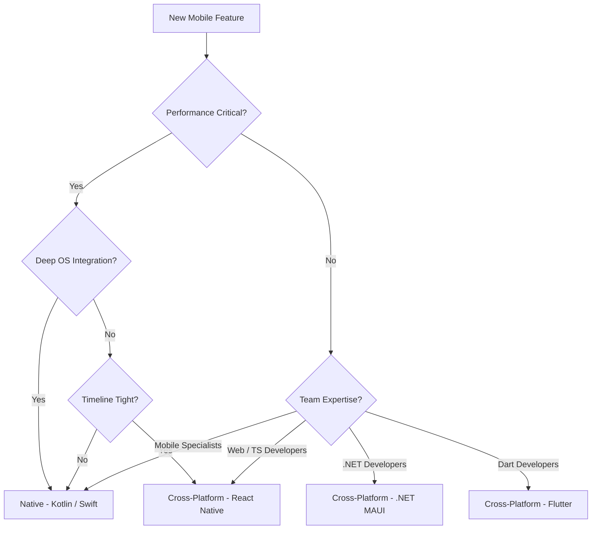
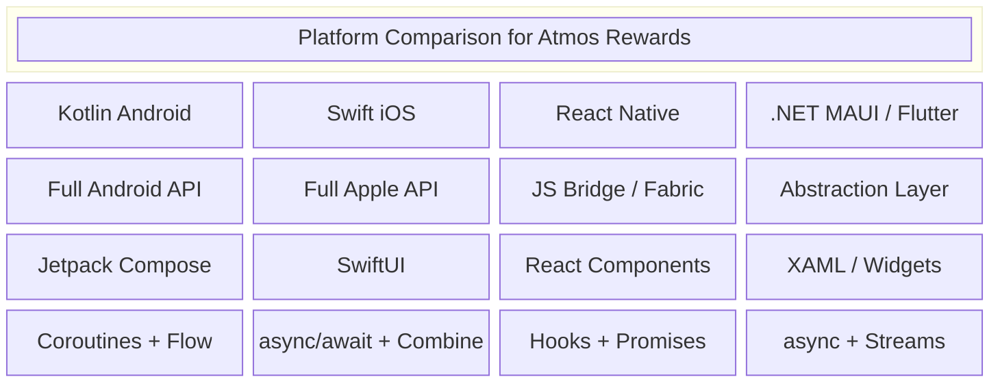
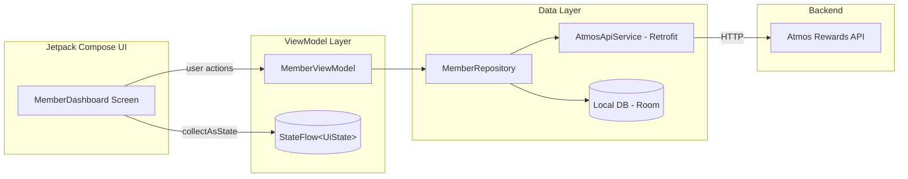
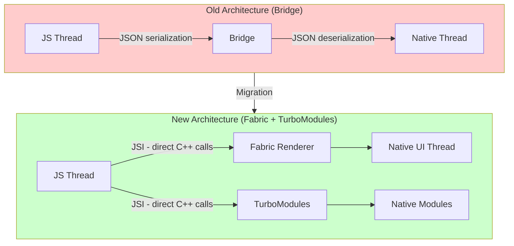
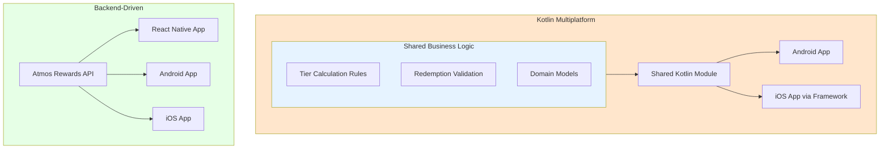
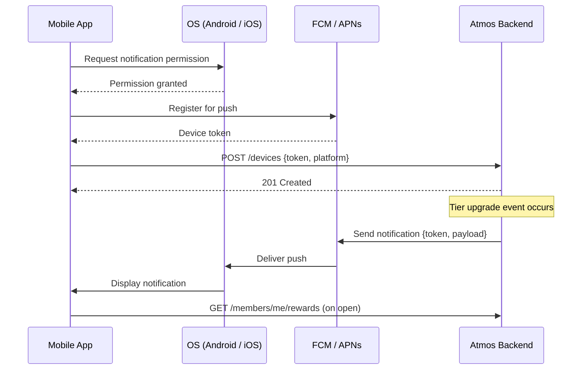

# Mobile Development

## Overview

Mobile development for airline loyalty programs like Atmos Rewards demands careful platform and architecture decisions. Members expect fast, reliable access to their rewards balance, booking integration, and tier status -- whether on iOS, Android, or the web. This document covers native development with Kotlin (Android) and Swift (iOS), cross-platform approaches with React Native, and the architectural considerations that drive platform choice for a team like Membership Atmos Rewards at Alaska Airlines.

---

## 1. Native vs Cross-Platform Trade-offs

Choosing between native and cross-platform is one of the most consequential architectural decisions for a mobile team.

### When to Choose Native (Kotlin / Swift)

- Performance-critical features (animations, real-time location, camera/AR).
- Deep OS integration (widgets, app clips, Siri/Google Assistant shortcuts).
- Small, focused apps where a single-platform team already exists.
- Regulatory or security requirements that demand fine-grained platform control.

### When to Choose Cross-Platform (React Native / Flutter / .NET MAUI)

- Shared codebase across iOS and Android reduces time-to-market.
- Smaller team needs to ship to both platforms simultaneously.
- The app is primarily data-driven screens (lists, forms, dashboards).
- The organization already has strong web/TypeScript or Dart talent.

### Decision Matrix



### Platform Comparison



---

## 2. Kotlin for Android

### Coroutines and Flow for Async Operations

Kotlin coroutines provide structured concurrency. `Flow` is the reactive stream primitive, and `StateFlow` is the go-to for exposing UI state from a ViewModel.

### Architecture Overview



### Kotlin Example: Retrofit Service for Atmos API

```kotlin
// AtmosApiService.kt
interface AtmosApiService {

    @GET("members/{memberId}/rewards")
    suspend fun getMemberRewards(
        @Path("memberId") memberId: String,
        @Header("Authorization") token: String
    ): MemberRewardsResponse

    @POST("members/{memberId}/redeem")
    suspend fun redeemPoints(
        @Path("memberId") memberId: String,
        @Body request: RedeemRequest,
        @Header("Authorization") token: String
    ): RedeemResponse

    companion object {
        private const val BASE_URL = "https://api.alaskaair.com/atmos/v1/"

        fun create(): AtmosApiService {
            val logging = HttpLoggingInterceptor().apply {
                level = HttpLoggingInterceptor.Level.BODY
            }
            val client = OkHttpClient.Builder()
                .addInterceptor(logging)
                .connectTimeout(30, TimeUnit.SECONDS)
                .readTimeout(30, TimeUnit.SECONDS)
                .build()

            return Retrofit.Builder()
                .baseUrl(BASE_URL)
                .client(client)
                .addConverterFactory(GsonConverterFactory.create())
                .build()
                .create(AtmosApiService::class.java)
        }
    }
}

data class MemberRewardsResponse(
    val memberId: String,
    val tier: String,
    val milesBalance: Long,
    val tierQualifyingMiles: Long,
    val recentActivity: List<ActivityItem>
)

data class RedeemRequest(
    val points: Long,
    val rewardType: String,
    val flightId: String? = null
)
```

### Kotlin Example: MemberViewModel with StateFlow

```kotlin
// MemberViewModel.kt
class MemberViewModel(
    private val repository: MemberRepository,
    private val savedStateHandle: SavedStateHandle
) : ViewModel() {

    sealed class UiState {
        object Loading : UiState()
        data class Success(
            val memberName: String,
            val tier: String,
            val milesBalance: Long,
            val tierQualifyingMiles: Long,
            val recentActivity: List<ActivityItem>
        ) : UiState()
        data class Error(val message: String) : UiState()
    }

    private val _uiState = MutableStateFlow<UiState>(UiState.Loading)
    val uiState: StateFlow<UiState> = _uiState.asStateFlow()

    private val _redeemResult = MutableSharedFlow<RedeemResult>()
    val redeemResult: SharedFlow<RedeemResult> = _redeemResult.asSharedFlow()

    init {
        loadMemberDashboard()
    }

    fun loadMemberDashboard() {
        viewModelScope.launch {
            _uiState.value = UiState.Loading
            repository.getMemberRewards()
                .catch { e ->
                    _uiState.value = UiState.Error(
                        e.message ?: "Failed to load rewards"
                    )
                }
                .collect { rewards ->
                    _uiState.value = UiState.Success(
                        memberName = rewards.memberName,
                        tier = rewards.tier,
                        milesBalance = rewards.milesBalance,
                        tierQualifyingMiles = rewards.tierQualifyingMiles,
                        recentActivity = rewards.recentActivity
                    )
                }
        }
    }

    fun redeemPoints(points: Long, rewardType: String) {
        viewModelScope.launch {
            try {
                val result = repository.redeemPoints(points, rewardType)
                _redeemResult.emit(result)
                loadMemberDashboard() // Refresh after redemption
            } catch (e: Exception) {
                _redeemResult.emit(
                    RedeemResult.Failure(e.message ?: "Redemption failed")
                )
            }
        }
    }
}
```

### Kotlin Example: Jetpack Compose MemberDashboard Screen

```kotlin
// MemberDashboardScreen.kt
@Composable
fun MemberDashboardScreen(
    viewModel: MemberViewModel = hiltViewModel(),
    onNavigateToRedeem: () -> Unit
) {
    val uiState by viewModel.uiState.collectAsState()

    Scaffold(
        topBar = {
            TopAppBar(
                title = { Text("Atmos Rewards") },
                colors = TopAppBarDefaults.topAppBarColors(
                    containerColor = Color(0xFF00274C) // Alaska blue
                )
            )
        }
    ) { padding ->
        when (val state = uiState) {
            is MemberViewModel.UiState.Loading -> {
                Box(
                    modifier = Modifier.fillMaxSize(),
                    contentAlignment = Alignment.Center
                ) {
                    CircularProgressIndicator()
                }
            }
            is MemberViewModel.UiState.Success -> {
                Column(
                    modifier = Modifier
                        .fillMaxSize()
                        .padding(padding)
                        .verticalScroll(rememberScrollState())
                ) {
                    TierCard(
                        tier = state.tier,
                        memberName = state.memberName
                    )
                    MilesBalanceCard(
                        balance = state.milesBalance,
                        tqm = state.tierQualifyingMiles,
                        onRedeemClick = onNavigateToRedeem
                    )
                    RecentActivityList(
                        activities = state.recentActivity
                    )
                }
            }
            is MemberViewModel.UiState.Error -> {
                ErrorWithRetry(
                    message = state.message,
                    onRetry = { viewModel.loadMemberDashboard() }
                )
            }
        }
    }
}

@Composable
private fun TierCard(tier: String, memberName: String) {
    Card(
        modifier = Modifier
            .fillMaxWidth()
            .padding(16.dp),
        colors = CardDefaults.cardColors(
            containerColor = when (tier) {
                "MVP Gold 75K" -> Color(0xFFDAA520)
                "MVP Gold" -> Color(0xFFFFD700)
                "MVP" -> Color(0xFFC0C0C0)
                else -> MaterialTheme.colorScheme.surface
            }
        )
    ) {
        Column(modifier = Modifier.padding(20.dp)) {
            Text(
                text = memberName,
                style = MaterialTheme.typography.headlineMedium
            )
            Spacer(modifier = Modifier.height(4.dp))
            Text(
                text = tier,
                style = MaterialTheme.typography.titleMedium
            )
        }
    }
}

@Composable
private fun MilesBalanceCard(
    balance: Long,
    tqm: Long,
    onRedeemClick: () -> Unit
) {
    Card(
        modifier = Modifier
            .fillMaxWidth()
            .padding(horizontal = 16.dp)
    ) {
        Column(modifier = Modifier.padding(20.dp)) {
            Text("Miles Balance", style = MaterialTheme.typography.labelLarge)
            Text(
                text = "%,d".format(balance),
                style = MaterialTheme.typography.displaySmall
            )
            Spacer(modifier = Modifier.height(8.dp))
            LinearProgressIndicator(
                progress = { (tqm / 75_000f).coerceAtMost(1f) },
                modifier = Modifier.fillMaxWidth()
            )
            Text(
                text = "%,d / 75,000 TQM".format(tqm),
                style = MaterialTheme.typography.bodySmall
            )
            Spacer(modifier = Modifier.height(12.dp))
            Button(onClick = onRedeemClick) {
                Text("Redeem Miles")
            }
        }
    }
}
```

---

## 3. Swift for iOS

### async/await and Swift Concurrency

Swift 5.5+ concurrency replaces completion-handler patterns with structured async/await, making networking and data loading straightforward.

### Swift Example: MemberViewModel with @Published

```swift
// MemberViewModel.swift
import Foundation
import Combine

@MainActor
class MemberViewModel: ObservableObject {

    enum ViewState {
        case loading
        case loaded(MemberRewards)
        case error(String)
    }

    @Published var state: ViewState = .loading
    @Published var redeemMessage: String?

    private let apiService: AtmosAPIService

    init(apiService: AtmosAPIService = .shared) {
        self.apiService = apiService
    }

    func loadDashboard() async {
        state = .loading
        do {
            let rewards = try await apiService.fetchMemberRewards()
            state = .loaded(rewards)
        } catch let error as AtmosAPIError {
            state = .error(error.userMessage)
        } catch {
            state = .error("Unable to load your rewards. Please try again.")
        }
    }

    func redeemPoints(amount: Int, rewardType: RewardType) async {
        do {
            let result = try await apiService.redeemPoints(
                amount: amount,
                rewardType: rewardType
            )
            redeemMessage = "Redeemed \(result.pointsUsed) miles for \(result.description)"
            await loadDashboard()
        } catch {
            redeemMessage = "Redemption failed. Please try again."
        }
    }
}
```

### Swift Example: Async API Service with URLSession

```swift
// AtmosAPIService.swift
import Foundation

enum AtmosAPIError: Error {
    case invalidURL
    case unauthorized
    case serverError(Int)
    case decodingError
    case networkError(Error)

    var userMessage: String {
        switch self {
        case .unauthorized:
            return "Session expired. Please sign in again."
        case .serverError(let code):
            return "Server error (\(code)). Please try later."
        case .networkError:
            return "No internet connection."
        default:
            return "Something went wrong."
        }
    }
}

actor AtmosAPIService {

    static let shared = AtmosAPIService()

    private let baseURL = "https://api.alaskaair.com/atmos/v1"
    private let session: URLSession
    private let decoder: JSONDecoder

    init() {
        let config = URLSessionConfiguration.default
        config.timeoutIntervalForRequest = 30
        config.waitsForConnectivity = true
        self.session = URLSession(configuration: config)

        self.decoder = JSONDecoder()
        decoder.dateDecodingStrategy = .iso8601
        decoder.keyDecodingStrategy = .convertFromSnakeCase
    }

    func fetchMemberRewards() async throws -> MemberRewards {
        let url = try buildURL(path: "members/me/rewards")
        var request = URLRequest(url: url)
        request.setValue(try await TokenStore.shared.accessToken(), forHTTPHeaderField: "Authorization")

        let (data, response) = try await session.data(for: request)
        try validateResponse(response)
        return try decoder.decode(MemberRewards.self, from: data)
    }

    func redeemPoints(amount: Int, rewardType: RewardType) async throws -> RedeemResult {
        let url = try buildURL(path: "members/me/redeem")
        var request = URLRequest(url: url)
        request.httpMethod = "POST"
        request.setValue("application/json", forHTTPHeaderField: "Content-Type")
        request.setValue(try await TokenStore.shared.accessToken(), forHTTPHeaderField: "Authorization")

        let body = RedeemRequest(points: amount, rewardType: rewardType.rawValue)
        request.httpBody = try JSONEncoder().encode(body)

        let (data, response) = try await session.data(for: request)
        try validateResponse(response)
        return try decoder.decode(RedeemResult.self, from: data)
    }

    private func buildURL(path: String) throws -> URL {
        guard let url = URL(string: "\(baseURL)/\(path)") else {
            throw AtmosAPIError.invalidURL
        }
        return url
    }

    private func validateResponse(_ response: URLResponse) throws {
        guard let http = response as? HTTPURLResponse else { return }
        switch http.statusCode {
        case 200..<300: return
        case 401: throw AtmosAPIError.unauthorized
        default: throw AtmosAPIError.serverError(http.statusCode)
        }
    }
}
```

### Swift Example: SwiftUI MemberDashboard View

```swift
// MemberDashboardView.swift
import SwiftUI

struct MemberDashboardView: View {
    @StateObject private var viewModel = MemberViewModel()
    @State private var showRedeemSheet = false

    var body: some View {
        NavigationStack {
            Group {
                switch viewModel.state {
                case .loading:
                    ProgressView("Loading your rewards...")

                case .loaded(let rewards):
                    ScrollView {
                        VStack(spacing: 16) {
                            tierCard(rewards: rewards)
                            milesBalanceCard(rewards: rewards)
                            recentActivitySection(activities: rewards.recentActivity)
                        }
                        .padding()
                    }

                case .error(let message):
                    ContentUnavailableView {
                        Label("Unable to Load", systemImage: "exclamationmark.triangle")
                    } description: {
                        Text(message)
                    } actions: {
                        Button("Try Again") {
                            Task { await viewModel.loadDashboard() }
                        }
                    }
                }
            }
            .navigationTitle("Atmos Rewards")
            .toolbarColorScheme(.dark, for: .navigationBar)
            .toolbarBackground(Color("AlaskaBlue"), for: .navigationBar)
            .toolbarBackground(.visible, for: .navigationBar)
            .task { await viewModel.loadDashboard() }
            .sheet(isPresented: $showRedeemSheet) {
                RedeemView(viewModel: viewModel)
            }
            .alert("Redemption", isPresented: .constant(viewModel.redeemMessage != nil)) {
                Button("OK") { viewModel.redeemMessage = nil }
            } message: {
                Text(viewModel.redeemMessage ?? "")
            }
        }
    }

    private func tierCard(rewards: MemberRewards) -> some View {
        VStack(alignment: .leading, spacing: 4) {
            Text(rewards.memberName)
                .font(.title)
                .fontWeight(.bold)
            Text(rewards.tier)
                .font(.title3)
                .foregroundStyle(.secondary)
        }
        .frame(maxWidth: .infinity, alignment: .leading)
        .padding()
        .background(tierColor(rewards.tier).gradient)
        .clipShape(RoundedRectangle(cornerRadius: 12))
    }

    private func milesBalanceCard(rewards: MemberRewards) -> some View {
        VStack(alignment: .leading, spacing: 8) {
            Text("Miles Balance")
                .font(.caption)
                .foregroundStyle(.secondary)
            Text("\(rewards.milesBalance, format: .number)")
                .font(.largeTitle)
                .fontWeight(.bold)

            ProgressView(value: Double(rewards.tierQualifyingMiles), total: 75_000) {
                Text("\(rewards.tierQualifyingMiles, format: .number) / 75,000 TQM")
                    .font(.caption2)
            }

            Button("Redeem Miles") { showRedeemSheet = true }
                .buttonStyle(.borderedProminent)
        }
        .frame(maxWidth: .infinity, alignment: .leading)
        .padding()
        .background(.regularMaterial)
        .clipShape(RoundedRectangle(cornerRadius: 12))
    }

    private func tierColor(_ tier: String) -> Color {
        switch tier {
        case "MVP Gold 75K": return .yellow
        case "MVP Gold": return .orange
        case "MVP": return .gray
        default: return .blue
        }
    }
}
```

---

## 4. React Native

### Bridge Architecture vs New Architecture



Key differences:

| Aspect | Old (Bridge) | New (Fabric + TurboModules) |
|--------|-------------|---------------------------|
| Communication | Async JSON over bridge | Synchronous JSI calls via C++ |
| Module loading | All at startup | Lazy loading (TurboModules) |
| Rendering | Shadow tree on JS thread | Concurrent rendering on multiple threads |
| Type safety | None at bridge boundary | Codegen from typed specs |

### React Native Example: MemberDashboard Component

```tsx
// MemberDashboard.tsx
import React from 'react';
import {
  View,
  Text,
  ScrollView,
  StyleSheet,
  ActivityIndicator,
  TouchableOpacity,
  RefreshControl,
} from 'react-native';
import { useNavigation } from '@react-navigation/native';
import { useMemberRewards } from '../hooks/useMemberRewards';

const TIER_COLORS: Record<string, string> = {
  'MVP Gold 75K': '#DAA520',
  'MVP Gold': '#FFD700',
  'MVP': '#C0C0C0',
  'Member': '#00274C',
};

export function MemberDashboard() {
  const navigation = useNavigation();
  const { data, isLoading, error, refetch } = useMemberRewards();
  const [refreshing, setRefreshing] = React.useState(false);

  const onRefresh = React.useCallback(async () => {
    setRefreshing(true);
    await refetch();
    setRefreshing(false);
  }, [refetch]);

  if (isLoading && !refreshing) {
    return (
      <View style={styles.center}>
        <ActivityIndicator size="large" color="#00274C" />
        <Text style={styles.loadingText}>Loading your rewards...</Text>
      </View>
    );
  }

  if (error) {
    return (
      <View style={styles.center}>
        <Text style={styles.errorText}>{error.message}</Text>
        <TouchableOpacity style={styles.retryButton} onPress={refetch}>
          <Text style={styles.retryText}>Try Again</Text>
        </TouchableOpacity>
      </View>
    );
  }

  if (!data) return null;

  const tqmProgress = Math.min(data.tierQualifyingMiles / 75000, 1);

  return (
    <ScrollView
      style={styles.container}
      refreshControl={
        <RefreshControl refreshing={refreshing} onRefresh={onRefresh} />
      }
    >
      {/* Tier Card */}
      <View style={[styles.tierCard, { backgroundColor: TIER_COLORS[data.tier] || '#00274C' }]}>
        <Text style={styles.memberName}>{data.memberName}</Text>
        <Text style={styles.tierName}>{data.tier}</Text>
      </View>

      {/* Miles Balance Card */}
      <View style={styles.card}>
        <Text style={styles.label}>Miles Balance</Text>
        <Text style={styles.balance}>{data.milesBalance.toLocaleString()}</Text>

        <View style={styles.progressTrack}>
          <View style={[styles.progressFill, { width: `${tqmProgress * 100}%` }]} />
        </View>
        <Text style={styles.tqmLabel}>
          {data.tierQualifyingMiles.toLocaleString()} / 75,000 TQM
        </Text>

        <TouchableOpacity
          style={styles.redeemButton}
          onPress={() => navigation.navigate('Redeem' as never)}
        >
          <Text style={styles.redeemButtonText}>Redeem Miles</Text>
        </TouchableOpacity>
      </View>

      {/* Recent Activity */}
      <View style={styles.card}>
        <Text style={styles.sectionTitle}>Recent Activity</Text>
        {data.recentActivity.map((item) => (
          <View key={item.id} style={styles.activityRow}>
            <Text style={styles.activityDesc}>{item.description}</Text>
            <Text style={[styles.activityMiles, item.miles > 0 && styles.positive]}>
              {item.miles > 0 ? '+' : ''}{item.miles.toLocaleString()}
            </Text>
          </View>
        ))}
      </View>
    </ScrollView>
  );
}

const styles = StyleSheet.create({
  container: { flex: 1, backgroundColor: '#F5F5F5' },
  center: { flex: 1, justifyContent: 'center', alignItems: 'center', padding: 20 },
  loadingText: { marginTop: 12, color: '#666' },
  errorText: { fontSize: 16, color: '#CC0000', textAlign: 'center', marginBottom: 16 },
  retryButton: { backgroundColor: '#00274C', paddingHorizontal: 24, paddingVertical: 12, borderRadius: 8 },
  retryText: { color: '#FFF', fontWeight: '600' },
  tierCard: { margin: 16, padding: 20, borderRadius: 12 },
  memberName: { fontSize: 24, fontWeight: 'bold', color: '#FFF' },
  tierName: { fontSize: 18, color: '#FFFFFFCC', marginTop: 4 },
  card: { marginHorizontal: 16, marginBottom: 16, padding: 20, backgroundColor: '#FFF', borderRadius: 12 },
  label: { fontSize: 12, color: '#999', textTransform: 'uppercase' },
  balance: { fontSize: 36, fontWeight: 'bold', color: '#00274C' },
  progressTrack: { height: 6, backgroundColor: '#E0E0E0', borderRadius: 3, marginTop: 12 },
  progressFill: { height: 6, backgroundColor: '#00274C', borderRadius: 3 },
  tqmLabel: { fontSize: 11, color: '#999', marginTop: 4 },
  redeemButton: { backgroundColor: '#00274C', paddingVertical: 12, borderRadius: 8, alignItems: 'center', marginTop: 16 },
  redeemButtonText: { color: '#FFF', fontWeight: '600', fontSize: 16 },
  sectionTitle: { fontSize: 18, fontWeight: '600', marginBottom: 12 },
  activityRow: { flexDirection: 'row', justifyContent: 'space-between', paddingVertical: 10, borderBottomWidth: 1, borderBottomColor: '#F0F0F0' },
  activityDesc: { flex: 1, fontSize: 14, color: '#333' },
  activityMiles: { fontSize: 14, fontWeight: '600', color: '#333' },
  positive: { color: '#007A33' },
});
```

### React Native Example: API Hook

```tsx
// hooks/useMemberRewards.ts
import { useState, useEffect, useCallback } from 'react';
import { getAccessToken } from '../auth/tokenStore';

const BASE_URL = 'https://api.alaskaair.com/atmos/v1';

interface MemberRewards {
  memberId: string;
  memberName: string;
  tier: string;
  milesBalance: number;
  tierQualifyingMiles: number;
  recentActivity: ActivityItem[];
}

interface ActivityItem {
  id: string;
  description: string;
  miles: number;
  date: string;
}

interface UseMemberRewardsResult {
  data: MemberRewards | null;
  isLoading: boolean;
  error: Error | null;
  refetch: () => Promise<void>;
}

export function useMemberRewards(): UseMemberRewardsResult {
  const [data, setData] = useState<MemberRewards | null>(null);
  const [isLoading, setIsLoading] = useState(true);
  const [error, setError] = useState<Error | null>(null);

  const fetchRewards = useCallback(async () => {
    try {
      setIsLoading(true);
      setError(null);

      const token = await getAccessToken();
      const response = await fetch(`${BASE_URL}/members/me/rewards`, {
        headers: {
          Authorization: `Bearer ${token}`,
          'Content-Type': 'application/json',
        },
      });

      if (response.status === 401) {
        throw new Error('Session expired. Please sign in again.');
      }

      if (!response.ok) {
        throw new Error(`Server error (${response.status})`);
      }

      const rewards: MemberRewards = await response.json();
      setData(rewards);
    } catch (err) {
      setError(err instanceof Error ? err : new Error('Unknown error'));
    } finally {
      setIsLoading(false);
    }
  }, []);

  useEffect(() => {
    fetchRewards();
  }, [fetchRewards]);

  return { data, isLoading, error, refetch: fetchRewards };
}
```

### React Native Example: Push Notification Setup

```tsx
// notifications/pushSetup.ts
import messaging from '@react-native-firebase/messaging';
import { Platform, Alert } from 'react-native';
import AsyncStorage from '@react-native-async-storage/async-storage';

const API_BASE = 'https://api.alaskaair.com/atmos/v1';

export async function requestNotificationPermission(): Promise<boolean> {
  if (Platform.OS === 'ios') {
    const authStatus = await messaging().requestPermission();
    return (
      authStatus === messaging.AuthorizationStatus.AUTHORIZED ||
      authStatus === messaging.AuthorizationStatus.PROVISIONAL
    );
  }
  // Android 13+ requires runtime permission (handled via react-native-permissions)
  return true;
}

export async function registerDeviceToken(): Promise<void> {
  try {
    const token = await messaging().getToken();
    const storedToken = await AsyncStorage.getItem('fcm_token');

    if (token !== storedToken) {
      await fetch(`${API_BASE}/members/me/devices`, {
        method: 'POST',
        headers: { 'Content-Type': 'application/json' },
        body: JSON.stringify({
          token,
          platform: Platform.OS,
          appVersion: '3.2.0',
        }),
      });
      await AsyncStorage.setItem('fcm_token', token);
    }
  } catch (error) {
    console.error('Failed to register device token:', error);
  }
}

export function setupNotificationListeners(): () => void {
  // Foreground messages
  const unsubForeground = messaging().onMessage(async (remoteMessage) => {
    const { title, body } = remoteMessage.notification ?? {};
    if (title && body) {
      Alert.alert(title, body);
    }
  });

  // Token refresh
  const unsubTokenRefresh = messaging().onTokenRefresh(async (newToken) => {
    await AsyncStorage.setItem('fcm_token', newToken);
    await registerDeviceToken();
  });

  // Background message handler (must be registered at module scope)
  messaging().setBackgroundMessageHandler(async (remoteMessage) => {
    console.log('Background notification:', remoteMessage);
    // Update badge count, cache data, etc.
  });

  return () => {
    unsubForeground();
    unsubTokenRefresh();
  };
}
```

---

## 5. Cross-Platform Considerations

### Shared Business Logic Approaches



Approaches for sharing logic across platforms:

| Approach | Pros | Cons |
|----------|------|------|
| **Kotlin Multiplatform (KMP)** | Single implementation of business rules; type-safe | iOS team needs KMP tooling; still maturing |
| **Backend-driven logic** | Thin clients; update without app releases | Requires network; latency for validations |
| **Shared TypeScript** | Works with React Native and web | Not native; extra abstraction for native apps |
| **C++ core** | Maximum portability | High complexity; poor developer experience |

### Push Notifications: FCM and APNs



### Deep Linking

Deep links let users jump directly into specific screens from push notifications, emails, or web links.

**URL scheme examples for Atmos Rewards:**

| Deep Link | Screen | Use Case |
|-----------|--------|----------|
| `alaskaair://rewards/dashboard` | Member Dashboard | Push notification tap |
| `alaskaair://rewards/redeem?flight=AS123` | Redemption flow | Email promotion |
| `https://www.alaskaair.com/rewards/tier-status` | Tier status (universal link) | Web fallback |

**Implementation considerations:**

- **Android:** Intent filters in AndroidManifest.xml + Navigation component deep link handling.
- **iOS:** Universal Links (associated domains) + URL scheme handling in AppDelegate/SceneDelegate.
- **React Native:** React Navigation linking configuration with both platforms registered.

### Offline-First Patterns

For a rewards app, offline support means members can always see their cached balance, recent activity, and tier status -- even without connectivity.

**Strategy:**

1. **Cache-first, network-refresh:** Show cached data immediately, update when network is available.
2. **Optimistic UI for actions:** Queue redemption requests locally, sync when online.
3. **Conflict resolution:** Server wins for balance; last-write-wins for preferences.

**Storage options by platform:**

| Platform | Local Storage | Structured Data | Encrypted Storage |
|----------|--------------|-----------------|-------------------|
| Android | DataStore | Room (SQLite) | EncryptedSharedPreferences |
| iOS | UserDefaults | Core Data / SwiftData | Keychain |
| React Native | AsyncStorage | WatermelonDB / Realm | react-native-keychain |

### App Store Deployment

Key considerations for airline loyalty apps:

- **iOS App Store:** Review guidelines around in-app purchases do not apply to airline bookings (real-world goods), but rewards redemption UX must be transparent.
- **Google Play:** Target API level requirements update annually; keep `targetSdkVersion` current.
- **Code signing:** Automate with Fastlane (both platforms) or Xcode Cloud / GitHub Actions.
- **Feature flags:** Use LaunchDarkly, Firebase Remote Config, or a custom solution to decouple deploy from release.
- **Staged rollouts:** Google Play supports percentage-based rollouts natively; TestFlight for iOS beta distribution.
- **Crash monitoring:** Crashlytics, Sentry, or Datadog RUM for production observability.

---

## Interview Questions

### Native Development

1. **What are Kotlin coroutines and how do they differ from Java threads?** Coroutines are lightweight, cooperative concurrency primitives that run on a shared thread pool. Unlike threads, thousands of coroutines can run concurrently without the overhead of OS thread creation. They use suspend functions and structured concurrency (CoroutineScope) to prevent leaks.

2. **Explain the difference between `StateFlow` and `SharedFlow` in Kotlin.** `StateFlow` is a hot flow that always holds a value (like `BehaviorSubject` in RxJava) and only emits when the value changes (conflation). `SharedFlow` is a hot flow without an initial value that can emit repeated values, making it suitable for events like navigation or snackbar messages.

3. **How does SwiftUI's `@StateObject` differ from `@ObservedObject`?** `@StateObject` owns the instance -- SwiftUI creates it once and keeps it alive across view re-renders. `@ObservedObject` does not own the instance; the view expects it to be provided externally and will not recreate it. Use `@StateObject` for the view that creates the ViewModel, and `@ObservedObject` for child views that receive it.

4. **What is the Swift `actor` model and how does it prevent data races?** Actors provide reference-type semantics with built-in serial execution of their methods. The compiler enforces that access to actor-isolated state from outside the actor must be `await`ed, ensuring mutual exclusion without manual locking.

### Cross-Platform

5. **What problems does React Native's new architecture (Fabric + TurboModules) solve?** The old bridge serialized all JS-to-native communication as async JSON, creating bottlenecks for high-frequency operations (scrolling, gestures). The new architecture uses JSI (JavaScript Interface) for synchronous C++ bindings, eliminating serialization overhead. Fabric enables concurrent rendering, and TurboModules allow lazy-loading of native modules to reduce startup time.

6. **When would you recommend React Native over native development for an airline app?** When the team is primarily web/TypeScript developers, when the app is mostly data-display screens (dashboards, lists, booking status), when shipping speed to both platforms is critical, and when the app does not require deep platform integration like AR boarding passes or complex animations. A hybrid approach -- React Native for most screens with native modules for performance-critical features -- is also valid.

7. **How would you implement offline-first for member rewards data?** Cache the latest API response (balance, tier, activity) in local storage on every successful fetch. On app launch, display cached data immediately, then refresh from the network. For actions like redemption, queue them locally and sync when connectivity returns. Handle conflicts by treating the server as the source of truth for balance while using last-write-wins for user preferences.

### Architecture

8. **How would you share business logic (like tier qualification rules) across iOS and Android?** Options include Kotlin Multiplatform (compile shared Kotlin to iOS framework and Android library), pushing logic to the backend API (thin clients), or using a rules engine on the server. KMP is preferred when rules are complex and need to run offline, while backend-driven logic works when all validations can tolerate network latency.

9. **Describe how push notifications flow from your backend to the user's device.** The app registers for push with the OS, receives a device token from FCM (Android) or APNs (iOS), and sends that token to the Atmos backend. When an event occurs (tier upgrade, deal alert), the backend sends a payload to FCM/APNs with the device token. The push service delivers it to the OS, which either shows it in the notification tray (background) or delivers it to the app's foreground handler.

10. **What is deep linking and how do you handle it in a mobile app?** Deep linking maps URLs to specific screens. Universal Links (iOS) and App Links (Android) use HTTPS URLs that work in the browser if the app is not installed. The app registers supported URL patterns and, on launch from a link, parses the URL to determine which screen and parameters to navigate to. In React Native, React Navigation's linking configuration maps URL paths to screen names.

11. **How would you approach migrating a React Native app to the new architecture?** Start by upgrading to a React Native version that supports the new architecture. Migrate native modules to TurboModules by creating typed specs (using codegen). Migrate custom native views to Fabric components. Test each module individually. Use the interop layer during migration so old and new modules can coexist. Prioritize performance-critical modules first.
