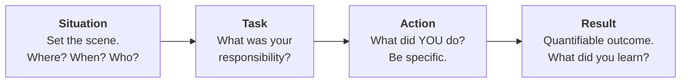
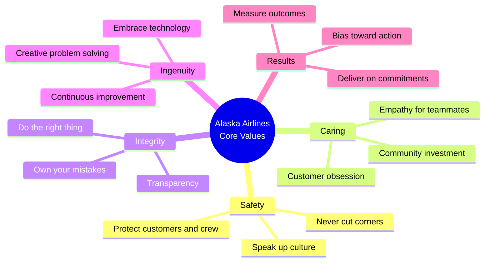
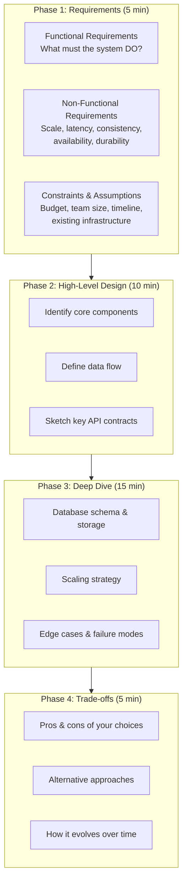
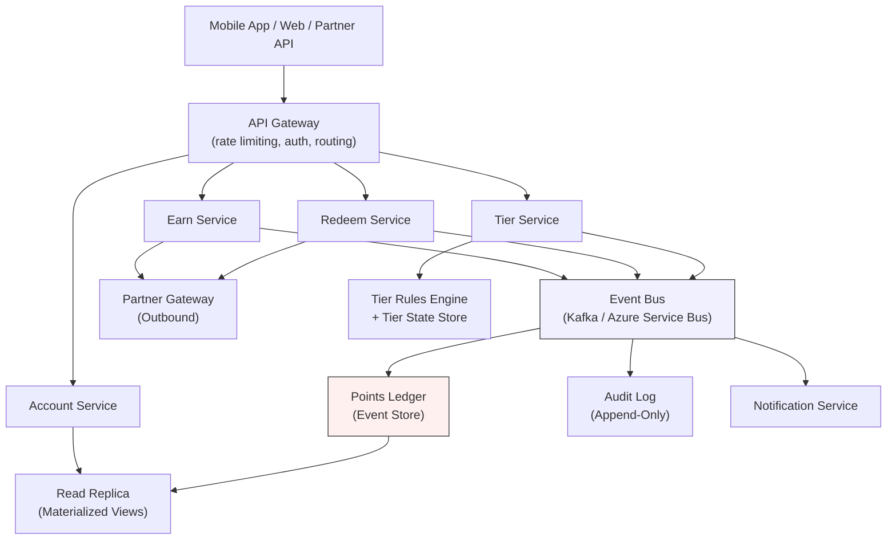
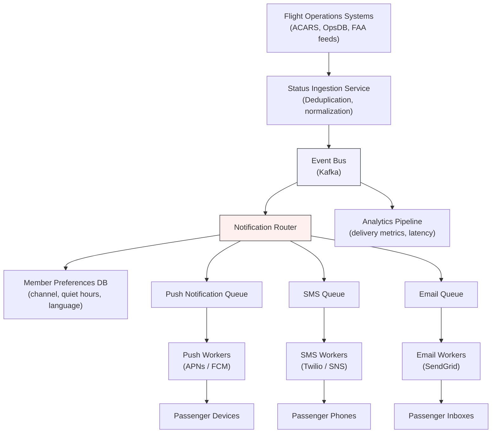

# Behavioral Interview & System Design Preparation — Alaska Airlines (Atmos Rewards)

## Overview

This document covers two pillars of the Alaska Airlines interview process for the Membership Atmos Rewards team: **behavioral questions** using the STAR method and **system design exercises** focused on loyalty and airline systems. Part 3 addresses technical discussion topics and how to articulate architecture decisions clearly.

Alaska Airlines values **safety, caring, integrity, ingenuity, and results**. Every answer — behavioral or technical — should reflect at least one of these values.

---

## Part 1: Behavioral Interview (STAR Method)

### 1.1 The STAR Framework

STAR is a structured method for answering behavioral questions with concrete, measurable examples.

**Key principles:**

- **Situation** — Keep it to two sentences. Give just enough context so the interviewer understands the stakes.
- **Task** — Clarify YOUR role versus the team's role. Use "I" not "we."
- **Action** — This is the longest section. Describe the specific steps you took and why.
- **Result** — Quantify whenever possible (percentages, time saved, revenue impact). If the outcome was negative, emphasize the lesson learned and how you applied it later.

### 1.2 Common Behavioral Questions with Answer Frameworks

---

#### Q1: "Tell me about a time you disagreed with a teammate."

**What they are evaluating:** Conflict resolution, communication, respect for others, *caring* and *integrity*.

**Answer framework:**

| STAR Step | Guidance |
|-----------|----------|
| Situation | Name the project and the specific technical or process disagreement. |
| Task | Explain why this disagreement mattered (impact on timeline, quality, users). |
| Action | Describe how you listened first, presented data or evidence, proposed a compromise or experiment, and ultimately resolved the disagreement. |
| Result | State the outcome. If the other person's approach won, explain what you learned. If yours won, explain how you maintained the relationship. |

**Tips:**
- Never badmouth the other person.
- Show that you value diverse perspectives.
- Tie back to Alaska's value of *caring* — you cared enough about both the product and the relationship to work through the disagreement constructively.

---

#### Q2: "Describe a challenging technical problem you solved."

**What they are evaluating:** Problem-solving depth, persistence, *ingenuity*.

**Answer framework:**

| STAR Step | Guidance |
|-----------|----------|
| Situation | Describe the system, its scale, and why the problem was hard. |
| Task | Clarify your ownership — were you the lead? A contributor? |
| Action | Walk through your debugging/design process step by step. Mention tools, techniques, and how you narrowed the problem space. |
| Result | Quantify the fix (latency reduced by X%, incidents dropped to zero, etc.). |

**Tips:**
- Choose a problem with real complexity, not just "I fixed a bug."
- Show systematic thinking: hypothesis, experiment, conclusion.

---

#### Q3: "Tell me about a time you had to learn something quickly."

**What they are evaluating:** Adaptability, growth mindset, *ingenuity*.

**Answer framework:**

| STAR Step | Guidance |
|-----------|----------|
| Situation | Describe the new technology, domain, or process and the time pressure. |
| Task | Explain why rapid learning was critical (deadline, team dependency). |
| Action | Detail your learning strategy: documentation, prototyping, pairing with experts, building a proof of concept. |
| Result | Describe what you delivered and how quickly. Mention if you later became a resource for others on that topic. |

---

#### Q4: "Describe a project that failed and what you learned."

**What they are evaluating:** Accountability, humility, growth, *integrity*.

**Answer framework:**

| STAR Step | Guidance |
|-----------|----------|
| Situation | Name the project and its goal. |
| Task | Your role and what success looked like. |
| Action | Be honest about what went wrong and your contribution to the failure. Describe what you did when you realized things were off track. |
| Result | The failure itself AND — critically — what you changed afterward. Show that the lesson stuck. |

**Tips:**
- Pick a real failure, not a "humble brag."
- Demonstrate that you take ownership rather than deflecting blame.

---

#### Q5: "How do you handle competing priorities?"

**What they are evaluating:** Organization, communication, judgment, *results*.

**Answer framework:**

| STAR Step | Guidance |
|-----------|----------|
| Situation | Describe a time when multiple urgent requests landed simultaneously. |
| Task | Explain the stakes of each competing priority. |
| Action | Describe how you assessed impact and urgency, communicated with stakeholders, negotiated timelines, and executed. |
| Result | What got delivered and when. How did stakeholders react? |

---

#### Q6: "Tell me about a time you mentored someone."

**What they are evaluating:** Leadership, patience, investment in others, *caring*.

**Answer framework:**

| STAR Step | Guidance |
|-----------|----------|
| Situation | Who were you mentoring and what was their challenge? |
| Task | What was your goal as a mentor? |
| Action | Describe your approach — pairing sessions, code reviews, providing stretch assignments, creating psychological safety. |
| Result | The mentee's growth (promotion, independent ownership of a feature, confidence increase). |

---

### 1.3 Alaska Airlines Culture Fit

Alaska Airlines operates on five core values. Every behavioral answer should connect to at least one.

**How to weave values into answers:**

- When discussing technical decisions, mention *safety* (system reliability, data protection).
- When discussing teamwork, highlight *caring* (empathy, listening, supporting growth).
- When discussing mistakes, demonstrate *integrity* (ownership, transparency).
- When discussing creative solutions, showcase *ingenuity* (thinking differently, iterating).
- When discussing outcomes, emphasize *results* (quantified impact, delivery).

### 1.4 Questions to Ask the Interviewer — Atmos Rewards Team

Strong candidates ask thoughtful questions. These are tailored to the Membership Atmos Rewards team.

**About the team and product:**
- "How does the Atmos Rewards team collaborate with partner airline loyalty programs? What are the biggest integration challenges?"
- "What does the roadmap look like for the next year on the rewards platform?"
- "How do you balance feature development with reliability and tech debt reduction on the rewards system?"

**About engineering culture:**
- "What does the deployment pipeline look like for the rewards services? How often do you ship?"
- "How does the team handle incidents that affect point balances or tier status?"
- "What does code review and design review look like on this team?"

**About growth:**
- "What does success look like in the first 90 days for this role?"
- "How does Alaska support engineers who want to grow into architecture or technical leadership?"

**About the Atmos migration/modernization:**
- "Where is the rewards platform in its modernization journey? What are the legacy systems that still need to be addressed?"
- "How does the team approach data migration when moving from legacy loyalty systems?"

---

## Part 2: System Design Exercises

### 2.1 System Design Approach Framework

Use this four-phase framework for every system design question. Spending time on requirements is critical — it shows maturity.

**Tips for the interviewer conversation:**
- Ask clarifying questions before drawing anything.
- State your assumptions out loud.
- Drive the conversation — do not wait to be prompted.
- When making a trade-off, name both sides explicitly.

---

### 2.2 Design Exercise: Loyalty Points System

#### Functional Requirements

- **Earn points** — Members earn points through flights, partner purchases, and credit card spend.
- **Redeem points** — Members redeem points for flights, upgrades, and partner rewards.
- **Tier management** — Automatically calculate and assign tier status (MVP, MVP Gold, MVP Gold 75K) based on qualifying activity.
- **Partner integration** — Sync point earning and redemption with partner airlines and merchants.
- **Account management** — View balance, transaction history, tier progress.

#### Non-Functional Requirements

| Requirement | Target |
|-------------|--------|
| Consistency | Point balances must be strongly consistent. A member should never see a stale balance. |
| Availability | 99.95% uptime. Degraded mode acceptable (read-only) during partial outages. |
| Scalability | Support 10M+ members, 50K+ transactions per hour during peak (holiday travel). |
| Auditability | Every point movement must be traceable with a full audit trail. Regulatory and financial compliance. |
| Latency | Balance lookups under 100ms. Earn/redeem operations under 500ms. |

#### High-Level Architecture

**Key design decisions:**

- **Event sourcing for the points ledger.** Every point movement (earn, redeem, adjust, expire) is stored as an immutable event. The current balance is a materialized projection of all events. This provides a complete audit trail and makes it easy to replay or reconcile.
- **CQRS (Command Query Responsibility Segregation).** Write operations go through the Earn/Redeem services into the event store. Read operations (balance checks, history) are served from materialized views in a read-optimized store.
- **Idempotency keys on all write operations.** Every earn or redeem request carries a unique idempotency key to prevent double-earning from retried requests.
- **Distributed locking on redemption.** Redeem operations acquire a lock on the member's account to prevent race conditions where two simultaneous redemptions overdraw the balance.

#### Database Design: Event Sourcing vs CRUD

| Aspect | Event Sourcing | Traditional CRUD |
|--------|---------------|-----------------|
| Audit trail | Built in — every event is the audit trail | Requires separate audit table or CDC |
| Balance calculation | Replay events or read materialized view | Single row update |
| Debugging | Can replay exact sequence of events | Must reconstruct from logs |
| Complexity | Higher — need projections, snapshots, event versioning | Lower — straightforward read/write |
| Storage | Grows with every transaction (mitigated by snapshots) | Fixed per account |

**Recommendation for a loyalty system:** Event sourcing. The auditability requirement and financial nature of point balances make the trade-off worthwhile. Snapshots every N events keep read performance acceptable.

#### API Design for Key Operations

**Earn points:**

    POST /api/v1/members/{memberId}/earn
    Headers: Idempotency-Key: {uuid}
    Body:
      partner_code: "AS"
      activity_type: "flight"
      reference_id: "PNR-ABC123"
      points: 1500
      qualifying_miles: 750

    Response 201:
      transaction_id: "txn-98765"
      new_balance: 45000
      tier_progress: { current: "MVP Gold", qualifying_miles: 52000, next_tier_at: 75000 }

**Redeem points:**

    POST /api/v1/members/{memberId}/redeem
    Headers: Idempotency-Key: {uuid}
    Body:
      redemption_type: "flight"
      points: 25000
      reference_id: "RES-XYZ789"

    Response 201:
      transaction_id: "txn-98766"
      new_balance: 20000

    Response 409 (insufficient balance):
      error: "INSUFFICIENT_POINTS"
      available: 20000
      requested: 25000

#### Handling Edge Cases

- **Double-earning:** Idempotency keys on all earn requests. The earn service checks for an existing transaction with the same idempotency key before processing. If found, it returns the original result.
- **Race conditions on redemption:** Use optimistic concurrency control with a version field on the account balance, or pessimistic locking via a distributed lock (Redis SETNX with TTL). The redeem service acquires the lock, checks the balance, debits, and releases.
- **Point expiration:** A scheduled job scans for points older than the expiration window and publishes expiration events. These are processed like any other ledger event, maintaining the audit trail.
- **Partner sync failures:** Use an outbox pattern. When an earn event involves a partner, write the partner notification to an outbox table in the same database transaction. A separate relay process reads the outbox and sends to the partner, retrying on failure.

---

### 2.3 Design Exercise: Real-Time Flight Status Notification System

#### Requirements

- Push notifications to millions of passengers when their flight status changes (delay, gate change, cancellation, boarding).
- Multi-channel: push notification (mobile), SMS, email.
- Near real-time: within 30 seconds of a status change.
- Scalable to handle cascading delays (weather event affecting hundreds of flights simultaneously).

#### Architecture

**Key design decisions:**

- **Fan-out at the router level.** A single flight status change fans out to all affected passengers. For a full 737 MAX (178 passengers), one event becomes approximately 178-534 notifications (depending on channel preferences).
- **Per-channel queues.** Each delivery channel has its own queue and worker pool. This prevents a slow channel (SMS during an outage) from blocking faster channels (push).
- **Backpressure handling.** During a weather event, hundreds of flights change status simultaneously. Kafka partitioning by flight number distributes load. Worker pools auto-scale based on queue depth.
- **Deduplication at ingestion.** Flight ops systems may send redundant updates. The ingestion service deduplicates by (flight_id, status, timestamp) to avoid spamming passengers.
- **Delivery tracking.** Every notification gets a unique ID. Workers report delivery status (sent, delivered, failed) back to the analytics pipeline for monitoring and retry decisions.

#### Scalability Considerations

| Scenario | Scale | Strategy |
|----------|-------|----------|
| Normal day | 500 flights, ~50K notifications | Single worker pool per channel handles this easily. |
| Holiday peak | 1,200 flights, ~200K notifications | Auto-scale workers to 3x. Kafka partitions absorb the burst. |
| Major weather event | 300+ flights change status within minutes, ~500K notifications in a 10-minute window | Pre-provisioned capacity headroom. Priority queue for cancellations over minor delays. Circuit breakers on external providers (APNs, Twilio). |

---

### 2.4 Estimation Questions

#### "How many reward transactions does Alaska process per day?"

**Back-of-envelope approach:**

    Alaska Airlines members: ~10 million Mileage Plan members (publicly reported)

    Active members (transact at least once/month): ~30% = 3 million

    Daily active transacting members: 3M / 30 days = ~100,000/day

    Transaction types per active member per day:
      - Flight earn: 1 (on travel days)
      - Credit card earn: ~0.5 (batch from card partners)
      - Partner earn: ~0.1
      - Redemptions: ~0.05
      Average: ~1.65 transactions per active-day member

    But most members don't transact every day. On any given day:
      - Flying members: Alaska operates ~1,200 flights/day
        × ~140 avg passengers × ~60% Mileage Plan enrollment = ~100K flight earns
      - Credit card batch: ~50K-100K daily batch entries from Bank of America
      - Partner transactions: ~10K-20K/day
      - Redemptions: ~5K-10K/day

    Total estimate: ~170K-230K reward transactions per day
    Peak (holiday): 2-3x = ~400K-700K/day

**What this tells us about the system:**
- This is moderate throughput — well within the capability of a single database cluster.
- The real challenge is not raw throughput but consistency and auditability.
- Batch processing from credit card partners means the system must handle bulk ingestion efficiently.

---

## Part 3: Technical Discussion Topics

### 3.1 How to Explain Architecture Decisions

Use the **ADR (Architecture Decision Record)** mental model, even in conversation:

1. **Context** — What was the situation? What constraints existed?
2. **Decision** — What did you choose?
3. **Rationale** — Why this option over the alternatives?
4. **Consequences** — What are the trade-offs you accepted?

**Example:** "We chose event sourcing for the points ledger *because* the business required a complete audit trail for financial compliance, and the alternative — a CRUD model with a separate audit table — introduced the risk of audit drift. The trade-off is increased complexity in projections and the need for snapshot management, but for a financial ledger, the auditability benefit outweighs that cost."

### 3.2 Trade-off Discussions

#### Consistency vs Availability

| | Strong Consistency | Eventual Consistency |
|-|-------------------|---------------------|
| **Use when** | Financial data, point balances, tier status | Read-heavy views, analytics, recommendation feeds |
| **In the rewards context** | A member's point balance MUST be consistent. Showing a stale balance that leads to a failed redemption is a terrible experience. | Transaction history list can be eventually consistent. A 2-second delay in showing the latest transaction is acceptable. |
| **Alaska values connection** | *Integrity* — the balance is always truthful | *Results* — fast reads improve the member experience |

#### Monolith vs Microservices

| | Monolith | Microservices |
|-|----------|--------------|
| **Use when** | Small team, early stage, tightly coupled domain | Multiple teams, independent deployment needed, distinct bounded contexts |
| **In the rewards context** | If the Atmos Rewards team is small (under 8 engineers), a modular monolith with clear domain boundaries may be more productive | If earn, redeem, tier, and partner integration are owned by separate sub-teams, microservices allow independent deployment and scaling |
| **Recommended approach** | Start with a modular monolith. Extract services when team or scale demands it. Premature decomposition creates distributed monolith problems. |

### 3.3 "Why Alaska Airlines?" Talking Points

Prepare a genuine, specific answer. Generic "I love to travel" answers do not stand out.

**Strong talking points:**

- **The technical challenge of loyalty modernization.** Migrating a loyalty platform that touches every customer interaction is a high-impact, complex engineering problem. The Atmos Rewards system sits at the intersection of financial systems, real-time operations, and customer experience.
- **West Coast culture with operational excellence.** Alaska consistently ranks highest in customer satisfaction among US airlines. The engineering culture supports that — reliability and quality are not afterthoughts.
- **The oneworld alliance integration.** Since joining oneworld in 2021, the technical challenges around partner loyalty integration have grown significantly. This is a fascinating distributed systems problem.
- **Scale with purpose.** Alaska is large enough to work on meaningful systems at scale but not so large that individual engineers lose impact. The Atmos Rewards team directly affects millions of members.
- **The values are real.** Alaska's emphasis on caring and integrity is visible in how they handled the 737 MAX 9 incident — transparent communication, proactive safety measures, and genuine concern for passengers. That kind of culture extends to how engineering teams operate.

**Make it personal:** Connect to your own experience — perhaps a time you flew Alaska and noticed something about the experience, or a specific technical problem in loyalty systems that excites you.

---

## Quick Reference: Interview Day Checklist

- [ ] Review your STAR stories — have 6-8 prepared, each mapping to at least one Alaska value.
- [ ] Practice the loyalty points system design on a whiteboard or blank paper — aim for 35 minutes end to end.
- [ ] Prepare 3-4 questions for each interviewer, tailored to their likely role (engineering manager, peer engineer, product).
- [ ] Know your "Why Alaska?" answer cold — deliver it in under 60 seconds.
- [ ] Review the Atmos Rewards product from the customer side — sign up for Mileage Plan if you have not already, explore the app, understand the tier structure.
- [ ] Be ready to discuss consistency vs availability trade-offs with specific examples from your past work.
