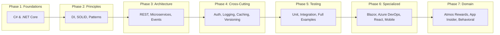

# Alaska Airlines Interview Preparation

**Position:** Software Engineer — Membership Atmos Rewards Team
**Date:** February 26, 2026

## Study Roadmap

## Table of Contents

### C# & .NET Foundations

| # | Document | Key Topics |
|---|----------|------------|
| 01 | [.NET Core Fundamentals](01-dotnet-core.md) | Middleware pipeline, configuration, hosting |
| 02 | [C# Fundamentals](02-csharp-fundamentals.md) | async/await, LINQ, records, generics, pattern matching |
| 03 | [Garbage Collection & Memory](03-csharp-garbage-collection.md) | GC generations, IDisposable, Span\<T\>, memory pressure |

### Architecture Principles

| # | Document | Key Topics |
|---|----------|------------|
| 04 | [Dependency Injection](04-dependency-injection.md) | DI lifetimes, constructor injection, Options pattern |
| 05 | [SOLID Principles](05-solid-principles.md) | SRP, OCP, LSP, ISP, DIP with before/after examples |
| 06 | [Design Patterns](06-design-patterns.md) | Factory, Strategy, Repository, Decorator, Observer, MediatR |

### System Architecture

| # | Document | Key Topics |
|---|----------|------------|
| 07 | [RESTful API Design](07-restful-api-design.md) | REST principles, HTTP methods, pagination, error handling |
| 08 | [Microservices Architecture](08-microservices-architecture.md) | Service decomposition, API Gateway, Saga, Circuit Breaker |
| 09 | [Event-Driven Architecture](09-event-driven-architecture.md) | Events, pub/sub, event sourcing, outbox pattern |

### Cross-Cutting Concerns

| # | Document | Key Topics |
|---|----------|------------|
| 10 | [Authentication & Authorization](10-authentication-authorization.md) | OAuth 2.0, JWT, policy-based auth |
| 11 | [Logging & Observability](11-logging-observability.md) | ILogger, Serilog, distributed tracing, health checks |
| 15 | [Caching & Database Patterns](15-caching-and-database-patterns.md) | Redis, IMemoryCache, CQRS, Repository pattern |
| 16 | [API Versioning & Rate Limiting](16-api-versioning-rate-limiting.md) | Versioning strategies, rate limiting middleware |

### Testing

| # | Document | Key Topics |
|---|----------|------------|
| 12 | [Unit Testing](12-unit-testing.md) | xUnit, Moq, AAA pattern, parameterized tests |
| 13 | [Integration Testing](13-integration-testing.md) | WebApplicationFactory, test containers, API testing |
| 14 | [DI & Testing Full Walkthrough](14-csharp-di-testing-examples.md) | Complete domain model + services + DI + tests |

### Specialized Technologies

| # | Document | Key Topics |
|---|----------|------------|
| 17 | [Blazor WebAssembly](17-blazor-webassembly.md) | Components, data binding, API integration |
| 18 | [Azure DevOps](18-azure-devops.md) | Pipelines YAML, CI/CD, branch policies |

### Frontend & Mobile

| # | Document | Key Topics |
|---|----------|------------|
| 21 | [React Frontend](21-react-frontend.md) | Hooks, state management, component patterns, API integration |
| 22 | [Mobile Development](22-mobile-development.md) | Kotlin, Swift, React Native, cross-platform |

### Domain-Specific & Behavioral

| # | Document | Key Topics |
|---|----------|------------|
| 19 | [Account Management & Loyalty](19-account-management-loyalty.md) | Atmos Rewards tiers, points, redemption, DDD |
| 20 | [App Insider Features](20-app-insider.md) | Push notifications, feature flags, BFF pattern |
| 23 | [Behavioral & System Design](23-behavioral-system-design.md) | STAR method, system design exercises, interviewer questions |

## Domain Context

All examples use the **Atmos Rewards** domain:

- **Models:** `Member`, `RewardTransaction`, `TierLevel` (Gold, MVP, MVP Gold)
- **Services:** `RewardPointsService`, `TierEvaluationService`, `PartnerEarningService`
- **Scenarios:** Earning points from flights, redeeming for awards, tier evaluation, partner integrations
