# Array Algorithms - Visual Guide

This comprehensive guide provides visual representations of key array algorithms and patterns essential for technical interviews.

## Algorithm Categories Overview

```mermaid
graph TB
    A[Array Algorithms] --> B[Basic Operations]
    A --> C[Sorting & Searching]
    A --> D[Two Pointers]
    A --> E[Sliding Window]
    A --> F[Dynamic Programming]
    A --> G[Advanced Techniques]
    
    B --> B1[Array Traversal]
    B --> B2[Element Operations]
    B --> B3[Subarray Problems]
    
    C --> C1[Binary Search]
    C --> C2[Sorting Algorithms]
    C --> C3[Search Variations]
    
    D --> D1[Opposite Ends]
    D --> D2[Same Direction]
    D --> D3[Cycle Detection]
    
    E --> E1[Fixed Size]
    E --> E2[Variable Size]
    E --> E3[Multiple Windows]
    
    F --> F1[1D DP]
    F --> F2[2D DP]
    F --> F3[State Machines]
    
    G --> G1[Prefix/Suffix]
    G --> G2[Interval Problems]
    G --> G3[Matrix Operations]
```

## Complexity Analysis Reference

```mermaid
graph TB
    subgraph "Time Complexity Hierarchy"
        T1[O(1) - Direct Access]
        T2[O(log n) - Binary Search]
        T3[O(n) - Linear Scan]
        T4[O(n log n) - Efficient Sort]
        T5[O(n²) - Nested Loops]
        T6[O(n³) - Triple Nested]
        T7[O(2ⁿ) - Exponential]
        
        T1 --> T2 --> T3 --> T4 --> T5 --> T6 --> T7
    end
    
    subgraph "Space Complexity"
        S1[O(1) - In-place]
        S2[O(log n) - Recursion Stack]
        S3[O(n) - Linear Space]
        S4[O(n²) - 2D Arrays]
    end
```

## Problem Pattern Recognition

```mermaid
flowchart TD
    Start([Array Problem]) --> Q1{Sorted Array?}
    
    Q1 -->|Yes| Q2{Search Problem?}
    Q1 -->|No| Q3{Need Sorting?}
    
    Q2 -->|Yes| BinarySearch[Binary Search Variants<br/>O(log n)]
    Q2 -->|No| Q4{Two Elements?}
    
    Q3 -->|Yes| SortFirst[Sort Then Process<br/>O(n log n)]
    Q3 -->|No| Q5{Subarray Problem?}
    
    Q4 -->|Yes| TwoPointers[Two Pointers<br/>O(n)]
    Q4 -->|No| Q6{All Subarrays?}
    
    Q5 -->|Yes| Q7{Fixed/Variable Size?}
    Q5 -->|No| Q8{Optimization Problem?}
    
    Q6 -->|Yes| NestedLoops[Nested Loops<br/>O(n²) or O(n³)]
    Q6 -->|No| Q9{Matrix Problem?}
    
    Q7 -->|Fixed| SlidingWindow[Sliding Window<br/>O(n)]
    Q7 -->|Variable| TwoPointersVar[Two Pointers/HashMap<br/>O(n)]
    
    Q8 -->|Yes| DP[Dynamic Programming<br/>Various complexity]
    Q8 -->|No| Greedy[Greedy Algorithm<br/>O(n) or O(n log n)]
    
    Q9 -->|Yes| Matrix[Matrix Algorithms<br/>O(m×n)]
    Q9 -->|No| Advanced[Advanced Techniques<br/>Problem-specific]
```

## Common Array Patterns

### 1. Two Pointers Pattern

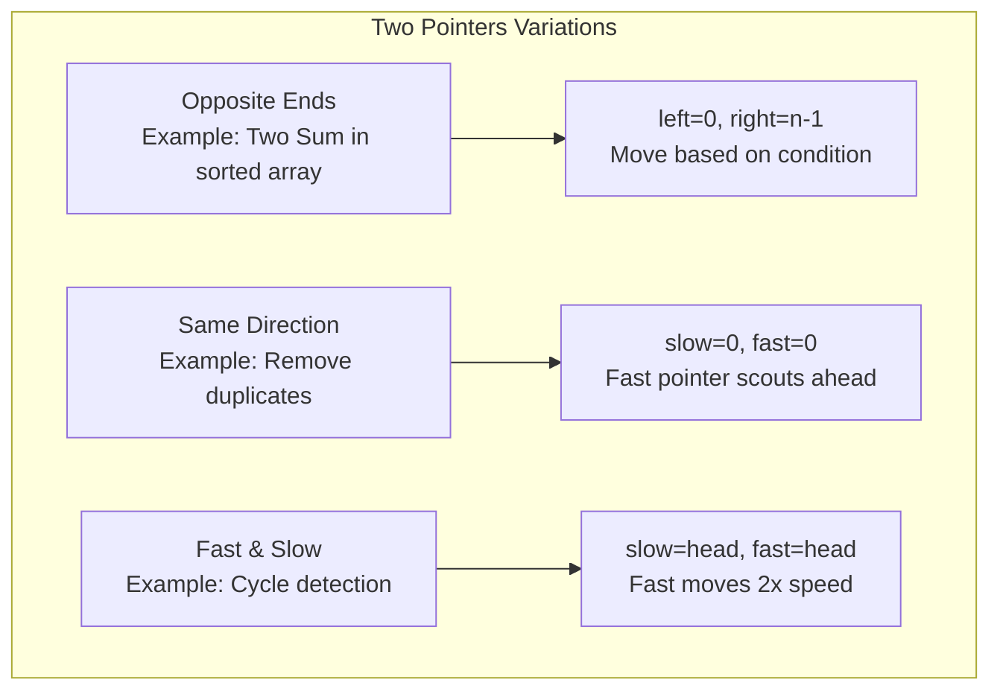

### 2. Sliding Window Pattern

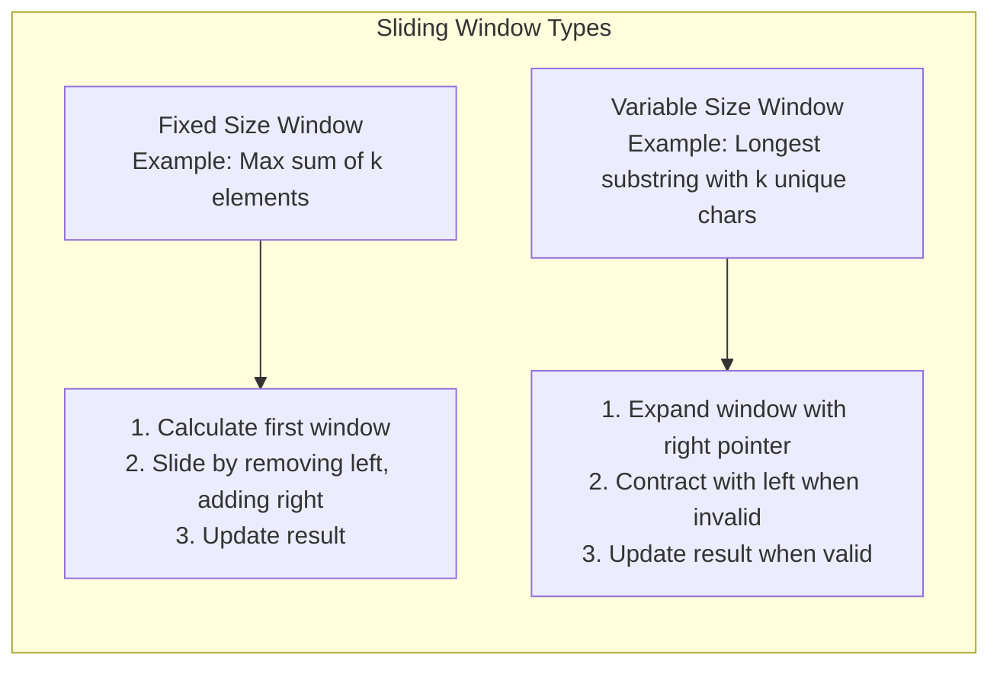

### 3. Prefix/Suffix Pattern

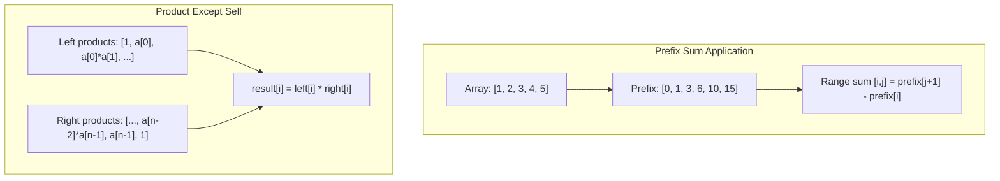

## Algorithm Visualizations

### Binary Search Variants

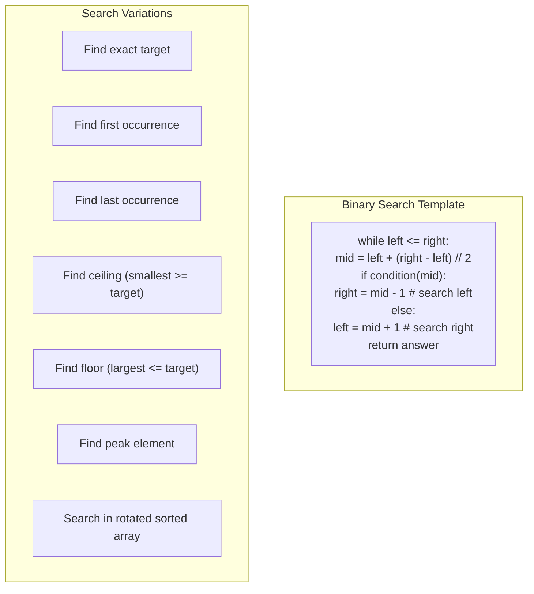

### Merge Intervals Algorithm

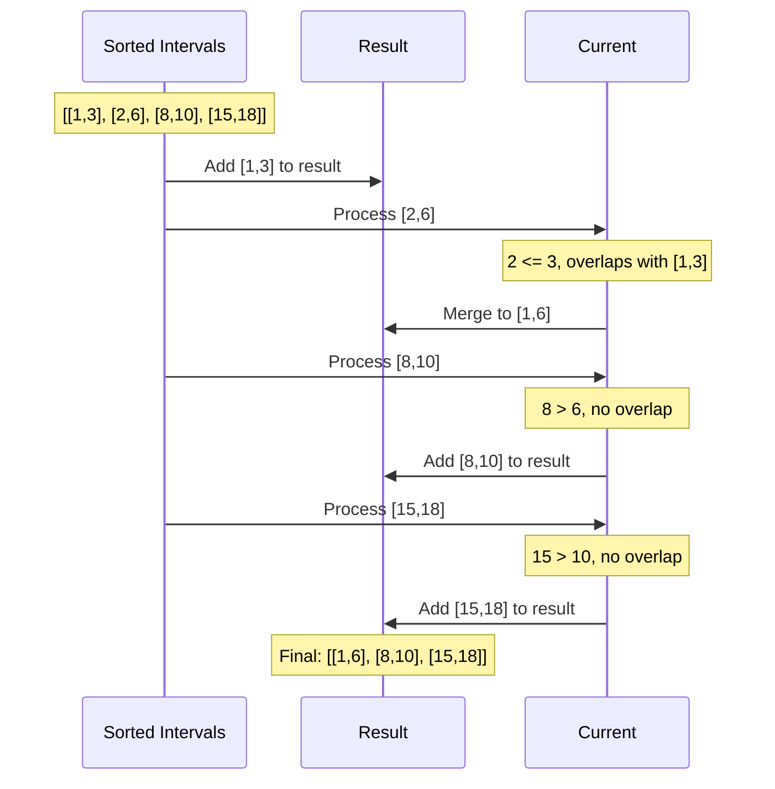

### Kadane's Algorithm (Maximum Subarray)

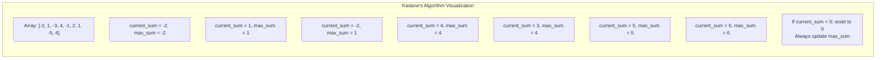

## Dynamic Programming on Arrays

### 1D DP Patterns

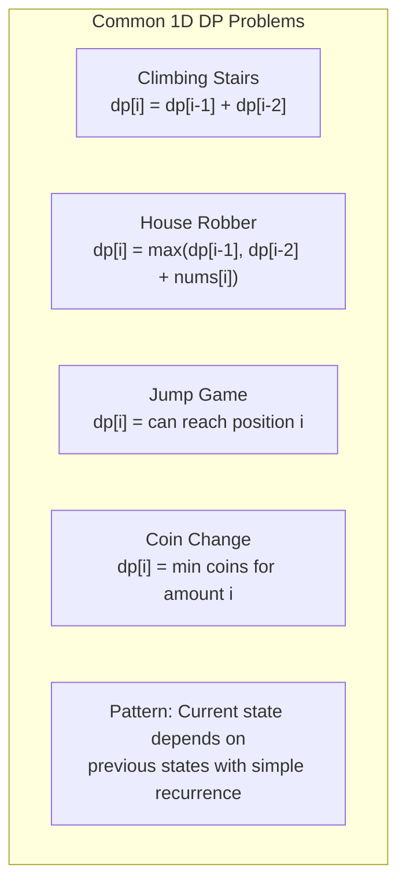

### 2D DP Patterns

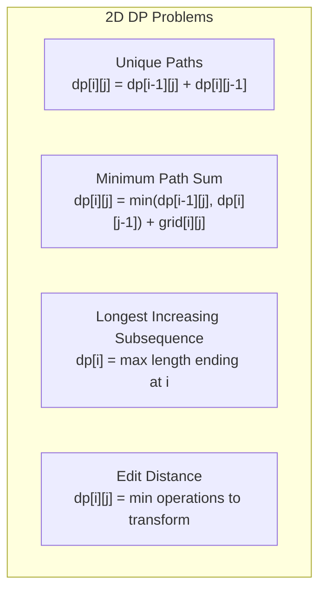

## Matrix Algorithms

### Matrix Traversal Patterns

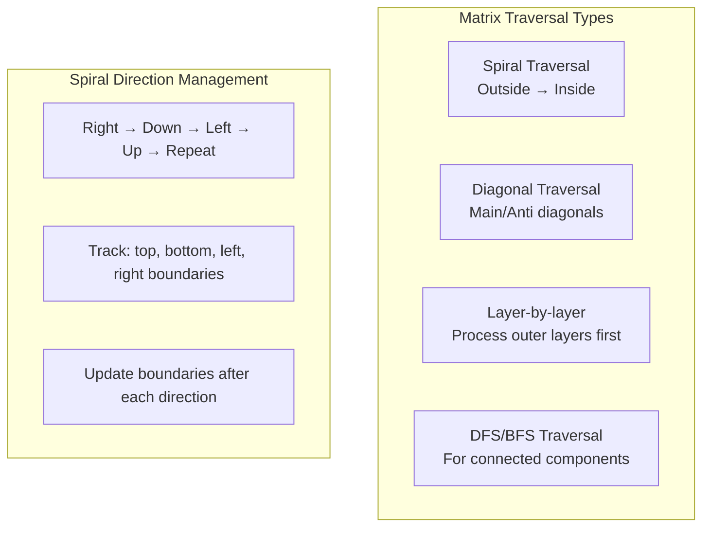

### Matrix Rotation and Transformation

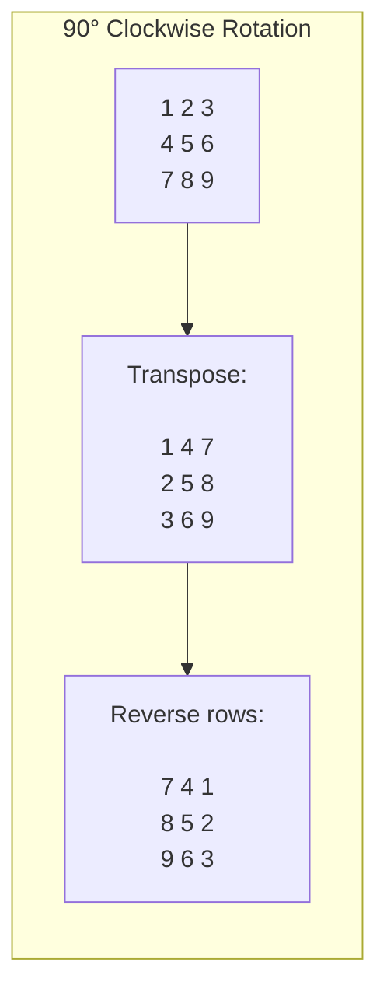

## Advanced Array Techniques

### Union-Find for Array Problems

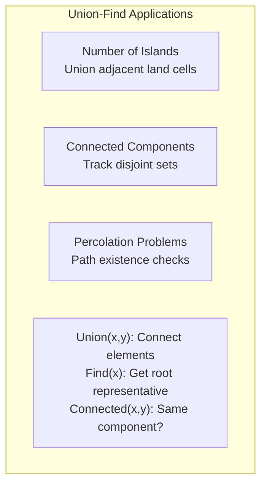

### Monotonic Stack/Queue

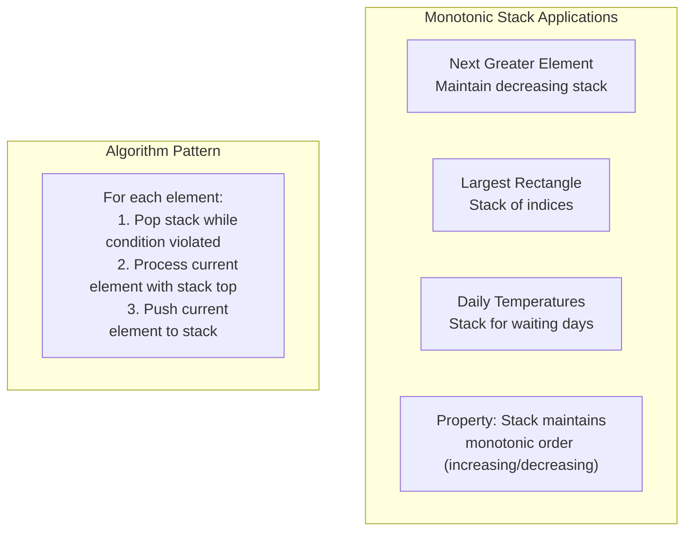

## Problem Complexity Guide

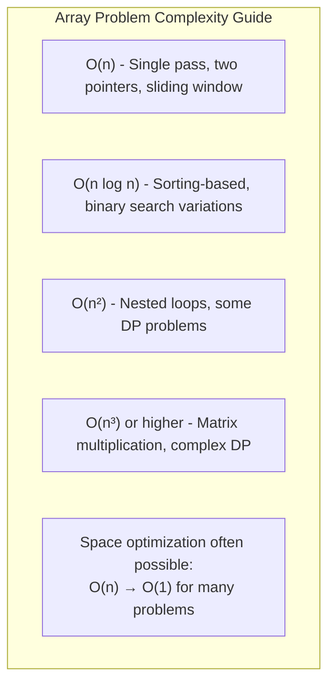

## Strategy Selection Framework

```mermaid
flowchart TD
    Problem[Array Problem] --> Constraints{Check Constraints}
    
    Constraints -->|n ≤ 100| Quadratic[O(n²) solutions acceptable]
    Constraints -->|n ≤ 10⁵| Linear[O(n) or O(n log n) needed]
    Constraints -->|n ≤ 10⁶| StrictLinear[O(n) or better required]
    
    Quadratic --> BruteForce[Consider brute force first]
    Linear --> Optimize[Look for patterns/sorting]
    StrictLinear --> Advanced[Advanced techniques needed]
    
    BruteForce --> Correct{Correct solution?}
    Optimize --> Efficient{Efficient enough?}
    Advanced --> Feasible{Feasible approach?}
    
    Correct -->|Yes| Optimize2[Then optimize if needed]
    Efficient -->|Yes| Implement[Implement solution]
    Feasible -->|Yes| Implement
    
    Correct -->|No| Debug[Debug approach]
    Efficient -->|No| Rethink[Rethink algorithm]
    Feasible -->|No| Research[Research advanced techniques]
```

## Next Steps

- [Basic Array Operations](basic-operations.md)
- [Sorting and Searching](sorting-searching.md)
- [Two Pointers and Sliding Window](two-pointers-sliding-window.md)
- [Dynamic Programming on Arrays](dynamic-programming.md)
- [Advanced Array Techniques](advanced-techniques.md)

## Quick Reference Card

| Problem Type | Algorithm | Time | Space | Key Insight |
|--------------|-----------|------|-------|-------------|
| Two Sum | HashMap | O(n) | O(n) | Store complement |
| Subarray Sum | Prefix Sum | O(n) | O(1) | Cumulative sums |
| Sliding Window | Two Pointers | O(n) | O(1) | Expand/contract |
| Binary Search | Divide & Conquer | O(log n) | O(1) | Eliminate half |
| Merge Intervals | Sorting | O(n log n) | O(1) | Sort by start time |
| Matrix Spiral | Boundary Tracking | O(m×n) | O(1) | Direction management |