# Basic Array Operations - Visual Guide

This guide covers fundamental array operations with comprehensive visualizations and complexity analysis.

## Array Access and Manipulation

### Random Access Visualization

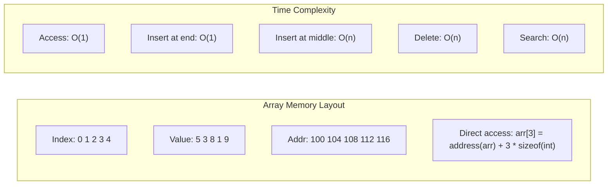

## Two Sum Problem Patterns

### Brute Force Approach

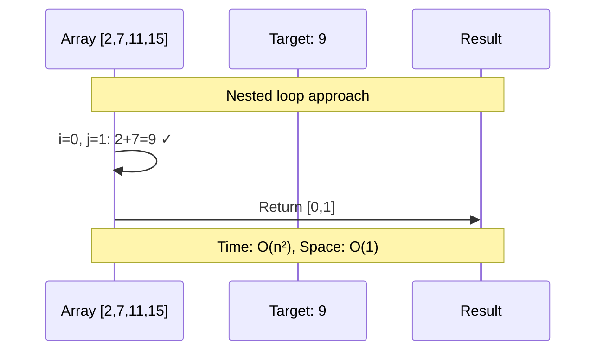

### HashMap Optimization

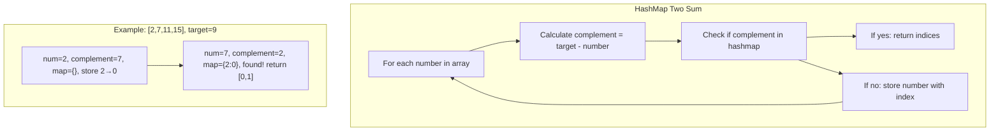

## Three Sum Problem

### Sorting + Two Pointers Approach

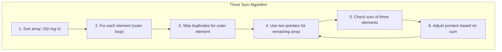

### Visual Example: [-1,0,1,2,-1,-4]

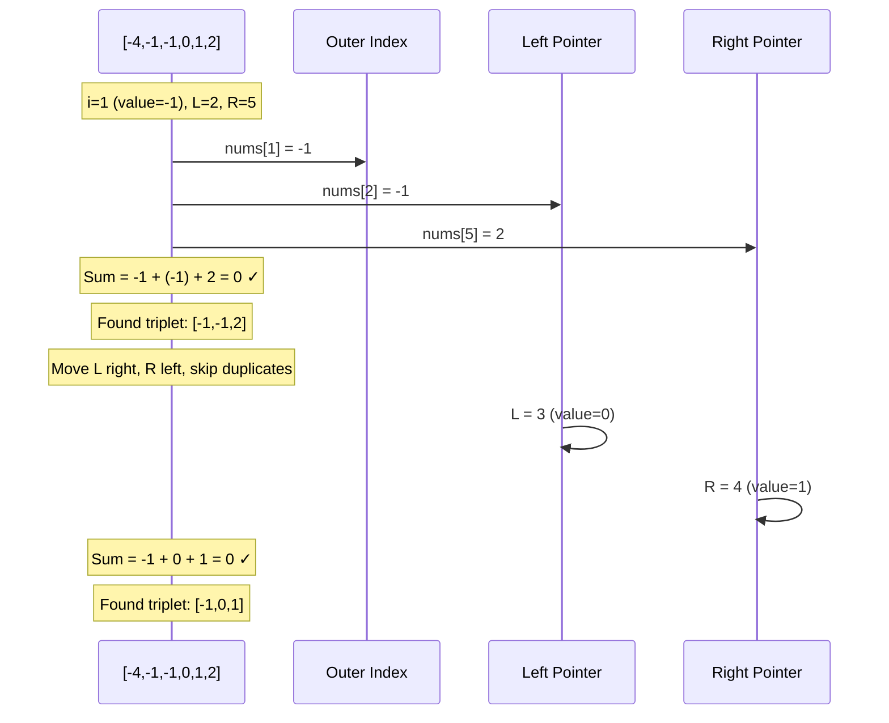

## Container With Most Water

### Two Pointers Strategy

```mermaid
graph TB
    subgraph "Water Container Visualization"
        Array["Heights: [1,8,6,2,5,4,8,3,7]"]
        Initial["left=0 (height=1), right=8 (height=7)"]
        Area1["Area = min(1,7) × (8-0) = 8"]
        
        Move1["Move left++ (shorter line)"]
        State2["left=1 (height=8), right=8 (height=7)"]
        Area2["Area = min(8,7) × (8-1) = 49"]
        
        Array --> Initial --> Area1 --> Move1 --> State2 --> Area2
    end
    
    subgraph "Algorithm Logic"
        Rule["Always move pointer with shorter height"]
        Reason["Moving taller pointer can't increase area<br/>(width decreases, height limited by shorter)"]
        Optimal["This guarantees we find maximum area"]
        
        Rule --> Reason --> Optimal
    end
```

## Sliding Window Maximum

### Deque-Based Solution

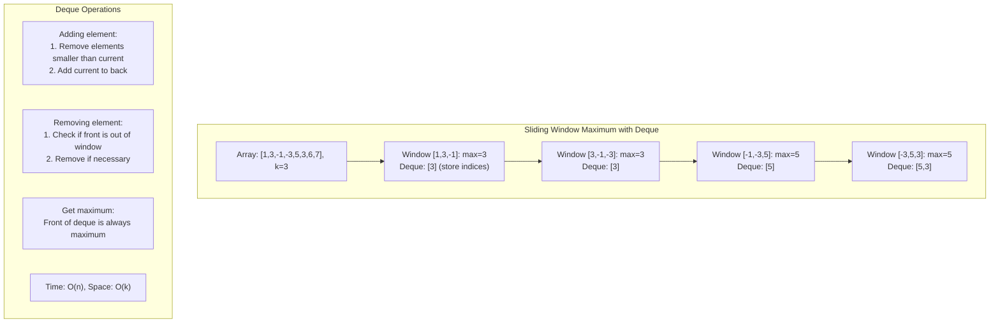

## Array Rotation

### Reversal Algorithm

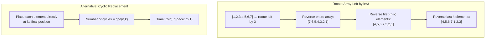

## Kadane's Algorithm (Maximum Subarray)

### Algorithm Visualization

```mermaid
graph TB
    subgraph "Kadane's Algorithm Step-by-Step"
        Array["[-2,1,-3,4,-1,2,1,-5,4]"]
        
        Init["current_sum = 0, max_sum = -∞"]
        
        S1["i=0: current_sum = max(0-2, -2) = -2, max_sum = -2"]
        S2["i=1: current_sum = max(-2+1, 1) = 1, max_sum = 1"]
        S3["i=2: current_sum = max(1-3, -3) = -2, max_sum = 1"]
        S4["i=3: current_sum = max(-2+4, 4) = 4, max_sum = 4"]
        S5["i=4: current_sum = max(4-1, -1) = 3, max_sum = 4"]
        S6["i=5: current_sum = max(3+2, 2) = 5, max_sum = 5"]
        S7["i=6: current_sum = max(5+1, 1) = 6, max_sum = 6"]
        
        Array --> Init --> S1 --> S2 --> S3 --> S4 --> S5 --> S6 --> S7
    end
    
    subgraph "Key Insight"
        Insight["If current_sum becomes negative,<br/>start fresh (reset to 0)<br/>Negative prefix can only hurt"]
    end
```

## Stock Trading Problems

### Single Transaction

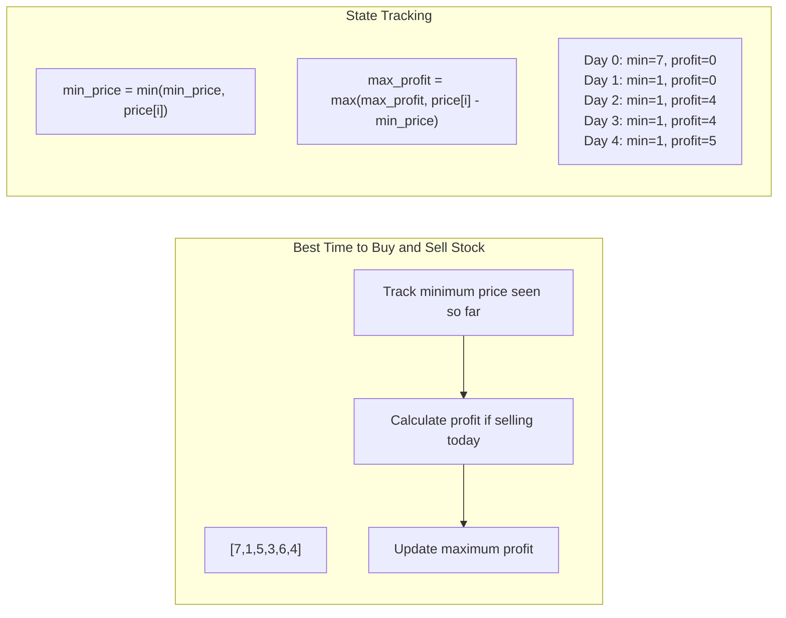

### Multiple Transactions

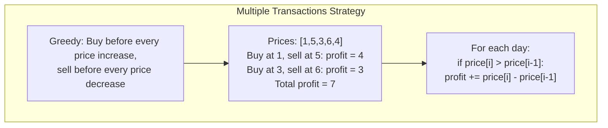

## Dutch Flag Problem (Sort Colors)

### Three-Way Partitioning

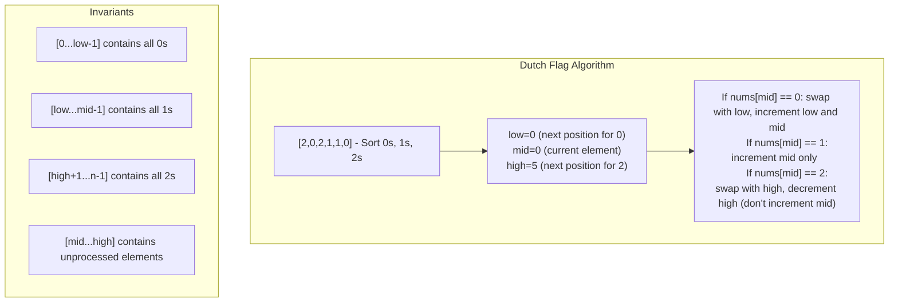

## Product of Array Except Self

### Two-Pass Solution

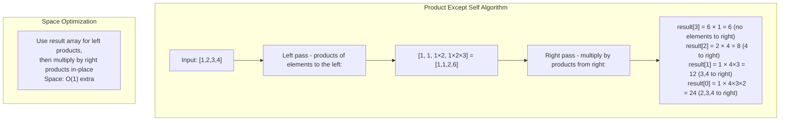

## First Missing Positive

### Cyclic Sort Approach

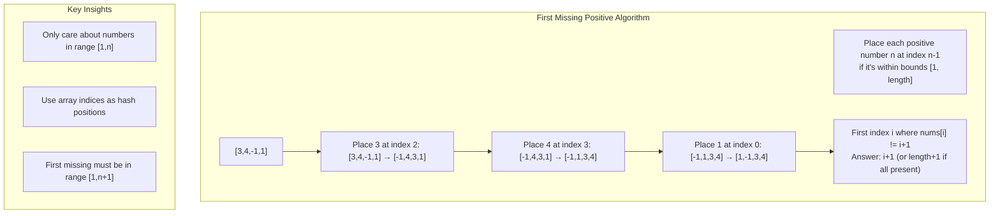

## Trapping Rain Water

### Two Pointers Solution

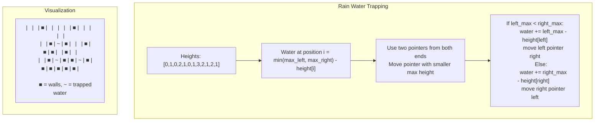

## Performance Comparison Table

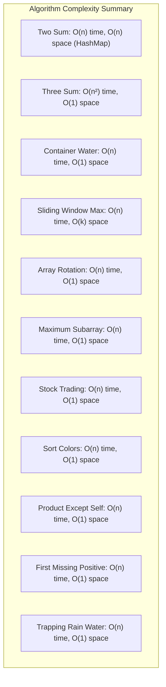

## Problem-Solving Strategy

```mermaid
flowchart TD
    Problem[Array Problem] --> Analyze{Analyze Requirements}
    
    Analyze -->|Need all pairs| PairProblems[Consider O(n²) approaches<br/>or HashMap optimization]
    Analyze -->|Subarray problem| Subarray[Sliding window or<br/>prefix sum techniques]
    Analyze -->|Sorted array| Sorted[Binary search or<br/>two pointers]
    Analyze -->|Optimization| DP[Dynamic programming<br/>or greedy approach]
    
    PairProblems --> TwoSum[Two Sum variants]
    Subarray --> MaxSubarray[Maximum subarray,<br/>sliding window maximum]
    Sorted --> BinarySearch[Search problems,<br/>merge operations]
    DP --> OptimalSolution[Kadane's algorithm,<br/>stock trading]
    
    Optimize["Always consider:<br/>1. Can we do it in one pass?<br/>2. Can we use O(1) extra space?<br/>3. Can we avoid sorting?"]
```

## Key Insights

1. **Array as HashMap**: Use array indices as hash keys when elements are in known range
2. **Two Pointers**: Powerful for sorted arrays and optimization problems  
3. **Sliding Window**: Essential for subarray problems with constraints
4. **In-place Operations**: Many problems can be solved without extra space
5. **Preprocessing**: Sometimes sorting or prefix computation enables efficient queries
6. **Invariant Maintenance**: Keep track of what each section of array represents

## Next: [Sorting and Searching Algorithms →](sorting-searching.md)