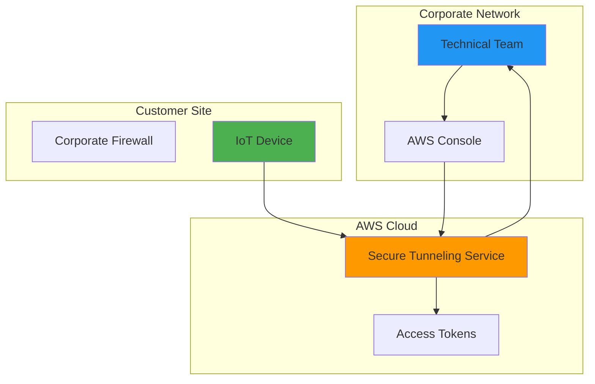
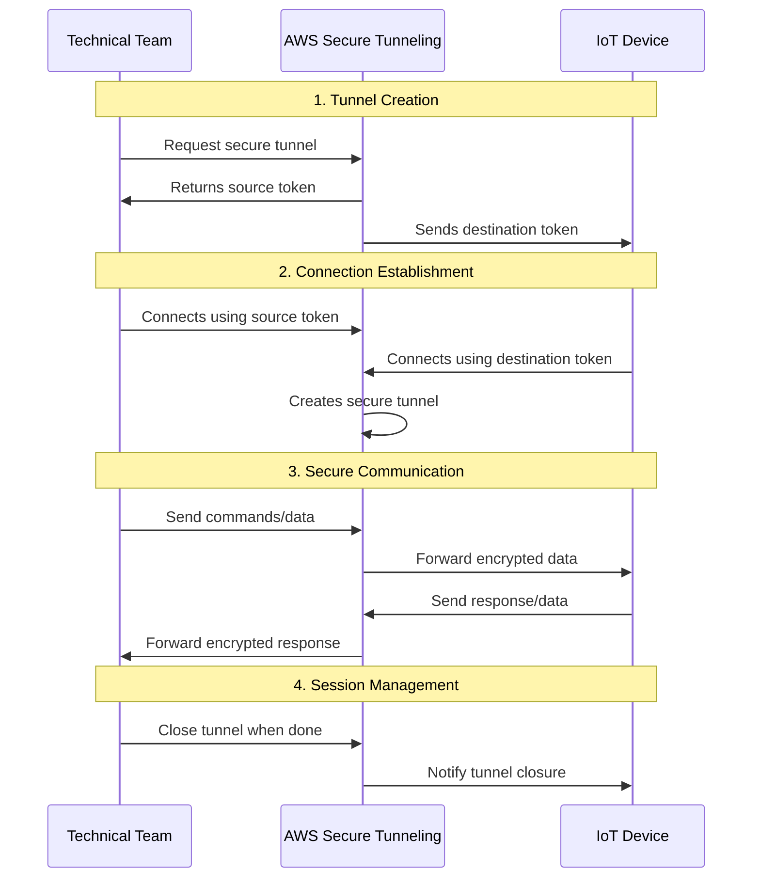
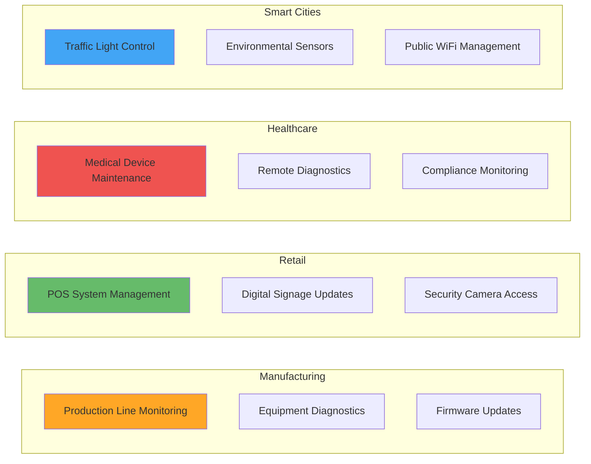

# AWS IoT Secure Tunneling: Executive Overview

## What is AWS IoT Secure Tunneling?

AWS IoT Secure Tunneling is a managed service that enables secure, bidirectional communication with IoT devices deployed behind restrictive firewalls. Think of it as a secure "telephone line" that allows your technical teams to remotely access and manage devices in the field without compromising network security.

## Business Problem it Solves

### Traditional Challenges
- **Field Service Costs**: Sending technicians to remote locations for device maintenance
- **Security Risks**: Opening firewall ports creates vulnerabilities
- **Downtime Impact**: Devices going offline affect business operations
- **Scalability Issues**: Managing thousands of devices manually is inefficient

### AWS Secure Tunneling Solution
- **Remote Access**: Connect to devices anywhere in the world instantly
- **Zero Firewall Changes**: No need to modify existing network security
- **Secure Communication**: End-to-end encryption protects data
- **Cost Reduction**: Eliminate most field service visits

## How It Works - High Level Architecture

## Step-by-Step Process Flow

## Key Benefits for Business

### 🚀 **Operational Efficiency**
- **Instant Access**: Connect to any device within minutes
- **24/7 Support**: Resolve issues outside business hours
- **Predictive Maintenance**: Monitor and fix before failures occur

### 💰 **Cost Savings**
- **Reduced Travel**: Up to 80% fewer field service visits
- **Faster Resolution**: Minutes instead of days to fix issues
- **Preventive Care**: Avoid costly equipment failures

### 🔒 **Enhanced Security**
- **No Firewall Changes**: Existing security policies remain intact
- **Encrypted Communication**: Data protected in transit
- **Audit Trail**: Complete logging of all access attempts

### 📈 **Business Continuity**
- **Minimal Downtime**: Quick issue resolution
- **Scalable Solution**: Handle thousands of devices
- **Reliable Service**: 99.9% uptime SLA from AWS

## Real-World Use Cases

## Security & Compliance

### Security Features
- **End-to-End Encryption**: AES-256 encryption
- **Token-Based Access**: Time-limited, single-use tokens
- **No Inbound Connections**: Devices initiate all connections
- **Complete Audit Logs**: Track all access and activities

### Compliance Standards
- **SOC 2 Type II** certified
- **ISO 27001** compliant
- **HIPAA** eligible service
- **GDPR** compliant data handling
